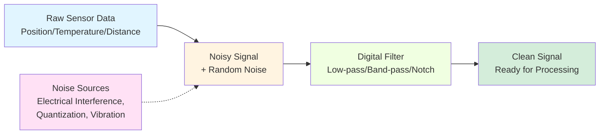
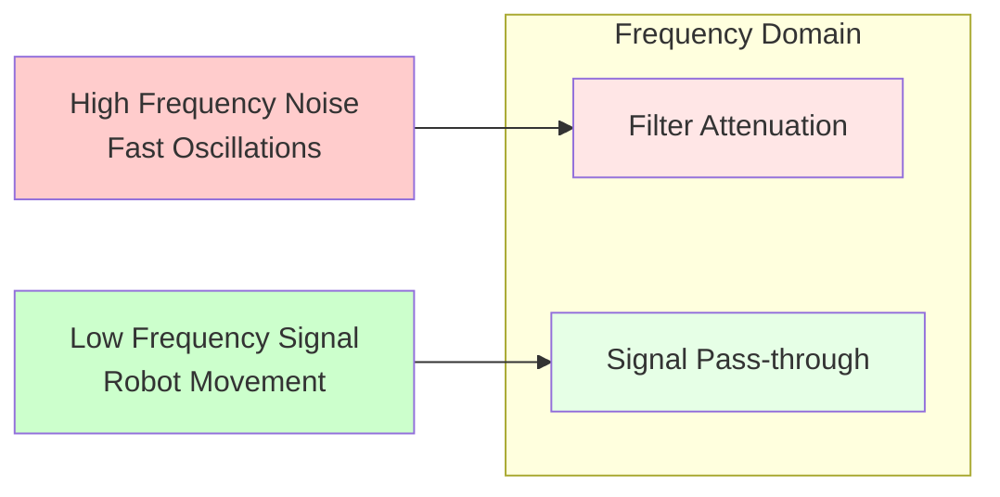
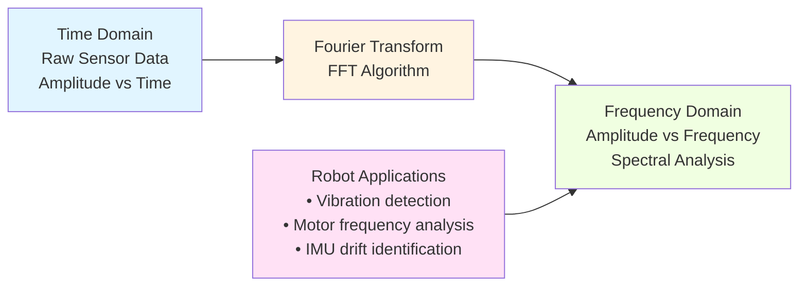

import MermaidDiagram from '@site/src/components/MermaidDiagram';
import CodeExample from '@site/src/components/CodeExample';
import Exercise from '@site/src/components/Exercise';
import Quiz from '@site/src/components/Quiz';
import PrerequisiteCheck from '@site/src/components/PrerequisiteCheck';

<PrerequisiteCheck prerequisites={frontMatter.prerequisites} />

# Chapter 4: Digital Signal Processing Basics for Robotics

## Why This Matters

In humanoid robots like Tesla Optimus and Figure 02, sensors continuously generate streams of data: IMUs report orientation at 100+ Hz, LiDAR scans the environment at thousands of points per second, and cameras capture visual information at 30+ frames per second. This raw sensor data is often noisy, contains artifacts, and needs processing before it can be used for navigation, control, or decision-making. Digital Signal Processing (DSP) techniques filter noise, extract meaningful information, and prepare sensor data for higher-level algorithms. Without proper signal processing, robots would make erratic movements, misinterpret their environment, and fail to perform basic tasks reliably.

## Analogy: The Orchestra Conductor's Hearing

### Everyday Scenario
Imagine an orchestra conductor listening to a complex musical performance. The conductor hears multiple instruments simultaneously: violins, cellos, brass, percussion—all playing different notes at different volumes. The conductor's trained ear can focus on specific sections (like the strings) while filtering out others (like the percussion during a quiet passage). When a violin plays slightly out of tune, the conductor can identify the specific frequency and correct it. The conductor also anticipates musical patterns and can predict upcoming sections based on previous measures.

### The Connection to Robotics
Robot sensors receive multiple data streams simultaneously (position, velocity, orientation) that must be separated and analyzed. **Low-pass filters** remove high-frequency noise (like the conductor filtering out sudden percussion crashes). **Fourier transforms** identify specific frequency components (like the conductor identifying which instrument is playing out of tune). **Signal prediction** helps robots anticipate movements based on past patterns (like the conductor anticipating the next musical phrase).

### Where the Analogy Breaks Down
Musical signals are typically periodic and predictable; robot sensor data can be highly irregular and influenced by unexpected environmental factors. Human perception is intuitive; robots require mathematical algorithms to process signals.

### In Robotics Terms
**Digital Signal Processing** in robotics involves filtering, transforming, and analyzing sensor data streams to extract meaningful information for control, navigation, and perception. **Low-pass filters** remove sensor noise, **Fourier transforms** analyze frequency content, and **digital filters** prepare data for robot decision-making systems.

## Core Concepts

### 1. Sensor Noise and Filtering Fundamentals

Robotic sensors produce signals contaminated with various types of noise that must be filtered for reliable operation.

**Mermaid Diagram**: Sensor Noise Filtering Process



*Alt-text: Flowchart showing raw sensor data flowing through noisy signal stage, then through digital filter, resulting in clean signal. Noise sources like electrical interference and vibration feed into the noisy signal stage.*

**Types of Sensor Noise in Robotics:**
- **White Noise**: Random fluctuations across all frequencies (common in IMUs)
- **Quantization Noise**: Discrete sampling artifacts (from digital sensors)
- **Electromagnetic Interference**: Noise from motors and electronics
- **Vibration Noise**: Mechanical disturbances affecting sensors

### 2. Low-Pass Filters for Noise Reduction

Low-pass filters allow low-frequency signals to pass while attenuating high-frequency noise—a critical tool for smoothing robot sensor data.

**Mathematical Representation:**
```
y[n] = α * x[n] + (1-α) * y[n-1]
```
Where:
- `y[n]` = current filtered output
- `x[n]` = current raw input
- `α` = filter coefficient (0 < α < 1)
- `y[n-1]` = previous filtered output

**Mermaid Diagram**: Low-Pass Filter Response



*Alt-text: Diagram showing high frequency noise being attenuated by filter while low frequency signals pass through. High frequency noise is marked in red, low frequency signals in green.*

### 3. Fourier Transform for Frequency Analysis

The Fourier Transform decomposes signals into their frequency components, enabling analysis of sensor data in the frequency domain.

**Mermaid Diagram**: Time vs Frequency Domain



*Alt-text: Flowchart showing time domain sensor data being transformed by FFT algorithm to frequency domain analysis. Robot applications like vibration detection and motor analysis connect to the frequency domain output.*

## Worked Example: Implementing DSP Filters for Robot Sensors

Let's build a complete DSP system for processing robot sensor data:

```python
#!/usr/bin/env python3
"""
Digital Signal Processing for Robot Sensors
Implementing filters and analysis for noisy sensor data
"""

import numpy as np
import matplotlib.pyplot as plt
from scipy import signal
import rclpy
from rclpy.node import Node
from sensor_msgs.msg import Imu, LaserScan
from geometry_msgs.msg import Vector3
import time


class DSPFilter:
    """
    Digital Signal Processing Filter for Robot Sensors
    """

    def __init__(self, cutoff_freq=10.0, sample_rate=100.0):
        """
        Initialize filter with cutoff frequency and sample rate

        Args:
            cutoff_freq: Cutoff frequency in Hz
            sample_rate: Sampling rate in Hz
        """
        self.cutoff_freq = cutoff_freq
        self.sample_rate = sample_rate

        # Calculate filter coefficient for simple low-pass filter
        dt = 1.0 / sample_rate
        RC = 1.0 / (2 * np.pi * cutoff_freq)
        self.alpha = dt / (RC + dt)

        # Store previous output for recursive filtering
        self.previous_output = 0.0
        self.initialized = False

    def simple_low_pass(self, input_value):
        """
        Apply simple first-order low-pass filter
        y[n] = α * x[n] + (1-α) * y[n-1]
        """
        if not self.initialized:
            self.previous_output = input_value
            self.initialized = True
            return input_value

        output = self.alpha * input_value + (1 - self.alpha) * self.previous_output
        self.previous_output = output
        return output

    def moving_average(self, input_value, window_size=5):
        """
        Apply moving average filter
        """
        if not hasattr(self, 'buffer'):
            self.buffer = []

        self.buffer.append(input_value)

        # Keep only the most recent values
        if len(self.buffer) > window_size:
            self.buffer.pop(0)

        return np.mean(self.buffer)

    def butterworth_filter(self, input_signal, order=2):
        """
        Apply Butterworth low-pass filter using scipy
        """
        nyquist = self.sample_rate / 2.0
        normal_cutoff = self.cutoff_freq / nyquist

        # Design Butterworth filter
        b, a = signal.butter(order, normal_cutoff, btype='low', analog=False)

        # Apply filter to signal
        filtered_signal = signal.filtfilt(b, a, input_signal)

        return filtered_signal


class IMUProcessor(Node):
    """
    Process IMU data with DSP filters
    """

    def __init__(self):
        super().__init__('imu_processor')

        # Initialize DSP filters for different sensor components
        self.accel_filter = DSPFilter(cutoff_freq=5.0, sample_rate=100.0)  # 5Hz cutoff for acceleration
        self.gyro_filter = DSPFilter(cutoff_freq=10.0, sample_rate=100.0)  # 10Hz cutoff for gyroscope
        self.mag_filter = DSPFilter(cutoff_freq=1.0, sample_rate=100.0)    # 1Hz cutoff for magnetometer

        # Subscribe to IMU data
        self.imu_sub = self.create_subscription(
            Imu, '/imu/data', self.imu_callback, 10
        )

        # Publish filtered data
        self.filtered_pub = self.create_publisher(Imu, '/imu/filtered', 10)

        # Store raw and filtered data for analysis
        self.raw_data_buffer = []
        self.filtered_data_buffer = []

        self.get_logger().info('IMU Processor with DSP filters initialized')

    def imu_callback(self, msg):
        """
        Process incoming IMU data with filters
        """
        # Apply filters to each component
        filtered_msg = Imu()
        filtered_msg.header = msg.header

        # Filter linear acceleration
        filtered_msg.linear_acceleration.x = self.accel_filter.simple_low_pass(
            msg.linear_acceleration.x
        )
        filtered_msg.linear_acceleration.y = self.accel_filter.simple_low_pass(
            msg.linear_acceleration.y
        )
        filtered_msg.linear_acceleration.z = self.accel_filter.simple_low_pass(
            msg.linear_acceleration.z
        )

        # Filter angular velocity
        filtered_msg.angular_velocity.x = self.gyro_filter.simple_low_pass(
            msg.angular_velocity.x
        )
        filtered_msg.angular_velocity.y = self.gyro_filter.simple_low_pass(
            msg.angular_velocity.y
        )
        filtered_msg.angular_velocity.z = self.gyro_filter.simple_low_pass(
            msg.angular_velocity.z
        )

        # For demonstration, copy orientation (would also be filtered in real system)
        filtered_msg.orientation = msg.orientation

        # Publish filtered data
        self.filtered_pub.publish(filtered_msg)

        # Store data for analysis
        self.raw_data_buffer.append([
            msg.linear_acceleration.x,
            msg.linear_acceleration.y,
            msg.linear_acceleration.z
        ])
        self.filtered_data_buffer.append([
            filtered_msg.linear_acceleration.x,
            filtered_msg.linear_acceleration.y,
            filtered_msg.linear_acceleration.z
        ])

        # Keep buffer size reasonable
        if len(self.raw_data_buffer) > 1000:
            self.raw_data_buffer.pop(0)
            self.filtered_data_buffer.pop(0)

    def analyze_frequency_content(self):
        """
        Analyze frequency content of stored sensor data
        """
        if len(self.raw_data_buffer) < 100:
            return None

        # Convert to numpy array
        raw_data = np.array(self.raw_data_buffer)
        filtered_data = np.array(self.filtered_data_buffer)

        # Analyze X-axis acceleration data
        raw_x = raw_data[:, 0]
        filtered_x = filtered_data[:, 0]

        # Apply FFT to analyze frequency content
        raw_fft = np.fft.fft(raw_x)
        filtered_fft = np.fft.fft(filtered_x)

        # Calculate frequency bins
        n = len(raw_x)
        sample_rate = 100.0  # Assumed sample rate
        freq_bins = np.fft.fftfreq(n, 1/sample_rate)

        # Return frequency analysis results
        return {
            'frequencies': freq_bins[:n//2],  # Only positive frequencies
            'raw_magnitude': np.abs(raw_fft[:n//2]),
            'filtered_magnitude': np.abs(filtered_fft[:n//2]),
            'sample_rate': sample_rate
        }


class SignalAnalyzer:
    """
    Analyze and visualize sensor signals
    """

    @staticmethod
    def plot_signal_comparison(raw_signal, filtered_signal, sample_rate=100.0):
        """
        Plot raw vs filtered signals
        """
        n = len(raw_signal)
        time_axis = np.arange(n) / sample_rate

        plt.figure(figsize=(12, 8))

        # Plot time domain signals
        plt.subplot(2, 1, 1)
        plt.plot(time_axis, raw_signal, label='Raw Signal', alpha=0.7)
        plt.plot(time_axis, filtered_signal, label='Filtered Signal', linewidth=2)
        plt.xlabel('Time (s)')
        plt.ylabel('Amplitude')
        plt.title('Raw vs Filtered Sensor Signal')
        plt.legend()
        plt.grid(True)

        # Plot frequency domain
        plt.subplot(2, 1, 2)
        raw_fft = np.abs(np.fft.fft(raw_signal))
        filtered_fft = np.abs(np.fft.fft(filtered_signal))
        freq_bins = np.fft.fftfreq(len(raw_signal), 1/sample_rate)

        plt.plot(freq_bins[:len(freq_bins)//2], raw_fft[:len(raw_fft)//2],
                label='Raw Signal FFT', alpha=0.7)
        plt.plot(freq_bins[:len(freq_bins)//2], filtered_fft[:len(filtered_fft)//2],
                label='Filtered Signal FFT', linewidth=2)
        plt.xlabel('Frequency (Hz)')
        plt.ylabel('Magnitude')
        plt.title('Frequency Domain Comparison')
        plt.legend()
        plt.grid(True)

        plt.tight_layout()
        plt.show()

    @staticmethod
    def detect_vibration_frequencies(signal_data, sample_rate=100.0):
        """
        Detect dominant vibration frequencies in sensor data
        """
        # Apply FFT
        fft_result = np.fft.fft(signal_data)
        frequencies = np.fft.fftfreq(len(signal_data), 1/sample_rate)

        # Find magnitude of positive frequencies
        positive_freq_idx = frequencies > 0
        freq_magnitudes = np.abs(fft_result[positive_freq_idx])
        positive_frequencies = frequencies[positive_freq_idx]

        # Find peaks (dominant frequencies)
        peaks, properties = signal.find_peaks(
            freq_magnitudes,
            height=np.max(freq_magnitudes) * 0.1,  # At least 10% of max
            distance=int(len(freq_magnitudes) * 0.05)  # At least 5% distance between peaks
        )

        # Extract dominant frequencies
        dominant_freqs = positive_frequencies[peaks]
        dominant_magnitudes = freq_magnitudes[peaks]

        return list(zip(dominant_freqs, dominant_magnitudes))


def create_sample_sensor_data():
    """
    Create sample sensor data with realistic noise for demonstration
    """
    sample_rate = 100.0  # 100 Hz
    duration = 5.0      # 5 seconds
    t = np.linspace(0, duration, int(sample_rate * duration))

    # Create a realistic signal: robot moving with vibrations
    # Base movement (low frequency)
    base_signal = 2.0 * np.sin(2 * np.pi * 0.5 * t)  # 0.5 Hz movement

    # Robot vibrations (medium frequency)
    vibrations = 0.3 * np.sin(2 * np.pi * 15.0 * t)  # 15 Hz vibrations

    # High frequency noise (sensor noise)
    noise = 0.1 * np.random.normal(0, 1, len(t))  # Random noise

    # Combine all components
    raw_signal = base_signal + vibrations + noise

    return raw_signal, t


def main(args=None):
    """
    Demonstrate DSP filtering techniques
    """
    print("Digital Signal Processing for Robot Sensors - Demonstration")
    print("=" * 60)

    # Create sample sensor data
    raw_signal, time_axis = create_sample_sensor_data()
    print(f"Created sample signal with {len(raw_signal)} samples")

    # Initialize DSP filter
    dsp_filter = DSPFilter(cutoff_freq=5.0, sample_rate=100.0)

    # Apply simple low-pass filter
    filtered_signal = []
    for sample in raw_signal:
        filtered_value = dsp_filter.simple_low_pass(sample)
        filtered_signal.append(filtered_value)

    filtered_signal = np.array(filtered_signal)

    print("Applied low-pass filtering to reduce noise")

    # Analyze frequency content
    analyzer = SignalAnalyzer()

    # Find dominant frequencies in raw and filtered signals
    raw_dominant_freqs = analyzer.detect_vibration_frequencies(raw_signal, sample_rate=100.0)
    filtered_dominant_freqs = analyzer.detect_vibration_frequencies(filtered_signal, sample_rate=100.0)

    print(f"\nDominant frequencies in raw signal: {raw_dominant_freqs[:3]} (showing top 3)")
    print(f"Dominant frequencies in filtered signal: {filtered_dominant_freqs[:3]} (showing top 3)")

    # Show noise reduction
    raw_rms = np.sqrt(np.mean(raw_signal**2))
    filtered_rms = np.sqrt(np.mean(filtered_signal**2))
    noise_reduction_db = 20 * np.log10(raw_rms / filtered_rms) if filtered_rms > 0 else float('inf')

    print(f"\nNoise reduction: {noise_reduction_db:.2f} dB")
    print(f"Raw signal RMS: {raw_rms:.4f}")
    print(f"Filtered signal RMS: {filtered_rms:.4f}")

    # For a real ROS 2 system, we would initialize and spin the node
    # rclpy.init(args=args)
    # imu_processor = IMUProcessor()
    #
    # try:
    #     rclpy.spin(imu_processor)
    # except KeyboardInterrupt:
    #     print("Shutting down IMU processor")
    # finally:
    #     imu_processor.destroy_node()
    #     rclpy.shutdown()


if __name__ == '__main__':
    main()
```

## Hands-On Exercise

### Tier A: Simulation (CPU-Only, Laptop-Compatible) ✓ REQUIRED

**Exercise 4.1: Sensor Noise Filtering Laboratory**

Create a digital signal processing system that filters noise from simulated robot sensors:

1. **Generate Noisy Signals**: Create synthetic sensor data with different types of noise (white noise, vibration noise, electrical interference)
2. **Implement Multiple Filters**: Code simple low-pass, moving average, and Butterworth filters
3. **Compare Filter Performance**: Analyze how each filter affects different types of noise
4. **Frequency Analysis**: Apply FFT to compare raw and filtered signals in frequency domain
5. **Parameter Tuning**: Experiment with different filter parameters to optimize performance

**Implementation Requirements**:
- Generate realistic sensor data with multiple noise sources
- Implement at least 3 different filtering techniques
- Compare performance using time and frequency domain analysis
- Create visualization of filtering results
- Document optimal parameters for different noise types

**Acceptance Criteria**:
- [ ] Synthetic sensor data generator with multiple noise types
- [ ] Implementation of low-pass, moving average, and Butterworth filters
- [ ] Frequency domain analysis using FFT
- [ ] Visual comparison of raw vs filtered signals
- [ ] Documentation of optimal filter parameters for different scenarios

**Hints**:
- Start with simple sine wave + noise for testing
- Use scipy.signal for advanced filter design
- Consider the trade-off between noise reduction and signal delay
- Test with different signal frequencies to understand filter characteristics

### Tier B: Edge AI Deployment (Optional)

**Exercise 4.2: Real-Time DSP on Jetson Platform**

Deploy the DSP system on a Jetson platform with real sensors:

1. **Real Sensor Integration**: Connect to actual IMU/LiDAR sensors on Jetson
2. **Real-Time Performance**: Optimize filter implementations for real-time operation
3. **Resource Monitoring**: Monitor CPU usage and memory during DSP operations
4. **Latency Analysis**: Measure processing latency and ensure real-time constraints

**Hardware Requirements**: Jetson Orin Nano with IMU and LiDAR sensors

### Tier C: Robot Hardware (Optional)

**Exercise 4.3: Safety-Critical DSP for Robot Control**

Apply DSP techniques to safety-critical robot control systems:

1. **Safety Filtering**: Implement filters with guaranteed response times
2. **Fault Detection**: Use DSP to detect sensor failures and anomalies
3. **Redundancy Management**: Combine multiple sensor inputs using DSP
4. **Emergency Response**: Ensure filters don't interfere with safety systems

**Hardware Requirements**: Unitree Go2 or equivalent robot platform

## Summary

- **Digital Signal Processing** is essential for cleaning noisy robot sensor data before use in control and navigation
- **Low-pass filters** remove high-frequency noise while preserving important signal components
- **Fourier transforms** enable frequency-domain analysis to understand sensor data characteristics
- **Filter selection** depends on specific noise characteristics and real-time requirements
- Proper DSP implementation significantly improves robot reliability and performance
- Trade-offs exist between noise reduction, signal delay, and computational complexity

## Reflection Questions

1. **What are the potential risks of over-filtering sensor data in a robot control system?** (Hint: Consider signal delay and loss of important information)
2. **How would you choose the appropriate filter cutoff frequency for different types of robot sensors?** (Hint: Consider the frequency content of the desired signal vs. noise)
3. **What challenges might arise when applying DSP techniques to multi-modal sensor fusion?** (Hint: Consider different sampling rates and noise characteristics)

## Quiz

Test your understanding of digital signal processing for robotics:

1. **What is the primary purpose of a low-pass filter in robot sensor processing?**
   - A) Amplify all signal frequencies
   - B) Remove high-frequency noise while preserving low-frequency signals
   - C) Convert analog signals to digital
   - D) Increase sensor sampling rate

   **Hint**: Review the Sensor Noise and Filtering Fundamentals section.

2. **True or False: The Fourier Transform converts time-domain signals to frequency-domain representation.**

   **Hint**: See the Fourier Transform section.

3. **In the simple low-pass filter equation y[n] = α * x[n] + (1-α) * y[n-1], what does α control?**
   - A) The output amplitude
   - B) The filter's cutoff frequency response
   - C) The balance between new input and previous output
   - D) The sampling rate

   **Hint**: Look at the mathematical representation section.

4. **Which type of noise would be most effectively reduced by a low-pass filter?**
   - A) Low-frequency drift
   - B) High-frequency electrical interference
   - C) Constant bias errors
   - D) Slowly changing signals

   **Hint**: Consider what frequencies low-pass filters affect.

5. **What is a potential disadvantage of using moving average filters?**
   - A) They amplify noise
   - B) They introduce delay and reduce responsiveness
   - C) They only work with digital signals
   - D) They require frequency analysis

   **Hint**: Think about the time delay introduced by averaging.

6. **When would you choose a Butterworth filter over a simple first-order filter?**
   - A) When you need sharper frequency cutoff characteristics
   - B) When computational resources are limited
   - C) When working with DC signals only
   - D) When frequency analysis is not needed

   **Hint**: Consider the characteristics of different filter types.

**Answers**: 1-B, 2-True, 3-C, 4-B, 5-B, 6-A

## Further Reading

- [Digital Signal Processing for Engineers](https://www.dsprelated.com/freebooks/pdf/3.pdf)
- [Robot Sensor Signal Processing Techniques](https://ieeexplore.ieee.org/document/8460421)
- [Filter Design with SciPy](https://docs.scipy.org/doc/scipy/reference/signal.html)
- [Real-time Signal Processing in Robotics](https://arxiv.org/abs/1903.01768)
- [IMU Signal Processing for Navigation](https://www.mdpi.com/1424-8220/19/10/2252)