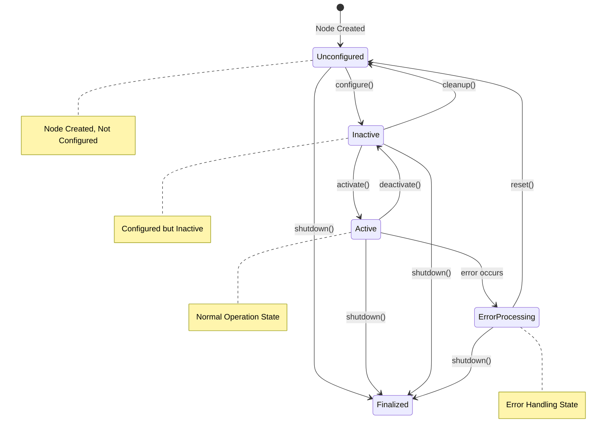
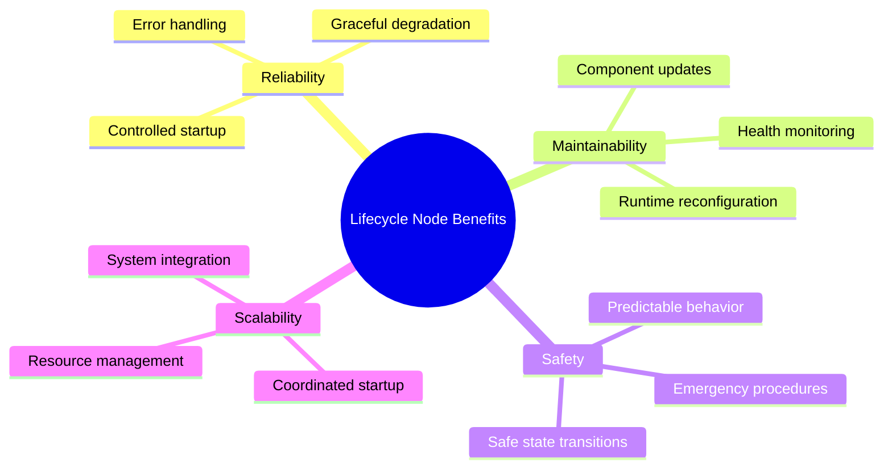
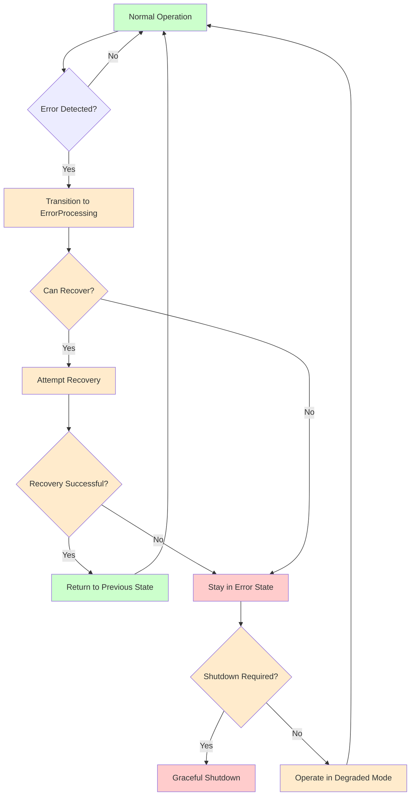

import MermaidDiagram from '@site/src/components/MermaidDiagram';
import CodeExample from '@site/src/components/CodeExample';
import Exercise from '@site/src/components/Exercise';
import Quiz from '@site/src/components/Quiz';
import PrerequisiteCheck from '@site/src/components/PrerequisiteCheck';

<PrerequisiteCheck prerequisites={frontMatter.prerequisites} />

# Chapter 6: ROS 2 Lifecycle Nodes - Managed Node States and Robust Systems

## Why This Matters

In humanoid robots like Tesla Optimus and Figure 02, reliability is paramount. Unlike desktop applications that can crash and restart without consequence, robots must operate safely in dynamic environments with humans nearby. Traditional ROS 2 nodes start up and run continuously, but what happens when a sensor fails, a communication link drops, or a critical component needs maintenance? Lifecycle nodes provide a structured approach to node management, allowing for controlled initialization, configuration, activation, error handling, and cleanup. This enables robots to gracefully handle failures, perform maintenance operations, and ensure safe operation throughout their operational lifecycle.

## Analogy: The Commercial Airline Pilot's Checklist System

### Everyday Scenario
Consider a commercial airline pilot managing an aircraft's systems. Before takeoff, the pilot follows a detailed checklist: engine start, hydraulic systems, navigation, communication—all in a specific sequence. During flight, systems are continuously monitored and can be adjusted or bypassed if they malfunction. If an engine fails, the pilot follows specific procedures to maintain safe flight. The aircraft has multiple states: ground maintenance, pre-flight, takeoff, cruise, landing, and post-flight maintenance. Each state has specific requirements and procedures.

### The Connection to Robotics
- **Lifecycle States**: Robot nodes transition through states like unconfigured, inactive, active, finalizing
- **System Monitoring**: Continuous health checks of sensors and components
- **Error Handling**: Defined procedures when components fail
- **Graceful Degradation**: Continuing operation with reduced capabilities when possible

### Where the Analogy Breaks Down
Aircraft have fewer simultaneous systems than robots; robots may have dozens of sensors and actuators operating concurrently. Aircraft operations are more predictable; robots must adapt to dynamic environments.

### In Robotics Terms
**ROS 2 Lifecycle Nodes** provide a structured state machine for managing node initialization, configuration, activation, and error handling. They enable controlled startup sequences, runtime reconfiguration, graceful error recovery, and safe shutdown procedures—essential for reliable robot operation.

## Core Concepts

### 1. Lifecycle Node States and Transitions

Lifecycle nodes follow a well-defined state machine that ensures proper initialization, configuration, and operation sequences.

**Mermaid Diagram**: Lifecycle Node State Machine



*Alt-text: State diagram showing ROS 2 lifecycle node states: Unconfigured, Inactive, Active, ErrorProcessing, and Finalized. Transitions show how nodes move between states through operations like configure(), activate(), deactivate(), cleanup(), shutdown(), and reset(). Active state is the normal operation state.*

**Key Lifecycle States:**
- **Unconfigured**: Node created but not yet configured
- **Inactive**: Configured but not yet active (ready to run)
- **Active**: Fully operational and executing
- **ErrorProcessing**: Handling an error condition
- **Finalized**: Node has been shut down and cleaned up

### 2. Benefits of Lifecycle Nodes

**Mermaid Diagram**: Lifecycle Node Benefits



*Alt-text: Mind map showing benefits of lifecycle nodes organized into four main categories: Reliability (controlled startup, error handling, graceful degradation), Maintainability (runtime reconfiguration, component updates, health monitoring), Safety (safe state transitions, emergency procedures, predictable behavior), and Scalability (coordinated startup, resource management, system integration).*

### 3. Error Handling and Graceful Degradation

Lifecycle nodes provide structured approaches to handle errors and maintain operation when possible.

**Mermaid Diagram**: Error Handling Flow



*Alt-text: Flowchart showing error handling in lifecycle nodes. Normal operation detects errors and transitions to ErrorProcessing state. System attempts recovery if possible, returning to previous state if successful or staying in error state if not. Depending on shutdown requirements, system may shut down gracefully or operate in degraded mode.*

## Worked Example: Complete Lifecycle Node Implementation

Let's build a comprehensive lifecycle node for a robot sensor system:

```python
#!/usr/bin/env python3
"""
ROS 2 Lifecycle Node Worked Example
Complete implementation of a lifecycle node for robot sensor management
"""

import rclpy
from rclpy.lifecycle import LifecycleNode, TransitionCallbackReturn
from rclpy.lifecycle import Publisher
from rclpy.qos import QoSProfile, ReliabilityPolicy
from sensor_msgs.msg import LaserScan, BatteryState, Imu
from std_msgs.msg import String
from rcl_interfaces.msg import SetParametersResult
import time
import threading
from typing import List, Dict, Any


class LifecycleSensorManager(LifecycleNode):
    """
    Lifecycle Node for managing robot sensors with proper state management
    """

    def __init__(self):
        super().__init__('lifecycle_sensor_manager')

        # Internal state tracking
        self.scan_publisher: Publisher = None
        self.battery_publisher: Publisher = None
        self.imu_publisher: Publisher = None
        self.status_publisher: Publisher = None

        # Sensor simulation parameters
        self.is_scanning = False
        self.scan_thread: threading.Thread = None
        self.should_stop = False

        # Sensor health tracking
        self.sensor_health = {
            'lidar': True,
            'imu': True,
            'battery': True
        }

        # Add parameter for sensor update rate
        self.declare_parameter('sensor_update_rate', 10.0)
        self.declare_parameter('lidar_range_max', 10.0)
        self.declare_parameter('simulation_mode', True)

        # Register parameter callback
        self.add_on_set_parameters_callback(self.parameter_callback)

        self.get_logger().info('Lifecycle Sensor Manager initialized')

    def parameter_callback(self, parameters: List[rclpy.Parameter]):
        """
        Handle parameter changes
        """
        for param in parameters:
            self.get_logger().info(f'Parameter {param.name} changed to {param.value}')

        return SetParametersResult(successful=True)

    def on_configure(self, state):
        """
        Called when transitioning from unconfigured to inactive
        """
        self.get_logger().info('Configuring lifecycle sensor manager')

        # Create publishers with specific QoS for sensor data
        qos_profile = QoSProfile(depth=10, reliability=ReliabilityPolicy.RELIABLE)

        try:
            # Create publishers for different sensor types
            self.scan_publisher = self.create_publisher(LaserScan, 'laser_scan', qos_profile)
            self.battery_publisher = self.create_publisher(BatteryState, 'battery_state', qos_profile)
            self.imu_publisher = self.create_publisher(Imu, 'imu_data', qos_profile)
            self.status_publisher = self.create_publisher(String, 'sensor_status', qos_profile)

            # Initialize sensor data
            self.initialize_sensors()

            self.get_logger().info('Lifecycle sensor manager configured successfully')
            return TransitionCallbackReturn.SUCCESS

        except Exception as e:
            self.get_logger().error(f'Failed to configure sensor manager: {str(e)}')
            return TransitionCallbackReturn.FAILURE

    def initialize_sensors(self):
        """
        Initialize sensor simulation/data sources
        """
        self.get_logger().info('Initializing sensor simulation')

        # In a real system, this would initialize actual sensor hardware
        # For simulation, we'll just set up the data structures

        # Reset sensor health
        for sensor in self.sensor_health:
            self.sensor_health[sensor] = True

    def on_activate(self, state):
        """
        Called when transitioning from inactive to active
        """
        self.get_logger().info('Activating lifecycle sensor manager')

        try:
            # Activate publishers
            self.scan_publisher.on_activate()
            self.battery_publisher.on_activate()
            self.imu_publisher.on_activate()
            self.status_publisher.on_activate()

            # Start sensor data publishing thread
            self.should_stop = False
            self.is_scanning = True
            self.scan_thread = threading.Thread(target=self.sensor_loop)
            self.scan_thread.start()

            self.get_logger().info('Lifecycle sensor manager activated successfully')
            return TransitionCallbackReturn.SUCCESS

        except Exception as e:
            self.get_logger().error(f'Failed to activate sensor manager: {str(e)}')
            return TransitionCallbackReturn.FAILURE

    def on_deactivate(self, state):
        """
        Called when transitioning from active to inactive
        """
        self.get_logger().info('Deactivating lifecycle sensor manager')

        try:
            # Stop sensor data publishing
            self.is_scanning = False
            self.should_stop = True

            if self.scan_thread and self.scan_thread.is_alive():
                self.scan_thread.join(timeout=2.0)  # Wait up to 2 seconds

            # Deactivate publishers
            self.scan_publisher.on_deactivate()
            self.battery_publisher.on_deactivate()
            self.imu_publisher.on_deactivate()
            self.status_publisher.on_deactivate()

            self.get_logger().info('Lifecycle sensor manager deactivated successfully')
            return TransitionCallbackReturn.SUCCESS

        except Exception as e:
            self.get_logger().error(f'Failed to deactivate sensor manager: {str(e)}')
            return TransitionCallbackReturn.FAILURE

    def on_cleanup(self, state):
        """
        Called when transitioning from inactive to unconfigured
        """
        self.get_logger().info('Cleaning up lifecycle sensor manager')

        try:
            # Destroy publishers
            self.destroy_publisher(self.scan_publisher)
            self.destroy_publisher(self.battery_publisher)
            self.destroy_publisher(self.imu_publisher)
            self.destroy_publisher(self.status_publisher)

            # Reset internal state
            self.scan_publisher = None
            self.battery_publisher = None
            self.imu_publisher = None
            self.status_publisher = None

            self.get_logger().info('Lifecycle sensor manager cleaned up successfully')
            return TransitionCallbackReturn.SUCCESS

        except Exception as e:
            self.get_logger().error(f'Failed to clean up sensor manager: {str(e)}')
            return TransitionCallbackReturn.FAILURE

    def on_shutdown(self, state):
        """
        Called when shutting down the node
        """
        self.get_logger().info('Shutting down lifecycle sensor manager')

        # Perform final cleanup
        self.is_scanning = False
        self.should_stop = True

        if self.scan_thread and self.scan_thread.is_alive():
            self.scan_thread.join(timeout=2.0)

        self.get_logger().info('Lifecycle sensor manager shutdown complete')
        return TransitionCallbackReturn.SUCCESS

    def on_error(self, state):
        """
        Called when transitioning to error state
        """
        self.get_logger().info('Lifecycle sensor manager entered error state')

        # Try to clean up any active resources
        try:
            if self.is_scanning:
                self.is_scanning = False
                self.should_stop = True

                if self.scan_thread and self.scan_thread.is_alive():
                    self.scan_thread.join(timeout=1.0)

            # Log error state
            self.get_logger().warn('In error state - waiting for reset or shutdown')
            return TransitionCallbackReturn.SUCCESS

        except Exception as e:
            self.get_logger().error(f'Error during error handling: {str(e)}')
            return TransitionCallbackReturn.FAILURE

    def sensor_loop(self):
        """
        Main sensor data publishing loop
        """
        update_rate = self.get_parameter('sensor_update_rate').value
        rate = self.create_rate(update_rate)

        # Simulate sensor data publishing
        scan_angle_min = -3.14  # -180 degrees
        scan_angle_max = 3.14   # 180 degrees
        scan_angle_increment = 0.0174533  # 1 degree
        scan_ranges_count = int((scan_angle_max - scan_angle_min) / scan_angle_increment)

        scan_seq = 0

        while rclpy.ok() and self.is_scanning and not self.should_stop:
            try:
                # Publish simulated sensor data
                self.publish_scan_data(scan_seq, scan_ranges_count)
                self.publish_battery_data()
                self.publish_imu_data()

                # Publish status
                status_msg = String()
                status_msg.data = f"Sensors active - Health: {self.get_sensor_health_status()}"
                self.status_publisher.publish(status_msg)

                scan_seq += 1
                rate.sleep()

            except Exception as e:
                self.get_logger().error(f'Error in sensor loop: {str(e)}')
                # In a real system, you might want to transition to error state
                break

        self.get_logger().info('Sensor loop terminated')

    def publish_scan_data(self, seq, ranges_count):
        """
        Publish simulated LiDAR scan data
        """
        scan_msg = LaserScan()
        scan_msg.header.stamp = self.get_clock().now().to_msg()
        scan_msg.header.frame_id = 'laser_link'
        scan_msg.header.stamp.sec = seq
        scan_msg.angle_min = -3.14
        scan_msg.angle_max = 3.14
        scan_msg.angle_increment = 0.0174533  # 1 degree
        scan_msg.time_increment = 0.0
        scan_msg.scan_time = 0.0
        scan_msg.range_min = 0.1
        scan_msg.range_max = self.get_parameter('lidar_range_max').value

        # Generate simulated ranges (with some obstacles)
        import random
        ranges = []
        for i in range(ranges_count):
            # Simulate some obstacles at various distances
            if 0.3 < i * scan_msg.angle_increment < 0.4:
                # Obstacle at 1m in front
                ranges.append(1.0 + random.uniform(-0.1, 0.1))
            elif 1.5 < i * scan_msg.angle_increment < 1.6:
                # Obstacle at 2m to the right
                ranges.append(2.0 + random.uniform(-0.1, 0.1))
            else:
                # Clear space (max range) with some noise
                ranges.append(
                    scan_msg.range_max - 0.1 + random.uniform(-0.05, 0.05)
                )

        scan_msg.ranges = ranges
        scan_msg.intensities = [100.0] * len(ranges)  # Constant intensity

        self.scan_publisher.publish(scan_msg)

    def publish_battery_data(self):
        """
        Publish simulated battery data
        """
        battery_msg = BatteryState()
        battery_msg.header.stamp = self.get_clock().now().to_msg()
        battery_msg.header.frame_id = 'battery_link'

        # Simulate battery level (decreasing over time)
        import random
        battery_msg.percentage = max(10.0, 95.0 - (time.time() % 1000) * 0.01 + random.uniform(-1, 1))
        battery_msg.voltage = 12.6 + random.uniform(-0.2, 0.2)
        battery_msg.current = -1.0 + random.uniform(-0.1, 0.1)  # Discharging
        battery_msg.charge = -1.0  # Unknown
        battery_msg.capacity = -1.0  # Unknown
        battery_msg.design_capacity = 10.0
        battery_msg.power_supply_status = BatteryState.POWER_SUPPLY_STATUS_DISCHARGING
        battery_msg.power_supply_health = BatteryState.POWER_SUPPLY_HEALTH_GOOD
        battery_msg.power_supply_technology = BatteryState.POWER_SUPPLY_TECHNOLOGY_LION
        battery_msg.present = True

        self.battery_publisher.publish(battery_msg)

    def publish_imu_data(self):
        """
        Publish simulated IMU data
        """
        imu_msg = Imu()
        imu_msg.header.stamp = self.get_clock().now().to_msg()
        imu_msg.header.frame_id = 'imu_link'

        # Simulate orientation (with some rotation)
        import random
        imu_msg.orientation.x = random.uniform(-0.01, 0.01)
        imu_msg.orientation.y = random.uniform(-0.01, 0.01)
        imu_msg.orientation.z = random.uniform(-0.01, 0.01)
        imu_msg.orientation.w = 1.0  # Normalize

        # Simulate angular velocity
        imu_msg.angular_velocity.x = random.uniform(-0.01, 0.01)
        imu_msg.angular_velocity.y = random.uniform(-0.01, 0.01)
        imu_msg.angular_velocity.z = random.uniform(-0.01, 0.01)

        # Simulate linear acceleration
        imu_msg.linear_acceleration.x = random.uniform(-0.1, 0.1)
        imu_msg.linear_acceleration.y = random.uniform(-0.1, 0.1)
        imu_msg.linear_acceleration.z = 9.8 + random.uniform(-0.1, 0.1)  # Gravity + noise

        # Set covariance matrices (diagonal values only)
        for i in range(9):
            if i % 4 == 0:  # Diagonal elements
                imu_msg.orientation_covariance[i] = 0.01
                imu_msg.angular_velocity_covariance[i] = 0.01
                imu_msg.linear_acceleration_covariance[i] = 0.01

        self.imu_publisher.publish(imu_msg)

    def get_sensor_health_status(self):
        """
        Get overall sensor health status
        """
        healthy_sensors = sum(1 for health in self.sensor_health.values() if health)
        total_sensors = len(self.sensor_health)
        return f"{healthy_sensors}/{total_sensors} sensors healthy"

    def simulate_sensor_failure(self, sensor_name: str):
        """
    Simulate a sensor failure for testing
    """
        if sensor_name in self.sensor_health:
            self.sensor_health[sensor_name] = False
            self.get_logger().warn(f'Simulated failure of {sensor_name} sensor')
            return True
        return False

    def reset_sensor_failure(self, sensor_name: str):
        """
        Reset a simulated sensor failure
        """
        if sensor_name in self.sensor_health:
            self.sensor_health[sensor_name] = True
            self.get_logger().info(f'Reset simulated failure of {sensor_name} sensor')
            return True
        return False


class LifecycleManagerClient(LifecycleNode):
    """
    Client to manage lifecycle nodes
    """

    def __init__(self):
        super().__init__('lifecycle_manager_client')

        # Timer for periodic status checks
        self.status_timer = self.create_timer(5.0, self.check_status)

        self.get_logger().info('Lifecycle Manager Client initialized')

    def check_status(self):
        """
        Periodically check the status of managed nodes
        """
        # This would typically call lifecycle services to check node status
        self.get_logger().info('Checking lifecycle node status...')


def main(args=None):
    rclpy.init(args=args)

    # Create lifecycle node
    lifecycle_node = LifecycleSensorManager()

    # Create client for management
    client = LifecycleManagerClient()

    try:
        # Demonstrate lifecycle transitions
        lifecycle_node.get_logger().info('Starting lifecycle node demonstration')

        # Transition through states
        # 1. Configure the node
        lifecycle_node.trigger_configure()
        lifecycle_node.get_logger().info('Node configured')

        # 2. Activate the node
        lifecycle_node.trigger_activate()
        lifecycle_node.get_logger().info('Node activated - publishing sensor data')

        # 3. Let it run for a while
        import time
        time.sleep(10.0)

        # 4. Deactivate the node
        lifecycle_node.trigger_deactivate()
        lifecycle_node.get_logger().info('Node deactivated')

        # 5. Clean up the node
        lifecycle_node.trigger_cleanup()
        lifecycle_node.get_logger().info('Node cleaned up')

        # 6. Configure and activate again to show reusability
        lifecycle_node.trigger_configure()
        lifecycle_node.trigger_activate()
        lifecycle_node.get_logger().info('Node reconfigured and reactivated')

        # Run for a bit more
        time.sleep(5.0)

        # 7. Shutdown
        lifecycle_node.trigger_shutdown()
        lifecycle_node.get_logger().info('Node shutdown')

    except KeyboardInterrupt:
        lifecycle_node.get_logger().info('Shutting down due to interrupt')
        lifecycle_node.trigger_shutdown()
    finally:
        lifecycle_node.destroy_node()
        client.destroy_node()
        rclpy.shutdown()


if __name__ == '__main__':
    main()
```

## Hands-On Exercise

### Tier A: Simulation (CPU-Only, Laptop-Compatible) ✓ REQUIRED

**Exercise 6.1: Lifecycle Node Laboratory**

Create a complete lifecycle node system that demonstrates proper state management:

1. **Custom Lifecycle Node**: Implement a lifecycle node for a specific robot component (e.g., camera, motor controller, navigation)
2. **State Transitions**: Implement all lifecycle callbacks (configure, activate, deactivate, cleanup, shutdown, error)
3. **Error Simulation**: Add methods to simulate different types of failures and recovery
4. **Health Monitoring**: Implement sensor health tracking and status reporting
5. **Client Management**: Create a client that manages the lifecycle node through its states

**Implementation Requirements**:
- Implement complete lifecycle node with all required callbacks
- Add proper error handling and recovery mechanisms
- Include parameter management for runtime configuration
- Create client to demonstrate state transitions
- Test error handling and recovery scenarios

**Acceptance Criteria**:
- [ ] Complete lifecycle node implementation with all callbacks
- [ ] Proper error handling and recovery mechanisms
- [ ] Parameter management for runtime configuration
- [ ] Client that demonstrates state transitions
- [ ] Testing of error scenarios and recovery

**Hints**:
- Start with basic lifecycle callbacks before adding complexity
- Use threading carefully to avoid blocking state transitions
- Implement comprehensive error handling
- Test all state transitions thoroughly

### Tier B: Edge AI Deployment (Optional)

**Exercise 6.2: Real Hardware Lifecycle Management**

Deploy lifecycle nodes on a Jetson platform with real hardware:

1. **Hardware Integration**: Connect lifecycle nodes to actual sensors/actuators
2. **Real Error Handling**: Implement error detection for actual hardware failures
3. **Performance Monitoring**: Monitor resource usage during state transitions
4. **Reliability Testing**: Test under various load conditions and failure scenarios

**Hardware Requirements**: Jetson Orin Nano with sensor/actuator hardware

### Tier C: Robot Hardware (Optional)

**Exercise 6.3: Safety-Critical Lifecycle Nodes**

Implement lifecycle nodes for safety-critical robot operations:

1. **Safety State Management**: Ensure safe states during transitions
2. **Emergency Procedures**: Implement emergency shutdown and recovery
3. **Redundancy Management**: Handle redundant component failures
4. **Safety Monitoring**: Continuously check safety conditions during operation

**Hardware Requirements**: Unitree Go2 or equivalent robot platform

## Summary

- **Lifecycle Nodes** provide structured state management for reliable robot operation
- **State Transitions** ensure proper initialization, configuration, and cleanup sequences
- **Error Handling** enables graceful failure recovery and system stability
- **Graceful Degradation** allows continued operation with reduced capabilities
- **Parameter Management** enables runtime reconfiguration of node behavior
- Proper lifecycle management is essential for safe, reliable robot systems

## Reflection Questions

1. **What are the main advantages of using lifecycle nodes over regular nodes in a robot system?** (Hint: Consider initialization, error handling, and system reliability)
2. **How would you design a lifecycle node for a robot arm controller that needs to handle motor failures?** (Hint: Think about safe states and recovery procedures)
3. **What challenges might arise when coordinating multiple lifecycle nodes in a complex robot system?** (Hint: Consider startup order and interdependencies)

## Quiz

Test your understanding of ROS 2 lifecycle nodes:

1. **What is the main purpose of lifecycle nodes in ROS 2?**
   - A) To make nodes run faster
   - B) To provide structured state management and reliable operation
   - C) To reduce memory usage
   - D) To enable multi-threading

   **Hint**: Review the "Why This Matters" section.

2. **True or False: Lifecycle nodes have predefined states and transitions that ensure proper initialization and cleanup.**

   **Hint**: See the Lifecycle Node State Machine diagram.

3. **Which lifecycle state is the normal operating state for a fully initialized node?**
   - A) Unconfigured
   - B) Inactive
   - C) Active
   - D) ErrorProcessing

   **Hint**: Review the state machine diagram.

4. **What happens when you call trigger_configure() on a lifecycle node?**
   - A) The node starts publishing data immediately
   - B) The node transitions from unconfigured to inactive state
   - C) The node shuts down
   - D) The node publishes an error message

   **Hint**: Consider the state transition diagram.

5. **Which callback is called when a lifecycle node encounters an error?**
   - A) on_error()
   - B) on_failure()
   - C) on_exception()
   - D) on_problem()

   **Hint**: Look at the lifecycle node implementation.

6. **When should you use a lifecycle node instead of a regular node?**
   - A) Always, for every node
   - B) When you need structured initialization, error handling, or graceful degradation
   - C) Only for sensor nodes
   - D) When you want to use less memory

   **Hint**: Consider the benefits of lifecycle management.

**Answers**: 1-B, 2-True, 3-C, 4-B, 5-A, 6-B

## Further Reading

- [ROS 2 Lifecycle Node Documentation](https://design.ros2.org/articles/node_lifecycle.html)
- [Writing Lifecycle Nodes](https://docs.ros.org/en/humble/Tutorials/Intermediate/About-Lifecycle-Nodes.html)
- [Lifecycle Node Best Practices](https://github.com/ros2/demos/blob/humble/lifecycle/README.md)
- [State Machine Design Patterns in Robotics](https://arxiv.org/abs/2104.12234)
- [Reliable Robot Systems with Lifecycle Management](https://ieeexplore.ieee.org/document/9342418)