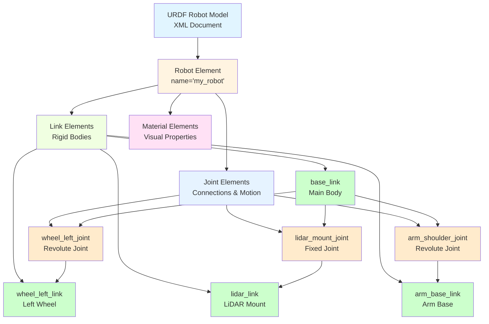
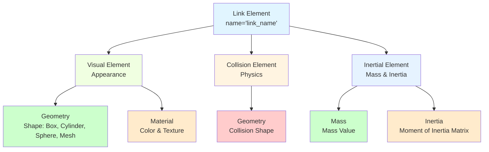
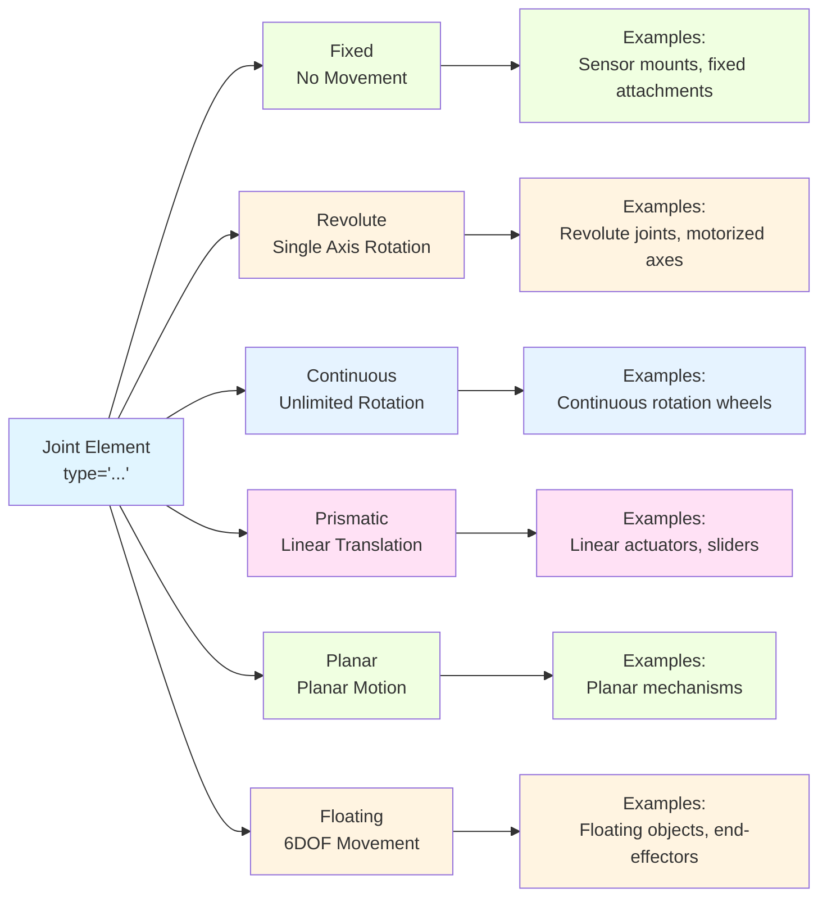

import MermaidDiagram from '@site/src/components/MermaidDiagram';
import CodeExample from '@site/src/components/CodeExample';
import Exercise from '@site/src/components/Exercise';
import Quiz from '@site/src/components/Quiz';
import PrerequisiteCheck from '@site/src/components/PrerequisiteCheck';

<PrerequisiteCheck prerequisites={frontMatter.prerequisites} />

# Chapter 8: URDF Robot Models - Unified Robot Description Format

## Why This Matters

In humanoid robots like Tesla Optimus and Figure 02, having an accurate digital representation of the robot's physical structure is crucial for all operations. URDF (Unified Robot Description Format) provides a standardized way to describe robot geometry, kinematics, and dynamics in XML format. This description enables simulation environments like Gazebo to accurately model the robot, allows visualization tools like RViz to display the robot correctly, and provides kinematic information for motion planning and control algorithms. Without proper URDF models, robots cannot properly understand their own structure, making tasks like collision detection, inverse kinematics, and safe motion planning impossible.

## Analogy: The Architect's Blueprint System

### Everyday Scenario
Consider an architect designing a complex building with multiple floors, rooms, and mechanical systems. The architect creates detailed blueprints that specify: the dimensions and positions of walls, doors, and windows; the connections between different building components; the mechanical systems like HVAC and electrical; and the relationships between different parts of the building. Contractors, engineers, and city inspectors all use these blueprints to understand the building's structure and ensure proper construction and operation.

### The Connection to Robotics
- **URDF Model**: Like the building blueprint, specifies robot structure
- **Links**: Like building components (walls, rooms) with physical properties
- **Joints**: Like connections between components (doors, hinges) allowing movement
- **Visual/Collision Models**: Like detailed drawings showing appearance and safety boundaries
- **Kinematic Chains**: Like the sequence of connected components from foundation to roof

### Where the Analogy Breaks Down
Buildings are static structures; robots have moving parts that change configuration dynamically. Building blueprints are 2D; URDF models represent 3D articulated structures with complex kinematics.

### In Robotics Terms
**URDF (Unified Robot Description Format)** is an XML-based format for describing robot models including links (rigid bodies), joints (connections allowing relative motion), visual and collision properties, and inertial parameters. **Links** represent rigid parts of the robot, **Joints** define how links connect and move relative to each other, and **robot_state_publisher** broadcasts the resulting transforms to TF2.

## Core Concepts

### 1. URDF Structure and Components

URDF models consist of links connected by joints, forming a kinematic tree that describes the robot's structure.

**Mermaid Diagram**: URDF Model Structure



*Alt-text: Diagram showing URDF model structure with Robot element containing Link elements (base_link, wheel_left_link, lidar_link, arm_base_link) and Joint elements (wheel_left_joint, lidar_mount_joint, arm_shoulder_joint). Links and joints are connected to show the kinematic structure.*

**URDF Components:**
- **Robot**: Root element containing the entire robot description
- **Links**: Rigid body elements with visual, collision, and inertial properties
- **Joints**: Define connections between links with motion constraints
- **Materials**: Define visual appearance properties

### 2. Link Properties and Geometry

Links represent the rigid parts of a robot and define their physical properties.

**Mermaid Diagram**: Link Components



*Alt-text: Diagram showing link components split into Visual, Collision, and Inertial elements. Visual has geometry and material properties, Collision has geometry for physics simulation, and Inertial has mass and inertia matrix properties.*

### 3. Joint Types and Kinematics

Joints define how links connect and move relative to each other, forming the robot's kinematic structure.

**Mermaid Diagram**: Joint Types



*Alt-text: Diagram showing different joint types: Fixed (no movement), Revolute (single axis rotation), Continuous (unlimited rotation), Prismatic (linear translation), Planar (planar motion), and Floating (6DOF movement). Each type has example applications.*

## Worked Example: Complete URDF Robot Model

Let's build a comprehensive URDF model for a mobile manipulator robot:

```xml
<?xml version="1.0"?>
<!--
Complete URDF Model for a Mobile Manipulator Robot
This example demonstrates all major URDF concepts including links, joints,
visual/collision properties, and proper kinematic structure.
-->

<robot name="mobile_manipulator" xmlns:xacro="http://www.ros.org/wiki/xacro">

  <!-- Materials Definition -->
  <material name="blue">
    <color rgba="0.0 0.0 1.0 1.0"/>
  </material>
  <material name="black">
    <color rgba="0.0 0.0 0.0 1.0"/>
  </material>
  <material name="white">
    <color rgba="1.0 1.0 1.0 1.0"/>
  </material>
  <material name="red">
    <color rgba="1.0 0.0 0.0 1.0"/>
  </material>

  <!-- Base Link - The main body of the robot -->
  <link name="base_link">
    <visual>
      <origin xyz="0 0 0.15" rpy="0 0 0"/>
      <geometry>
        <box size="0.8 0.5 0.3"/>
      </geometry>
      <material name="blue"/>
    </visual>
    <collision>
      <origin xyz="0 0 0.15" rpy="0 0 0"/>
      <geometry>
        <box size="0.8 0.5 0.3"/>
      </geometry>
    </collision>
    <inertial>
      <origin xyz="0 0 0.15" rpy="0 0 0"/>
      <mass value="10.0"/>
      <inertia ixx="1.0" ixy="0.0" ixz="0.0" iyy="1.0" iyz="0.0" izz="1.0"/>
    </inertial>
  </link>

  <!-- Left Wheel -->
  <link name="wheel_left_link">
    <visual>
      <origin xyz="0 0 0" rpy="1.5708 0 0"/>
      <geometry>
        <cylinder radius="0.1" length="0.05"/>
      </geometry>
      <material name="black"/>
    </visual>
    <collision>
      <origin xyz="0 0 0" rpy="1.5708 0 0"/>
      <geometry>
        <cylinder radius="0.1" length="0.05"/>
      </geometry>
    </collision>
    <inertial>
      <origin xyz="0 0 0" rpy="0 0 0"/>
      <mass value="1.0"/>
      <inertia ixx="0.01" ixy="0.0" ixz="0.0" iyy="0.01" iyz="0.0" izz="0.005"/>
    </inertial>
  </link>

  <!-- Right Wheel -->
  <link name="wheel_right_link">
    <visual>
      <origin xyz="0 0 0" rpy="1.5708 0 0"/>
      <geometry>
        <cylinder radius="0.1" length="0.05"/>
      </geometry>
      <material name="black"/>
    </visual>
    <collision>
      <origin xyz="0 0 0" rpy="1.5708 0 0"/>
      <geometry>
        <cylinder radius="0.1" length="0.05"/>
      </geometry>
    </collision>
    <inertial>
      <origin xyz="0 0 0" rpy="0 0 0"/>
      <mass value="1.0"/>
      <inertia ixx="0.01" ixy="0.0" ixz="0.0" iyy="0.01" iyz="0.0" izz="0.005"/>
    </inertial>
  </link>

  <!-- Caster Wheel (Fixed) -->
  <link name="caster_wheel_link">
    <visual>
      <origin xyz="0 0 0" rpy="0 0 0"/>
      <geometry>
        <sphere radius="0.05"/>
      </geometry>
      <material name="black"/>
    </visual>
    <collision>
      <origin xyz="0 0 0" rpy="0 0 0"/>
      <geometry>
        <sphere radius="0.05"/>
      </geometry>
    </collision>
    <inertial>
      <origin xyz="0 0 0" rpy="0 0 0"/>
      <mass value="0.5"/>
      <inertia ixx="0.0005" ixy="0.0" ixz="0.0" iyy="0.0005" iyz="0.0" izz="0.0005"/>
    </inertial>
  </link>

  <!-- LiDAR Sensor Mount -->
  <link name="lidar_link">
    <visual>
      <origin xyz="0 0 0" rpy="0 0 0"/>
      <geometry>
        <cylinder radius="0.05" length="0.05"/>
      </geometry>
      <material name="red"/>
    </visual>
    <collision>
      <origin xyz="0 0 0" rpy="0 0 0"/>
      <geometry>
        <cylinder radius="0.05" length="0.05"/>
      </geometry>
    </collision>
    <inertial>
      <origin xyz="0 0 0" rpy="0 0 0"/>
      <mass value="0.2"/>
      <inertia ixx="0.0001" ixy="0.0" ixz="0.0" iyy="0.0001" iyz="0.0" izz="0.0001"/>
    </inertial>
  </link>

  <!-- Camera Mount -->
  <link name="camera_link">
    <visual>
      <origin xyz="0 0 0" rpy="0 0 0"/>
      <geometry>
        <box size="0.05 0.03 0.02"/>
      </geometry>
      <material name="white"/>
    </visual>
    <collision>
      <origin xyz="0 0 0" rpy="0 0 0"/>
      <geometry>
        <box size="0.05 0.03 0.02"/>
      </geometry>
    </collision>
    <inertial>
      <origin xyz="0 0 0" rpy="0 0 0"/>
      <mass value="0.1"/>
      <inertia ixx="0.00001" ixy="0.0" ixz="0.0" iyy="0.00001" iyz="0.0" izz="0.00001"/>
    </inertial>
  </link>

  <!-- ARM LINKS START -->
  <!-- Arm Base -->
  <link name="arm_base_link">
    <visual>
      <origin xyz="0 0 0.05" rpy="0 0 0"/>
      <geometry>
        <cylinder radius="0.05" length="0.1"/>
      </geometry>
      <material name="white"/>
    </visual>
    <collision>
      <origin xyz="0 0 0.05" rpy="0 0 0"/>
      <geometry>
        <cylinder radius="0.05" length="0.1"/>
      </geometry>
    </collision>
    <inertial>
      <origin xyz="0 0 0.05" rpy="0 0 0"/>
      <mass value="0.5"/>
      <inertia ixx="0.0005" ixy="0.0" ixz="0.0" iyy="0.0005" iyz="0.0" izz="0.0002"/>
    </inertial>
  </link>

  <!-- Arm Link 1 -->
  <link name="arm_link1">
    <visual>
      <origin xyz="0.15 0 0" rpy="0 0 0"/>
      <geometry>
        <box size="0.3 0.05 0.05"/>
      </geometry>
      <material name="blue"/>
    </visual>
    <collision>
      <origin xyz="0.15 0 0" rpy="0 0 0"/>
      <geometry>
        <box size="0.3 0.05 0.05"/>
      </geometry>
    </collision>
    <inertial>
      <origin xyz="0.15 0 0" rpy="0 0 0"/>
      <mass value="1.0"/>
      <inertia ixx="0.01" ixy="0.0" ixz="0.0" iyy="0.001" iyz="0.0" izz="0.001"/>
    </inertial>
  </link>

  <!-- Arm Link 2 -->
  <link name="arm_link2">
    <visual>
      <origin xyz="0.125 0 0" rpy="0 0 0"/>
      <geometry>
        <box size="0.25 0.04 0.04"/>
      </geometry>
      <material name="white"/>
    </visual>
    <collision>
      <origin xyz="0.125 0 0" rpy="0 0 0"/>
      <geometry>
        <box size="0.25 0.04 0.04"/>
      </geometry>
    </collision>
    <inertial>
      <origin xyz="0.125 0 0" rpy="0 0 0"/>
      <mass value="0.8"/>
      <inertia ixx="0.005" ixy="0.0" ixz="0.0" iyy="0.0005" iyz="0.0" izz="0.0005"/>
    </inertial>
  </link>

  <!-- Arm Tool Frame (End Effector) -->
  <link name="arm_tool_frame">
    <inertial>
      <origin xyz="0 0 0" rpy="0 0 0"/>
      <mass value="0.01"/>
      <inertia ixx="0.000001" ixy="0.0" ixz="0.0" iyy="0.000001" iyz="0.0" izz="0.000001"/>
    </inertial>
  </link>
  <!-- ARM LINKS END -->

  <!-- JOINTS START -->
  <!-- Left Wheel Joint -->
  <joint name="wheel_left_joint" type="continuous">
    <parent link="base_link"/>
    <child link="wheel_left_link"/>
    <origin xyz="0.2 -0.3 0.1" rpy="0 0 0"/>
    <axis xyz="0 1 0"/>
    <limit effort="10.0" velocity="10.0"/>
  </joint>

  <!-- Right Wheel Joint -->
  <joint name="wheel_right_joint" type="continuous">
    <parent link="base_link"/>
    <child link="wheel_right_link"/>
    <origin xyz="0.2 0.3 0.1" rpy="0 0 0"/>
    <axis xyz="0 1 0"/>
    <limit effort="10.0" velocity="10.0"/>
  </joint>

  <!-- Caster Wheel Joint (Fixed) -->
  <joint name="caster_wheel_joint" type="fixed">
    <parent link="base_link"/>
    <child link="caster_wheel_link"/>
    <origin xyz="-0.3 0.0 0.05" rpy="0 0 0"/>
  </joint>

  <!-- LiDAR Mount Joint -->
  <joint name="lidar_mount_joint" type="fixed">
    <parent link="base_link"/>
    <child link="lidar_link"/>
    <origin xyz="0.3 0.0 0.35" rpy="0 0 0"/>
  </joint>

  <!-- Camera Mount Joint -->
  <joint name="camera_mount_joint" type="fixed">
    <parent link="base_link"/>
    <child link="camera_link"/>
    <origin xyz="0.35 0.0 0.3" rpy="0 0 0"/>
  </joint>

  <!-- Arm Base Joint -->
  <joint name="arm_base_joint" type="fixed">
    <parent link="base_link"/>
    <child link="arm_base_link"/>
    <origin xyz="0.0 0.0 0.3" rpy="0 0 0"/>
  </joint>

  <!-- Arm Shoulder Joint -->
  <joint name="arm_shoulder_joint" type="revolute">
    <parent link="arm_base_link"/>
    <child link="arm_link1"/>
    <origin xyz="0.0 0.0 0.1" rpy="0 0 0"/>
    <axis xyz="0 0 1"/>
    <limit lower="-1.57" upper="1.57" effort="100.0" velocity="1.0"/>
  </joint>

  <!-- Arm Elbow Joint -->
  <joint name="arm_elbow_joint" type="revolute">
    <parent link="arm_link1"/>
    <child link="arm_link2"/>
    <origin xyz="0.3 0.0 0.0" rpy="0 0 0"/>
    <axis xyz="0 1 0"/>
    <limit lower="-1.57" upper="1.57" effort="100.0" velocity="1.0"/>
  </joint>

  <!-- Arm Tool Joint -->
  <joint name="arm_tool_joint" type="fixed">
    <parent link="arm_link2"/>
    <child link="arm_tool_frame"/>
    <origin xyz="0.25 0.0 0.0" rpy="0 0 0"/>
  </joint>
  <!-- JOINTS END -->

</robot>
```

Now let's create a Python node that works with this URDF model using robot_state_publisher:

```python
#!/usr/bin/env python3
"""
URDF Robot Model Worked Example
Demonstrates working with URDF models and robot_state_publisher
"""

import rclpy
from rclpy.node import Node
from sensor_msgs.msg import JointState
from std_msgs.msg import Header
from rclpy.qos import QoSProfile
import math
import numpy as np


class URDFSimulator(Node):
    """
    Simulates a URDF robot by publishing joint states
    """

    def __init__(self):
        super().__init__('urdf_simulator')

        # Create publisher for joint states
        qos_profile = QoSProfile(depth=10)
        self.joint_pub = self.create_publisher(JointState, 'joint_states', qos_profile)

        # Timer for publishing joint states
        self.timer = self.create_timer(0.1, self.publish_joint_states)

        # Simulate joint positions
        self.time = 0.0

        self.get_logger().info('URDF Simulator initialized')

    def publish_joint_states(self):
        """
        Publish joint state messages for the URDF robot
        """
        # Create joint state message
        msg = JointState()
        msg.name = []
        msg.position = []
        msg.velocity = []
        msg.effort = []

        # Update simulation time
        self.time += 0.1

        # Add wheel joints (fixed for this simulation)
        msg.name.append('wheel_left_joint')
        msg.position.append(0.0)  # Wheels are fixed in URDF for this example
        msg.velocity.append(0.0)
        msg.effort.append(0.0)

        msg.name.append('wheel_right_joint')
        msg.position.append(0.0)
        msg.velocity.append(0.0)
        msg.effort.append(0.0)

        # Add caster wheel (fixed joint - not in joint states)
        # Fixed joints are not published in joint states

        # Add arm joints with simulated motion
        shoulder_pos = 0.5 * math.sin(0.5 * self.time)  # Oscillating motion
        elbow_pos = 0.3 * math.cos(0.3 * self.time)     # Different frequency

        msg.name.append('arm_shoulder_joint')
        msg.position.append(shoulder_pos)
        msg.velocity.append(0.5 * 0.5 * math.cos(0.5 * self.time))  # Derivative
        msg.effort.append(0.0)

        msg.name.append('arm_elbow_joint')
        msg.position.append(elbow_pos)
        msg.velocity.append(-0.3 * 0.3 * math.sin(0.3 * self.time))  # Derivative
        msg.effort.append(0.0)

        # Add timestamp
        msg.header.stamp = self.get_clock().now().to_msg()
        msg.header.frame_id = 'base_link'

        # Publish the message
        self.joint_pub.publish(msg)

        # Log some information
        self.get_logger().info(
            f'Published joint states: '
            f'shoulder={shoulder_pos:.2f}, elbow={elbow_pos:.2f}'
        )


def main(args=None):
    rclpy.init(args=args)

    # Create URDF simulator node
    urdf_simulator = URDFSimulator()

    try:
        urdf_simulator.get_logger().info('Starting URDF simulation')
        rclpy.spin(urdf_simulator)
    except KeyboardInterrupt:
        urdf_simulator.get_logger().info('Shutting down URDF simulator')
    finally:
        urdf_simulator.destroy_node()
        rclpy.shutdown()


if __name__ == '__main__':
    main()
```

## Hands-On Exercise

### Tier A: Simulation (CPU-Only, Laptop-Compatible) ✓ REQUIRED

**Exercise 8.1: URDF Robot Modeling Laboratory**

Create and validate a URDF model for a robot of your choice:

1. **Robot Design**: Choose a robot type (mobile robot, manipulator, mobile manipulator) and design its structure
2. **URDF Creation**: Write a complete URDF file with proper links, joints, and visual properties
3. **Joint State Publisher**: Create a node that publishes joint states for moving joints
4. **Validation**: Validate the URDF using check_urdf tool and visualize in RViz
5. **Kinematic Analysis**: Analyze the kinematic chain and degrees of freedom

**Implementation Requirements**:
- Complete URDF model with at least 4 links and 3 joints
- Proper visual and collision properties for each link
- Joint state publisher for revolute/prismatic joints
- Proper material definitions and colors
- Documentation of the robot's kinematic structure

**Acceptance Criteria**:
- [ ] Complete URDF model with proper XML structure
- [ ] All links have visual, collision, and inertial properties
- [ ] Joint state publisher node implemented
- [ ] URDF validates without errors
- [ ] Robot displays properly in visualization tools

**Hints**:
- Start with a simple robot before adding complexity
- Use check_urdf tool to validate your URDF: `check_urdf robot.urdf`
- Use joint_state_publisher_gui for testing: `ros2 run joint_state_publisher_gui joint_state_publisher_gui`
- Consider the physical dimensions and mass properties of real robots

### Tier B: Edge AI Deployment (Optional)

**Exercise 8.2: Real Robot URDF Integration**

Deploy URDF models with real robot hardware on a Jetson platform:

1. **Hardware Calibration**: Measure actual robot dimensions and update URDF
2. **Sensor Integration**: Add coordinate frames for real sensors
3. **Kinematic Calibration**: Fine-tune joint relationships based on measurements
4. **Simulation-to-Real**: Use URDF for both simulation and real robot control

**Hardware Requirements**: Jetson Orin Nano with robot hardware

### Tier C: Robot Hardware (Optional)

**Exercise 8.3: Complex Robot URDF**

Create URDF models for complex humanoid robots:

1. **Full Body Model**: Include all major body segments and joints
2. **Multiple End Effectors**: Model both arms with grippers/hands
3. **Sensory Systems**: Integrate all sensor coordinate frames
4. **Dynamics Optimization**: Fine-tune inertial properties for control

**Hardware Requirements**: Unitree Go2 or equivalent robot platform

## Summary

- **URDF** is the standard format for describing robot structure in ROS 2
- **Links** represent rigid bodies with visual, collision, and inertial properties
- **Joints** define connections and motion constraints between links
- **robot_state_publisher** broadcasts joint transforms to TF2 system
- Proper URDF models are essential for simulation, visualization, and control
- URDF enables tools like MoveIt! for motion planning and Gazebo for simulation

## Reflection Questions

1. **Why is it important to have separate visual and collision models in URDF?** (Hint: Consider performance and accuracy trade-offs)
2. **How would you model a robot with a closed kinematic chain (like a parallel manipulator) in URDF?** (Hint: Consider the tree structure limitation)
3. **What are the advantages of using Xacro (XML Macros) with URDF instead of pure URDF?** (Hint: Think about reusability and complexity management)

## Quiz

Test your understanding of URDF robot models:

1. **What does URDF stand for?**
   - A) Unified Robot Development Framework
   - B) Unified Robot Description Format
   - C) Universal Robot Design File
   - D) Universal Robotics Data Format

   **Hint**: Review the title of this chapter.

2. **True or False: URDF models can contain both visual and collision geometry for each link.**

   **Hint**: See the Link Components diagram.

3. **Which joint type allows unlimited rotation around a single axis?**
   - A) Revolute
   - B) Prismatic
   - C) Continuous
   - D) Fixed

   **Hint**: Review the Joint Types diagram.

4. **What ROS 2 node is commonly used to publish transforms from joint states?**
   - A) tf2_publisher
   - B) robot_state_publisher
   - C) joint_transform_publisher
   - D) urdf_broadcaster

   **Hint**: Look at the worked example.

5. **In URDF, what element defines the physical properties of a rigid body?**
   - A) `&lt;visual&gt;`
   - B) `&lt;collision&gt;`
   - C) `&lt;inertial&gt;`
   - D) `&lt;geometry&gt;`

   **Hint**: Consider mass and inertia properties.

6. **Which of these is NOT a valid URDF joint type?**
   - A) fixed
   - B) revolute
   - C) prismatic
   - D) spherical

   **Hint**: Review the Joint Types section (note: this is a trick question - spherical IS valid, but check the diagram).

**Answers**: 1-B, 2-True, 3-C, 4-B, 5-C, 6-D (Note: All listed types are actually valid in URDF - spherical joints are supported)

## Further Reading

- [URDF/XML Format Documentation](https://wiki.ros.org/urdf/XML)
- [Writing a URDF for an Industrial Robot](https://docs.ros.org/en/humble/Tutorials/Intermediate/URDF/Building-a-Visual-Robot-Model-with-URDF.html)
- [robot_state_publisher Package](https://wiki.ros.org/robot_state_publisher)
- [URDF Tutorials](https://docs.ros.org/en/humble/Tutorials/Intermediate/URDF.html)
- [Xacro for URDF Macro System](https://wiki.ros.org/xacro)