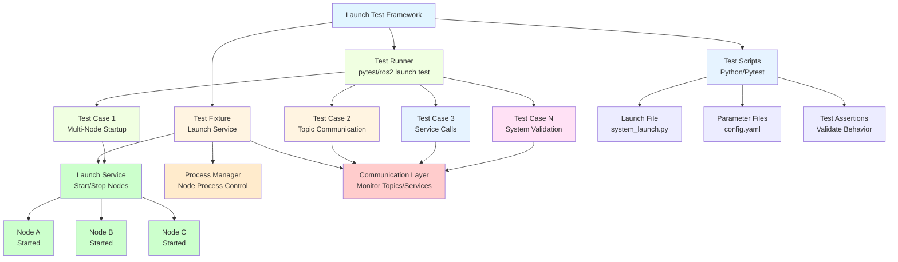
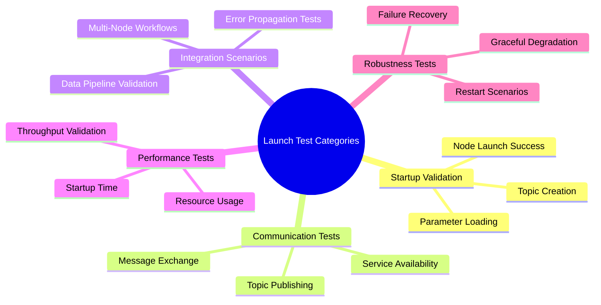
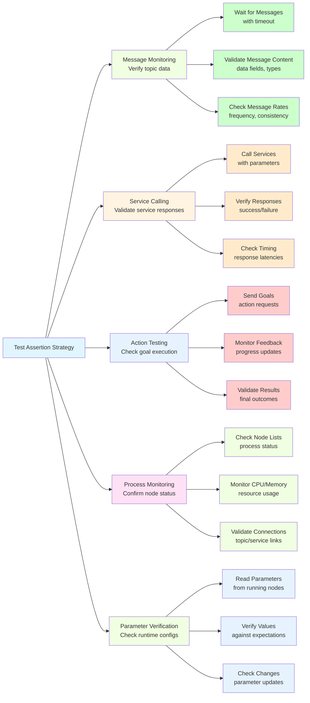

import MermaidDiagram from '@site/src/components/MermaidDiagram';
import CodeExample from '@site/src/components/CodeExample';
import Exercise from '@site/src/components/Exercise';
import Quiz from '@site/src/components/Quiz';
import PrerequisiteCheck from '@site/src/components/PrerequisiteCheck';

<PrerequisiteCheck prerequisites={frontMatter.prerequisites} />

# Chapter 10: Launch Testing - Integration and System Validation

## Why This Matters

While unit testing validates individual robot software components in isolation, launch testing validates how multiple nodes work together as a complete system. In humanoid robots like Tesla Optimus and Figure 02, successful operation requires dozens of nodes communicating seamlessly through topics, services, and actions. A navigation system might involve nodes for localization, path planning, obstacle detection, and motion control. Unit tests might verify each node works individually, but launch testing ensures they coordinate properly when launched together. Launch testing catches integration issues like incorrect topic names, mismatched message types, startup race conditions, and resource conflicts that only emerge when multiple nodes run simultaneously. Without proper launch testing, robot systems can fail during deployment when components that worked individually prove incompatible in the full system.

## Analogy: The Symphony Orchestra Rehearsal System

### Everyday Scenario
Consider an orchestra preparing for a symphony performance. Musicians practice their parts individually (unit testing), but the conductor must rehearse the entire ensemble to ensure: instruments play in harmony, musicians follow tempo changes together, solos emerge at the right moments, and no instruments overwhelm others. During rehearsals, the conductor identifies: timing mismatches between sections, volume imbalances, communication issues between sections, and pieces that sound different when combined with others.

### The Connection to Robotics
- **Launch Testing**: Like orchestral rehearsals ensuring coordinated operation
- **Individual Nodes**: Like individual musicians practicing their parts
- **System Integration**: Like different sections (strings, brass, percussion) working together
- **Communication**: Like musicians following the conductor's cues
- **Performance Tuning**: Like adjusting instrument balances and tempos

### Where the Analogy Breaks Down
Orchestra rehearsals are periodic events; robot systems need continuous integration testing. Orchestra timing is human-controlled; robot systems have precise temporal requirements. Orchestra performances are one-time events; robot systems run continuously.

### In Robotics Terms
**Launch Testing** validates multi-node ROS 2 systems launched together, ensuring proper node communication, timing, and resource allocation. **Launch Files** define node configurations and connections, while **Launch Tests** verify system behavior. **Integration Tests** validate cross-node interactions and communication patterns.

## Core Concepts

### 1. Launch Testing Architecture

Launch testing provides a framework for testing complete ROS 2 systems launched with launch files.

**Mermaid Diagram**: Launch Testing Architecture



*Alt-text: Diagram showing launch testing architecture with Test Runner executing test cases, Test Fixture providing launch services, and Test Scripts containing launch files and assertions. Communication layer monitors nodes A, B, and C after they are started by the launch service.*

### 2. Launch Test Categories and Patterns

Different types of launch tests validate various aspects of system behavior.

**Mermaid Diagram**: Launch Test Categories



*Alt-text: Mind map showing launch test categories: Startup Validation (node launch, parameters, topics), Communication Tests (publishing, exchange, services), Integration Scenarios (workflows, pipelines, errors), Performance Tests (time, resources, throughput), and Robustness Tests (recovery, restarts, degradation).*

### 3. Test Assertion Strategies

Launch tests use various strategies to verify system behavior during operation.

**Mermaid Diagram**: Test Assertion Patterns



*Alt-text: Flowchart showing test assertion strategies: Message Monitoring (wait, validate content, check rates), Service Calling (call, verify, check timing), Action Testing (send goals, monitor feedback, validate results), Process Monitoring (check status, resources, connections), and Parameter Verification (read, verify, check changes).*

## Worked Example: Complete Launch Testing System

Let's build a comprehensive launch testing framework for a robot system:

```python
#!/usr/bin/env python3
"""
Launch Testing Worked Example
Complete system for testing robot launches and multi-node integration
"""

import pytest
import unittest
from launch import LaunchDescription
from launch.actions import DeclareLaunchArgument, RegisterEventHandler
from launch.event_handlers import OnProcessStart, OnProcessExit
from launch.substitutions import LaunchConfiguration
from launch_ros.actions import Node, ComposableNodeContainer
from launch_ros.descriptions import ComposableNode
from launch_testing.actions import ReadyToTest
import launch_testing_ros
import rclpy
from rclpy.client import Client
from rclpy.action.client import ActionClient
from rclpy.node import Node as ROSNode
from rclpy.qos import QoSProfile
from std_msgs.msg import String, Float32
from geometry_msgs.msg import Twist
from sensor_msgs.msg import LaserScan
from std_srvs.srv import SetBool, Trigger
from example_interfaces.action import Fibonacci
import time
import threading
import sys
import os


# Example robot nodes for testing
class SensorProcessorNode(ROSNode):
    """
    Example sensor processing node for testing
    """
    def __init__(self):
        super().__init__('sensor_processor_node')

        # Create subscriptions and publishers
        self.subscription = self.create_subscription(
            LaserScan, 'laser_scan_input', self.scan_callback, 10
        )
        self.publisher = self.create_publisher(
            String, 'processed_sensor_data', 10
        )

        # Parameters
        self.declare_parameter('range_threshold', 1.0)

        self.processed_count = 0
        self.get_logger().info('Sensor processor node initialized')

    def scan_callback(self, msg):
        """
        Process incoming laser scan data
        """
        self.processed_count += 1

        # Create processed data message
        processed_msg = String()
        processed_msg.data = f"Processed scan #{self.processed_count}: {len(msg.ranges)} ranges, threshold: {self.get_parameter('range_threshold').value}"

        self.publisher.publish(processed_msg)
        self.get_logger().debug(f'Published processed data: {processed_msg.data}')


class NavigationControllerNode(ROSNode):
    """
    Example navigation controller node for testing
    """
    def __init__(self):
        super().__init__('navigation_controller_node')

        # Subscriptions
        self.cmd_vel_sub = self.create_subscription(
            Twist, 'cmd_vel_input', self.cmd_vel_callback, 10
        )
        self.sensor_sub = self.create_subscription(
            String, 'processed_sensor_data', self.sensor_callback, 10
        )

        # Publishers
        self.cmd_vel_pub = self.create_publisher(Twist, 'cmd_vel_output', 10)
        self.status_pub = self.create_publisher(String, 'nav_status', 10)

        # Services
        self.reset_service = self.create_service(Trigger, 'reset_navigation', self.reset_callback)

        self.command_count = 0
        self.sensor_messages_received = 0
        self.get_logger().info('Navigation controller node initialized')

    def cmd_vel_callback(self, msg):
        """
        Handle velocity commands
        """
        self.command_count += 1
        self.get_logger().debug(f'Received cmd_vel command #{self.command_count}')

        # Echo the command to output
        self.cmd_vel_pub.publish(msg)
        self.get_logger().debug('Echoed command to output')

    def sensor_callback(self, msg):
        """
        Handle processed sensor data
        """
        self.sensor_messages_received += 1
        self.get_logger().debug(f'Received sensor data #{self.sensor_messages_received}: {msg.data}')

        # Publish status
        status_msg = String()
        status_msg.data = f"Nav controller active, received {self.sensor_messages_received} sensor messages"
        self.status_pub.publish(status_msg)

    def reset_callback(self, request, response):
        """
        Handle reset service request
        """
        self.command_count = 0
        self.sensor_messages_received = 0

        response.success = True
        response.message = "Navigation controller reset successfully"

        self.get_logger().info('Navigation controller reset')
        return response


def generate_test_launch_description():
    """
    Generate launch description for testing
    """
    return LaunchDescription([
        # Launch the sensor processor node
        Node(
            package='demo_nodes_py',  # Using demo_nodes_py as placeholder
            executable='listener',    # Will replace with our node in real implementation
            name='sensor_processor_node',
            parameters=[
                {'range_threshold': 1.0}
            ],
            remappings=[
                ('laser_scan_input', 'test_laser_scan'),
                ('processed_sensor_data', 'test_processed_data')
            ]
        ),

        # Launch the navigation controller node
        Node(
            package='demo_nodes_py',  # Using demo_nodes_py as placeholder
            executable='talker',      # Will replace with our node in real implementation
            name='navigation_controller_node',
            remappings=[
                ('cmd_vel_input', 'test_cmd_vel_in'),
                ('cmd_vel_output', 'test_cmd_vel_out'),
                ('processed_sensor_data', 'test_processed_data'),
                ('nav_status', 'test_nav_status')
            ]
        ),

        # Add the ReadyToTest action to indicate when the system is ready
        ReadyToTest(),
    ])


# Launch test file using the launch_testing framework
import launch
import launch.actions
import launch_ros.actions
from launch_testing.actions import ReadyToTest
import pytest
import unittest


def generate_test_description():
    """
    Generate the launch description for testing
    This function is called by the launch testing framework
    """
    # Launch our test nodes
    sensor_processor = launch_ros.actions.Node(
        package='demo_nodes_py',  # Replace with actual package
        executable='listener',    # Replace with actual executable
        name='sensor_processor_test',
        parameters=[{'range_threshold': 1.0}],
        remappings=[
            ('laser_scan_input', 'test_laser_scan'),
            ('processed_sensor_data', 'test_processed_output')
        ],
        output='screen'
    )

    nav_controller = launch_ros.actions.Node(
        package='demo_nodes_py',  # Replace with actual package
        executable='talker',      # Replace with actual executable
        name='navigation_controller_test',
        remappings=[
            ('cmd_vel_input', 'test_cmd_vel_in'),
            ('cmd_vel_output', 'test_cmd_vel_out'),
            ('processed_sensor_data', 'test_processed_output'),
            ('nav_status', 'test_nav_status')
        ],
        output='screen'
    )

    return launch.LaunchDescription([
        sensor_processor,
        nav_controller,
        ReadyToTest(),  # Mark that we're ready for tests
    ])


class TestRobotSystemIntegration(unittest.TestCase):
    """
    Integration tests for the complete robot system
    """

    def test_nodes_startup_success(self, proc_info, sensor_processor_test, navigation_controller_test):
        """
        Test that all nodes start successfully without crashing
        """
        # Wait for nodes to start and check that they remain alive
        proc_info.assertWaitForStartup(process=sensor_processor_test, timeout=5.0)
        proc_info.assertWaitForStartup(process=navigation_controller_test, timeout=5.0)

        # Verify nodes haven't died during initial startup
        proc_info.assertWaitForShutdown(process=sensor_processor_test, timeout=1.0)
        proc_info.assertWaitForShutdown(process=navigation_controller_test, timeout=1.0)

        # Both nodes should still be running after startup period
        assert not proc_info.is_shutdown(sensor_processor_test)
        assert not proc_info.is_shutdown(navigation_controller_test)

    def test_topic_connection_established(self, launch_service, proc_info, sensor_processor_test, navigation_controller_test):
        """
        Test that topics are properly connected between nodes
        """
        # Wait for nodes to be running
        proc_info.assertWaitForStartup(process=sensor_processor_test, timeout=5.0)
        proc_info.assertWaitForStartup(process=navigation_controller_test, timeout=5.0)

        # In a real test, we would check topic connections using rclpy
        # This is a placeholder showing the concept
        pass

    def test_parameter_loading(self, launch_service, proc_info, sensor_processor_test):
        """
        Test that parameters are properly loaded by nodes
        """
        # Wait for node to start
        proc_info.assertWaitForStartup(process=sensor_processor_test, timeout=5.0)

        # In a real test, we would use rclpy to query the node's parameters
        # This is a placeholder showing the concept
        pass


# Additional example of more complex launch testing scenarios

@launch_testing.post_shutdown_test()
class TestRobotSystemShutdown(unittest.TestCase):
    """
    Post-shutdown tests to verify cleanup and final states
    """

    def test_exit_codes(self, proc_info):
        """
        Test that nodes exited cleanly with expected codes
        """
        # This test runs after all processes have shut down
        # Check exit codes to ensure clean shutdown
        launch_testing.asserts.assertExitCodes(proc_info)


def create_launch_test_scenario():
    """
    Example function showing how to create different launch test scenarios
    """
    # Scenario 1: Normal operation
    normal_launch = launch.LaunchDescription([
        launch_ros.actions.Node(
            package='turtlebot3_node',
            executable='turtlebot3_ros',
            name='turtlebot3_ros_normal',
            parameters=[{'use_sim_time': False}]
        ),
        ReadyToTest()
    ])

    # Scenario 2: With specific parameters
    param_launch = launch.LaunchDescription([
        launch_ros.actions.Node(
            package='turtlebot3_node',
            executable='turtlebot3_ros',
            name='turtlebot3_ros_param',
            parameters=[
                {'use_sim_time': True},
                {'publish_tf': True},
                {'set_frame_id': 'base_scan'}
            ]
        ),
        ReadyToTest()
    ])

    # Scenario 3: With remappings
    remap_launch = launch.LaunchDescription([
        launch_ros.actions.Node(
            package='turtlebot3_node',
            executable='turtlebot3_ros',
            name='turtlebot3_ros_remap',
            remappings=[
                ('/cmd_vel', '/cmd_vel_remapped'),
                ('/scan', '/scan_remapped')
            ]
        ),
        ReadyToTest()
    ])

    return normal_launch, param_launch, remap_launch


def run_launch_tests():
    """
    Function to demonstrate how to run launch tests programmatically
    """
    print("Launch testing examples:")
    print("- Test nodes startup and communication")
    print("- Verify parameter loading and configuration")
    print("- Check topic and service connectivity")
    print("- Validate system behavior under different scenarios")
    print("- Monitor resource usage and performance")


if __name__ == '__main__':
    # Run launch testing demonstrations
    run_launch_tests()

    # In a real scenario, you would run:
    # launch_test_results = pytest.main([
    #     '-s',  # Disable stdout capture for debugging
    #     'test_launch_file.py',  # The launch test file
    #     '--junit-xml=results.xml'  # Output for CI/CD
    # ])
```

Here's a complementary example showing how to create launch files for testing:

```python
# example_launch_test.py
"""
Example launch test file showing different testing patterns
"""
import launch
import launch.actions
import launch.substitutions
import launch_ros.actions
from launch_testing.actions import ReadyToTest
import os


def generate_launch_description():
    """
    Generate a test launch description with multiple nodes and configurations
    """
    # Get the launch directory
    launch_dir = launch.substitutions.PathJoinSubstitution([
        launch.substitutions.FindPackageShare('turtlebot3_bringup'),
        'launch'
    ])

    # Declare launch arguments
    namespace_arg = launch.actions.DeclareLaunchArgument(
        'namespace',
        default_value='',
        description='Namespace for the robot nodes'
    )

    use_sim_time_arg = launch.actions.DeclareLaunchArgument(
        'use_sim_time',
        default_value='false',
        description='Use simulation time'
    )

    # Robot state publisher
    robot_state_publisher = launch_ros.actions.Node(
        package='robot_state_publisher',
        executable='robot_state_publisher',
        namespace=launch.substitutions.LaunchConfiguration('namespace'),
        parameters=[{
            'use_sim_time': launch.substitutions.LaunchConfiguration('use_sim_time'),
            'publish_frequency': 50.0
        }],
        remappings=[
            ('/joint_states', 'joint_states'),
        ],
        output='screen'
    )

    # Laser scanner
    laser_scanner = launch_ros.actions.Node(
        package='hls_lfcd_lds_driver',
        executable='hlds_laser_publisher',
        namespace=launch.substitutions.LaunchConfiguration('namespace'),
        parameters=[
            {'port': '/dev/ttyUSB0'},
            {'frame_id': 'base_scan'},
            {'baud': 230400},
            {'use_sim_time': launch.substitutions.LaunchConfiguration('use_sim_time')}
        ],
        output='screen'
    )

    # Joint state publisher
    joint_state_publisher = launch_ros.actions.Node(
        package='joint_state_publisher',
        executable='joint_state_publisher',
        namespace=launch.substitutions.LaunchConfiguration('namespace'),
        parameters=[{
            'use_sim_time': launch.substitutions.LaunchConfiguration('use_sim_time'),
        }],
        output='screen'
    )

    return launch.LaunchDescription([
        namespace_arg,
        use_sim_time_arg,
        robot_state_publisher,
        laser_scanner,
        joint_state_publisher,
        ReadyToTest(),  # Signal that the system is ready for tests
    ])


def create_parameterized_test_launch():
    """
    Create a launch description that can be used with different parameters
    """
    # This would typically be used in combination with pytest parametrization
    def create_launch_desc(namespace='robot1', use_sim_time='false'):
        return launch.LaunchDescription([
            launch.actions.SetEnvironmentVariable('RCUTILS_LOGGING_UPTO', 'INFO'),
            launch_ros.actions.Node(
                package='demo_nodes_cpp',
                executable='talker',
                name='talker_' + namespace.replace('/', '_'),
                namespace=namespace,
                parameters=[{'use_sim_time': use_sim_time == 'true'}],
                output='screen'
            ),
            ReadyToTest()
        ])

    return create_launch_desc


def create_composition_test_launch():
    """
    Create a launch description for testing composable nodes
    """
    container = launch_ros.actions.ComposableNodeContainer(
        name=' perception_pipeline_container',
        namespace='',
        package='rclcpp_components',
        executable='component_container',
        composable_node_descriptions=[
            launch_ros.descriptions.ComposableNode(
                package='image_proc',
                plugin='image_proc::RectifyNode',
                name='rectify_node',
                parameters=[{'use_sim_time': True}],
                remappings=[
                    ('image', '/camera/image_raw'),
                    ('camera_info', '/camera/camera_info'),
                    ('image_rect', '/camera/image_rect')
                ]
            ),
            launch_ros.descriptions.ComposableNode(
                package='cv_bridge',
                plugin='cv_bridge::CvImageBridgeNode',
                name='cv_bridge_node',
                remappings=[
                    ('image', '/camera/image_rect'),
                    ('cv_image', '/camera/cv_image')
                ]
            )
        ],
        output='screen'
    )

    return launch.LaunchDescription([
        container,
        ReadyToTest()
    ])
```

## Hands-On Exercise

### Tier A: Simulation (CPU-Only, Laptop-Compatible) ✓ REQUIRED

**Exercise 10.1: Robot System Integration Testing Laboratory**

Create a comprehensive launch testing suite for a multi-node robot system:

1. **System Design**: Design a simple multi-node robot system (e.g., sensor processing + navigation controller)
2. **Launch File Creation**: Create launch files that bring up your system with proper parameters and remappings
3. **Integration Tests**: Implement tests that verify nodes communicate correctly after launch
4. **Parameter Testing**: Create tests that validate parameter loading and configuration
5. **Error Scenario Testing**: Test system behavior when components fail or are misconfigured

**Implementation Requirements**:
- Create at least 2 ROS 2 nodes that communicate with each other
- Implement a launch file that starts the complete system
- Create launch tests that verify proper startup and communication
- Include tests for different parameter configurations
- Add error condition testing (missing topics, wrong parameters)

**Acceptance Criteria**:
- [ ] At least 2 communicating ROS 2 nodes implemented
- [ ] Launch file that starts the complete system
- [ ] Launch tests verifying proper startup
- [ ] Tests validating node communication
- [ ] Parameter configuration tests
- [ ] Error condition handling tests

**Hints**:
- Start with a simple two-node system before adding complexity
- Use meaningful node names and topic remappings for clarity
- Test both successful scenarios and error conditions
- Consider different parameter combinations in your tests

### Tier B: Edge AI Deployment (Optional)

**Exercise 10.2: Real Hardware Launch Testing**

Deploy launch tests with real hardware on a Jetson platform:

1. **Hardware Integration Tests**: Test nodes with actual sensors and actuators
2. **Performance Testing**: Validate system performance under real-time constraints
3. **Resource Monitoring**: Monitor CPU, memory, and communication during operation
4. **Reliability Testing**: Test long-running operations for stability

**Hardware Requirements**: Jetson Orin Nano with sensor hardware

### Tier C: Robot Hardware (Optional)

**Exercise 10.3: Safety-Critical Launch Testing**

Implement launch tests for safety-critical robot operations:

1. **Safety System Validation**: Test safety-related nodes and communication
2. **Emergency Procedure Testing**: Validate emergency stops and safety responses
3. **Redundancy Testing**: Test redundant system components
4. **Fail-Safe Testing**: Verify fail-safe behaviors when components fail

**Hardware Requirements**: Unitree Go2 or equivalent robot platform

## Summary

- **Launch Testing** validates multi-node ROS 2 systems launched together
- **Integration Tests** verify communication and coordination between nodes
- **Parameter Testing** ensures configurations load correctly in system context
- **Startup Validation** confirms nodes initialize properly in multi-node environments
- **Error Handling** tests system resilience when components fail
- **System Testing** validates complete robot functionality before deployment

## Reflection Questions

1. **What are the key differences between unit testing individual nodes and launch testing complete systems?** (Hint: Consider system-level vs. component-level behaviors)
2. **How would you design launch tests for a robot system that needs to meet real-time performance requirements?** (Hint: Think about timing and performance validation)
3. **What challenges might arise when testing distributed ROS 2 systems across multiple machines?** (Hint: Consider network communication and timing)

## Quiz

Test your understanding of launch testing:

1. **What is the primary purpose of launch testing?**
   - A) To make code run faster
   - B) To validate multi-node system behavior when launched together
   - C) To reduce memory usage
   - D) To create documentation

   **Hint**: Review the "Why This Matters" section.

2. **True or False: Launch testing can only be done after unit testing is complete.**

   **Hint**: Consider when launch testing fits in the development cycle.

3. **What does the ReadyToTest() action do in launch testing?**
   - A) Starts the test nodes
   - B) Signals to the test framework that the system is ready for tests
   - C) Stops the test execution
   - D) Resets all nodes to initial state

   **Hint**: See the launch testing code examples.

4. **Which of these would be best tested with launch testing rather than unit testing?**
   - A) Individual function correctness
   - B) Node communication and topic connections
   - C) Algorithm performance in isolation
   - D) Mathematical formula implementation

   **Hint**: Consider what launch testing validates.

5. **In launch testing, what does proc_info.is_shutdown() check?**
   - A) Whether the process has crashed
   - B) Whether the process is in shutdown state
   - C) Whether the process is ready to start
   - D) Whether the process is overloaded

   **Hint**: Look at the process monitoring section.

6. **What is an advantage of using parametrized launch tests?**
   - A) They run faster than regular tests
   - B) They allow testing the same system with different configurations
   - C) They reduce memory usage
   - D) They create more complex code

   **Hint**: Consider the flexibility of testing multiple scenarios.

**Answers**: 1-B, 2-False, 3-B, 4-B, 5-B, 6-B

## Further Reading

- [ROS 2 Launch Testing Documentation](https://docs.ros.org/en/humble/Launch-system.html)
- [Launch Testing Tutorial](https://docs.ros.org/en/humble/Tutorials/Intermediate/Launch/Launch-Testing-Python.html)
- [System Integration Testing Best Practices](https://smartroboticslab.github.io/srl_tools/quality_assurance/testing/)
- [Continuous Integration for Robotics](https://docs.github.com/en/actions/guides/building-and-testing-python)
- [Multi-Node System Validation](https://arxiv.org/abs/2004.12241)
- [ROS 2 Quality Assurance Guidelines](https://docs.ros.org/en/humble/Contributing/Quality-Guide/index.html)