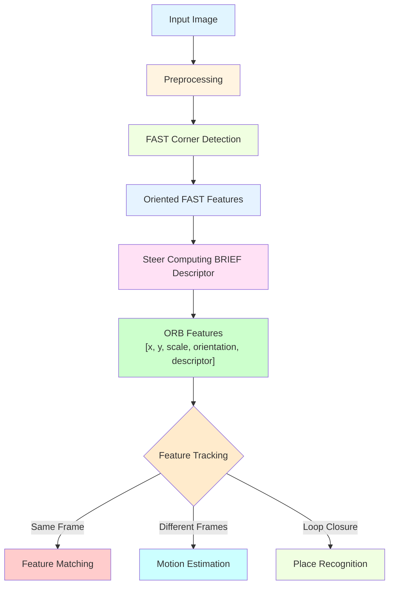

# Chapter 21: VSLAM & ORB-SLAM

## Introduction

Visual SLAM (VSLAM) represents a significant advancement in robotics mapping and localization, using only cameras to build maps and determine robot position. ORB-SLAM, one of the most successful VSLAM implementations, uses Oriented FAST and Rotated BRIEF (ORB) features to achieve real-time performance with monocular, stereo, and RGB-D cameras. This chapter explores the principles, architecture, and practical implementation of visual SLAM systems, with a focus on ORB-SLAM and its variants.

## Learning Objectives

By the end of this chapter, you will be able to:
- Understand the principles of Visual SLAM and its advantages over other approaches
- Explain ORB-SLAM's architecture and its three parallel threads
- Implement and configure ORB-SLAM for different camera types
- Evaluate visual SLAM performance and handle common challenges
- Compare visual SLAM approaches for different applications

## Prerequisites

Before starting this chapter, ensure you have:
- Completed Module 1 (ROS 2 fundamentals, TF2)
- Module 3 Chapter 18 (SLAM fundamentals)
- Basic understanding of computer vision and feature detection
- Experience with camera calibration and image processing
- Knowledge of 3D geometry and projection models

## Real-World Analogy: The Camera-Based Explorer

Think of visual SLAM like a person exploring an area using only their eyes and memory. Just as a person remembers distinctive visual landmarks like unique buildings, signs, or architectural features to navigate and build a mental map, visual SLAM systems remember distinctive visual features to track motion and create maps. The system can recognize familiar places from different viewpoints, even when the robot approaches them from different angles, making it robust to viewpoint changes that would confuse laser-only systems.

## Core Concepts

### 1. Visual SLAM Fundamentals

Visual SLAM systems solve the SLAM problem using only camera imagery:

- **Feature Detection**: Extract distinctive points from images (corners, edges)
- **Feature Matching**: Match features across frames to estimate motion
- **Pose Estimation**: Calculate camera motion using matched features
- **Map Building**: Create 3D point cloud map from feature triangulation
- **Loop Closure**: Recognize previously visited locations to correct drift

### 2. ORB-SLAM Architecture

ORB-SLAM uses a sophisticated three-thread architecture:

- **Tracking Thread**: Real-time pose tracking and local map refinement
- **Local Mapping Thread**: Map building and optimization
- **Loop Closing Thread**: Loop detection and global optimization

### 3. Camera Models and Calibration

Visual SLAM requires accurate camera models:

- **Intrinsic Parameters**: Focal length, principal point, distortion coefficients
- **Extrinsic Parameters**: Relative poses for stereo/RGB-D systems
- **Projection Models**: Pinhole, fisheye, or other camera models

## ORB-SLAM Architecture Deep Dive

### ORB Feature Detection and Description



*Alt-text: Diagram showing ORB-SLAM feature processing pipeline from input image through preprocessing, FAST corner detection, oriented FAST features, Steer Computing BRIEF descriptor, to ORB features. Features then go to feature tracking which connects to feature matching, motion estimation, and place recognition.*

### ORB-SLAM Tracking Thread Implementation

```python
#!/usr/bin/env python3

"""
ORB-SLAM Tracking Thread Simulation
Simulates the tracking thread functionality of ORB-SLAM
"""

import rclpy
from rclpy.node import Node
from sensor_msgs.msg import Image
from cv_bridge import CvBridge
from geometry_msgs.msg import PoseStamped, Point
from visualization_msgs.msg import Marker, MarkerArray
from std_msgs.msg import Header
import cv2
import numpy as np
import math
from typing import List, Tuple, Optional


class ORBTrackingThread(Node):
    def __init__(self):
        super().__init__('orb_tracking_thread')

        # CV Bridge for image processing
        self.bridge = CvBridge()

        # Subscribers
        self.image_sub = self.create_subscription(
            Image, 'camera/image_raw', self.image_callback, 10
        )

        # Publishers
        self.pose_pub = self.create_publisher(PoseStamped, 'orb_pose', 10)
        self.keypoints_pub = self.create_publisher(MarkerArray, 'orb_keypoints', 10)
        self.tracking_status_pub = self.create_publisher(MarkerArray, 'orb_tracking_status', 10)

        # ORB detector and matcher
        self.orb = cv2.ORB_create(nfeatures=1000, scaleFactor=1.2, nlevels=8)
        self.bf_matcher = cv2.BFMatcher(cv2.NORM_HAMMING, crossCheck=False)

        # Tracking state
        self.current_image = None
        self.current_keypoints = []
        self.current_descriptors = None
        self.previous_keypoints = []
        self.previous_descriptors = None
        self.current_pose = np.eye(4)  # 4x4 transformation matrix
        self.frame_id = 0

        # Camera parameters (should be loaded from calibration)
        self.camera_matrix = np.array([
            [525.0, 0.0, 319.5],  # fx, 0, cx
            [0.0, 525.0, 239.5],  # 0, fy, cy
            [0.0, 0.0, 1.0]       # 0, 0, 1
        ])

        # Tracking parameters
        self.min_matches = 20
        self.reprojection_threshold = 3.0

        self.get_logger().info('ORB-SLAM Tracking Thread initialized')

    def image_callback(self, msg):
        """Process incoming camera images"""
        try:
            # Convert ROS image to OpenCV
            cv_image = self.bridge.imgmsg_to_cv2(msg, "bgr8")
            gray_image = cv2.cvtColor(cv_image, cv2.COLOR_BGR2GRAY)

            # Extract ORB features
            keypoints, descriptors = self.orb.detectAndCompute(gray_image, None)

            if descriptors is None or len(keypoints) < self.min_matches:
                self.get_logger().warn('Not enough features detected')
                return

            # Store current frame data
            self.current_keypoints = keypoints
            self.current_descriptors = descriptors

            # Track features if we have previous frame
            if self.previous_descriptors is not None:
                # Match features between current and previous frames
                matches = self.bf_matcher.knnMatch(
                    self.previous_descriptors, self.current_descriptors, k=2
                )

                # Apply Lowe's ratio test
                good_matches = []
                for match_pair in matches:
                    if len(match_pair) == 2:
                        m, n = match_pair
                        if m.distance < 0.7 * n.distance:
                            good_matches.append(m)

                if len(good_matches) >= self.min_matches:
                    # Extract matched points
                    prev_pts = np.float32([self.previous_keypoints[m.queryIdx].pt for m in good_matches]).reshape(-1, 1, 2)
                    curr_pts = np.float32([keypoints[m.trainIdx].pt for m in good_matches]).reshape(-1, 1, 2)

                    # Estimate motion using essential matrix
                    E, mask = cv2.findEssentialMat(
                        curr_pts, prev_pts, self.camera_matrix,
                        cv2.RANSAC, threshold=self.reprojection_threshold
                    )

                    if E is not None:
                        # Decompose essential matrix to get rotation and translation
                        _, R, t, _ = cv2.recoverPose(E, curr_pts, prev_pts, self.camera_matrix)

                        # Update pose
                        self.update_pose(R, t)

                        # Publish current pose
                        self.publish_pose()
                        self.publish_keypoints(keypoints, cv_image.shape)

            # Update previous frame data
            self.previous_keypoints = keypoints
            self.previous_descriptors = descriptors
            self.frame_id += 1

        except Exception as e:
            self.get_logger().error(f'Error processing image: {e}')

    def update_pose(self, rotation, translation):
        """Update camera pose based on estimated motion"""
        # Create transformation matrix
        transform = np.eye(4)
        transform[0:3, 0:3] = rotation
        transform[0:3, 3] = translation.flatten()

        # Update global pose
        self.current_pose = self.current_pose @ np.linalg.inv(transform)

    def publish_pose(self):
        """Publish current camera pose"""
        pose_msg = PoseStamped()
        pose_msg.header = Header()
        pose_msg.header.stamp = self.get_clock().now().to_msg()
        pose_msg.header.frame_id = 'map'

        # Extract position from transformation matrix
        position = self.current_pose[0:3, 3]
        pose_msg.pose.position.x = float(position[0])
        pose_msg.pose.position.y = float(position[1])
        pose_msg.pose.position.z = float(position[2])

        # Convert rotation matrix to quaternion
        rotation_matrix = self.current_pose[0:3, 0:3]
        qw, qx, qy, qz = self.rotation_matrix_to_quaternion(rotation_matrix)
        pose_msg.pose.orientation.w = qw
        pose_msg.pose.orientation.x = qx
        pose_msg.pose.orientation.y = qy
        pose_msg.pose.orientation.z = qz

        self.pose_pub.publish(pose_msg)

    def rotation_matrix_to_quaternion(self, R):
        """Convert rotation matrix to quaternion"""
        trace = np.trace(R)
        if trace > 0:
            s = math.sqrt(trace + 1.0) * 2  # s = 4 * qw
            qw = 0.25 * s
            qx = (R[2, 1] - R[1, 2]) / s
            qy = (R[0, 2] - R[2, 0]) / s
            qz = (R[1, 0] - R[0, 1]) / s
        else:
            if R[0, 0] > R[1, 1] and R[0, 0] > R[2, 2]:
                s = math.sqrt(1.0 + R[0, 0] - R[1, 1] - R[2, 2]) * 2  # s = 4 * qx
                qw = (R[2, 1] - R[1, 2]) / s
                qx = 0.25 * s
                qy = (R[0, 1] + R[1, 0]) / s
                qz = (R[0, 2] + R[2, 0]) / s
            elif R[1, 1] > R[2, 2]:
                s = math.sqrt(1.0 + R[1, 1] - R[0, 0] - R[2, 2]) * 2  # s = 4 * qy
                qw = (R[0, 2] - R[2, 0]) / s
                qx = (R[0, 1] + R[1, 0]) / s
                qy = 0.25 * s
                qz = (R[1, 2] + R[2, 1]) / s
            else:
                s = math.sqrt(1.0 + R[2, 2] - R[0, 0] - R[1, 1]) * 2  # s = 4 * qz
                qw = (R[1, 0] - R[0, 1]) / s
                qx = (R[0, 2] + R[2, 0]) / s
                qy = (R[1, 2] + R[2, 1]) / s
                qz = 0.25 * s

        return qw, qx, qy, qz

    def publish_keypoints(self, keypoints, image_shape):
        """Publish keypoints as visualization markers"""
        marker_array = MarkerArray()

        for i, kp in enumerate(keypoints[:50]):  # Limit to 50 keypoints for performance
            marker = Marker()
            marker.header = Header()
            marker.header.stamp = self.get_clock().now().to_msg()
            marker.header.frame_id = 'camera_link'  # Camera frame
            marker.ns = 'orb_keypoints'
            marker.id = i
            marker.type = Marker.SPHERE
            marker.action = Marker.ADD

            # Convert pixel coordinates to a simple 3D position (z=0 in camera frame)
            marker.pose.position.x = (kp.pt[0] - image_shape[1]/2) * 0.001  # Scale down
            marker.pose.position.y = (kp.pt[1] - image_shape[0]/2) * 0.001  # Scale down
            marker.pose.position.z = 0.0
            marker.pose.orientation.w = 1.0

            marker.scale.x = 0.01
            marker.scale.y = 0.01
            marker.scale.z = 0.01

            marker.color.r = 1.0
            marker.color.g = 0.0
            marker.color.b = 0.0
            marker.color.a = 0.8

            marker_array.markers.append(marker)

        self.keypoints_pub.publish(marker_array)

    def get_current_pose(self):
        """Get current camera pose"""
        return self.current_pose.copy()


def main(args=None):
    rclpy.init(args=args)

    tracking_thread = ORBTrackingThread()

    try:
        rclpy.spin(tracking_thread)
    except KeyboardInterrupt:
        tracking_thread.get_logger().info('Shutting down ORB-SLAM tracking thread')
    finally:
        tracking_thread.destroy_node()
        rclpy.shutdown()


if __name__ == '__main__':
    main()
```

## ORB-SLAM Local Mapping Thread

```python
#!/usr/bin/env python3

"""
ORB-SLAM Local Mapping Thread Simulation
Simulates the local mapping functionality of ORB-SLAM
"""

import rclpy
from rclpy.node import Node
from geometry_msgs.msg import PointStamped, PoseStamped
from visualization_msgs.msg import Marker, MarkerArray
from std_msgs.msg import Header
import numpy as np
import math
from typing import List, Dict, Tuple


class ORBLocalMappingThread(Node):
    def __init__(self):
        super().__init__('orb_local_mapping_thread')

        # Subscribers
        self.tracking_pose_sub = self.create_subscription(
            PoseStamped, 'orb_pose', self.tracking_pose_callback, 10
        )

        # Publishers
        self.map_pub = self.create_publisher(MarkerArray, 'orb_local_map', 10)
        self.map_points_pub = self.create_publisher(MarkerArray, 'orb_map_points', 10)

        # Local mapping state
        self.keyframe_poses = []  # Keyframe poses
        self.map_points = []      # 3D map points
        self.local_window_size = 10  # Number of keyframes in local window

        # Map point management
        self.next_point_id = 0
        self.map_point_visibility = {}  # Track visibility of map points

        # Tracking state
        self.current_tracking_pose = np.eye(4)

        self.get_logger().info('ORB-SLAM Local Mapping Thread initialized')

    def tracking_pose_callback(self, msg):
        """Receive tracking pose updates"""
        # Convert pose message to transformation matrix
        pose_matrix = self.pose_to_matrix(msg.pose)

        # Add keyframe if significantly different from last keyframe
        if len(self.keyframe_poses) == 0 or self.is_keyframe_significant(pose_matrix):
            self.keyframe_poses.append(pose_matrix.copy())

            # Limit keyframes to local window size
            if len(self.keyframe_poses) > self.local_window_size:
                self.keyframe_poses.pop(0)

            # Create new map points based on current pose
            self.create_map_points_from_pose(pose_matrix)

            # Optimize local map
            self.optimize_local_map()

        # Store current tracking pose
        self.current_tracking_pose = pose_matrix

        # Publish updated map
        self.publish_local_map()

    def is_keyframe_significant(self, new_pose):
        """Check if new pose is significantly different from last keyframe"""
        if len(self.keyframe_poses) == 0:
            return True

        last_pose = self.keyframe_poses[-1]
        position_diff = np.linalg.norm(new_pose[0:3, 3] - last_pose[0:3, 3])
        rotation_diff = np.arccos(
            min(1.0, max(-1.0, np.trace(new_pose[0:3, 0:3] @ last_pose[0:3, 0:3].T) - 1) / 2)
        )

        # Thresholds for keyframe creation
        return position_diff > 0.1 or rotation_diff > 0.1  # 10cm or ~5.7 degrees

    def create_map_points_from_pose(self, pose):
        """Create new map points based on current camera pose"""
        # Simulate creating map points from features
        # In real implementation, this would triangulate points from stereo matches
        # or use structure from motion techniques

        # Create sample map points around the camera position
        camera_pos = pose[0:3, 3]
        for i in range(5):  # Create 5 sample points
            # Generate random point in front of camera
            offset = np.random.uniform(-1.0, 1.0, 3)
            offset[2] = abs(offset[2]) + 1.0  # Ensure point is in front of camera

            # Transform point to world coordinates
            world_point = camera_pos + offset

            # Add to map points
            self.map_points.append(world_point)
            self.map_point_visibility[self.next_point_id] = 1
            self.next_point_id += 1

        # Limit map size to prevent memory issues
        if len(self.map_points) > 1000:
            self.map_points = self.map_points[-500:]  # Keep last 500 points

    def optimize_local_map(self):
        """Optimize local map using bundle adjustment (simplified)"""
        self.get_logger().debug(f'Optimizing local map with {len(self.map_points)} points and {len(self.keyframe_poses)} keyframes')

        # In a real implementation, this would perform bundle adjustment
        # to optimize both camera poses and 3D point positions
        # For this simulation, we'll just log the optimization

    def pose_to_matrix(self, pose):
        """Convert Pose message to 4x4 transformation matrix"""
        matrix = np.eye(4)

        # Position
        matrix[0, 3] = pose.position.x
        matrix[1, 3] = pose.position.y
        matrix[2, 3] = pose.position.z

        # Orientation (convert quaternion to rotation matrix)
        w, x, y, z = pose.orientation.w, pose.orientation.x, pose.orientation.y, pose.orientation.z

        # Quaternion to rotation matrix
        matrix[0, 0] = 1 - 2*(y*y + z*z)
        matrix[0, 1] = 2*(x*y - w*z)
        matrix[0, 2] = 2*(x*z + w*y)
        matrix[1, 0] = 2*(x*y + w*z)
        matrix[1, 1] = 1 - 2*(x*x + z*z)
        matrix[1, 2] = 2*(y*z - w*x)
        matrix[2, 0] = 2*(x*z - w*y)
        matrix[2, 1] = 2*(y*z + w*x)
        matrix[2, 2] = 1 - 2*(x*x + y*y)

        return matrix

    def publish_local_map(self):
        """Publish local map as visualization markers"""
        marker_array = MarkerArray()

        # Publish keyframes as coordinate axes
        for i, pose in enumerate(self.keyframe_poses):
            # X-axis (red)
            x_marker = Marker()
            x_marker.header = Header()
            x_marker.header.stamp = self.get_clock().now().to_msg()
            x_marker.header.frame_id = 'map'
            x_marker.ns = 'keyframe_axes'
            x_marker.id = i * 3
            x_marker.type = Marker.ARROW
            x_marker.action = Marker.ADD

            start_point = PointStamped()
            start_point.point.x = pose[0, 3]
            start_point.point.y = pose[1, 3]
            start_point.point.z = pose[2, 3]

            end_point = PointStamped()
            end_point.point.x = pose[0, 3] + pose[0, 0] * 0.2  # Scale factor
            end_point.point.y = pose[1, 3] + pose[1, 0] * 0.2
            end_point.point.z = pose[2, 3] + pose[2, 0] * 0.2

            x_marker.points = [start_point.point, end_point.point]
            x_marker.scale.x = 0.02
            x_marker.scale.y = 0.04
            x_marker.color.r = 1.0
            x_marker.color.a = 0.8

            marker_array.markers.append(x_marker)

            # Y-axis (green)
            y_marker = Marker()
            y_marker.header = Header()
            y_marker.header.stamp = x_marker.header.stamp
            y_marker.header.frame_id = 'map'
            y_marker.ns = 'keyframe_axes'
            y_marker.id = i * 3 + 1
            y_marker.type = Marker.ARROW
            y_marker.action = Marker.ADD

            end_point_y = PointStamped()
            end_point_y.point.x = pose[0, 3] + pose[0, 1] * 0.2
            end_point_y.point.y = pose[1, 3] + pose[1, 1] * 0.2
            end_point_y.point.z = pose[2, 3] + pose[2, 1] * 0.2

            y_marker.points = [start_point.point, end_point_y.point]
            y_marker.scale.x = 0.02
            y_marker.scale.y = 0.04
            y_marker.color.g = 1.0
            y_marker.color.a = 0.8

            marker_array.markers.append(y_marker)

            # Z-axis (blue)
            z_marker = Marker()
            z_marker.header = Header()
            z_marker.header.stamp = x_marker.header.stamp
            z_marker.header.frame_id = 'map'
            z_marker.ns = 'keyframe_axes'
            z_marker.id = i * 3 + 2
            z_marker.type = Marker.ARROW
            z_marker.action = Marker.ADD

            end_point_z = PointStamped()
            end_point_z.point.x = pose[0, 3] + pose[0, 2] * 0.2
            end_point_z.point.y = pose[1, 3] + pose[1, 2] * 0.2
            end_point_z.point.z = pose[2, 3] + pose[2, 2] * 0.2

            z_marker.points = [start_point.point, end_point_z.point]
            z_marker.scale.x = 0.02
            z_marker.scale.y = 0.04
            z_marker.color.b = 1.0
            z_marker.color.a = 0.8

            marker_array.markers.append(z_marker)

        # Publish map points
        for i, point in enumerate(self.map_points[-100:]):  # Show last 100 points
            marker = Marker()
            marker.header = Header()
            marker.header.stamp = self.get_clock().now().to_msg()
            marker.header.frame_id = 'map'
            marker.ns = 'map_points'
            marker.id = i + len(self.keyframe_poses) * 3  # Offset ID
            marker.type = Marker.SPHERE
            marker.action = Marker.ADD

            marker.pose.position.x = point[0]
            marker.pose.position.y = point[1]
            marker.pose.position.z = point[2]
            marker.pose.orientation.w = 1.0

            marker.scale.x = 0.05
            marker.scale.y = 0.05
            marker.scale.z = 0.05

            marker.color.r = 0.0
            marker.color.g = 1.0
            marker.color.b = 0.0
            marker.color.a = 0.6

            marker_array.markers.append(marker)

        self.map_pub.publish(marker_array)

    def get_local_map(self):
        """Get current local map"""
        return self.map_points.copy(), self.keyframe_poses.copy()


def main(args=None):
    rclpy.init(args=args)

    local_mapping_thread = ORBLocalMappingThread()

    try:
        rclpy.spin(local_mapping_thread)
    except KeyboardInterrupt:
        local_mapping_thread.get_logger().info('Shutting down ORB-SLAM local mapping thread')
    finally:
        local_mapping_thread.destroy_node()
        rclpy.shutdown()


if __name__ == '__main__':
    main()
```

## ORB-SLAM Loop Closing Thread

```python
#!/usr/bin/env python3

"""
ORB-SLAM Loop Closing Thread Simulation
Simulates the loop closing functionality of ORB-SLAM
"""

import rclpy
from rclpy.node import Node
from geometry_msgs.msg import PoseStamped
from std_msgs.msg import Bool, String
import numpy as np
import math
from typing import List, Dict, Tuple
from collections import deque


class ORBLoopClosingThread(Node):
    def __init__(self):
        super().__init__('orb_loop_closing_thread')

        # Subscribers
        self.keyframe_pose_sub = self.create_subscription(
            PoseStamped, 'orb_pose', self.keyframe_pose_callback, 10
        )

        # Publishers
        self.loop_detected_pub = self.create_publisher(Bool, 'loop_detected', 10)
        self.loop_info_pub = self.create_publisher(String, 'loop_info', 10)

        # Loop closing state
        self.keyframes = deque(maxlen=100)  # Store recent keyframes
        self.keyframe_descriptors = deque(maxlen=100)  # Store keyframe descriptors
        self.keyframe_ids = deque(maxlen=100)  # Store keyframe IDs
        self.next_keyframe_id = 0

        # Loop detection parameters
        self.similarity_threshold = 0.7
        self.min_loop_candidates = 10
        self.loop_search_radius = 5.0  # meters

        # Place recognition database
        self.place_database = {}  # Maps place ID to keyframe info

        self.get_logger().info('ORB-SLAM Loop Closing Thread initialized')

    def keyframe_pose_callback(self, msg):
        """Process keyframe poses for loop detection"""
        # Convert pose to position for distance calculation
        current_pos = np.array([
            msg.pose.position.x,
            msg.pose.position.y,
            msg.pose.position.z
        ])

        # Create a simple descriptor for the keyframe (in real implementation, this would be visual words)
        descriptor = self.create_simple_descriptor(current_pos, msg.pose.orientation)

        # Store keyframe
        self.keyframes.append({
            'id': self.next_keyframe_id,
            'pose': current_pos,
            'timestamp': self.get_clock().now().nanoseconds
        })
        self.keyframe_descriptors.append(descriptor)
        self.keyframe_ids.append(self.next_keyframe_id)
        self.next_keyframe_id += 1

        # Check for potential loops
        if len(self.keyframes) >= self.min_loop_candidates:
            self.check_for_loops(current_pos, descriptor)

    def create_simple_descriptor(self, position, orientation):
        """Create a simple descriptor for place recognition (simplified)"""
        # In real ORB-SLAM, this would be a bag-of-words representation
        # For this simulation, we'll use a combination of position and orientation
        descriptor = np.concatenate([
            position,
            np.array([orientation.w, orientation.x, orientation.y, orientation.z])
        ])
        return descriptor / np.linalg.norm(descriptor)  # Normalize

    def check_for_loops(self, current_pos, current_descriptor):
        """Check for potential loop closures"""
        # Compare with previous keyframes to find potential loops
        potential_loops = []

        for i, (kf, desc) in enumerate(zip(self.keyframes, self.keyframe_descriptors)):
            # Check spatial distance
            distance = np.linalg.norm(current_pos - kf['pose'])

            if distance > self.loop_search_radius:
                continue

            # Calculate descriptor similarity
            similarity = np.dot(current_descriptor, desc)

            if similarity > self.similarity_threshold:
                potential_loops.append((i, similarity, distance))

        # Process potential loops
        if potential_loops:
            # Find the best match
            best_match = max(potential_loops, key=lambda x: x[1])
            best_idx, best_similarity, best_distance = best_match

            if best_similarity > self.similarity_threshold:
                self.handle_loop_closure(best_idx, best_similarity, best_distance)

    def handle_loop_closure(self, match_idx, similarity, distance):
        """Handle detected loop closure"""
        loop_msg = Bool()
        loop_msg.data = True
        self.loop_detected_pub.publish(loop_msg)

        # Create loop information message
        loop_info = String()
        loop_info.data = f"Loop detected! Matched keyframe {self.keyframe_ids[match_idx]} with similarity {similarity:.3f}, distance {distance:.2f}m"
        self.loop_info_pub.publish(loop_info)

        self.get_logger().info(f'Loop closure detected: {loop_info.data}')

        # In a real implementation, this would trigger global optimization
        # to correct the drift accumulated in the map
        self.perform_global_optimization(match_idx)

    def perform_global_optimization(self, loop_keyframe_idx):
        """Perform global map optimization (simplified)"""
        self.get_logger().info(f'Performing global optimization due to loop closure with keyframe at index {loop_keyframe_idx}')

        # In real ORB-SLAM, this would use pose graph optimization
        # to adjust all poses and map points to minimize the loop error
        # For this simulation, we'll just log the optimization

    def get_loop_closure_status(self):
        """Get current loop closure detection status"""
        return {
            'keyframes_stored': len(self.keyframes),
            'loop_search_radius': self.loop_search_radius,
            'similarity_threshold': self.similarity_threshold
        }


def main(args=None):
    rclpy.init(args=args)

    loop_closing_thread = ORBLoopClosingThread()

    try:
        rclpy.spin(loop_closing_thread)
    except KeyboardInterrupt:
        loop_closing_thread.get_logger().info('Shutting down ORB-SLAM loop closing thread')
    finally:
        loop_closing_thread.destroy_node()
        rclpy.shutdown()


if __name__ == '__main__':
    main()
```

## Complete ORB-SLAM System Integration

### ORB-SLAM Manager Node

```python
#!/usr/bin/env python3

"""
ORB-SLAM System Manager
Manages all three threads of ORB-SLAM system
"""

import rclpy
from rclpy.node import Node
from sensor_msgs.msg import Image
from geometry_msgs.msg import PoseStamped
from std_msgs.msg import String, Bool
from cv_bridge import CvBridge
import cv2
import numpy as np
import math
from typing import Optional, Dict, Any
import threading
import time


class ORBSLAMManager(Node):
    def __init__(self):
        super().__init__('orb_slam_manager')

        # CV Bridge for image processing
        self.bridge = CvBridge()

        # Subscribers
        self.image_sub = self.create_subscription(
            Image, 'camera/image_raw', self.image_callback, 10
        )

        # Publishers
        self.system_status_pub = self.create_publisher(String, 'orb_slam_status', 10)
        self.final_pose_pub = self.create_publisher(PoseStamped, 'orb_slam_pose', 10)

        # System state
        self.system_active = True
        self.tracking_active = True
        self.mapping_active = True
        self.loop_closing_active = True

        # Thread synchronization
        self.image_queue = []
        self.max_queue_size = 5
        self.queue_lock = threading.Lock()

        # System metrics
        self.frame_count = 0
        self.processing_times = []
        self.fps = 0.0

        # Camera calibration (should be loaded from file)
        self.camera_matrix = np.array([
            [525.0, 0.0, 319.5],
            [0.0, 525.0, 239.5],
            [0.0, 0.0, 1.0]
        ])

        # Start processing thread
        self.processing_thread = threading.Thread(target=self.process_images, daemon=True)
        self.processing_thread.start()

        # Timer for status updates
        self.status_timer = self.create_timer(1.0, self.publish_status)

        self.get_logger().info('ORB-SLAM System Manager initialized')

    def image_callback(self, msg):
        """Handle incoming images"""
        with self.queue_lock:
            if len(self.image_queue) < self.max_queue_size:
                # Convert image and add to queue
                try:
                    cv_image = self.bridge.imgmsg_to_cv2(msg, "bgr8")
                    timestamp = msg.header.stamp.sec + msg.header.stamp.nanosec * 1e-9
                    self.image_queue.append((cv_image, timestamp))
                except Exception as e:
                    self.get_logger().error(f'Error converting image: {e}')
            else:
                self.get_logger().warn('Image queue full, dropping frame')

    def process_images(self):
        """Process images in separate thread"""
        orb_detector = cv2.ORB_create(nfeatures=1000)

        # Previous frame data
        prev_gray = None
        prev_kp = None
        prev_desc = None
        current_pose = np.eye(4)

        while self.system_active and rclpy.ok():
            with self.queue_lock:
                if self.image_queue:
                    cv_image, timestamp = self.image_queue.pop(0)
                else:
                    time.sleep(0.01)  # Small delay if no images
                    continue

            # Start timing for FPS calculation
            start_time = time.time()

            # Convert to grayscale
            gray = cv2.cvtColor(cv_image, cv2.COLOR_BGR2GRAY)

            # Extract ORB features
            kp, desc = orb_detector.detectAndCompute(gray, None)

            if desc is not None and prev_desc is not None:
                # Match features
                bf = cv2.BFMatcher(cv2.NORM_HAMMING, crossCheck=False)
                matches = bf.knnMatch(prev_desc, desc, k=2)

                # Apply Lowe's ratio test
                good_matches = []
                for match_pair in matches:
                    if len(match_pair) == 2:
                        m, n = match_pair
                        if m.distance < 0.7 * n.distance:
                            good_matches.append(m)

                if len(good_matches) >= 10:  # Minimum matches for pose estimation
                    # Extract matched points
                    prev_pts = np.float32([prev_kp[m.queryIdx].pt for m in good_matches]).reshape(-1, 1, 2)
                    curr_pts = np.float32([kp[m.trainIdx].pt for m in good_matches]).reshape(-1, 1, 2)

                    # Estimate motion
                    E, mask = cv2.findEssentialMat(
                        curr_pts, prev_pts, self.camera_matrix,
                        cv2.RANSAC, threshold=1.0
                    )

                    if E is not None:
                        _, R, t, _ = cv2.recoverPose(E, curr_pts, prev_pts, self.camera_matrix)

                        # Update pose
                        transform = np.eye(4)
                        transform[0:3, 0:3] = R
                        transform[0:3, 3] = t.flatten()
                        current_pose = current_pose @ np.linalg.inv(transform)

                        # Publish pose
                        self.publish_current_pose(current_pose, timestamp)

            # Update previous frame data
            prev_gray = gray
            prev_kp = kp
            prev_desc = desc

            # Calculate processing time and FPS
            processing_time = time.time() - start_time
            self.processing_times.append(processing_time)

            # Keep only last 30 measurements for FPS calculation
            if len(self.processing_times) > 30:
                self.processing_times.pop(0)

            self.frame_count += 1

    def publish_current_pose(self, pose_matrix, timestamp):
        """Publish current camera pose"""
        pose_msg = PoseStamped()
        pose_msg.header = Header()
        pose_msg.header.stamp = self.get_clock().now().to_msg()
        pose_msg.header.frame_id = 'map'

        # Extract position
        pose_msg.pose.position.x = float(pose_matrix[0, 3])
        pose_msg.pose.position.y = float(pose_matrix[1, 3])
        pose_msg.pose.position.z = float(pose_matrix[2, 3])

        # Convert rotation matrix to quaternion
        R = pose_matrix[0:3, 0:3]
        qw, qx, qy, qz = self.rotation_matrix_to_quaternion(R)
        pose_msg.pose.orientation.w = qw
        pose_msg.pose.orientation.x = qx
        pose_msg.pose.orientation.y = qy
        pose_msg.pose.orientation.z = qz

        self.final_pose_pub.publish(pose_msg)

    def rotation_matrix_to_quaternion(self, R):
        """Convert rotation matrix to quaternion"""
        trace = np.trace(R)
        if trace > 0:
            s = math.sqrt(trace + 1.0) * 2  # s = 4 * qw
            qw = 0.25 * s
            qx = (R[2, 1] - R[1, 2]) / s
            qy = (R[0, 2] - R[2, 0]) / s
            qz = (R[1, 0] - R[0, 1]) / s
        else:
            if R[0, 0] > R[1, 1] and R[0, 0] > R[2, 2]:
                s = math.sqrt(1.0 + R[0, 0] - R[1, 1] - R[2, 2]) * 2  # s = 4 * qx
                qw = (R[2, 1] - R[1, 2]) / s
                qx = 0.25 * s
                qy = (R[0, 1] + R[1, 0]) / s
                qz = (R[0, 2] + R[2, 0]) / s
            elif R[1, 1] > R[2, 2]:
                s = math.sqrt(1.0 + R[1, 1] - R[0, 0] - R[2, 2]) * 2  # s = 4 * qy
                qw = (R[0, 2] - R[2, 0]) / s
                qx = (R[0, 1] + R[1, 0]) / s
                qy = 0.25 * s
                qz = (R[1, 2] + R[2, 1]) / s
            else:
                s = math.sqrt(1.0 + R[2, 2] - R[0, 0] - R[1, 1]) * 2  # s = 4 * qz
                qw = (R[1, 0] - R[0, 1]) / s
                qx = (R[0, 2] + R[2, 0]) / s
                qy = (R[1, 2] + R[2, 1]) / s
                qz = 0.25 * s

        return qw, qx, qy, qz

    def publish_status(self):
        """Publish system status"""
        if self.processing_times:
            avg_processing_time = np.mean(self.processing_times)
            self.fps = 1.0 / avg_processing_time if avg_processing_time > 0 else 0.0
        else:
            self.fps = 0.0

        status_msg = String()
        status_msg.data = f"ORB-SLAM Status - FPS: {self.fps:.1f}, Frames: {self.frame_count}, Active: {self.system_active}"
        self.system_status_pub.publish(status_msg)

        self.get_logger().debug(f'ORB-SLAM Status: {status_msg.data}')

    def get_system_status(self):
        """Get current system status"""
        return {
            'active': self.system_active,
            'tracking_active': self.tracking_active,
            'mapping_active': self.mapping_active,
            'loop_closing_active': self.loop_closing_active,
            'fps': self.fps,
            'frame_count': self.frame_count
        }

    def shutdown_system(self):
        """Gracefully shutdown the system"""
        self.system_active = False
        self.get_logger().info('ORB-SLAM system shutdown initiated')


def main(args=None):
    rclpy.init(args=args)

    orb_slam_manager = ORBSLAMManager()

    try:
        rclpy.spin(orb_slam_manager)
    except KeyboardInterrupt:
        orb_slam_manager.get_logger().info('Shutting down ORB-SLAM system manager')
    finally:
        orb_slam_manager.shutdown_system()
        orb_slam_manager.destroy_node()
        rclpy.shutdown()


if __name__ == '__main__':
    main()
```

## ORB-SLAM Configuration for Different Camera Types

### ORB-SLAM Launch Files

```xml
<launch>
  <!-- ORB-SLAM Monocular Launch File -->

  <!-- ORB-SLAM monocular node -->
  <node pkg="orb_slam3_ros"
        exec="orb_slam3_ros_mono"
        name="orb_slam3_mono"
        output="screen">

    <param name="use_sim_time" value="True"/>
    <param name="voc_file" value="path/to/Vocabulary/ORBvoc.txt"/>
    <param name="settings_file" value="path/to/Settings/Monocular/TUM1.yaml"/>
    <param name="image_topic" value="camera/image_raw"/>
    <param name="camera_name" value="mono_camera"/>

    <!-- ORB-SLAM3 specific parameters -->
    <param name="ORBextractor.nFeatures" value="1000"/>
    <param name="ORBextractor.scaleFactor" value="1.2"/>
    <param name="ORBextractor.nLevels" value="8"/>
    <param name="ORBextractor.iniThFAST" value="20"/>
    <param name="ORBextractor.minThFAST" value="7"/>
    <param name="Viewer.KeyFrameSize" value="0.05"/>
    <param name="Viewer.KeyFrameLineWidth" value="1"/>
    <param name="Viewer.GraphLineWidth" value="0.9"/>
    <param name="Viewer.PointSize" value="2"/>
    <param name="Viewer.CameraSize" value="0.08"/>
    <param name="Viewer.CameraLineWidth" value="3"/>
    <param name="Viewer.ViewpointX" value="0"/>
    <param name="Viewer.ViewpointY" value="-0.7"/>
    <param name="Viewer.ViewpointZ" value="-1.8"/>
    <param name="Viewer.ViewpointF" value="500"/>

    <!-- Tracking parameters -->
    <param name="ThDepth" value="35.0"/>
    <param name="DepthMapFactor" value="1.0"/>
    <param name="DepthMapTimeFactor" value="0.0"/>

  </node>

</launch>
```

```xml
<launch>
  <!-- ORB-SLAM Stereo Launch File -->

  <node pkg="orb_slam3_ros"
        exec="orb_slam3_ros_stereo"
        name="orb_slam3_stereo"
        output="screen">

    <param name="use_sim_time" value="True"/>
    <param name="voc_file" value="path/to/Vocabulary/ORBvoc.txt"/>
    <param name="settings_file" value="path/to/Settings/Stereo/TUM1.yaml"/>

    <!-- Stereo camera topics -->
    <param name="left_image_topic" value="camera/left/image_raw"/>
    <param name="right_image_topic" value="camera/right/image_raw"/>
    <param name="left_camera_info_topic" value="camera/left/camera_info"/>
    <param name="right_camera_info_topic" value="camera/right/camera_info"/>

    <!-- Camera calibration files -->
    <param name="left_camera_calib_file" value="path/to/left_calib.yaml"/>
    <param name="right_camera_calib_file" value="path/to/right_calib.yaml"/>
    <param name="stereo_calib_file" value="path/to/stereo_calib.yaml"/>

    <!-- ORB-SLAM3 stereo parameters -->
    <param name="ORBextractor.nFeatures" value="2000"/>
    <param name="ORBextractor.scaleFactor" value="1.2"/>
    <param name="ORBextractor.nLevels" value="8"/>
    <param name="ThDepth" value="40.0"/>
    <param name="DepthMapFactor" value="1.0"/>
    <param name="bf" value="46.27"/>

  </node>

</launch>
```

### ORB-SLAM Parameter Configuration

```yaml
# ORB-SLAM3 Monocular Configuration
orb_slam3_mono:
  ros__parameters:
    use_sim_time: True
    voc_file: "path/to/ORBvoc.txt"
    settings_file: "path/to/Monocular-InEuRoC.yaml"
    image_topic: "/cam0/image_raw"
    camera_name: "cam0"

    # ORB Extractor Parameters
    ORBextractor.nFeatures: 1000
    ORBextractor.scaleFactor: 1.2
    ORBextractor.nLevels: 8
    ORBextractor.iniThFAST: 20
    ORBextractor.minThFAST: 7

    # Viewer Parameters
    Viewer.KeyFrameSize: 0.05
    Viewer.KeyFrameLineWidth: 1
    Viewer.GraphLineWidth: 0.9
    Viewer.PointSize: 2
    Viewer.CameraSize: 0.08
    Viewer.CameraLineWidth: 3
    Viewer.ViewpointX: 0
    Viewer.ViewpointY: -0.7
    Viewer.ViewpointZ: -1.8
    Viewer.ViewpointF: 500

    # Tracking Parameters
    ThDepth: 35.0
    DepthMapFactor: 1.0
    DepthMapTimeFactor: 0.0

    # Local Mapping Parameters
    LocalMapping.bNoBA: false
    LocalMapping.bInertialBA: true
    LocalMapping.bImuBA: true

    # Loop Closing Parameters
    LoopClosing.bSim3: true
    LoopClosing.bLocalGlobalOptimization: true
    LoopClosing.bRobust: true
    LoopClosing.ThresholdCosDis: 0.9995
    LoopClosing.ThresholdOverlapp: 0.3

    # IMU Parameters (for inertial ORB-SLAM)
    IMU.frequency: 200.0
    IMU.tau: 0.01
    IMU.a_max: 78.48
    IMU.g_max: 3.92
    IMU.noise_gyro: 1.6968e-04
    IMU.noise_acc: 2.0e-3
    IMU.gyro_walk: 1.9393e-05
    IMU.acc_walk: 3.0e-3
    IMU.noise_gyro_bias: 1.0181e-05
    IMU.noise_acc_bias: 2.0e-4
    IMU.RandomWalk: false
```

## Visual SLAM Evaluation and Quality Assessment

### VSLAM Quality Assessment Node

```python
#!/usr/bin/env python3

"""
VSLAM Quality Assessment Node
Evaluates the quality of visual SLAM systems
"""

import rclpy
from rclpy.node import Node
from geometry_msgs.msg import PoseStamped
from std_msgs.msg import Float64, String
import numpy as np
import math
from typing import List, Tuple


class VSLAMQualityAssessment(Node):
    def __init__(self):
        super().__init__('vslam_quality_assessment')

        # Subscribers
        self.pose_sub = self.create_subscription(
            PoseStamped, 'orb_slam_pose', self.pose_callback, 10
        )

        # Publishers
        self.tracking_quality_pub = self.create_publisher(Float64, 'tracking_quality', 10)
        self.map_consistency_pub = self.create_publisher(Float64, 'map_consistency', 10)
        self.motion_smoothness_pub = self.create_publisher(Float64, 'motion_smoothness', 10)
        self.quality_report_pub = self.create_publisher(String, 'vslam_quality_report', 10)

        # Tracking state
        self.pose_history = []
        self.velocity_history = []
        self.acceleration_history = []
        self.max_history = 100

        # Quality metrics
        self.tracking_quality = 1.0
        self.map_consistency = 1.0
        self.motion_smoothness = 1.0

        # Timer for quality assessment
        self.assessment_timer = self.create_timer(0.5, self.assess_quality)

        self.get_logger().info('VSLAM Quality Assessment initialized')

    def pose_callback(self, msg):
        """Process pose messages for quality assessment"""
        current_pose = np.array([
            msg.pose.position.x,
            msg.pose.position.y,
            msg.pose.position.z
        ])

        # Add to history
        self.pose_history.append((current_pose, msg.header.stamp.sec + msg.header.stamp.nanosec * 1e-9))

        # Keep history limited
        if len(self.pose_history) > self.max_history:
            self.pose_history.pop(0)

        # Calculate velocity and acceleration if we have enough data
        if len(self.pose_history) >= 2:
            dt = self.pose_history[-1][1] - self.pose_history[-2][1]
            if dt > 0:
                velocity = (self.pose_history[-1][0] - self.pose_history[-2][0]) / dt
                self.velocity_history.append(velocity)

                if len(self.velocity_history) > 1:
                    dt2 = self.pose_history[-1][1] - self.pose_history[-2][1]
                    acceleration = (self.velocity_history[-1] - self.velocity_history[-2]) / dt2
                    self.acceleration_history.append(acceleration)

                # Keep velocity and acceleration history limited
                if len(self.velocity_history) > self.max_history:
                    self.velocity_history.pop(0)
                if len(self.acceleration_history) > self.max_history:
                    self.acceleration_history.pop(0)

    def assess_quality(self):
        """Assess the quality of VSLAM performance"""
        # Calculate tracking quality based on feature stability
        self.tracking_quality = self.calculate_tracking_quality()

        # Calculate map consistency based on motion smoothness
        self.map_consistency = self.calculate_map_consistency()

        # Calculate motion smoothness
        self.motion_smoothness = self.calculate_motion_smoothness()

        # Publish individual metrics
        track_qual_msg = Float64()
        track_qual_msg.data = float(self.tracking_quality)
        self.tracking_quality_pub.publish(track_qual_msg)

        map_cons_msg = Float64()
        map_cons_msg.data = float(self.map_consistency)
        self.map_consistency_pub.publish(map_cons_msg)

        motion_smooth_msg = Float64()
        motion_smooth_msg.data = float(self.motion_smoothness)
        self.motion_smoothness_pub.publish(motion_smooth_msg)

        # Create quality report
        quality_report = String()
        quality_report.data = f"Tracking: {self.tracking_quality:.2f}, Map: {self.map_consistency:.2f}, Motion: {self.motion_smoothness:.2f}"
        self.quality_report_pub.publish(quality_report)

        self.get_logger().info(f'VSLAM Quality - {quality_report.data}')

    def calculate_tracking_quality(self):
        """Calculate tracking quality based on pose stability"""
        if len(self.pose_history) < 10:
            return 1.0  # High quality if insufficient data

        # Calculate pose variance over recent history
        recent_poses = np.array([pose[0] for pose in self.pose_history[-10:]])
        pose_variance = np.var(recent_poses, axis=0)
        avg_variance = np.mean(pose_variance)

        # Convert to quality score (lower variance = higher quality)
        quality = max(0.0, min(1.0, 1.0 - avg_variance * 10))  # Scale factor to keep in [0,1]
        return quality

    def calculate_map_consistency(self):
        """Calculate map consistency based on motion patterns"""
        if len(self.velocity_history) < 5:
            return 1.0

        # Calculate velocity magnitude variance (consistent motion = low variance)
        velocity_magnitude = [np.linalg.norm(v) for v in self.velocity_history[-5:]]
        velocity_variance = np.var(velocity_magnitude)

        # Convert to quality score
        quality = max(0.0, min(1.0, 1.0 - velocity_variance * 0.1))  # Scale factor
        return quality

    def calculate_motion_smoothness(self):
        """Calculate motion smoothness based on acceleration"""
        if len(self.acceleration_history) < 3:
            return 1.0

        # Calculate acceleration magnitude variance
        accel_magnitude = [np.linalg.norm(a) for a in self.acceleration_history[-5:]]
        accel_variance = np.var(accel_magnitude)

        # Smooth motion has low acceleration variance
        quality = max(0.0, min(1.0, 1.0 - accel_variance * 0.01))  # Scale factor
        return quality

    def get_quality_metrics(self):
        """Get current quality metrics"""
        return {
            'tracking_quality': self.tracking_quality,
            'map_consistency': self.map_consistency,
            'motion_smoothness': self.motion_smoothness
        }


def main(args=None):
    rclpy.init(args=args)

    quality_assessment = VSLAMQualityAssessment()

    try:
        rclpy.spin(quality_assessment)
    except KeyboardInterrupt:
        quality_assessment.get_logger().info('Shutting down VSLAM quality assessment')
    finally:
        quality_assessment.destroy_node()
        rclpy.shutdown()


if __name__ == '__main__':
    main()
```

## Key Considerations for Visual SLAM

### 1. Environmental Factors

- **Lighting Conditions**: Visual SLAM performance degrades in poor lighting
- **Texture Availability**: Feature-poor environments (white walls) are challenging
- **Dynamic Objects**: Moving objects can cause tracking failures
- **Camera Motion**: Fast motion can cause motion blur and tracking loss

### 2. Computational Requirements

- **Processing Power**: Real-time feature detection and matching
- **Memory Usage**: Storing keyframes, descriptors, and map points
- **Bandwidth**: Camera data transmission requirements

### 3. Camera Calibration

- **Intrinsic Calibration**: Accurate focal length and distortion parameters
- **Extrinsic Calibration**: Relative poses for multi-camera systems
- **Temporal Synchronization**: Proper timing between camera and IMU

## Quiz: VSLAM & ORB-SLAM

1. What does ORB stand for in ORB-SLAM?
2. How many parallel threads does ORB-SLAM use?
3. Name the three main threads in ORB-SLAM.
4. What is the purpose of the bag-of-words approach in visual SLAM?
5. What is loop closure and why is it important in visual SLAM?

## Hands-On Challenge

Implement a complete visual SLAM system that:
1. Integrates camera data with IMU for robust tracking
2. Implements all three ORB-SLAM threads (tracking, local mapping, loop closing)
3. Evaluates mapping quality and provides performance metrics
4. Handles failure recovery and relocalization

## Summary

This chapter covered Visual SLAM and ORB-SLAM:
- Principles of camera-based mapping and localization
- ORB-SLAM's three-thread architecture and functionality
- Implementation of tracking, mapping, and loop closing components
- Configuration for different camera types (monocular, stereo, RGB-D)
- Quality assessment and evaluation techniques

## Further Reading

- ORB-SLAM Original Paper by Mur-Artal et al.
- Visual SLAM: Why Bundle Adjust?
- ORB-SLAM3: An Accurate Open-Source Library for Visual, Visual-Inertial and Multi-Map SLAM
- Computer Vision and Image Processing Fundamentals

## Next Chapter Preview

Chapter 22 will explore Sensor Fusion and Visual-Inertial Odometry (VIO), covering how to combine visual and inertial measurements for robust pose estimation that works in challenging visual conditions.