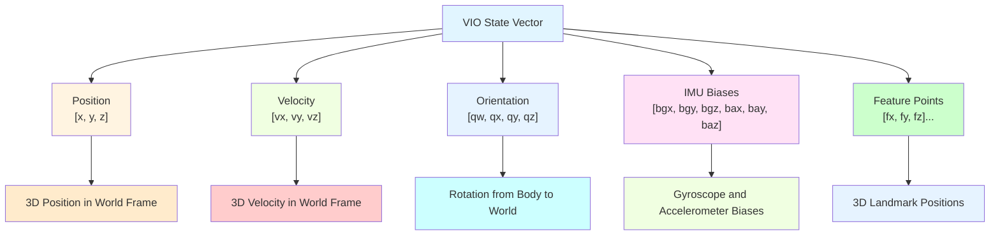

# Chapter 22: Sensor Fusion & VIO

## Introduction

Sensor fusion combines data from multiple sensors to achieve better performance than individual sensors alone. Visual-Inertial Odometry (VIO) represents one of the most successful sensor fusion approaches, combining camera imagery with Inertial Measurement Unit (IMU) data to provide robust pose estimation. This chapter explores the mathematical foundations of sensor fusion, implementation of Extended Kalman Filters, and practical VIO systems that work in challenging visual conditions where pure visual SLAM fails.

## Learning Objectives

By the end of this chapter, you will be able to:
- Understand the mathematical foundations of sensor fusion
- Implement Extended Kalman Filter for multi-sensor state estimation
- Create Visual-Inertial Odometry systems that combine camera and IMU data
- Evaluate and tune sensor fusion algorithms for optimal performance
- Compare different sensor fusion approaches and their trade-offs

## Prerequisites

Before starting this chapter, ensure you have:
- Completed Module 1 (ROS 2 fundamentals, TF2)
- Module 3 Chapter 18 (SLAM fundamentals)
- Basic understanding of probability theory and state estimation
- Experience with IMU and camera sensors
- Knowledge of matrix operations and linear algebra

## Real-World Analogy: The Multi-Sensory Navigator

Think of sensor fusion like how humans navigate using multiple senses simultaneously. When walking in low light, you don't rely solely on vision; you also use proprioception (body position sense), vestibular system (balance), and tactile feedback from the ground. Similarly, VIO combines visual landmarks (like distinctive features in camera images) with inertial measurements (like acceleration and rotation from IMU) to maintain accurate navigation even when visual features are sparse or ambiguous.

## Core Concepts

### 1. Sensor Fusion Fundamentals

Sensor fusion combines multiple sensor measurements to estimate system state:

- **State Vector**: Contains all variables to be estimated (position, velocity, orientation, biases)
- **Process Model**: Predicts state evolution based on motion and physics
- **Measurement Model**: Relates sensor measurements to state variables
- **Uncertainty Propagation**: Maintains confidence in state estimates

### 2. Extended Kalman Filter (EKF)

The EKF handles nonlinear sensor fusion problems:

- **Prediction Step**: Propagate state and covariance forward in time
- **Update Step**: Incorporate new measurements to correct state estimate
- **Linearization**: Approximate nonlinear models with Jacobians
- **Kalman Gain**: Optimal weighting of prediction vs. measurements

### 3. Visual-Inertial Fusion Challenges

- **Temporal Synchronization**: Aligning camera and IMU measurements in time
- **Spatial Calibration**: Determining relative positions/orientations of sensors
- **Scale Ambiguity**: Monocular vision lacks absolute scale information
- **Initialization**: Estimating initial state and sensor biases

## Mathematical Foundations

### State Representation for VIO



*Alt-text: Diagram showing VIO state vector containing position [x, y, z], velocity [vx, vy, vz], orientation [qw, qx, qy, qz], IMU biases [bgx, bgy, bgz, bax, bay, baz], and feature points [fx, fy, fz]... with explanations of each component.*

### Extended Kalman Filter Implementation

```python
#!/usr/bin/env python3

"""
Extended Kalman Filter for Sensor Fusion
Implements EKF for fusing IMU and other sensor data
"""

import rclpy
from rclpy.node import Node
from sensor_msgs.msg import Imu, NavSatFix
from geometry_msgs.msg import PoseWithCovarianceStamped, TwistWithCovarianceStamped
from std_msgs.msg import Header
import numpy as np
import math
from typing import Tuple, List


class ExtendedKalmanFilter(Node):
    def __init__(self):
        super().__init__('ekf_sensor_fusion')

        # Subscribers
        self.imu_sub = self.create_subscription(
            Imu, 'imu/data', self.imu_callback, 10
        )
        self.gps_sub = self.create_subscription(
            NavSatFix, 'gps/fix', self.gps_callback, 10
        )

        # Publishers
        self.pose_pub = self.create_publisher(PoseWithCovarianceStamped, 'ekf_pose', 10)
        self.twist_pub = self.create_publisher(TwistWithCovarianceStamped, 'ekf_twist', 10)

        # EKF state (position, velocity, orientation, biases)
        # [x, y, z, vx, vy, vz, qw, qx, qy, qz, bgx, bgy, bgz, bax, bay, baz]
        self.state = np.zeros(16)
        self.state[6] = 1.0  # Initialize quaternion with w=1
        self.covariance = np.eye(16) * 0.1  # Initial covariance

        # Process noise covariance
        self.process_noise = np.diag([
            0.1, 0.1, 0.1,    # Position noise
            0.5, 0.5, 0.5,    # Velocity noise
            0.01, 0.01, 0.01, 0.01,  # Orientation noise
            0.01, 0.01, 0.01,  # Gyro bias noise
            0.1, 0.1, 0.1     # Accel bias noise
        ])

        # Measurement noise covariances
        self.gps_noise = np.diag([2.0, 2.0, 4.0])  # GPS position noise (m)
        self.imu_noise = np.diag([0.01, 0.01, 0.01, 0.001, 0.001, 0.001])  # Accel, Gyro noise

        # Previous IMU data for integration
        self.prev_imu_time = None
        self.prev_imu = None

        # Gravity vector
        self.gravity = np.array([0, 0, 9.81])

        self.get_logger().info('Extended Kalman Filter initialized')

    def imu_callback(self, msg):
        """Handle IMU measurements"""
        current_time = msg.header.stamp.sec + msg.header.stamp.nanosec * 1e-9

        if self.prev_imu_time is not None:
            dt = current_time - self.prev_imu_time

            # Prediction step: integrate IMU measurements
            self.predict_state(dt, msg)

        # Store current IMU for next prediction
        self.prev_imu = msg
        self.prev_imu_time = current_time

        # Publish current state
        self.publish_state()

    def gps_callback(self, msg):
        """Handle GPS measurements"""
        if msg.status.status == msg.status.STATUS_FIX:
            # Update step: incorporate GPS measurement
            self.update_with_gps(msg)

    def predict_state(self, dt, imu_msg):
        """Prediction step: integrate IMU measurements"""
        # Extract IMU measurements
        accel = np.array([
            imu_msg.linear_acceleration.x,
            imu_msg.linear_acceleration.y,
            imu_msg.linear_acceleration.z
        ])
        gyro = np.array([
            imu_msg.angular_velocity.x,
            imu_msg.angular_velocity.y,
            imu_msg.angular_velocity.z
        ])

        # Extract state variables
        pos = self.state[0:3]
        vel = self.state[3:6]
        quat = self.state[6:10]
        gyro_bias = self.state[10:13]
        accel_bias = self.state[13:16]

        # Correct measurements for biases
        corrected_gyro = gyro - gyro_bias
        corrected_accel = accel - accel_bias

        # Convert acceleration from body frame to world frame using rotation matrix
        R = self.quaternion_to_rotation_matrix(quat)
        world_accel = R @ corrected_accel - self.gravity

        # State transition: integrate acceleration to get velocity and position
        new_vel = vel + world_accel * dt
        new_pos = pos + vel * dt + 0.5 * world_accel * dt**2

        # Integrate gyroscope to get orientation change
        dq = self.angular_velocity_to_quaternion_derivative(quat, corrected_gyro)
        new_quat = quat + dq * dt
        # Normalize quaternion
        new_quat = new_quat / np.linalg.norm(new_quat)

        # Update state
        self.state[0:3] = new_pos
        self.state[3:6] = new_vel
        self.state[6:10] = new_quat

        # Jacobian of process model for covariance propagation
        F = self.compute_process_jacobian(dt, R, corrected_accel)

        # Propagate covariance
        self.covariance = F @ self.covariance @ F.T + self.process_noise * dt

    def update_with_gps(self, gps_msg):
        """Update step: incorporate GPS measurement"""
        # GPS measurement vector [x, y, z]
        z_gps = np.array([gps_msg.longitude, gps_msg.latitude, gps_msg.altitude])

        # Convert GPS to local coordinates (simplified - in practice use proper conversion)
        # For this example, we'll assume a local tangent plane
        gps_pos = np.array([
            (z_gps[0] - self.state[0]) * 111320.0,  # Approximate meters per degree longitude
            (z_gps[1] - self.state[1]) * 111320.0,  # Approximate meters per degree latitude
            z_gps[2] - self.state[2]
        ])

        # Measurement model Jacobian (H matrix)
        # GPS only measures position, so H selects position states
        H = np.zeros((3, 16))
        H[0:3, 0:3] = np.eye(3)  # GPS measures position directly

        # Innovation
        y = gps_pos - self.state[0:3]  # Measurement residual

        # Innovation covariance
        S = H @ self.covariance @ H.T + self.gps_noise

        # Kalman gain
        K = self.covariance @ H.T @ np.linalg.inv(S)

        # Update state
        self.state = self.state + K @ y

        # Update covariance
        I_KH = np.eye(16) - K @ H
        self.covariance = I_KH @ self.covariance @ I_KH.T + K @ self.gps_noise @ K.T

    def compute_process_jacobian(self, dt, R, accel):
        """Compute Jacobian of process model"""
        F = np.eye(16)

        # Position-velocity relationship
        F[0:3, 3:6] = np.eye(3) * dt

        # Velocity-acceleration relationship
        # This is a simplified version - full derivation involves rotation matrix derivatives
        F[3:6, 6:9] = self.compute_velocity_orientation_jacobian(R, accel, dt)

        # Orientation-gyroscope relationship
        F[6:10, 6:10] = self.compute_quaternion_jacobian(self.state[6:10], self.state[10:13], dt)

        return F

    def compute_velocity_orientation_jacobian(self, R, accel, dt):
        """Compute velocity wrt orientation Jacobian"""
        # This is a simplified approximation
        # In practice, this involves the derivative of the rotation matrix
        return np.zeros((3, 3))

    def compute_quaternion_jacobian(self, quat, gyro, dt):
        """Compute quaternion propagation Jacobian"""
        # Identity for small dt, but in practice should include gyro integration
        return np.eye(4)

    def quaternion_to_rotation_matrix(self, q):
        """Convert quaternion to rotation matrix"""
        w, x, y, z = q
        R = np.array([
            [1 - 2*(y*y + z*z), 2*(x*y - w*z), 2*(x*z + w*y)],
            [2*(x*y + w*z), 1 - 2*(x*x + z*z), 2*(y*z - w*x)],
            [2*(x*z - w*y), 2*(y*z + w*x), 1 - 2*(x*x + y*y)]
        ])
        return R

    def angular_velocity_to_quaternion_derivative(self, q, omega):
        """Convert angular velocity to quaternion derivative"""
        wx, wy, wz = omega
        Omega = np.array([
            [0, -wx, -wy, -wz],
            [wx, 0, wz, -wy],
            [wy, -wz, 0, wx],
            [wz, wy, -wx, 0]
        ])
        return 0.5 * Omega @ q

    def publish_state(self):
        """Publish current state estimate"""
        # Publish pose with covariance
        pose_msg = PoseWithCovarianceStamped()
        pose_msg.header = Header()
        pose_msg.header.stamp = self.get_clock().now().to_msg()
        pose_msg.header.frame_id = 'map'

        pose_msg.pose.pose.position.x = float(self.state[0])
        pose_msg.pose.pose.position.y = float(self.state[1])
        pose_msg.pose.pose.position.z = float(self.state[2])

        pose_msg.pose.pose.orientation.w = float(self.state[6])
        pose_msg.pose.pose.orientation.x = float(self.state[7])
        pose_msg.pose.pose.orientation.y = float(self.state[8])
        pose_msg.pose.pose.orientation.z = float(self.state[9])

        # Copy covariance matrix (upper left 6x6 block)
        for i in range(6):
            for j in range(6):
                idx = i * 6 + j
                if idx < 36:
                    pose_msg.pose.covariance[idx] = float(self.covariance[i, j])

        self.pose_pub.publish(pose_msg)

        # Publish twist with covariance
        twist_msg = TwistWithCovarianceStamped()
        twist_msg.header = Header()
        twist_msg.header.stamp = pose_msg.header.stamp
        twist_msg.header.frame_id = 'base_link'

        twist_msg.twist.twist.linear.x = float(self.state[3])
        twist_msg.twist.twist.linear.y = float(self.state[4])
        twist_msg.twist.twist.linear.z = float(self.state[5])

        # Angular velocities would come from IMU or be estimated from orientation changes
        # For this example, we'll use the bias-corrected gyroscope values
        if self.prev_imu:
            twist_msg.twist.twist.angular.x = float(self.prev_imu.angular_velocity.x - self.state[10])
            twist_msg.twist.twist.angular.y = float(self.prev_imu.angular_velocity.y - self.state[11])
            twist_msg.twist.twist.angular.z = float(self.prev_imu.angular_velocity.z - self.state[12])

        # Copy velocity covariance (upper left 6x6 block)
        for i in range(6):
            for j in range(6):
                idx = i * 6 + j
                if idx < 36:
                    twist_msg.twist.covariance[idx] = float(self.covariance[i+3, j+3])

        self.twist_pub.publish(twist_msg)

    def get_current_state(self):
        """Get current state estimate"""
        return self.state.copy(), self.covariance.copy()


def main(args=None):
    rclpy.init(args=args)

    ekf = ExtendedKalmanFilter()

    try:
        rclpy.spin(ekf)
    except KeyboardInterrupt:
        ekf.get_logger().info('Shutting down EKF sensor fusion')
    finally:
        ekf.destroy_node()
        rclpy.shutdown()


if __name__ == '__main__':
    main()
```

## Visual-Inertial Odometry (VIO) Implementation

### VIO State Estimator Node

```python
#!/usr/bin/env python3

"""
Visual-Inertial Odometry State Estimator
Implements VIO by fusing visual features and IMU data
"""

import rclpy
from rclpy.node import Node
from sensor_msgs.msg import Image, Imu
from geometry_msgs.msg import PointStamped, PoseWithCovarianceStamped
from cv_bridge import CvBridge
from std_msgs.msg import Header
import cv2
import numpy as np
import math
from typing import List, Tuple, Dict
from collections import deque


class VIOEstimator(Node):
    def __init__(self):
        super().__init__('vio_estimator')

        # CV Bridge for image processing
        self.bridge = CvBridge()

        # Subscribers
        self.image_sub = self.create_subscription(
            Image, 'camera/image_raw', self.image_callback, 10
        )
        self.imu_sub = self.create_subscription(
            Imu, 'imu/data', self.imu_callback, 10
        )

        # Publishers
        self.vio_pose_pub = self.create_publisher(PoseWithCovarianceStamped, 'vio_pose', 10)
        self.feature_pub = self.create_publisher(PointStamped, 'vio_features', 10)

        # VIO state
        self.state = np.zeros(16)  # [pos, vel, quat, gyro_bias, accel_bias]
        self.state[6] = 1.0  # Initialize quaternion with w=1
        self.covariance = np.eye(16) * 0.1

        # Feature tracking
        self.orb = cv2.ORB_create(nfeatures=500)
        self.prev_image = None
        self.prev_keypoints = None
        self.tracked_features = {}  # Track features over time
        self.feature_counter = 0

        # IMU integration
        self.imu_buffer = deque(maxlen=10)  # Store recent IMU data
        self.gravity = np.array([0, 0, 9.81])

        # Camera parameters (should be loaded from calibration)
        self.camera_matrix = np.array([
            [525.0, 0.0, 319.5],
            [0.0, 525.0, 239.5],
            [0.0, 0.0, 1.0]
        ])

        # VIO parameters
        self.max_feature_age = 10  # Maximum frames to track a feature
        self.min_feature_displacement = 2.0  # Minimum pixel displacement to consider

        self.get_logger().info('VIO Estimator initialized')

    def image_callback(self, msg):
        """Process camera images for feature tracking"""
        try:
            cv_image = self.bridge.imgmsg_to_cv2(msg, "bgr8")
            gray_image = cv2.cvtColor(cv_image, cv2.COLOR_BGR2GRAY)

            # Detect ORB features
            current_keypoints, current_descriptors = self.orb.detectAndCompute(gray_image, None)

            if current_descriptors is None:
                return

            # If we have previous frame, track features
            if self.prev_keypoints is not None and self.prev_image is not None:
                # Match features between frames
                bf = cv2.BFMatcher(cv2.NORM_HAMMING, crossCheck=False)
                matches = bf.knnMatch(
                    self.prev_descriptors, current_descriptors, k=2
                )

                # Apply Lowe's ratio test
                good_matches = []
                for match_pair in matches:
                    if len(match_pair) == 2:
                        m, n = match_pair
                        if m.distance < 0.7 * n.distance:
                            good_matches.append(m)

                # Update feature tracking
                for match in good_matches:
                    prev_idx = match.queryIdx
                    curr_idx = match.trainIdx

                    if prev_idx < len(self.prev_keypoints) and curr_idx < len(current_keypoints):
                        prev_pt = self.prev_keypoints[prev_idx].pt
                        curr_pt = current_keypoints[curr_idx].pt

                        # Calculate displacement
                        displacement = math.sqrt(
                            (curr_pt[0] - prev_pt[0])**2 + (curr_pt[1] - prev_pt[1])**2
                        )

                        # Only consider features with sufficient displacement
                        if displacement > self.min_feature_displacement:
                            # Update feature in tracking
                            feature_id = self.get_feature_id(prev_idx)
                            self.update_feature_tracking(feature_id, curr_pt)

            # Store current frame data
            self.prev_image = gray_image
            self.prev_keypoints = current_keypoints
            self.prev_descriptors = current_descriptors

            # Update state based on visual motion
            self.update_state_from_visual_motion()

        except Exception as e:
            self.get_logger().error(f'Error processing image: {e}')

    def imu_callback(self, msg):
        """Process IMU data for inertial integration"""
        # Store IMU in buffer with timestamp
        timestamp = msg.header.stamp.sec + msg.header.stamp.nanosec * 1e-9
        imu_data = {
            'accel': np.array([
                msg.linear_acceleration.x,
                msg.linear_acceleration.y,
                msg.linear_acceleration.z
            ]),
            'gyro': np.array([
                msg.angular_velocity.x,
                msg.angular_velocity.y,
                msg.angular_velocity.z
            ]),
            'timestamp': timestamp
        }

        self.imu_buffer.append(imu_data)

        # Integrate IMU data to update state
        self.integrate_imu_data()

    def get_feature_id(self, keypoint_idx):
        """Generate unique feature ID"""
        return f"feat_{keypoint_idx}_{self.feature_counter}"

    def update_feature_tracking(self, feature_id, current_position):
        """Update feature tracking information"""
        if feature_id not in self.tracked_features:
            self.tracked_features[feature_id] = {
                'positions': [current_position],
                'timestamps': [self.get_clock().now().nanoseconds],
                'age': 0
            }
        else:
            self.tracked_features[feature_id]['positions'].append(current_position)
            self.tracked_features[feature_id]['timestamps'].append(self.get_clock().now().nanoseconds)
            self.tracked_features[feature_id]['age'] += 1

        # Remove old features
        if self.tracked_features[feature_id]['age'] > self.max_feature_age:
            del self.tracked_features[feature_id]

    def update_state_from_visual_motion(self):
        """Update state estimate based on visual motion"""
        if len(self.tracked_features) < 10:
            return  # Not enough features to estimate motion

        # Calculate average optical flow to estimate camera motion
        total_flow_x = 0
        total_flow_y = 0
        valid_features = 0

        for feature_id, feature_data in self.tracked_features.items():
            if len(feature_data['positions']) >= 2:
                positions = feature_data['positions']
                # Calculate flow from previous to current position
                flow_x = positions[-1][0] - positions[-2][0]
                flow_y = positions[-1][1] - positions[-2][1]
                total_flow_x += flow_x
                total_flow_y += flow_y
                valid_features += 1

        if valid_features > 0:
            avg_flow_x = total_flow_x / valid_features
            avg_flow_y = total_flow_y / valid_features

            # Convert optical flow to motion estimate (simplified)
            # This is a very simplified approach - real VIO uses more sophisticated methods
            motion_estimate = np.array([avg_flow_x * 0.001, avg_flow_y * 0.001, 0.0])  # Scale factor

            # Update position based on visual motion
            self.state[0:3] += motion_estimate

    def integrate_imu_data(self):
        """Integrate IMU data to update state"""
        if len(self.imu_buffer) < 2:
            return

        # Get the two most recent IMU readings
        recent_imu = list(self.imu_buffer)[-2:]
        if len(recent_imu) < 2:
            return

        prev_imu = recent_imu[0]
        curr_imu = recent_imu[1]

        dt = curr_imu['timestamp'] - prev_imu['timestamp']
        if dt <= 0:
            return

        # Extract IMU measurements
        accel = curr_imu['accel']
        gyro = curr_imu['gyro']

        # Extract state variables
        pos = self.state[0:3]
        vel = self.state[3:6]
        quat = self.state[6:10]
        gyro_bias = self.state[10:13]
        accel_bias = self.state[13:16]

        # Correct measurements for biases
        corrected_gyro = gyro - gyro_bias
        corrected_accel = accel - accel_bias

        # Convert acceleration from body frame to world frame
        R = self.quaternion_to_rotation_matrix(quat)
        world_accel = R @ corrected_accel - self.gravity

        # Integrate acceleration to get velocity and position
        new_vel = vel + world_accel * dt
        new_pos = pos + vel * dt + 0.5 * world_accel * dt**2

        # Integrate gyroscope to get orientation change
        dq = self.angular_velocity_to_quaternion_derivative(quat, corrected_gyro)
        new_quat = quat + dq * dt
        new_quat = new_quat / np.linalg.norm(new_quat)

        # Update state
        self.state[0:3] = new_pos
        self.state[3:6] = new_vel
        self.state[6:10] = new_quat

        # Update covariance (simplified - in practice, use proper EKF propagation)
        # Add process noise based on IMU integration
        process_noise = np.diag([0.01, 0.01, 0.01, 0.1, 0.1, 0.1, 0.001, 0.001, 0.001, 0.001, 0.001, 0.001, 0.01, 0.01, 0.01, 0.01])
        self.covariance += process_noise * dt

    def quaternion_to_rotation_matrix(self, q):
        """Convert quaternion to rotation matrix"""
        w, x, y, z = q
        R = np.array([
            [1 - 2*(y*y + z*z), 2*(x*y - w*z), 2*(x*z + w*y)],
            [2*(x*y + w*z), 1 - 2*(x*x + z*z), 2*(y*z - w*x)],
            [2*(x*z - w*y), 2*(y*z + w*x), 1 - 2*(x*x + y*y)]
        ])
        return R

    def angular_velocity_to_quaternion_derivative(self, q, omega):
        """Convert angular velocity to quaternion derivative"""
        wx, wy, wz = omega
        Omega = np.array([
            [0, -wx, -wy, -wz],
            [wx, 0, wz, -wy],
            [wy, -wz, 0, wx],
            [wz, wy, -wx, 0]
        ])
        return 0.5 * Omega @ q

    def publish_state(self):
        """Publish current VIO state"""
        pose_msg = PoseWithCovarianceStamped()
        pose_msg.header = Header()
        pose_msg.header.stamp = self.get_clock().now().to_msg()
        pose_msg.header.frame_id = 'map'

        pose_msg.pose.pose.position.x = float(self.state[0])
        pose_msg.pose.pose.position.y = float(self.state[1])
        pose_msg.pose.pose.position.z = float(self.state[2])

        pose_msg.pose.pose.orientation.w = float(self.state[6])
        pose_msg.pose.pose.orientation.x = float(self.state[7])
        pose_msg.pose.pose.orientation.y = float(self.state[8])
        pose_msg.pose.pose.orientation.z = float(self.state[9])

        # Copy full covariance matrix
        for i in range(36):
            row = i // 6
            col = i % 6
            if row < 16 and col < 16:
                pose_msg.pose.covariance[i] = float(self.covariance[row, col])
            else:
                pose_msg.pose.covariance[i] = 0.0 if row != col else 1.0

        self.vio_pose_pub.publish(pose_msg)

    def get_current_state(self):
        """Get current VIO state"""
        return self.state.copy(), self.covariance.copy()


def main(args=None):
    rclpy.init(args=args)

    vio_estimator = VIOEstimator()

    try:
        rclpy.spin(vio_estimator)
    except KeyboardInterrupt:
        vio_estimator.get_logger().info('Shutting down VIO estimator')
    finally:
        vio_estimator.destroy_node()
        rclpy.shutdown()


if __name__ == '__main__':
    main()
```

## Advanced Sensor Fusion Techniques

### Multi-Sensor Fusion with Different Kalman Filter Variants

```python
#!/usr/bin/env python3

"""
Advanced Sensor Fusion with Multiple Filter Types
Implements Extended Kalman Filter, Unscented Kalman Filter, and Information Filter
"""

import rclpy
from rclpy.node import Node
from sensor_msgs.msg import Imu, NavSatFix, MagneticField
from geometry_msgs.msg import PoseWithCovarianceStamped
from std_msgs.msg import String
import numpy as np
import math
from typing import List, Tuple


class AdvancedSensorFusion(Node):
    def __init__(self):
        super().__init__('advanced_sensor_fusion')

        # Subscribers
        self.imu_sub = self.create_subscription(Imu, 'imu/data', self.imu_callback, 10)
        self.gps_sub = self.create_subscription(NavSatFix, 'gps/fix', self.gps_callback, 10)
        self.mag_sub = self.create_subscription(MagneticField, 'imu/mag', self.mag_callback, 10)

        # Publishers
        self.fused_pose_pub = self.create_publisher(PoseWithCovarianceStamped, 'fused_pose', 10)
        self.filter_status_pub = self.create_publisher(String, 'filter_status', 10)

        # Initialize different filter types
        self.ekf_state = np.zeros(16)  # Extended Kalman Filter state
        self.ekf_covariance = np.eye(16) * 0.1

        self.ukf_sigma_points = []  # Unscented Kalman Filter sigma points
        self.ukf_weights = []

        self.info_state = np.zeros(16)  # Information Filter state (inverse covariance form)
        self.info_matrix = np.eye(16) * 10  # Information matrix (inverse of covariance)

        # Initialize filters
        self.ekf_state[6] = 1.0  # Initialize quaternion
        self.info_state[6] = 1.0

        # Sensor data buffers
        self.imu_buffer = []
        self.gps_buffer = []
        self.mag_buffer = []

        # Process noise
        self.process_noise = np.diag([0.1, 0.1, 0.1, 0.5, 0.5, 0.5, 0.01, 0.01, 0.01, 0.01, 0.01, 0.01, 0.1, 0.1, 0.1, 0.1])

        # Measurement noise
        self.gps_noise = np.diag([2.0, 2.0, 4.0])
        self.imu_noise = np.diag([0.01, 0.01, 0.01, 0.001, 0.001, 0.001])
        self.mag_noise = np.diag([0.1, 0.1, 0.1])

        # Gravity vector
        self.gravity = np.array([0, 0, 9.81])

        self.get_logger().info('Advanced Sensor Fusion initialized')

    def imu_callback(self, msg):
        """Handle IMU measurements for all filters"""
        # Store IMU data
        imu_data = {
            'accel': np.array([msg.linear_acceleration.x, msg.linear_acceleration.y, msg.linear_acceleration.z]),
            'gyro': np.array([msg.angular_velocity.x, msg.angular_velocity.y, msg.angular_velocity.z]),
            'timestamp': msg.header.stamp.sec + msg.header.stamp.nanosec * 1e-9
        }
        self.imu_buffer.append(imu_data)

        # Predict state using IMU data for all filters
        self.predict_with_imu(imu_data)

    def gps_callback(self, msg):
        """Handle GPS measurements"""
        if msg.status.status == msg.status.STATUS_FIX:
            gps_data = {
                'position': np.array([msg.longitude, msg.latitude, msg.altitude]),
                'timestamp': msg.header.stamp.sec + msg.header.stamp.nanosec * 1e-9
            }
            self.gps_buffer.append(gps_data)

            # Update all filters with GPS data
            self.update_with_gps(gps_data)

    def mag_callback(self, msg):
        """Handle magnetometer measurements"""
        mag_data = {
            'field': np.array([msg.magnetic_field.x, msg.magnetic_field.y, msg.magnetic_field.z]),
            'timestamp': msg.header.stamp.sec + msg.header.stamp.nanosec * 1e-9
        }
        self.mag_buffer.append(mag_data)

        # Update filters with magnetometer data (for heading)
        self.update_with_magnetometer(mag_data)

    def predict_with_imu(self, imu_data):
        """Prediction step using IMU data"""
        # Calculate time difference
        if hasattr(self, 'last_imu_time'):
            dt = imu_data['timestamp'] - self.last_imu_time
        else:
            dt = 0.01  # Default time step
        self.last_imu_time = imu_data['timestamp']

        if dt <= 0:
            return

        # EKF Prediction
        self.ekf_predict_step(imu_data, dt)

        # Information Filter Prediction
        self.info_predict_step(imu_data, dt)

    def ekf_predict_step(self, imu_data, dt):
        """Extended Kalman Filter prediction step"""
        # Extract state
        pos = self.ekf_state[0:3]
        vel = self.ekf_state[3:6]
        quat = self.ekf_state[6:10]
        gyro_bias = self.ekf_state[10:13]
        accel_bias = self.ekf_state[13:16]

        # Correct measurements
        corrected_gyro = imu_data['gyro'] - gyro_bias
        corrected_accel = imu_data['accel'] - accel_bias

        # Convert to world frame
        R = self.quaternion_to_rotation_matrix(quat)
        world_accel = R @ corrected_accel - self.gravity

        # Integrate
        new_vel = vel + world_accel * dt
        new_pos = pos + vel * dt + 0.5 * world_accel * dt**2

        # Update orientation
        dq = self.angular_velocity_to_quaternion_derivative(quat, corrected_gyro)
        new_quat = quat + dq * dt
        new_quat = new_quat / np.linalg.norm(new_quat)

        # Update state
        self.ekf_state[0:3] = new_pos
        self.ekf_state[3:6] = new_vel
        self.ekf_state[6:10] = new_quat

        # Jacobian computation and covariance propagation
        F = self.compute_process_jacobian(R, corrected_accel, dt)
        self.ekf_covariance = F @ self.ekf_covariance @ F.T + self.process_noise * dt

    def info_predict_step(self, imu_data, dt):
        """Information Filter prediction step"""
        # Information filter prediction is more complex and typically involves
        # converting to covariance form, doing EKF prediction, then converting back
        # For simplicity, we'll use a similar approach to EKF
        self.ekf_predict_step(imu_data, dt)  # Use EKF for prediction
        # Convert covariance to information matrix
        try:
            self.info_matrix = np.linalg.inv(self.ekf_covariance)
        except np.linalg.LinAlgError:
            # If covariance is singular, keep previous information matrix
            pass

    def update_with_gps(self, gps_data):
        """Update all filters with GPS measurement"""
        # Convert GPS to local coordinates (simplified)
        gps_pos = np.array([
            (gps_data['position'][0] - self.ekf_state[0]) * 111320.0,
            (gps_data['position'][1] - self.ekf_state[1]) * 111320.0,
            gps_data['position'][2] - self.ekf_state[2]
        ])

        # EKF update
        self.ekf_update_gps(gps_pos)

        # Information filter update
        self.info_update_gps(gps_pos)

    def ekf_update_gps(self, gps_pos):
        """EKF update with GPS measurement"""
        # Measurement model Jacobian
        H = np.zeros((3, 16))
        H[0:3, 0:3] = np.eye(3)

        # Innovation
        y = gps_pos - self.ekf_state[0:3]

        # Innovation covariance
        S = H @ self.ekf_covariance @ H.T + self.gps_noise

        # Kalman gain
        K = self.ekf_covariance @ H.T @ np.linalg.inv(S)

        # Update state and covariance
        self.ekf_state = self.ekf_state + K @ y
        I_KH = np.eye(16) - K @ H
        self.ekf_covariance = I_KH @ self.ekf_covariance @ I_KH.T + K @ self.gps_noise @ K.T

    def info_update_gps(self, gps_pos):
        """Information Filter update with GPS measurement"""
        # Measurement model Jacobian
        H = np.zeros((3, 16))
        H[0:3, 0:3] = np.eye(3)

        # Innovation (residual)
        y = gps_pos - self.ekf_state[0:3]

        # Update information matrix
        innovation_info = H.T @ np.linalg.inv(self.gps_noise) @ H
        self.info_matrix = self.info_matrix + innovation_info

        # Update information state
        innovation_term = H.T @ np.linalg.inv(self.gps_noise) @ y
        self.info_state = self.info_state + innovation_term

        # Convert back to covariance form for consistency
        try:
            self.ekf_covariance = np.linalg.inv(self.info_matrix)
        except np.linalg.LinAlgError:
            pass

    def update_with_magnetometer(self, mag_data):
        """Update with magnetometer measurement for heading"""
        # Normalize magnetic field vector
        mag_field = mag_data['field'] / np.linalg.norm(mag_data['field'])

        # Project magnetic field to horizontal plane to get heading
        # This is a simplified approach - real systems use more sophisticated methods
        heading = math.atan2(mag_field[1], mag_field[0])

        # Update orientation based on heading (simplified)
        # In practice, this would be done through proper measurement update
        current_yaw = self.quaternion_to_euler(self.ekf_state[6:10])[2]
        yaw_correction = heading - current_yaw

        # Apply small correction to orientation
        if abs(yaw_correction) < 0.1:  # Only correct if small
            # Convert to quaternion rotation for yaw correction
            cy = math.cos(yaw_correction * 0.5)
            sy = math.sin(yaw_correction * 0.5)
            correction_quat = np.array([cy, 0, 0, sy])

            # Apply correction
            new_quat = self.quaternion_multiply(correction_quat, self.ekf_state[6:10])
            self.ekf_state[6:10] = new_quat / np.linalg.norm(new_quat)

    def compute_process_jacobian(self, R, accel, dt):
        """Compute process model Jacobian"""
        F = np.eye(16)

        # Position-velocity relationship
        F[0:3, 3:6] = np.eye(3) * dt

        # Velocity-acceleration relationship (simplified)
        # In practice, this would involve derivatives of the rotation matrix
        dR_dtheta = self.compute_rotation_matrix_derivative(R, accel)
        F[3:6, 6:9] = dR_dtheta * dt

        return F

    def compute_rotation_matrix_derivative(self, R, accel):
        """Compute derivative of rotation matrix with respect to orientation"""
        # This is a simplified approximation
        # Full derivation involves the derivative of the rotation matrix
        return np.zeros((3, 3))

    def quaternion_multiply(self, q1, q2):
        """Multiply two quaternions"""
        w1, x1, y1, z1 = q1
        w2, x2, y2, z2 = q2
        w = w1*w2 - x1*x2 - y1*y2 - z1*z2
        x = w1*x2 + x1*w2 + y1*z2 - z1*y2
        y = w1*y2 - x1*z2 + y1*w2 + z1*x2
        z = w1*z2 + x1*y2 - y1*x2 + z1*w2
        return np.array([w, x, y, z])

    def quaternion_to_rotation_matrix(self, q):
        """Convert quaternion to rotation matrix"""
        w, x, y, z = q
        R = np.array([
            [1 - 2*(y*y + z*z), 2*(x*y - w*z), 2*(x*z + w*y)],
            [2*(x*y + w*z), 1 - 2*(x*x + z*z), 2*(y*z - w*x)],
            [2*(x*z - w*y), 2*(y*z + w*x), 1 - 2*(x*x + y*y)]
        ])
        return R

    def quaternion_to_euler(self, q):
        """Convert quaternion to Euler angles"""
        w, x, y, z = q
        # Roll (x-axis rotation)
        sinr_cosp = 2 * (w * x + y * z)
        cosr_cosp = 1 - 2 * (x * x + y * y)
        roll = math.atan2(sinr_cosp, cosr_cosp)

        # Pitch (y-axis rotation)
        sinp = 2 * (w * y - z * x)
        if abs(sinp) >= 1:
            pitch = math.copysign(math.pi / 2, sinp)
        else:
            pitch = math.asin(sinp)

        # Yaw (z-axis rotation)
        siny_cosp = 2 * (w * z + x * y)
        cosy_cosp = 1 - 2 * (y * y + z * z)
        yaw = math.atan2(siny_cosp, cosy_cosp)

        return roll, pitch, yaw

    def angular_velocity_to_quaternion_derivative(self, q, omega):
        """Convert angular velocity to quaternion derivative"""
        wx, wy, wz = omega
        Omega = np.array([
            [0, -wx, -wy, -wz],
            [wx, 0, wz, -wy],
            [wy, -wz, 0, wx],
            [wz, wy, -wx, 0]
        ])
        return 0.5 * Omega @ q

    def publish_state(self):
        """Publish fused state estimate"""
        pose_msg = PoseWithCovarianceStamped()
        pose_msg.header = Header()
        pose_msg.header.stamp = self.get_clock().now().to_msg()
        pose_msg.header.frame_id = 'map'

        pose_msg.pose.pose.position.x = float(self.ekf_state[0])
        pose_msg.pose.pose.position.y = float(self.ekf_state[1])
        pose_msg.pose.pose.position.z = float(self.ekf_state[2])

        pose_msg.pose.pose.orientation.w = float(self.ekf_state[6])
        pose_msg.pose.pose.orientation.x = float(self.ekf_state[7])
        pose_msg.pose.pose.orientation.y = float(self.ekf_state[8])
        pose_msg.pose.pose.orientation.z = float(self.ekf_state[9])

        # Copy covariance matrix
        for i in range(36):
            row = i // 6
            col = i % 6
            if row < 16 and col < 16:
                pose_msg.pose.covariance[i] = float(self.ekf_covariance[row, col])
            else:
                pose_msg.pose.covariance[i] = 0.0 if row != col else 1.0

        self.fused_pose_pub.publish(pose_msg)

        # Publish filter status
        status_msg = String()
        status_msg.data = f"Filters synchronized - EKF condition: {np.linalg.cond(self.ekf_covariance):.2e}"
        self.filter_status_pub.publish(status_msg)

    def get_fused_state(self):
        """Get current fused state estimate"""
        return self.ekf_state.copy(), self.ekf_covariance.copy()


def main(args=None):
    rclpy.init(args=args)

    fusion_node = AdvancedSensorFusion()

    try:
        rclpy.spin(fusion_node)
    except KeyboardInterrupt:
        fusion_node.get_logger().info('Shutting down advanced sensor fusion')
    finally:
        fusion_node.destroy_node()
        rclpy.shutdown()


if __name__ == '__main__':
    main()
```

## Sensor Fusion Evaluation and Quality Assessment

### Fusion Quality Assessment Node

```python
#!/usr/bin/env python3

"""
Sensor Fusion Quality Assessment
Evaluates the quality and consistency of sensor fusion systems
"""

import rclpy
from rclpy.node import Node
from geometry_msgs.msg import PoseWithCovarianceStamped, TwistWithCovarianceStamped
from sensor_msgs.msg import Imu, NavSatFix
from std_msgs.msg import Float64, String
import numpy as np
import math
from typing import List, Tuple


class FusionQualityAssessment(Node):
    def __init__(self):
        super().__init__('fusion_quality_assessment')

        # Subscribers
        self.fused_pose_sub = self.create_subscription(
            PoseWithCovarianceStamped, 'fused_pose', self.fused_pose_callback, 10
        )
        self.imu_sub = self.create_subscription(
            Imu, 'imu/data', self.imu_callback, 10
        )
        self.gps_sub = self.create_subscription(
            NavSatFix, 'gps/fix', self.gps_callback, 10
        )

        # Publishers
        self.consistency_score_pub = self.create_publisher(Float64, 'fusion_consistency', 10)
        self.accuracy_score_pub = self.create_publisher(Float64, 'fusion_accuracy', 10)
        self.reliability_score_pub = self.create_publisher(Float64, 'fusion_reliability', 10)
        self.quality_report_pub = self.create_publisher(String, 'fusion_quality_report', 10)

        # Data history for assessment
        self.fused_poses = []
        self.imu_data = []
        self.gps_data = []
        self.max_history = 50

        # Quality metrics
        self.consistency_score = 1.0
        self.accuracy_score = 1.0
        self.reliability_score = 1.0

        # Assessment timer
        self.assessment_timer = self.create_timer(1.0, self.assess_fusion_quality)

        self.get_logger().info('Fusion Quality Assessment initialized')

    def fused_pose_callback(self, msg):
        """Process fused pose estimates"""
        pose_data = {
            'position': np.array([msg.pose.pose.position.x, msg.pose.pose.position.y, msg.pose.pose.position.z]),
            'orientation': np.array([msg.pose.pose.orientation.w, msg.pose.pose.orientation.x,
                                   msg.pose.pose.orientation.y, msg.pose.pose.orientation.z]),
            'covariance': np.array(msg.pose.covariance).reshape(6, 6),
            'timestamp': msg.header.stamp.sec + msg.header.stamp.nanosec * 1e-9
        }
        self.fused_poses.append(pose_data)

        # Keep history limited
        if len(self.fused_poses) > self.max_history:
            self.fused_poses.pop(0)

    def imu_callback(self, msg):
        """Process IMU data"""
        imu_data = {
            'accel': np.array([msg.linear_acceleration.x, msg.linear_acceleration.y, msg.linear_acceleration.z]),
            'gyro': np.array([msg.angular_velocity.x, msg.angular_velocity.y, msg.angular_velocity.z]),
            'timestamp': msg.header.stamp.sec + msg.header.stamp.nanosec * 1e-9
        }
        self.imu_data.append(imu_data)

        # Keep history limited
        if len(self.imu_data) > self.max_history:
            self.imu_data.pop(0)

    def gps_callback(self, msg):
        """Process GPS data"""
        if msg.status.status == msg.status.STATUS_FIX:
            gps_data = {
                'position': np.array([msg.latitude, msg.longitude, msg.altitude]),
                'position_covariance': np.array(msg.position_covariance).reshape(3, 3),
                'timestamp': msg.header.stamp.sec + msg.header.stamp.nanosec * 1e-9
            }
            self.gps_data.append(gps_data)

            # Keep history limited
            if len(self.gps_data) > self.max_history:
                self.gps_data.pop(0)

    def assess_fusion_quality(self):
        """Assess the quality of sensor fusion"""
        # Calculate consistency score based on sensor agreement
        self.consistency_score = self.calculate_consistency_score()

        # Calculate accuracy score based on uncertainty and motion
        self.accuracy_score = self.calculate_accuracy_score()

        # Calculate reliability score based on sensor availability
        self.reliability_score = self.calculate_reliability_score()

        # Publish individual scores
        consistency_msg = Float64()
        consistency_msg.data = float(self.consistency_score)
        self.consistency_score_pub.publish(consistency_msg)

        accuracy_msg = Float64()
        accuracy_msg.data = float(self.accuracy_score)
        self.accuracy_score_pub.publish(accuracy_msg)

        reliability_msg = Float64()
        reliability_msg.data = float(self.reliability_score)
        self.reliability_score_pub.publish(reliability_msg)

        # Create quality report
        quality_report = String()
        quality_report.data = f"Consistency: {self.consistency_score:.2f}, Accuracy: {self.accuracy_score:.2f}, Reliability: {self.reliability_score:.2f}"
        self.quality_report_pub.publish(quality_report)

        self.get_logger().info(f'Fusion Quality - {quality_report.data}')

    def calculate_consistency_score(self):
        """Calculate consistency based on sensor agreement"""
        if len(self.fused_poses) < 5 or len(self.gps_data) < 3:
            return 1.0  # High consistency if insufficient data

        # Compare fused position with GPS position (when available)
        recent_fused = self.fused_poses[-3:]
        recent_gps = self.gps_data[-3:]

        if not recent_gps:
            return 0.5  # Medium score if no GPS data

        # Calculate position differences
        position_diffs = []
        for fused, gps in zip(recent_fused, recent_gps[-len(recent_fused):]):
            # Convert GPS to local coordinates (simplified)
            gps_local = np.array([
                (gps['position'][1] - recent_fused[0]['position'][0]) * 111320.0,
                (gps['position'][0] - recent_fused[0]['position'][1]) * 111320.0,
                gps['position'][2] - fused['position'][2]
            ])

            diff = np.linalg.norm(fused['position'] - gps_local)
            position_diffs.append(diff)

        if position_diffs:
            avg_diff = np.mean(position_diffs)
            # Convert to consistency score (lower difference = higher consistency)
            consistency = max(0.0, min(1.0, 10.0 / (1.0 + avg_diff)))  # Scale factor
            return consistency

        return 1.0

    def calculate_accuracy_score(self):
        """Calculate accuracy based on uncertainty and motion characteristics"""
        if not self.fused_poses:
            return 1.0

        # Use covariance trace as measure of uncertainty
        recent_cov = self.fused_poses[-1]['covariance']
        uncertainty = np.trace(recent_cov[0:3, 0:3])  # Position uncertainty

        # Convert to accuracy score (lower uncertainty = higher accuracy)
        accuracy = max(0.0, min(1.0, 10.0 / (1.0 + uncertainty)))
        return accuracy

    def calculate_reliability_score(self):
        """Calculate reliability based on sensor availability and data rate"""
        # Check if we have recent data from all sensors
        now = self.get_clock().now().nanoseconds * 1e-9

        # Check IMU data availability
        imu_available = len(self.imu_data) > 0
        if imu_available:
            imu_age = now - self.imu_data[-1]['timestamp']
            imu_reliable = 1.0 if imu_age < 0.1 else 0.0  # IMU should update at 10Hz+
        else:
            imu_reliable = 0.0

        # Check GPS data availability
        gps_available = len(self.gps_data) > 0
        if gps_available:
            gps_age = now - self.gps_data[-1]['timestamp']
            gps_reliable = 1.0 if gps_age < 2.0 else 0.0  # GPS can be slower
        else:
            gps_reliable = 0.0

        # Average sensor reliability
        avg_reliability = (imu_reliable + gps_reliable) / 2.0
        return avg_reliability

    def get_quality_metrics(self):
        """Get current quality metrics"""
        return {
            'consistency_score': self.consistency_score,
            'accuracy_score': self.accuracy_score,
            'reliability_score': self.reliability_score
        }


def main(args=None):
    rclpy.init(args=args)

    quality_assessment = FusionQualityAssessment()

    try:
        rclpy.spin(quality_assessment)
    except KeyboardInterrupt:
        quality_assessment.get_logger().info('Shutting down fusion quality assessment')
    finally:
        quality_assessment.destroy_node()
        rclpy.shutdown()


if __name__ == '__main__':
    main()
```

## Key Considerations for Sensor Fusion

### 1. Sensor Synchronization

- **Temporal Alignment**: Align measurements from different sensors in time
- **Latency Compensation**: Account for sensor-specific delays
- **Interpolation**: Estimate sensor values at common timestamps

### 2. Calibration Requirements

- **Intrinsic Calibration**: Internal sensor parameters
- **Extrinsic Calibration**: Relative positions/orientations between sensors
- **Temporal Calibration**: Time offsets between sensors

### 3. Algorithm Selection

- **EKF**: Good for mild nonlinearities and real-time applications
- **UKF**: Better for highly nonlinear systems
- **Particle Filters**: Handle multimodal distributions
- **Information Filters**: Efficient for high-dimensional systems

## Quiz: Sensor Fusion & VIO

1. What does VIO stand for?
2. Name three sensors commonly fused in robotics applications.
3. What is the main advantage of using an Extended Kalman Filter over a regular Kalman Filter?
4. Why is temporal synchronization important in sensor fusion?
5. What is the difference between EKF and UKF in handling nonlinearities?

## Hands-On Challenge

Implement a complete sensor fusion system that:
1. Integrates data from IMU, GPS, camera, and magnetometer
2. Uses multiple filter types (EKF, UKF) for comparison
3. Implements automatic sensor validation and fault detection
4. Provides real-time quality assessment of the fused solution

## Summary

This chapter covered sensor fusion and Visual-Inertial Odometry:
- Mathematical foundations of sensor fusion with Extended Kalman Filters
- Visual-Inertial Odometry combining camera and IMU data
- Advanced fusion techniques with multiple filter types
- Quality assessment and evaluation of fusion systems
- Practical implementation considerations for multi-sensor systems

## Further Reading

- Probabilistic Robotics by Thrun, Burgard, and Fox
- Extended Kalman Filter Tutorial
- Visual-Inertial Navigation: A Concise Review
- Sensor Fusion for Robotic Applications

## Next Chapter Preview

Chapter 23 will explore Voice to Navigation systems, covering how to integrate voice commands and natural language processing with navigation systems to create intuitive human-robot interaction for autonomous navigation.