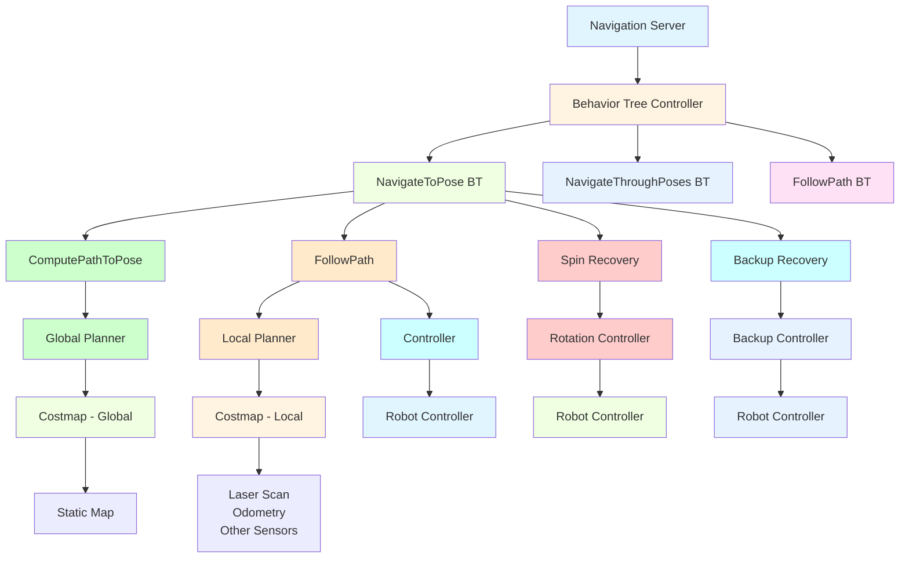

# Chapter 17: Nav2 Stack Overview

## Introduction

The Navigation2 (Nav2) stack is the standard navigation framework for ROS 2, providing a comprehensive set of tools and capabilities for autonomous robot navigation. Built as the successor to ROS 1's navigation stack, Nav2 offers improved architecture, better performance, and enhanced features for developing robust navigation systems. This chapter provides a comprehensive overview of Nav2's architecture, components, and practical implementation.

## Learning Objectives

By the end of this chapter, you will be able to:
- Understand the Nav2 architecture and its key components
- Configure Nav2 for different robot platforms and environments
- Implement navigation behaviors and recovery systems
- Tune navigation parameters for optimal performance
- Debug and troubleshoot navigation issues

## Prerequisites

Before starting this chapter, ensure you have:
- Completed Module 1 (ROS 2 fundamentals, TF2)
- Module 3 Chapter 16 (navigation concepts)
- Basic understanding of ROS 2 actions and services
- Experience with parameter configuration in ROS 2

## Real-World Analogy: The Navigation Operating System

Think of Nav2 like the operating system for robot navigation. Just as a computer operating system manages hardware resources, provides services to applications, and handles system-level operations, Nav2 manages navigation resources, provides path planning and localization services, and handles system-level navigation operations. It abstracts the complexity of navigation algorithms and provides a clean interface for higher-level applications to request navigation goals and receive status updates.

## Core Concepts

### 1. Nav2 Architecture

Nav2 follows a behavior tree-based architecture that provides flexible and robust navigation:

- **Behavior Trees**: Hierarchical task execution for navigation behaviors
- **Action Servers**: Interface for navigation requests and status updates
- **Planners**: Global and local path planning algorithms
- **Controllers**: Robot motion control and trajectory following
- **Recovery Systems**: Behavior recovery for stuck or failed navigation

### 2. Key Components

- **Navigation Server**: Central action server managing navigation lifecycle
- **Map Server**: Provides static and costmap management
- **Local Planner**: Real-time obstacle avoidance and trajectory following
- **Global Planner**: Path planning in known environments
- **Recovery Server**: Behavior recovery for navigation failures

### 3. Navigation Behaviors

- **NavigateToPose**: Navigate to a specific pose in the map
- **NavigateThroughPoses**: Navigate through a sequence of poses
- **FollowPath**: Follow a predefined path
- **Spin**: Rotate in place for localization recovery
- **Backup**: Move backward to escape tight spaces
- **Wait**: Pause navigation for a specified time

## Nav2 Architecture Deep Dive

### Behavior Tree Structure



*Alt-text: Diagram showing Nav2 architecture with Navigation Server at the top controlling behavior trees for different navigation tasks. Each behavior tree contains specific actions like ComputePathToPose, FollowPath, and recovery behaviors. These connect to planners, controllers, and costmaps which interface with maps and sensors.*

### Nav2 Action Server Implementation

```python
#!/usr/bin/env python3

"""
Nav2 Action Server Example
Demonstrates the structure of Nav2 action server implementation
"""

import rclpy
from rclpy.action import ActionServer, GoalResponse, CancelResponse
from rclpy.node import Node
from rclpy.qos import QoSProfile
from nav2_msgs.action import NavigateToPose
from geometry_msgs.msg import PoseStamped
from nav_msgs.msg import Path
from geometry_msgs.msg import Twist
import math
import threading
from typing import Optional


class Nav2ActionServer(Node):
    def __init__(self):
        super().__init__('nav2_action_server')

        # Create action server for NavigateToPose
        self._action_server = ActionServer(
            self,
            NavigateToPose,
            'navigate_to_pose',
            execute_callback=self.execute_callback,
            goal_callback=self.goal_callback,
            cancel_callback=self.cancel_callback
        )

        # Navigation state
        self.current_goal = None
        self.navigation_active = False
        self.navigation_thread = None

        # Publishers and subscribers
        self.cmd_vel_pub = self.create_publisher(Twist, 'cmd_vel', 10)
        self.path_pub = self.create_publisher(Path, 'current_path', 10)

        self.get_logger().info('Nav2 Action Server initialized')

    def goal_callback(self, goal_request):
        """Handle incoming navigation goal"""
        self.get_logger().info(f'Received navigation goal: ({goal_request.pose.pose.position.x}, {goal_request.pose.pose.position.y})')

        # Accept the goal if we're not currently navigating
        if not self.navigation_active:
            return GoalResponse.ACCEPT
        else:
            return GoalResponse.REJECT

    def cancel_callback(self, goal_handle):
        """Handle goal cancellation"""
        self.get_logger().info('Received request to cancel navigation goal')
        return CancelResponse.ACCEPT

    async def execute_callback(self, goal_handle):
        """Execute the navigation goal"""
        self.get_logger().info('Executing navigation goal')

        # Set navigation state
        self.navigation_active = True
        self.current_goal = goal_handle.request.pose

        # Create result structure
        result = NavigateToPose.Result()
        feedback = NavigateToPose.Feedback()

        try:
            # Plan and execute navigation
            success = await self.navigate_to_pose(goal_handle, feedback)

            if success:
                result.result = 1  # SUCCESS
                goal_handle.succeed()
                self.get_logger().info('Navigation completed successfully')
            else:
                result.result = 2  # FAILURE
                goal_handle.abort()
                self.get_logger().info('Navigation failed')

        except Exception as e:
            self.get_logger().error(f'Navigation error: {e}')
            result.result = 3  # CANCELED
            goal_handle.abort()

        # Reset navigation state
        self.navigation_active = False
        self.current_goal = None

        return result

    async def navigate_to_pose(self, goal_handle, feedback):
        """Main navigation execution logic"""
        goal_pose = self.current_goal.pose

        # Get current robot position (simplified)
        current_pose = self.get_current_position()

        # Plan path (simplified - in real system this would call global planner)
        path = self.plan_path(current_pose, goal_pose)

        if not path:
            self.get_logger().error('Failed to plan path to goal')
            return False

        # Publish path for visualization
        self.publish_path(path)

        # Execute path following
        for i, waypoint in enumerate(path):
            # Check if goal was cancelled
            if goal_handle.is_cancel_requested:
                goal_handle.canceled()
                return False

            # Move to waypoint
            success = await self.move_to_waypoint(waypoint, goal_handle)

            if not success:
                return False

            # Provide feedback
            distance_remaining = self.calculate_distance_to_goal(current_pose, goal_pose)
            feedback.distance_remaining = distance_remaining
            goal_handle.publish_feedback(feedback)

        # Check if we reached the goal
        current_pos = self.get_current_position()
        goal_reached = self.is_goal_reached(current_pos, goal_pose)

        return goal_reached

    def plan_path(self, start_pose, goal_pose):
        """Plan path from start to goal (simplified implementation)"""
        # In a real Nav2 system, this would call the global planner
        # For this example, we'll create a simple straight-line path
        path = []

        # Calculate intermediate points
        steps = 20
        for i in range(steps + 1):
            t = i / steps
            x = start_pose.position.x + t * (goal_pose.position.x - start_pose.position.x)
            y = start_pose.position.y + t * (goal_pose.position.y - start_pose.position.y)

            waypoint = PoseStamped()
            waypoint.pose.position.x = x
            waypoint.pose.position.y = y
            waypoint.pose.position.z = 0.0
            waypoint.pose.orientation.w = 1.0  # No rotation

            path.append(waypoint)

        return path

    def move_to_waypoint(self, waypoint, goal_handle):
        """Move robot to specified waypoint"""
        # Calculate direction to waypoint
        current_pos = self.get_current_position()

        dx = waypoint.pose.position.x - current_pos.position.x
        dy = waypoint.pose.position.y - current_pos.position.y

        distance = math.sqrt(dx*dx + dy*dy)

        # Move toward waypoint (simplified)
        cmd_vel = Twist()
        cmd_vel.linear.x = min(0.2, distance)  # Scale speed with distance
        cmd_vel.angular.z = math.atan2(dy, dx) * 0.5  # Proportional angular control

        # Publish command
        self.cmd_vel_pub.publish(cmd_vel)

        # Simulate movement (in real system, wait for actual movement)
        import time
        time.sleep(0.1)

        # Stop robot briefly
        cmd_vel.linear.x = 0.0
        cmd_vel.angular.z = 0.0
        self.cmd_vel_pub.publish(cmd_vel)

        return True

    def get_current_position(self):
        """Get current robot position (simplified)"""
        # In a real system, this would come from localization
        pose = PoseStamped()
        pose.pose.position.x = 0.0  # Starting position
        pose.pose.position.y = 0.0
        pose.pose.position.z = 0.0
        pose.pose.orientation.w = 1.0
        return pose.pose

    def calculate_distance_to_goal(self, current_pose, goal_pose):
        """Calculate remaining distance to goal"""
        dx = goal_pose.position.x - current_pose.position.x
        dy = goal_pose.position.y - current_pose.position.y
        return math.sqrt(dx*dx + dy*dy)

    def is_goal_reached(self, current_pose, goal_pose):
        """Check if goal has been reached"""
        distance = self.calculate_distance_to_goal(current_pose, goal_pose)
        return distance < 0.2  # 20cm threshold

    def publish_path(self, poses):
        """Publish path for visualization"""
        path_msg = Path()
        path_msg.header.stamp = self.get_clock().now().to_msg()
        path_msg.header.frame_id = 'map'
        path_msg.poses = poses

        self.path_pub.publish(path_msg)


def main(args=None):
    rclpy.init(args=args)

    nav2_server = Nav2ActionServer()

    try:
        rclpy.spin(nav2_server)
    except KeyboardInterrupt:
        nav2_server.get_logger().info('Shutting down Nav2 action server')
    finally:
        nav2_server.destroy_node()
        rclpy.shutdown()


if __name__ == '__main__':
    main()
```

## Nav2 Configuration and Parameter Tuning

### Main Nav2 Configuration File

```yaml
# Nav2 Configuration File
bt_navigator:
  ros__parameters:
    use_sim_time: True
    global_frame: map
    robot_base_frame: base_link
    odom_topic: /odom
    bt_loop_duration: 10
    default_server_timeout: 20
    enable_groot_monitoring: True
    groot_zmq_publisher_port: 1666
    groot_zmq_server_port: 1667
    default_nav_through_poses_bt_xml: "navigate_w_replanning_and_recovery.xml"
    default_nav_to_pose_bt_xml: "navigate_w_replanning_and_recovery.xml"
    plugin_lib_names:
    - nav2_compute_path_to_pose_action_bt_node
    - nav2_compute_path_through_poses_action_bt_node
    - nav2_follow_path_action_bt_node
    - nav2_spin_action_bt_node
    - nav2_wait_action_bt_node
    - nav2_back_up_action_bt_node
    - nav2_controller_server
    - nav2_planner_server
    - nav2_recoveries_server
    - nav2_bt_navigator
    - nav2_velocity_smoother
    - nav2_pose_smoother
    - nav2_lifecycle_manager
    - nav2_world_model
    - nav2_dwb_controller
    - nav2_smac_planner
    - nav2_splinter_planner
    - nav2_amcl
    - nav2_map_server
    - nav2_loader
    - nav2_costmap_converter
    - nav2_voxel_grid

controller_server:
  ros__parameters:
    use_sim_time: True
    controller_frequency: 20.0
    min_x_velocity_threshold: 0.001
    min_y_velocity_threshold: 0.5
    min_theta_velocity_threshold: 0.001
    progress_checker_plugin: "progress_checker"
    goal_checker_plugin: "goal_checker"
    controller_plugins: ["FollowPath"]

    # Progress checker parameters
    progress_checker:
      plugin: "nav2_controller::SimpleProgressChecker"
      required_movement_radius: 0.5
      movement_time_allowance: 10.0

    # Goal checker parameters
    goal_checker:
      plugin: "nav2_controller::SimpleGoalChecker"
      xy_goal_tolerance: 0.25
      yaw_goal_tolerance: 0.25
      stateful: True

    # FollowPath controller parameters
    FollowPath:
      plugin: "nav2_rotation_shim::RotationShimController"
      distance_threshold: 0.25
      rotate_to_heading_angular_vel: 1.0
      max_angular_accel: 3.2
      simulate_ahead_time: 1.0

planner_server:
  ros__parameters:
    use_sim_time: True
    planner_plugins: ["GridBased"]
    GridBased:
      plugin: "nav2_navfn_planner/NavfnPlanner"
      tolerance: 0.5
      use_astar: false
      allow_unknown: true

recoveries_server:
  ros__parameters:
    costmap_topic: local_costmap/costmap_raw
    footprint_topic: local_costmap/published_footprint
    cycle_frequency: 10.0
    recovery_plugins: ["spin", "backup", "wait"]
    spin:
      plugin: "nav2_recoveries/Spin"
      spin_dist: 1.57
    backup:
      plugin: "nav2_recoveries/BackUp"
      backup_dist: 0.15
      backup_speed: 0.025
    wait:
      plugin: "nav2_recoveries/Wait"
      wait_duration: 1.0

local_costmap:
  local_costmap:
    ros__parameters:
      update_frequency: 5.0
      publish_frequency: 2.0
      global_frame: odom
      robot_base_frame: base_link
      use_sim_time: True
      rolling_window: true
      width: 3
      height: 3
      resolution: 0.05
      robot_radius: 0.22
      plugins: ["voxel_layer", "inflation_layer"]
      inflation_layer:
        plugin: "nav2_costmap_2d::InflationLayer"
        cost_scaling_factor: 3.0
        inflation_radius: 0.55
      voxel_layer:
        plugin: "nav2_costmap_2d::VoxelLayer"
        enabled: True
        publish_voxel_map: True
        origin_z: 0.0
        z_resolution: 0.2
        z_voxels: 10
        max_obstacle_height: 2.0
        mark_threshold: 0
        observation_sources: scan
        scan:
          topic: /scan
          max_obstacle_height: 2.0
          clearing: True
          marking: True
          data_type: "LaserScan"
          raytrace_max_range: 3.0
          raytrace_min_range: 0.0
          obstacle_max_range: 2.5
          obstacle_min_range: 0.0

global_costmap:
  global_costmap:
    ros__parameters:
      update_frequency: 1.0
      publish_frequency: 1.0
      global_frame: map
      robot_base_frame: base_link
      use_sim_time: True
      robot_radius: 0.22
      resolution: 0.05
      plugins: ["static_layer", "obstacle_layer", "inflation_layer"]
      obstacle_layer:
        plugin: "nav2_costmap_2d::ObstacleLayer"
        enabled: True
        observation_sources: scan
        scan:
          topic: /scan
          max_obstacle_height: 2.0
          clearing: True
          marking: True
          data_type: "LaserScan"
          raytrace_max_range: 3.0
          raytrace_min_range: 0.0
          obstacle_max_range: 2.5
          obstacle_min_range: 0.0
      static_layer:
        plugin: "nav2_costmap_2d::StaticLayer"
        map_subscribe_transient_local: True
      inflation_layer:
        plugin: "nav2_costmap_2d::InflationLayer"
        cost_scaling_factor: 3.0
        inflation_radius: 0.55

dwb_controller:
  ros__parameters:
    use_sim_time: True
    debug_trajectory_details: False
    min_vel_x: 0.0
    min_vel_y: 0.0
    max_vel_x: 0.26
    max_vel_y: 0.0
    max_vel_theta: 1.0
    min_speed_xy: 0.0
    max_speed_xy: 0.26
    min_speed_theta: 0.0
    acc_lim_x: 2.5
    acc_lim_y: 0.0
    acc_lim_theta: 3.2
    decel_lim_x: -2.5
    decel_lim_y: 0.0
    decel_lim_theta: -3.2
    vx_samples: 20
    vy_samples: 5
    vtheta_samples: 20
    sim_time: 1.7
    linear_granularity: 0.05
    angular_granularity: 0.025
    transform_tolerance: 0.2
    xy_goal_tolerance: 0.25
    trans_stopped_velocity: 0.1
    short_circuit_trajectory_evaluation: True
    stateful: True
    critics: ["RotateToGoal", "Oscillation", "BaseObstacle", "GoalAlign", "PathAlign", "PathDist", "GoalDist"]
    BaseObstacle.scale: 0.02
    PathAlign.scale: 32.0
    PathAlign.forward_point_distance: 0.1
    GoalAlign.scale: 24.0
    GoalAlign.forward_point_distance: 0.1
    PathDist.scale: 32.0
    GoalDist.scale: 24.0
    RotateToGoal.scale: 32.0
    RotateToGoal.slowing_factor: 5.0
    RotateToGoal.lookahead_time: -1.0
```

## Behavior Tree Configuration

### Navigate with Recovery Behavior Tree

```xml
<!-- navigate_w_replanning_and_recovery.xml -->
<root main_tree_to_execute="MainTree">
  <BehaviorTree ID="MainTree">
    <RecoveryNode number_of_retries="6" name="NavigateRecovery">
      <PipelineSequence name="NavigateWithReplanning">
        <RateController hz="1.0">
          <RecoveryNode number_of_retries="1" name="ComputePathToPose">
            <RecoveryNode number_of_retries="1" name="SmoothPath">
              <PipelineSequence name="ComputeAndSmoothPath">
                <ComputePathToPose name="ComputePath" />
                <SmoothPath name="SmoothPath" />
              </PipelineSequence>
              <ClearEntireCostmap name="ClearGlobalCostmap-Context" />
            </RecoveryNode>
            <ClearEntireCostmap name="ClearGlobalCostmap-Path" />
          </RecoveryNode>
        </RateController>
        <RecoveryNode number_of_retries="2" name="FollowPath">
          <FollowPath name="FollowPath" />
          <ClearEntireCostmap name="ClearLocalCostmap-Path" />
        </RecoveryNode>
      </PipelineSequence>
      <ReactiveFallback name="RecoveryFallback">
        <GoalUpdated name="GoalUpdated" />
        <PipelineSequence name="RecoveryActions">
          <ClearEntireCostmap name="ClearLocalCostmap-Recovery" />
          <ClearEntireCostmap name="ClearGlobalCostmap-Recovery" />
          <RecoveryNode number_of_retries="1" name="Spin">
            <Spin spin_dist="1.57" name="Spin" />
            <ReactiveFallback name="SpinRecoveryFallback">
              <GoalUpdated name="SpinGoalUpdated" />
              <Wait wait_duration="5" name="Wait" />
            </ReactiveFallback>
          </RecoveryNode>
        </PipelineSequence>
      </ReactiveFallback>
    </RecoveryNode>
  </BehaviorTree>
</root>
```

## Hands-On Exercise: Nav2 System Integration

Let's create a complete Nav2 system integration example:

```python
#!/usr/bin/env python3

"""
Complete Nav2 System Integration Example
This demonstrates how all Nav2 components work together
"""

import rclpy
from rclpy.node import Node
from rclpy.action import ActionClient
from rclpy.qos import QoSProfile
from geometry_msgs.msg import PoseStamped
from nav2_msgs.action import NavigateToPose
from nav_msgs.msg import Odometry
from sensor_msgs.msg import LaserScan
from tf2_ros import TransformListener, Buffer
import math
from typing import Optional


class Nav2SystemManager(Node):
    def __init__(self):
        super().__init__('nav2_system_manager')

        # Create TF2 buffer and listener
        self.tf_buffer = Buffer()
        self.tf_listener = TransformListener(self.tf_buffer, self)

        # Create action client for navigation
        self.nav_client = ActionClient(self, NavigateToPose, 'navigate_to_pose')

        # Subscribers for robot state
        self.odom_sub = self.create_subscription(
            Odometry, 'odom', self.odom_callback, 10
        )
        self.laser_sub = self.create_subscription(
            LaserScan, 'scan', self.laser_callback, 10
        )

        # Robot state
        self.current_pose = None
        self.navigation_goal = None
        self.navigation_active = False

        # Navigation parameters
        self.goal_tolerance = 0.5  # meters
        self.min_obstacle_distance = 0.5  # meters

        # Wait for navigation server
        self.nav_client.wait_for_server()

        self.get_logger().info('Nav2 System Manager initialized')

    def odom_callback(self, msg):
        """Handle odometry data"""
        self.current_pose = msg.pose.pose

    def laser_callback(self, msg):
        """Handle laser scan data for safety"""
        if self.navigation_active:
            # Check for obstacles in front of robot
            front_scan = msg.ranges[len(msg.ranges)//2 - 10:len(msg.ranges)//2 + 10]
            min_distance = min(front_scan) if front_scan else float('inf')

            if min_distance < self.min_obstacle_distance:
                self.get_logger().warn('Obstacle detected, navigation may be unsafe')

    def send_navigation_goal(self, x, y, theta=0.0):
        """Send navigation goal to Nav2 server"""
        goal_msg = NavigateToPose.Goal()
        goal_msg.pose.header.frame_id = 'map'
        goal_msg.pose.header.stamp = self.get_clock().now().to_msg()
        goal_msg.pose.pose.position.x = x
        goal_msg.pose.pose.position.y = y
        goal_msg.pose.pose.position.z = 0.0

        # Convert theta to quaternion (simplified)
        import math
        goal_msg.pose.pose.orientation.z = math.sin(theta / 2.0)
        goal_msg.pose.pose.orientation.w = math.cos(theta / 2.0)

        self.get_logger().info(f'Sending navigation goal: ({x}, {y}, {theta})')

        # Send goal
        self.navigation_active = True
        self.navigation_goal = goal_msg.pose.pose

        future = self.nav_client.send_goal_async(
            goal_msg,
            feedback_callback=self.navigation_feedback
        )
        future.add_done_callback(self.goal_response_callback)

    def goal_response_callback(self, future):
        """Handle goal response"""
        goal_handle = future.result()
        if not goal_handle.accepted:
            self.get_logger().info('Goal rejected')
            self.navigation_active = False
            return

        self.get_logger().info('Goal accepted')
        result_future = goal_handle.get_result_async()
        result_future.add_done_callback(self.get_result_callback)

    def get_result_callback(self, future):
        """Handle navigation result"""
        result = future.result().result
        self.get_logger().info(f'Navigation completed with result: {result}')
        self.navigation_active = False

    def navigation_feedback(self, feedback_msg):
        """Handle navigation feedback"""
        feedback = feedback_msg.feedback
        distance_remaining = feedback.distance_remaining
        self.get_logger().info(f'Distance remaining: {distance_remaining:.2f}m')

    def is_navigation_complete(self):
        """Check if navigation is complete"""
        return not self.navigation_active

    def cancel_navigation(self):
        """Cancel current navigation goal"""
        # In a real implementation, you would cancel the goal here
        pass

    def get_current_position(self):
        """Get current robot position"""
        return self.current_pose


def main(args=None):
    rclpy.init(args=args)

    nav2_manager = Nav2SystemManager()

    # Example: Send a navigation goal after a delay
    def send_example_goal():
        nav2_manager.send_navigation_goal(2.0, 2.0, 0.0)  # Go to (2, 2)

    # Schedule example goal
    timer = nav2_manager.create_timer(2.0, send_example_goal)

    try:
        rclpy.spin(nav2_manager)
    except KeyboardInterrupt:
        nav2_manager.get_logger().info('Shutting down Nav2 system manager')
    finally:
        nav2_manager.destroy_node()
        rclpy.shutdown()


if __name__ == '__main__':
    main()
```

## Nav2 Launch File

```xml
<launch>
  <!-- Nav2 System Launch File -->

  <!-- Lifecycle Manager -->
  <node pkg="nav2_lifecycle_manager"
        exec="lifecycle_manager"
        name="lifecycle_manager"
        output="screen">
    <param name="use_sim_time" value="True"/>
    <param name="autostart" value="True"/>
    <param name="node_names" value="[map_server, amcl, planner_server, controller_server, bt_navigator, recoveries_server, velocity_smoother, robot_state_publisher]"/>
  </node>

  <!-- Map Server -->
  <node pkg="nav2_map_server"
        exec="map_server"
        name="map_server"
        output="screen">
    <param name="yaml_filename" value="path/to/your/map.yaml"/>
    <param name="topic_name" value="map"/>
    <param name="frame_id" value="map"/>
    <param name="output" value="screen"/>
  </node>

  <!-- AMCL Localization -->
  <node pkg="nav2_amcl"
        exec="amcl"
        name="amcl"
        output="screen">
    <param name="use_sim_time" value="True"/>
    <param name="install_prefix" value="$(var install_prefix default='/opt/ros/humble')"/>
  </node>

  <!-- Planner Server -->
  <node pkg="nav2_planner"
        exec="planner_server"
        name="planner_server"
        output="screen">
    <param name="use_sim_time" value="True"/>
    <param name="planner_plugins" value="GridBased"/>
    <param name="GridBased.name" value="GridBased"/>
    <param name="GridBased.type" value="nav2_navfn_planner/NavfnPlanner"/>
  </node>

  <!-- Controller Server -->
  <node pkg="nav2_controller"
        exec="controller_server"
        name="controller_server"
        output="screen">
    <param name="use_sim_time" value="True"/>
    <param name="controller_frequency" value="20.0"/>
    <param name="min_x_velocity_threshold" value="0.001"/>
    <param name="min_y_velocity_threshold" value="0.5"/>
    <param name="min_theta_velocity_threshold" value="0.001"/>
    <param name="progress_checker_plugin" value="progress_checker"/>
    <param name="goal_checker_plugin" value="goal_checker"/>
    <param name="controller_plugins" value="FollowPath"/>
    <param name="FollowPath.type" value="nav2_rotation_shim::RotationShimController"/>
  </node>

  <!-- Behavior Tree Navigator -->
  <node pkg="nav2_bt_navigator"
        exec="bt_navigator"
        name="bt_navigator"
        output="screen">
    <param name="use_sim_time" value="True"/>
    <param name="global_frame" value="map"/>
    <param name="robot_base_frame" value="base_link"/>
    <param name="odom_topic" value="/odom"/>
    <param name="default_nav_to_pose_bt_xml" value="$(find-pkg-share nav2_bt_navigator)/behavior_trees/navigate_w_replanning_and_recovery.xml"/>
  </node>

  <!-- Recovery Server -->
  <node pkg="nav2_recoveries"
        exec="recoveries_server"
        name="recoveries_server"
        output="screen">
    <param name="use_sim_time" value="True"/>
  </node>

  <!-- Velocity Smoother -->
  <node pkg="nav2_velocity_smoother"
        exec="velocity_smoother"
        name="velocity_smoother"
        output="screen">
    <param name="use_sim_time" value="True"/>
    <param name="velocity_scaling_tolerance" value="1.0"/>
    <param name="velocity_threshold" value="0.0"/>
  </node>

  <!-- Local and Global Costmap Servers -->
  <node pkg="nav2_costmap_2d"
        exec="costmap_2d_node"
        name="local_costmap"
        output="screen">
    <param name="use_sim_time" value="True"/>
    <param name="layered_costmap" value="true"/>
    <param name="name" value="local_costmap"/>
  </node>

  <node pkg="nav2_costmap_2d"
        exec="costmap_2d_node"
        name="global_costmap"
        output="screen">
    <param name="use_sim_time" value="True"/>
    <param name="layered_costmap" value="true"/>
    <param name="name" value="global_costmap"/>
  </node>

  <!-- Robot State Publisher -->
  <node pkg="robot_state_publisher"
        exec="robot_state_publisher"
        name="robot_state_publisher"
        output="screen">
    <param name="use_sim_time" value="True"/>
  </node>

</launch>
```

## Key Navigation Behaviors and Recovery Systems

### Recovery Behaviors

Nav2 includes several built-in recovery behaviors:

1. **Spin**: Rotate in place to clear localization issues
2. **Backup**: Move backward to escape tight spaces
3. **Wait**: Pause navigation to allow dynamic obstacles to clear

### Costmap Layers

Nav2 uses layered costmaps for obstacle representation:

- **Static Layer**: Pre-mapped obstacles from the static map
- **Obstacle Layer**: Real-time obstacles from sensors
- **Inflation Layer**: Safety margins around obstacles
- **Voxel Layer**: 3D obstacle representation

## Quiz: Nav2 Stack Overview

1. What is the main navigation action server in Nav2?
2. Name three recovery behaviors available in Nav2.
3. What is the purpose of behavior trees in Nav2?
4. How does Nav2 handle navigation goal cancellation?

## Hands-On Challenge

Implement a custom Nav2 recovery behavior that:
1. Detects when the robot is stuck using sensor data
2. Implements a custom escape maneuver (not spin, backup, or wait)
3. Integrates with the Nav2 recovery system
4. Includes safety checks to prevent collisions

## Summary

This chapter covered the Nav2 navigation stack:
- Architecture based on behavior trees and action servers
- Key components: planners, controllers, recovery systems
- Configuration and parameter tuning
- Integration with ROS 2 systems
- Recovery behaviors and safety mechanisms

## Further Reading

- Nav2 Documentation and Tutorials
- Behavior Trees in Robotics
- Navigation Parameter Tuning Guide
- Custom Nav2 Plugins Development

## Next Chapter Preview

Chapter 18 will explore SLAM (Simultaneous Localization and Mapping) fundamentals, covering how robots build maps of unknown environments while simultaneously determining their position within those maps.