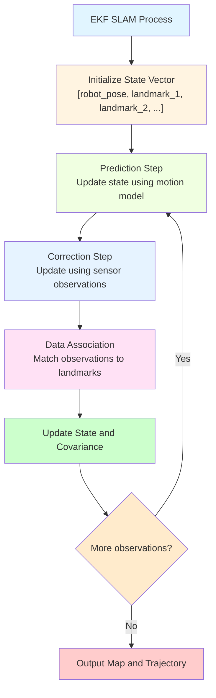

# Chapter 18: SLAM Fundamentals

## Introduction

Simultaneous Localization and Mapping (SLAM) is one of the most challenging and fundamental problems in robotics. SLAM enables robots to build a map of an unknown environment while simultaneously determining their position within that map. This chicken-and-egg problem has been a cornerstone of robotics research for decades and is essential for truly autonomous robots that operate in previously unmapped environments.

## Learning Objectives

By the end of this chapter, you will be able to:
- Explain the fundamental concepts and challenges of SLAM
- Understand different SLAM algorithms and their trade-offs
- Implement basic SLAM systems using various sensor modalities
- Integrate sensor data for robust mapping and localization
- Evaluate SLAM system performance and accuracy

## Prerequisites

Before starting this chapter, ensure you have:
- Completed Module 1 (ROS 2 fundamentals, TF2, sensors)
- Module 2 (sensor simulation concepts)
- Module 3 Chapter 16 (navigation concepts)
- Basic understanding of probability and statistics
- Experience with sensor data processing

## Real-World Analogy: The Exploring Explorer

Think of SLAM like an explorer in an unknown land with a compass, measuring tools, and the ability to draw maps. The explorer must simultaneously: map the terrain they discover, determine their current location on the map, and remember the path they've taken. The challenge is that the explorer's position estimate affects the map, and the map quality affects position accuracy - they must solve both problems simultaneously with imperfect tools and measurements.

## Core Concepts

### 1. The SLAM Problem

The SLAM problem can be mathematically expressed as estimating the robot's trajectory and the map of landmarks:

- **State Estimation**: Estimate robot poses and landmark positions
- **Data Association**: Match sensor observations to known landmarks
- **Loop Closure**: Recognize previously visited locations to correct drift

### 2. SLAM Classifications

- **Feature-based SLAM**: Uses distinctive landmarks (corners, lines)
- **Grid-based SLAM**: Uses occupancy grids to represent the environment
- **Graph-based SLAM**: Formulates SLAM as an optimization problem
- **Visual SLAM**: Uses camera imagery for mapping and localization

### 3. SLAM Challenges

- **Data Association**: Distinguishing between new and previously observed features
- **Drift Accumulation**: Error accumulation over time in odometry
- **Computational Complexity**: Scaling to large environments
- **Real-time Constraints**: Processing data in real-time for navigation

## SLAM Algorithm Fundamentals

### Extended Kalman Filter (EKF) SLAM



*Alt-text: Diagram showing EKF SLAM process with initialization of state vector containing robot pose and landmarks, followed by prediction step using motion model, correction step using sensor observations, data association to match observations to landmarks, and state/covariance updates. Process loops back for more observations.*

### EKF SLAM Implementation

```python
#!/usr/bin/env python3

"""
EKF SLAM Implementation
Basic implementation of Extended Kalman Filter SLAM
"""

import rclpy
from rclpy.node import Node
from sensor_msgs.msg import LaserScan
from nav_msgs.msg import Odometry
from geometry_msgs.msg import PoseWithCovarianceStamped, PointStamped
from visualization_msgs.msg import Marker, MarkerArray
from std_msgs.msg import Header
import numpy as np
import math
from typing import List, Tuple, Dict, Optional


class EKFSlam(Node):
    def __init__(self):
        super().__init__('ekf_slam')

        # Subscribers
        self.odom_sub = self.create_subscription(
            Odometry, 'odom', self.odom_callback, 10
        )
        self.scan_sub = self.create_subscription(
            LaserScan, 'scan', self.scan_callback, 10
        )

        # Publishers
        self.map_pub = self.create_publisher(MarkerArray, 'slam_map', 10)
        self.pose_pub = self.create_publisher(PoseWithCovarianceStamped, 'slam_pose', 10)

        # SLAM state
        self.mu = np.zeros(3)  # Robot pose [x, y, theta]
        self.sigma = np.eye(3) * 0.1  # State covariance
        self.landmarks = {}  # Dictionary of landmarks {id: [x, y]}
        self.landmark_ids = 0  # Counter for landmark IDs

        # Motion and sensor models
        self.motion_noise = np.diag([0.1, 0.1, 0.05])  # [dx, dy, dtheta]
        self.measurement_noise = np.diag([0.1, 0.05])  # [range, bearing]

        # Previous odometry for motion model
        self.prev_odom = None

        self.get_logger().info('EKF SLAM initialized')

    def odom_callback(self, msg):
        """Handle odometry data for motion prediction"""
        current_pose = np.array([
            msg.pose.pose.position.x,
            msg.pose.pose.position.y,
            self.quaternion_to_yaw(msg.pose.pose.orientation)
        ])

        if self.prev_odom is not None:
            # Calculate motion from previous pose
            prev_pose = np.array([
                self.prev_odom.pose.pose.position.x,
                self.prev_odom.pose.pose.position.y,
                self.quaternion_to_yaw(self.prev_odom.pose.pose.orientation)
            ])

            # Calculate relative motion
            delta = current_pose - prev_pose
            # Normalize angle difference
            delta[2] = math.atan2(math.sin(delta[2]), math.cos(delta[2]))

            # Prediction step
            self.predict_motion(delta)

        self.prev_odom = msg

    def scan_callback(self, msg):
        """Handle laser scan data for landmark detection and correction"""
        # Extract landmarks from laser scan (simplified - real implementation would use edge detection)
        landmarks = self.extract_landmarks(msg)

        for landmark_range, landmark_bearing in landmarks:
            # Convert polar to Cartesian relative to robot
            rel_x = landmark_range * math.cos(landmark_bearing)
            rel_y = landmark_range * math.sin(landmark_bearing)

            # Transform to global coordinates
            robot_x, robot_y, robot_theta = self.mu[0], self.mu[1], self.mu[2]
            global_x = robot_x + rel_x * math.cos(robot_theta) - rel_y * math.sin(robot_theta)
            global_y = robot_y + rel_x * math.sin(robot_theta) + rel_y * math.cos(robot_theta)

            # Data association - find closest existing landmark or create new one
            closest_id, closest_dist = self.data_associate(global_x, global_y)

            if closest_dist > 1.0:  # Threshold for new landmark
                # Add new landmark
                landmark_id = self.landmark_ids
                self.landmark_ids += 1
                self.add_landmark(landmark_id, [global_x, global_y])
            else:
                # Update existing landmark
                landmark_id = closest_id

            # Correction step
            self.update_landmark(landmark_id, [global_x, global_y])

        # Publish current pose and map
        self.publish_pose()
        self.publish_map()

    def predict_motion(self, delta):
        """Prediction step: update state based on motion"""
        # Extract motion components
        dx, dy, dtheta = delta

        # Update robot pose
        self.mu[0] += dx * math.cos(self.mu[2]) - dy * math.sin(self.mu[2])
        self.mu[1] += dx * math.sin(self.mu[2]) + dy * math.cos(self.mu[2])
        self.mu[2] += dtheta

        # Normalize angle
        self.mu[2] = math.atan2(math.sin(self.mu[2]), math.cos(self.mu[2]))

        # Jacobian of motion model with respect to state
        G = np.eye(3)
        G[0, 2] = -dx * math.sin(self.mu[2]) - dy * math.cos(self.mu[2])
        G[1, 2] = dx * math.cos(self.mu[2]) - dy * math.sin(self.mu[2])

        # Jacobian of motion model with respect to noise
        V = np.zeros((3, 3))
        V[0, 0] = math.cos(self.mu[2])
        V[0, 1] = -math.sin(self.mu[2])
        V[1, 0] = math.sin(self.mu[2])
        V[1, 1] = math.cos(self.mu[2])
        V[2, 2] = 1.0

        # Update covariance
        self.sigma = G @ self.sigma @ G.T + V @ self.motion_noise @ V.T

    def extract_landmarks(self, scan_msg):
        """Extract landmark features from laser scan (simplified)"""
        landmarks = []

        # Simple landmark extraction: look for large differences in consecutive ranges
        ranges = np.array(scan_msg.ranges)
        angles = np.linspace(scan_msg.angle_min, scan_msg.angle_max, len(ranges))

        # Find potential landmarks (large range differences - edges)
        for i in range(1, len(ranges) - 1):
            if not (np.isinf(ranges[i]) or np.isnan(ranges[i])):
                # Look for edges (potential landmarks)
                prev_range = ranges[i-1] if not (np.isinf(ranges[i-1]) or np.isnan(ranges[i-1])) else ranges[i]
                next_range = ranges[i+1] if not (np.isinf(ranges[i+1]) or np.isnan(ranges[i+1])) else ranges[i]

                if abs(ranges[i] - prev_range) > 0.3 or abs(ranges[i] - next_range) > 0.3:
                    landmarks.append((ranges[i], angles[i]))

        return landmarks[:5]  # Limit to 5 landmarks to avoid computational overload

    def data_associate(self, x, y):
        """Associate measurement with existing landmark"""
        min_dist = float('inf')
        closest_id = -1

        for landmark_id, landmark_pos in self.landmarks.items():
            dist = math.sqrt((x - landmark_pos[0])**2 + (y - landmark_pos[1])**2)
            if dist < min_dist:
                min_dist = dist
                closest_id = landmark_id

        return closest_id, min_dist

    def add_landmark(self, landmark_id, position):
        """Add a new landmark to the state vector"""
        # Expand state vector and covariance matrix
        old_size = len(self.mu)
        new_size = old_size + 2  # Add x, y for landmark

        # Expand state vector
        new_mu = np.zeros(new_size)
        new_mu[:old_size] = self.mu
        new_mu[old_size:old_size+2] = position

        # Expand covariance matrix
        new_sigma = np.zeros((new_size, new_size))
        new_sigma[:old_size, :old_size] = self.sigma
        # Initialize landmark uncertainty with high values
        new_sigma[old_size:old_size+2, old_size:old_size+2] = np.eye(2) * 100.0

        self.mu = new_mu
        self.sigma = new_sigma
        self.landmarks[landmark_id] = position

    def update_landmark(self, landmark_id, measured_pos):
        """Update existing landmark based on measurement"""
        if landmark_id not in self.landmarks:
            return

        # Get landmark index in state vector
        landmark_idx = 3 + landmark_id * 2  # Robot state is first 3 elements

        # Expected measurement (landmark position in robot frame)
        robot_x, robot_y, robot_theta = self.mu[0], self.mu[1], self.mu[2]
        landmark_x, landmark_y = self.mu[landmark_idx], self.mu[landmark_idx + 1]

        # Transform landmark to robot frame
        rel_x = (landmark_x - robot_x) * math.cos(robot_theta) + (landmark_y - robot_y) * math.sin(robot_theta)
        rel_y = -(landmark_x - robot_x) * math.sin(robot_theta) + (landmark_y - robot_y) * math.cos(robot_theta)

        # Measurement Jacobian
        H = np.zeros((2, len(self.mu)))
        # Jacobian with respect to robot state
        H[0, 0] = -math.cos(robot_theta)  # dx/dx_robot
        H[0, 1] = -math.sin(robot_theta)  # dx/dy_robot
        H[0, 2] = (landmark_x - robot_x) * math.sin(robot_theta) - (landmark_y - robot_y) * math.cos(robot_theta)  # dx/dtheta_robot
        H[1, 0] = math.sin(robot_theta)   # dy/dx_robot
        H[1, 1] = -math.cos(robot_theta)  # dy/dy_robot
        H[1, 2] = -(landmark_x - robot_x) * math.cos(robot_theta) - (landmark_y - robot_y) * math.sin(robot_theta)  # dy/dtheta_robot

        # Jacobian with respect to landmark state
        H[0, landmark_idx] = math.cos(robot_theta)   # dx/dx_landmark
        H[0, landmark_idx + 1] = math.sin(robot_theta)  # dx/dy_landmark
        H[1, landmark_idx] = -math.sin(robot_theta)  # dy/dx_landmark
        H[1, landmark_idx + 1] = math.cos(robot_theta)  # dy/dy_landmark

        # Innovation
        z_expected = np.array([rel_x, rel_y])
        z_measured = np.array([
            (measured_pos[0] - robot_x) * math.cos(robot_theta) + (measured_pos[1] - robot_y) * math.sin(robot_theta),
            -(measured_pos[0] - robot_x) * math.sin(robot_theta) + (measured_pos[1] - robot_y) * math.cos(robot_theta)
        ])
        innovation = z_measured - z_expected

        # Innovation covariance
        S = H @ self.sigma @ H.T + self.measurement_noise

        # Kalman gain
        K = self.sigma @ H.T @ np.linalg.inv(S)

        # Update state and covariance
        self.mu = self.mu + K @ innovation
        self.sigma = (np.eye(len(self.mu)) - K @ H) @ self.sigma

        # Update landmark position
        self.landmarks[landmark_id] = [self.mu[landmark_idx], self.mu[landmark_idx + 1]]

    def quaternion_to_yaw(self, quat):
        """Convert quaternion to yaw angle"""
        siny_cosp = 2 * (quat.w * quat.z + quat.x * quat.y)
        cosy_cosp = 1 - 2 * (quat.y * quat.y + quat.z * quat.z)
        return math.atan2(siny_cosp, cosy_cosp)

    def publish_pose(self):
        """Publish current robot pose with covariance"""
        pose_msg = PoseWithCovarianceStamped()
        pose_msg.header = Header()
        pose_msg.header.stamp = self.get_clock().now().to_msg()
        pose_msg.header.frame_id = 'map'
        pose_msg.pose.pose.position.x = float(self.mu[0])
        pose_msg.pose.pose.position.y = float(self.mu[1])
        pose_msg.pose.pose.position.z = 0.0

        # Convert angle to quaternion
        yaw = self.mu[2]
        pose_msg.pose.pose.orientation.z = math.sin(yaw / 2.0)
        pose_msg.pose.pose.orientation.w = math.cos(yaw / 2.0)

        # Convert covariance matrix to array
        for i in range(36):
            row = i // 6
            col = i % 6
            if row < 3 and col < 3:
                pose_msg.pose.covariance[i] = float(self.sigma[row, col])
            else:
                pose_msg.pose.covariance[i] = 0.0 if row != col else 1.0

        self.pose_pub.publish(pose_msg)

    def publish_map(self):
        """Publish landmarks as markers for visualization"""
        marker_array = MarkerArray()

        # Create markers for each landmark
        for i, (landmark_id, position) in enumerate(self.landmarks.items()):
            marker = Marker()
            marker.header = Header()
            marker.header.stamp = self.get_clock().now().to_msg()
            marker.header.frame_id = 'map'
            marker.ns = 'slam_landmarks'
            marker.id = i
            marker.type = Marker.SPHERE
            marker.action = Marker.ADD

            marker.pose.position.x = position[0]
            marker.pose.position.y = position[1]
            marker.pose.position.z = 0.0
            marker.pose.orientation.w = 1.0

            marker.scale.x = 0.1
            marker.scale.y = 0.1
            marker.scale.z = 0.1

            marker.color.r = 1.0
            marker.color.g = 0.0
            marker.color.b = 0.0
            marker.color.a = 1.0

            marker_array.markers.append(marker)

        self.map_pub.publish(marker_array)


def main(args=None):
    rclpy.init(args=args)

    ekf_slam = EKFSlam()

    try:
        rclpy.spin(ekf_slam)
    except KeyboardInterrupt:
        ekf_slam.get_logger().info('Shutting down EKF SLAM')
    finally:
        ekf_slam.destroy_node()
        rclpy.shutdown()


if __name__ == '__main__':
    main()
```

## Grid-Based SLAM Implementation

```python
#!/usr/bin/env python3

"""
Grid-Based SLAM Implementation
Occupancy grid mapping with robot localization
"""

import rclpy
from rclpy.node import Node
from sensor_msgs.msg import LaserScan
from nav_msgs.msg import Odometry, OccupancyGrid
from geometry_msgs.msg import Pose, Point
from std_msgs.msg import Header
import numpy as np
import math
from typing import List, Tuple


class GridBasedSlam(Node):
    def __init__(self):
        super().__init__('grid_slam')

        # Subscribers
        self.odom_sub = self.create_subscription(
            Odometry, 'odom', self.odom_callback, 10
        )
        self.scan_sub = self.create_subscription(
            LaserScan, 'scan', self.scan_callback, 10
        )

        # Publishers
        self.map_pub = self.create_publisher(OccupancyGrid, 'slam_map', 10)

        # Grid map parameters
        self.grid_resolution = 0.1  # meters per cell
        self.grid_width = 100       # cells
        self.grid_height = 100      # cells
        self.grid_origin_x = -5.0   # meters
        self.grid_origin_y = -5.0   # meters

        # Initialize occupancy grid (log-odds representation)
        self.grid = np.zeros((self.grid_height, self.grid_width))  # log-odds
        self.log_odds_occupied = math.log(0.9 / 0.1)      # P(occupied) = 0.9
        self.log_odds_free = math.log(0.3 / 0.7)          # P(free) = 0.3
        self.log_odds_unknown = math.log(0.5 / 0.5)       # P(unknown) = 0.5

        # Robot pose
        self.robot_x = 0.0
        self.robot_y = 0.0
        self.robot_theta = 0.0

        # Initialize map
        self.publish_map()

        self.get_logger().info('Grid-Based SLAM initialized')

    def odom_callback(self, msg):
        """Update robot pose from odometry"""
        self.robot_x = msg.pose.pose.position.x
        self.robot_y = msg.pose.pose.position.y
        self.robot_theta = self.quaternion_to_yaw(msg.pose.pose.orientation)

    def scan_callback(self, msg):
        """Process laser scan to update occupancy grid"""
        # Convert robot pose to grid coordinates
        robot_grid_x = int((self.robot_x - self.grid_origin_x) / self.grid_resolution)
        robot_grid_y = int((self.robot_y - self.grid_origin_y) / self.grid_resolution)

        # Process each laser beam
        angle = msg.angle_min
        for i, range_val in enumerate(msg.ranges):
            if not (math.isinf(range_val) or math.isnan(range_val)) and range_val < msg.range_max:
                # Calculate endpoint of laser beam in world coordinates
                beam_x = self.robot_x + range_val * math.cos(self.robot_theta + angle)
                beam_y = self.robot_y + range_val * math.sin(self.robot_theta + angle)

                # Convert to grid coordinates
                beam_grid_x = int((beam_x - self.grid_origin_x) / self.grid_resolution)
                beam_grid_y = int((beam_y - self.grid_origin_y) / self.grid_resolution)

                # Perform ray tracing to update grid
                self.ray_trace(robot_grid_x, robot_grid_y, beam_grid_x, beam_grid_y)

            angle += msg.angle_increment

        # Publish updated map
        self.publish_map()

    def ray_trace(self, start_x, start_y, end_x, end_y):
        """Ray trace from robot to obstacle, updating occupancy probabilities"""
        # Bresenham's line algorithm for ray tracing
        dx = abs(end_x - start_x)
        dy = abs(end_y - start_y)
        x_step = 1 if end_x > start_x else -1
        y_step = 1 if end_y > start_y else -1

        error = dx - dy
        x, y = start_x, start_y

        # Mark cells along the ray as free, except the endpoint
        while x != end_x or y != end_y:
            # Check bounds
            if 0 <= x < self.grid_width and 0 <= y < self.grid_height:
                # Update cell as free
                self.grid[y, x] += self.log_odds_free - self.log_odds_unknown

            # Move to next cell
            error2 = 2 * error
            if error2 > -dy:
                error -= dy
                x += x_step
            if error2 < dx:
                error += dx
                y += y_step

        # Mark endpoint as occupied
        if 0 <= end_x < self.grid_width and 0 <= end_y < self.grid_height:
            self.grid[end_y, end_x] += self.log_odds_occupied - self.log_odds_unknown

        # Clamp values to prevent overflow
        self.grid = np.clip(self.grid, -50, 50)

    def quaternion_to_yaw(self, quat):
        """Convert quaternion to yaw angle"""
        siny_cosp = 2 * (quat.w * quat.z + quat.x * quat.y)
        cosy_cosp = 1 - 2 * (quat.y * quat.y + quat.z * quat.z)
        return math.atan2(siny_cosp, cosy_cosp)

    def publish_map(self):
        """Publish occupancy grid map"""
        map_msg = OccupancyGrid()
        map_msg.header = Header()
        map_msg.header.stamp = self.get_clock().now().to_msg()
        map_msg.header.frame_id = 'map'

        # Set map metadata
        map_msg.info.resolution = self.grid_resolution
        map_msg.info.width = self.grid_width
        map_msg.info.height = self.grid_height
        map_msg.info.origin.position.x = self.grid_origin_x
        map_msg.info.origin.position.y = self.grid_origin_y
        map_msg.info.origin.position.z = 0.0
        map_msg.info.origin.orientation.w = 1.0

        # Convert log-odds to probability and then to occupancy grid format
        # Convert to 0-100 scale for OccupancyGrid message
        prob_grid = 1 - 1 / (1 + np.exp(self.grid))
        int_grid = (prob_grid * 100).astype(np.int8)

        # Flatten grid and convert to list
        map_msg.data = [int(val) for val in int_grid.flatten()]

        self.map_pub.publish(map_msg)


def main(args=None):
    rclpy.init(args=args)

    grid_slam = GridBasedSlam()

    try:
        rclpy.spin(grid_slam)
    except KeyboardInterrupt:
        grid_slam.get_logger().info('Shutting down Grid SLAM')
    finally:
        grid_slam.destroy_node()
        rclpy.shutdown()


if __name__ == '__main__':
    main()
```

## Particle Filter SLAM (Monte Carlo Localization)

```python
#!/usr/bin/env python3

"""
Particle Filter SLAM Implementation
Monte Carlo Localization with landmark mapping
"""

import rclpy
from rclpy.node import Node
from sensor_msgs.msg import LaserScan
from nav_msgs.msg import Odometry
from geometry_msgs.msg import PoseArray, Pose
from std_msgs.msg import Header
import numpy as np
import math
from typing import List, Tuple


class ParticleFilterSlam(Node):
    def __init__(self):
        super().__init__('particle_slam')

        # Subscribers
        self.odom_sub = self.create_subscription(
            Odometry, 'odom', self.odom_callback, 10
        )
        self.scan_sub = self.create_subscription(
            LaserScan, 'scan', self.scan_callback, 10
        )

        # Publishers
        self.particles_pub = self.create_publisher(PoseArray, 'slam_particles', 10)

        # Particle filter parameters
        self.num_particles = 100
        self.motion_noise = [0.1, 0.1, 0.05]  # [dx, dy, dtheta]
        self.measurement_noise = 0.1  # range noise

        # Initialize particles
        self.particles = np.zeros((self.num_particles, 3))  # [x, y, theta]
        self.weights = np.ones(self.num_particles) / self.num_particles

        # Initialize with some uncertainty around origin
        for i in range(self.num_particles):
            self.particles[i, 0] = np.random.normal(0, 0.1)
            self.particles[i, 1] = np.random.normal(0, 0.1)
            self.particles[i, 2] = np.random.normal(0, 0.1)

        # Previous odometry
        self.prev_odom = None

        # Landmarks (simplified - in real implementation these would be detected features)
        self.landmarks = np.array([
            [2.0, 2.0],
            [4.0, 1.0],
            [-1.0, 3.0],
            [3.0, -2.0]
        ])

        self.get_logger().info('Particle Filter SLAM initialized')

    def odom_callback(self, msg):
        """Handle odometry for motion update"""
        current_pose = np.array([
            msg.pose.pose.position.x,
            msg.pose.pose.position.y,
            self.quaternion_to_yaw(msg.pose.pose.orientation)
        ])

        if self.prev_odom is not None:
            prev_pose = np.array([
                self.prev_odom.pose.pose.position.x,
                self.prev_odom.pose.pose.position.y,
                self.quaternion_to_yaw(self.prev_odom.pose.pose.orientation)
            ])

            # Calculate motion
            motion = current_pose - prev_pose
            # Normalize angle
            motion[2] = math.atan2(math.sin(motion[2]), math.cos(motion[2]))

            # Update particles based on motion
            self.motion_update(motion)

            # Publish particles for visualization
            self.publish_particles()

        self.prev_odom = msg

    def scan_callback(self, msg):
        """Handle laser scan for measurement update"""
        # Simplified: use laser ranges to update particle weights
        # In real implementation, you would match features to landmarks

        # Calculate likelihood for each particle
        for i in range(self.num_particles):
            particle_pose = self.particles[i]
            likelihood = self.calculate_likelihood(particle_pose, msg)
            self.weights[i] *= likelihood

        # Normalize weights
        if np.sum(self.weights) > 0:
            self.weights /= np.sum(self.weights)
        else:
            # Reset weights if all are zero
            self.weights = np.ones(self.num_particles) / self.num_particles

        # Resample particles
        self.resample_particles()

        # Publish updated particles
        self.publish_particles()

    def motion_update(self, motion):
        """Update particles based on motion"""
        for i in range(self.num_particles):
            # Add noise to motion
            noisy_motion = motion + np.random.normal(0, self.motion_noise)

            # Update particle pose
            self.particles[i, 0] += (noisy_motion[0] * math.cos(self.particles[i, 2]) -
                                   noisy_motion[1] * math.sin(self.particles[i, 2]))
            self.particles[i, 1] += (noisy_motion[0] * math.sin(self.particles[i, 2]) +
                                   noisy_motion[1] * math.cos(self.particles[i, 2]))
            self.particles[i, 2] += noisy_motion[2]

            # Normalize angle
            self.particles[i, 2] = math.atan2(math.sin(self.particles[i, 2]), math.cos(self.particles[i, 2]))

    def calculate_likelihood(self, particle_pose, scan_msg):
        """Calculate likelihood of scan given particle pose"""
        # Simplified likelihood calculation
        # In real implementation, match observed features to expected features

        likelihood = 1.0

        # For each beam in the scan
        angle = scan_msg.angle_min
        for range_val in scan_msg.ranges:
            if not (math.isinf(range_val) or math.isnan(range_val)) and range_val < scan_msg.range_max:
                # Predict what range should be from this particle's pose
                # This is a simplified version - real implementation would use map
                expected_range = self.predict_range(particle_pose, angle)

                # Calculate likelihood based on difference
                diff = abs(range_val - expected_range)
                beam_likelihood = math.exp(-0.5 * (diff / self.measurement_noise) ** 2)
                likelihood *= beam_likelihood

            angle += scan_msg.angle_increment

        return max(likelihood, 1e-6)  # Prevent zero likelihood

    def predict_range(self, particle_pose, beam_angle):
        """Predict range measurement from particle pose and beam angle"""
        # Simplified: find distance to nearest landmark
        # In real implementation, use actual map

        robot_x, robot_y, robot_theta = particle_pose
        beam_world_angle = robot_theta + beam_angle

        min_dist = float('inf')

        for landmark in self.landmarks:
            dx = landmark[0] - robot_x
            dy = landmark[1] - robot_y
            dist = math.sqrt(dx*dx + dy*dy)

            # Check if landmark is in beam direction
            landmark_angle = math.atan2(dy, dx)
            angle_diff = abs(math.atan2(math.sin(beam_world_angle - landmark_angle),
                                      math.cos(beam_world_angle - landmark_angle)))

            if angle_diff < 0.1:  # Beam width
                min_dist = min(min_dist, dist)

        return min_dist if min_dist != float('inf') else 10.0  # Default max range

    def resample_particles(self):
        """Resample particles based on weights"""
        # Systematic resampling
        new_particles = np.zeros_like(self.particles)

        # Calculate step and starting point
        step = 1.0 / self.num_particles
        start = np.random.uniform(0, step)

        # Calculate cumulative weights
        cumsum = np.cumsum(self.weights)

        i, j = 0, 0
        while i < self.num_particles:
            if start + j * step <= cumsum[i]:
                new_particles[j] = self.particles[i]
                j += 1
            else:
                i += 1

        self.particles = new_particles
        self.weights = np.ones(self.num_particles) / self.num_particles

    def quaternion_to_yaw(self, quat):
        """Convert quaternion to yaw angle"""
        siny_cosp = 2 * (quat.w * quat.z + quat.x * quat.y)
        cosy_cosp = 1 - 2 * (quat.y * quat.y + quat.z * quat.z)
        return math.atan2(siny_cosp, cosy_cosp)

    def publish_particles(self):
        """Publish particles for visualization"""
        particles_msg = PoseArray()
        particles_msg.header = Header()
        particles_msg.header.stamp = self.get_clock().now().to_msg()
        particles_msg.header.frame_id = 'map'

        for i in range(self.num_particles):
            pose = Pose()
            pose.position.x = float(self.particles[i, 0])
            pose.position.y = float(self.particles[i, 1])
            pose.position.z = 0.0

            # Convert angle to quaternion
            yaw = self.particles[i, 2]
            pose.orientation.z = math.sin(yaw / 2.0)
            pose.orientation.w = math.cos(yaw / 2.0)

            particles_msg.poses.append(pose)

        self.particles_pub.publish(particles_msg)


def main(args=None):
    rclpy.init(args=args)

    particle_slam = ParticleFilterSlam()

    try:
        rclpy.spin(particle_slam)
    except KeyboardInterrupt:
        particle_slam.get_logger().info('Shutting down Particle SLAM')
    finally:
        particle_slam.destroy_node()
        rclpy.shutdown()


if __name__ == '__main__':
    main()
```

## SLAM Evaluation and Metrics

### SLAM Accuracy Assessment Node

```python
#!/usr/bin/env python3

"""
SLAM Evaluation Node
Assess SLAM system accuracy and performance
"""

import rclpy
from rclpy.node import Node
from geometry_msgs.msg import PoseWithCovarianceStamped, PoseStamped
from nav_msgs.msg import Odometry, Path
from std_msgs.msg import Float64
import numpy as np
import math
from typing import List, Tuple


class SlamEvaluator(Node):
    def __init__(self):
        super().__init__('slam_evaluator')

        # Subscribers
        self.slam_pose_sub = self.create_subscription(
            PoseWithCovarianceStamped, 'slam_pose', self.slam_pose_callback, 10
        )
        self.ground_truth_sub = self.create_subscription(
            Odometry, 'ground_truth', self.ground_truth_callback, 10
        )

        # Publishers
        self.rmse_pub = self.create_publisher(Float64, 'slam_rmse', 10)
        self.ate_pub = self.create_publisher(Float64, 'slam_ate', 10)

        # Storage for trajectory comparison
        self.slam_trajectory = []
        self.ground_truth_trajectory = []
        self.time_stamps = []

        # Evaluation metrics
        self.rmse = 0.0
        self.ate = 0.0  # Absolute Trajectory Error

        self.get_logger().info('SLAM Evaluator initialized')

    def slam_pose_callback(self, msg):
        """Handle SLAM estimated pose"""
        slam_pos = np.array([msg.pose.pose.position.x, msg.pose.pose.position.y])
        self.slam_trajectory.append(slam_pos)
        self.time_stamps.append(msg.header.stamp.sec + msg.header.stamp.nanosec * 1e-9)

    def ground_truth_callback(self, msg):
        """Handle ground truth pose"""
        gt_pos = np.array([msg.pose.pose.position.x, msg.pose.pose.position.y])
        self.ground_truth_trajectory.append(gt_pos)

    def calculate_rmse(self):
        """Calculate Root Mean Square Error between trajectories"""
        if len(self.slam_trajectory) == 0 or len(self.ground_truth_trajectory) == 0:
            return 0.0

        # Align trajectories by length (simplified approach)
        min_len = min(len(self.slam_trajectory), len(self.ground_truth_trajectory))
        slam_traj = np.array(self.slam_trajectory[:min_len])
        gt_traj = np.array(self.ground_truth_trajectory[:min_len])

        # Calculate errors
        errors = np.linalg.norm(slam_traj - gt_traj, axis=1)
        rmse = np.sqrt(np.mean(errors**2))

        return rmse

    def calculate_ate(self):
        """Calculate Absolute Trajectory Error"""
        if len(self.slam_trajectory) == 0 or len(self.ground_truth_trajectory) == 0:
            return 0.0

        min_len = min(len(self.slam_trajectory), len(self.ground_truth_trajectory))
        slam_traj = np.array(self.slam_trajectory[:min_len])
        gt_traj = np.array(self.ground_truth_trajectory[:min_len])

        # Calculate absolute trajectory error
        ate = np.mean(np.linalg.norm(slam_traj - gt_traj, axis=1))

        return ate

    def publish_metrics(self):
        """Publish evaluation metrics"""
        rmse_msg = Float64()
        rmse_msg.data = float(self.rmse)
        self.rmse_pub.publish(rmse_msg)

        ate_msg = Float64()
        ate_msg.data = float(self.ate)
        self.ate_pub.publish(ate_msg)

        self.get_logger().info(f'SLAM Metrics - RMSE: {self.rmse:.3f}m, ATE: {self.ate:.3f}m')


def main(args=None):
    rclpy.init(args=args)

    slam_evaluator = SlamEvaluator()

    # Timer to periodically calculate and publish metrics
    def evaluate_timer():
        slam_evaluator.rmse = slam_evaluator.calculate_rmse()
        slam_evaluator.ate = slam_evaluator.calculate_ate()
        slam_evaluator.publish_metrics()

    timer = slam_evaluator.create_timer(1.0, evaluate_timer)

    try:
        rclpy.spin(slam_evaluator)
    except KeyboardInterrupt:
        slam_evaluator.get_logger().info('Shutting down SLAM evaluator')
    finally:
        slam_evaluator.destroy_node()
        rclpy.shutdown()


if __name__ == '__main__':
    main()
```

## Hands-On Exercise: Implementing a Simple SLAM System

Let's create a complete SLAM system that integrates all components:

```python
#!/usr/bin/env python3

"""
Complete SLAM System Integration
Integrates odometry, sensor data, and SLAM algorithms
"""

import rclpy
from rclpy.node import Node
from sensor_msgs.msg import LaserScan
from nav_msgs.msg import Odometry
from geometry_msgs.msg import Twist
from tf2_ros import TransformBroadcaster
from geometry_msgs.msg import TransformStamped
import numpy as np
import math
from typing import Optional


class CompleteSlamSystem(Node):
    def __init__(self):
        super().__init__('complete_slam_system')

        # Create transform broadcaster
        self.tf_broadcaster = TransformBroadcaster(self)

        # Subscribers
        self.odom_sub = self.create_subscription(
            Odometry, 'odom', self.odom_callback, 10
        )
        self.scan_sub = self.create_subscription(
            LaserScan, 'scan', self.scan_callback, 10
        )

        # Publishers
        self.cmd_vel_pub = self.create_publisher(Twist, 'cmd_vel', 10)

        # SLAM state
        self.robot_pose = [0.0, 0.0, 0.0]  # x, y, theta
        self.map = {}  # Simple landmark map
        self.scan_history = []  # Store scan history for loop closure

        # Motion model parameters
        self.prev_odom = None
        self.motion_threshold = 0.1  # Minimum movement to trigger map update

        # SLAM parameters
        self.map_resolution = 0.1
        self.laser_range = 10.0

        self.get_logger().info('Complete SLAM System initialized')

    def odom_callback(self, msg):
        """Handle odometry data and update robot pose"""
        # Update robot pose based on odometry
        new_pose = [
            msg.pose.pose.position.x,
            msg.pose.pose.position.y,
            self.quaternion_to_yaw(msg.pose.pose.orientation)
        ]

        # Calculate motion since last update
        if self.prev_odom is not None:
            prev_pose = [
                self.prev_odom.pose.pose.position.x,
                self.prev_odom.pose.pose.position.y,
                self.quaternion_to_yaw(self.prev_odom.pose.pose.orientation)
            ]

            # Calculate distance moved
            dist_moved = math.sqrt(
                (new_pose[0] - prev_pose[0])**2 + (new_pose[1] - prev_pose[1])**2
            )

            if dist_moved > self.motion_threshold:
                # Update robot pose
                self.robot_pose = new_pose

                # Broadcast transform
                self.broadcast_transform()

                # Process SLAM update
                self.slam_update()

        self.prev_odom = msg

    def scan_callback(self, msg):
        """Handle laser scan data"""
        # Store scan for later processing
        self.scan_history.append({
            'ranges': list(msg.ranges),
            'angles': list(np.linspace(msg.angle_min, msg.angle_max, len(msg.ranges))),
            'pose': self.robot_pose.copy(),
            'timestamp': self.get_clock().now()
        })

        # Keep only recent scans (for efficiency)
        if len(self.scan_history) > 100:
            self.scan_history = self.scan_history[-50:]

    def slam_update(self):
        """Main SLAM update function"""
        # Extract landmarks from current scan
        landmarks = self.extract_landmarks_from_scan()

        # Add landmarks to map
        for landmark in landmarks:
            landmark_id = self.get_landmark_id(landmark)
            if landmark_id not in self.map:
                self.map[landmark_id] = {
                    'position': landmark,
                    'observations': 1,
                    'last_observed': self.get_clock().now()
                }
            else:
                # Update landmark position with weighted average
                old_pos = self.map[landmark_id]['position']
                weight = self.map[landmark_id]['observations']
                new_pos = [
                    (old_pos[0] * weight + landmark[0]) / (weight + 1),
                    (old_pos[1] * weight + landmark[1]) / (weight + 1)
                ]
                self.map[landmark_id]['position'] = new_pos
                self.map[landmark_id]['observations'] += 1
                self.map[landmark_id]['last_observed'] = self.get_clock().now()

        # Check for loop closure (simplified)
        self.check_loop_closure()

    def extract_landmarks_from_scan(self):
        """Extract landmarks from laser scan (simplified edge detection)"""
        if not hasattr(self, 'prev_scan') or self.prev_scan is None:
            self.prev_scan = [float('inf')] * 360  # Initialize with large values
            return []

        current_scan = self.prev_scan  # Use previous scan for this simplified version
        landmarks = []

        # Simple landmark extraction: look for large differences in consecutive ranges
        for i in range(1, len(current_scan) - 1):
            if not (math.isinf(current_scan[i]) or math.isnan(current_scan[i])):
                prev_range = current_scan[i-1] if not (math.isinf(current_scan[i-1]) or math.isnan(current_scan[i-1])) else current_scan[i]
                next_range = current_scan[i+1] if not (math.isinf(current_scan[i+1]) or math.isnan(current_scan[i+1])) else current_scan[i]

                if abs(current_scan[i] - prev_range) > 0.3 or abs(current_scan[i] - next_range) > 0.3:
                    # Convert polar to Cartesian in robot frame
                    angle = (i / len(current_scan)) * 2 * math.pi - math.pi
                    x_robot = current_scan[i] * math.cos(angle)
                    y_robot = current_scan[i] * math.sin(angle)

                    # Transform to global frame
                    x_global = (self.robot_pose[0] +
                               x_robot * math.cos(self.robot_pose[2]) -
                               y_robot * math.sin(self.robot_pose[2]))
                    y_global = (self.robot_pose[1] +
                               x_robot * math.sin(self.robot_pose[2]) +
                               y_robot * math.cos(self.robot_pose[2]))

                    landmarks.append([x_global, y_global])

        self.prev_scan = [r if not (math.isinf(r) or math.isnan(r)) else float('inf') for r in current_scan]
        return landmarks[:10]  # Limit to 10 landmarks

    def get_landmark_id(self, landmark_pos):
        """Generate a unique ID for a landmark based on its position"""
        # Quantize position to grid resolution for ID generation
        grid_x = int(landmark_pos[0] / self.map_resolution)
        grid_y = int(landmark_pos[1] / self.map_resolution)
        return f"{grid_x}_{grid_y}"

    def check_loop_closure(self):
        """Check if robot has returned to a previously visited location"""
        # Simplified loop closure: check if current pose is close to any previous pose
        if len(self.scan_history) < 10:
            return False

        # Look for similar poses in history (simplified)
        current_pos = np.array(self.robot_pose[:2])

        for scan_data in self.scan_history[:-5]:  # Skip last 5 to avoid immediate matches
            prev_pos = np.array(scan_data['pose'][:2])
            dist = np.linalg.norm(current_pos - prev_pos)

            if dist < 0.5:  # Threshold for loop closure
                self.get_logger().info(f'Loop closure detected! Distance: {dist:.2f}m')
                # In a real system, this would trigger map optimization
                return True

        return False

    def broadcast_transform(self):
        """Broadcast robot's pose as transform"""
        t = TransformStamped()

        t.header.stamp = self.get_clock().now().to_msg()
        t.header.frame_id = 'map'
        t.child_frame_id = 'base_link'

        t.transform.translation.x = self.robot_pose[0]
        t.transform.translation.y = self.robot_pose[1]
        t.transform.translation.z = 0.0

        # Convert angle to quaternion
        yaw = self.robot_pose[2]
        t.transform.rotation.z = math.sin(yaw / 2.0)
        t.transform.rotation.w = math.cos(yaw / 2.0)

        self.tf_broadcaster.sendTransform(t)

    def quaternion_to_yaw(self, quat):
        """Convert quaternion to yaw angle"""
        siny_cosp = 2 * (quat.w * quat.z + quat.x * quat.y)
        cosy_cosp = 1 - 2 * (quat.y * quat.y + quat.z * quat.z)
        return math.atan2(siny_cosp, cosy_cosp)

    def get_current_map(self):
        """Get current map for other nodes"""
        return self.map

    def get_robot_pose(self):
        """Get current robot pose"""
        return self.robot_pose


def main(args=None):
    rclpy.init(args=args)

    slam_system = CompleteSlamSystem()

    try:
        rclpy.spin(slam_system)
    except KeyboardInterrupt:
        slam_system.get_logger().info('Shutting down complete SLAM system')
    finally:
        slam_system.destroy_node()
        rclpy.shutdown()


if __name__ == '__main__':
    main()
```

## Key SLAM Concepts and Techniques

### 1. Data Association Methods

- **Nearest Neighbor**: Associate measurements with closest predicted landmarks
- **Joint Compatibility**: Consider multiple hypotheses for data association
- **Maximum Likelihood**: Use probabilistic models for association

### 2. Map Representations

- **Feature-based**: Store distinctive landmarks with properties
- **Grid-based**: Discretize space into occupancy cells
- **Topological**: Store connectivity between locations
- **Semantic**: Include object-level understanding

### 3. Optimization Approaches

- **Filter-based**: EKF, Particle filters for online estimation
- **Smoothing**: Batch optimization for trajectory refinement
- **Graph-based**: Formulate as graph optimization problem

## Quiz: SLAM Fundamentals

1. What does SLAM stand for?
2. What are the two main components that SLAM solves simultaneously?
3. Name three different SLAM approaches based on map representation.
4. What is the "data association" problem in SLAM?
5. What is loop closure and why is it important?

## Hands-On Challenge

Implement a graph-based SLAM system that:
1. Creates a graph of poses and constraints from sensor observations
2. Uses a graph optimization library (like g2o or Ceres) to optimize the trajectory
3. Demonstrates improved accuracy over filter-based approaches
4. Includes loop closure detection and optimization

## Summary

This chapter covered SLAM fundamentals:
- The simultaneous localization and mapping problem
- Different SLAM approaches: EKF, grid-based, particle filter
- Data association and loop closure challenges
- Evaluation metrics for SLAM systems
- Practical implementation considerations

## Further Reading

- Probabilistic Robotics by Thrun, Burgard, and Fox
- Simultaneous Localisation and Mapping: A Survey of Current Methods
- Robot Mapping and SLAM Tutorial
- OpenSLAM.org Resources

## Next Chapter Preview

Chapter 19 will explore specific SLAM implementations including GMapping and Cartographer, covering their configuration, tuning, and practical deployment on real robot systems.