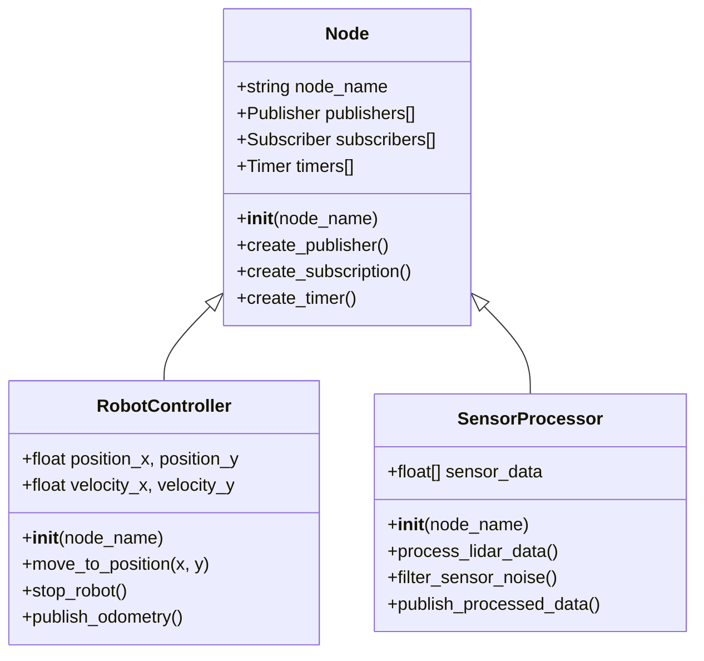
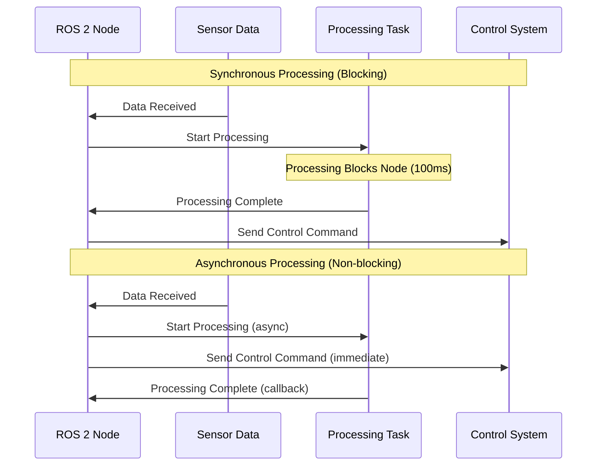

import MermaidDiagram from '@site/src/components/MermaidDiagram';
import CodeExample from '@site/src/components/CodeExample';
import Exercise from '@site/src/components/Exercise';
import Quiz from '@site/src/components/Quiz';
import PrerequisiteCheck from '@site/src/components/PrerequisiteCheck';

<PrerequisiteCheck prerequisites={frontMatter.prerequisites} />

# باب 3: ROS 2 کے لیے پائی تھون (Python) پیٹرن (patterns)

## یہ کیوں اہم ہے (Why This Matters)

ٹیسلا آپٹیمس اور فیگر 02 جیسے جدید ہیومنوائڈ روبوٹس پیچیدہ رویوں کو منظم کرنے کے لیے ترقی یافتہ سافٹ ویئر آرکیٹیکچر پر انحصار کرتے ہیں۔ یہ روبوٹ فی سیکنڈ ہزاروں آپریشنز انجام دیتے ہیں— سینسر ڈیٹا پروسیس کرنا، حرکات کا منصوبہ بنانا، توازن برقرار رکھنا، اور صارف کمانڈز کا جواب دینا۔ مناسب ڈیزائن پیٹرنز کا استعمال کرتے ہوئے کارکردگی اور قابلِ دیکھ بھال پائی تھون کوڈ لکھنا روبوٹک سسٹمز کو مضبوط بنانے کے لیے انتہائی ضروری ہے۔ آبجیکٹ اورینٹڈ پروگرامنگ پیچیدہ نوڈ آرکیٹیکچر کو منظم کرنے میں مدد کرتی ہے، نامپائی کارکردگی کے ریاضیاتی حسابات کو فعال کرتا ہے، اور غیر ہم وقتی پروگرامنگ چلنے والے آپریشنز کو ہموار اور بلاک کیے بغیر رکھنے کی اجازت دیتی ہے جو روبوٹس کو جواب دینے کے قابل رکھتی ہے۔

## مثلاً: ریستوران کیچن اورکیسٹرا (The Restaurant Kitchen Orchestra)

### روزمرہ کا منظر (Everyday Scenario)
اگر آپ شام کے کھانے کے دوران مصروف ریستوران کے کچن کا تصور کریں۔ سرکوک ہر کام کو ذاتی طور پر نہیں سنبھالتے— بجائے اس کے، وہ مخصوص اسٹیشنز کا اہتمام کرتے ہیں: تیاری کے کوک اجزاء کو سنبھالتے ہیں، سوٹے کے کوک گرم ڈشز کا انتظام کرتے ہیں، اور گرل کے کوک پروٹینز کو سنبھالتے ہیں۔ ہر اسٹیشن آزادانہ طور پر کام کرتا ہے لیکن ٹکٹ سسٹم کے ذریعے بات چیت کرتا ہے۔ جب ایک نیا آرڈر آتا ہے، سرکوک دیگر آرڈرز کو پراسیس کیے جانے سے بلاک کیے بغیر اسٹیشنز کے درمیان مربوط کاری کرتے ہیں۔ کچن معیاری ٹولز (چاقو، پین، ٹائمرز) اور تکنیکوں (mise en place) کا استعمال کرتا ہے تاکہ مسلسل مطابقت اور کارکردگی یقینی بنائی جا سکے۔

### روبوٹکس سے ربط (The Connection to Robotics)
ROS 2 نوڈس کچن اسٹیشنز کی طرح کام کرتے ہیں: ہر ایک مخصوص کاموں (نیویگیشن، ادراک، کنٹرول) کو سنبھالتا ہے لیکن ٹاپکس اور سروسز کے ذریعے بات چیت کرتا ہے۔ آبجیکٹ اورینٹڈ پروگرامنگ عام روبوٹ رویوں کے لیے دوبارہ استعمال کے "ریسیپی" (کلاسز) تیار کرتا ہے۔ نامپائی ریاضیاتی کاموں (روبوٹ کنیمیٹکس کے لیے میٹرکس ٹرانسفارمیشنز) کے لیے کارکردگی کے "ٹولز" فراہم کرتا ہے۔ غیر ہم وقتی پروگرامنگ روبوٹ کو متعدد کاموں کو ایک ساتھ سنبھالنے کی اجازت دیتا ہے (حرکت کا منصوبہ بناتے ہوئے سینسر ڈیٹا کو سننا) بلاک کیے بغیر آپریشنز۔

### مثلاً کہاں ناکام ہوتی ہے (Where the Analogy Breaks Down)
ریستوران کے کچن محسوس کردہ اجزاء کے ساتھ جسمانی جگہ میں کام کرتے ہیں؛ روبوٹک سافٹ ویئر غیر محسوس ڈیٹا کے ساتھ ڈیجیٹل جگہ میں کام کرتا ہے۔ کچن کا وقت منٹس میں ماپا جاتا ہے؛ روبوٹکس کو حقیقی وقت کنٹرول کے لیے ملی سیکنڈ کی درستگی کی ضرورت ہوتی ہے۔

### روبوٹکس کی اصطلاحات میں (In Robotics Terms)
ROS 2 میں **آبجیکٹ اورینٹڈ پروگرامنگ** انسولیٹڈ حالت اور رویے کے ساتھ دوبارہ استعمال کے نوڈ کلاسز تیار کرتی ہے۔ **نامپائی ارےز** سینسر پروسیسنگ اور کنٹرول الگورتھم کے لیے کارکردگی کے ریاضیاتی کام فراہم کرتے ہیں۔ **غیر ہم وقتی پیٹرنز** بلاک کیے بغیر آپریشنز کو فعال کرتے ہیں جو طویل مدتی کاموں کے دوران روبوٹ کے جواب دینے کے قابل کو برقرار رکھتے ہیں۔

## بنیادی تصورات (Core Concepts)

### 1. ROS 2 نوڈس کے لیے آبجیکٹ اورینٹڈ پروگرامنگ (Object-Oriented Programming for ROS 2 Nodes)

آبجیکٹ اورینٹڈ پروگرامنگ (OOP) قابلِ دیکھ بھال اور اسکیل ایبل ROS 2 نوڈس تیار کرنے کے لیے اہم ہے۔ طریقہ کار کوڈ لکھنے کے بجائے، ہم فعالیت کو کلاسز میں منظم کرتے ہیں جو روبوٹ کمپوننٹس یا رویوں کی نمائندگی کرتے ہیں۔

**Mermaid Diagram**: OOP Node Architecture



*Alt-text: Class diagram showing Node as base class with RobotController and SensorProcessor inheriting from it. Node class has attributes for publishers, subscribers, and timers. RobotController has position and velocity attributes with movement methods. SensorProcessor has sensor data array with processing methods.*

ROS 2 میں **اہم OOP اصول**:
- **اینکیپسولیشن**: نوڈ کی حالت اور رویہ کلاسز کے اندر مشتمل ہوتے ہیں
- **وراثت**: کسٹم نوڈس rclpy.Node بیس کلاس سے وارث میں ملتے ہیں
- **پولی مارفزم**: مختلف نوڈس عام انٹرفیسز کو نافذ کر سکتے ہیں

### 2. موثر ڈیٹا پروسیسنگ کے لیے NumPy

NumPy سینسر ڈیٹا پروسیسنگ، ٹرانسفارمیشن میٹرکسز، اور کنٹرول کیلکولیشنز جیسے روبوٹکس ایپلی کیشنز کے لیے ضروری کارکردگی کے ارے آپریشنز فراہم کرتا ہے۔

**مثال: روبوٹ کی پوز ٹرانسفارمیشن**
```python
import numpy as np

def transform_pose(x, y, theta, translation_x, translation_y):
    """
    گردش اور ترجمہ کا استعمال کرتے ہوئے روبوٹ کی پوز تبدیل کریں
    """
    # ٹرانسفارمیشن میٹرکس بنائیں
    cos_theta = np.cos(theta)
    sin_theta = np.sin(theta)

    transform_matrix = np.array([
        [cos_theta, -sin_theta, translation_x],
        [sin_theta, cos_theta, translation_y],
        [0, 0, 1]
    ])

    # ہوموجینیس کوآرڈینیٹس میں روبوٹ کی پوز
    pose_vector = np.array([x, y, 1])

    # ٹرانسفارمیشن لاگو کریں
    new_pose = transform_matrix @ pose_vector

    return new_pose[0], new_pose[1], theta

# مثال کا استعمال
robot_x, robot_y = 1.0, 2.0
robot_theta = np.pi / 4  # 45 ڈگری
new_x, new_y, new_theta = transform_pose(robot_x, robot_y, robot_theta, 0.5, 0.3)
```

### 3. غیر ہم وقتی پروگرامنگ پیٹرنز

ROS 2 نوڈس کو اکثر دیگر کال بیکس کو بلاک کیے بغیر طویل مدتی کام انجام دینے کی ضرورت ہوتی ہے۔ غیر ہم وقتی پروگرامنگ پیٹرنز یقین دہانی کرتے ہیں کہ نوڈس جواب دینے کے قابل رہیں۔

**Mermaid Diagram**: Async vs Sync Processing



*Alt-text: Sequence diagram comparing synchronous and asynchronous processing. In synchronous mode, processing blocks the node for 100ms. In asynchronous mode, processing runs independently while the node can continue handling other tasks.*

## Worked Example: Advanced Robot Controller with OOP and Async

Let's build a comprehensive robot controller that demonstrates OOP, NumPy, and async patterns:

```python
#!/usr/bin/env python3
"""
Advanced Robot Controller using OOP, NumPy, and Async patterns
"""

import rclpy
from rclpy.node import Node
from geometry_msgs.msg import Twist, Pose
from sensor_msgs.msg import LaserScan
import numpy as np
import asyncio
from threading import Thread
import time


class RobotController(Node):
    """
    Advanced robot controller using OOP principles
    """

    def __init__(self):
        super().__init__('advanced_robot_controller')

        # Initialize attributes
        self.current_pose = np.array([0.0, 0.0, 0.0])  # x, y, theta
        self.target_pose = np.array([0.0, 0.0, 0.0])
        self.laser_data = None
        self.is_moving = False

        # Create publishers and subscribers
        self.cmd_vel_publisher = self.create_publisher(Twist, '/cmd_vel', 10)
        self.pose_subscriber = self.create_subscription(
            Pose, '/robot_pose', self.pose_callback, 10
        )
        self.laser_subscriber = self.create_subscription(
            LaserScan, '/scan', self.laser_callback, 10
        )

        # Create timer for control loop
        self.control_timer = self.create_timer(0.1, self.control_loop)

        self.get_logger().info('Advanced Robot Controller initialized')

    def pose_callback(self, msg):
        """Update current pose from Pose message"""
        self.current_pose[0] = msg.position.x
        self.current_pose[1] = msg.position.y
        # Simplified: assume orientation in z component
        self.current_pose[2] = 0.0  # In a real system, would use quaternion

    def laser_callback(self, msg):
        """Process laser scan data using NumPy"""
        # Convert laser ranges to NumPy array for efficient processing
        ranges = np.array(msg.ranges)

        # Filter out invalid ranges (inf, nan)
        valid_ranges = ranges[np.isfinite(ranges)]

        # Calculate minimum distance for obstacle detection
        if len(valid_ranges) > 0:
            min_distance = np.min(valid_ranges)
            self.laser_data = {
                'min_distance': min_distance,
                'avg_distance': np.mean(valid_ranges),
                'valid_ranges_count': len(valid_ranges)
            }

    def calculate_control_command(self):
        """Calculate velocity command using NumPy operations"""
        if self.laser_data and self.laser_data['min_distance'] < 0.5:
            # Emergency stop if obstacle too close
            return Twist()

        # Calculate desired movement vector
        displacement = self.target_pose[:2] - self.current_pose[:2]
        distance = np.linalg.norm(displacement)

        if distance < 0.1:  # Close enough to target
            return Twist()

        # Normalize direction vector
        direction = displacement / distance
        speed = min(0.5, distance * 0.5)  # Proportional control

        # Create velocity command
        cmd_vel = Twist()
        cmd_vel.linear.x = float(speed * direction[0])
        cmd_vel.linear.y = float(speed * direction[1])
        cmd_vel.angular.z = float(self.target_pose[2] - self.current_pose[2]) * 0.5

        return cmd_vel

    def control_loop(self):
        """Main control loop"""
        if not self.is_moving:
            return

        cmd_vel = self.calculate_control_command()
        self.cmd_vel_publisher.publish(cmd_vel)

    def set_target_pose(self, x, y, theta=0.0):
        """Set new target pose for the robot"""
        self.target_pose = np.array([x, y, theta])
        self.is_moving = True
        self.get_logger().info(f'Set target pose: [{x}, {y}, {theta}]')

    def stop_robot(self):
        """Stop robot movement"""
        self.is_moving = False
        # Send stop command
        stop_cmd = Twist()
        self.cmd_vel_publisher.publish(stop_cmd)


class AsyncDataProcessor:
    """
    Asynchronous data processor for long-running tasks
    """

    def __init__(self, robot_controller):
        self.robot_controller = robot_controller
        self.is_processing = False

    async def process_sensor_map(self, sensor_data):
        """
        Simulate long-running sensor data processing
        """
        if self.is_processing:
            self.robot_controller.get_logger().warn(
                'Processing already in progress, skipping'
            )
            return None

        self.is_processing = True
        self.robot_controller.get_logger().info(
            'Starting async sensor data processing'
        )

        # Simulate intensive processing (in real system: SLAM, mapping, etc.)
        await asyncio.sleep(2.0)  # Non-blocking sleep

        # Process the data using NumPy
        processed_data = np.array(sensor_data) * 0.95  # Example processing

        self.robot_controller.get_logger().info(
            f'Async processing complete, processed {len(processed_data)} data points'
        )

        self.is_processing = False
        return processed_data

    def start_processing_in_thread(self, sensor_data):
        """
        Start async processing in a separate thread to avoid blocking ROS 2
        """
        def run_processing():
            # Create new event loop for the thread
            loop = asyncio.new_event_loop()
            asyncio.set_event_loop(loop)

            try:
                result = loop.run_until_complete(
                    self.process_sensor_map(sensor_data)
                )
                if result is not None:
                    self.robot_controller.get_logger().info(
                        'Async processing thread completed successfully'
                    )
            finally:
                loop.close()

        # Start processing in background thread
        thread = Thread(target=run_processing)
        thread.daemon = True
        thread.start()

        return thread


def main(args=None):
    rclpy.init(args=args)

    # Create robot controller
    controller = RobotController()

    # Create async data processor
    processor = AsyncDataProcessor(controller)

    # Set a target for the robot
    controller.set_target_pose(2.0, 1.5, 0.0)

    # Simulate async processing of sensor data
    sample_sensor_data = [1.0, 1.2, 0.8, 1.5, 1.1] * 100  # Sample data
    processing_thread = processor.start_processing_in_thread(sample_sensor_data)

    try:
        rclpy.spin(controller)
    except KeyboardInterrupt:
        controller.get_logger().info('Shutting down robot controller')
    finally:
        controller.stop_robot()
        rclpy.shutdown()


if __name__ == '__main__':
    main()
```

## ہاتھوں سے ورزش (Hands-On Exercise)

### ٹیئر A: سیمولیشن (CPU-صرف، لیپ ٹاپ مطابق) ✓ ضروری (Tier A: Simulation (CPU-Only, Laptop-Compatible) ✓ REQUIRED)

**ورزش 3.1: آبجیکٹ اورینٹڈ روبوٹ سیمولیٹر (Exercise 3.1: Object-Oriented Robot Simulator)**

Create a Python class hierarchy that simulates robot behaviors using OOP principles:

1. **BaseRobot Class**: Create a base class with common robot attributes (position, battery level, sensors)
2. **WheeledRobot Class**: Inherit from BaseRobot with differential drive specific attributes
3. **ArmRobot Class**: Inherit from BaseRobot with manipulator specific attributes
4. **NumPy Integration**: Use NumPy for position calculations and sensor data processing
5. **Async Simulation**: Implement async methods for long-running tasks like path planning

**Implementation Requirements**:
- Use proper OOP principles (inheritance, encapsulation)
- Integrate NumPy for mathematical operations
- Include async methods for simulation tasks
- Create a simple simulation loop that demonstrates the classes

**Acceptance Criteria**:
- [ ] BaseRobot class with common attributes and methods
- [ ] WheeledRobot and ArmRobot inherit from BaseRobot
- [ ] NumPy used for position/trajectory calculations
- [ ] Async methods implemented for path planning simulation
- [ ] Simulation loop demonstrates all classes working together

**Hints**:
- Start with the BaseRobot class structure
- Use NumPy arrays for position and sensor data
- Implement async methods using asyncio
- Test with simple simulation scenarios

### ٹیئر B: ایج ای ڈیپلائمنٹ (اختیاری) (Tier B: Edge AI Deployment (Optional))

**ورزش 3.2: جیٹسن (Jetson) بیسڈ سینسر پروسیسنگ (Exercise 3.2: Jetson-Based Sensor Processing)**

Deploy the OOP robot controller on a Jetson platform with real sensors:

1. **Real Sensor Integration**: Connect to actual LiDAR/camera sensors on Jetson
2. **Performance Optimization**: Optimize NumPy operations for ARM architecture
3. **Real-time Constraints**: Ensure async operations meet timing requirements
4. **Resource Management**: Monitor CPU/memory usage during processing

**Hardware Requirements**: Jetson Orin Nano with LiDAR sensor

### ٹیئر C: روبوٹ ہارڈ ویئر (اختیاری) (Tier C: Robot Hardware (Optional))

**ورزش 3.3: جسمانی روبوٹ کنٹرول پیٹرن (Exercise 3.3: Physical Robot Control Patterns)**

Apply OOP and async patterns to control a real robot:

1. **Safety Integration**: Implement emergency stop patterns in class hierarchy
2. **State Management**: Use OOP for robot state machine management
3. **Async Actions**: Implement non-blocking action execution
4. **Fault Tolerance**: Handle sensor failures gracefully in class design

**Hardware Requirements**: Unitree Go2 or equivalent robot platform

## خلاصہ (Summary)

- **Object-Oriented Programming** organizes ROS 2 nodes into reusable, maintainable classes with inheritance and encapsulation
- **NumPy arrays** provide efficient mathematical operations essential for sensor processing and control calculations
- **Asynchronous patterns** keep nodes responsive during long-running operations using async/await and threading
- These patterns combine to create robust, scalable robot software architectures
- OOP enables code reuse and modularity in complex robotic systems
- Async programming prevents blocking operations that could affect robot safety

## ریفلیکشن سوالات (Reflection Questions)

1. **How would you modify the RobotController class to support multiple target poses in a sequence?** (Hint: Consider adding a path queue and state machine)
2. **What are the potential risks of using async operations in safety-critical robot control systems?** (Hint: Think about timing guarantees and error handling)
3. **How could NumPy broadcasting be used to process multiple robot poses simultaneously?** (Hint: Consider robot swarms or multi-robot systems)

## کوئز (Quiz)

Test your understanding of Python patterns for ROS 2:

1. **What is the primary benefit of using inheritance in ROS 2 node design?**
   - A) Faster execution speed
   - B) Code reuse and common interface definition
   - C) Reduced memory usage
   - D) Automatic error handling

   **Hint**: Go back to the OOP Node Architecture diagram.

2. **True or False: NumPy operations are generally faster than pure Python loops for mathematical computations.**

   **Hint**: Consider the compiled C backend of NumPy.

3. **When should you use asynchronous programming in ROS 2 nodes?**
   - A) For all subscriber callbacks
   - B) For long-running operations that would block other callbacks
   - C) For publisher operations only
   - D) Never, because it's unsafe for robots

   **Hint**: See the Async vs Sync Processing diagram.

4. **What design pattern is demonstrated by the RobotController inheriting from rclpy.Node?**
   - A) Singleton pattern
   - B) Observer pattern
   - C) Inheritance/Template method pattern
   - D) Factory pattern

   **Hint**: Review the OOP section and class diagram.

5. **Which NumPy function would be most appropriate for calculating the distance between robot poses?**
   - A) `np.sum()`
   - B) `np.linalg.norm()`
   - C) `np.mean()`
   - D) `np.dot()`

   **Hint**: See the Worked Example section for pose transformation.

6. **What happens if a ROS 2 node performs a long-running synchronous operation in a callback?**
   - A) Other callbacks are blocked until it completes
   - B) The operation runs in parallel automatically
   - C) The node crashes immediately
   - D) The operation is ignored

   **Hint**: Review the Async vs Sync Processing section.

**Answers**: 1-B, 2-True, 3-B, 4-C, 5-B, 6-A

## مزید پڑھائی (Further Reading)

- [Python Object-Oriented Programming in ROS 2](https://docs.ros.org/en/humble/Tutorials/Intermediate/About-Composition.html)
- [NumPy for Scientific Computing](https://numpy.org/doc/stable/user/quickstart.html)
- [Asynchronous Programming in Python](https://docs.python.org/3/library/asyncio.html)
- [ROS 2 Python Node Best Practices](https://docs.ros.org/en/humble/How-To-Guides/Ament-Cmake-Documentation.html)
- [Robotics Software Architecture Patterns](https://arxiv.org/abs/2103.03137)