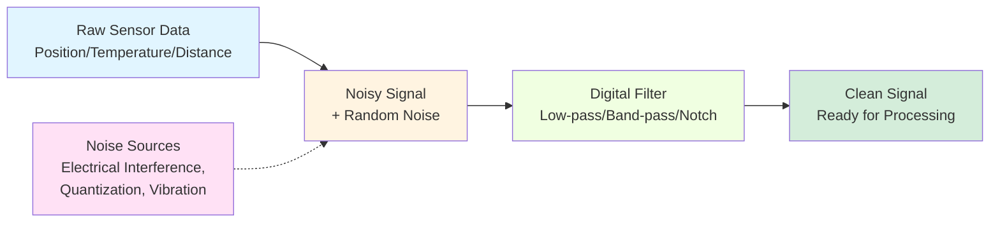
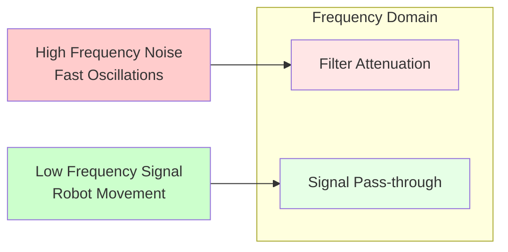
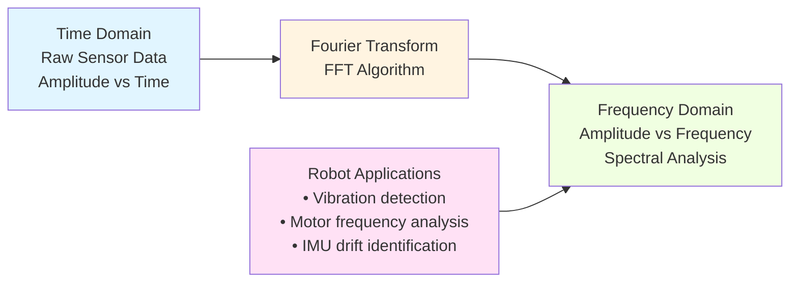

import MermaidDiagram from '@site/src/components/MermaidDiagram';
import CodeExample from '@site/src/components/CodeExample';
import Exercise from '@site/src/components/Exercise';
import Quiz from '@site/src/components/Quiz';
import PrerequisiteCheck from '@site/src/components/PrerequisiteCheck';

<PrerequisiteCheck prerequisites={frontMatter.prerequisites} />

# چیپٹر 4: روبوٹکس کے لیے ڈیجیٹل سگنل پروسیسنگ کی بنیاد (Chapter 4: Digital Signal Processing Basics for Robotics)

## یہ کیوں اہم ہے (Why This Matters)

ٹیسلا آپٹیمس اور فیگر 02 جیسے ہیومنوائڈ روبوٹس میں، سینسرز مسلسل ڈیٹا کے سٹریمز جنریٹ کرتے ہیں: IMU 100+ Hz پر اورینٹیشن رپورٹ کرتا ہے، لیڈار ہر سیکنڈ ہزاروں نقاط پر ماحول اسکین کرتا ہے، اور کیمرے 30+ فریم فی سیکنڈ کے ساتھ وژوئل معلومات کیپچر کرتے ہیں۔ یہ خام سینسر ڈیٹا اکثر نوائزی ہوتا ہے، اس میں آرٹیفیکٹس ہوتے ہیں، اور نیوی گیشن، کنٹرول، یا فیصلہ سازی کے لیے استعمال کرنے سے پہلے اس کی پروسیسنگ کی ضرورت ہوتی ہے۔ ڈیجیٹل سگنل پروسیسنگ (DSP) تکنیک نوائز کو فلٹر کرتی ہے، مطلبہ معلومات نکالتی ہے، اور سینسر ڈیٹا کو ہائی لیول الگورتھم کے لیے تیار کرتی ہے۔ مناسب سگنل پروسیسنگ کے بغیر، روبوٹس غیر معمولی حرکات کریں گے، اپنے ماحول کو غلط طریقے سے سمجھیں گے، اور بنیادی کاموں کو قابل اعتماد طریقے سے انجام دینے میں ناکام ہوں گے۔

## مثال: اورکیسٹرا کنڈکٹر کی سماعت (Analogy: The Orchestra Conductor's Hearing)

### روزمرہ کا منظر (Everyday Scenario)
ایک اورکیسٹرا کنڈکٹر کو ایک پیچیدہ موسیقی کی کارکردگی سننا تصور کریں۔ کنڈکٹر متعدد اوزار ایک ساتھ سنتا ہے: وائلن، سیلو، براس، پرکشن—سب مختلف نوٹس مختلف والیومز پر بجاتے ہیں۔ کنڈکٹر کی تربیت یافتہ آواز مخصوص حصوں (جیسے سٹرنگز) پر توجہ مرکوز کر سکتی ہے جبکہ دوسرے حصے (جیسے قطعی پاسیج کے دوران پرکشن) کو فلٹر کر سکتی ہے۔ جب کوئی وائلن تھوڑا سا بے ترتیب بجاتا ہے، کنڈکٹر مخصوص فریکوینسی کی پہچان کر سکتا ہے اور اسے درست کر سکتا ہے۔ کنڈکٹر موسیقی کے پیٹرنز کی توقع بھی کرتا ہے اور پچھلے measures کی بنیاد پر آنے والے حصوں کی توقع کر سکتا ہے۔

### روبوٹکس سے ربط (The Connection to Robotics)
روبوٹ سینسرز ایک ساتھ متعدد ڈیٹا سٹریمز وصول کرتے ہیں (پوزیشن، ویلوسٹی، اورینٹیشن) جنہیں علیحدہ کرنا اور تجزیہ کرنا ضروری ہے۔ **لو پاس فلٹرز (Low-pass filters)** ہائی فریکوینسی نوائز کو ہٹاتے ہیں (جیسے کنڈکٹر کا اچانک پرکشن کریش کو فلٹر کرنا)۔ **فوریئر ٹرانسفارم (Fourier transforms)** مخصوص فریکوینسی کمپوننٹس کی پہچان کرتے ہیں (جیسے کنڈکٹر کا یہ دیکھنا کہ کون سا اوزار بے ترتیب ہے)۔ **سگنل پریڈکشن (Signal prediction)** روبوٹس کو گزشتہ پیٹرنز کی بنیاد پر حرکات کی توقع کرنے میں مدد دیتی ہے (جیسے کنڈکٹر کا اگلے موسیقی الفاظ کی توقع کرنا)۔

### مثال کہاں ناکام ہوتی ہے (Where the Analogy Breaks Down)
موسیقی کے سگنلز عام طور پر میعادی اور قابل پیش گوئی ہوتے ہیں؛ روبوٹ سینسر ڈیٹا انتہائی نا منظم ہو سکتا ہے اور غیر متوقع ماحولیاتی عوامل سے متاثر ہو سکتا ہے۔ انسانی ادراک بے خیال ہے؛ روبوٹس کو سگنلز کو پروسیس کرنے کے لیے ریاضی کے الگورتھم کی ضرورت ہوتی ہے۔

### روبوٹکس کی اصطلاحوں میں (In Robotics Terms)
روبوٹکس میں **ڈیجیٹل سگنل پروسیسنگ (Digital Signal Processing)** سینسر ڈیٹا سٹریمز کو فلٹر، ٹرانسفارم، اور تجزیہ کرنے کے لیے شامل ہے تاکہ کنٹرول، نیوی گیشن، اور ادراک کے لیے مطلبہ معلومات نکالی جا سکے۔ **لو پاس فلٹرز (Low-pass filters)** سینسر نوائز کو ہٹاتے ہیں، **فوریئر ٹرانسفارم (Fourier transforms)** فریکوینسی کا تجزیہ کرتے ہیں، اور **ڈیجیٹل فلٹرز (digital filters)** روبوٹ فیصلہ سازی سسٹم کے لیے ڈیٹا تیار کرتے ہیں۔

## بنیادی تصورات (Core Concepts)

### 1. سینسر نوائز اور فلٹرنگ کی بنیاد (Sensor Noise and Filtering Fundamentals)

روبوٹک سینسرز مختلف اقسام کے نوائز کے ساتھ متاثر شدہ سگنلز پیدا کرتے ہیں جنہیں قابل اعتماد آپریشن کے لیے فلٹر کیا جانا چاہیے۔

**Mermaid Diagram**: Sensor Noise Filtering Process



*Alt-text: فلوچارٹ دکھا رہا ہے کہ خام سینسر ڈیٹا نوائزی سگنل اسٹیج سے گزرتا ہے، پھر ڈیجیٹل فلٹر سے، جس کا نتیجہ صاف سگنل ہے۔ نوائز کے ذرائع جیسے الیکٹریکل تداخل اور وائبریشن نوائزی سگنل اسٹیج میں فیڈ ہوتے ہیں۔*

**روبوٹکس میں سینسر نوائز کی اقسام:**
- **وائٹ نوائز (White Noise)**: تمام فریکوینسیز پر رینڈم فلوکچو ایشنز (IMU میں عام)
- **کوانٹائزیشن نوائز (Quantization Noise)**: ڈسکریٹ سیمپلنگ آرٹیفیکٹس (ڈیجیٹل سینسرز سے)
- **الیکٹرومیگنیٹک تداخل (Electromagnetic Interference)**: موتورز اور الیکٹرونکس سے نوائز
- **وائبریشن نوائز (Vibration Noise)**: مکینیکل متغیرات جو سینسرز کو متاثر کرتی ہیں

### 2. نوائز کم کرنے کے لیے لو پاس فلٹرز (Low-Pass Filters for Noise Reduction)

لو پاس فلٹرز کم فریکوینسی سگنلز کو پاس کرنے دیتے ہیں جبکہ ہائی فریکوینسی نوائز کو کم کر دیتے ہیں—روبوٹ سینسر ڈیٹا کو ہموار کرنے کے لیے ایک اہم ٹول۔

**ریاضی کی نمائندگی:**
```
y[n] = α * x[n] + (1-α) * y[n-1]
```
جہاں:
- `y[n]` = موجودہ فلٹرڈ آؤٹ پٹ
- `x[n]` = موجودہ خام ان پٹ
- `α` = فلٹر کوائف (0 < α < 1)
- `y[n-1]` = گزشتہ فلٹرڈ آؤٹ پٹ

**Mermaid Diagram**: Low-Pass Filter Response



*Alt-text: ڈائیگرام دکھا رہا ہے کہ ہائی فریکوینسی نوائز کو فلٹر کم کر رہا ہے جبکہ کم فریکوینسی سگنلز گزر جا رہے ہیں۔ ہائی فریکوینسی نوائز کو لال رنگ میں، کم فریکوینسی سگنلز کو سبز رنگ میں نشان زد کیا گیا ہے۔*

### 3. فریکوینسی تجزیہ کے لیے فوریئر ٹرانسفارم (Fourier Transform for Frequency Analysis)

فوریئر ٹرانسفارم سگنلز کو ان کے فریکوینسی کمپوننٹس میں تقسیم کرتا ہے، فریکوینسی ڈومین میں سینسر ڈیٹا کا تجزیہ ممکن بناتا ہے۔

**Mermaid Diagram**: Time vs Frequency Domain



*Alt-text: فلوچارٹ دکھا رہا ہے کہ ٹائم ڈومین سینسر ڈیٹا FFT الگورتھم کے ذریعے فریکوینسی ڈومین تجزیہ میں تبدیل ہو رہا ہے۔ وائبریشن ڈیٹیکشن اور موٹر تجزیہ جیسی روبوٹ ایپلی کیشنز فریکوینسی ڈومین آؤٹ پٹ سے منسلک ہیں۔*

## کام کرنے والا مثال: روبوٹ سینسرز کے لیے DSP فلٹرز نافذ کرنا (Worked Example: Implementing DSP Filters for Robot Sensors)

چلو ہم روبوٹ سینسر ڈیٹا کو پروسیس کرنے کا ایک کمپلیٹ DSP سسٹم بناتے ہیں:

```python
#!/usr/bin/env python3
"""
Digital Signal Processing for Robot Sensors
Implementing filters and analysis for noisy sensor data
"""

import numpy as np
import matplotlib.pyplot as plt
from scipy import signal
import rclpy
from rclpy.node import Node
from sensor_msgs.msg import Imu, LaserScan
from geometry_msgs.msg import Vector3
import time


class DSPFilter:
    """
    Digital Signal Processing Filter for Robot Sensors
    """

    def __init__(self, cutoff_freq=10.0, sample_rate=100.0):
        """
        Initialize filter with cutoff frequency and sample rate

        Args:
            cutoff_freq: Cutoff frequency in Hz
            sample_rate: Sampling rate in Hz
        """
        self.cutoff_freq = cutoff_freq
        self.sample_rate = sample_rate

        # Calculate filter coefficient for simple low-pass filter
        dt = 1.0 / sample_rate
        RC = 1.0 / (2 * np.pi * cutoff_freq)
        self.alpha = dt / (RC + dt)

        # Store previous output for recursive filtering
        self.previous_output = 0.0
        self.initialized = False

    def simple_low_pass(self, input_value):
        """
        Apply simple first-order low-pass filter
        y[n] = α * x[n] + (1-α) * y[n-1]
        """
        if not self.initialized:
            self.previous_output = input_value
            self.initialized = True
            return input_value

        output = self.alpha * input_value + (1 - self.alpha) * self.previous_output
        self.previous_output = output
        return output

    def moving_average(self, input_value, window_size=5):
        """
        Apply moving average filter
        """
        if not hasattr(self, 'buffer'):
            self.buffer = []

        self.buffer.append(input_value)

        # Keep only the most recent values
        if len(self.buffer) > window_size:
            self.buffer.pop(0)

        return np.mean(self.buffer)

    def butterworth_filter(self, input_signal, order=2):
        """
        Apply Butterworth low-pass filter using scipy
        """
        nyquist = self.sample_rate / 2.0
        normal_cutoff = self.cutoff_freq / nyquist

        # Design Butterworth filter
        b, a = signal.butter(order, normal_cutoff, btype='low', analog=False)

        # Apply filter to signal
        filtered_signal = signal.filtfilt(b, a, input_signal)

        return filtered_signal


class IMUProcessor(Node):
    """
    Process IMU data with DSP filters
    """

    def __init__(self):
        super().__init__('imu_processor')

        # Initialize DSP filters for different sensor components
        self.accel_filter = DSPFilter(cutoff_freq=5.0, sample_rate=100.0)  # 5Hz cutoff for acceleration
        self.gyro_filter = DSPFilter(cutoff_freq=10.0, sample_rate=100.0)  # 10Hz cutoff for gyroscope
        self.mag_filter = DSPFilter(cutoff_freq=1.0, sample_rate=100.0)    # 1Hz cutoff for magnetometer

        # Subscribe to IMU data
        self.imu_sub = self.create_subscription(
            Imu, '/imu/data', self.imu_callback, 10
        )

        # Publish filtered data
        self.filtered_pub = self.create_publisher(Imu, '/imu/filtered', 10)

        # Store raw and filtered data for analysis
        self.raw_data_buffer = []
        self.filtered_data_buffer = []

        self.get_logger().info('IMU Processor with DSP filters initialized')

    def imu_callback(self, msg):
        """
        Process incoming IMU data with filters
        """
        # Apply filters to each component
        filtered_msg = Imu()
        filtered_msg.header = msg.header

        # Filter linear acceleration
        filtered_msg.linear_acceleration.x = self.accel_filter.simple_low_pass(
            msg.linear_acceleration.x
        )
        filtered_msg.linear_acceleration.y = self.accel_filter.simple_low_pass(
            msg.linear_acceleration.y
        )
        filtered_msg.linear_acceleration.z = self.accel_filter.simple_low_pass(
            msg.linear_acceleration.z
        )

        # Filter angular velocity
        filtered_msg.angular_velocity.x = self.gyro_filter.simple_low_pass(
            msg.angular_velocity.x
        )
        filtered_msg.angular_velocity.y = self.gyro_filter.simple_low_pass(
            msg.angular_velocity.y
        )
        filtered_msg.angular_velocity.z = self.gyro_filter.simple_low_pass(
            msg.angular_velocity.z
        )

        # For demonstration, copy orientation (would also be filtered in real system)
        filtered_msg.orientation = msg.orientation

        # Publish filtered data
        self.filtered_pub.publish(filtered_msg)

        # Store data for analysis
        self.raw_data_buffer.append([
            msg.linear_acceleration.x,
            msg.linear_acceleration.y,
            msg.linear_acceleration.z
        ])
        self.filtered_data_buffer.append([
            filtered_msg.linear_acceleration.x,
            filtered_msg.linear_acceleration.y,
            filtered_msg.linear_acceleration.z
        ])

        # Keep buffer size reasonable
        if len(self.raw_data_buffer) > 1000:
            self.raw_data_buffer.pop(0)
            self.filtered_data_buffer.pop(0)

    def analyze_frequency_content(self):
        """
        Analyze frequency content of stored sensor data
        """
        if len(self.raw_data_buffer) < 100:
            return None

        # Convert to numpy array
        raw_data = np.array(self.raw_data_buffer)
        filtered_data = np.array(self.filtered_data_buffer)

        # Analyze X-axis acceleration data
        raw_x = raw_data[:, 0]
        filtered_x = filtered_data[:, 0]

        # Apply FFT to analyze frequency content
        raw_fft = np.fft.fft(raw_x)
        filtered_fft = np.fft.fft(filtered_x)

        # Calculate frequency bins
        n = len(raw_x)
        sample_rate = 100.0  # Assumed sample rate
        freq_bins = np.fft.fftfreq(n, 1/sample_rate)

        # Return frequency analysis results
        return {
            'frequencies': freq_bins[:n//2],  # Only positive frequencies
            'raw_magnitude': np.abs(raw_fft[:n//2]),
            'filtered_magnitude': np.abs(filtered_fft[:n//2]),
            'sample_rate': sample_rate
        }


class SignalAnalyzer:
    """
    Analyze and visualize sensor signals
    """

    @staticmethod
    def plot_signal_comparison(raw_signal, filtered_signal, sample_rate=100.0):
        """
        Plot raw vs filtered signals
        """
        n = len(raw_signal)
        time_axis = np.arange(n) / sample_rate

        plt.figure(figsize=(12, 8))

        # Plot time domain signals
        plt.subplot(2, 1, 1)
        plt.plot(time_axis, raw_signal, label='Raw Signal', alpha=0.7)
        plt.plot(time_axis, filtered_signal, label='Filtered Signal', linewidth=2)
        plt.xlabel('Time (s)')
        plt.ylabel('Amplitude')
        plt.title('Raw vs Filtered Sensor Signal')
        plt.legend()
        plt.grid(True)

        # Plot frequency domain
        plt.subplot(2, 1, 2)
        raw_fft = np.abs(np.fft.fft(raw_signal))
        filtered_fft = np.abs(np.fft.fft(filtered_signal))
        freq_bins = np.fft.fftfreq(len(raw_signal), 1/sample_rate)

        plt.plot(freq_bins[:len(freq_bins)//2], raw_fft[:len(raw_fft)//2],
                label='Raw Signal FFT', alpha=0.7)
        plt.plot(freq_bins[:len(freq_bins)//2], filtered_fft[:len(filtered_fft)//2],
                label='Filtered Signal FFT', linewidth=2)
        plt.xlabel('Frequency (Hz)')
        plt.ylabel('Magnitude')
        plt.title('Frequency Domain Comparison')
        plt.legend()
        plt.grid(True)

        plt.tight_layout()
        plt.show()

    @staticmethod
    def detect_vibration_frequencies(signal_data, sample_rate=100.0):
        """
        Detect dominant vibration frequencies in sensor data
        """
        # Apply FFT
        fft_result = np.fft.fft(signal_data)
        frequencies = np.fft.fftfreq(len(signal_data), 1/sample_rate)

        # Find magnitude of positive frequencies
        positive_freq_idx = frequencies > 0
        freq_magnitudes = np.abs(fft_result[positive_freq_idx])
        positive_frequencies = frequencies[positive_freq_idx]

        # Find peaks (dominant frequencies)
        peaks, properties = signal.find_peaks(
            freq_magnitudes,
            height=np.max(freq_magnitudes) * 0.1,  # At least 10% of max
            distance=int(len(freq_magnitudes) * 0.05)  # At least 5% distance between peaks
        )

        # Extract dominant frequencies
        dominant_freqs = positive_frequencies[peaks]
        dominant_magnitudes = freq_magnitudes[peaks]

        return list(zip(dominant_freqs, dominant_magnitudes))


def create_sample_sensor_data():
    """
    Create sample sensor data with realistic noise for demonstration
    """
    sample_rate = 100.0  # 100 Hz
    duration = 5.0      # 5 seconds
    t = np.linspace(0, duration, int(sample_rate * duration))

    # Create a realistic signal: robot moving with vibrations
    # Base movement (low frequency)
    base_signal = 2.0 * np.sin(2 * np.pi * 0.5 * t)  # 0.5 Hz movement

    # Robot vibrations (medium frequency)
    vibrations = 0.3 * np.sin(2 * np.pi * 15.0 * t)  # 15 Hz vibrations

    # High frequency noise (sensor noise)
    noise = 0.1 * np.random.normal(0, 1, len(t))  # Random noise

    # Combine all components
    raw_signal = base_signal + vibrations + noise

    return raw_signal, t


def main(args=None):
    """
    Demonstrate DSP filtering techniques
    """
    print("Digital Signal Processing for Robot Sensors - Demonstration")
    print("=" * 60)

    # Create sample sensor data
    raw_signal, time_axis = create_sample_sensor_data()
    print(f"Created sample signal with {len(raw_signal)} samples")

    # Initialize DSP filter
    dsp_filter = DSPFilter(cutoff_freq=5.0, sample_rate=100.0)

    # Apply simple low-pass filter
    filtered_signal = []
    for sample in raw_signal:
        filtered_value = dsp_filter.simple_low_pass(sample)
        filtered_signal.append(filtered_value)

    filtered_signal = np.array(filtered_signal)

    print("Applied low-pass filtering to reduce noise")

    # Analyze frequency content
    analyzer = SignalAnalyzer()

    # Find dominant frequencies in raw and filtered signals
    raw_dominant_freqs = analyzer.detect_vibration_frequencies(raw_signal, sample_rate=100.0)
    filtered_dominant_freqs = analyzer.detect_vibration_frequencies(filtered_signal, sample_rate=100.0)

    print(f"\nDominant frequencies in raw signal: {raw_dominant_freqs[:3]} (showing top 3)")
    print(f"Dominant frequencies in filtered signal: {filtered_dominant_freqs[:3]} (showing top 3)")

    # Show noise reduction
    raw_rms = np.sqrt(np.mean(raw_signal**2))
    filtered_rms = np.sqrt(np.mean(filtered_signal**2))
    noise_reduction_db = 20 * np.log10(raw_rms / filtered_rms) if filtered_rms > 0 else float('inf')

    print(f"\nNoise reduction: {noise_reduction_db:.2f} dB")
    print(f"Raw signal RMS: {raw_rms:.4f}")
    print(f"Filtered signal RMS: {filtered_rms:.4f}")

    # For a real ROS 2 system, we would initialize and spin the node
    # rclpy.init(args=args)
    # imu_processor = IMUProcessor()
    #
    # try:
    #     rclpy.spin(imu_processor)
    # except KeyboardInterrupt:
    #     print("Shutting down IMU processor")
    # finally:
    #     imu_processor.destroy_node()
    #     rclpy.shutdown()


if __name__ == '__main__':
    main()
```

## عملی مشق (Hands-On Exercise)

### ٹیئر A: سیمولیشن (CPU-صرف، لیپ ٹاپ مطابقت رکھتا ہے) ✓ لازمی
**ایکسائز 4.1: سینسر نوائز فلٹرنگ لیبارٹری**
ایک ڈیجیٹل سگنل پروسیسنگ سسٹم بنائیں جو سیمولیٹڈ روبوٹ سینسرز سے نوائز کو فلٹر کرے:

1. **نوائزی سگنلز جنریٹ کریں**: مختلف اقسام کے نوائز (وائٹ نوائز، وائبریشن نوائز، الیکٹریکل تداخل) کے ساتھ سینٹھیٹک سینسر ڈیٹا بنائیں
2. **متعدد فلٹرز نافذ کریں**: سادہ لو پاس، مووینگ ایوریج، اور بٹر ورث فلٹرز کوڈ کریں
3. **فلٹر کارکردگی کا موازنہ کریں**: ہر فلٹر دیکھیں کہ مختلف اقسام کے نوائز پر کیسے اثر ڈالتا ہے
4. **فریکوینسی تجزیہ**: FFT کو فریکوینسی ڈومین میں خام اور فلٹرڈ سگنلز کے موازنے کے لیے لگائیں
5. **پیرامیٹر ٹیوننگ**: کارکردگی کو بہتر بنانے کے لیے مختلف فلٹر پیرامیٹرز کے ساتھ تجربہ کریں

**نافذ کاری کی شرائط**:
- متعدد نوائز ذرائع کے ساتھ حقیقی سینسر ڈیٹا جنریٹ کریں
- کم از کم 3 مختلف فلٹرنگ تکنیکیں نافذ کریں
- ٹائم اور فریکوینسی ڈومین تجزیہ کا استعمال کرتے ہوئے کارکردگی کا موازنہ کریں
- فلٹرنگ کے نتائج کی ویژو لائزیشن بنائیں
- مختلف نوائز کی اقسام کے لیے بہترین پیرامیٹر دستاویز کریں

**قبول کی شرائط**:
- [ ] متعدد نوائز کی اقسام کے ساتھ سینٹھیٹک سینسر ڈیٹا جنریٹر
- [ ] لو پاس، مووینگ ایوریج، اور بٹر ورث فلٹرز کا نفاذ
- [ ] FFT کا استعمال کرتے ہوئے فریکوینسی ڈومین تجزیہ
- [ ] خام بمقابلہ فلٹرڈ سگنلز کا ویژو ل موازنہ
- [ ] مختلف منظرناموں کے لیے بہترین فلٹر پیرامیٹر کی دستاویزات

**اشارے**:
- ٹیسٹنگ کے لیے سادہ سائن ویو + نوائز کے ساتھ شروع کریں
- اعلی درجے کے فلٹر ڈیزائن کے لیے scipy.signal کا استعمال کریں
- نوائز کم کرنے اور سگنل تاخیر کے درمیان تنازعہ پر غور کریں
- فلٹر کی خصوصیات کو سمجھنے کے لیے مختلف سگنل فریکوینسیز کے ساتھ ٹیسٹ کریں

### ٹیئر B: ایج اے آئی ڈیپلائمنٹ (اختیاری)
**ایکسائز 4.2: جیٹسن پلیٹ فارم پر ریل ٹائم DSP**
DSP سسٹم کو جیٹسن پلیٹ فارم پر حقیقی سینسرز کے ساتھ ڈیپلائی کریں:

1. **ریل سینسر انٹیگریشن**: جیٹسن پر اصل IMU/لیڈار سینسرز سے منسلک ہوں
2. **ریل ٹائم کارکردگی**: ریل ٹائم آپریشن کے لیے فلٹر ایمپلیمنٹیشن کو بہتر بنائیں
3. **ریسورس مانیٹرنگ**: DSP آپریشنز کے دوران CPU استعمال اور میموری کو مانیٹر کریں
4. **لیٹنسی تجزیہ**: پروسیسنگ لیٹنسی کو پیمائیں اور ریل ٹائم پابندیوں کو یقینی بنائیں

**ہارڈ ویئر کی ضروریات**: IMU اور لیڈار سینسرز کے ساتھ جیٹسن اورن نینو

### ٹیئر C: روبوٹ ہارڈ ویئر (اختیاری)
**ایکسائز 4.3: روبوٹ کنٹرول کے لیے سیفٹی کریٹیکل DSP**
DSP تکنیکس کو سیفٹی کریٹیکل روبوٹ کنٹرول سسٹم میں لاگو کریں:

1. **سیفٹی فلٹرنگ**: گارنٹیڈ ریسپانس ٹائم کے ساتھ فلٹرز نافذ کریں
2. **فالٹ ڈیٹیکشن**: سینسر کی ناکامیوں اور انوملیز کو ڈیٹیکٹ کرنے کے لیے DSP کا استعمال کریں
3. **ری ڈونڈنسی مینجمنٹ**: DSP کا استعمال کرتے ہوئے متعدد سینسر ان پٹس کو جوڑیں
4. **ایمرجنسی رسپانس**: یقینی بنائیں کہ فلٹرز سیفٹی سسٹم میں مداخلت نہ کریں

**ہارڈ ویئر کی ضروریات**: یونٹیری گو2 یا مساوی روبوٹ پلیٹ فارم

## خلاصہ (Summary)
- **ڈیجیٹل سگنل پروسیسنگ (Digital Signal Processing)** کنٹرول اور نیوی گیشن میں استعمال کرنے سے پہلے نوائزی روبوٹ سینسر ڈیٹا کو صاف کرنے کے لیے ضروری ہے
- **لو پاس فلٹرز (Low-pass filters)** ہائی فریکوینسی نوائز کو ہٹاتے ہیں جبکہ اہم سگنل کمپوننٹس کو محفوظ رکھتے ہیں
- **فوریئر ٹرانسفارم (Fourier transforms)** سینسر ڈیٹا کی خصوصیات کو سمجھنے کے لیے فریکوینسی ڈومین تجزیہ ممکن بناتے ہیں
- **فلٹر کا انتخاب (Filter selection)** مخصوص نوائز کی خصوصیات اور ریل ٹائم ضروریات پر منحصر ہے
- مناسب DSP نفاذ روبوٹ کی قابل اعتمادی اور کارکردگی میں نمایاں بہتری لاتا ہے
- نوائز کم کرنے، سگنل تاخیر، اور کمپیو ٹیشنل پیچیدگی کے درمیان تنازعات موجود ہیں

## تفکر کے سوالات (Reflection Questions)
1. **روبوٹ کنٹرول سسٹم میں سینسر ڈیٹا کو زیادہ فلٹر کرنے کے ممکنہ خطرات کیا ہیں؟** (اشارہ: سگنل تاخیر اور اہم معلومات کے نقصان پر غور کریں)
2. **آپ مختلف اقسام کے روبوٹ سینسرز کے لیے مناسب فلٹر کٹ آف فریکوینسی کیسے منتخب کریں گے؟** (اشارہ: مطلوبہ سگنل بمقابلہ نوائز کی فریکوینسی مواد پر غور کریں)
3. **مलٹی-موڈل سینسر فیوژن میں DSP تکنیکس لاگو کرتے وقت کیا چیلنج پیدا ہو سکتے ہیں؟** (اشارہ: مختلف سیمپلنگ ریٹس اور نوائز کی خصوصیات پر غور کریں)

## کوئز (Quiz)
روبوٹکس کے لیے ڈیجیٹل سگنل پروسیسنگ کی تفہیم کو جانچیں:

1. **روبوٹ سینسر پروسیسنگ میں لو پاس فلٹر کا بنیادی مقصد کیا ہے؟**
   - A) تمام سگنل فریکوینسیز کو ایمپلیفائ کرنا
   - B) ہائی فریکوینسی نوائز کو ہٹانا جبکہ کم فریکوینسی سگنلز کو محفوظ رکھنا
   - C) اینالاگ سگنلز کو ڈیجیٹل میں تبدیل کرنا
   - D) سینسر سیمپلنگ کی شرح میں اضافہ کرنا

   **اشارہ**: سینسر نوائز اور فلٹرنگ فنڈامینٹلز سیکشن کا جائزہ لیں۔

2. **سچ یا جھوٹ: فوریئر ٹرانسفارم ٹائم ڈومین سگنلز کو فریکوینسی ڈومین نمائندگی میں تبدیل کرتا ہے۔**

   **اشارہ**: فوریئر ٹرانسفارم سیکشن دیکھیں۔

3. **سادہ لو پاس فلٹر کے مساوات میں y[n] = α * x[n] + (1-α) * y[n-1]، α کیا کنٹرول کرتا ہے؟**
   - A) آؤٹ پٹ ایمپلی ٹوڈ
   - B) فلٹر کا کٹ آف فریکوینسی ریسپانس
   - C) نئے ان پٹ اور گزشتہ آؤٹ پٹ کے درمیان توازن
   - D) سیمپلنگ کی شرح

   **اشارہ**: ریاضی کی نمائندگی سیکشن دیکھیں۔

4. **کون سے قسم کے نوائز کو لو پاس فلٹر کے ذریعے سب سے موثر طریقے سے کم کیا جا سکتا ہے؟**
   - A) کم فریکوینسی ڈرائیفٹ
   - B) ہائی فریکوینسی الیکٹریکل تداخل
   - C) مستقل بائیس ایرر
   - D) سستی سے تبدیل ہونے والے سگنلز

   **اشارہ**: غور کریں کہ لو پاس فلٹرز کون سی فریکوینسیز کو متاثر کرتے ہیں۔

5. **مووینگ ایوریج فلٹرز کا استعمال کرنے کا ممکنہ نقصان کیا ہے؟**
   - A) وہ نوائز کو ایمپلیفائ کرتے ہیں
   - B) وہ تاخیر متعارف کراتے ہیں اور جوابدہی کو کم کرتے ہیں
   - C) وہ صرف ڈیجیٹل سگنلز کے ساتھ کام کرتے ہیں
   - D) انہیں فریکوینسی تجزیہ کی ضرورت ہوتی ہے

   **اشارہ**: اوسط کے نتیجے میں پیش آنے والی تاخیر کے بارے میں سوچیں۔

6. **آپ کب بٹر ورث فلٹر کو سادہ فرسٹ آرڈر فلٹر پر ترجیح دیں گے؟**
   - A) جب آپ کو تیز تر فریکوینسی کٹ آف خصوصیات کی ضرورت ہو
   - B) جب کمپیو ٹیشنل وسائل محدود ہوں
   - C) جب صرف DC سگنلز کے ساتھ کام کر رہے ہوں
   - D) جب فریکوینسی تجزیہ کی ضرورت نہ ہو

   **اشارہ**: مختلف فلٹر کی اقسام کی خصوصیات پر غور کریں۔

**جوابات**: 1-B, 2-سچ, 3-C, 4-B, 5-B, 6-A

## مزید پڑھائی (Further Reading)
- [ڈیجیٹل سگنل پروسیسنگ برائے انجینئرز](https://www.dsprelated.com/freebooks/pdf/3.pdf)
- [روبوٹ سینسر سگنل پروسیسنگ تکنیکس](https://ieeexplore.ieee.org/document/8460421)
- [SciPy کے ساتھ فلٹر ڈیزائن](https://docs.scipy.org/doc/scipy/reference/signal.html)
- [روبوٹکس میں ریل ٹائم سگنل پروسیسنگ](https://arxiv.org/abs/1903.01768)
- [نیوی گیشن کے لیے IMU سگنل پروسیسنگ](https://www.mdpi.com/1424-8220/19/10/2252)