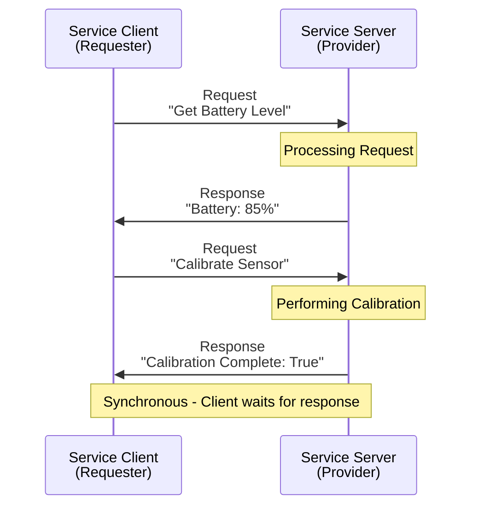
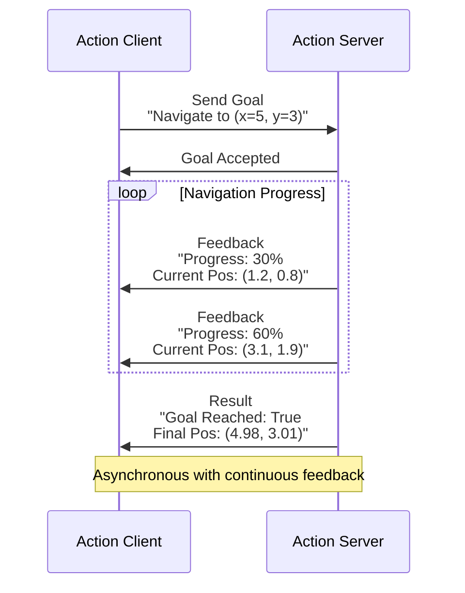
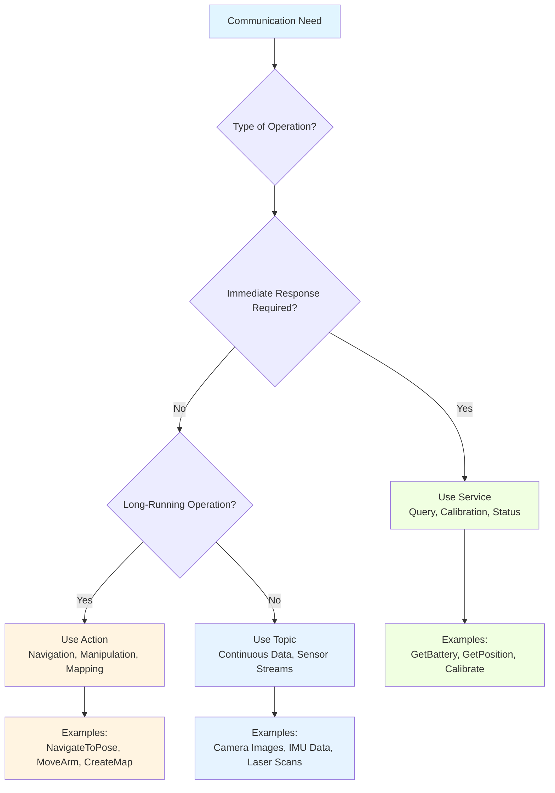

import MermaidDiagram from '@site/src/components/MermaidDiagram';
import CodeExample from '@site/src/components/CodeExample';
import Exercise from '@site/src/components/Exercise';
import Quiz from '@site/src/components/Quiz';
import PrerequisiteCheck from '@site/src/components/PrerequisiteCheck';

<PrerequisiteCheck prerequisites={frontMatter.prerequisites} />

# باب 5: ROS 2 سروسز اور ایکشنز - ریکویسٹ-ریسپانس اور طویل مدت کے آپریشن (ROS 2 Services and Actions - Request-Response and Long-Running Operations)

## یہ کیوں اہم ہے (Why This Matters)

ٹیسلا آپٹیمس اور فیگر 02 جیسے ہیومنوائڈ روبوٹس میں، تمام مواصلات مسلسل، غیر ہم وقتی ٹاپکس کے پیٹرن کا پیروی نہیں کرتیں۔ کبھی کبھی روبوٹس کو یقینی جوابات کے ساتھ مخصوص سروسز کی درخواست کرنے کی ضرورت ہوتی ہے (جیسے "بیٹری کی سطح کیا ہے؟" پوچھنا) یا ریسپانس کے ساتھ طویل مدتی کاموں کو شروع کرنا (جیسے "مقام X پر نیویگیٹ کریں - پیشرفت کی اطلاع دیں")۔ سروسز فوری سوالات کے لیے ہم وقتی ریکویسٹ-ریسپانس مواصلات فراہم کرتی ہیں، جبکہ ایکشنز ریسپانس، گول مینجمنٹ، اور منسوخی کی صلاحیتوں کے ساتھ پیچیدہ کاموں کو فعال کرتی ہیں۔ یہ مواصلاتی پیٹرنز ان روبوٹ رویوں کے لیے ضروری ہیں جن کو تصدیق، حالت کا نظم، یا درمیانی نتائج کے ساتھ متعدد اسٹیپ والے عمل کی ضرورت ہوتی ہے۔

## مثلاً: ریستوران سروس سسٹم (The Restaurant Service System)

### روزمرہ کا منظر (Everyday Scenario)
Consider a restaurant with three types of communication:
1. **Continuous Updates (Topics)**: Kitchen staff continuously announce "Order up!" for completed dishes
2. **Request-Response (Services)**: Customers request the check and receive it immediately
3. **Long Operations with Feedback (Actions)**: Customers order a complex dish that takes 20 minutes - the server provides updates ("Your dish is being prepared", "5 minutes remaining") and can cancel the order if needed

### روبوٹکس سے ربط (The Connection to Robotics)
- **Topics**: Continuous sensor data streams (camera images, IMU readings)
- **Services**: Immediate queries (battery level, current position, calibration status)
- **Actions**: Long-running tasks (navigation to goal, arm movement, mapping process) with progress updates

### مثلاً کہاں ناکام ہوتی ہے (Where the Analogy Breaks Down)
Restaurant operations are discrete and human-mediated; robot systems operate continuously with precise timing requirements and error handling.

### روبوٹکس کی اصطلاحات میں (In Robotics Terms)
**ROS 2 Services** provide synchronous request-response communication for immediate queries with guaranteed responses. **ROS 2 Actions** enable long-running operations with feedback, goal management, and cancellation capabilities—perfect for complex robot behaviors like navigation, manipulation, or calibration.

## بنیادی تصورات (Core Concepts)

### 1. ROS 2 سروسز - ہم وقتی ریکویسٹ-ریسپانس (ROS 2 Services - Synchronous Request-Response)

Services provide synchronous communication where a client sends a request and waits for a response. This is ideal for queries that require immediate answers.

**Mermaid Diagram**: Service Communication Pattern



*Alt-text: Sequence diagram showing service client sending requests to service server, which processes them and returns responses. Client waits for each response before proceeding. Examples show battery level request and sensor calibration request.*

**Service Characteristics:**
- **Synchronous**: Client waits for response
- **Request-Response**: One request, one response
- **Stateless**: Each request is independent
- **Guaranteed Delivery**: Response is sent back to requester

### 2. ROS 2 ایکشنز - طویل مدت کے آپریشنز فیڈ بیک کے ساتھ (ROS 2 Actions - Long-Running Operations with Feedback)

Actions are designed for long-running operations that require feedback, goal management, and cancellation capabilities.

**Mermaid Diagram**: Action Communication Pattern



*Alt-text: Sequence diagram showing action client sending navigation goal to action server. Server accepts goal and sends continuous feedback updates about progress and current position. Finally, server sends result confirming goal completion with final position.*

**Action Characteristics:**
- **Long-Running**: Operations that take significant time
- **Feedback**: Continuous progress updates
- **Goal Management**: Can accept, reject, or cancel goals
- **Result**: Final outcome when operation completes

### 3. ہر ایک مواصلاتی پیٹرن کب استعمال کریں (When to Use Each Communication Pattern)

**Mermaid Diagram**: Communication Pattern Decision Tree



*Alt-text: Decision tree flowchart starting with communication need, branching to determine if immediate response is required, then if operation is long-running. Leads to recommendations: services for immediate responses, actions for long operations with feedback, topics for continuous data streams.*

## Worked Example: Complete Service and Action Implementation

Let's build comprehensive examples of both services and actions for a robot system:

```python
#!/usr/bin/env python3
"""
ROS 2 Services and Actions Worked Example
Complete implementation of services and actions for robot operations
"""

import rclpy
from rclpy.node import Node
from rclpy.action import ActionServer, GoalResponse, CancelResponse
from rclpy.action.server import ServerGoalHandle
from rclpy.callback_groups import ReentrantCallbackGroup
from rclpy.executors import MultiThreadedExecutor
from rclpy.qos import QoSProfile

# Standard message types
from std_srvs.srv import SetBool, Trigger
from sensor_msgs.msg import BatteryState
from geometry_msgs.msg import Point, PoseStamped
from nav_msgs.msg import Path

# Action message types (these would be custom action definitions)
# For this example, we'll use the built-in NavigateToPose action interface
from nav2_msgs.action import NavigateToPose
from control_msgs.action import FollowJointTrajectory


class RobotServiceServer(Node):
    """
    ROS 2 Service Server for robot queries and commands
    """

    def __init__(self):
        super().__init__('robot_service_server')

        # Create callback group for reentrant callbacks
        self.callback_group = ReentrantCallbackGroup()

        # Service: Get robot battery level
        self.battery_service = self.create_service(
            Trigger,  # Service type that returns success/failure + message
            'get_battery_level',
            self.get_battery_level_callback,
            callback_group=self.callback_group
        )

        # Service: Calibrate specific sensor
        self.calibrate_service = self.create_service(
            SetBool,  # Service type with boolean request
            'calibrate_sensor',
            self.calibrate_sensor_callback,
            callback_group=self.callback_group
        )

        # Service: Set robot mode (idle, active, maintenance)
        self.mode_service = self.create_service(
            SetBool,  # Using SetBool as simple example
            'set_robot_mode',
            self.set_robot_mode_callback,
            callback_group=self.callback_group
        )

        # Mock battery state (in real system, this would come from sensor)
        self.battery_level = 85.0
        self.robot_mode = "active"  # idle, active, maintenance
        self.is_calibrating = False

        self.get_logger().info('Robot Service Server initialized')

    def get_battery_level_callback(self, request, response):
        """
        Service callback to return current battery level
        """
        self.get_logger().info(f'Service: Get battery level requested')

        response.success = True
        response.message = f'Battery level: {self.battery_level}%'

        self.get_logger().info(f'Service: Returning battery level {self.battery_level}%')
        return response

    def calibrate_sensor_callback(self, request, response):
        """
        Service callback to calibrate sensor
        """
        self.get_logger().info(f'Service: Sensor calibration requested, enable={request.data}')

        if self.is_calibrating:
            response.success = False
            response.message = 'Calibration already in progress'
            return response

        # Simulate calibration process
        try:
            self.is_calibrating = True
            # In real system, this would call actual calibration routine
            # For simulation, just wait a bit
            import time
            time.sleep(1.0)  # Simulate calibration time

            self.get_logger().info('Sensor calibration completed successfully')
            response.success = True
            response.message = 'Sensor calibration completed'

        except Exception as e:
            self.get_logger().error(f'Calibration failed: {str(e)}')
            response.success = False
            response.message = f'Calibration failed: {str(e)}'

        finally:
            self.is_calibrating = False

        return response

    def set_robot_mode_callback(self, request, response):
        """
        Service callback to set robot operational mode
        """
        new_mode = "active" if request.data else "idle"
        self.get_logger().info(f'Service: Setting robot mode to {new_mode}')

        # Validate and set new mode
        if new_mode in ["idle", "active", "maintenance"]:
            self.robot_mode = new_mode
            response.success = True
            response.message = f'Robot mode set to {new_mode}'
        else:
            response.success = False
            response.message = f'Invalid mode: {new_mode}'

        self.get_logger().info(f'Service: Robot mode set to {self.robot_mode}')
        return response


class RobotActionServer(Node):
    """
    ROS 2 Action Server for long-running robot operations
    """

    def __init__(self):
        super().__init__('robot_action_server')

        # Create action servers
        self.nav_action_server = ActionServer(
            self,
            NavigateToPose,
            'navigate_to_pose',
            self.nav_execute_callback,
            goal_callback=self.nav_goal_callback,
            handle_accepted_callback=self.nav_handle_accepted_callback,
            cancel_callback=self.nav_cancel_callback
        )

        # Store navigation state
        self.current_goal = None
        self.is_navigating = False

        self.get_logger().info('Robot Action Server initialized')

    def nav_goal_callback(self, goal_request):
        """
        Accept or reject navigation goal
        """
        self.get_logger().info(
            f'Action: Navigate to ({goal_request.pose.pose.position.x}, '
            f'{goal_request.pose.pose.position.y}) requested'
        )

        # Check if we can accept the goal (simple validation)
        if self.is_navigating:
            self.get_logger().info('Action: Navigation in progress, rejecting new goal')
            return GoalResponse.REJECT

        # Validate goal position (simple check)
        if abs(goal_request.pose.pose.position.x) > 100 or abs(goal_request.pose.pose.position.y) > 100:
            self.get_logger().info('Action: Goal position too far, rejecting')
            return GoalResponse.REJECT

        self.get_logger().info('Action: Navigation goal accepted')
        return GoalResponse.ACCEPT

    def nav_handle_accepted_callback(self, goal_handle):
        """
        Handle accepted navigation goal
        """
        self.get_logger().info('Action: Navigation goal handle accepted')
        self.current_goal = goal_handle
        self.is_navigating = True

        # Start navigation thread
        import threading
        thread = threading.Thread(target=self.nav_execute, args=(goal_handle,))
        thread.start()

    def nav_cancel_callback(self, goal_handle):
        """
        Handle navigation goal cancellation
        """
        self.get_logger().info('Action: Navigation goal cancellation requested')
        return CancelResponse.ACCEPT

    def nav_execute_callback(self, goal_handle):
        """
        Execute navigation goal (this runs in action server context)
        """
        # This method is called by the action server framework
        # The actual execution happens in nav_execute
        pass

    def nav_execute(self, goal_handle):
        """
        Execute navigation with feedback and result
        """
        self.get_logger().info('Action: Starting navigation execution')

        # Get goal position
        target_x = goal_handle.request.pose.pose.position.x
        target_y = goal_handle.request.pose.pose.position.y

        # Simulate navigation progress
        current_x, current_y = 0.0, 0.0  # Starting position
        step_size = 0.1  # Move 0.1m per step

        # Calculate distance to target
        total_distance = ((target_x - current_x)**2 + (target_y - current_y)**2)**0.5
        distance_traveled = 0.0

        # Navigation loop
        while rclpy.ok() and not goal_handle.is_cancel_requested:
            # Calculate next position
            dx = target_x - current_x
            dy = target_y - current_y
            distance_to_target = (dx**2 + dy**2)**0.5

            # Check if we're close enough
            if distance_to_target < 0.2:  # Within 20cm
                break

            # Move toward target
            move_distance = min(step_size, distance_to_target)
            current_x += (dx / distance_to_target) * move_distance
            current_y += (dy / distance_to_target) * move_distance
            distance_traveled += move_distance

            # Calculate progress percentage
            progress = min(100.0, (distance_traveled / total_distance) * 100) if total_distance > 0 else 0

            # Send feedback
            feedback_msg = NavigateToPose.Feedback()
            feedback_msg.current_pose.pose.position.x = current_x
            feedback_msg.current_pose.pose.position.y = current_y
            feedback_msg.distance_remaining = distance_to_target

            goal_handle.publish_feedback(feedback_msg)
            self.get_logger().info(f'Action: Navigation progress {progress:.1f}%, distance remaining: {distance_to_target:.2f}m')

            # Sleep to simulate real navigation
            import time
            time.sleep(0.1)

        # Check if goal was canceled
        if goal_handle.is_cancel_requested:
            goal_handle.canceled()
            self.get_logger().info('Action: Navigation goal canceled')
            return

        # Complete the goal
        goal_handle.succeed()
        result = NavigateToPose.Result()
        result.result = True  # Success
        result.final_pose.pose.position.x = current_x
        result.final_pose.pose.position.y = current_y

        self.get_logger().info(f'Action: Navigation completed, final position: ({current_x:.2f}, {current_y:.2f})')
        self.is_navigating = False

        return result


class RobotServiceClient(Node):
    """
    Client to demonstrate service usage
    """

    def __init__(self):
        super().__init__('robot_service_client')

        # Create clients for services
        self.battery_client = self.create_client(Trigger, 'get_battery_level')
        self.calibrate_client = self.create_client(SetBool, 'calibrate_sensor')
        self.mode_client = self.create_client(SetBool, 'set_robot_mode')

        # Wait for services to be available
        while not self.battery_client.wait_for_service(timeout_sec=1.0):
            self.get_logger().info('Service get_battery_level not available, waiting...')

        while not self.calibrate_client.wait_for_service(timeout_sec=1.0):
            self.get_logger().info('Service calibrate_sensor not available, waiting...')

        while not self.mode_client.wait_for_service(timeout_sec=1.0):
            self.get_logger().info('Service set_robot_mode not available, waiting...')

        self.get_logger().info('Service clients initialized and connected')

    def get_battery_level(self):
        """
        Call battery level service
        """
        request = Trigger.Request()
        future = self.battery_client.call_async(request)
        rclpy.spin_until_future_complete(self, future)

        response = future.result()
        if response is not None:
            self.get_logger().info(f'Battery level: {response.message}')
            return response.success, response.message
        else:
            self.get_logger().error('Service call failed')
            return False, "Service call failed"

    def calibrate_sensor(self, enable=True):
        """
        Call sensor calibration service
        """
        request = SetBool.Request()
        request.data = enable
        future = self.calibrate_client.call_async(request)
        rclpy.spin_until_future_complete(self, future)

        response = future.result()
        if response is not None:
            self.get_logger().info(f'Calibration result: {response.message}')
            return response.success, response.message
        else:
            self.get_logger().error('Service call failed')
            return False, "Service call failed"

    def set_robot_mode(self, active=True):
        """
        Call robot mode service
        """
        request = SetBool.Request()
        request.data = active
        future = self.mode_client.call_async(request)
        rclpy.spin_until_future_complete(self, future)

        response = future.result()
        if response is not None:
            self.get_logger().info(f'Mode change result: {response.message}')
            return response.success, response.message
        else:
            self.get_logger().error('Service call failed')
            return False, "Service call failed"


def main(args=None):
    rclpy.init(args=args)

    # Create service server
    service_server = RobotServiceServer()

    # Create action server
    action_server = RobotActionServer()

    # Create service client for demonstration
    service_client = RobotServiceClient()

    # Create multi-threaded executor to handle multiple servers
    executor = MultiThreadedExecutor(num_threads=4)
    executor.add_node(service_server)
    executor.add_node(action_server)
    executor.add_node(service_client)

    try:
        # Demonstrate service calls
        service_client.get_logger().info('Demonstrating service calls...')

        # Get battery level
        success, message = service_client.get_battery_level()
        print(f"Battery check: {success}, {message}")

        # Set robot to active mode
        success, message = service_client.set_robot_mode(active=True)
        print(f"Mode change: {success}, {message}")

        # Calibrate sensor
        success, message = service_client.calibrate_sensor(enable=True)
        print(f"Calibration: {success}, {message}")

        # Spin all nodes
        service_server.get_logger().info('Starting ROS 2 services and actions demonstration')
        executor.spin()

    except KeyboardInterrupt:
        service_server.get_logger().info('Shutting down services and actions')
    finally:
        service_server.destroy_node()
        action_server.destroy_node()
        service_client.destroy_node()
        rclpy.shutdown()


if __name__ == '__main__':
    main()
```

## ہاتھوں سے ورزش (Hands-On Exercise)

### ٹیئر A: سیمولیشن (CPU-صرف، لیپ ٹاپ مطابق) ✓ ضروری (Tier A: Simulation (CPU-Only, Laptop-Compatible) ✓ REQUIRED)

**ورزش 5.1: روبوٹ سروس اور ایکشن لیبارٹری (Exercise 5.1: Robot Service and Action Laboratory)**

Create a complete ROS 2 system with both services and actions for a simulated robot:

1. **Service Server**: Implement three different services:
   - Battery level query service
   - Sensor calibration service
   - Robot status service
2. **Action Server**: Implement a navigation action with feedback:
   - Goal acceptance/rejection logic
   - Progress feedback during navigation
   - Result reporting when complete
3. **Service Client**: Create clients that use the services
4. **Action Client**: Create a client that sends navigation goals
5. **Comparison Analysis**: Compare the behavior of services vs actions

**Implementation Requirements**:
- Implement all three service types with proper request/response handling
- Create action server with full goal lifecycle (accept, execute, feedback, result)
- Build clients for both services and actions
- Test with various scenarios (success, failure, cancellation)
- Document when to use each communication pattern

**Acceptance Criteria**:
- [ ] Service server with three different services implemented
- [ ] Action server with navigation goal handling
- [ ] Clients for both services and actions
- [ ] Proper error handling and validation
- [ ] Documentation of communication pattern selection

**Hints**:
- Start with simple service implementation before adding actions
- Use threading for long-running action execution
- Test goal cancellation scenarios
- Consider timeout handling for services

### ٹیئر B: ایج ای ڈیپلائمنٹ (اختیاری) (Tier B: Edge AI Deployment (Optional))

**ورزش 5.2: حقیقی ہارڈ ویئر انضمام (Exercise 5.2: Real Hardware Integration)**

Deploy the service and action system on a Jetson platform with real hardware:

1. **Real Sensor Integration**: Connect services to actual sensors (battery, IMU)
2. **Hardware Actions**: Implement actions that control real hardware (motors, actuators)
3. **Performance Analysis**: Measure response times and resource usage
4. **Reliability Testing**: Test under various load conditions

**Hardware Requirements**: Jetson Orin Nano with sensor hardware

### ٹیئر C: روبوٹ ہارڈ ویئر (اختیاری) (Tier C: Robot Hardware (Optional))

**ورزش 5.3: محفوظیت کے لحاظ سے اہم مواصلات (Exercise 5.3: Safety-Critical Communication)**

Implement services and actions for safety-critical robot operations:

1. **Emergency Services**: Fast-acting services for emergency stops
2. **Safe Actions**: Actions with built-in safety checks and timeouts
3. **Fault Tolerance**: Handle service/action failures gracefully
4. **Safety Feedback**: Actions that continuously check safety conditions

**Hardware Requirements**: Unitree Go2 or equivalent robot platform

## خلاصہ (Summary)

- **ROS 2 Services** provide synchronous request-response communication for immediate queries
- **ROS 2 Actions** enable long-running operations with feedback, goal management, and cancellation
- **Services** are ideal for queries that need immediate answers (battery level, calibration)
- **Actions** are perfect for complex behaviors that take time (navigation, manipulation)
- **Topics** remain best for continuous data streams (sensors, status)
- Proper communication pattern selection is crucial for robot performance and reliability

## ریفلیکشن سوالات (Reflection Questions)

1. **When would you choose a service over an action for a robot operation that takes 5 seconds to complete?** (Hint: Consider if feedback is needed during the operation)
2. **What are the potential risks of using services for operations that might take a long time?** (Hint: Think about blocking and timeouts)
3. **How could you combine services and actions for a complex robot task like mapping a room?** (Hint: Consider using services for setup/config and actions for the actual mapping)

## کوئز (Quiz)

Test your understanding of ROS 2 services and actions:

1. **What is the main difference between ROS 2 services and topics?**
   - A) Services are faster than topics
   - B) Services provide request-response communication, topics provide continuous streaming
   - C) Services can only be used by one node
   - D) Topics are synchronous, services are asynchronous

   **Hint**: Review the Communication Pattern Decision Tree.

2. **True or False: ROS 2 actions provide continuous feedback during long-running operations.**

   **Hint**: See the Action Communication Pattern diagram.

3. **Which communication pattern is best for asking "What is the current battery level?"**
   - A) Topic
   - B) Service
   - C) Action
   - D) Parameter

   **Hint**: Consider if you need immediate response for a query.

4. **What can a ROS 2 action client do that a service client cannot?**
   - A) Send requests faster
   - B) Cancel long-running operations and receive feedback
   - C) Store data permanently
   - D) Create new nodes

   **Hint**: Review the Action characteristics section.

5. **When should you use an action instead of a service?**
   - A) For all robot communications
   - B) For long-running operations that need feedback or cancellation
   - C) For simple queries
   - D) When you want faster communication

   **Hint**: Consider the characteristics of long-running operations.

6. **What happens if a service request takes too long to complete?**
   - A) The service automatically cancels
   - B) The client may timeout waiting for response
   - C) The robot shuts down
   - D) The request is queued indefinitely

   **Hint**: Think about the synchronous nature of services.

**Answers**: 1-B, 2-True, 3-B, 4-B, 5-B, 6-B

## مزید پڑھائی (Further Reading)

- [ROS 2 Services and Actions Documentation](https://docs.ros.org/en/humble/Tutorials/Beginner-Client-Libraries/Using-Async-CPP-Clients.html)
- [Understanding ROS 2 Actions](https://docs.ros.org/en/humble/Tutorials/Intermediate/Writing-an-Action-Server-Cpp.html)
- [Service vs Topic vs Action Comparison](https://discourse.ros.org/t/ros2-service-action-topic-when-to-use-what/16825)
- [Robot Communication Patterns Best Practices](https://arxiv.org/abs/2004.04241)
- [Real-time Considerations for ROS 2 Services](https://ieeexplore.ieee.org/document/9188942)