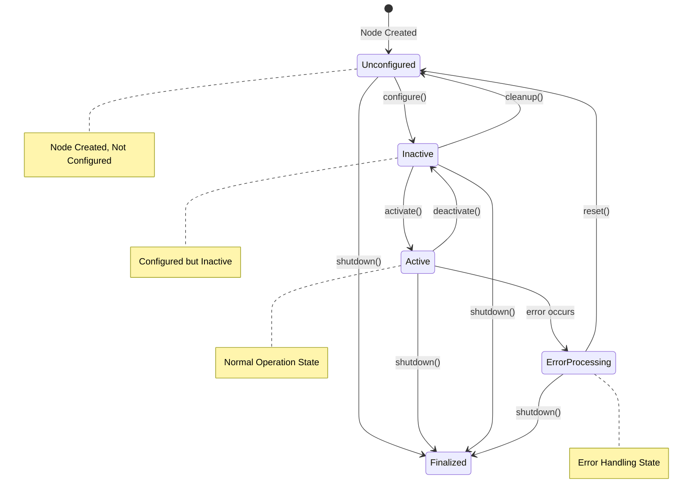
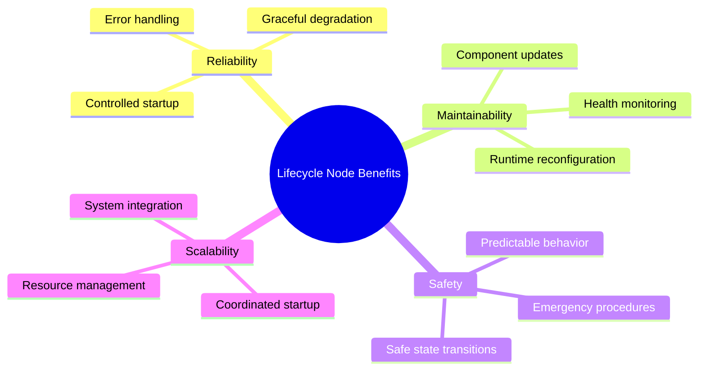
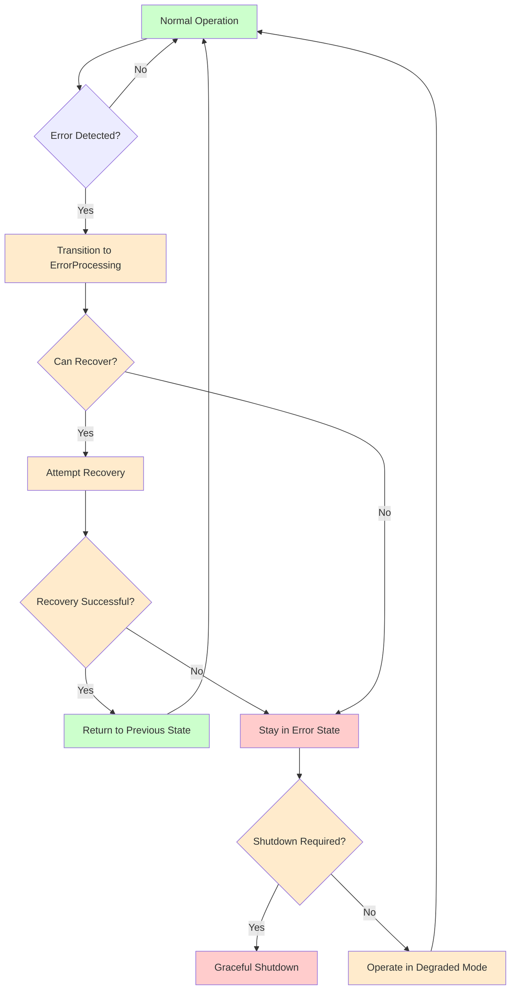

import MermaidDiagram from '@site/src/components/MermaidDiagram';
import CodeExample from '@site/src/components/CodeExample';
import Exercise from '@site/src/components/Exercise';
import Quiz from '@site/src/components/Quiz';
import PrerequisiteCheck from '@site/src/components/PrerequisiteCheck';

<PrerequisiteCheck prerequisites={frontMatter.prerequisites} />

# باب 6: ROS 2 لائف سائیکل نوڈس - منیجڈ نوڈ اسٹیٹس اور روبسٹ سسٹم (Chapter 6: ROS 2 Lifecycle Nodes - Managed Node States and Robust Systems)

## یہ کیوں اہم ہے (Why This Matters)

ٹیسلا آپٹیمس اور فیگر 02 جیسے ہیومنوائڈ روبوٹس میں، قابلِ اعتمادی سب سے اہم ہے۔ ڈیسک ٹاپ ایپلی کیشنز کے برعکس جو کریش ہو سکتی ہیں اور بغیر نتیجے کے دوبارہ شروع ہو سکتی ہیں، روبوٹس کو انسانوں کے قریب ڈائنامک ماحول میں محفوظ طریقے سے کام کرنا چاہیے۔ روایتی ROS 2 نوڈس شروع ہوتے ہیں اور مسلسل چلتے رہتے ہیں، لیکن جب سینسر ناکام ہو جاتا ہے، کمیونیکیشن لنک ڈراپ ہو جاتا ہے، یا اہم کمپوننٹ کی مرمت کی ضرورت ہوتی ہے تو کیا ہوتا ہے؟ لائف سائیکل نوڈس نوڈ مینجمنٹ کے لیے ایک سٹرکچرڈ نقطہ نظر فراہم کرتے ہیں، جس سے کنٹرولڈ ابتدائی، کنفیگریشن، ایکٹیویشن، ایرر ہینڈلنگ، اور کلین اپ ممکن ہوتا ہے۔ یہ روبوٹس کو ناکامیوں کو نرمی سے ہینڈل کرنے، مرمت کے آپریشنز انجام دینے، اور اپنے آپریشنل لائف سائیکل کے دوران محفوظ آپریشن کو یقینی بنانے کے قابل بناتا ہے۔

## مثال: کمرشل ایئر لائن پائلٹ کا چیک لسٹ سسٹم (Analogy: The Commercial Airline Pilot's Checklist System)

### روزمرہ کا منظر (Everyday Scenario)
کمرشل ایئر لائن کے پائلٹ کو ایئرفیکٹ کے سسٹم کو مینج کرنا تصور کریں۔ ٹیک آف سے پہلے، پائلٹ تفصیلی چیک لسٹ کا پیروی کرتا ہے: انجن اسٹارٹ، ہائیڈرولک سسٹم، نیوی گیشن، کمیونیکیشن—سب مخصوص ترتیب میں۔ پرواز کے دوران، سسٹم کی مسلسل نگرانی کی جاتی ہے اور اگر وہ خراب ہو جائیں تو ان کو اڈجسٹ یا بائی پاس کیا جا سکتا ہے۔ اگر ایک انجن ناکام ہو جائے، تو پائلٹ محفوظ پرواز برقرار رکھنے کے لیے مخصوص طریقہ کار کا پیروی کرتا ہے۔ ایئرفیکٹ کی متعدد حالتیں ہیں: زمینی مرمت، پر فلائٹ، ٹیک آف، کروز، لینڈنگ، اور پوسٹ فلائٹ مرمت۔ ہر حالت کی مخصوص ضروریات اور طریقہ کار ہیں۔

### روبوٹکس سے ربط (The Connection to Robotics)
- **لائف سائیکل اسٹیٹس (Lifecycle States)**: روبوٹ نوڈس اسٹیٹس کے ذریعے منتقل ہوتے ہیں جیسے غیر کنفیگر، غیر فعال، فعال، فائنلائز
- **سسٹم مانیٹرنگ (System Monitoring)**: سینسرز اور کمپوننٹس کی مسلسل صحت چیک
- **ایرر ہینڈلنگ (Error Handling)**: جب کمپوننٹس ناکام ہو جائیں تو طے شدہ طریقہ کار
- **گریس فل ڈی گریڈیشن (Graceful Degradation)**: ممکن ہونے پر کم صلاحیتوں کے ساتھ کام جاری رکھنا

### مثال کہاں ناکام ہوتی ہے (Where the Analogy Breaks Down)
ہوائی جہاز کے مقابلے میں روبوٹس میں کم ہمزمانہ سسٹم ہوتے ہیں؛ روبوٹس کے پاس درجنوں سینسرز اور ایکچوایٹرز ہو سکتے ہیں جو ہمزمانہ کام کر رہے ہوں۔ ہوائی جہاز کے آپریشنز زیادہ قابل پیش گوئی ہوتے ہیں؛ روبوٹس کو ڈائنامک ماحول کے مطابق ایڈجسٹ کرنا چاہیے۔

### روبوٹکس کی اصطلاحوں میں (In Robotics Terms)
**ROS 2 لائف سائیکل نوڈس (ROS 2 Lifecycle Nodes)** نوڈ ابتدائی، کنفیگریشن، ایکٹیویشن، اور ایرر ہینڈلنگ کے نظم کے لیے ایک سٹرکچرڈ اسٹیٹ مشین فراہم کرتے ہیں۔ وہ کنٹرولڈ اسٹارٹ اپ ترتیبات، رن ٹائم ری کنفیگریشن، گریس فل ایرر ریکوری، اور محفوظ شٹ ڈاؤن طریقہ کار کو فعال کرتے ہیں—قابل اعتماد روبوٹ آپریشن کے لیے ضروری۔

## بنیادی تصورات (Core Concepts)

### 1. لائف سائیکل نوڈ اسٹیٹس اور ٹرانزیشنز (Lifecycle Node States and Transitions)

لائف سائیکل نوڈس ایک اچھی طرح سے طے شدہ اسٹیٹ مشین کا پیروی کرتے ہیں جو مناسب ابتدائی، کنفیگریشن، اور آپریشن ترتیبات کو یقینی بناتا ہے۔

**Mermaid Diagram**: Lifecycle Node State Machine



*Alt-text: اسٹیٹ ڈائیگرام ROS 2 لائف سائیکل نوڈ اسٹیٹس دکھا رہی ہے: غیر کنفیگر، غیر فعال، فعال، ایرر پروسیسنگ، اور فائنلائز. ٹرانزیشنز دکھاتے ہیں کہ نوڈس کس طرح کنفیگر(), ایکٹیویٹ(), ڈی ایکٹیویٹ(), کلین اپ(), شٹ ڈاؤن(), اور ری سیٹ() جیسے آپریشنز کے ذریعے اسٹیٹس کے درمیان منتقل ہوتے ہیں. فعال اسٹیٹ نارمل آپریشن اسٹیٹ ہے.*

**اہم لائف سائیکل اسٹیٹس:**
- **غیر کنفیگر (Unconfigured)**: نوڈ تخلیق کردہ لیکن ابھی کنفیگر نہیں کیا گیا
- **غیر فعال (Inactive)**: کنفیگر کردہ لیکن ابھی فعال نہیں (چلنے کے لیے تیار)
- **فعال (Active)**: مکمل طور پر کام کر رہا اور انجام دے رہا
- **ایرر پروسیسنگ (ErrorProcessing)**: ایرر کنڈیشن کو ہینڈل کر رہا
- **فائنلائز (Finalized)**: نوڈ کو شٹ ڈاؤن اور صاف کر دیا گیا ہے

### 2. لائف سائیکل نوڈس کے فوائد (Benefits of Lifecycle Nodes)

**Mermaid Diagram**: Lifecycle Node Benefits



*Alt-text: منڈ میپ لائف سائیکل نوڈس کے فوائد دکھا رہا ہے جو چار بنیادی زمرے میں منظم ہیں: قابل اعتمادی (کنٹرولڈ اسٹارٹ اپ، ایرر ہینڈلنگ، گریس فل ڈی گریڈیشن)، برقرار رکھنا (رن ٹائم ری کنفیگریشن، کمپوننٹ اپ ڈیٹس، صحت کی نگرانی)، سیفٹی (محفوظ اسٹیٹ ٹرانزیشنز، ایمرجنسی طریقہ کار، قابل پیش گوئی رویہ)، اور اسکیل ایبلیٹی (هماہنگ اسٹارٹ اپ، ریسورس مینجمنٹ، سسٹم انٹیگریشن).*

### 3. ایرر ہینڈلنگ اور گریس فل ڈی گریڈیشن (Error Handling and Graceful Degradation)

لائف سائیکل نوڈس ایرر ہینڈل کرنے اور ممکن ہونے پر کام جاری رکھنے کے لیے سٹرکچرڈ نقطہ نظر فراہم کرتے ہیں۔

**Mermaid Diagram**: Error Handling Flow



*Alt-text: فلوچارٹ لائف سائیکل نوڈس میں ایرر ہینڈلنگ دکھا رہا ہے. نارمل آپریشن ایرر کا پتہ لگاتا ہے اور ایرر پروسیسنگ اسٹیٹ میں منتقل ہوتا ہے. سسٹم اگر ممکن ہو تو ریکوری کی کوشش کرتا ہے، کامیاب ہونے پر پچھلی اسٹیٹ پر واپس جاتا ہے یا ناکام ہونے پر ایرر اسٹیٹ میں رہتا ہے. شٹ ڈاؤن کی ضروریات کے مطابق، سسٹم گریس فل طریقے سے شٹ ڈاؤن ہو سکتا ہے یا ڈی گریڈڈ موڈ میں کام کر سکتا ہے.*

## کام کرنے والا مثال: مکمل لائف سائیکل نوڈ نفاذ (Worked Example: Complete Lifecycle Node Implementation)

چلو ہم روبوٹ سینسر سسٹم کے لیے ایک جامع لائف سائیکل نوڈ بناتے ہیں:

```python
#!/usr/bin/env python3
"""
ROS 2 Lifecycle Node Worked Example
Complete implementation of a lifecycle node for robot sensor management
"""

import rclpy
from rclpy.lifecycle import LifecycleNode, TransitionCallbackReturn
from rclpy.lifecycle import Publisher
from rclpy.qos import QoSProfile, ReliabilityPolicy
from sensor_msgs.msg import LaserScan, BatteryState, Imu
from std_msgs.msg import String
from rcl_interfaces.msg import SetParametersResult
import time
import threading
from typing import List, Dict, Any


class LifecycleSensorManager(LifecycleNode):
    """
    Lifecycle Node for managing robot sensors with proper state management
    """

    def __init__(self):
        super().__init__('lifecycle_sensor_manager')

        # Internal state tracking
        self.scan_publisher: Publisher = None
        self.battery_publisher: Publisher = None
        self.imu_publisher: Publisher = None
        self.status_publisher: Publisher = None

        # Sensor simulation parameters
        self.is_scanning = False
        self.scan_thread: threading.Thread = None
        self.should_stop = False

        # Sensor health tracking
        self.sensor_health = {
            'lidar': True,
            'imu': True,
            'battery': True
        }

        # Add parameter for sensor update rate
        self.declare_parameter('sensor_update_rate', 10.0)
        self.declare_parameter('lidar_range_max', 10.0)
        self.declare_parameter('simulation_mode', True)

        # Register parameter callback
        self.add_on_set_parameters_callback(self.parameter_callback)

        self.get_logger().info('Lifecycle Sensor Manager initialized')

    def parameter_callback(self, parameters: List[rclpy.Parameter]):
        """
        Handle parameter changes
        """
        for param in parameters:
            self.get_logger().info(f'Parameter {param.name} changed to {param.value}')

        return SetParametersResult(successful=True)

    def on_configure(self, state):
        """
        Called when transitioning from unconfigured to inactive
        """
        self.get_logger().info('Configuring lifecycle sensor manager')

        # Create publishers with specific QoS for sensor data
        qos_profile = QoSProfile(depth=10, reliability=ReliabilityPolicy.RELIABLE)

        try:
            # Create publishers for different sensor types
            self.scan_publisher = self.create_publisher(LaserScan, 'laser_scan', qos_profile)
            self.battery_publisher = self.create_publisher(BatteryState, 'battery_state', qos_profile)
            self.imu_publisher = self.create_publisher(Imu, 'imu_data', qos_profile)
            self.status_publisher = self.create_publisher(String, 'sensor_status', qos_profile)

            # Initialize sensor data
            self.initialize_sensors()

            self.get_logger().info('Lifecycle sensor manager configured successfully')
            return TransitionCallbackReturn.SUCCESS

        except Exception as e:
            self.get_logger().error(f'Failed to configure sensor manager: {str(e)}')
            return TransitionCallbackReturn.FAILURE

    def initialize_sensors(self):
        """
        Initialize sensor simulation/data sources
        """
        self.get_logger().info('Initializing sensor simulation')

        # In a real system, this would initialize actual sensor hardware
        # For simulation, we'll just set up the data structures

        # Reset sensor health
        for sensor in self.sensor_health:
            self.sensor_health[sensor] = True

    def on_activate(self, state):
        """
        Called when transitioning from inactive to active
        """
        self.get_logger().info('Activating lifecycle sensor manager')

        try:
            # Activate publishers
            self.scan_publisher.on_activate()
            self.battery_publisher.on_activate()
            self.imu_publisher.on_activate()
            self.status_publisher.on_activate()

            # Start sensor data publishing thread
            self.should_stop = False
            self.is_scanning = True
            self.scan_thread = threading.Thread(target=self.sensor_loop)
            self.scan_thread.start()

            self.get_logger().info('Lifecycle sensor manager activated successfully')
            return TransitionCallbackReturn.SUCCESS

        except Exception as e:
            self.get_logger().error(f'Failed to activate sensor manager: {str(e)}')
            return TransitionCallbackReturn.FAILURE

    def on_deactivate(self, state):
        """
        Called when transitioning from active to inactive
        """
        self.get_logger().info('Deactivating lifecycle sensor manager')

        try:
            # Stop sensor data publishing
            self.is_scanning = False
            self.should_stop = True

            if self.scan_thread and self.scan_thread.is_alive():
                self.scan_thread.join(timeout=2.0)  # Wait up to 2 seconds

            # Deactivate publishers
            self.scan_publisher.on_deactivate()
            self.battery_publisher.on_deactivate()
            self.imu_publisher.on_deactivate()
            self.status_publisher.on_deactivate()

            self.get_logger().info('Lifecycle sensor manager deactivated successfully')
            return TransitionCallbackReturn.SUCCESS

        except Exception as e:
            self.get_logger().error(f'Failed to deactivate sensor manager: {str(e)}')
            return TransitionCallbackReturn.FAILURE

    def on_cleanup(self, state):
        """
        Called when transitioning from inactive to unconfigured
        """
        self.get_logger().info('Cleaning up lifecycle sensor manager')

        try:
            # Destroy publishers
            self.destroy_publisher(self.scan_publisher)
            self.destroy_publisher(self.battery_publisher)
            self.destroy_publisher(self.imu_publisher)
            self.destroy_publisher(self.status_publisher)

            # Reset internal state
            self.scan_publisher = None
            self.battery_publisher = None
            self.imu_publisher = None
            self.status_publisher = None

            self.get_logger().info('Lifecycle sensor manager cleaned up successfully')
            return TransitionCallbackReturn.SUCCESS

        except Exception as e:
            self.get_logger().error(f'Failed to clean up sensor manager: {str(e)}')
            return TransitionCallbackReturn.FAILURE

    def on_shutdown(self, state):
        """
        Called when shutting down the node
        """
        self.get_logger().info('Shutting down lifecycle sensor manager')

        # Perform final cleanup
        self.is_scanning = False
        self.should_stop = True

        if self.scan_thread and self.scan_thread.is_alive():
            self.scan_thread.join(timeout=2.0)

        self.get_logger().info('Lifecycle sensor manager shutdown complete')
        return TransitionCallbackReturn.SUCCESS

    def on_error(self, state):
        """
        Called when transitioning to error state
        """
        self.get_logger().info('Lifecycle sensor manager entered error state')

        # Try to clean up any active resources
        try:
            if self.is_scanning:
                self.is_scanning = False
                self.should_stop = True

                if self.scan_thread and self.scan_thread.is_alive():
                    self.scan_thread.join(timeout=1.0)

            # Log error state
            self.get_logger().warn('In error state - waiting for reset or shutdown')
            return TransitionCallbackReturn.SUCCESS

        except Exception as e:
            self.get_logger().error(f'Error during error handling: {str(e)}')
            return TransitionCallbackReturn.FAILURE

    def sensor_loop(self):
        """
        Main sensor data publishing loop
        """
        update_rate = self.get_parameter('sensor_update_rate').value
        rate = self.create_rate(update_rate)

        # Simulate sensor data publishing
        scan_angle_min = -3.14  # -180 degrees
        scan_angle_max = 3.14   # 180 degrees
        scan_angle_increment = 0.0174533  # 1 degree
        scan_ranges_count = int((scan_angle_max - scan_angle_min) / scan_angle_increment)

        scan_seq = 0

        while rclpy.ok() and self.is_scanning and not self.should_stop:
            try:
                # Publish simulated sensor data
                self.publish_scan_data(scan_seq, scan_ranges_count)
                self.publish_battery_data()
                self.publish_imu_data()

                # Publish status
                status_msg = String()
                status_msg.data = f"Sensors active - Health: {self.get_sensor_health_status()}"
                self.status_publisher.publish(status_msg)

                scan_seq += 1
                rate.sleep()

            except Exception as e:
                self.get_logger().error(f'Error in sensor loop: {str(e)}')
                # In a real system, you might want to transition to error state
                break

        self.get_logger().info('Sensor loop terminated')

    def publish_scan_data(self, seq, ranges_count):
        """
        Publish simulated LiDAR scan data
        """
        scan_msg = LaserScan()
        scan_msg.header.stamp = self.get_clock().now().to_msg()
        scan_msg.header.frame_id = 'laser_link'
        scan_msg.header.stamp.sec = seq
        scan_msg.angle_min = -3.14
        scan_msg.angle_max = 3.14
        scan_msg.angle_increment = 0.0174533  # 1 degree
        scan_msg.time_increment = 0.0
        scan_msg.scan_time = 0.0
        scan_msg.range_min = 0.1
        scan_msg.range_max = self.get_parameter('lidar_range_max').value

        # Generate simulated ranges (with some obstacles)
        import random
        ranges = []
        for i in range(ranges_count):
            # Simulate some obstacles at various distances
            if 0.3 < i * scan_msg.angle_increment < 0.4:
                # Obstacle at 1m in front
                ranges.append(1.0 + random.uniform(-0.1, 0.1))
            elif 1.5 < i * scan_msg.angle_increment < 1.6:
                # Obstacle at 2m to the right
                ranges.append(2.0 + random.uniform(-0.1, 0.1))
            else:
                # Clear space (max range) with some noise
                ranges.append(
                    scan_msg.range_max - 0.1 + random.uniform(-0.05, 0.05)
                )

        scan_msg.ranges = ranges
        scan_msg.intensities = [100.0] * len(ranges)  # Constant intensity

        self.scan_publisher.publish(scan_msg)

    def publish_battery_data(self):
        """
        Publish simulated battery data
        """
        battery_msg = BatteryState()
        battery_msg.header.stamp = self.get_clock().now().to_msg()
        battery_msg.header.frame_id = 'battery_link'

        # Simulate battery level (decreasing over time)
        import random
        battery_msg.percentage = max(10.0, 95.0 - (time.time() % 1000) * 0.01 + random.uniform(-1, 1))
        battery_msg.voltage = 12.6 + random.uniform(-0.2, 0.2)
        battery_msg.current = -1.0 + random.uniform(-0.1, 0.1)  # Discharging
        battery_msg.charge = -1.0  # Unknown
        battery_msg.capacity = -1.0  # Unknown
        battery_msg.design_capacity = 10.0
        battery_msg.power_supply_status = BatteryState.POWER_SUPPLY_STATUS_DISCHARGING
        battery_msg.power_supply_health = BatteryState.POWER_SUPPLY_HEALTH_GOOD
        battery_msg.power_supply_technology = BatteryState.POWER_SUPPLY_TECHNOLOGY_LION
        battery_msg.present = True

        self.battery_publisher.publish(battery_msg)

    def publish_imu_data(self):
        """
        Publish simulated IMU data
        """
        imu_msg = Imu()
        imu_msg.header.stamp = self.get_clock().now().to_msg()
        imu_msg.header.frame_id = 'imu_link'

        # Simulate orientation (with some rotation)
        import random
        imu_msg.orientation.x = random.uniform(-0.01, 0.01)
        imu_msg.orientation.y = random.uniform(-0.01, 0.01)
        imu_msg.orientation.z = random.uniform(-0.01, 0.01)
        imu_msg.orientation.w = 1.0  # Normalize

        # Simulate angular velocity
        imu_msg.angular_velocity.x = random.uniform(-0.01, 0.01)
        imu_msg.angular_velocity.y = random.uniform(-0.01, 0.01)
        imu_msg.angular_velocity.z = random.uniform(-0.01, 0.01)

        # Simulate linear acceleration
        imu_msg.linear_acceleration.x = random.uniform(-0.1, 0.1)
        imu_msg.linear_acceleration.y = random.uniform(-0.1, 0.1)
        imu_msg.linear_acceleration.z = 9.8 + random.uniform(-0.1, 0.1)  # Gravity + noise

        # Set covariance matrices (diagonal values only)
        for i in range(9):
            if i % 4 == 0:  # Diagonal elements
                imu_msg.orientation_covariance[i] = 0.01
                imu_msg.angular_velocity_covariance[i] = 0.01
                imu_msg.linear_acceleration_covariance[i] = 0.01

        self.imu_publisher.publish(imu_msg)

    def get_sensor_health_status(self):
        """
        Get overall sensor health status
        """
        healthy_sensors = sum(1 for health in self.sensor_health.values() if health)
        total_sensors = len(self.sensor_health)
        return f"{healthy_sensors}/{total_sensors} sensors healthy"

    def simulate_sensor_failure(self, sensor_name: str):
        """
    Simulate a sensor failure for testing
    """
        if sensor_name in self.sensor_health:
            self.sensor_health[sensor_name] = False
            self.get_logger().warn(f'Simulated failure of {sensor_name} sensor')
            return True
        return False

    def reset_sensor_failure(self, sensor_name: str):
        """
        Reset a simulated sensor failure
        """
        if sensor_name in self.sensor_health:
            self.sensor_health[sensor_name] = True
            self.get_logger().info(f'Reset simulated failure of {sensor_name} sensor')
            return True
        return False


class LifecycleManagerClient(LifecycleNode):
    """
    Client to manage lifecycle nodes
    """

    def __init__(self):
        super().__init__('lifecycle_manager_client')

        # Timer for periodic status checks
        self.status_timer = self.create_timer(5.0, self.check_status)

        self.get_logger().info('Lifecycle Manager Client initialized')

    def check_status(self):
        """
        Periodically check the status of managed nodes
        """
        # This would typically call lifecycle services to check node status
        self.get_logger().info('Checking lifecycle node status...')


def main(args=None):
    rclpy.init(args=args)

    # Create lifecycle node
    lifecycle_node = LifecycleSensorManager()

    # Create client for management
    client = LifecycleManagerClient()

    try:
        # Demonstrate lifecycle transitions
        lifecycle_node.get_logger().info('Starting lifecycle node demonstration')

        # Transition through states
        # 1. Configure the node
        lifecycle_node.trigger_configure()
        lifecycle_node.get_logger().info('Node configured')

        # 2. Activate the node
        lifecycle_node.trigger_activate()
        lifecycle_node.get_logger().info('Node activated - publishing sensor data')

        # 3. Let it run for a while
        import time
        time.sleep(10.0)

        # 4. Deactivate the node
        lifecycle_node.trigger_deactivate()
        lifecycle_node.get_logger().info('Node deactivated')

        # 5. Clean up the node
        lifecycle_node.trigger_cleanup()
        lifecycle_node.get_logger().info('Node cleaned up')

        # 6. Configure and activate again to show reusability
        lifecycle_node.trigger_configure()
        lifecycle_node.trigger_activate()
        lifecycle_node.get_logger().info('Node reconfigured and reactivated')

        # Run for a bit more
        time.sleep(5.0)

        # 7. Shutdown
        lifecycle_node.trigger_shutdown()
        lifecycle_node.get_logger().info('Node shutdown')

    except KeyboardInterrupt:
        lifecycle_node.get_logger().info('Shutting down due to interrupt')
        lifecycle_node.trigger_shutdown()
    finally:
        lifecycle_node.destroy_node()
        client.destroy_node()
        rclpy.shutdown()


if __name__ == '__main__':
    main()
```

## عملی مشق (Hands-On Exercise)

### ٹیئر A: سیمولیشن (CPU-صرف، لیپ ٹاپ مطابقت رکھتا ہے) ✓ لازمی
**ایکسائز 6.1: لائف سائیکل نوڈ لیبارٹری**
ایک مکمل لائف سائیکل نوڈ سسٹم بنائیں جو مناسب اسٹیٹ مینجمنٹ کا مظاہرہ کرتا ہے:

1. **کسٹم لائف سائیکل نوڈ**: مخصوص روبوٹ کمپوننٹ کے لیے ایک لائف سائیکل نوڈ نافذ کریں (جیسے، کیمرہ، موٹر کنٹرولر، نیوی گیشن)
2. **اسٹیٹ ٹرانزیشنز**: تمام لائف سائیکل کال بیکس نافذ کریں (کنفیگر، ایکٹیویٹ، ڈی ایکٹیویٹ، کلین اپ، شٹ ڈاؤن، ایرر)
3. **ایرر سیمولیشن**: مختلف اقسام کی ناکامیوں اور ریکوری کو سیمولیٹ کرنے کے لیے طریقے شامل کریں
4. **ہیلتھ مانیٹرنگ**: سینسر صحت کی ٹریکنگ اور اسٹیٹس رپورٹنگ نافذ کریں
5. **کلائنٹ مینجمنٹ**: ایک کلائنٹ بنائیں جو اسٹیٹس کے ذریعے لائف سائیکل نوڈ کا مینجمنٹ کرے

**نافذ کاری کی شرائط**:
- تمام ضروری کال بیکس کے ساتھ مکمل لائف سائیکل نوڈ نافذ کریں
- مناسب ایرر ہینڈلنگ اور ریکوری میکنزمز شامل کریں
- رن ٹائم کنفیگریشن کے لیے پیرامیٹر مینجمنٹ شامل کریں
- اسٹیٹ ٹرانزیشنز کا مظاہرہ کرنے والے کلائنٹ کو تخلیق کریں
- ایرر ہینڈلنگ اور ریکوری منظرنامے ٹیسٹ کریں

**قبول کی شرائط**:
- [ ] تمام کال بیکس کے ساتھ مکمل لائف سائیکل نوڈ نفاذ
- [ ] مناسب ایرر ہینڈلنگ اور ریکوری میکنزمز
- [ ] رن ٹائم کنفیگریشن کے لیے پیرامیٹر مینجمنٹ
- [ ] اسٹیٹ ٹرانزیشنز کا مظاہرہ کرنے والا کلائنٹ
- [ ] ایرر منظرنامے اور ریکوری کی ٹیسٹنگ

**اشارے**:
- پیچیدگی شامل کرنے سے پہلے بنیادی لائف سائیکل کال بیکس کے ساتھ شروع کریں
- اسٹیٹ ٹرانزیشنز کو بلاک کرنے سے بچنے کے لیے تھریڈنگ کا احتیاط سے استعمال کریں
- جامع ایرر ہینڈلنگ نافذ کریں
- تمام اسٹیٹ ٹرانزیشنز کو اچھی طرح ٹیسٹ کریں

### ٹیئر B: ایج اے آئی ڈیپلائمنٹ (اختیاری)
**ایکسائز 6.2: حقیقی ہارڈ ویئر لائف سائیکل مینجمنٹ**
جیٹسن پلیٹ فارم پر لائف سائیکل نوڈس کو حقیقی ہارڈ ویئر کے ساتھ ڈیپلائی کریں:

1. **ہارڈ ویئر انٹیگریشن**: لائف سائیکل نوڈس کو حقیقی سینسرز/ایکچوایٹرز سے منسلک کریں
2. **حقیقی ایرر ہینڈلنگ**: حقیقی ہارڈ ویئر ناکامیوں کے لیے ایرر ڈیٹیکشن نافذ کریں
3. **کارکردگی کی نگرانی**: اسٹیٹ ٹرانزیشنز کے دوران ریسورس استعمال کو مانیٹر کریں
4. **قابل اعتمادی ٹیسٹنگ**: مختلف لوڈ کنڈیشنز اور ناکامی منظرناموں کے تحت ٹیسٹ کریں

**ہارڈ ویئر کی ضروریات**: سینسر/ایکچوایٹر ہارڈ ویئر کے ساتھ جیٹسن اورن نینو

### ٹیئر C: روبوٹ ہارڈ ویئر (اختیاری)
**ایکسائز 6.3: سیفٹی کریٹیکل لائف سائیکل نوڈس**
سیفٹی کریٹیکل روبوٹ آپریشنز کے لیے لائف سائیکل نوڈس نافذ کریں:

1. **سیفٹی اسٹیٹ مینجمنٹ**: ٹرانزیشنز کے دوران محفوظ اسٹیٹس کو یقینی بنائیں
2. **ایمرجنسی طریقہ کار**: ایمرجنسی شٹ ڈاؤن اور ریکوری نافذ کریں
3. **ری ڈونڈنسی مینجمنٹ**: ری ڈونڈنٹ کمپوننٹ ناکامیوں کو ہینڈل کریں
4. **سیفٹی مانیٹرنگ**: آپریشن کے دوران مسلسل سیفٹی کنڈیشنز چیک کریں

**ہارڈ ویئر کی ضروریات**: یونٹیری گو2 یا مساوی روبوٹ پلیٹ فارم

## خلاصہ (Summary)
- **لائف سائیکل نوڈس (Lifecycle Nodes)** قابل اعتماد روبوٹ آپریشن کے لیے سٹرکچرڈ اسٹیٹ مینجمنٹ فراہم کرتے ہیں
- **اسٹیٹ ٹرانزیشنز (State Transitions)** مناسب ابتدائی، کنفیگریشن، اور کلین اپ ترتیبات کو یقینی بناتے ہیں
- **ایرر ہینڈلنگ (Error Handling)** گریس فل ناکامی ریکوری اور سسٹم استحکام کو فعال کرتا ہے
- **گریس فل ڈی گریڈیشن (Graceful Degradation)** کم صلاحیتوں کے ساتھ کام جاری رکھنے کی اجازت دیتا ہے
- **پیرامیٹر مینجمنٹ (Parameter Management)** نوڈ برتاؤ کی رن ٹائم ری کنفیگریشن کو فعال کرتا ہے
- مناسب لائف سائیکل مینجمنٹ محفوظ، قابل اعتماد روبوٹ سسٹم کے لیے ضروری ہے

## تفکر کے سوالات (Reflection Questions)
1. **روبوٹ سسٹم میں ریگولر نوڈس کے مقابلے میں لائف سائیکل نوڈس استعمال کرنے کے کیا بنیادی فوائد ہیں؟** (اشارہ: ابتدائی، ایرر ہینڈلنگ، اور سسٹم قابل اعتمادی پر غور کریں)
2. **آپ ایک روبوٹ آرم کنٹرولر کے لیے لائف سائیکل نوڈ کیسے ڈیزائن کریں گے جسے موٹر ناکامیوں کو ہینڈل کرنے کی ضرورت ہے؟** (اشارہ: محفوظ اسٹیٹس اور ریکوری طریقہ کار کے بارے میں سوچیں)
3. **پیچیدہ روبوٹ سسٹم میں متعدد لائف سائیکل نوڈس کو مربوط کرنے میں کیا چیلنج پیدا ہو سکتے ہیں؟** (اشارہ: اسٹارٹ اپ آرڈر اور انٹر ڈیپنڈینسیز پر غور کریں)

## کوئز (Quiz)
ROS 2 لائف سائیکل نوڈس کی تفہیم کو جانچیں:

1. **ROS 2 میں لائف سائیکل نوڈس کا بنیادی مقصد کیا ہے؟**
   - A) نوڈس کو تیز چلانا
   - B) سٹرکچرڈ اسٹیٹ مینجمنٹ اور قابل اعتماد آپریشن فراہم کرنا
   - C) میموری استعمال کم کرنا
   - D) ملٹی تھریڈنگ کو فعال کرنا

   **اشارہ**: "Why This Matters" سیکشن کا جائزہ لیں۔

2. **سچ یا جھوٹ: لائف سائیکل نوڈس کے مخصوص اسٹیٹس اور ٹرانزیشنز ہوتے ہیں جو مناسب ابتدائی اور کلین اپ کو یقینی بناتے ہیں۔**

   **اشارہ**: لائف سائیکل نوڈ اسٹیٹ مشین ڈائیگرام دیکھیں۔

3. **مکمل طور پر شروع کیے گئے نوڈ کے لیے نارمل آپریٹنگ اسٹیٹ کون سی ہے؟**
   - A) غیر کنفیگر (Unconfigured)
   - B) غیر فعال (Inactive)
   - C) فعال (Active)
   - D) ایرر پروسیسنگ (ErrorProcessing)

   **اشارہ**: اسٹیٹ مشین ڈائیگرام کا جائزہ لیں۔

4. **جب آپ کسی لائف سائیکل نوڈ پر trigger_configure() کو کال کرتے ہیں تو کیا ہوتا ہے؟**
   - A) نوڈ فوری طور پر ڈیٹا شائع کرنا شروع کر دیتا ہے
   - B) نوڈ غیر کنفیگر سے غیر فعال اسٹیٹ میں منتقل ہو جاتا ہے
   - C) نوڈ شٹ ڈاؤن ہو جاتا ہے
   - D) نوڈ ایک ایرر میسج شائع کرتا ہے

   **اشارہ**: اسٹیٹ ٹرانزیشن ڈائیگرام پر غور کریں۔

5. **جب لائف سائیکل نوڈ کو ایرر کا سامنا ہوتا ہے تو کون سا کال بیک کال کیا جاتا ہے؟**
   - A) on_error()
   - B) on_failure()
   - C) on_exception()
   - D) on_problem()

   **اشارہ**: لائف سائیکل نوڈ نفاذ دیکھیں۔

6. **آپ کو ریگولر نوڈ کے بجائے لائف سائیکل نوڈ کب استعمال کرنا چاہیے؟**
   - A) ہمیشہ، ہر نوڈ کے لیے
   - B) جب آپ کو سٹرکچرڈ ابتدائی، ایرر ہینڈلنگ، یا گریس فل ڈی گریڈیشن کی ضرورت ہو
   - C) صرف سینسر نوڈس کے لیے
   - D) جب آپ کم میموری استعمال کرنا چاہتے ہوں

   **اشارہ**: لائف سائیکل مینجمنٹ کے فوائد پر غور کریں۔

**جوابات**: 1-B, 2-سچ, 3-C, 4-B, 5-A, 6-B

## مزید پڑھائی (Further Reading)
- [ROS 2 لائف سائیکل نوڈ دستاویزات](https://design.ros2.org/articles/node_lifecycle.html)
- [لائف سائیکل نوڈس لکھنا](https://docs.ros.org/en/humble/Tutorials/Intermediate/About-Lifecycle-Nodes.html)
- [لائف سائیکل نوڈ بہترین مشقیں](https://github.com/ros2/demos/blob/humble/lifecycle/README.md)
- [روبوٹکس میں اسٹیٹ مشین ڈیزائن پیٹرنز](https://arxiv.org/abs/2104.12234)
- [لائف سائیکل مینجمنٹ کے ساتھ قابل اعتماد روبوٹ سسٹم](https://ieeexplore.ieee.org/document/9342418)