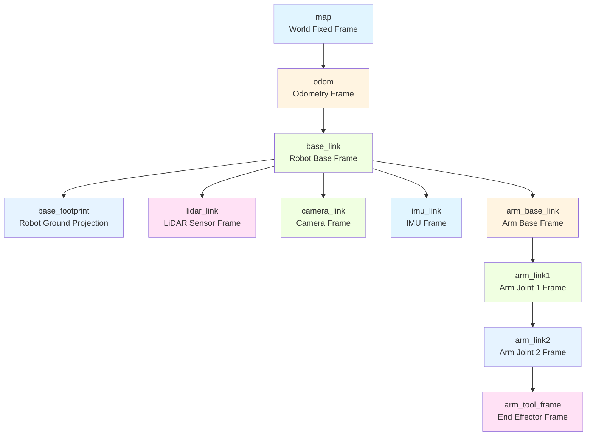
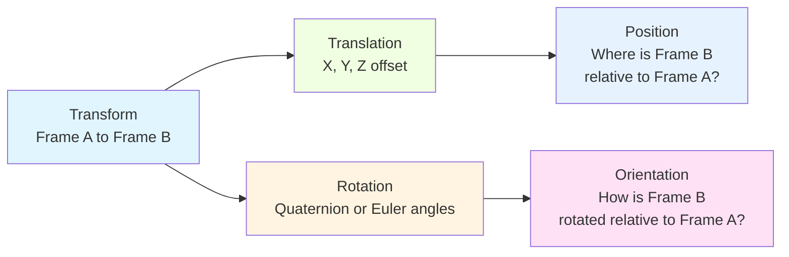
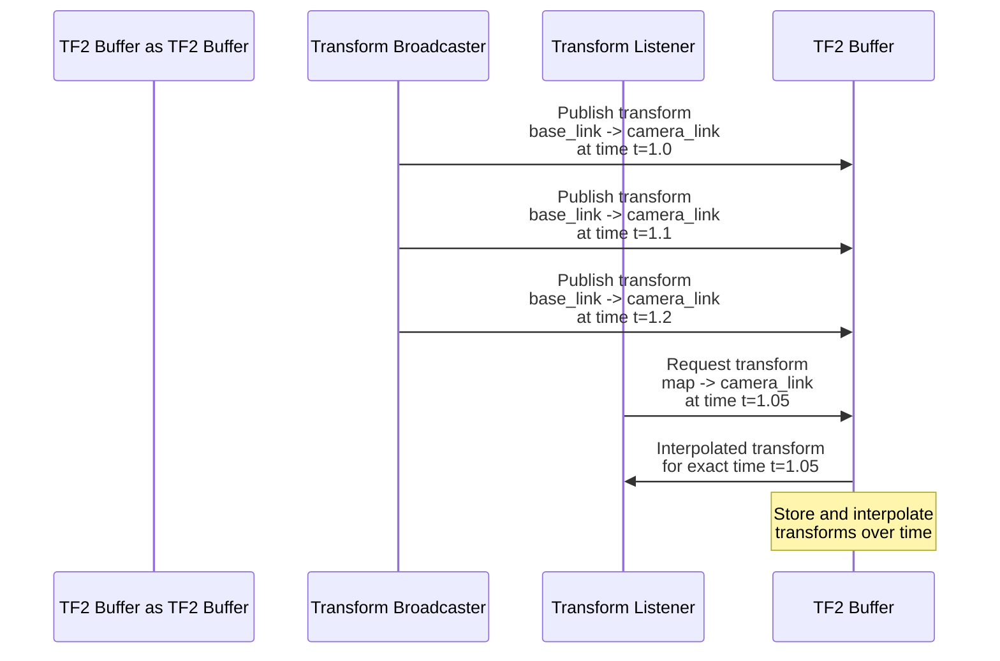

import MermaidDiagram from '@site/src/components/MermaidDiagram';
import CodeExample from '@site/src/components/CodeExample';
import Exercise from '@site/src/components/Exercise';
import Quiz from '@site/src/components/Quiz';
import PrerequisiteCheck from '@site/src/components/PrerequisiteCheck';

<PrerequisiteCheck prerequisites={frontMatter.prerequisites} />

# باب 7: TF2 ٹرانسفارم - کوآرڈینیٹ فریم اور روبوٹ مقام کاری (TF2 Transforms - Coordinate Frames and Robot Localization)

## یہ کیوں اہم ہے (Why This Matters)

ٹیسلا آپٹیمس اور فیگر 02 جیسے ہیومنوائڈ روبوٹس میں، پوزیشن اور جہت کو سمجھنا تمام آپریشنز کے لیے بنیادی ہے۔ ایک کیمرہ سینسر اپنے حوالہ فریم میں (0.5، 0.2، 1.0) کوآرڈینیٹس پر ایک چیز کو دریافت کر سکتا ہے، لیکن روبوٹ کے نیویگیشن سسٹم کو دنیا کے فریم میں یہ جاننے کی ضرورت ہوتی ہے کہ وہ چیز کہاں ہے تاکہ اس کے گرد راستہ کا منصوبہ بنا سکے۔ اسی طرح، روبوٹ کے بازو کنٹرولر کو بیس فریم اور اینڈ ایفیکٹر فریم کے درمیان تعلق جاننے کی ضرورت ہوتی ہے تاکہ درست مینویپولیشنز انجام دی جا سکیں۔ TF2 (ٹرانسفارم لائبریری 2) ان کوآرڈینیٹ فریم تعلقات کو منظم کرنے کے لیے ایک متحد سسٹم فراہم کرتا ہے، جو مختلف روبوٹ کمپوننٹس کو کوآرڈینیٹ سسٹمز کے درمیان ڈیٹا کو تبدیل کرکے بے لا مہار طریقے سے ایک ساتھ کام کرنے کی اجازت دیتا ہے۔ TF2 کے بغیر، روبوٹس سینسر ڈیٹا کو ضم، حرکات کا منصوبہ بندی، یا مؤثر نیویگیٹ کرنے سے قاصر ہوں گے۔

## مثلاً: شہر کے نقشے کا نظام متعدد حوالہ نقاط کے ساتھ (The City Map System with Multiple Reference Points)

### روزمرہ کا منظر (Everyday Scenario)
Imagine you're navigating a large city using multiple reference systems: street addresses, GPS coordinates, subway station locations, and building floor plans. Each system uses different coordinates and origins. When you want to go from "42nd Street and 5th Avenue" to "Times Square" to "the 3rd floor of the Empire State Building", you need a system to transform between these different reference frames. The city provides maps and conversion systems that let you understand how these different coordinate systems relate to each other.

### روبوٹکس سے ربط (The Connection to Robotics)
- **World Frame**: Like the city's main coordinate system (GPS)
- **Robot Base Frame**: Like a moving vehicle's reference frame
- **Sensor Frames**: Like specific locations within buildings
- **End-Effector Frame**: Like a person's hand position relative to their body
- **TF2**: Like the city's map system that connects all reference frames

### مثلاً کہاں ناکام ہوتی ہے (Where the Analogy Breaks Down)
City maps are static; robot coordinate frames move dynamically as the robot moves and articulates. City navigation is 2D; robots operate in 3D space with orientation (rotation) being equally important.

### روبوٹکس کی اصطلاحات میں (In Robotics Terms)
**TF2 (Transform Library 2)** is ROS 2's system for managing coordinate frame transformations. It maintains a tree of coordinate frames and allows transformation of data between any two frames at any point in time. **Transforms** represent the position and orientation relationship between coordinate frames. **Broadcasters** publish frame relationships, and **Listeners** query transformations.

## بنیادی تصورات (Core Concepts)

### 1. کوآرڈینیٹ فریم کی سلسلہ واری اور ٹرانسفارم ٹریز (Coordinate Frame Hierarchy and Transform Trees)

TF2 organizes coordinate frames in a tree structure where each frame has a single parent, enabling efficient transformation between any two frames.

**Mermaid Diagram**: TF2 Transform Tree Structure



*Alt-text: Tree diagram showing TF2 coordinate frame hierarchy. Map frame is root, with odom as child, base_link as child of odom, and multiple children of base_link including lidar_link, camera_link, imu_link, and arm_base_link. The arm has a chain of frames: arm_base_link → arm_link1 → arm_link2 → arm_tool_frame.*

**Common Robot Frames:**
- **map**: World-fixed frame, drift-free, for global navigation
- **odom**: Odometry frame, smooth but drifts over time
- **base_link**: Robot's main body frame
- **base_footprint**: Robot's projection on ground plane
- **sensor frames**: Individual sensor coordinate systems (lidar_link, camera_link, etc.)

### 2. ٹرانسفارم کی نمائندگی اور ریاضی (Transform Representation and Mathematics)

Transforms in TF2 represent both position (translation) and orientation (rotation) between coordinate frames.

**Mermaid Diagram**: Transform Components



*Alt-text: Diagram showing transform components split into translation (X, Y, Z offset) and rotation (quaternion or Euler angles). Translation determines position relationship and rotation determines orientation relationship between frames.*

**Transform Mathematics:**
- **Translation**: 3D vector (x, y, z) representing offset
- **Rotation**: Typically represented as quaternion (x, y, z, w) to avoid gimbal lock
- **Transformation Matrix**: 4x4 matrix combining rotation and translation

### 3. TF2 ڈیٹا فلو اور ٹائم مطابقت (TF2 Data Flow and Time Consistency)

TF2 maintains transforms over time and provides time-consistent transformations for accurate robot operation.

**Mermaid Diagram**: TF2 Time Consistency



*Alt-text: Sequence diagram showing transform broadcaster publishing transforms to TF2 buffer at different times. Transform listener requests transformation at specific time and receives interpolated result. TF2 buffer stores and interpolates transforms over time for time-consistent operations.*

## Worked Example: Complete TF2 Implementation for Robot System

Let's build a comprehensive TF2 system for a mobile manipulator robot:

```python
#!/usr/bin/env python3
"""
TF2 Transforms Worked Example
Complete implementation of TF2 broadcasters and listeners for a mobile manipulator
"""

import rclpy
from rclpy.node import Node
from tf2_ros import TransformBroadcaster, TransformListener, Buffer
from tf2_ros.buffer import ConnectivityException, ExtrapolationException
from geometry_msgs.msg import TransformStamped, PointStamped, Vector3
from sensor_msgs.msg import LaserScan, Image
from visualization_msgs.msg import Marker
import tf2_geometry_msgs
import tf2_ros
import math
import numpy as np
from builtin_interfaces.msg import Time


class TF2Broadcaster(Node):
    """
    TF2 Transform Broadcaster for robot coordinate frames
    """

    def __init__(self):
        super().__init__('tf2_broadcaster')

        # Create transform broadcaster
        self.tf_broadcaster = TransformBroadcaster(self)

        # Timer for broadcasting transforms
        self.timer = self.create_timer(0.1, self.broadcast_transforms)

        # Robot state simulation
        self.robot_x = 0.0
        self.robot_y = 0.0
        self.robot_theta = 0.0  # Heading angle
        self.arm_joint1 = 0.0   # First arm joint angle
        self.arm_joint2 = 0.0   # Second arm joint angle

        # Simulate robot movement
        self.simulation_time = 0.0

        self.get_logger().info('TF2 Broadcaster initialized')

    def broadcast_transforms(self):
        """
        Broadcast all robot transforms
        """
        # Update robot state for simulation
        self.simulation_time += 0.1
        self.robot_x = 2.0 * math.sin(0.1 * self.simulation_time)  # Oscillating motion
        self.robot_y = 1.5 * math.cos(0.2 * self.simulation_time)  # Different oscillation
        self.robot_theta = 0.5 * math.sin(0.05 * self.simulation_time)  # Slow rotation

        # Simulate arm movement
        self.arm_joint1 = 0.3 * math.sin(0.3 * self.simulation_time)
        self.arm_joint2 = 0.2 * math.cos(0.4 * self.simulation_time)

        # Broadcast transforms
        self.broadcast_odom_to_base()
        self.broadcast_base_to_sensors()
        self.broadcast_arm_transforms()

    def broadcast_odom_to_base(self):
        """
        Broadcast transform from odom to base_link
        This represents the robot's estimated position from odometry
        """
        t = TransformStamped()

        t.header.stamp = self.get_clock().now().to_msg()
        t.header.frame_id = 'odom'
        t.child_frame_id = 'base_link'

        # Robot position from odometry
        t.transform.translation.x = float(self.robot_x)
        t.transform.translation.y = float(self.robot_y)
        t.transform.translation.z = 0.0

        # Convert theta to quaternion
        quat = self.euler_to_quaternion(0, 0, self.robot_theta)
        t.transform.rotation.x = quat[0]
        t.transform.rotation.y = quat[1]
        t.transform.rotation.z = quat[2]
        t.transform.rotation.w = quat[3]

        self.tf_broadcaster.sendTransform(t)

    def broadcast_base_to_sensors(self):
        """
        Broadcast transforms from base_link to various sensors
        """
        # LiDAR transform (mounted on top of robot)
        t = TransformStamped()
        t.header.stamp = self.get_clock().now().to_msg()
        t.header.frame_id = 'base_link'
        t.child_frame_id = 'lidar_link'
        t.transform.translation.x = 0.0
        t.transform.translation.y = 0.0
        t.transform.translation.z = 0.5  # 50cm above base
        t.transform.rotation.x = 0.0
        t.transform.rotation.y = 0.0
        t.transform.rotation.z = 0.0
        t.transform.rotation.w = 1.0
        self.tf_broadcaster.sendTransform(t)

        # Camera transform (front of robot)
        t = TransformStamped()
        t.header.stamp = self.get_clock().now().to_msg()
        t.header.frame_id = 'base_link'
        t.child_frame_id = 'camera_link'
        t.transform.translation.x = 0.3  # 30cm in front of base
        t.transform.translation.y = 0.0
        t.transform.translation.z = 0.4  # 40cm above base
        # Point camera forward (no rotation)
        t.transform.rotation.x = 0.0
        t.transform.rotation.y = 0.0
        t.transform.rotation.z = 0.0
        t.transform.rotation.w = 1.0
        self.tf_broadcaster.sendTransform(t)

        # IMU transform (center of robot)
        t = TransformStamped()
        t.header.stamp = self.get_clock().now().to_msg()
        t.header.frame_id = 'base_link'
        t.child_frame_id = 'imu_link'
        t.transform.translation.x = 0.0
        t.transform.translation.y = 0.0
        t.transform.translation.z = 0.2  # 20cm above base
        t.transform.rotation.x = 0.0
        t.transform.rotation.y = 0.0
        t.transform.rotation.z = 0.0
        t.transform.rotation.w = 1.0
        self.tf_broadcaster.sendTransform(t)

        # Base footprint (projection on ground)
        t = TransformStamped()
        t.header.stamp = self.get_clock().now().to_msg()
        t.header.frame_id = 'base_link'
        t.child_frame_id = 'base_footprint'
        t.transform.translation.x = 0.0
        t.transform.translation.y = 0.0
        t.transform.translation.z = -0.3  # 30cm below base (on ground)
        t.transform.rotation.x = 0.0
        t.transform.rotation.y = 0.0
        t.transform.rotation.z = 0.0
        t.transform.rotation.w = 1.0
        self.tf_broadcaster.sendTransform(t)

    def broadcast_arm_transforms(self):
        """
        Broadcast transforms for robot arm
        """
        # Arm base (fixed to robot base)
        t = TransformStamped()
        t.header.stamp = self.get_clock().now().to_msg()
        t.header.frame_id = 'base_link'
        t.child_frame_id = 'arm_base_link'
        t.transform.translation.x = 0.1  # 10cm in front of base center
        t.transform.translation.y = 0.0
        t.transform.translation.z = 0.6  # 60cm above base
        t.transform.rotation.x = 0.0
        t.transform.rotation.y = 0.0
        t.transform.rotation.z = 0.0
        t.transform.rotation.w = 1.0
        self.tf_broadcaster.sendTransform(t)

        # First arm link (rotating joint)
        t = TransformStamped()
        t.header.stamp = self.get_clock().now().to_msg()
        t.header.frame_id = 'arm_base_link'
        t.child_frame_id = 'arm_link1'
        t.transform.translation.x = 0.3  # 30cm link
        t.transform.translation.y = 0.0
        t.transform.translation.z = 0.0
        # Apply rotation for first joint
        quat1 = self.euler_to_quaternion(0, 0, self.arm_joint1)
        t.transform.rotation.x = quat1[0]
        t.transform.rotation.y = quat1[1]
        t.transform.rotation.z = quat1[2]
        t.transform.rotation.w = quat1[3]
        self.tf_broadcaster.sendTransform(t)

        # Second arm link (rotating joint)
        t = TransformStamped()
        t.header.stamp = self.get_clock().now().to_msg()
        t.header.frame_id = 'arm_link1'
        t.child_frame_id = 'arm_link2'
        t.transform.translation.x = 0.25  # 25cm link
        t.transform.translation.y = 0.0
        t.transform.translation.z = 0.0
        # Apply rotation for second joint
        quat2 = self.euler_to_quaternion(0, 0, self.arm_joint2)
        t.transform.rotation.x = quat2[0]
        t.transform.rotation.y = quat2[1]
        t.transform.rotation.z = quat2[2]
        t.transform.rotation.w = quat2[3]
        self.tf_broadcaster.sendTransform(t)

        # End effector/tool frame
        t = TransformStamped()
        t.header.stamp = self.get_clock().now().to_msg()
        t.header.frame_id = 'arm_link2'
        t.child_frame_id = 'arm_tool_frame'
        t.transform.translation.x = 0.1  # 10cm from joint
        t.transform.translation.y = 0.0
        t.transform.translation.z = 0.0
        # Tool frame aligned with last link
        t.transform.rotation.x = quat2[0]
        t.transform.rotation.y = quat2[1]
        t.transform.rotation.z = quat2[2]
        t.transform.rotation.w = quat2[3]
        self.tf_broadcaster.sendTransform(t)

    def euler_to_quaternion(self, roll, pitch, yaw):
        """
        Convert Euler angles to quaternion
        """
        cy = math.cos(yaw * 0.5)
        sy = math.sin(yaw * 0.5)
        cp = math.cos(pitch * 0.5)
        sp = math.sin(pitch * 0.5)
        cr = math.cos(roll * 0.5)
        sr = math.sin(roll * 0.5)

        w = cr * cp * cy + sr * sp * sy
        x = sr * cp * cy - cr * sp * sy
        y = cr * sp * cy + sr * cp * sy
        z = cr * cp * sy - sr * sp * cy

        return [x, y, z, w]


class TF2Listener(Node):
    """
    TF2 Transform Listener for querying transformations
    """

    def __init__(self):
        super().__init__('tf2_listener')

        # Create TF2 buffer and listener
        self.tf_buffer = Buffer()
        self.tf_listener = TransformListener(self.tf_buffer, self)

        # Timer for querying transforms
        self.timer = self.create_timer(0.5, self.query_transforms)

        # Publisher for visualization
        self.marker_pub = self.create_publisher(Marker, 'tf_visualization', 10)

        self.get_logger().info('TF2 Listener initialized')

    def query_transforms(self):
        """
        Query various transforms and demonstrate their use
        """
        try:
            # Query transform from base_link to camera_link
            trans = self.tf_buffer.lookup_transform(
                'base_link',
                'camera_link',
                rclpy.time.Time())  # Use latest available time

            self.get_logger().info(
                f'Camera position relative to base: '
                f'x={trans.transform.translation.x:.2f}, '
                f'y={trans.transform.translation.y:.2f}, '
                f'z={trans.transform.translation.z:.2f}'
            )

            # Query transform from map to base_link (if available)
            try:
                map_to_base = self.tf_buffer.lookup_transform(
                    'map',
                    'base_link',
                    rclpy.time.Time())

                self.get_logger().info(
                    f'Robot position in map: '
                    f'x={map_to_base.transform.translation.x:.2f}, '
                    f'y={map_to_base.transform.translation.y:.2f}'
                )
            except (TransformException, ExtrapolationException):
                self.get_logger().info('Map frame not available yet')

            # Query transform from lidar_link to base_link
            lidar_to_base = self.tf_buffer.lookup_transform(
                'lidar_link',
                'base_link',
                rclpy.time.Time())

            self.get_logger().info(
                f'Lidar to base transform: '
                f'z_offset={lidar_to_base.transform.translation.z:.2f}'
            )

            # Demonstrate transform lookup with timeout
            try:
                # This will wait up to 1 second for the transform
                trans_wait = self.tf_buffer.lookup_transform(
                    'camera_link',
                    'lidar_link',
                    rclpy.time.Time(),
                    timeout=rclpy.duration.Duration(seconds=1.0))

                self.get_logger().info('Successfully looked up camera to lidar transform')
            except (TransformException, ExtrapolationException) as ex:
                self.get_logger().warn(f'Could not lookup transform: {ex}')

        except TransformException as ex:
            self.get_logger().error(f'Could not lookup transform: {ex}')

    def transform_point(self, target_frame, point_msg):
        """
        Transform a point from one frame to another
        """
        try:
            # Transform the point
            transformed_point = self.tf_buffer.transform(
                point_msg,
                target_frame,
                timeout=rclpy.duration.Duration(seconds=1.0)
            )
            return transformed_point
        except (TransformException, ExtrapolationException) as ex:
            self.get_logger().error(f'Could not transform point: {ex}')
            return None


class TransformException(Exception):
    """
    Custom exception for TF2 transform errors
    """
    pass


def main(args=None):
    rclpy.init(args=args)

    # Create broadcaster node
    broadcaster = TF2Broadcaster()

    # Create listener node
    listener = TF2Listener()

    try:
        # Combine both nodes in a single executor
        executor = rclpy.executors.MultiThreadedExecutor()
        executor.add_node(broadcaster)
        executor.add_node(listener)

        broadcaster.get_logger().info('Starting TF2 transform demonstration')
        executor.spin()

    except KeyboardInterrupt:
        broadcaster.get_logger().info('Shutting down TF2 nodes')
    finally:
        broadcaster.destroy_node()
        listener.destroy_node()
        rclpy.shutdown()


if __name__ == '__main__':
    main()
```

## ہاتھوں سے ورزش (Hands-On Exercise)

### ٹیئر A: سیمولیشن (CPU-صرف، لیپ ٹاپ مطابق) ✓ ضروری (Tier A: Simulation (CPU-Only, Laptop-Compatible) ✓ REQUIRED)

**ورزش 7.1: روبوٹ ٹرانسفارم لیبارٹری (Exercise 7.1: Robot Transform Laboratory)**

Create a complete TF2 system for a simulated robot with multiple sensors and a manipulator:

1. **Transform Tree**: Design a proper coordinate frame hierarchy for a mobile manipulator robot
2. **Broadcasters**: Implement transform broadcasters for all robot frames (base, sensors, arm links)
3. **Listeners**: Create transform listeners that query transformations between frames
4. **Point Transformation**: Implement functionality to transform points between coordinate frames
5. **Visualization**: Create markers to visualize the transform relationships in RViz

**Implementation Requirements**:
- Design complete coordinate frame tree for a mobile manipulator
- Implement broadcasters for all necessary transforms
- Create listeners that can query transformations between any frames
- Demonstrate point transformation functionality
- Include proper error handling for transform lookups

**Acceptance Criteria**:
- [ ] Complete coordinate frame hierarchy designed and implemented
- [ ] All necessary transforms are being broadcasted
- [ ] Transform queries work between different frame pairs
- [ ] Point transformation functionality demonstrated
- [ ] Error handling for missing transforms implemented

**Hints**:
- Start with the base robot frames before adding arm frames
- Use proper frame naming conventions (lowercase, underscores)
- Consider the relationship between static and dynamic transforms
- Test transform queries with different timing scenarios

### ٹیئر B: ایج ای ڈیپلائمنٹ (اختیاری) (Tier B: Edge AI Deployment (Optional))

**ورزش 7.2: حقیقی سینسر انضمام کے ساتھ TF2 (Exercise 7.2: Real Sensor Integration with TF2)**

Deploy the TF2 system with real sensors on a Jetson platform:

1. **Real Sensor Frames**: Define coordinate frames for actual sensor positions
2. **Calibration**: Implement transform calibration for sensor mounting positions
3. **Synchronization**: Ensure proper timing between sensor data and transforms
4. **Performance**: Optimize transform publishing rate for real-time operation

**Hardware Requirements**: Jetson Orin Nano with camera and IMU sensors

### ٹیئر C: روبوٹ ہارڈ ویئر (اختیاری) (Tier C: Robot Hardware (Optional))

**ورزش 7.3: جسمانی روبوٹ کوآرڈینیٹ سسٹم (Exercise 7.3: Physical Robot Coordinate System)**

Implement TF2 for a real robot platform:

1. **Hardware Frame Calibration**: Measure and define actual mounting positions
2. **Dynamic Transforms**: Handle transforms that change during robot operation
3. **Safety Integration**: Ensure transforms are valid before robot motion
4. **Multi-robot Coordination**: Handle transforms between multiple robots

**Hardware Requirements**: Unitree Go2 or equivalent robot platform

## خلاصہ (Summary)

- **TF2** is ROS 2's transform library for managing coordinate frame relationships
- **Transform Trees** organize frames hierarchically for efficient transformation
- **Broadcasters** publish frame relationships, **Listeners** query transformations
- **Time Consistency** ensures accurate transformations at specific timestamps
- **Point Transformation** enables conversion of data between coordinate systems
- Proper TF2 setup is essential for sensor integration, navigation, and manipulation

## ریفلیکشن سوالات (Reflection Questions)

1. **Why is it important to have a tree structure for coordinate frames rather than allowing arbitrary connections?** (Hint: Consider computational efficiency and avoiding loops)
2. **What challenges might arise when synchronizing sensor data with transforms in a real-time system?** (Hint: Think about timing and buffering)
3. **How would you handle coordinate frames for a robot with multiple manipulator arms?** (Hint: Consider frame naming and hierarchy design)

## کوئز (Quiz)

Test your understanding of TF2 transforms:

1. **What is the primary purpose of TF2 in ROS 2?**
   - A) To store sensor data
   - B) To manage coordinate frame transformations between different reference frames
   - C) To control robot motors
   - D) To store map data

   **Hint**: Review the "Why This Matters" section.

2. **True or False: TF2 maintains transforms over time and can interpolate between known transform values.**

   **Hint**: See the TF2 Time Consistency diagram.

3. **In a typical robot transform tree, which frame is usually the root?**
   - A) base_link
   - B) odom
   - C) map
   - D) camera_link

   **Hint**: Consider the transform hierarchy diagram.

4. **What type of mathematical representation is commonly used for rotations in TF2?**
   - A) Euler angles only
   - B) Quaternions (to avoid gimbal lock)
   - C) Matrices only
   - D) Vectors only

   **Hint**: Review the Transform Representation section.

5. **Which component is responsible for publishing transforms to the TF2 system?**
   - A) TransformListener
   - B) TransformBroadcaster
   - C) TransformBuffer
   - D) TransformManager

   **Hint**: Look at the worked example implementation.

6. **What happens if you try to look up a transform that doesn't exist in TF2?**
   - A) It returns a zero transform
   - B) It creates the transform automatically
   - C) It throws an exception (TransformException)
   - D) It returns the identity transform

   **Hint**: Consider error handling in the example code.

**Answers**: 1-B, 2-True, 3-C, 4-B, 5-B, 6-C

## مزید پڑھائی (Further Reading)

- [TF2 Documentation](https://docs.ros.org/en/humble/Tutorials/Intermediate/Tf2/Introduction-To-Tf2.html)
- [Writing a TF2 Broadcaster](https://docs.ros.org/en/humble/Tutorials/Intermediate/Tf2/Writing-A-Tf2-Broadcaster-Py.html)
- [Writing a TF2 Listener](https://docs.ros.org/en/humble/Tutorials/Intermediate/Tf2/Writing-A-Tf2-Listener-Py.html)
- [TF2 Best Practices](https://wiki.ros.org/tf2/Tutorials)
- [Coordinate Systems in Robotics](https://www.springer.com/gp/book/9783319544034)