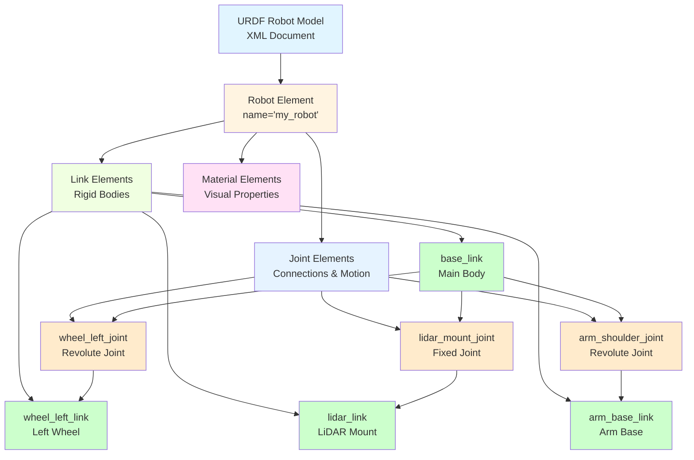
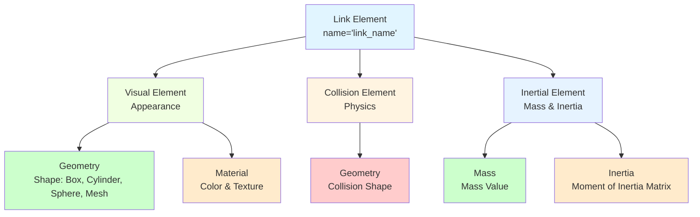
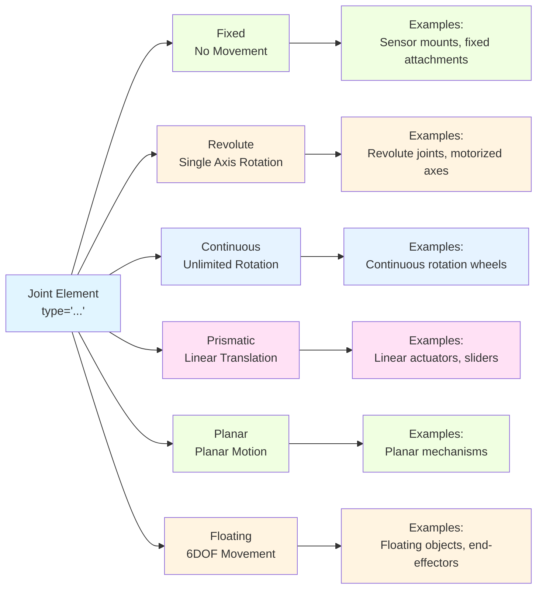

import MermaidDiagram from '@site/src/components/MermaidDiagram';
import CodeExample from '@site/src/components/CodeExample';
import Exercise from '@site/src/components/Exercise';
import Quiz from '@site/src/components/Quiz';
import PrerequisiteCheck from '@site/src/components/PrerequisiteCheck';

<PrerequisiteCheck prerequisites={frontMatter.prerequisites} />

# باب 8: URDF روبوٹ ماڈلز - یونیفائیڈ روبوٹ ڈسکرپشن فارمیٹ (Chapter 8: URDF Robot Models - Unified Robot Description Format)

## یہ کیوں اہم ہے (Why This Matters)

ٹیسلا آپٹیمس اور فیگر 02 جیسے ہیومنوائڈ روبوٹس میں، روبوٹ کے جسمانی ڈھانچے کی ایک درست ڈیجیٹل نمائندگی رکھنا تمام آپریشنز کے لیے انتہائی اہم ہے۔ URDF (یونیفائیڈ روبوٹ ڈسکرپشن فارمیٹ) XML فارمیٹ میں روبوٹ جیومیٹری، کنیمیٹکس، اور ڈائینامکس کی وضاحت کرنے کا ایک معیاری طریقہ فراہم کرتا ہے۔ یہ وضاحت Gazebo جیسے سیمولیشن ماحول کو روبوٹ کی درست نمائندگی کرنے کی اجازت دیتی ہے، RViz جیسے وژولائزیشن ٹولز کو روبوٹ کو درست طریقے سے ڈسپلے کرنے کی اجازت دیتی ہے، اور موشن پلاننگ اور کنٹرول الگورتھم کے لیے کنیمیٹک معلومات فراہم کرتی ہے۔ مناسب URDF ماڈلز کے بغیر، روبوٹ اپنے ڈھانچے کو مناسب طریقے سے سمجھ نہیں سکتے، جس کی وجہ سے کولیژن ڈیٹیکشن، انورس کنیمیٹکس، اور محفوظ موشن پلاننگ ناممکن ہو جاتی ہے۔

## مثال: معمار کا بلیو پرنٹ سسٹم (Analogy: The Architect's Blueprint System)

### روزمرہ کا منظر (Everyday Scenario)
ایک معمار کا تصور کریں جو متعدد منزلوں، کمرے، اور میکانیکل سسٹم کے ساتھ ایک پیچیدہ عمارت کو ڈیزائن کر رہا ہو۔ معمار تفصیلی بلیو پرنٹس تیار کرتا ہے جو یہ وضاحت کرتے ہیں: دیواروں، دروازوں، اور کھڑکیوں کے ابعاد اور مقامات؛ مختلف عمارت کمپوننٹس کے درمیان کنکشنز؛ HVAC اور برقی جیسے میکانیکل سسٹم؛ اور عمارت کے مختلف حصوں کے درمیان تعلقات۔ کنٹریکٹرز، انجینئرز، اور شہری انسپیکٹرز سب یہ بلیو پرنٹس استعمال کرتے ہیں تاکہ عمارت کے ڈھانچے کو سمجھ سکیں اور مناسب تعمیر اور آپریشن کو یقینی بنایا جا سکے۔

### روبوٹکس سے ربط (The Connection to Robotics)
- **URDF ماڈل (URDF Model)**: عمارت کے بلیو پرنٹ کی طرح، روبوٹ کے ڈھانچے کی وضاحت کرتا ہے
- **لنکس (Links)**: عمارت کے کمپوننٹس کی طرح (دیواریں، کمرے) جن میں جسمانی خصوصیات ہوتی ہیں
- **جوائنٹس (Joints)**: کمپوننٹس کے درمیان کنکشنز کی طرح (دروازے، ہنجز) جو حرکت کی اجازت دیتے ہیں
- **ویژوئل/کولیژن ماڈلز (Visual/Collision Models)**: تفصیلی ڈرائونگز کی طرح جو ظہور اور محفوظ حدود دکھاتے ہیں
- **کنیمیٹک چینز (Kinematic Chains)**: بنیاد سے چھت تک منسلک کمپوننٹس کی ترتیب کی طرح

### مثال کہاں ناکام ہوتی ہے (Where the Analogy Breaks Down)
عمارتیں مسلسل سٹرکچر ہوتی ہیں؛ روبوٹس میں متحرک حصے ہوتے ہیں جو تشکیل کو متحرک طور پر تبدیل کرتے ہیں۔ عمارت کے بلیو پرنٹس 2D ہوتے ہیں؛ URDF ماڈل 3D آرٹیکولیٹڈ سٹرکچر کی نمائندگی کرتے ہیں جن میں پیچیدہ کنیمیٹکس ہوتی ہے۔

### روبوٹکس کی اصطلاحوں میں (In Robotics Terms)
**URDF (یونیفائیڈ روبوٹ ڈسکرپشن فارمیٹ (Unified Robot Description Format))** XML-مبنی فارمیٹ ہے جو لنکس (ریجیڈ باڈیز)، جوائنٹس (کنکشنز جو ریلیٹو موشن کی اجازت دیتے ہیں)، ویژوئل اور کولیژن خصوصیات، اور انیرشیا پیرامیٹرز کے ساتھ روبوٹ ماڈلز کی وضاحت کے لیے ہے۔ **لنکس (Links)** روبوٹ کے ریجیڈ حصے کی نمائندگی کرتے ہیں، **جوائنٹس (Joints)** وضاحت کرتے ہیں کہ لنکس کیسے جڑتے ہیں اور ایک دوسرے کے ساتھ حرکت کرتے ہیں، اور **robot_state_publisher** TF2 کو نتیجے کے ٹرانسفارم کو براڈکاسٹ کرتا ہے۔

## بنیادی تصورات (Core Concepts)

### 1. URDF ساخت اور اجزاء (URDF Structure and Components)

URDF ماڈلز لنکس سے بنتے ہیں جو جوائنٹس کے ذریعے جڑے ہوتے ہیں، ایک کنیمیٹک ٹری تشکیل دیتے ہیں جو روبوٹ کے ڈھانچے کی وضاحت کرتے ہیں۔

**Mermaid Diagram**: URDF Model Structure



*Alt-text: ڈائیگرام URDF ماڈل کی ساخت دکھا رہی ہے جس میں روبوٹ عنصر لنک عناصر (base_link، wheel_left_link، lidar_link، arm_base_link) اور جوائنٹ عناصر (wheel_left_joint، lidar_mount_joint، arm_shoulder_joint) پر مشتمل ہے۔ لنکس اور جوائنٹس کنیمیٹک سٹرکچر کو دکھانے کے لیے جڑے ہوئے ہیں۔*

**URDF اجزاء (URDF Components):**
- **روبوٹ (Robot)**: پوری روبوٹ کی وضاحت پر مشتمل روٹ عنصر
- **لنکس (Links)**: ریجیڈ باڈی عناصر جن میں ویژوئل، کولیژن، اور انیرشیا خصوصیات ہیں
- **جوائنٹس (Joints)**: لنکس کے درمیان کنکشنز کی وضاحت کرتے ہیں جن میں موشن کنٹرینٹس ہیں
- **مواد (Materials)**: ویژوئل ظہور کی خصوصیات کی وضاحت کرتے ہیں

### 2. لنک خصوصیات اور جیومیٹری (Link Properties and Geometry)

لنکس روبوٹ کے ریجیڈ حصوں کی نمائندگی کرتے ہیں اور ان کی جسمانی خصوصیات کی وضاحت کرتے ہیں۔

**Mermaid Diagram**: Link Components



*Alt-text: ڈائیگرام لنک کمپوننٹس کو ویژوئل، کولیژن، اور انیرشیا عناصر میں تقسیم کر رہی ہے۔ ویژوئل میں جیومیٹری اور میٹریل کی خصوصیات ہیں، کولیژن میں فزکس سیمولیشن کے لیے جیومیٹری ہے، اور انیرشیا میں ماس اور انیرشیا میٹرکس کی خصوصیات ہیں۔*

### 3. جوائنٹ اقسام اور کنیمیٹکس (Joint Types and Kinematics)

جوائنٹس وضاحت کرتے ہیں کہ لنکس کیسے جڑتے ہیں اور ایک دوسرے کے ساتھ حرکت کرتے ہیں، روبوٹ کے کنیمیٹک ڈھانچے کو تشکیل دیتے ہیں۔

**Mermaid Diagram**: Joint Types



*Alt-text: ڈائیگرام مختلف جوائنٹ اقسام دکھا رہی ہے: فکسڈ (کوئی حرکت نہیں)، ریوولوٹ (سنگل ایکسز ریوٹیشن)، کنٹینیوئس (ان لمیٹڈ ریوٹیشن)، پریزمیٹک (لینیئر ٹرینس لیشن)، پلینر (پلینر موشن)، اور فلوٹنگ (6DOF موومنٹ). ہر قسم کی مثالیں ہیں.*

## کام کرنے والا مثال: مکمل URDF روبوٹ ماڈل (Worked Example: Complete URDF Robot Model)

چلو ہم ایک موبل مینیپولیٹر روبوٹ کے لیے ایک جامع URDF ماڈل بناتے ہیں:

```xml
<?xml version="1.0"?>
<!--
Complete URDF Model for a Mobile Manipulator Robot
This example demonstrates all major URDF concepts including links, joints,
visual/collision properties, and proper kinematic structure.
-->

<robot name="mobile_manipulator" xmlns:xacro="http://www.ros.org/wiki/xacro">

  <!-- Materials Definition -->
  <material name="blue">
    <color rgba="0.0 0.0 1.0 1.0"/>
  </material>
  <material name="black">
    <color rgba="0.0 0.0 0.0 1.0"/>
  </material>
  <material name="white">
    <color rgba="1.0 1.0 1.0 1.0"/>
  </material>
  <material name="red">
    <color rgba="1.0 0.0 0.0 1.0"/>
  </material>

  <!-- Base Link - The main body of the robot -->
  <link name="base_link">
    <visual>
      <origin xyz="0 0 0.15" rpy="0 0 0"/>
      <geometry>
        <box size="0.8 0.5 0.3"/>
      </geometry>
      <material name="blue"/>
    </visual>
    <collision>
      <origin xyz="0 0 0.15" rpy="0 0 0"/>
      <geometry>
        <box size="0.8 0.5 0.3"/>
      </geometry>
    </collision>
    <inertial>
      <origin xyz="0 0 0.15" rpy="0 0 0"/>
      <mass value="10.0"/>
      <inertia ixx="1.0" ixy="0.0" ixz="0.0" iyy="1.0" iyz="0.0" izz="1.0"/>
    </inertial>
  </link>

  <!-- Left Wheel -->
  <link name="wheel_left_link">
    <visual>
      <origin xyz="0 0 0" rpy="1.5708 0 0"/>
      <geometry>
        <cylinder radius="0.1" length="0.05"/>
      </geometry>
      <material name="black"/>
    </visual>
    <collision>
      <origin xyz="0 0 0" rpy="1.5708 0 0"/>
      <geometry>
        <cylinder radius="0.1" length="0.05"/>
      </geometry>
    </collision>
    <inertial>
      <origin xyz="0 0 0" rpy="0 0 0"/>
      <mass value="1.0"/>
      <inertia ixx="0.01" ixy="0.0" ixz="0.0" iyy="0.01" iyz="0.0" izz="0.005"/>
    </inertial>
  </link>

  <!-- Right Wheel -->
  <link name="wheel_right_link">
    <visual>
      <origin xyz="0 0 0" rpy="1.5708 0 0"/>
      <geometry>
        <cylinder radius="0.1" length="0.05"/>
      </geometry>
      <material name="black"/>
    </visual>
    <collision>
      <origin xyz="0 0 0" rpy="1.5708 0 0"/>
      <geometry>
        <cylinder radius="0.1" length="0.05"/>
      </geometry>
    </collision>
    <inertial>
      <origin xyz="0 0 0" rpy="0 0 0"/>
      <mass value="1.0"/>
      <inertia ixx="0.01" ixy="0.0" ixz="0.0" iyy="0.01" iyz="0.0" izz="0.005"/>
    </inertial>
  </link>

  <!-- Caster Wheel (Fixed) -->
  <link name="caster_wheel_link">
    <visual>
      <origin xyz="0 0 0" rpy="0 0 0"/>
      <geometry>
        <sphere radius="0.05"/>
      </geometry>
      <material name="black"/>
    </visual>
    <collision>
      <origin xyz="0 0 0" rpy="0 0 0"/>
      <geometry>
        <sphere radius="0.05"/>
      </geometry>
    </collision>
    <inertial>
      <origin xyz="0 0 0" rpy="0 0 0"/>
      <mass value="0.5"/>
      <inertia ixx="0.0005" ixy="0.0" ixz="0.0" iyy="0.0005" iyz="0.0" izz="0.0005"/>
    </inertial>
  </link>

  <!-- LiDAR Sensor Mount -->
  <link name="lidar_link">
    <visual>
      <origin xyz="0 0 0" rpy="0 0 0"/>
      <geometry>
        <cylinder radius="0.05" length="0.05"/>
      </geometry>
      <material name="red"/>
    </visual>
    <collision>
      <origin xyz="0 0 0" rpy="0 0 0"/>
      <geometry>
        <cylinder radius="0.05" length="0.05"/>
      </geometry>
    </collision>
    <inertial>
      <origin xyz="0 0 0" rpy="0 0 0"/>
      <mass value="0.2"/>
      <inertia ixx="0.0001" ixy="0.0" ixz="0.0" iyy="0.0001" iyz="0.0" izz="0.0001"/>
    </inertial>
  </link>

  <!-- Camera Mount -->
  <link name="camera_link">
    <visual>
      <origin xyz="0 0 0" rpy="0 0 0"/>
      <geometry>
        <box size="0.05 0.03 0.02"/>
      </geometry>
      <material name="white"/>
    </visual>
    <collision>
      <origin xyz="0 0 0" rpy="0 0 0"/>
      <geometry>
        <box size="0.05 0.03 0.02"/>
      </geometry>
    </collision>
    <inertial>
      <origin xyz="0 0 0" rpy="0 0 0"/>
      <mass value="0.1"/>
      <inertia ixx="0.00001" ixy="0.0" ixz="0.0" iyy="0.00001" iyz="0.0" izz="0.00001"/>
    </inertial>
  </link>

  <!-- ARM LINKS START -->
  <!-- Arm Base -->
  <link name="arm_base_link">
    <visual>
      <origin xyz="0 0 0.05" rpy="0 0 0"/>
      <geometry>
        <cylinder radius="0.05" length="0.1"/>
      </geometry>
      <material name="white"/>
    </visual>
    <collision>
      <origin xyz="0 0 0.05" rpy="0 0 0"/>
      <geometry>
        <cylinder radius="0.05" length="0.1"/>
      </geometry>
    </collision>
    <inertial>
      <origin xyz="0 0 0.05" rpy="0 0 0"/>
      <mass value="0.5"/>
      <inertia ixx="0.0005" ixy="0.0" ixz="0.0" iyy="0.0005" iyz="0.0" izz="0.0002"/>
    </inertial>
  </link>

  <!-- Arm Link 1 -->
  <link name="arm_link1">
    <visual>
      <origin xyz="0.15 0 0" rpy="0 0 0"/>
      <geometry>
        <box size="0.3 0.05 0.05"/>
      </geometry>
      <material name="blue"/>
    </visual>
    <collision>
      <origin xyz="0.15 0 0" rpy="0 0 0"/>
      <geometry>
        <box size="0.3 0.05 0.05"/>
      </geometry>
    </collision>
    <inertial>
      <origin xyz="0.15 0 0" rpy="0 0 0"/>
      <mass value="1.0"/>
      <inertia ixx="0.01" ixy="0.0" ixz="0.0" iyy="0.001" iyz="0.0" izz="0.001"/>
    </inertial>
  </link>

  <!-- Arm Link 2 -->
  <link name="arm_link2">
    <visual>
      <origin xyz="0.125 0 0" rpy="0 0 0"/>
      <geometry>
        <box size="0.25 0.04 0.04"/>
      </geometry>
      <material name="white"/>
    </visual>
    <collision>
      <origin xyz="0.125 0 0" rpy="0 0 0"/>
      <geometry>
        <box size="0.25 0.04 0.04"/>
      </geometry>
    </collision>
    <inertial>
      <origin xyz="0.125 0 0" rpy="0 0 0"/>
      <mass value="0.8"/>
      <inertia ixx="0.005" ixy="0.0" ixz="0.0" iyy="0.0005" iyz="0.0" izz="0.0005"/>
    </inertial>
  </link>

  <!-- Arm Tool Frame (End Effector) -->
  <link name="arm_tool_frame">
    <inertial>
      <origin xyz="0 0 0" rpy="0 0 0"/>
      <mass value="0.01"/>
      <inertia ixx="0.000001" ixy="0.0" ixz="0.0" iyy="0.000001" iyz="0.0" izz="0.000001"/>
    </inertial>
  </link>
  <!-- ARM LINKS END -->

  <!-- JOINTS START -->
  <!-- Left Wheel Joint -->
  <joint name="wheel_left_joint" type="continuous">
    <parent link="base_link"/>
    <child link="wheel_left_link"/>
    <origin xyz="0.2 -0.3 0.1" rpy="0 0 0"/>
    <axis xyz="0 1 0"/>
    <limit effort="10.0" velocity="10.0"/>
  </joint>

  <!-- Right Wheel Joint -->
  <joint name="wheel_right_joint" type="continuous">
    <parent link="base_link"/>
    <child link="wheel_right_link"/>
    <origin xyz="0.2 0.3 0.1" rpy="0 0 0"/>
    <axis xyz="0 1 0"/>
    <limit effort="10.0" velocity="10.0"/>
  </joint>

  <!-- Caster Wheel Joint (Fixed) -->
  <joint name="caster_wheel_joint" type="fixed">
    <parent link="base_link"/>
    <child link="caster_wheel_link"/>
    <origin xyz="-0.3 0.0 0.05" rpy="0 0 0"/>
  </joint>

  <!-- LiDAR Mount Joint -->
  <joint name="lidar_mount_joint" type="fixed">
    <parent link="base_link"/>
    <child link="lidar_link"/>
    <origin xyz="0.3 0.0 0.35" rpy="0 0 0"/>
  </joint>

  <!-- Camera Mount Joint -->
  <joint name="camera_mount_joint" type="fixed">
    <parent link="base_link"/>
    <child link="camera_link"/>
    <origin xyz="0.35 0.0 0.3" rpy="0 0 0"/>
  </joint>

  <!-- Arm Base Joint -->
  <joint name="arm_base_joint" type="fixed">
    <parent link="base_link"/>
    <child link="arm_base_link"/>
    <origin xyz="0.0 0.0 0.3" rpy="0 0 0"/>
  </joint>

  <!-- Arm Shoulder Joint -->
  <joint name="arm_shoulder_joint" type="revolute">
    <parent link="arm_base_link"/>
    <child link="arm_link1"/>
    <origin xyz="0.0 0.0 0.1" rpy="0 0 0"/>
    <axis xyz="0 0 1"/>
    <limit lower="-1.57" upper="1.57" effort="100.0" velocity="1.0"/>
  </joint>

  <!-- Arm Elbow Joint -->
  <joint name="arm_elbow_joint" type="revolute">
    <parent link="arm_link1"/>
    <child link="arm_link2"/>
    <origin xyz="0.3 0.0 0.0" rpy="0 0 0"/>
    <axis xyz="0 1 0"/>
    <limit lower="-1.57" upper="1.57" effort="100.0" velocity="1.0"/>
  </joint>

  <!-- Arm Tool Joint -->
  <joint name="arm_tool_joint" type="fixed">
    <parent link="arm_link2"/>
    <child link="arm_tool_frame"/>
    <origin xyz="0.25 0.0 0.0" rpy="0 0 0"/>
  </joint>
  <!-- JOINTS END -->

</robot>
```

اب ہم اس URDF ماڈل کے ساتھ کام کرنے والے پائی تھن نوڈ کو بناتے ہیں جو robot_state_publisher کا استعمال کرتا ہے:

```python
#!/usr/bin/env python3
"""
URDF Robot Model Worked Example
Demonstrates working with URDF models and robot_state_publisher
"""

import rclpy
from rclpy.node import Node
from sensor_msgs.msg import JointState
from std_msgs.msg import Header
from rclpy.qos import QoSProfile
import math
import numpy as np


class URDFSimulator(Node):
    """
    Simulates a URDF robot by publishing joint states
    """

    def __init__(self):
        super().__init__('urdf_simulator')

        # Create publisher for joint states
        qos_profile = QoSProfile(depth=10)
        self.joint_pub = self.create_publisher(JointState, 'joint_states', qos_profile)

        # Timer for publishing joint states
        self.timer = self.create_timer(0.1, self.publish_joint_states)

        # Simulate joint positions
        self.time = 0.0

        self.get_logger().info('URDF Simulator initialized')

    def publish_joint_states(self):
        """
        Publish joint state messages for the URDF robot
        """
        # Create joint state message
        msg = JointState()
        msg.name = []
        msg.position = []
        msg.velocity = []
        msg.effort = []

        # Update simulation time
        self.time += 0.1

        # Add wheel joints (fixed for this simulation)
        msg.name.append('wheel_left_joint')
        msg.position.append(0.0)  # Wheels are fixed in URDF for this example
        msg.velocity.append(0.0)
        msg.effort.append(0.0)

        msg.name.append('wheel_right_joint')
        msg.position.append(0.0)
        msg.velocity.append(0.0)
        msg.effort.append(0.0)

        # Add caster wheel (fixed joint - not in joint states)
        # Fixed joints are not published in joint states

        # Add arm joints with simulated motion
        shoulder_pos = 0.5 * math.sin(0.5 * self.time)  # Oscillating motion
        elbow_pos = 0.3 * math.cos(0.3 * self.time)     # Different frequency

        msg.name.append('arm_shoulder_joint')
        msg.position.append(shoulder_pos)
        msg.velocity.append(0.5 * 0.5 * math.cos(0.5 * self.time))  # Derivative
        msg.effort.append(0.0)

        msg.name.append('arm_elbow_joint')
        msg.position.append(elbow_pos)
        msg.velocity.append(-0.3 * 0.3 * math.sin(0.3 * self.time))  # Derivative
        msg.effort.append(0.0)

        # Add timestamp
        msg.header.stamp = self.get_clock().now().to_msg()
        msg.header.frame_id = 'base_link'

        # Publish the message
        self.joint_pub.publish(msg)

        # Log some information
        self.get_logger().info(
            f'Published joint states: '
            f'shoulder={shoulder_pos:.2f}, elbow={elbow_pos:.2f}'
        )


def main(args=None):
    rclpy.init(args=args)

    # Create URDF simulator node
    urdf_simulator = URDFSimulator()

    try:
        urdf_simulator.get_logger().info('Starting URDF simulation')
        rclpy.spin(urdf_simulator)
    except KeyboardInterrupt:
        urdf_simulator.get_logger().info('Shutting down URDF simulator')
    finally:
        urdf_simulator.destroy_node()
        rclpy.shutdown()


if __name__ == '__main__':
    main()
```

## عملی مشق (Hands-On Exercise)

### ٹیئر A: سیمولیشن (CPU-صرف، لیپ ٹاپ مطابقت رکھتا ہے) ✓ لازمی
**ایکسائز 8.1: URDF روبوٹ ماڈلنگ لیبارٹری**
آپ کے انتخاب کے مطابق روبوٹ کے لیے URDF ماڈل بنائیں اور تصدیق کریں:

1. **روبوٹ ڈیزائن**: روبوٹ کی قسم کا انتخاب کریں (موبل روبوٹ، مینیپولیٹر، موبل مینیپولیٹر) اور اس کے ڈھانچے کو ڈیزائن کریں
2. **URDF تخلیق**: مناسب لنکس، جوائنٹس، اور ویژوئل خصوصیات کے ساتھ مکمل URDF فائل لکھیں
3. **جوائنٹ اسٹیٹ پبلشر**: مووینگ جوائنٹس کے لیے جوائنٹ اسٹیٹس پبلش کرنے والا نوڈ بنائیں
4. **توثیق**: check_urdf ٹول کا استعمال کرتے ہوئے URDF کی توثیق کریں اور RViz میں ویژولائز کریں
5. **کنیمیٹک تجزیہ**: کنیمیٹک چین اور ڈگریز آف فریڈم کا تجزیہ کریں

**نافذ کاری کی شرائط**:
- کم از کم 4 لنکس اور 3 جوائنٹس کے ساتھ مکمل URDF ماڈل
- ہر لنک کے لیے مناسب ویژوئل اور کولیژن خصوصیات
- ریوولوٹ/پریزمیٹک جوائنٹس کے لیے جوائنٹ اسٹیٹ پبلشر
- مناسب مواد کی تعریفات اور رنگ
- روبوٹ کے کنیمیٹک ڈھانچے کی دستاویزات

**قبول کی شرائط**:
- [ ] مناسب XML ساخت کے ساتھ مکمل URDF ماڈل
- [ ] تمام لنکس میں ویژوئل، کولیژن، اور انیرشیا خصوصیات ہیں
- [ ] جوائنٹ اسٹیٹ پبلشر نوڈ نافذ کیا گیا
- [ ] URDF بغیر کسی نقصان کے تصدیق کرتا ہے
- [ ] ویژولائزیشن ٹولز میں روبوٹ مناسب طریقے سے ڈسپلے ہوتا ہے

**اشارے**:
- پیچیدگی شامل کرنے سے پہلے ایک سادہ روبوٹ سے شروع کریں
- اپنے URDF کی توثیق کے لیے check_urdf ٹول استعمال کریں: `check_urdf robot.urdf`
- ٹیسٹ کے لیے joint_state_publisher_gui کا استعمال کریں: `ros2 run joint_state_publisher_gui joint_state_publisher_gui`
- حقیقی روبوٹس کے جسمانی ابعاد اور ماس خصوصیات پر غور کریں

### ٹیئر B: ایج اے آئی ڈیپلائمنٹ (اختیاری)
**ایکسائز 8.2: حقیقی روبوٹ URDF انضمام**
جیٹسن پلیٹ فارم پر حقیقی روبوٹ ہارڈ ویئر کے ساتھ URDF ماڈلز ڈیپلائی کریں:

1. **ہارڈ ویئر کیلیبریشن**: حقیقی روبوٹ کے ابعاد کو ناپیں اور URDF کو اپ ڈیٹ کریں
2. **سینسر انٹیگریشن**: حقیقی سینسرز کے لیے کوآرڈینیٹ فریم شامل کریں
3. **کنیمیٹک کیلیبریشن**: پیمائش کے مطابق جوائنٹ ریلیشن شپس کو فائن ٹیون کریں
4. **سیمولیشن-ٹو-ریل**: سیمولیشن اور حقیقی روبوٹ کنٹرول دونوں کے لیے URDF کا استعمال کریں

**ہارڈ ویئر کی ضروریات**: روبوٹ ہارڈ ویئر کے ساتھ جیٹسن اورن نینو

### ٹیئر C: روبوٹ ہارڈ ویئر (اختیاری)
**ایکسائز 8.3: پیچیدہ روبوٹ URDF**
پیچیدہ ہیومنوائڈ روبوٹس کے لیے URDF ماڈلز بنائیں:

1. **مکمل باڈی ماڈل**: تمام اہم باڈی سیگمنٹس اور جوائنٹس شامل کریں
2. **متعدد اینڈ ایفیکٹرز**: گریبرز/ہینڈز کے ساتھ دونوں بازوں کو ماڈل کریں
3. **سینسی سسٹم**: تمام سینسر کوآرڈینیٹ فریم انضمام کریں
4. **ڈائینامکس آپٹیمائزیشن**: کنٹرول کے لیے انیرشیا خصوصیات کو فائن ٹیون کریں

**ہارڈ ویئر کی ضروریات**: یونٹیری گو2 یا مساوی روبوٹ پلیٹ فارم

## خلاصہ (Summary)
- **URDF** ROS 2 میں روبوٹ کے ڈھانچے کی وضاحت کے لیے معیاری فارمیٹ ہے
- **لنکس (Links)** ویژوئل، کولیژن، اور انیرشیا خصوصیات کے ساتھ ریجیڈ باڈیز کی نمائندگی کرتے ہیں
- **جوائنٹس (Joints)** لنکس کے درمیان کنکشنز اور موشن کنٹرینٹس کی وضاحت کرتے ہیں
- **robot_state_publisher** جوائنٹ ٹرانسفارم کو TF2 سسٹم میں براڈکاسٹ کرتا ہے
- مناسب URDF ماڈلز سیمولیشن، ویژولائزیشن، اور کنٹرول کے لیے ضروری ہیں
- URDF MoveIt! جیسے ٹولز کو موشن پلاننگ اور Gazebo کو سیمولیشن کے لیے فعال کرتا ہے

## تفکر کے سوالات (Reflection Questions)
1. **URDF میں ویژوئل اور کولیژن ماڈلز کو الگ کرنا کیوں اہم ہے؟** (اشارہ: کارکردگی اور درستگی کے مابین کمپرومائز پر غور کریں)
2. **آپ URDF میں بند کنیمیٹک چین (جیسے پیرالل مینیپولیٹر) کے روبوٹ کو کیسے ماڈل کریں گے؟** (اشارہ: ٹری سٹرکچر کی حد پر غور کریں)
3. **صرف URDF کے بجائے URDF کے ساتھ Xacro (XML میکروس) استعمال کرنے کے کیا فوائد ہیں؟** (اشارہ: دوبارہ استعمال اور پیچیدگی کے انتظام کے بارے میں سوچیں)

## کوئز (Quiz)
URDF روبوٹ ماڈلز کی تفہیم کو جانچیں:

1. **URDF کا مطلب کیا ہے؟**
   - A) یونیفائیڈ روبوٹ ڈویلپمنٹ فریم ورک
   - B) یونیفائیڈ روبوٹ ڈسکرپشن فارمیٹ
   - C) یونیورسل روبوٹ ڈیزائن فائل
   - D) یونیورسل روبوٹکس ڈیٹا فارمیٹ

   **اشارہ**: اس چیپٹر کا عنوان دیکھیں۔

2. **سچ یا جھوٹ: URDF ماڈلز میں ہر لنک کے لیے ویژوئل اور کولیژن جیومیٹری دونوں ہو سکتی ہے۔**

   **اشارہ**: لنک کمپوننٹس ڈائیگرام دیکھیں۔

3. **کون سا جوائنٹ قسم سنگل ایکسز کے ارد گرد لامحدود گردش کی اجازت دیتا ہے؟**
   - A) ریوولوٹ
   - B) پریزمیٹک
   - C) کنٹینیوئس
   - D) فکسڈ

   **اشارہ**: جوائنٹ ٹائپس ڈائیگرام کا جائزہ لیں۔

4. **کون سا ROS 2 نوڈ جوائنٹ اسٹیٹس سے ٹرانسفارم پبلش کرنے کے لیے عام طور پر استعمال ہوتا ہے؟**
   - A) tf2_publisher
   - B) robot_state_publisher
   - C) joint_transform_publisher
   - D) urdf_broadcaster

   **اشارہ**: کام کرنے والی مثال دیکھیں۔

5. **URDF میں، کون سا عنصر ریجیڈ باڈی کی جسمانی خصوصیات کی وضاحت کرتا ہے؟**
   - A) `<visual>`
   - B) `<collision>`
   - C) `<inertial>`
   - D) `<geometry>`

   **اشارہ**: ماس اور انیرشیا خصوصیات پر غور کریں۔

6. **ان میں سے کون سا URDF جوائنٹ قسم درست نہیں ہے؟**
   - A) fixed
   - B) revolute
   - C) prismatic
   - D) spherical

   **اشارہ**: جوائنٹ ٹائپس سیکشن کا جائزہ لیں (نوٹ: یہ ایک چالاک سوال ہے - سpherical درحقیقت درست ہے، لیکن ڈائیگرام چیک کریں)۔

**جوابات**: 1-B, 2-سچ, 3-C, 4-B, 5-C, 6-D (نوٹ: URDF میں درج تمام قسمیں درحقیقت درست ہیں - spherical جوائنٹس کی حمایت کی جاتی ہے)

## مزید پڑھائی (Further Reading)
- [URDF/XML فارمیٹ دستاویزات](https://wiki.ros.org/urdf/XML)
- [انڈسٹریل روبوٹ کے لیے URDF لکھنا](https://docs.ros.org/en/humble/Tutorials/Intermediate/URDF/Building-a-Visual-Robot-Model-with-URDF.html)
- [robot_state_publisher پیکیج](https://wiki.ros.org/robot_state_publisher)
- [URDF ٹیوٹوریلز](https://docs.ros.org/en/humble/Tutorials/Intermediate/URDF.html)
- [URDF میکرو سسٹم کے لیے Xacro](https://wiki.ros.org/xacro)