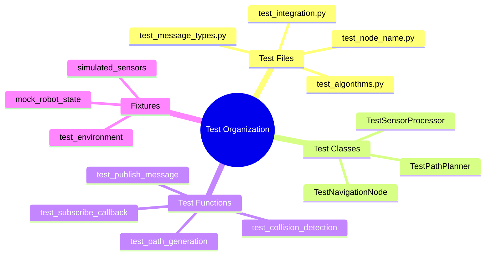
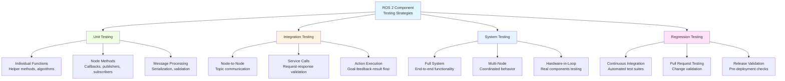

import MermaidDiagram from '@site/src/components/MermaidDiagram';
import CodeExample from '@site/src/components/CodeExample';
import Exercise from '@site/src/components/Exercise';
import Quiz from '@site/src/components/Quiz';
import PrerequisiteCheck from '@site/src/components/PrerequisiteCheck';

<PrerequisiteCheck prerequisites={frontMatter.prerequisites} />

# باب 9: Pytest کے ساتھ یونٹ ٹیسٹنگ - قابل اعتماد روبوٹ سافٹ ویئر (Unit Testing with Pytest - Reliable Robot Software)

## یہ کیوں اہم ہے (Why This Matters)

ٹیسلا آپٹیمس اور فیگر 02 جیسے ہیومنوائڈ روبوٹس میں، سافٹ ویئر کی قابلِ اعتمادی محفوظت اور کارکردگی کے لیے اہم ہے۔ ڈیسک ٹاپ ایپلی کیشنز کے برعکس جہاں کریش ایک صارف کو پریشان کر سکتا ہے، روبوٹ سافٹ ویئر کی ناکامیاں مالیتی نقصان، زخم، یا اہم ایپلی کیشنز میں مشن ناکامی کا سبب بن سکتی ہیں۔ یونٹ ٹیسٹنگ یقین دہانی کرتی ہے کہ انفرادی روبوٹ سافٹ ویئر کمپوننٹس ضم ہونے سے پہلے الگ تفریق میں درست طریقے سے کام کرتے ہیں۔ جب ایک روبوٹ کا نیویگیشن سسٹم رکاوٹ سے بچنے میں ناکام ہو جاتا ہے، یا اس کا بازو کنٹرولر غلط پوزیشن پر جاتا ہے، یہ ناکامیاں اکثر انفرادی فنکشنز یا میتھڈز میں نہ دیکھے گئے بگز سے نکلتی ہیں۔ Pytest جامع ٹیسٹ سوٹس تخلیق کرنے کے لیے ایک طاقتور، لچکدار فریم ورک فراہم کرتا ہے جو روبوٹ سافٹ ویئر کے رویے کی تصدیق کرتا ہے، ترقی کے دوران ریگریشنز کو پکڑتا ہے، اور مختلف ماحول میں مسلسل کارکردگی کو یقینی بناتا ہے۔ بغیر مناسب ٹیسٹنگ کے، ہیومنوائڈ روبوٹس کو انسانی ماحول میں پیچیدہ کاموں کے ساتھ اعتماد نہیں کیا جا سکتا۔

## مثلاً: ہوائی جہاز کی دیکھ بھال اور تفتیش کا نظام (The Aircraft Maintenance and Inspection System)

### روزمرہ کا منظر (Everyday Scenario)
Consider the rigorous testing and inspection protocols for commercial aircraft. Before every flight, pilots conduct extensive pre-flight checks: engine operation, control surfaces, navigation systems, communication equipment, and safety systems. Each system is tested individually and as part of integrated operations. Maintenance crews perform scheduled inspections, testing individual components like sensors, hydraulics, and avionics. When issues are detected, specific tests help isolate problems to particular subsystems. Aircraft manufacturers also perform extensive testing during development, simulating various flight conditions and failure scenarios in controlled environments.

### روبوٹکس سے ربط (The Connection to Robotics)
- **Unit Tests**: Like individual system checks (engine, controls, sensors)
- **Integration Tests**: Like integrated system checks (autopilot with navigation)
- **Regression Tests**: Like ongoing maintenance checks ensuring fixes don't break other systems
- **Mocking**: Like flight simulators testing systems without actual flight risk
- **Test Coverage**: Like comprehensive inspection protocols ensuring all systems are verified

### مثلاً کہاں ناکام ہوتی ہے (Where the Analogy Breaks Down)
Aircraft systems are more predictable than robots operating in dynamic environments. Aircraft have fewer interconnected systems than complex robots with dozens of sensors and actuators. Aircraft testing is more regulated than robotics testing.

### روبوٹکس کی اصطلاحات میں (In Robotics Terms)
**Pytest** is Python's most popular testing framework, providing fixtures, parameterized tests, and plugins for comprehensive test automation. **Unit Tests** verify individual robot software components (functions, classes, nodes) in isolation. **Mocking** simulates ROS 2 components and hardware to test without physical dependencies. **Test Coverage** ensures all robot software code paths are exercised by tests.

## بنیادی تصورات (Core Concepts)

### 1. Pytest فریم ورک اور ٹیسٹ کی ساخت (Pytest Framework and Test Structure)

Pytest provides a simple, powerful framework for organizing and running robot software tests.

**Mermaid Diagram**: Pytest Test Structure

```mermaid
graph TD
    A[Pytest Framework] --> B[Test Discovery]
    A --> C[Test Collection]
    A --> D[Test Execution]
    A --> E[Test Reporting]

    B --> F[Find test_*.py files]
    B --> G[Discover test functions<br/>starting with 'test_']
    B --> H[Identify test classes<br/>with test methods]

    C --> I[Test Items<br/>Individual test functions]
    C --> J[Test Parameters<br/>for parametrized tests]
    C --> K[Test Dependencies<br/>fixture requirements]

    D --> L[Setup Fixtures]
    D --> M[Run Test Functions]
    D --> N[Capture Assertions]
    D --> O[Handle Exceptions]

    E --> P[Test Results<br/>Pass/Fail Status]
    E --> Q[Coverage Reports<br/>Code coverage analysis]
    E --> R[Performance Metrics<br/>execution time, resources]

    style A fill:#e1f5ff
    style D fill:#f0ffe1
    style E fill:#fff4e1
    style L fill:#ffe1f5
    style M fill:#e6f3ff
    style N fill:#f0ffe1
    style O fill:#ffe1f5
    style P fill:#ccffcc
    style Q fill:#ffebcc
    style R fill:#ffcccc
```



*Alt-text: Diagram showing Pytest framework with four main components: Test Discovery (finding test files/functions), Test Collection (organizing test items), Test Execution (setup, run, assertions), and Test Reporting (results, coverage, metrics). Each component has sub-elements showing specific activities.*

### 2. ٹیسٹ کی تنظیم اور نامکاری کے معاہدے (Test Organization and Naming Conventions)

Proper test organization ensures maintainability and comprehensibility of robot software test suites.

**Mermaid Diagram**: Test Organization Structure



*Alt-text: Mind map showing test organization hierarchy: Test Files (naming conventions), Test Classes (grouping related tests), Test Functions (individual test cases), and Fixtures (shared test resources).*

### 3. ROS 2 اجزاء کے لیے ٹیسٹنگ کی حکمت عملی (Testing Strategies for ROS 2 Components)

Different ROS 2 components require different testing approaches to ensure comprehensive coverage.

**Mermaid Diagram**: ROS 2 Testing Strategies



*Alt-text: Flowchart showing different testing strategies for ROS 2 components: Unit Testing (functions, node methods, message processing), Integration Testing (node-to-node, services, actions), System Testing (full system, multi-node, hardware-in-loop), and Regression Testing (CI, PR testing, release validation).*

## Worked Example: Complete Pytest Suite for Robot Software

Let's build a comprehensive testing suite for a robot navigation system:

```python
#!/usr/bin/env python3
"""
Unit Testing with Pytest Worked Example
Complete test suite for robot navigation software components
"""

import pytest
import rclpy
from rclpy.node import Node
from std_msgs.msg import String, Float32
from geometry_msgs.msg import Point, Pose, Twist
from sensor_msgs.msg import LaserScan
from nav_msgs.msg import OccupancyGrid, Path
from tf2_ros import TransformStamped
import numpy as np
from unittest.mock import Mock, MagicMock, patch
import math
from typing import List, Tuple, Dict, Any


# Example robot navigation components to be tested
class DistanceCalculator:
    """
    Example class to calculate distances between points
    """

    @staticmethod
    def euclidean_distance(point1: Point, point2: Point) -> float:
        """
        Calculate Euclidean distance between two points
        """
        dx = point2.x - point1.x
        dy = point2.y - point1.y
        dz = point2.z - point1.z
        return math.sqrt(dx*dx + dy*dy + dz*dz)

    @staticmethod
    def manhattan_distance(point1: Point, point2: Point) -> float:
        """
        Calculate Manhattan distance between two points
        """
        return abs(point2.x - point1.x) + abs(point2.y - point1.y) + abs(point2.z - point1.z)


class ObstacleDetector:
    """
    Example class to detect obstacles from sensor data
    """

    def __init__(self, min_distance_threshold: float = 0.5):
        self.min_distance_threshold = min_distance_threshold

    def detect_obstacles(self, laser_scan: LaserScan) -> List[float]:
        """
        Detect obstacles based on laser scan data
        Returns list of distances to obstacles within threshold
        """
        obstacles = []

        for range_val in laser_scan.ranges:
            if not math.isnan(range_val) and range_val < self.min_distance_threshold:
                obstacles.append(range_val)

        return obstacles

    def get_closest_obstacle_direction(self, laser_scan: LaserScan) -> Tuple[float, float]:
        """
        Get the closest obstacle's distance and angle
        Returns (distance, angle_in_radians)
        """
        if not laser_scan.ranges:
            return float('inf'), 0.0

        min_distance = float('inf')
        min_index = -1

        for i, range_val in enumerate(laser_scan.ranges):
            if not math.isnan(range_val) and range_val < min_distance:
                min_distance = range_val
                min_index = i

        if min_index == -1:
            return float('inf'), 0.0

        # Calculate angle based on laser scan parameters
        angle = laser_scan.angle_min + min_index * laser_scan.angle_increment
        return min_distance, angle


class PathPlanner:
    """
    Example path planning class
    """

    def __init__(self, resolution: float = 0.1):
        self.resolution = resolution

    def plan_path(self, start: Point, goal: Point, occupancy_grid: OccupancyGrid) -> Path:
        """
        Plan a simple straight-line path (simplified for example)
        In reality, this would implement A*, Dijkstra, or other path planning algorithms
        """
        path = Path()

        # Simple straight-line path calculation
        steps = int(DistanceCalculator.euclidean_distance(start, goal) / self.resolution)

        if steps <= 0:
            # If start and goal are the same, return just the start point
            pose_stamped = Pose()
            pose_stamped.position = start
            path.poses.append(pose_stamped)
            return path

        # Calculate step increments
        dx = (goal.x - start.x) / steps
        dy = (goal.y - start.y) / steps
        dz = (goal.z - start.z) / steps

        for i in range(steps + 1):
            pose_stamped = Pose()
            pose_stamped.position.x = start.x + i * dx
            pose_stamped.position.y = start.y + i * dy
            pose_stamped.position.z = start.z + i * dz
            path.poses.append(pose_stamped)

        return path


# Test fixtures for common robot data
@pytest.fixture
def sample_point1():
    """Sample point fixture"""
    point = Point()
    point.x = 0.0
    point.y = 0.0
    point.z = 0.0
    return point


@pytest.fixture
def sample_point2():
    """Sample point fixture"""
    point = Point()
    point.x = 3.0
    point.y = 4.0
    point.z = 0.0
    return point


@pytest.fixture
def sample_laser_scan():
    """Sample laser scan fixture"""
    scan = LaserScan()
    scan.angle_min = -math.pi / 2  # -90 degrees
    scan.angle_max = math.pi / 2    # 90 degrees
    scan.angle_increment = math.pi / 180  # 1 degree
    scan.time_increment = 0.0
    scan.scan_time = 0.0
    scan.range_min = 0.1
    scan.range_max = 10.0

    # Create ranges: mostly valid, some obstacles
    ranges = []
    for i in range(int((scan.angle_max - scan.angle_min) / scan.angle_increment) + 1):
        angle = scan.angle_min + i * scan.angle_increment
        # Create a pattern: clear in front, obstacles to sides
        if abs(angle) < math.pi / 6:  # Clear corridor in front
            ranges.append(5.0)  # 5m clear
        else:
            ranges.append(0.3)  # 0.3m obstacle

    scan.ranges = ranges
    scan.intensities = [100.0] * len(ranges)

    return scan


@pytest.fixture
def sample_occupancy_grid():
    """Sample occupancy grid fixture"""
    grid = OccupancyGrid()
    grid.info.resolution = 0.1
    grid.info.width = 100
    grid.info.height = 100
    grid.info.origin.position.x = -5.0
    grid.info.origin.position.y = -5.0

    # Create a grid: mostly free space with some obstacles
    grid.data = [0] * (grid.info.width * grid.info.height)  # 0 = free, 100 = occupied

    # Add some obstacles (set grid cells to occupied)
    # Obstacle at (0, 0) - center of grid
    center_x = 50  # Grid coordinates
    center_y = 50
    for dx in range(-2, 3):
        for dy in range(-2, 3):
            idx = (center_y + dy) * grid.info.width + (center_x + dx)
            if 0 <= idx < len(grid.data):
                grid.data[idx] = 100  # Occupied

    return grid


class TestDistanceCalculator:
    """
    Test suite for DistanceCalculator class
    """

    def test_euclidean_distance_same_points(self, sample_point1):
        """Test Euclidean distance calculation for identical points"""
        result = DistanceCalculator.euclidean_distance(sample_point1, sample_point1)
        assert result == 0.0, f"Expected 0.0, got {result}"

    def test_euclidean_distance_known_values(self, sample_point1, sample_point2):
        """Test Euclidean distance calculation for known points (3-4-5 triangle)"""
        result = DistanceCalculator.euclidean_distance(sample_point1, sample_point2)
        expected = 5.0  # sqrt(3^2 + 4^2) = 5
        assert abs(result - expected) < 1e-10, f"Expected {expected}, got {result}"

    def test_manhattan_distance_known_values(self, sample_point1, sample_point2):
        """Test Manhattan distance calculation for known points"""
        result = DistanceCalculator.manhattan_distance(sample_point1, sample_point2)
        expected = 7.0  # |3-0| + |4-0| + |0-0| = 7
        assert abs(result - expected) < 1e-10, f"Expected {expected}, got {result}"

    def test_euclidean_distance_negative_coordinates(self):
        """Test Euclidean distance with negative coordinates"""
        p1 = Point(x=-1.0, y=-1.0, z=-1.0)
        p2 = Point(x=2.0, y=3.0, z=4.0)

        result = DistanceCalculator.euclidean_distance(p1, p2)
        expected = math.sqrt(3*3 + 4*4 + 5*5)  # sqrt(9 + 16 + 25) = sqrt(50)
        assert abs(result - expected) < 1e-10, f"Expected {expected}, got {result}"


class TestObstacleDetector:
    """
    Test suite for ObstacleDetector class
    """

    def test_detect_obstacles_no_obstacles(self, sample_laser_scan):
        """Test obstacle detection when no obstacles are present"""
        detector = ObstacleDetector(min_distance_threshold=0.5)

        # Modify scan to have no obstacles (all ranges > 0.5)
        sample_laser_scan.ranges = [1.0] * len(sample_laser_scan.ranges)

        obstacles = detector.detect_obstacles(sample_laser_scan)
        assert len(obstacles) == 0, f"Expected no obstacles, found {len(obstacles)}"

    def test_detect_obstacles_with_obstacles(self, sample_laser_scan):
        """Test obstacle detection with obstacles present"""
        detector = ObstacleDetector(min_distance_threshold=0.5)

        # The fixture already has obstacles in the peripheral regions
        obstacles = detector.detect_obstacles(sample_laser_scan)

        # Should find obstacles in the outer regions (where ranges are 0.3)
        assert len(obstacles) > 0, "Expected to find obstacles"
        for obs_dist in obstacles:
            assert obs_dist < 0.5, f"Found obstacle at {obs_dist}, but threshold is 0.5"

    def test_get_closest_obstacle_direction(self, sample_laser_scan):
        """Test getting closest obstacle direction"""
        detector = ObstacleDetector(min_distance_threshold=1.0)

        distance, angle = detector.get_closest_obstacle_direction(sample_laser_scan)

        # With the fixture data, closest obstacle should be at 0.3m
        assert distance == 0.3, f"Expected closest obstacle at 0.3m, got {distance}"
        assert isinstance(angle, float), f"Angle should be float, got {type(angle)}"

    def test_get_closest_obstacle_direction_empty_scan(self):
        """Test closest obstacle detection with empty scan"""
        detector = ObstacleDetector(min_distance_threshold=0.5)

        empty_scan = LaserScan()
        empty_scan.ranges = []

        distance, angle = detector.get_closest_obstacle_direction(empty_scan)

        assert distance == float('inf'), f"Expected infinity for empty scan, got {distance}"
        assert angle == 0.0, f"Expected 0.0 angle for empty scan, got {angle}"


class TestPathPlanner:
    """
    Test suite for PathPlanner class
    """

    def test_plan_path_same_start_goal(self, sample_point1, sample_occupancy_grid):
        """Test path planning when start equals goal"""
        planner = PathPlanner(resolution=0.1)

        path = planner.plan_path(sample_point1, sample_point1, sample_occupancy_grid)

        assert len(path.poses) == 1, f"Expected single pose for same start/end, got {len(path.poses)}"
        assert path.poses[0].position.x == sample_point1.x
        assert path.poses[0].position.y == sample_point1.y

    def test_plan_path_simple_case(self, sample_point1, sample_point2, sample_occupancy_grid):
        """Test path planning for simple case"""
        planner = PathPlanner(resolution=1.0)  # Higher resolution for fewer steps

        path = planner.plan_path(sample_point1, sample_point2, sample_occupancy_grid)

        assert len(path.poses) > 1, f"Expected path with multiple poses, got {len(path.poses)}"

        # Check that path starts at start point and ends at goal point
        assert path.poses[0].position.x == pytest.approx(sample_point1.x, abs=0.1)
        assert path.poses[0].position.y == pytest.approx(sample_point1.y, abs=0.1)

        last_pose = path.poses[-1]
        assert last_pose.position.x == pytest.approx(sample_point2.x, abs=0.1)
        assert last_pose.position.y == pytest.approx(sample_point2.y, abs=0.1)

    def test_plan_path_resolution_effect(self, sample_point1, sample_point2, sample_occupancy_grid):
        """Test that different resolutions produce different path lengths"""
        planner_high_res = PathPlanner(resolution=0.1)
        planner_low_res = PathPlanner(resolution=1.0)

        path_high_res = planner_high_res.plan_path(sample_point1, sample_point2, sample_occupancy_grid)
        path_low_res = planner_low_res.plan_path(sample_point1, sample_point2, sample_occupancy_grid)

        # High resolution should produce more points than low resolution
        assert len(path_high_res.poses) > len(path_low_res.poses), \
            "High resolution path should have more points than low resolution"


# Parametrized tests for testing multiple scenarios efficiently
@pytest.mark.parametrize("point1, point2, expected_distance", [
    (Point(x=0.0, y=0.0, z=0.0), Point(x=3.0, y=4.0, z=0.0), 5.0),
    (Point(x=0.0, y=0.0, z=0.0), Point(x=0.0, y=0.0, z=0.0), 0.0),
    (Point(x=-1.0, y=-1.0, z=-1.0), Point(x=1.0, y=1.0, z=1.0), math.sqrt(12)),
])
def test_euclidean_distance_parametrized(point1, point2, expected_distance):
    """Parametrized test for Euclidean distance calculation"""
    result = DistanceCalculator.euclidean_distance(point1, point2)
    assert abs(result - expected_distance) < 1e-10, \
        f"For points {point1} and {point2}, expected {expected_distance}, got {result}"


# Mock-based tests for testing with simulated ROS 2 components
class TestROSMocking:
    """
    Test suite demonstrating mocking of ROS 2 components
    """

    @patch('rclpy.node.Node')
    def test_mock_node_publishing(self, mock_node_class):
        """Test mocking a ROS 2 node for testing"""
        # Create a mock node instance
        mock_node = mock_node_class.return_value
        mock_node.create_publisher.return_value = Mock()
        mock_publisher = mock_node.create_publisher.return_value

        # Simulate a simple publisher test
        msg = String()
        msg.data = "test message"

        # Publish the message (this would normally publish to a real topic)
        mock_publisher.publish(msg)

        # Verify that publish was called exactly once
        mock_publisher.publish.assert_called_once_with(msg)

        # Verify that create_publisher was called with correct parameters
        mock_node.create_publisher.assert_called_once()

    def test_mock_transform_calculation(self):
        """Test using mocks for transform-related calculations"""
        # Mock a TF2 buffer to avoid needing actual ROS 2 transforms
        with patch('tf2_ros.Buffer') as mock_tf_buffer:
            # Setup mock return values
            mock_transform = TransformStamped()
            mock_transform.transform.translation.x = 1.0
            mock_transform.transform.translation.y = 2.0
            mock_transform.transform.translation.z = 0.0

            mock_tf_buffer.lookup_transform.return_value = mock_transform

            # Test the transform lookup
            result = mock_tf_buffer.lookup_transform('frame1', 'frame2', timeout=None)

            # Verify the result
            assert result.transform.translation.x == 1.0
            assert result.transform.translation.y == 2.0
            mock_tf_buffer.lookup_transform.assert_called_once()


# Performance tests to ensure code efficiency
def test_performance_euclidean_distance():
    """Performance test for distance calculation"""
    import time

    # Create test points
    point1 = Point(x=0.0, y=0.0, z=0.0)
    point2 = Point(x=1.0, y=1.0, z=1.0)

    # Time the distance calculation
    start_time = time.time()
    for _ in range(10000):  # Run 10k iterations
        DistanceCalculator.euclidean_distance(point1, point2)
    end_time = time.time()

    execution_time = end_time - start_time

    # Assert that 10k calculations take less than 1 second (reasonable performance)
    assert execution_time < 1.0, f"Distance calculation too slow: {execution_time}s for 10k iterations"


# Test suite for testing error conditions and edge cases
class TestErrorConditions:
    """
    Test suite for error conditions and edge cases
    """

    def test_nan_values_in_laser_scan(self):
        """Test obstacle detection with NaN values in laser scan"""
        detector = ObstacleDetector(min_distance_threshold=0.5)

        # Create scan with NaN values
        scan = LaserScan()
        scan.ranges = [0.2, float('nan'), 0.3, float('nan'), 0.8]

        obstacles = detector.detect_obstacles(scan)

        # Should only detect non-NaN obstacles below threshold
        assert len(obstacles) == 2, f"Expected 2 obstacles (0.2, 0.3), got {len(obstacles)}"
        assert 0.2 in obstacles
        assert 0.3 in obstacles


def run_tests():
    """
    Function to run all tests programmatically
    """
    import subprocess
    import sys

    # Run pytest with various options
    cmd = [
        sys.executable, "-m", "pytest",
        __file__,  # Run tests in this file
        "-v",      # Verbose output
        "--tb=short"  # Short traceback format
    ]

    result = subprocess.run(cmd, capture_output=True, text=True)

    print("Test execution completed")
    print("STDOUT:", result.stdout)
    print("STDERR:", result.stderr)
    print("Return code:", result.returncode)

    return result.returncode == 0


if __name__ == '__main__':
    # Run the tests if this script is executed directly
    success = run_tests()
    if success:
        print("All tests passed!")
    else:
        print("Some tests failed!")
```

## ہاتھوں سے ورزش (Hands-On Exercise)

### ٹیئر A: سیمولیشن (CPU-صرف، لیپ ٹاپ مطابق) ✓ ضروری (Tier A: Simulation (CPU-Only, Laptop-Compatible) ✓ REQUIRED)

**ورزش 9.1: روبوٹ سافٹ ویئر ٹیسٹنگ لیبارٹری (Exercise 9.1: Robot Software Testing Laboratory)**

Create a comprehensive test suite for a robot software component of your choice:

1. **Component Selection**: Choose a robot software component (e.g., sensor processor, path planner, controller)
2. **Unit Tests**: Implement unit tests for individual functions and methods
3. **Fixtures**: Create test fixtures for common robot data (messages, parameters)
4. **Mocking**: Use mocking to test components without real ROS 2 dependencies
5. **Coverage**: Aim for high test coverage (>80%) of your component

**Implementation Requirements**:
- Create at least 10 test functions covering different aspects
- Implement test fixtures for common data structures
- Use mocking to isolate components from ROS 2 runtime
- Include parametrized tests for multiple scenarios
- Add performance tests to ensure efficiency

**Acceptance Criteria**:
- [ ] At least 10 test functions implemented
- [ ] Test fixtures created for common data
- [ ] Mocking used to isolate components
- [ ] Parametrized tests for multiple scenarios
- [ ] Performance tests included
- [ ] Test coverage >80%

**Hints**:
- Start with simple unit tests before adding complexity
- Use pytest fixtures to avoid repetitive setup code
- Mock ROS 2 components to enable fast, isolated testing
- Consider edge cases and error conditions
- Use descriptive test names that explain expected behavior

### ٹیئر B: ایج ای ڈیپلائمنٹ (اختیاری) (Tier B: Edge AI Deployment (Optional))

**ورزش 9.2: ہارڈ ویئر انضمام ٹیسٹنگ (Exercise 9.2: Hardware Integration Testing)**

Extend testing to include real hardware integration on a Jetson platform:

1. **Hardware-in-Loop Tests**: Create tests that run with actual sensors
2. **Performance Testing**: Test performance under real-time constraints
3. **Stress Testing**: Test under various load conditions
4. **Reliability Testing**: Test long-running operations for stability

**Hardware Requirements**: Jetson Orin Nano with sensor hardware

### ٹیئر C: روبوٹ ہارڈ ویئر (اختیاری) (Tier C: Robot Hardware (Optional))

**ورزش 9.3: محفوظیت کے لحاظ سے اہم ٹیسٹنگ (Exercise 9.3: Safety-Critical Testing)**

Implement testing for safety-critical robot operations:

1. **Safety System Testing**: Test emergency stop and safety functions
2. **Fault Injection**: Test behavior when components fail
3. **Safety Boundary Testing**: Test limits and constraints
4. **Recovery Testing**: Test error recovery procedures

**Hardware Requirements**: Unitree Go2 or equivalent robot platform

## خلاصہ (Summary)

- **Unit Testing** verifies individual robot software components in isolation
- **Pytest Framework** provides fixtures, parametrized tests, and powerful assertion capabilities
- **Mocking** enables testing without physical hardware dependencies
- **Test Organization** ensures maintainable and comprehensive test suites
- **Continuous Integration** automates testing to catch regressions early
- Proper testing is essential for safe, reliable robot operation

## ریفلیکشن سوالات (Reflection Questions)

1. **Why is it particularly important to test robot software more thoroughly than typical applications?** (Hint: Consider safety and real-world consequences)
2. **How would you design a test suite for a robot controller that must operate under real-time constraints?** (Hint: Think about performance and timing tests)
3. **What challenges might arise when testing distributed ROS 2 systems with multiple nodes?** (Hint: Consider synchronization and state management)

## کوئز (Quiz)

Test your understanding of unit testing with pytest:

1. **What is the primary purpose of unit testing in robotics software?**
   - A) To make the code run faster
   - B) To verify individual components work correctly before integration
   - C) To reduce memory usage
   - D) To create documentation

   **Hint**: Review the "Why This Matters" section.

2. **True or False: Pytest automatically discovers test functions that start with 'test_'**

   **Hint**: See the Pytest Test Structure diagram.

3. **Which pytest feature allows you to run the same test with different input parameters?**
   - A) Fixtures
   - B) Parametrization
   - C) Markers
   - D) Plugins

   **Hint**: Look at the parametrized test example.

4. **What is the purpose of mocking in robot software testing?**
   - A) To make tests run slower
   - B) To isolate components from hardware dependencies
   - C) To increase memory usage
   - D) To create fake data for no reason

   **Hint**: Review the Mocking section.

5. **In pytest, what decorator is commonly used to share setup code across multiple tests?**
   - A) @pytest.setup
   - B) @pytest.shared
   - C) @pytest.fixture
   - D) @pytest.common

   **Hint**: Look at the fixture examples.

6. **What should you test when developing a robot path planner?**
   - A) Only the happy path
   - B) Edge cases, error conditions, and performance characteristics
   - C) Only the final result
   - D) Nothing, it's too complex

   **Hint**: Consider comprehensive testing strategies.

**Answers**: 1-B, 2-True, 3-B, 4-B, 5-C, 6-B

## مزید پڑھائی (Further Reading)

- [Pytest Documentation](https://docs.pytest.org/en/stable/)
- [ROS 2 Testing Guidelines](https://docs.ros.org/en/humble/The-ROS2-Project/Contributing/Code-Style-Language-Versions.html#testing)
- [Unit Testing Best Practices](https://realpython.com/python-testing/)
- [Mocking in Python](https://docs.python.org/3/library/unittest.mock.html)
- [Continuous Integration for Robotics](https://docs.github.com/en/actions/guides/building-and-testing-python)
- [Test-Driven Development for Robotics](https://arxiv.org/abs/2004.12241)