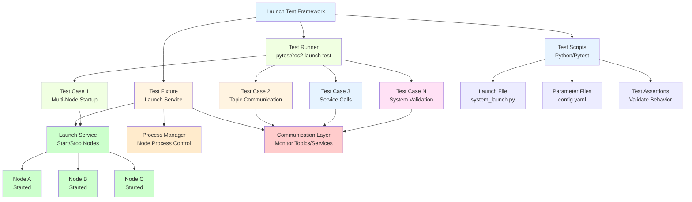
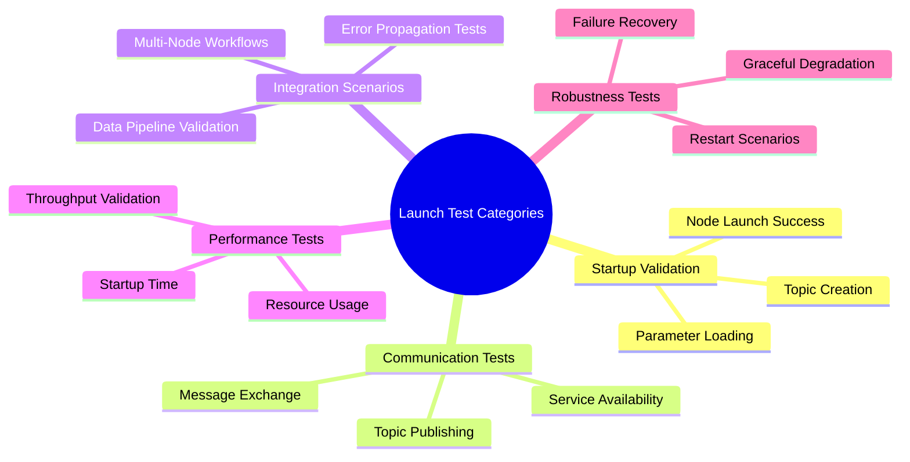
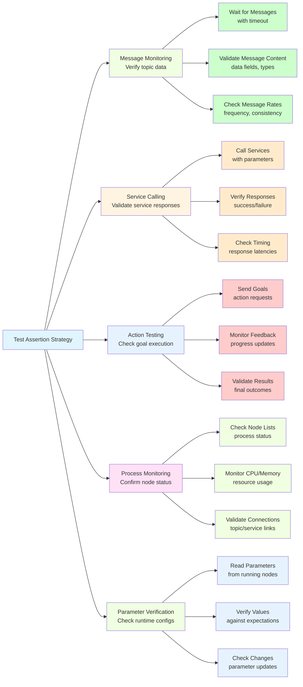

import MermaidDiagram from '@site/src/components/MermaidDiagram';
import CodeExample from '@site/src/components/CodeExample';
import Exercise from '@site/src/components/Exercise';
import Quiz from '@site/src/components/Quiz';
import PrerequisiteCheck from '@site/src/components/PrerequisiteCheck';

<PrerequisiteCheck prerequisites={frontMatter.prerequisites} />

# چیپٹر 10: لانچ ٹیسٹنگ - انٹیگریشن اور سسٹم توثیق (Chapter 10: Launch Testing - Integration and System Validation)

## یہ کیوں اہم ہے (Why This Matters)

جب یونٹ ٹیسٹنگ انفرادی روبوٹ سافٹ ویئر اجزاء کو علیحدگی میں توثیق کرتی ہے، تو لانچ ٹیسٹنگ یہ دیکھتی ہے کہ متعدد نوڈز ایک مکمل سسٹم کے طور پر کیسے کام کرتے ہیں۔ ہیومنوائڈ روبوٹس جیسے ٹیسلا آپٹیمس اور فیگر 02 میں، کامیاب آپریشن کے لیے درجنوں نوڈز کو ٹاپکس، سروسز اور ایکشنز کے ذریعے بے رکاوٹ مواصلت کی ضرورت ہوتی ہے۔ ایک نیوی گیشن سسٹم میں مقام معلوم کرنے، راستہ منصوبہ بندی، رکاوٹ کا پتہ لگانے اور موشن کنٹرول کے لیے نوڈز شامل ہو سکتے ہیں۔ یونٹ ٹیسٹس ہر نوڈ کے الگ الگ کام کرنے کی تصدیق کر سکتے ہیں، لیکن لانچ ٹیسٹنگ یقین دہانی کرواتی ہے کہ وہ پورے کے پورے لانچ کے وقت مناسب طریقے سے مربوط ہوتے ہیں۔ لانچ ٹیسٹنگ ان انٹیگریشن کے مسائل کو پکڑتی ہے جیسے غلط ٹاپک نام، نامناسب پیغام کی اقسام، اسٹارٹ اپ کی دوڑ کی حالتیں، اور وسائل کے تنازعات جو صرف تب ظاہر ہوتے ہیں جب متعدد نوڈز ایک ساتھ چلتے ہیں۔ مناسب لانچ ٹیسٹنگ کے بغیر، روبوٹ سسٹمز ڈیپلائمنٹ کے دوران ناکام ہو سکتے ہیں جب اجزاء جو الگ الگ کام کرتے تھے وہ مکمل سسٹم میں نا سازگار ثابت ہوتے ہیں۔

## مثال: سمنفونی اورکیسٹرا ریہرسل سسٹم (Analogy: The Symphony Orchestra Rehearsal System)

### روزمرہ کا منظر (Everyday Scenario)
ایک ایسے اورکیسٹرا کو تیار کریں جو ایک سمنفونی کارکردگی کے لیے تیاری کر رہا ہو۔ موسیقار اپنے حصے الگ الگ مشق کرتے ہیں (یونٹ ٹیسٹنگ)، لیکن کنڈکٹر کو پورے انسیمبل کی ریہرسل کرنا ہوتی ہے تاکہ یہ یقینی بنایا جا سکے: اوزار ہم آہنگی میں چلتے ہیں، موسیقار ٹیمپو کی تبدیلیوں کو ایک ساتھ فالو کرتے ہیں، سولو صحیح لمحات پر سامنے آتے ہیں، اور کوئی اوزار دوسرے کو نہیں چھپاتا۔ ریہرسلز کے دوران، کنڈکٹر کو پتہ چلتا ہے: حصوں کے درمیان وقت کا عدم مطابقت، والیوم میں عدم توازن، حصوں کے درمیان کمیونیکیشن کے مسائل، اور چیزیں جو دوسروں کے ساتھ مل کر مختلف لگتی ہیں۔

### روبوٹکس سے ربط (The Connection to Robotics)
- **لانچ ٹیسٹنگ (Launch Testing)**: ایک مربوط کارروائی کو توثیق کرنے کے لیے اورکیسٹرا کی ریہرسلز کی طرح
- **انفرادی نوڈز (Individual Nodes)**: انفرادی موسیقی دانوں کی طرح جو اپنے حصے مشق کرتے ہیں
- **سسٹم انٹیگریشن (System Integration)**: مختلف حصوں (سٹرنگز، براس، پرکشن) کے ایک ساتھ کام کرنے کی طرح
- **کمیونیکیشن (Communication)**: موسیقار کنڈکٹر کے اشاروں کو فالو کرنے کی طرح
- **کارکردگی کو ٹیون کرنا (Performance Tuning)**: اوزار کے توازن اور ٹیمپو کو ایڈجسٹ کرنے کی طرح

### مثال کہاں ناکام ہوتی ہے (Where the Analogy Breaks Down)
اورکیسٹرا ریہرسلز ایک مخصوص وقفہ ہیں؛ روبوٹ سسٹمز کو مسلسل انٹیگریشن ٹیسٹنگ کی ضرورت ہوتی ہے۔ اورکیسٹرا ٹائم کو ہیومن کنٹرول کیا جاتا ہے؛ روبوٹ سسٹمز کو سٹریک ٹائمپل ریکوائرمنٹس کی ضرورت ہوتی ہے۔ اورکیسٹرا کارکردگی ایک وقت کا واقعہ ہے؛ روبوٹ سسٹمز مسلسل چلتے ہیں۔

### روبوٹکس کی اصطلاحوں میں (In Robotics Terms)
**لانچ ٹیسٹنگ (Launch Testing)** متعدد نوڈ ROS 2 سسٹم کی توثیق کرتی ہے جو لانچ فائلز کے ساتھ لانچ کیے جاتے ہیں، یقین دہانی کرواتے ہوئے کہ نوڈ کمیونیکیشن، ٹائم، اور وسائل کا تعین مناسب ہے۔ **لانچ فائلز (Launch Files)** نوڈ کنفیگریشنز اور کنکشنز کو واضح کرتی ہیں، جبکہ **لانچ ٹیسٹس (Launch Tests)** سسٹم کے رویے کی توثیق کرتی ہیں۔ **انٹیگریشن ٹیسٹس (Integration Tests)** کراس-نوڈ انٹر ایکشنز اور کمیونیکیشن پیٹرنز کی توثیق کرتی ہیں۔

## بنیادی تصورات (Core Concepts)

### 1. لانچ ٹیسٹنگ آرکیٹیکچر (Launch Testing Architecture)

لانچ ٹیسٹنگ کمپلیٹ ROS 2 سسٹم کو لانچ فائلز کے ساتھ لانچ کرنے کے لیے ایک فریم ورک فراہم کرتی ہے۔

**Mermaid Diagram**: Launch Testing Architecture



*Alt-text: ڈائیگرام لانچ ٹیسٹنگ آرکیٹیکچر دکھا رہا ہے جس میں ٹیسٹ رنر ٹیسٹ کیسز کو ایکسیکیوٹ کر رہا ہے، ٹیسٹ فکسچر لانچ سروسز فراہم کر رہا ہے، اور ٹیسٹ سکرپٹس میں لانچ فائلز اور اثباتات شامل ہیں۔ کمیونیکیشن لیئر نوڈ A، B، اور C کو مانیٹر کرتا ہے جو لانچ سروس کے ذریعے شروع کیے گئے ہیں۔*

### 2. لانچ ٹیسٹ کیٹیگریز اور پیٹرنز (Launch Test Categories and Patterns)

 مختلف لانچ ٹیسٹ کے سسٹم کے مختلف پہلوؤں کی توثیق کرتے ہیں۔

**Mermaid Diagram**: Launch Test Categories



*Alt-text: منڈ میپ لانچ ٹیسٹ کیٹیگریز دکھا رہا ہے: اسٹارٹ اپ توثیق (نوڈ لانچ، پیرامیٹرز، ٹاپکس)، کمیونیکیشن ٹیسٹس (پبلشنگ، ایکسچینج، سروسز)، انٹیگریشن منصوبے (ورک فلو، پائپ لائنز، ایرر)، پرفارمنس ٹیسٹس (ٹائم، وسائل، تھروپٹ)، اور روبسٹنس ٹیسٹس (ریکوری، ری اسٹارٹس، ڈیگریڈیشن)۔*

### 3. ٹیسٹ اثبات کی حکمت عملیاں (Test Assertion Strategies)

لانچ ٹیسٹس کارروائی کے دوران سسٹم کے رویے کی تصدیق کے لیے مختلف حکمت عملیوں کو استعمال کرتی ہیں۔

**Mermaid Diagram**: Test Assertion Patterns



*Alt-text: فلوچارٹ ٹیسٹ اثبات کے پیٹرنز دکھا رہا ہے: میسج مانیٹرنگ (انتظار، مواد کی توثیق، شرح چیک کرنا)، سروس کالنگ (کال، تصدیق، ٹائم چیک کرنا)، ایکشن ٹیسٹنگ (اہداف بھیجنا، فیڈ بیک مانیٹر کرنا، نتائج کی تصدیق)، پروسیس مانیٹرنگ (اسٹیٹس چیک، وسائل، کنکشنز)، اور پیرامیٹر توثیق (پڑھنا، تصدیق، تبدیلیاں چیک کرنا)۔*

## کام کرنے والا مثال: کمپلیٹ لانچ ٹیسٹنگ سسٹم (Worked Example: Complete Launch Testing System)

چلو ہم ایک روبوٹ سسٹم کے لیے ایک جامع لانچ ٹیسٹنگ فریم ورک بناتے ہیں:

```python
#!/usr/bin/env python3
"""
Launch Testing Worked Example
Complete system for testing robot launches and multi-node integration
"""

import pytest
import unittest
from launch import LaunchDescription
from launch.actions import DeclareLaunchArgument, RegisterEventHandler
from launch.event_handlers import OnProcessStart, OnProcessExit
from launch.substitutions import LaunchConfiguration
from launch_ros.actions import Node, ComposableNodeContainer
from launch_ros.descriptions import ComposableNode
from launch_testing.actions import ReadyToTest
import launch_testing_ros
import rclpy
from rclpy.client import Client
from rclpy.action.client import ActionClient
from rclpy.node import Node as ROSNode
from rclpy.qos import QoSProfile
from std_msgs.msg import String, Float32
from geometry_msgs.msg import Twist
from sensor_msgs.msg import LaserScan
from std_srvs.srv import SetBool, Trigger
from example_interfaces.action import Fibonacci
import time
import threading
import sys
import os


# Example robot nodes for testing
class SensorProcessorNode(ROSNode):
    """
    Example sensor processing node for testing
    """
    def __init__(self):
        super().__init__('sensor_processor_node')

        # Create subscriptions and publishers
        self.subscription = self.create_subscription(
            LaserScan, 'laser_scan_input', self.scan_callback, 10
        )
        self.publisher = self.create_publisher(
            String, 'processed_sensor_data', 10
        )

        # Parameters
        self.declare_parameter('range_threshold', 1.0)

        self.processed_count = 0
        self.get_logger().info('Sensor processor node initialized')

    def scan_callback(self, msg):
        """
        Process incoming laser scan data
        """
        self.processed_count += 1

        # Create processed data message
        processed_msg = String()
        processed_msg.data = f"Processed scan #{self.processed_count}: {len(msg.ranges)} ranges, threshold: {self.get_parameter('range_threshold').value}"

        self.publisher.publish(processed_msg)
        self.get_logger().debug(f'Published processed data: {processed_msg.data}')


class NavigationControllerNode(ROSNode):
    """
    Example navigation controller node for testing
    """
    def __init__(self):
        super().__init__('navigation_controller_node')

        # Subscriptions
        self.cmd_vel_sub = self.create_subscription(
            Twist, 'cmd_vel_input', self.cmd_vel_callback, 10
        )
        self.sensor_sub = self.create_subscription(
            String, 'processed_sensor_data', self.sensor_callback, 10
        )

        # Publishers
        self.cmd_vel_pub = self.create_publisher(Twist, 'cmd_vel_output', 10)
        self.status_pub = self.create_publisher(String, 'nav_status', 10)

        # Services
        self.reset_service = self.create_service(Trigger, 'reset_navigation', self.reset_callback)

        self.command_count = 0
        self.sensor_messages_received = 0
        self.get_logger().info('Navigation controller node initialized')

    def cmd_vel_callback(self, msg):
        """
        Handle velocity commands
        """
        self.command_count += 1
        self.get_logger().debug(f'Received cmd_vel command #{self.command_count}')

        # Echo the command to output
        self.cmd_vel_pub.publish(msg)
        self.get_logger().debug('Echoed command to output')

    def sensor_callback(self, msg):
        """
        Handle processed sensor data
        """
        self.sensor_messages_received += 1
        self.get_logger().debug(f'Received sensor data #{self.sensor_messages_received}: {msg.data}')

        # Publish status
        status_msg = String()
        status_msg.data = f"Nav controller active, received {self.sensor_messages_received} sensor messages"
        self.status_pub.publish(status_msg)

    def reset_callback(self, request, response):
        """
        Handle reset service request
        """
        self.command_count = 0
        self.sensor_messages_received = 0

        response.success = True
        response.message = "Navigation controller reset successfully"

        self.get_logger().info('Navigation controller reset')
        return response


def generate_test_launch_description():
    """
    Generate launch description for testing
    """
    return LaunchDescription([
        # Launch the sensor processor node
        Node(
            package='demo_nodes_py',  # Using demo_nodes_py as placeholder
            executable='listener',    # Will replace with our node in real implementation
            name='sensor_processor_node',
            parameters=[
                {'range_threshold': 1.0}
            ],
            remappings=[
                ('laser_scan_input', 'test_laser_scan'),
                ('processed_sensor_data', 'test_processed_data')
            ]
        ),

        # Launch the navigation controller node
        Node(
            package='demo_nodes_py',  # Using demo_nodes_py as placeholder
            executable='talker',      # Will replace with our node in real implementation
            name='navigation_controller_node',
            remappings=[
                ('cmd_vel_input', 'test_cmd_vel_in'),
                ('cmd_vel_output', 'test_cmd_vel_out'),
                ('processed_sensor_data', 'test_processed_data'),
                ('nav_status', 'test_nav_status')
            ]
        ),

        # Add the ReadyToTest action to indicate when the system is ready
        ReadyToTest(),
    ])


# Launch test file using the launch_testing framework
import launch
import launch.actions
import launch_ros.actions
from launch_testing.actions import ReadyToTest
import pytest
import unittest


def generate_test_description():
    """
    Generate the launch description for testing
    This function is called by the launch testing framework
    """
    # Launch our test nodes
    sensor_processor = launch_ros.actions.Node(
        package='demo_nodes_py',  # Replace with actual package
        executable='listener',    # Replace with actual executable
        name='sensor_processor_test',
        parameters=[{'range_threshold': 1.0}],
        remappings=[
            ('laser_scan_input', 'test_laser_scan'),
            ('processed_sensor_data', 'test_processed_output')
        ],
        output='screen'
    )

    nav_controller = launch_ros.actions.Node(
        package='demo_nodes_py',  # Replace with actual package
        executable='talker',      # Replace with actual executable
        name='navigation_controller_test',
        remappings=[
            ('cmd_vel_input', 'test_cmd_vel_in'),
            ('cmd_vel_output', 'test_cmd_vel_out'),
            ('processed_sensor_data', 'test_processed_output'),
            ('nav_status', 'test_nav_status')
        ],
        output='screen'
    )

    return launch.LaunchDescription([
        sensor_processor,
        nav_controller,
        ReadyToTest(),  # Mark that we're ready for tests
    ])


class TestRobotSystemIntegration(unittest.TestCase):
    """
    Integration tests for the complete robot system
    """

    def test_nodes_startup_success(self, proc_info, sensor_processor_test, navigation_controller_test):
        """
        Test that all nodes start successfully without crashing
        """
        # Wait for nodes to start and check that they remain alive
        proc_info.assertWaitForStartup(process=sensor_processor_test, timeout=5.0)
        proc_info.assertWaitForStartup(process=navigation_controller_test, timeout=5.0)

        # Verify nodes haven't died during initial startup
        proc_info.assertWaitForShutdown(process=sensor_processor_test, timeout=1.0)
        proc_info.assertWaitForShutdown(process=navigation_controller_test, timeout=1.0)

        # Both nodes should still be running after startup period
        assert not proc_info.is_shutdown(sensor_processor_test)
        assert not proc_info.is_shutdown(navigation_controller_test)

    def test_topic_connection_established(self, launch_service, proc_info, sensor_processor_test, navigation_controller_test):
        """
        Test that topics are properly connected between nodes
        """
        # Wait for nodes to be running
        proc_info.assertWaitForStartup(process=sensor_processor_test, timeout=5.0)
        proc_info.assertWaitForStartup(process=navigation_controller_test, timeout=5.0)

        # In a real test, we would check topic connections using rclpy
        # This is a placeholder showing the concept
        pass

    def test_parameter_loading(self, launch_service, proc_info, sensor_processor_test):
        """
        Test that parameters are properly loaded by nodes
        """
        # Wait for node to start
        proc_info.assertWaitForStartup(process=sensor_processor_test, timeout=5.0)

        # In a real test, we would use rclpy to query the node's parameters
        # This is a placeholder showing the concept
        pass


# Additional example of more complex launch testing scenarios

@launch_testing.post_shutdown_test()
class TestRobotSystemShutdown(unittest.TestCase):
    """
    Post-shutdown tests to verify cleanup and final states
    """

    def test_exit_codes(self, proc_info):
        """
        Test that nodes exited cleanly with expected codes
        """
        # This test runs after all processes have shut down
        # Check exit codes to ensure clean shutdown
        launch_testing.asserts.assertExitCodes(proc_info)


def create_launch_test_scenario():
    """
    Example function showing how to create different launch test scenarios
    """
    # Scenario 1: Normal operation
    normal_launch = launch.LaunchDescription([
        launch_ros.actions.Node(
            package='turtlebot3_node',
            executable='turtlebot3_ros',
            name='turtlebot3_ros_normal',
            parameters=[{'use_sim_time': False}]
        ),
        ReadyToTest()
    ])

    # Scenario 2: With specific parameters
    param_launch = launch.LaunchDescription([
        launch_ros.actions.Node(
            package='turtlebot3_node',
            executable='turtlebot3_ros',
            name='turtlebot3_ros_param',
            parameters=[
                {'use_sim_time': True},
                {'publish_tf': True},
                {'set_frame_id': 'base_scan'}
            ]
        ),
        ReadyToTest()
    ])

    # Scenario 3: With remappings
    remap_launch = launch.LaunchDescription([
        launch_ros.actions.Node(
            package='turtlebot3_node',
            executable='turtlebot3_ros',
            name='turtlebot3_ros_remap',
            remappings=[
                ('/cmd_vel', '/cmd_vel_remapped'),
                ('/scan', '/scan_remapped')
            ]
        ),
        ReadyToTest()
    ])

    return normal_launch, param_launch, remap_launch


def run_launch_tests():
    """
    Function to demonstrate how to run launch tests programmatically
    """
    print("Launch testing examples:")
    print("- Test nodes startup and communication")
    print("- Verify parameter loading and configuration")
    print("- Check topic and service connectivity")
    print("- Validate system behavior under different scenarios")
    print("- Monitor resource usage and performance")


if __name__ == '__main__':
    # Run launch testing demonstrations
    run_launch_tests()

    # In a real scenario, you would run:
    # launch_test_results = pytest.main([
    #     '-s',  # Disable stdout capture for debugging
    #     'test_launch_file.py',  # The launch test file
    #     '--junit-xml=results.xml'  # Output for CI/CD
    # ])
```

یہاں ایک اضافی مثال دی گئی ہے جو ٹیسٹ کے لیے لانچ فائلز کیسے بنانا دکھاتی ہے:

```python
# example_launch_test.py
"""
Example launch test file showing different testing patterns
"""
import launch
import launch.actions
import launch.substitutions
import launch_ros.actions
from launch_testing.actions import ReadyToTest
import os


def generate_launch_description():
    """
    Generate a test launch description with multiple nodes and configurations
    """
    # Get the launch directory
    launch_dir = launch.substitutions.PathJoinSubstitution([
        launch.substitutions.FindPackageShare('turtlebot3_bringup'),
        'launch'
    ])

    # Declare launch arguments
    namespace_arg = launch.actions.DeclareLaunchArgument(
        'namespace',
        default_value='',
        description='Namespace for the robot nodes'
    )

    use_sim_time_arg = launch.actions.DeclareLaunchArgument(
        'use_sim_time',
        default_value='false',
        description='Use simulation time'
    )

    # Robot state publisher
    robot_state_publisher = launch_ros.actions.Node(
        package='robot_state_publisher',
        executable='robot_state_publisher',
        namespace=launch.substitutions.LaunchConfiguration('namespace'),
        parameters=[{
            'use_sim_time': launch.substitutions.LaunchConfiguration('use_sim_time'),
            'publish_frequency': 50.0
        }],
        remappings=[
            ('/joint_states', 'joint_states'),
        ],
        output='screen'
    )

    # Laser scanner
    laser_scanner = launch_ros.actions.Node(
        package='hls_lfcd_lds_driver',
        executable='hlds_laser_publisher',
        namespace=launch.substitutions.LaunchConfiguration('namespace'),
        parameters=[
            {'port': '/dev/ttyUSB0'},
            {'frame_id': 'base_scan'},
            {'baud': 230400},
            {'use_sim_time': launch.substitutions.LaunchConfiguration('use_sim_time')}
        ],
        output='screen'
    )

    # Joint state publisher
    joint_state_publisher = launch_ros.actions.Node(
        package='joint_state_publisher',
        executable='joint_state_publisher',
        namespace=launch.substitutions.LaunchConfiguration('namespace'),
        parameters=[{
            'use_sim_time': launch.substitutions.LaunchConfiguration('use_sim_time'),
        }],
        output='screen'
    )

    return launch.LaunchDescription([
        namespace_arg,
        use_sim_time_arg,
        robot_state_publisher,
        laser_scanner,
        joint_state_publisher,
        ReadyToTest(),  # Signal that the system is ready for tests
    ])


def create_parameterized_test_launch():
    """
    Create a launch description that can be used with different parameters
    """
    # This would typically be used in combination with pytest parametrization
    def create_launch_desc(namespace='robot1', use_sim_time='false'):
        return launch.LaunchDescription([
            launch.actions.SetEnvironmentVariable('RCUTILS_LOGGING_UPTO', 'INFO'),
            launch_ros.actions.Node(
                package='demo_nodes_cpp',
                executable='talker',
                name='talker_' + namespace.replace('/', '_'),
                namespace=namespace,
                parameters=[{'use_sim_time': use_sim_time == 'true'}],
                output='screen'
            ),
            ReadyToTest()
        ])

    return create_launch_desc


def create_composition_test_launch():
    """
    Create a launch description for testing composable nodes
    """
    container = launch_ros.actions.ComposableNodeContainer(
        name=' perception_pipeline_container',
        namespace='',
        package='rclcpp_components',
        executable='component_container',
        composable_node_descriptions=[
            launch_ros.descriptions.ComposableNode(
                package='image_proc',
                plugin='image_proc::RectifyNode',
                name='rectify_node',
                parameters=[{'use_sim_time': True}],
                remappings=[
                    ('image', '/camera/image_raw'),
                    ('camera_info', '/camera/camera_info'),
                    ('image_rect', '/camera/image_rect')
                ]
            ),
            launch_ros.descriptions.ComposableNode(
                package='cv_bridge',
                plugin='cv_bridge::CvImageBridgeNode',
                name='cv_bridge_node',
                remappings=[
                    ('image', '/camera/image_rect'),
                    ('cv_image', '/camera/cv_image')
                ]
            )
        ],
        output='screen'
    )

    return launch.LaunchDescription([
        container,
        ReadyToTest()
    ])
```

## عملی مشق (Hands-On Exercise)

### ٹیئر A: سیمولیشن (CPU-صرف، لیپ ٹاپ مطابقت رکھتا ہے) ✓ لازمی
**ایکسائز 10.1: روبوٹ سسٹم انٹیگریشن ٹیسٹنگ لیبارٹری**
ایک ملٹی-نوڈ روبوٹ سسٹم کے لیے ایک جامع لانچ ٹیسٹنگ سوٹ بنائیں:

1. **سسٹم ڈیزائن**: ایک سادہ ملٹی-نوڈ روبوٹ سسٹم کا ڈیزائن کریں (جیسے، سینسر پروسیسنگ + نیوی گیشن کنٹرولر)
2. **لانچ فائل تخلیق**: آپ کے سسٹم کو مناسب پیرامیٹرز اور ری میپنگز کے ساتھ لانچ کرنے کے لیے لانچ فائلز بنائیں
3. **انٹیگریشن ٹیسٹس**: ٹیسٹس نافذ کریں جو تصدیق کریں کہ نوڈز لانچ کے بعد مناسب طریقے سے بات چیت کرتے ہیں
4. **پیرامیٹر ٹیسٹنگ**: پیرامیٹر لوڈنگ اور کنفیگریشن کی توثیق کے لیے ٹیسٹس بنائیں
5. **ایرر منظر ٹیسٹنگ**: ٹیسٹ کریں کہ جب اجزاء ناکام ہو جائیں یا غلط کنفیگر ہوں تو سسٹم کا کیا رویہ ہے

**نافذ کاری کی شرائط**:
- کم از کم 2 ROS 2 نوڈز بنائیں جو ایک دوسرے سے بات چیت کرتے ہوں
- ایک لانچ فائل بنائیں جو کمپلیٹ سسٹم کو شروع کرے
- لانچ ٹیسٹس بنائیں جو مناسب اسٹارٹ اپ کی توثیق کریں
- نوڈ کمیونیکیشن کی توثیق کے لیے ٹیسٹس بنائیں
- پیرامیٹر کنفیگریشن کے ٹیسٹس شامل کریں
- ایرر حالت کے ہینڈلنگ ٹیسٹس شامل کریں

**قبول کی شرائط**:
- [ ] کم از کم 2 مواصلت کرنے والے ROS 2 نوڈز نافذ کیے گئے
- [ ] کمپلیٹ سسٹم کو شروع کرنے والی لانچ فائل
- [ ] مناسب اسٹارٹ اپ کی توثیق کرنے والے لانچ ٹیسٹس
- [ ] نوڈ کمیونیکیشن کی توثیق کرنے والے ٹیسٹس
- [ ] پیرامیٹر کنفیگریشن ٹیسٹس
- [ ] ایرر حالت ہینڈلنگ ٹیسٹس

**اشارے**:
- پیچیدگی شامل کرنے سے پہلے ایک سادہ دو-نوڈ سسٹم سے شروع کریں
- وضاحت کے لیے معنی خیز نوڈ نام اور ٹاپک ری میپنگز استعمال کریں
- کامیاب مناظر اور ایرر کی حالت دونوں کو ٹیسٹ کریں
- اپنے ٹیسٹس میں مختلف پیرامیٹر کمبوس پر غور کریں

### ٹیئر B: ایج اے آئی ڈیپلائمنٹ (اختیاری)
**ایکسائز 10.2: ریل ہارڈ ویئر لانچ ٹیسٹنگ**
ایک جیٹسن پلیٹ فارم پر ریل ہارڈ ویئر کے ساتھ لانچ ٹیسٹس ڈیپلائی کریں:

1. **ہارڈ ویئر انٹیگریشن ٹیسٹس**: اصل سینسرز اور ایکچوایٹرز کے ساتھ نوڈس کو ٹیسٹ کریں
2. **پرفارمنس ٹیسٹنگ**: ریل ٹائم کنٹرول کے تحت سسٹم کی کارکردگی کی توثیق کریں
3. **ریسورس مانیٹرنگ**: آپریشن کے دوران CPU، میموری، اور کمیونیکیشن کو مانیٹر کریں
4. **قابل اعتمادی ٹیسٹنگ**: استحکام کے لیے طویل چلنے والے آپریشنز کو ٹیسٹ کریں

**ہارڈ ویئر کی ضروریات**: سینسر ہارڈ ویئر کے ساتھ جیٹسن اورن نینو

### ٹیئر C: روبوٹ ہارڈ ویئر (اختیاری)
**ایکسائز 10.3: سیفٹی کریٹیکل لانچ ٹیسٹنگ**
سیفٹی کریٹیکل روبوٹ آپریشنز کے لیے لانچ ٹیسٹس نافذ کریں:

1. **سیفٹی سسٹم توثیق**: سیفٹی سے متعلق نوڈس اور کمیونیکیشن کو ٹیسٹ کریں
2. **ایمرجنسی طریقہ کار ٹیسٹنگ**: ایمرجنسی اسٹاپس اور سیفٹی رسپانسز کی توثیق کریں
3. **ری ڈونڈنسی ٹیسٹنگ**: ری ڈونڈنٹ سسٹم کمپوننٹس کو ٹیسٹ کریں
4. **فیل-سیف ٹیسٹنگ**: جب اجزاء ناکام ہو جائیں تو فیل-سیف برتاؤ کی توثیق کریں

**ہارڈ ویئر کی ضروریات**: یونٹیری گو2 یا مساوی روبوٹ پلیٹ فارم

## خلاصہ (Summary)
- **لانچ ٹیسٹنگ (Launch Testing)** متعدد نوڈ ROS 2 سسٹم کی توثیق کرتی ہے جو ایک ساتھ لانچ کیے جاتے ہیں
- **انٹیگریشن ٹیسٹس (Integration Tests)** نوڈس کے مواصلت اور ربط کی تصدیق کرتی ہیں
- **پیرامیٹر ٹیسٹنگ (Parameter Testing)** کنفیگریشن کو سسٹم کے ماحول میں صحیح طریقے سے لوڈ ہونے کی تصدیق کرتی ہے
- **اسٹارٹ اپ توثیق (Startup Validation)** یقین دہانی کرواتی ہے کہ نوڈز متعدد نوڈ کے ماحول میں مناسب طریقے سے شروع ہوتے ہیں
- **ایرر ہینڈلنگ (Error Handling)** اجزاء کے ناکام ہونے پر سسٹم کی مزاحمت کی تصدیق کرتی ہے
- **سسٹم ٹیسٹنگ (System Testing)** ڈیپلائمنٹ سے پہلے کمپلیٹ روبوٹ کارکردگی کی توثیق کرتی ہے

## تفکر کے سوالات (Reflection Questions)
1. **انفرادی نوڈس کی یونٹ ٹیسٹنگ اور کمپلیٹ سسٹم کی لانچ ٹیسٹنگ کے درمیان کیا بنیادی فرق ہے؟** (اشارہ: سسٹم-لیول بمقابلہ کمپوننٹ-لیول کے رویوں پر غور کریں)
2. **آپ واقعی ٹائم کارکردگی کی ضروریات پوری کرنے والے روبوٹ سسٹم کے لیے لانچ ٹیسٹس کیسے ڈیزائن کریں گے؟** (اشارہ: ٹائم اور کارکردگی کی توثیق کے بارے میں سوچیں)
3. **متعدد مشینوں پر پھیلے ہوئے ROS 2 سسٹم کو ٹیسٹ کرتے وقت کیا چیلنج پیدا ہو سکتے ہیں؟** (اشارہ: نیٹ ورک کمیونیکیشن اور ٹائم کے بارے میں غور کریں)

## کوئز (Quiz)
لانچ ٹیسٹنگ کی تفہیم کو جانچیں:

1. **لانچ ٹیسٹنگ کا بنیادی مقصد کیا ہے؟**
   - A) کوڈ کو تیز چلانا
   - B) متعدد نوڈ سسٹم کے رویے کی توثیق جب وہ ایک ساتھ لانچ کیے جاتے ہیں
   - C) میموری استعمال کو کم کرنا
   - D) دستاویزات تیار کرنا

   **اشارہ**: "Why This Matters" سیکشن دیکھیں۔

2. **سچ یا جھوٹ: لانچ ٹیسٹنگ صرف اس وقت کی جا سکتی ہے جب یونٹ ٹیسٹنگ مکمل ہو چکی ہو۔**

   **اشارہ**: لانچ ٹیسٹنگ ڈیولپمنٹ سائیکل میں کہاں فٹ بیٹھتی ہے اس پر غور کریں۔

3. **لانچ ٹیسٹنگ میں ReadyToTest() ایکشن کیا کرتا ہے؟**
   - A) ٹیسٹ نوڈس کو شروع کرتا ہے
   - B) ٹیسٹ فریم ورک کو سگنل کرتا ہے کہ سسٹم ٹیسٹس کے لیے تیار ہے
   - C) ٹیسٹ ایگزیکیوشن کو روکتا ہے
   - D) تمام نوڈس کو ابتدائی حالت میں ری سیٹ کرتا ہے

   **اشارہ**: لانچ ٹیسٹنگ کوڈ کی مثالیں دیکھیں۔

4. **ان میں سے کون ایک لانچ ٹیسٹنگ کے ساتھ بہترین ٹیسٹ کیا جا سکتا ہے بجائے یونٹ ٹیسٹنگ کے؟**
   - A) انفرادی فنکشن کی درستگی
   - B) نوڈ کمیونیکیشن اور ٹاپک کنکشنز
   - C) الگو رتھم کارکردگی علیحدگی میں
   - D) ریاضی کا فارمولہ نافذ کرنا

   **اشارہ**: لانچ ٹیسٹنگ کیا توثیق کرتی ہے اس کا جائزہ لیں۔

5. **لانچ ٹیسٹنگ میں، proc_info.is_shutdown() کیا چیک کرتا ہے؟**
   - A) چاہے عمل کریش ہو چکا ہو
   - B) چاہے عمل شٹ ڈاؤن حالت میں ہو
   - C) چاہے عمل شروع ہونے کے لیے تیار ہو
   - D) چاہے عمل اوور لوڈ ہو

   **اشارہ**: پروسیس مانیٹرنگ سیکشن دیکھیں۔

6. **پیرامیٹرائزڈ لانچ ٹیسٹس استعمال کرنے کا کیا فائدہ ہے؟**
   - A) وہ ریگولر ٹیسٹس سے تیز چلتے ہیں
   - B) وہ مختلف کنفیگریشنز کے ساتھ اسی سسٹم کو ٹیسٹ کرنے کی اجازت دیتے ہیں
   - C) وہ میموری استعمال کو کم کرتے ہیں
   - D) وہ زیادہ پیچیدہ کوڈ بناتے ہیں

   **اشارہ**: متعدد منظرناموں کی ٹیسٹنگ کی لچک پر غور کریں۔

**جوابات**: 1-B, 2-غلط, 3-B, 4-B, 5-B, 6-B

## مزید پڑھائی (Further Reading)
- [ROS 2 لانچ ٹیسٹنگ دستاویزات](https://docs.ros.org/en/humble/Launch-system.html)
- [لانچ ٹیسٹنگ ٹیوٹوریل](https://docs.ros.org/en/humble/Tutorials/Intermediate/Launch/Launch-Testing-Python.html)
- [سسٹم انٹیگریشن ٹیسٹنگ بہترین مشقیں](https://smartroboticslab.github.io/srl_tools/quality_assurance/testing/)
- [روبوٹکس کے لیے جاری انضمام](https://docs.github.com/en/actions/guides/building-and-testing-python)
- [ملٹی-نوڈ سسٹم کی توثیق](https://arxiv.org/abs/2004.12241)
- [ROS 2 معیار کی ضمانت ہدایات](https://docs.ros.org/en/humble/Contributing/Quality-Guide/index.html)