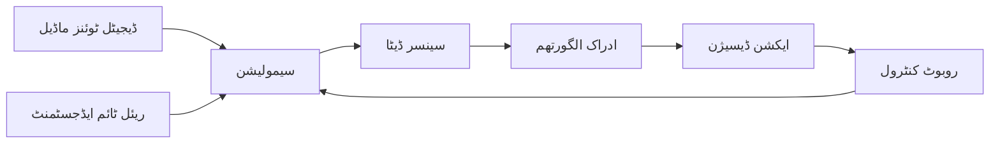

import MermaidDiagram from '@site/src/components/MermaidDiagram';
import CodeExample from '@site/src/components/CodeExample';
import Exercise from '@site/src/components/Exercise';
import Quiz from '@site/src/components/Quiz';
import PrerequisiteCheck from '@site/src/components/PrerequisiteCheck';

# باب 11: ڈیجیٹل ٹوئنز اور سیمولیشن

<PrerequisiteCheck prerequisites={[
  "ماڈیول 1 مکمل (ROS 2 کی بنیاد، URDF کی بنیاد، tf2 ٹرانسفارمز)",
  "ROS 2 لانچ فائلز اور پیکجز کو سمجھنا",
  "بیسک لینکس ٹرمنل کمانڈز اور فائل نیویگیشن"
]} />

## یہ کیوں اہم ہے

تصور کریں کہ آپ بوئنگ 787 ڈریملینر کو ڈیزائن کر رہے ہیں۔ آپ 50 جسمانی نمونے بنانے کی قیمت اٹھا نہیں سکتے تاکہ پروں کا دباؤ، انجن کی ناکامی، اور ہنگامی لینڈنگ کی جانچ کی جا سکے— ہر طیارے کی قیمت 250 ملین ڈالر ہے۔ بجائے اس کے، انجینئرز ڈیجیٹل ٹوئنز میں **ملینوں سیمولیشن** چلاتے ہیں: ورچوئل نقل جو حقیقی طیارے کی فزکس کو دیکھتی ہے۔ وہ انتہائی منظرنامے (پرندوں کے حملے، ہائیڈرولک ناکامی، بجلی کے حملے) محفوظ، سستی، اور متوازی طور پر ٹیسٹ کرتے ہیں۔

**روبوٹکس اسی چیلنج کا سامنا کرتا ہے**۔ ایک یونیٹری جی1 ہیومنوائڈ کی قیمت $16,000+ ہے۔ اسے گرنے کی بازیابی کی جانچ کے لیے گرنا موتروں کو تباہ کر دیتا ہے۔ 50 روبوٹس کے ساتھ ایک گودام جو ایک ساتھ نیویگیٹ کر رہے ہیں، اس کا یونیورسٹی لیب میں نمونہ تیار کرنا ناممکن ہے۔ **ڈیجیٹل ٹوئنز اس کا حل فراہم کرتے ہیں**: آپ ایک ورچوئل گودام تیار کرتے ہیں، 50 سیمولیٹیڈ روبوٹس کو سپاون کرتے ہیں، ٹکراؤ سے بچنے کے الگورتھم کی جانچ کرتے ہیں، خامیوں کو تلاش کرتے ہیں، اور مکرر کام کرتے ہیں— سب کچھ اس سے پہلے کہ حقیقی ہارڈ ویئر کو چھوا جائے۔

کمپنیاں جیسے **ٹیسلا** روزانہ ہزاروں سیمولیٹیڈ کاموں کے ذریعے ہیومنوائڈ روبوٹس (آپٹیمس) کو چلاتی ہیں۔ **ویمو** خودکار ڈرائیونگ کاروں کو ورچوئل شہروں میں ٹیسٹ کرتا ہے جہاں موسم اور پیدل چلنے والوں کے رویے کو بے ترتیب طور پر تبدیل کیا جاتا ہے۔ **بوسٹن ڈائی نیمکس** اصل ہارڈ ویئر پر بیک فلپس کی کوشش کرنے سے پہلے فزکس انجن میں ایٹلس کے پارکور کے حرکات کی توثیق کرتا ہے۔

یہ باب آپ کو **گیزبو** میں ڈیجیٹل ٹوئنز تیار کرنا سکھاتا ہے، صنعت کا معیاری روبوٹ سیمولیٹر، جو آپ کو خطرہ سے، تیزی سے، اور سستی میں الگورتھم ترقی دینے اور ٹیسٹ کرنے کے قابل بناتا ہے۔

---

## مثلاً: پائلٹ تربیت کے لیے فلائٹ سیمولیٹر

**ریل ورلڈ سینریو**:

فکر کریں کہ آپ ایک نئے طیارہ ڈرائیور کو دیکھ رہے ہیں جو ایک ایمرجنسی کے دوران کس طرح عمل کرتا ہے— انجن ناکامی، بادلوں میں کم دیکھنا، سخت ہوائیں۔

**سیمولیشن ورژن**:

سیمولیٹر اس کو 100 مختلف ایمرجنسی سیٹ اپس میں تربیت دیتا ہے جبکہ کوئی جان نقصان نہیں ہوتا۔ اس سے گھنٹوں کے تجربے کو دن میں پیک کیا جا سکتا ہے۔

**کیا سیکھا گیا**:

- پائلٹ تیزی سے نشانہ لگانے کے لیے مختلف حکمت عملیاں سیکھتے ہیں
- ہنگامی طور پر ایک دوسرے کے ساتھ موثر طریقے سے بات چیت کرتے ہیں
- ایک ہی واقعہ کے متعدد ورژن دیکھنے سے سیکھتے ہیں

**روبوٹکس ایپلی کیشن**:

- روبوٹ کو متعدد نیویگیشن چیلنجز کی تربیت دیں جبکہ کوئی جسمانی نقصان نہیں ہوتا
- متعدد رکاوٹوں، نقل و حمل کے پیٹرنز، اور ہنگامی حالات کی جانچ کریں
- تیز تربیت کے ذریعے ڈیٹا کے ٹکڑوں کو بڑھانا اور کم از کم کھوکھلاپن حاصل کرنا

---

## ڈیجیٹل ٹوئنز کیا ہیں؟

**ڈیجیٹل ٹوئنز** کمپیوٹر ماڈلز ہیں جو جسمانی اثاثوں کے مکمل نقل کے طور پر کام کرتے ہیں:

| عناصر | ڈیجیٹل ٹوئنز | حقیقی روبوٹ |
|--------|----------------|----------------|
| فزکل ماڈل | 3D میش، URDF/SDFormat | میٹل، پلاسٹک، الیکٹرانکس |
| سینسر ڈیٹا | سیمولیٹیڈ کیمرہ، لیزر، IMU | اصلی کیمرہ، لیزر، IMU |
| ماحول | ورچوئل ورلڈ (SDF فائلز) | کمرہ، گودام، گلی |
| رفتار | 10x تیز (یا ریل ٹائم) | ہمیشہ 1x |
| ٹیسٹ کی قیمت | $0.00 | $0.00 سے $1000+ تک |

**چیف کا مثالی سیٹ اپ**:



### ٹوئنز کا ڈیٹا سٹرکچر

```yaml
digital_twin:
  physical_asset:
    type: "humanoid_robot"
    model: "Unitree G1"
    dimensions: [1.2m, 0.6m, 0.8m]
    weight: 39.9kg
    sensors:
      - type: "lidar"
        position: [0.3, 0.0, 0.8]
        range: 25m
      - type: "camera"
        position: [0.35, 0.0, 0.9]
        resolution: [1920, 1080]

  simulation_properties:
    physics:
      gravity: [0, 0, -9.81]
      real_time_factor: 1.0
      solver_type: "quick"
    environment:
      name: "warehouse_sim"
      objects: ["box", "table", "person"]
      lighting: "realistic"

  synchronization:
    frequency: 50Hz
    data_stream: ["sensor_data", "control_commands"]
```

---

## کلیدی فوائد

1. **خرچہ کم کرنا**: ہر ٹیسٹ کی کوئی قیمت نہیں ہوتی
2. **جیو فائدہ**: خطرناک منظرناموں کو محفوظ طور پر ٹیسٹ کریں
3. **تیز ٹیسٹنگ**: متعدد سیمولیشنز کو متوازی طور پر چلائیں
4. **تکرار میں تیزی**: خامیوں کی تلاش اور ٹھیک کرنا

---

## چیلنجز اور محدودیاں

- **فیڈلٹی ٹریڈ آف**: تیز رفتار سیمولیشن کم درستگی کے ساتھ آتی ہے
- **سیم2ریئل گیپ**: کچھ چیزیں سیمولیشن میں اچھی طرح نہیں ماڈل کی جا سکتیں
- **سیمولیشن جھوٹ**: ماڈل کی اہم خصوصیات کو نظرانداز کر سکتا ہے

---

## عملی مشق

<Exercise
  id="ex-11-1-warehouse-maze"
  title="گودام میز کا ماحول بنائیں"
  difficulty="intermediate"
  chapterReference="11.1"
  variants={[
    {
      tier: "A",
      description: "ایک گیزبو گودام کی دنیا تیار کریں جس میں متعدد الماریاں ہوں جو ایک میز کی تشکیل دیں، ٹرٹل بٹ 3 کو سپاون کریں، اور RViz میں LiDAR کی وضاحت کریں۔",
      setup: `
**ضروریات**:
- ROS 2 ہمبل انسٹال شدہ
- گیزبو انسٹال شدہ (\`sudo apt install ros-humble-gazebo-ros-pkgs\`)
- ٹرٹل بٹ 3 پیکجز: \`sudo apt install ros-humble-turtlebot3*\`

**پروجیکٹ سیٹ اپ**:
\`\`\`bash
mkdir -p ~/ros2_ws/src/warehouse_sim
cd ~/ros2_ws/src/warehouse_sim
mkdir worlds launch
\`\`\`
      `,
      code: `
# قدم 1: worlds/ ڈائریکٹری میں warehouse_maze.sdf تیار کریں
# (اوپر کے warehouse.sdf مثال کے طور پر ٹیمپلیٹ استعمال کریں)
# میز کی تشکیل کے لیے 4-6 الماریاں شامل کریں

# تقاضے:
# - کم از کم 4 الماریاں جو گلیوں کی تشکیل دیں
# - میز کے اختتام پر ایک "گول زون" (رنگین باکس کے ساتھ نشان زد کردہ)
# - فریکشن کوائف 100 (چسپاں سطح) کے ساتھ زمین کا ہدف

# قدم 2: لانچ فائل تیار کریں: launch/warehouse_sim.launch.py

#!/usr/bin/env python3
from launch import LaunchDescription
from launch.actions import IncludeLaunchDescription
from launch.launch_description_sources import PythonLaunchDescriptionSource
from launch_ros.actions import Node
from ament_index_python.packages import get_package_share_directory
import os

def generate_launch_description():
    # گیزبو کو گودام کی دنیا کے ساتھ لانچ کریں
    gazebo = IncludeLaunchDescription(
        PythonLaunchDescriptionSource([
            os.path.join(get_package_share_directory('gazebo_ros'), 'launch', 'gazebo.launch.py')
        ]),
        launch_arguments={
            'world': os.path.join(get_package_share_directory('warehouse_sim'), 'worlds', 'warehouse_maze.sdf')
        }.items()
    )

    # ٹرٹل بٹ 3 کو سپاون کریں
    spawn_robot = Node(
        package='gazebo_ros',
        executable='spawn_entity.py',
        arguments=[
            '-entity', 'turtlebot3',
            '-file', '/opt/ros/humble/share/turtlebot3_gazebo/models/turtlebot3_waffle/model.sdf',
            '-x', '0.0',
            '-y', '0.0',
            '-z', '0.1'
        ]
    )

    return LaunchDescription([
        gazebo,
        spawn_robot
    ])

# قدم 3: بلڈ اور لانچ کریں
# cd ~/ros2_ws
# colcon build --packages-select warehouse_sim
# source install/setup.bash
# ros2 launch warehouse_sim warehouse_sim.launch.py
      `,
      acceptanceCriteria: [
        "گیزبو میں گودام کی دنیا لوڈ ہوتی ہے جس میں کم از کم 4 الماریاں گلیوں کی تشکیل دیتی ہیں",
        "ٹرٹل بٹ 3 اصل میں (0، 0، 0.1) پر بغیر تصادم کے سپاون ہوتا ہے",
        "LiDAR ٹاپک / اسکین سینسر_msgs/LaserScan پیغامات 10 Hz پر شائع کرتا ہے (تصدیق کریں `ros2 topic hz /scan`)",
        "RViz لیزر اسکین ڈیٹا کو ظاہر کرتا ہے جو الماریوں کے انکشافات کو دکھاتا ہے",
        "گودام کے اختتام پر گول زون (رنگین باکس) گیزبو میں نظر آتا ہے",
        "ریئل ٹائم فیکٹر (RTF) >= 0.8 ہے (سیمولیشن مناسب رفتار پر چلتا ہے)"
      ],
      solution: `
**حل کی دنیا کی فائل** (\`warehouse_maze.sdf\`):

4 الماریاں ایک میز کے طور پر شامل کریں:
- الماری 1: \`<pose>3 0 1 0 0 0</pose>\` (براہ راست راستہ بند)
- الماری 2: \`<pose>3 3 1 0 0 0</pose>\` (متوازی گلی)
- الماری 3: \`<pose>6 1.5 1 0 0 1.57</pose>\` (عمودی، 90° گھوما ہوا)
- الماری 4: \`<pose>9 0 1 0 0 0</pose>\` (آخری گلی)
- گول زون: سبز باکس \`<pose>12 1.5 0.5 0 0 0</pose>\` پر

**LiDAR کی جانچ**:
\`\`\`bash
# لانچ کے بعد علیحدہ ٹرمنل میں
ros2 topic echo /scan --once
# 360 رینج کے پیمائشات دکھائی دینی چاہئیں جن کی قیمت 0.1-10m ہے
\`\`\`

**RViz کنفیگریشن**:
1. شامل کریں → لیزر اسکین → ٹاپک: / اسکین
2. سائز: 0.05 (نقاط نظر میں آئیں گے)
3. رنگ: شدت یا رینج کے مطابق
4. الماری کی دیواریں نقاط کے مجموعہ کے طور پر دیکھیں
      `
    }
  ]}
/>

**بونس چیلنج**: ٹیلی اسکوپ کا استعمال کرتے ہوئے میز کے ذریعے روبوٹ کو دستی طور پر چلائیں:
\`\`\`bash
ros2 run turtlebot3_teleop teleop_keyboard
\`\`\`

---
