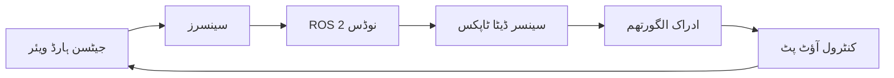

import MermaidDiagram from '@site/src/components/MermaidDiagram';
import CodeExample from '@site/src/components/CodeExample';
import Exercise from '@site/src/components/Exercise';
import Quiz from '@site/src/components/Quiz';
import TierBadge from '@site/src/components/TierBadge';

# ٹیئر بی ایکسٹینشن: جیٹسن پر حقیقی سینسر انضمام

<TierBadge tiers={["B"]} />

## یہ کیوں اہم ہے

ریل ورلڈ روبوٹکس کو ماحولیاتی ادراک کی صلاحیتوں فراہم کرنے والے جسمانی سینسرز کے ساتھ انضمام کی ضرورت ہوتی ہے۔ ان ماحول کے مقابلے جہاں سینسرز کو بطور مکمل ماڈل کیا جاتا ہے، حقیقی سینسرز میں نوائز، کیلیبریشن کی ضرورت، اور وسائل کی حدود ہوتی ہیں۔ NVIDIA جیٹسن پلیٹ فارم سیمولیشن اور حقیقت کے درمیان پُل کا کام کرتا ہے جو سینسر ڈیٹا کے لیے GPU-ایکسلریٹڈ پروسیسنگ فراہم کرتا ہے جبکہ معقول طاقت کی کھپت برقرار رکھتا ہے۔

**ریل ورلڈ ایپلی کیشنز**:

- **خودکار گاڑیاں**: نیویگیشن کے لیے لیڈار، کیمرہ، اور IMU فیوژن
- **گودام کی خودکار کاری**: اسٹاک ٹریکنگ کے لیے ملٹی-سینسر ادراک
- **زراعت روبوٹکس**: فصل کی نگرانی کے لیے ماحولیاتی سینسرز
- **تلاش اور بچاؤ**: GPS-سے-مکمل طور پر محروم ماحول میں ملٹی-موڈل سینسر فیوژن

:::danger ہارڈ ویئر کی حفاظت
کسی بھی سینسر کو جیٹسن سے منسلک کرنے سے پہلے:
- درست وولٹیج لیول کی تصدیق کریں (3.3V بمقابلہ 5V لا جک لیولز)
- چیک کریں کہ طاقت کی کھپت جیٹسن کیریئر بورڈ کی حدود سے تجاوز نہ کرے
- برقی نقصان سے بچنے کے لیے مناسب گراؤنڈنگ کو یقینی بنائیں
- ہنگامی طاقت-بندی کا طریقہ کار تیار رکھیں
:::

---

## کلیدی سینسر ٹائپس

### 1. بصری سینسرز

- **RGB کیمرے**: رنگ کی تصاویر کے لیے
- **ڈیپتھ کیمرے**: فاصلہ کے لیے (RGB-D)
- **تھرمل کیمرے**: ہیٹ میپس کے لیے

### 2. 3D سینسرز

- **لیڈار**: 3D میپنگ کے لیے
- **سٹیریو کیمرے**: 3D دیکھنے کے لیے
- **ToF سینسرز**: ٹائم آف فلائٹ ڈیپتھ سینسرز

### 3. انسانی جسم کے سینسرز

- **IMU**: جہت اور تیزی کے لیے
- **جیرو سکوپ**: گھومنے کے لیے
- **اکسیلیرومیٹر**: تیزی کے لیے



---

## جیٹسن سیٹ اپ

### ہارڈ ویئر منسلکات

```bash
# جیٹسن پر سینسرز کی شناخت
ls /dev/ttyUSB*  # سیریل سینسرز کے لیے
ls /dev/video*   # ویڈیو سینسرز کے لیے
lsusb            # USB سینسرز کے لیے
```

### ROS 2 سیٹ اپ

```python
#!/usr/bin/env python3
# جیٹسن پر سینسر ڈیٹا کو شائع کرنے کے لیے ROS 2 نوڈ
import rclpy
from rclpy.node import Node
from sensor_msgs.msg import Image, Imu, LaserScan
import cv2
from cv_bridge import CvBridge

class JetsonSensorPublisher(Node):
    def __init__(self):
        super().__init__('jetson_sensor_publisher')

        # پبلیشرز تیار کریں
        self.image_publisher = self.create_publisher(Image, '/camera/image_raw', 10)
        self.imu_publisher = self.create_publisher(Imu, '/imu/data', 10)
        self.scan_publisher = self.create_publisher(LaserScan, '/scan', 10)

        # کیمرہ کو شروع کریں
        self.cap = cv2.VideoCapture(0)
        self.bridge = CvBridge()

        # ٹائمر تیار کریں
        self.timer = self.create_timer(0.1, self.publish_sensor_data)  # 10 Hz

    def publish_sensor_data(self):
        # کیمرہ ڈیٹا کو پبلش کریں
        ret, frame = self.cap.read()
        if ret:
            image_msg = self.bridge.cv2_to_imgmsg(frame, encoding='bgr8')
            image_msg.header.stamp = self.get_clock().now().to_msg()
            image_msg.header.frame_id = 'camera_link'
            self.image_publisher.publish(image_msg)

        # IMU ڈیٹا کو پبلش کریں (مثال کے طور پر)
        imu_msg = Imu()
        imu_msg.header.stamp = self.get_clock().now().to_msg()
        imu_msg.header.frame_id = 'imu_link'
        # IMU ڈیٹا کو اصل سینسر سے حاصل کریں
        self.imu_publisher.publish(imu_msg)

        self.get_logger().info('سینسر ڈیٹا پبلش کیا گیا')

def main(args=None):
    rclpy.init(args=args)
    sensor_publisher = JetsonSensorPublisher()
    rclpy.spin(sensor_publisher)
    sensor_publisher.destroy_node()
    rclpy.shutdown()

if __name__ == '__main__':
    main()
```

---

## سینسر کیلیبریشن

### کیمرہ کیلیبریشن

```python
# کیمرہ کیلیبریشن کے لیے کوڈ
import cv2
import numpy as np

def calibrate_camera():
    """کیمرہ کیلیبریشن کریں"""

    # چیس بورڈ کی پیمائش
    chessboard_size = (9, 6)
    square_size = 0.025  # 2.5 cm

    # کیمرہ کیلیبریشن کے لیے متغیرات
    criteria = (cv2.TERM_CRITERIA_EPS + cv2.TERM_CRITERIA_MAX_ITER, 30, 0.001)
    obj_points = []  # 3D points in real world space
    img_points = []  # 2D points in image plane

    # کیمرہ کو شروع کریں
    cap = cv2.VideoCapture(0)

    while True:
        ret, frame = cap.read()
        if not ret:
            break

        gray = cv2.cvtColor(frame, cv2.COLOR_BGR2GRAY)

        # چیس بورڈ کورنرز تلاش کریں
        ret, corners = cv2.findChessboardCorners(gray, chessboard_size, None)

        if ret:
            # کورنرز کو بہتر بنائیں
            corners2 = cv2.cornerSubPix(
                gray, corners, (11, 11), (-1, -1), criteria
            )

            # تصویر لے کر نقاط کو محفوظ کریں
            objp = np.zeros((chessboard_size[0] * chessboard_size[1], 3), np.float32)
            objp[:, :2] = np.mgrid[0:chessboard_size[0], 0:chessboard_size[1]].T.reshape(-1, 2) * square_size

            obj_points.append(objp)
            img_points.append(corners2)

            # کورنرز دکھائیں
            cv2.drawChessboardCorners(frame, chessboard_size, corners2, ret)

        cv2.imshow('کیمرہ کیلیبریشن', frame)
        if cv2.waitKey(1) & 0xFF == ord('q'):
            break

    cap.release()
    cv2.destroyAllWindows()

    # کیمرہ کیلیبریشن کریں
    if len(obj_points) > 0:
        ret, mtx, dist, rvecs, tvecs = cv2.calibrateCamera(
            obj_points, img_points, gray.shape[::-1], None, None
        )

        print("کیمرہ کیلیبریشن میٹرکس:")
        print(mtx)
        print("کیمرہ کیلیبریشن کی تفصیل:")
        print(dist)

        return mtx, dist
    else:
        print("کیلیبریشن کے لیے کافی نقاط نہیں ملے")
        return None, None
```

---

## ایج کمپیوٹنگ کے لیے بہتر بنانا

### ڈیٹا کم کرنا

```python
# Jetson کے لیے ڈیٹا کم کرنے کے لیے کوڈ
def optimize_sensor_data():
    """Jetson کے لیے سینسر ڈیٹا کو بہتر بنائیں"""

    optimization_settings = {
        "image_resolution": (640, 480),  # Jetson کے لیے مناسب
        "frame_rate": 15,  # Jetson کے لیے مناسب
        "data_compression": "jpeg",  # ڈیٹا کم کرنے کے لیے
        "processing_frequency": 10,  # ہر 100ms پر پروسیسنگ
    }

    print("Jetson کے لیے سینسر ڈیٹا کو بہتر بنایا گیا")
```

### Jetson کے لیے سیٹنگز

```bash
# Jetson کے لیے کارکردگی کو بہتر بنانے کے لیے
sudo nvpmodel -m 0  # ماڈل 0 (اعلی کارکردگی)
sudo jetson_clocks  # تمام کلاکس کو زیادہ سے زیادہ پر سیٹ کریں
```

---

## سینسر فیوژن

```python
# Jetson پر سینسر فیوژن کے لیے کوڈ
import numpy as np
from scipy.spatial.transform import Rotation as R

class SensorFusion:
    def __init__(self):
        self.imu_data = None
        self.camera_data = None
        self.lidar_data = None

    def fuse_imu_camera(self, imu_msg, camera_msg):
        """IMU اور کیمرہ ڈیٹا کو ضم کریں"""

        # IMU سے جہت حاصل کریں
        orientation = [
            imu_msg.orientation.x,
            imu_msg.orientation.y,
            imu_msg.orientation.z,
            imu_msg.orientation.w
        ]

        # کیمرہ ڈیٹا کو IMU جہت کے ساتھ ضم کریں
        rotation = R.from_quat(orientation)

        # ضم شدہ ڈیٹا واپس کریں
        fused_data = {
            'orientation': rotation.as_euler('xyz'),
            'image_features': self.extract_features(camera_msg),
            'timestamp': imu_msg.header.stamp
        }

        return fused_data

    def extract_features(self, image_msg):
        """تصویر سے خصوصیات نکالیں"""
        # OpenCV کا استعمال کرتے ہوئے خصوصیات نکالیں
        pass
```

---

## مشق

**سینسر کی منصوبہ بندی**: Jetson AGX Xavier پر ایک نیویگیشن سسٹم کے لیے سینسر کی منصوبہ بندی کریں:

1. **کیمرہ**: RGB-D کیمرہ (ZED یا RealSense)
2. **لیڈار**: 2D لیڈار (RPLIDAR A1)
3. **IMU**: Bosch BNO055
4. **GPS**: U-blox NEO-6M (اگر ضرورت ہو)

<Quiz
  title="جیٹسن پر سینسر انضمام"
  questions={[
    {
      question: "Jetson پر سینسر کیلیبریشن کیوں ضروری ہے؟",
      options: ["سینسر کو چلانے کے لیے", "سینسر ڈیٹا کی درستگی کے لیے", "سینسر کو انسٹال کرنے کے لیے", "کوڈ کو لکھنے کے لیے"],
      answer: 1,
      explanation: "سینسر کیلیبریشن سینسر ڈیٹا کی درستگی کے لیے ضروری ہے"
    },
    {
      question: "NVIDIA Jetson کا کون سا ماڈل اعلی کارکردگی کے لیے سب سے زیادہ مناسب ہے؟",
      options: ["Nano", "TX2", "AGX Xavier", "Orin"],
      answer: 3,
      explanation: "AGX Xavier اور Orin اعلی کارکردگی کے لیے سب سے مناسب ہیں"
    }
  ]}
/>