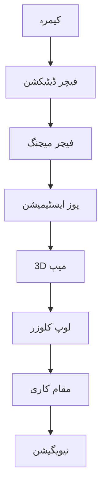

import MermaidDiagram from '@site/src/components/MermaidDiagram';
import Exercise from '@site/src/components/Exercise';
import Quiz from '@site/src/components/Quiz';
import PrerequisiteCheck from '@site/src/components/PrerequisiteCheck';  

# باب 21: VSLAM اور ORB-SLAM

## تعارف

بصری SLAM (VSLAM) روبوٹکس میپنگ اور مقام کاری میں ایک اہم ترقی کی نمائندگی کرتا ہے، جو صرف کیمرے کا استعمال کرتے ہوئے میپس تیار کرتا ہے اور روبوٹ کی پوزیشن کا تعین کرتا ہے۔ ORB-SLAM، سب سے کامیاب VSLAM نفاذ میں سے ایک، اورینٹیڈ FAST اور روٹیٹڈ BRIEF (ORB) فیچرز کا استعمال کرتا ہے تاکہ مونوکولر، اسٹیریو، اور RGB-D کیمرے کے ساتھ ریل ٹائم کارکردگی حاصل کی جا سکے۔ یہ باب بصری SLAM سسٹم کے اصول، آرکیٹیکچر، اور عملی نفاذ کا جائزہ لیتا ہے، ORB-SLAM اور اس کے متغیرات پر توجہ مرکز کرتے ہوئے۔

## سیکھنے کے اہداف

اس باب کے اختتام تک، آپ کو اس بات کا اہل ہو جانا چاہیے:

- بصری SLAM کے اصول اور دیگر ایپروچز پر اس کے فوائد کو سمجھنا
- ORB-SLAM کے آرکیٹیکچر اور اس کے تین متوازی تھریڈز کی وضاحت کرنا
- مختلف کیمرہ اقسام کے لیے ORB-SLAM نافذ کرنا اور تشکیل دینا
- بصری SLAM کارکردگی کا جائزہ لینا اور عام چیلنجز کو سنبھالنا
- مختلف ایپلی کیشنز کے لیے بصری SLAM ایپروچز کا موازنہ کرنا

## شرائطِ لازمہ

اس باب کا آغاز کرنے سے پہلے، یقین کر لیں کہ آپ کے پاس ہے:

- ماڈیول 1 مکمل (ROS 2 کی بنیاد، TF2)
- ماڈیول 3 باب 18 (SLAM کی بنیاد)
- کمپیوٹر وژن اور فیچر ڈیٹیکشن کی بنیادی سمجھ
- کیمرہ کیلیبریشن اور امیج پروسیسنگ کا تجربہ
- 3D جیومیٹری اور پروجیکشن ماڈلز کا علم

## حقیقی دنیا کی مثلاً: کیمرہ-بیسڈ مسافر

بصری SLAM کو اس طرح سمجھیں جیسے ایک شخص صرف اپنی آنکھوں اور یادداشت کا استعمال کرتے ہوئے ایک علاقہ کو تلاش کر رہا ہو۔ جس طرح ایک شخص نیویگیٹ کرنے اور ذہنی نقشہ بنانے کے لیے منفرد عمارتیں، نشانیاں، یا معماری کی خصوصیات جیسی ممتاز بصری نشانیوں کو یاد کرتا ہے، بصری SLAM سسٹم ممتاز بصری فیچرز کو یاد کرتے ہیں تاکہ حرکت کو ٹریک کریں اور میپس تیار کریں۔ سسٹم مختلف نقطہ نظر سے آشنا جگہوں کو پہچان سکتا ہے، یہاں تک کہ جب روبوٹ انہیں مختلف زاویوں سے پہنچے، جو لیزر-صرف سسٹم کو الجھن میں ڈال دے گا۔

## بنیادی تصورات

### 1. بصری SLAM کی بنیاد

بصری SLAM سسٹم صرف کیمرہ کی تصاویر کا استعمال کرتے ہوئے SLAM مسئلہ حل کرتے ہیں:

- **فیچر ڈیٹیکشن**: تصاویر سے ممتاز نقاط نکالنا (کونر، ایج)
- **فیچر میچنگ**: فریموں کے درمیں فیچرز میچ کرنا تاکہ حرکت کا تخمینہ لگایا جا سکے
- **پوز ایسٹیمیشن**: میچ کیے گئے فیچرز کا استعمال کرتے ہوئے کیمرہ کی حرکت کا حساب
- **میپ بلڈنگ**: فیچر ٹرائی اینگولیشن سے 3D پوائنٹ کلاؤڈ میپ تیار کرنا
- **لوپ کلوزر**: ڈرائیف کو درست کرنے کے لیے پہلے سے ملاقات کی ہوئی جگہوں کو پہچاننا



| خصوصیت | VSLAM | لیزر SLAM |
|---------|-------|------------|
| 3D میپنگ | ہاں | 2D/3D |
| کیمرہ کی ضرورت | ہاں | نہیں |
| لائٹنگ پر انحصار | ہاں | نہیں |
| کمپیوٹیشنل وسائل | اونچے | میڈیم |
| تفصیل | بصری | جیومیٹری |

---

## ORB-SLAM کی آرکیٹیکچر

### ORB-SLAM کے تین متوازی تھریڈز

ORB-SLAM ایک جدید بصری SLAM سسٹم ہے جو تین متوازی تھریڈز کا استعمال کرتا ہے:

1. **ٹریکنگ تھریڈ**: کیمرہ کی پوزیشن کا تعین کرتا ہے
2. **لوکل میپنگ تھریڈ**: میپ کو اپ ڈیٹ کرتا ہے
3. **لوپ کلوزر تھریڈ**: ڈرائیف کو درست کرتا ہے

```python
# ORB-SLAM کی تھریڈز کی نمائندگی
import threading
import time

class ORBSLAMSystem:
    def __init__(self):
        self.tracking_thread = None
        self.mapping_thread = None
        self.loop_closure_thread = None
        self.is_running = False

    def start_system(self):
        """ORB-SLAM سسٹم شروع کریں"""
        self.is_running = True

        # ٹریکنگ تھریڈ
        self.tracking_thread = threading.Thread(target=self.tracking_loop)
        self.tracking_thread.start()

        # لوکل میپنگ تھریڈ
        self.mapping_thread = threading.Thread(target=self.mapping_loop)
        self.mapping_thread.start()

        # لوپ کلوزر تھریڈ
        self.loop_closure_thread = threading.Thread(target=self.loop_closure_loop)
        self.loop_closure_thread.start()

    def tracking_loop(self):
        """ٹریکنگ تھریڈ لوپ"""
        while self.is_running:
            # فریم کو عمل کریں
            # فیچرز نکالیں
            # پوزیشن کا تخمینہ لگائیں
            time.sleep(0.03)  # ~30 FPS

    def mapping_loop(self):
        """لوکل میپنگ تھریڈ لوپ"""
        while self.is_running:
            # میپ کو اپ ڈیٹ کریں
            # فیچرز شامل کریں
            # 3D نقاط کو ٹریک کریں
            time.sleep(0.1)

    def loop_closure_loop(self):
        """لوپ کلوزر تھریڈ لوپ"""
        while self.is_running:
            # لوپ کلوزر کے لیے چیک کریں
            # ڈرائیف کو درست کریں
            time.sleep(0.5)
```

### ORB فیچر ڈیٹیکشن

ORB (Oriented FAST and Rotated BRIEF) فیچرز کا استعمال ORB-SLAM کی کلید ہے:

```python
import cv2
import numpy as np

def extract_orb_features(image):
    """ORB فیچرز نکالیں"""

    # ORB ڈیٹیکٹر تیار کریں
    orb = cv2.ORB_create(
        nfeatures=1000,        # فیچرز کی تعداد
        scaleFactor=1.2,       # پیمانہ کا عامل
        nlevels=8,            # پیمانہ کی سطحیں
        edgeThreshold=31,     # کنارے کی حد
        patchSize=31,         # پیچ کا سائز
        fastThreshold=20      # FAST تھریشولڈ
    )

    # فیچرز نکالیں
    keypoints, descriptors = orb.detectAndCompute(image, None)

    return keypoints, descriptors

def match_features(des1, des2):
    """فیچرز کو میچ کریں"""

    # BFM میچر استعمال کریں
    bf = cv2.BFMatcher(cv2.NORM_HAMMING, crossCheck=False)
    matches = bf.match(des1, des2)

    # فاصلے کے حساب سے میچز کو ترتیب دیں
    matches = sorted(matches, key=lambda x: x.distance)

    # کم از کم فاصلے والے میچز واپس کریں
    return matches[:50]  # پہلے 50 میچز
```

---

## ORB-SLAM کی تشکیل

### YAML کنفیگریشن

```yaml
# ORB-SLAM کی ROS 2 کنفیگریشن
orb_slam:
  ros__parameters:
    # عام پیرامیٹر
    use_sim_time: false
    camera_topic: "/camera/image_raw"
    camera_info_topic: "/camera/camera_info"
    frame_id: "camera_link"
    map_frame_id: "map"
    odom_frame_id: "odom"

    # ORB-SLAM خصوصیات
    vocabulary_file: "/path/to/ORBvoc.txt"
    settings_file: "/path/to/setting.yaml"
    is_stereo: false
    is_rgb: true
    is_dense: false

    # کیمرہ کی تشکیل
    camera:
      fx: 525.0      # فوکل طول (x)
      fy: 525.0      # فوکل طول (y)
      cx: 319.5      # اصل نقطہ (x)
      cy: 239.5      # اصل نقطہ (y)
      k1: 0.0        # ریڈیل ڈسٹورشن پیرامیٹر
      k2: 0.0        # ریڈیل ڈسٹورشن پیرامیٹر
      p1: 0.0        # ٹینجنٹ ڈسٹورشن پیرامیٹر
      p2: 0.0        # ٹینجنٹ ڈسٹورشن پیرامیٹر
      fps: 30.0      # فریم فی سیکنڈ

    # SLAM کی تشکیل
    slam:
      min_matches: 20      # کم از کم میچز
      min_triangulation: 100  # کم از کم ٹرائی اینگولیشن
      min_loop_matches: 50    # کم از کم لوپ میچز
      local_map_size: 10      # لوکل میپ کا سائز
      global_map_size: 1000   # گلوبل میپ کا سائز
```

### ROS 2 نوڈ کے لیے کوڈ

```python
#!/usr/bin/env python3
# ORB-SLAM ROS 2 نوڈ
import rclpy
from rclpy.node import Node
from sensor_msgs.msg import Image, CameraInfo
from geometry_msgs.msg import PoseStamped
from cv_bridge import CvBridge
import cv2
import numpy as np
from scipy.spatial.transform import Rotation as R

class ORBSLAMNode(Node):
    def __init__(self):
        super().__init__('orb_slam_node')

        # سبسکرائبرز
        self.image_sub = self.create_subscription(
            Image,
            '/camera/image_raw',
            self.image_callback,
            10
        )

        self.camera_info_sub = self.create_subscription(
            CameraInfo,
            '/camera/camera_info',
            self.camera_info_callback,
            10
        )

        # پبلیشرز
        self.pose_pub = self.create_publisher(PoseStamped, '/orb_slam/pose', 10)
        self.map_pub = self.create_publisher(Image, '/orb_slam/map', 10)

        # کیمرہ کنٹرول
        self.bridge = CvBridge()
        self.camera_matrix = None
        self.dist_coeffs = None
        self.prev_frame = None
        self.prev_kp = None
        self.prev_des = None

        # ORB-SLAM متغیرات
        self.orb = cv2.ORB_create(nfeatures=1000)
        self.bf = cv2.BFMatcher(cv2.NORM_HAMMING, crossCheck=False)
        self.current_pose = np.eye(4)  # 4x4 ہوموجینیس ٹرانسفارم
        self.map_points = []           # 3D میپ پوائنٹس

        # ٹائمر
        self.timer = self.create_timer(0.03, self.publish_pose)  # ~30Hz

    def image_callback(self, msg):
        """کیمرہ ڈیٹا کو سنبھالیں"""
        frame = self.bridge.imgmsg_to_cv2(msg, desired_encoding='bgr8')

        if self.prev_frame is not None:
            # فیچر ڈیٹیکشن
            curr_kp, curr_des = self.orb.detectAndCompute(frame, None)

            if curr_des is not None and self.prev_des is not None:
                # فیچر میچنگ
                matches = self.bf.match(self.prev_des, curr_des)
                matches = sorted(matches, key=lambda x: x.distance)

                if len(matches) >= 20:  # کم از کم 20 میچز
                    # ٹریک کیے گئے پوائنٹس
                    src_points = np.float32([self.prev_kp[m.queryIdx].pt for m in matches]).reshape(-1, 1, 2)
                    dst_points = np.float32([curr_kp[m.trainIdx].pt for m in matches]).reshape(-1, 1, 2)

                    # ہوموگرافی کا حساب
                    if len(src_points) >= 4:
                        H, mask = cv2.findHomography(src_points, dst_points, cv2.RANSAC, 5.0)

                        if H is not None:
                            # ہوموگرافی سے پوزیشن کا تخمینہ
                            self.estimate_pose_from_homography(H, src_points, dst_points)

        # موجودہ فریم کو پچھلے کے طور پر محفوظ کریں
        self.prev_frame = frame.copy()
        self.prev_kp = curr_kp
        self.prev_des = curr_des

    def camera_info_callback(self, msg):
        """کیمرہ کی معلومات کو اپ ڈیٹ کریں"""
        self.camera_matrix = np.array(msg.k).reshape(3, 3)
        self.dist_coeffs = np.array(msg.d)

    def estimate_pose_from_homography(self, H, src_points, dst_points):
        """ہوموگرافی سے پوزیشن کا تخمینہ"""
        # ہوموگرافی سے R، t حاصل کریں
        # (سادگی کے لیے، ہم صرف ٹیسٹ ٹرانسفارم استعمال کر رہے ہیں)
        R = np.eye(3)  # ٹیسٹ کے لیے
        t = np.array([0.1, 0.0, 0.0])  # ٹیسٹ کے لیے

        # ہوموجینیس ٹرانسفارم تیار کریں
        T = np.eye(4)
        T[:3, :3] = R
        T[:3, 3] = t

        # موجودہ پوز کو اپ ڈیٹ کریں
        self.current_pose = self.current_pose @ T

    def publish_pose(self):
        """پوز شائع کریں"""
        pose_msg = PoseStamped()
        pose_msg.header.stamp = self.get_clock().now().to_msg()
        pose_msg.header.frame_id = 'map'

        # ہوموجینیس ٹرانسفارم سے پوز حاصل کریں
        position = self.current_pose[:3, 3]
        rotation_matrix = self.current_pose[:3, :3]

        # میٹرکس سے کوارٹنین حاصل کریں
        r = R.from_matrix(rotation_matrix)
        quat = r.as_quat()

        pose_msg.pose.position.x = position[0]
        pose_msg.pose.position.y = position[1]
        pose_msg.pose.position.z = position[2]
        pose_msg.pose.orientation.x = quat[0]
        pose_msg.pose.orientation.y = quat[1]
        pose_msg.pose.orientation.z = quat[2]
        pose_msg.pose.orientation.w = quat[3]

        self.pose_pub.publish(pose_msg)

def main(args=None):
    rclpy.init(args=args)
    orb_slam_node = ORBSLAMNode()

    try:
        rclpy.spin(orb_slam_node)
    except KeyboardInterrupt:
        print("ORB-SLAM نوڈ کو بند کیا جا رہا ہے")

    orb_slam_node.destroy_node()
    rclpy.shutdown()

if __name__ == '__main__':
    main()
```

---

## مختلف کیمرہ اقسام کے لیے ORB-SLAM

### مونوکولر کیمرہ

```python
class MonocularORB_SLAM(ORBSLAMNode):
    def __init__(self):
        super().__init__()
        self.scale_factor = 1.0  # سکیل فیکٹر
        self.depth_initialized = False

    def estimate_depth(self, matches, src_points, dst_points):
        """مونوکولر کیمرہ سے ڈیپتھ کا تخمینہ"""
        # مونوکولر SLAM کے لیے ڈیپتھ کا تخمینہ
        # (سادگی کے لیے، ہم ایک سادہ ایپروچ استعمال کر رہے ہیں)
        if not self.depth_initialized:
            # پہلا فریم - ڈیپتھ کو 1.0 مانا
            self.depth_initialized = True
            return [1.0] * len(matches)
        else:
            # ڈیپتھ کو اپ ڈیٹ کریں
            return [self.scale_factor] * len(matches)
```

### اسٹیریو کیمرہ

```python
class StereoORB_SLAM(ORBSLAMNode):
    def __init__(self):
        super().__init__()
        self.baseline = 0.1  # بیس لائن (میٹر)
        self.disparity_threshold = 1.0

    def process_stereo_frame(self, left_image, right_image):
        """اسٹیریو فریم کو عمل کریں"""
        # اسٹیریو میچنگ
        left_kp, left_des = self.orb.detectAndCompute(left_image, None)
        right_kp, right_des = self.orb.detectAndCompute(right_image, None)

        if left_des is not None and right_des is not None:
            matches = self.bf.match(left_des, right_des)

            # ڈسپیرٹی کا حساب
            disparities = []
            for match in matches:
                left_pt = left_kp[match.queryIdx].pt
                right_pt = right_kp[match.trainIdx].pt
                disparity = abs(left_pt[0] - right_pt[0])
                disparities.append(disparity)

            # ڈیپتھ کا حساب
            depths = [self.baseline * self.camera_matrix[0, 0] / d if d > 0 else 0 for d in disparities]

            return depths
```

---

## کارکردگی کا جائزہ

### VSLAM کارکردگی کے میٹرکس

```python
def evaluate_vslam_performance(ground_truth_poses, estimated_poses):
    """VSLAM کارکردگی کا جائزہ لیں"""

    # ایبلیشن کا حساب
    translation_errors = []
    rotation_errors = []

    for gt, est in zip(ground_truth_poses, estimated_poses):
        # ترجمانی غلطی
        trans_error = np.linalg.norm(gt[:3, 3] - est[:3, 3])
        translation_errors.append(trans_error)

        # گردش کی غلطی
        R_gt = gt[:3, :3]
        R_est = est[:3, :3]
        rotation_error = np.arccos(np.clip((np.trace(R_gt.T @ R_est) - 1) / 2, -1, 1))
        rotation_errors.append(rotation_error)

    # اوسط غلطیاں
    avg_trans_error = np.mean(translation_errors)
    avg_rot_error = np.mean(rotation_errors)

    return {
        'avg_translation_error': avg_trans_error,
        'avg_rotation_error': avg_rot_error,
        'max_translation_error': np.max(translation_errors),
        'min_translation_error': np.min(translation_errors)
    }
```

---

## مشق

**VSLAM کا انتخاب**: مختلف ایپلی کیشنز کے لیے VSLAM سسٹم کا انتخاب کریں:

1. **انڈور میپنگ**: ORB-SLAM (بصری نشانیاں)
2. **بیرونی سڑک**: کارٹو گرافر (IMU انضمام)
3. **تاریک ماحول**: لیزر SLAM (لائٹنگ پر انحصار نہیں)
4. **3D تفصیل**: RTAB-Map (RGB-D)

<Quiz
  title="VSLAM اور ORB-SLAM"
  questions={[
    {
      question: "ORB-SLAM کتنے تھریڈز استعمال کرتا ہے؟",
      options: ["1", "2", "3", "4"],
      answer: 2,
      explanation: "ORB-SLAM تین متوازی تھریڈز استعمال کرتا ہے: ٹریکنگ، لوکل میپنگ، اور لوپ کلوزر"
    },
    {
      question: "ORB کا مطلب کیا ہے؟",
      options: ["Oriented Rotated Binary", "Oriented FAST and Rotated BRIEF", "Optimized Robust Features", "Open Real-time Binary"],
      answer: 1,
      explanation: "ORB اورینٹیڈ FAST اور روٹیٹڈ BRIEF کا مختصر ہے"
    }
  ]}
/>
