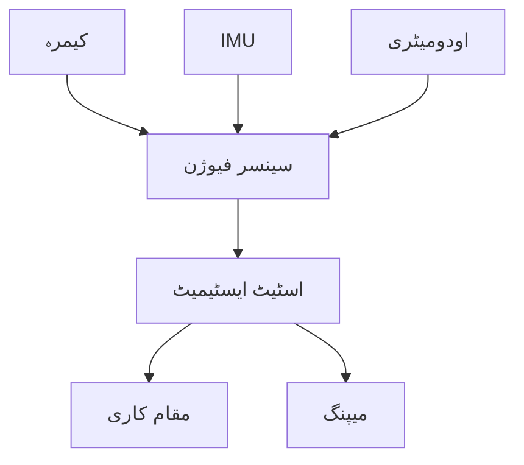

import MermaidDiagram from '@site/src/components/MermaidDiagram';
import Exercise from '@site/src/components/Exercise';
import Quiz from '@site/src/components/Quiz';
import PrerequisiteCheck from '@site/src/components/PrerequisiteCheck';  

# باب 22: سینسر فیوژن اور VIO

## تعارف

سینسر فیوژن متعدد سینسرز سے ڈیٹا کو جوڑ کر ایک بہتر کارکردگی حاصل کرتا ہے جو انفرادی سینسرز کے مقابلے میں بہتر ہوتی ہے۔ ویژوئل-انرٹیل اوڈومیٹری (VIO) سینسر فیوژن کے سب سے کامیاب ایپروچز میں سے ایک ہے، جو کیمرہ کی تصویر کو انرٹیل میژورمنٹ یونٹ (IMU) ڈیٹا کے ساتھ جوڑ کر مضبوط پوز ایسٹیمیشن فراہم کرتا ہے۔ یہ باب سینسر فیوژن کی ریاضیاتی بنیاد، ایکسٹینڈیڈ کیلمن فلٹرز کا نفاذ، اور عملی VIO سسٹم کا جائزہ لیتا ہے جو مشکل بصری حالات میں کام کرتے ہیں جہاں صرف بصری SLAM ناکام ہو جاتا ہے۔

## سیکھنے کے اہداف

اس باب کے اختتام تک، آپ کو اس بات کا اہل ہو جانا چاہیے:

- سینسر فیوژن کی ریاضیاتی بنیاد کو سمجھنا
- متعدد سینسر اسٹیٹ ایسٹیمیشن کے لیے ایکسٹینڈیڈ کیلمن فلٹر نافذ کرنا
- کیمرہ اور IMU ڈیٹا کو جوڑنے والے ویژوئل-انرٹیل اوڈومیٹری سسٹم تیار کرنا
- بہترین کارکردگی کے لیے سینسر فیوژن الگورتھم کا جائزہ لینا اور ٹیون کرنا
- مختلف سینسر فیوژن ایپروچز اور ان کے ٹریڈ آف کا موازنہ کرنا

## شرائطِ لازمہ

اس باب کا آغاز کرنے سے پہلے، یقین کر لیں کہ آپ کے پاس ہے:

- ماڈیول 1 مکمل (ROS 2 کی بنیاد، TF2)
- ماڈیول 3 باب 18 (SLAM کی بنیاد)
- امکان کے نظریہ اور اسٹیٹ ایسٹیمیشن کی بنیادی سمجھ
- IMU اور کیمرہ سینسرز کا تجربہ
- میٹرکس آپریشنز اور لکیری الجبرا کا علم

## حقیقی دنیا کی مثلاً: ملٹی-سینسر نیویگیٹر

سینسر فیوژن کو اس طرح سمجھیں جیسے انسان ایک ساتھ متعدد حواس کا استعمال کرتے ہوئے نیویگیٹ کرتے ہیں۔ جب کم روشنی میں چلتے ہیں، تو آپ صرف وژن پر انحصار نہیں کرتے؛ آپ اس کے علاوہ Proprioception (جسم کی پوزیشن کا احساس)، vestibular سسٹم (تولید)، اور زمین سے ٹیکٹائل فیڈ بیک بھی استعمال کرتے ہیں۔ اسی طرح، VIO بصری نشانیوں (جیسے کیمرہ کی تصاویر میں ممتاز فیچرز) کو انرٹیل ماپ (جیسے IMU سے ایکسلریشن اور گردش) کے ساتھ جوڑ کر درست نیویگیشن برقرار رکھتا ہے یہاں تک کہ جب بصری فیچرز کم ہوں یا غیر واضح ہوں۔

## بنیادی تصورات

### 1. سینسر فیوژن کی بنیاد

سینسر فیوژن متعدد سینسر ماپ کو جوڑ کر سسٹم اسٹیٹ کا تخمینہ لگاتا ہے:

- **اسٹیٹ ویکٹر**: تمام متغیرات کو شامل کرتا ہے جن کا تخمینہ لگایا جانا ہے (پوزیشن، ویلوسٹی، اورینٹیشن، بائس)
- **پروسیس ماڈل**: موشن اور فزکس کی بنیاد پر اسٹیٹ ایوولوشن کی پیش گوئی کرتا ہے
- **میپرمنٹ ماڈل**: سینسر ماپ کو اسٹیٹ متغیرات سے جوڑتا ہے
- **غیر یقینی پروپیگیشن**: اسٹیٹ ایسٹیمیٹس میں اعتماد برقرار رکھتا ہے



| سینسر | فائدے | کمیاں | استعمال کا موقع |
|-------|--------|--------|------------------|
| کیمرہ | تفصیلی معلومات | لائٹنگ پر انحصار | انڈور، دن |
| IMU | ہمیشہ کام کرتا ہے | ڈرائیف | تمام حالات |
| اودومیٹری | فاسٹ | غلطیاں | ہموار سطح |

---

## ایکسٹینڈیڈ کیلمن فلٹر (EKF)

### EKF کا ریاضیاتی فارمولیشن

```python
import numpy as np

class ExtendedKalmanFilter:
    def __init__(self, state_dim, measurement_dim):
        self.state_dim = state_dim
        self.measurement_dim = measurement_dim

        # اسٹیٹ ویکٹر (پوزیشن، ویلوسٹی، اورینٹیشن، IMU بائس)
        self.x = np.zeros(state_dim)

        # کواریئنس میٹرکس
        self.P = np.eye(state_dim) * 1000

        # پروسیس نوائز کواریئنس
        self.Q = np.eye(state_dim) * 0.1

        # میپرمنٹ نوائز کواریئنس
        self.R = np.eye(measurement_dim) * 1.0

        # جیکوبینز
        self.F = np.eye(state_dim)  # پروسیس ماڈل جیکوبین
        self.H = np.eye(measurement_dim, state_dim)  # میپرمنٹ ماڈل جیکوبین

    def predict(self, dt, control_input=None):
        """پیش گوئی کا مرحلہ"""
        # اسٹیٹ پریڈکشن
        self.x = self.state_transition_function(self.x, dt, control_input)

        # جیکوبین کی گنتی
        self.F = self.compute_process_jacobian(self.x, dt)

        # کواریئنس پریڈکشن
        self.P = self.F @ self.P @ self.F.T + self.Q

    def update(self, measurement):
        """اپ ڈیٹ کا مرحلہ"""
        # میپرمنٹ جیکوبین
        self.H = self.compute_measurement_jacobian(self.x)

        # کیلمن گین
        S = self.H @ self.P @ self.H.T + self.R
        K = self.P @ self.H.T @ np.linalg.inv(S)

        # اسٹیٹ اپ ڈیٹ
        innovation = measurement - self.measurement_function(self.x)
        self.x = self.x + K @ innovation

        # کواریئنس اپ ڈیٹ
        I = np.eye(self.state_dim)
        self.P = (I - K @ self.H) @ self.P

    def state_transition_function(self, x, dt, u=None):
        """اسٹیٹ ٹرانزیشن فنکشن"""
        # سادہ ڈائنیمکس ماڈل
        # x = [px, py, pz, vx, vy, vz, qx, qy, qz, qw, bgx, bgy, bgz, bax, bay, baz]
        # یہاں سادہ ایولیوشن کا کوڈ ہوگا
        return x

    def measurement_function(self, x):
        """میپرمنٹ فنکشن"""
        # میپرمنٹ کا حساب
        return np.zeros(self.measurement_dim)

    def compute_process_jacobian(self, x, dt):
        """پروسیس جیکوبین کا حساب"""
        F = np.eye(self.state_dim)
        # جیکوبین کا حساب
        return F

    def compute_measurement_jacobian(self, x):
        """میپرمنٹ جیکوبین کا حساب"""
        H = np.zeros((self.measurement_dim, self.state_dim))
        # جیکوبین کا حساب
        return H
```

### VIO کے لیے EKF نفاذ

```python
class VisualInertialEKF(ExtendedKalmanFilter):
    def __init__(self):
        # اسٹیٹ: [p, v, q, bg, ba] (position, velocity, orientation, gyro bias, accel bias)
        state_dim = 16  # 3 pos + 3 vel + 4 quat + 3 gyro bias + 3 accel bias
        measurement_dim = 6  # 3 accel + 3 gyro
        super().__init__(state_dim, measurement_dim)

        # IMU ماڈل پیرامیٹر
        self.gravity = np.array([0, 0, -9.81])

    def predict_with_imu(self, accel, gyro, dt):
        """IMU ڈیٹا کے ساتھ پیش گوئی"""
        # IMU ماڈل استعمال کریں
        # ریاضیاتی فارمولیشن کے مطابق اسٹیٹ اپ ڈیٹ کریں
        pass

    def update_with_visual_features(self, feature_measurements):
        """بصری فیچرز کے ساتھ اپ ڈیٹ"""
        # بصری فیچرز کو استعمال کریں
        # اسٹیٹ اپ ڈیٹ کریں
        pass
```

---

## VIO سسٹم

### VIO کا ریاضیاتی ماڈل

VIO اسٹیٹ ویکٹر میں مندرجہ ذیل شامل ہوتا ہے:

- **پوزیشن** (p): 3D پوزیشن (x, y, z)
- **ویلوسٹی** (v): 3D ویلوسٹی (vx, vy, vz)
- **اورینٹیشن** (q): کوارٹنین (qx, qy, qz, qw)
- **جیرو بائس** (bg): جیرو اسکوپ بائس (bgx, bgy, bgz)
- **ایکسل بائس** (ba): ایکسلیرومیٹر بائس (bax, bay, baz)

### VIO کے لیے ROS 2 نوڈ

```python
#!/usr/bin/env python3
# VIO ROS 2 نوڈ
import rclpy
from rclpy.node import Node
from sensor_msgs.msg import Imu, Image
from geometry_msgs.msg import PoseStamped, TwistStamped
from cv_bridge import CvBridge
import numpy as np
from scipy.spatial.transform import Rotation as R

class VIONode(Node):
    def __init__(self):
        super().__init__('vio_node')

        # سبسکرائبرز
        self.imu_sub = self.create_subscription(
            Imu,
            '/imu/data',
            self.imu_callback,
            10
        )

        self.image_sub = self.create_subscription(
            Image,
            '/camera/image_raw',
            self.image_callback,
            10
        )

        # پبلیشرز
        self.pose_pub = self.create_publisher(PoseStamped, '/vio/pose', 10)
        self.twist_pub = self.create_publisher(TwistStamped, '/vio/twist', 10)

        # کیمرہ کنٹرول
        self.bridge = CvBridge()

        # VIO متغیرات
        self.ekf = VisualInertialEKF()
        self.last_imu_time = None
        self.feature_tracker = FeatureTracker()

        # ٹائمر
        self.timer = self.create_timer(0.01, self.publish_state)  # 100Hz

    def imu_callback(self, msg):
        """IMU ڈیٹا کو سنبھالیں"""
        # IMU ڈیٹا نکالیں
        accel = np.array([
            msg.linear_acceleration.x,
            msg.linear_acceleration.y,
            msg.linear_acceleration.z
        ])

        gyro = np.array([
            msg.angular_velocity.x,
            msg.angular_velocity.y,
            msg.angular_velocity.z
        ])

        # وقت
        current_time = msg.header.stamp.sec + msg.header.stamp.nanosec * 1e-9
        if self.last_imu_time is not None:
            dt = current_time - self.last_imu_time

            # EKF پیش گوئی
            self.ekf.predict_with_imu(accel, gyro, dt)

        self.last_imu_time = current_time

    def image_callback(self, msg):
        """کیمرہ ڈیٹا کو سنبھالیں"""
        image = self.bridge.imgmsg_to_cv2(msg, desired_encoding='bgr8')

        # فیچر ٹریکنگ
        features = self.feature_tracker.track_features(image)

        if len(features) > 10:  # کم از کم فیچرز
            # EKF اپ ڈیٹ
            self.ekf.update_with_visual_features(features)

    def publish_state(self):
        """اسٹیٹ شائع کریں"""
        pose_msg = PoseStamped()
        pose_msg.header.stamp = self.get_clock().now().to_msg()
        pose_msg.header.frame_id = 'map'

        # EKF سے اسٹیٹ حاصل کریں
        state = self.ekf.x

        # پوزیشن
        pose_msg.pose.position.x = state[0]
        pose_msg.pose.position.y = state[1]
        pose_msg.pose.position.z = state[2]

        # اورینٹیشن (کوارٹنین)
        quat = state[6:10]  # [qx, qy, qz, qw]
        pose_msg.pose.orientation.x = quat[0]
        pose_msg.pose.orientation.y = quat[1]
        pose_msg.pose.orientation.z = quat[2]
        pose_msg.pose.orientation.w = quat[3]

        self.pose_pub.publish(pose_msg)

class FeatureTracker:
    def __init__(self):
        self.orb = cv2.ORB_create(nfeatures=500)
        self.prev_kp = None
        self.tracks = []

    def track_features(self, image):
        """فیچرز ٹریک کریں"""
        kp, des = self.orb.detectAndCompute(image, None)

        if self.prev_kp is not None and kp is not None:
            # فیچر میچنگ
            bf = cv2.BFMatcher(cv2.NORM_HAMMING, crossCheck=False)
            matches = bf.match(des, self.prev_des)
            matches = sorted(matches, key=lambda x: x.distance)

            # ٹریک کیے گئے فیچرز
            tracked_features = []
            for match in matches[:50]:  # پہلے 50
                pt = kp[match.queryIdx].pt
                tracked_features.append(pt)

            self.prev_kp = kp
            self.prev_des = des

            return np.array(tracked_features)
        else:
            self.prev_kp = kp
            self.prev_des = des
            return np.array([])

def main(args=None):
    rclpy.init(args=args)
    vio_node = VIONode()

    try:
        rclpy.spin(vio_node)
    except KeyboardInterrupt:
        print("VIO نوڈ کو بند کیا جا رہا ہے")

    vio_node.destroy_node()
    rclpy.shutdown()

if __name__ == '__main__':
    main()
```

---

## سینسر فیوژن الگورتھم

### کوارٹنین کا استعمال

```python
def integrate_quaternion(omega, dt, q_prev):
    """کوارٹنین کو انٹیگریٹ کریں"""

    # زاویہ ویلوسٹی کا نارملائز کریں
    omega_norm = np.linalg.norm(omega)
    if omega_norm > 1e-8:
        axis = omega / omega_norm
        angle = omega_norm * dt

        # کوارٹنین کا حساب
        dq = np.array([
            np.cos(angle/2),
            axis[0] * np.sin(angle/2),
            axis[1] * np.sin(angle/2),
            axis[2] * np.sin(angle/2)
        ])

        # کوارٹنین ضرب
        q_new = quaternion_multiply(dq, q_prev)
    else:
        q_new = q_prev

    # نارملائز کریں
    q_new = q_new / np.linalg.norm(q_new)

    return q_new

def quaternion_multiply(q1, q2):
    """کوارٹنین ضرب"""
    w1, x1, y1, z1 = q1
    w2, x2, y2, z2 = q2

    w = w1*w2 - x1*x2 - y1*y2 - z1*z2
    x = w1*x2 + x1*w2 + y1*z2 - z1*y2
    y = w1*y2 - x1*z2 + y1*w2 + z1*x2
    z = w1*z2 + x1*y2 - y1*x2 + z1*w2

    return np.array([w, x, y, z])
```

---

## کارکردگی کا جائزہ

### VIO کارکردگی کے میٹرکس

```python
def evaluate_vio_performance(ground_truth, estimated_poses, estimated_velocities):
    """VIO کارکردگی کا جائزہ لیں"""

    metrics = {
        'position_rmse': [],
        'velocity_rmse': [],
        'orientation_rmse': [],
        'processing_time': []
    }

    for gt, est_pose, est_vel in zip(ground_truth['poses'], estimated_poses, estimated_velocities):
        # پوزیشن RMSE
        pos_error = np.linalg.norm(gt['position'] - est_pose[:3])
        metrics['position_rmse'].append(pos_error)

        # ویلوسٹی RMSE
        vel_error = np.linalg.norm(gt['velocity'] - est_vel[:3])
        metrics['velocity_rmse'].append(vel_error)

        # اورینٹیشن RMSE
        gt_quat = gt['orientation']
        est_quat = est_pose[3:7]  # [x, y, z, w]
        angle_error = 2 * np.arccos(np.abs(np.dot(gt_quat, est_quat)))
        metrics['orientation_rmse'].append(angle_error)

    # اوسط میٹرکس
    avg_metrics = {}
    for key, values in metrics.items():
        if values:
            avg_metrics[key] = sum(values) / len(values)
        else:
            avg_metrics[key] = 0.0

    return avg_metrics
```

---

## مشق

**سینسر فیوژن کا انتخاب**: مختلف ماحول کے لیے سینسر فیوژن کا انتخاب کریں:

1. **تاریک ماحول**: VIO (IMU انضمام)
2. **خالی ماحول**: لیزر SLAM (بصری فیچرز کی کمی)
3. **تیز حرکت**: VIO (IMU ہمیشہ کام کرتا ہے)
4. **اونچی درستگی**: RTAB-Map (RGB-D)

<Quiz
  title="سینسر فیوژن اور VIO"
  questions={[
    {
      question: "VIO کا مطلب کیا ہے؟",
      options: ["Visual Input Output", "Visual-Inertial Odometry", "Variable Input Odometry", "Visual Integration Output"],
      answer: 1,
      explanation: "VIO ویژوئل-انرٹیل اوڈومیٹری کا مختصر ہے"
    },
    {
      question: "EKF کا کیا استعمال ہوتا ہے؟",
      options: ["لکیری سسٹم کے لیے", "غیر لکیری سسٹم کے لیے", " دونوں", "کوئی نہیں"],
      answer: 2,
      explanation: "EKF غیر لکیری سسٹم کے لیے استعمال ہوتا ہے"
    }
  ]}
/>
