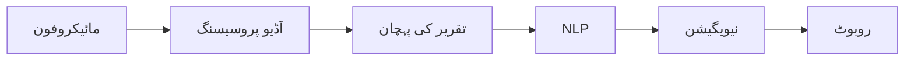

import MermaidDiagram from '@site/src/components/MermaidDiagram';
import Exercise from '@site/src/components/Exercise';
import Quiz from '@site/src/components/Quiz';
import PrerequisiteCheck from '@site/src/components/PrerequisiteCheck';  

# باب 23: وائس ٹو نیویگیشن

## تعارف

وائس ٹو نیویگیشن تقریر کی پہچان، قدرتی زبان کی پروسیسنگ، اور خودکار نیویگیشن سسٹم کا اتحاد ہے، جو انسانوں کو قدرتی زبان کا استعمال کرتے ہوئے روبوٹس کے ساتھ بات چیت کرنے کی اجازت دینے والے مزاحمتی انٹرفیس تیار کرتا ہے۔ یہ ٹیکنالوجی صارفین کو روبوٹس کو سادہ وائس ہدایات سے کمانڈ دینے کے قابل بناتی ہے جیسے "کچن میں جاؤ" یا "میرے لیے لال کپ لائیں"، انسانی مواصلت اور روبوٹک کارروائی کے درمیان خلاء کو پا کرتا ہے۔ یہ باب تقریر کی پہچان، NLP، اور نیویگیشن سسٹم کا انضمام تلاش کرتا ہے تاکہ لامحدود وائس کنٹرولڈ نیویگیشن کی صلاحیات تیار کی جا سکیں۔

## سیکھنے کے اہداف

اس باب کے اختتام تک، آپ کو اس بات کا اہل ہو جانا چاہیے:

- نیویگیشن کمانڈز کے لیے تقریر کی پہچان سسٹم نافذ کرنا
- نیویگیشن سسٹم کے ساتھ قدرتی زبان کی پروسیسنگ کا انضمام
- وائس کنٹرولڈ نیویگیشن انٹرفیس تیار کرنا
- ابہام یا پیچیدہ نیویگیشن کی درخواستوں کو سنبھالنا
- وائس نیویگیشن سسٹم کارکردگی اور درستگی کا جائزہ لینا

## شرائطِ لازمہ

اس باب کا آغاز کرنے سے پہلے، یقین کر لیں کہ آپ کے پاس ہے:

- ماڈیول 1 مکمل (ROS 2 کی بنیاد)
- ماڈیول 3 باب 16 (نیویگیشن کے تصورات)
- قدرتی زبان کی پروسیسنگ کی بنیادی سمجھ
- ROS 2 ایکشن سرورز اور سروسز کا تجربہ
- آڈیو پروسیسنگ کی بنیاد کا علم

## حقیقی دنیا کی مثلاً: گفتگو کرنے والا اسسٹنٹ

وائس نیویگیشن کو اس طرح سمجھیں جیسے ایک دوست کو آپ کے شہر کی طرف سے راستے بتانا جو آپ کے شہر میں نیا ہے۔ پیچیدہ کوآرڈینیٹس یا تکنیکی نیویگیشن اصطلاحات کے استعمال کے بجائے، آپ قدرتی زبان کا استعمال کرتے ہیں جیسے "دو بلاکس سیدھے جائیں، پھر کافی شاپ پر دائیں مڑیں، اور یہ آپ کے بائیں ہاتھ کی تیسری عمارت ہے۔" وائس نیویگیشن سسٹم ان قدرتی زبان کی ہدایات کی تشریح کرتے ہیں اور انہیں درست نیویگیشن کمانڈز میں تبدیل کر دیتے ہیں جو روبوٹس انجام دے سکتے ہیں، انسان-روبوٹ تعامل کو مزاحمتی اور قابلِ رسائی بنا دیتے ہیں۔

## بنیادی تصورات

### 1. تقریر کی پہچان کی پائپ لائن

وائس ٹو نیویگیشن سسٹم ایک متعدد اسٹیج والی پائپ لائن کا پیرو کرتا ہے:

- **آڈیو کیپچر**: مائیکروفونز سے تقریر ریکارڈ کرنا
- **پری پروسیسنگ**: نوائز کم کرنا اور آڈیو بہتر بنانا
- **فیچر ایکسٹریکشن**: آڈیو کو تقریر کے فیچرز میں تبدیل کرنا
- **پہچان**: تقریر کو ٹیکسٹ میں تبدیل کرنا
- **NLP پروسیسنگ**: ٹیکسٹ کمانڈز کا مطلب سمجھنا
- **نیویگیشن منصوبہ بندی**: کمانڈز کو نیویگیشن اہداف میں تبدیل کرنا



| اسٹیج | کام | چیلنجز |
|-------|-----|---------|
| آڈیو کیپچر | تقریر ریکارڈ کرنا | نوائز، ہم وقتی باتیں |
| تقریر کی پہچان | ٹیکسٹ میں تبدیل کرنا | لہجہ، شور، وضاحت |
| NLP | مطلب سمجھنا | ابہام، ساخت |
| نیویگیشن | کارروائی | میپ، مقام، رکاوٹیں |

---

## تقریر کی پہچان کا نفاذ

### Python میں تقریر کی پہچان

```python
import speech_recognition as sr
import threading
import queue

class SpeechRecognizer:
    def __init__(self):
        self.recognizer = sr.Recognizer()
        self.microphone = sr.Microphone()
        self.audio_queue = queue.Queue()

        # نوائز کی ایڈجسٹمنٹ
        with self.microphone as source:
            self.recognizer.adjust_for_ambient_noise(source)

    def listen_continuously(self):
        """مسلسل سنیں"""
        def audio_callback(recognizer, audio):
            self.audio_queue.put(audio)

        # ریکارڈنگ شروع کریں
        stop_listening = self.recognizer.listen_in_background(
            self.microphone, audio_callback
        )

        return stop_listening

    def recognize_audio(self, audio):
        """آڈیو کو پہچانیں"""
        try:
            # تقریر کو ٹیکسٹ میں تبدیل کریں
            text = self.recognizer.recognize_google(audio)
            return text
        except sr.UnknownValueError:
            return None
        except sr.RequestError as e:
            print(f"تقریر کی پہچان سروس کے ساتھ مسئلہ: {e}")
            return None
```

### ROS 2 نوڈ کے لیے کوڈ

```python
#!/usr/bin/env python3
# وائس نیویگیشن ROS 2 نوڈ
import rclpy
from rclpy.node import Node
from geometry_msgs.msg import PoseStamped
from std_msgs.msg import String
from rclpy.action import ActionClient
from nav2_msgs.action import NavigateToPose
import speech_recognition as sr
import threading
import re

class VoiceNavigationNode(Node):
    def __init__(self):
        super().__init__('voice_navigation_node')

        # سبسکرائبرز
        self.voice_command_sub = self.create_subscription(
            String,
            '/voice/command',
            self.voice_command_callback,
            10
        )

        # پبلیشرز
        self.navigation_goal_pub = self.create_publisher(
            PoseStamped, '/voice_navigation/goal', 10
        )

        # ایکشن کلائنٹ
        self.nav_to_pose_client = ActionClient(
            self, NavigateToPose, 'navigate_to_pose'
        )

        # تقریر کی پہچان
        self.speech_recognizer = sr.Recognizer()
        self.microphone = sr.Microphone()

        # نیویگیشن کے لیے مقامات
        self.location_map = {
            'kitchen': (2.0, 1.0, 0.0),      # (x, y, theta)
            'living room': (0.0, 0.0, 0.0),
            'bedroom': (3.0, -1.0, 1.57),
            'bathroom': (-1.0, 2.0, -1.57),
            'office': (4.0, 0.0, 0.0)
        }

        # ٹائمر (تقریر کو سننے کے لیے)
        self.listen_timer = self.create_timer(1.0, self.listen_for_voice)

    def listen_for_voice(self):
        """وائس کے لیے سنیں"""
        try:
            with self.microphone as source:
                self.get_logger().info('وائس کمانڈ کے لیے سن رہا ہے...')
                audio = self.speech_recognizer.listen(source, timeout=2, phrase_time_limit=5)

            # تقریر کو ٹیکسٹ میں تبدیل کریں
            text = self.speech_recognizer.recognize_google(audio)
            self.get_logger().info(f'وائس کمانڈ موصول: {text}')

            # کمانڈ کو پروسیس کریں
            self.process_voice_command(text)

        except sr.WaitTimeoutError:
            pass  # کوئی وائس نہیں
        except sr.UnknownValueError:
            self.get_logger().warn('وائس کمانڈ کو سمجھا نہیں جا سکا')
        except sr.RequestError as e:
            self.get_logger().error(f'تقریر کی پہچان کے ساتھ مسئلہ: {e}')

    def voice_command_callback(self, msg):
        """وائس کمانڈ کو سنبھالیں"""
        self.process_voice_command(msg.data)

    def process_voice_command(self, command):
        """وائس کمانڈ کو پروسیس کریں"""
        command = command.lower()

        # کمانڈ کو تلاش کریں
        if 'go to' in command or 'navigate to' in command or 'move to' in command:
            destination = self.extract_destination(command)
            if destination:
                self.navigate_to_location(destination)
            else:
                self.get_logger().warn(f'مقصد نہیں پایا: {command}')
        elif 'stop' in command or 'halt' in command:
            self.stop_navigation()
        elif 'come here' in command:
            self.navigate_to_robot()
        else:
            self.get_logger().warn(f'نامعلوم کمانڈ: {command}')

    def extract_destination(self, command):
        """کمانڈ سے مقصد نکالیں"""
        # مقامات کو تلاش کریں
        for location in self.location_map.keys():
            if location in command:
                return location

        # ممکنہ مقامات کو تلاش کریں (partial matching)
        command_lower = command.lower()
        for location in self.location_map.keys():
            if location.split()[0] in command_lower:  # پہلا لفظ
                return location

        return None

    def navigate_to_location(self, location):
        """مقام کی طرف نیویگیٹ کریں"""
        if location in self.location_map:
            x, y, theta = self.location_map[location]

            # نیویگیشن کا مقصد تیار کریں
            goal_msg = NavigateToPose.Goal()
            goal_msg.pose.header.frame_id = 'map'
            goal_msg.pose.header.stamp = self.get_clock().now().to_msg()
            goal_msg.pose.pose.position.x = x
            goal_msg.pose.pose.position.y = y
            goal_msg.pose.pose.position.z = 0.0

            # کوارٹنین کا حساب
            from math import sin, cos
            cy = cos(theta * 0.5)
            sy = sin(theta * 0.5)
            goal_msg.pose.pose.orientation.z = sy
            goal_msg.pose.pose.orientation.w = cy

            # نیویگیشن کا مقصد بھیجیں
            self.send_navigation_goal(goal_msg)
            self.get_logger().info(f'نیویگیشن کا مقصد بھیجا گیا: {location}')
        else:
            self.get_logger().warn(f'نامعلوم مقام: {location}')

    def send_navigation_goal(self, goal_msg):
        """نیویگیشن کا مقصد بھیجیں"""
        self.nav_to_pose_client.wait_for_server()
        future = self.nav_to_pose_client.send_goal_async(goal_msg)
        future.add_done_callback(self.navigation_goal_response_callback)

    def navigation_goal_response_callback(self, future):
        """نیویگیشن کا مقصد جواب کے بارے میں"""
        goal_handle = future.result()
        if not goal_handle.accepted:
            self.get_logger().info('نیویگیشن کا مقصد قبول نہیں کیا گیا')
            return

        self.get_logger().info('نیویگیشن کا مقصد قبول کر لیا گیا')
        result_future = goal_handle.get_result_async()
        result_future.add_done_callback(self.navigation_result_callback)

    def navigation_result_callback(self, future):
        """نیویگیشن کا نتیجہ"""
        result = future.result().result
        self.get_logger().info('نیویگیشن مکمل ہو گئی')

def main(args=None):
    rclpy.init(args=args)
    voice_nav_node = VoiceNavigationNode()

    try:
        rclpy.spin(voice_nav_node)
    except KeyboardInterrupt:
        print("وائس نیویگیشن نوڈ کو بند کیا جا رہا ہے")

    voice_nav_node.destroy_node()
    rclpy.shutdown()

if __name__ == '__main__':
    main()
```

---

## NLP کا انضمام

### نیویگیشن کے لیے NLP ماڈل

```python
import re
from typing import Dict, Tuple, Optional

class NavigationNLP:
    def __init__(self):
        # کمانڈ پیٹرنز
        self.command_patterns = {
            'navigation': [
                r'go to (.+)',
                r'navigate to (.+)',
                r'move to (.+)',
                r'go (.+)',
                r'head to (.+)',
                r'take me to (.+)'
            ],
            'stop': [
                r'stop',
                r'halt',
                r'pause',
                r'freeze'
            ],
            'follow': [
                r'follow me',
                r'come with me',
                r'follow'
            ]
        }

        # مقامات کا میپ
        self.location_synonyms = {
            'kitchen': ['kitchen', 'cooking area', 'cooking room', 'food area'],
            'living room': ['living room', 'sitting room', 'lounge', 'main room'],
            'bedroom': ['bedroom', 'sleeping room', 'bed room', 'chamber'],
            'bathroom': ['bathroom', 'toilet', 'washroom', 'restroom'],
            'office': ['office', 'study', 'work room', 'desk room']
        }

    def parse_command(self, text: str) -> Dict:
        """کمانڈ کو پارس کریں"""
        text = text.lower().strip()

        # کمانڈ کی قسم کا تعین کریں
        command_type = None
        for cmd_type, patterns in self.command_patterns.items():
            for pattern in patterns:
                match = re.search(pattern, text)
                if match:
                    command_type = cmd_type
                    break
            if command_type:
                break

        # مقصد نکالیں
        destination = self.extract_destination(text) if command_type == 'navigation' else None

        return {
            'type': command_type,
            'destination': destination,
            'raw_text': text
        }

    def extract_destination(self, text: str) -> Optional[str]:
        """مقصد نکالیں"""
        # متبادل ناموں کو تلاش کریں
        for main_location, synonyms in self.location_synonyms.items():
            for synonym in synonyms:
                if synonym in text:
                    return main_location

        # کوائف کو تلاش کریں (اگر کوائف فراہم کیے گئے ہوں)
        coord_pattern = r'(\d+\.?\d*)\s*,\s*(\d+\.?\d*)'
        coord_match = re.search(coord_pattern, text)
        if coord_match:
            x = float(coord_match.group(1))
            y = float(coord_match.group(2))
            return f'coordinates_{x}_{y}'

        return None

    def validate_command(self, command: Dict) -> bool:
        """کمانڈ کی توثیق کریں"""
        if command['type'] is None:
            return False

        if command['type'] == 'navigation' and command['destination'] is None:
            return False

        return True
```

---

## وائس نیویگیشن انٹرفیس

### انٹرفیس کے لیے ROS 2 میسج

```python
# کسٹم میسج: VoiceCommand.msg
# string command_type  # 'navigation', 'stop', 'follow', etc.
# string destination   # مقصد
# float64 confidence   # یقین کی سطح
# string raw_text      # اصل ٹیکسٹ
```

### کسٹم سروس: VoiceNavigation.srv

```python
# کسٹم سروس: VoiceNavigation.srv
# string text_command
# ---
# bool success
# string message
# float64 confidence
```

### وائس کمانڈ ہینڈلر

```python
class VoiceCommandHandler:
    def __init__(self):
        self.nlp = NavigationNLP()
        self.confidence_threshold = 0.7

    def process_voice_command(self, text: str) -> Dict:
        """وائس کمانڈ کو عمل کریں"""
        # NLP پارسنگ
        parsed_command = self.nlp.parse_command(text)

        if not self.nlp.validate_command(parsed_command):
            return {
                'success': False,
                'message': 'کمانڈ کو سمجھا نہیں جا سکا',
                'confidence': 0.0
            }

        # یقین کی سطح کا حساب
        confidence = self.calculate_confidence(text, parsed_command)

        if confidence < self.confidence_threshold:
            return {
                'success': False,
                'message': f'کمانڈ کی یقین کم ہے: {confidence:.2f}',
                'confidence': confidence
            }

        return {
            'success': True,
            'command': parsed_command,
            'confidence': confidence
        }

    def calculate_confidence(self, text: str, command: Dict) -> float:
        """یقین کی سطح کا حساب"""
        confidence = 0.0

        # کمانڈ کی قسم کی بنیاد پر
        if command['type']:
            confidence += 0.3

        # مقصد کی بنیاد پر
        if command['destination']:
            confidence += 0.4

        # ٹیکسٹ کی لمبائی کی بنیاد پر
        if len(text) > 5:
            confidence += 0.2

        # واضح الفاظ کی بنیاد پر
        clear_indicators = ['go to', 'navigate to', 'move to', 'kitchen', 'bedroom', 'bathroom']
        for indicator in clear_indicators:
            if indicator in text.lower():
                confidence += 0.1

        return min(confidence, 1.0)  # 1.0 سے زیادہ نہیں
```

---

## کارکردگی کا جائزہ

### وائس نیویگیشن کارکردگی کے میٹرکس

```python
def evaluate_voice_navigation_performance(test_commands):
    """وائس نیویگیشن کارکردگی کا جائزہ لیں"""

    metrics = {
        'recognition_accuracy': [],
        'command_understanding': [],
        'navigation_success': [],
        'response_time': [],
        'user_satisfaction': []
    }

    for test_cmd in test_commands:
        # تقریر کی پہچان
        recognized_text = speech_to_text(test_cmd['audio'])
        recognition_acc = calculate_recognition_accuracy(
            recognized_text, test_cmd['expected_text']
        )
        metrics['recognition_accuracy'].append(recognition_acc)

        # کمانڈ کی سمجھ
        parsed_cmd = nlp_parser.parse_command(recognized_text)
        understanding_acc = calculate_understanding_accuracy(
            parsed_cmd, test_cmd['expected_command']
        )
        metrics['command_understanding'].append(understanding_acc)

        # نیویگیشن کامیابی
        nav_success = execute_navigation_command(parsed_cmd)
        metrics['navigation_success'].append(nav_success)

        # جواب کا وقت
        response_time = test_cmd['end_time'] - test_cmd['start_time']
        metrics['response_time'].append(response_time)

    # اوسط میٹرکس
    avg_metrics = {}
    for key, values in metrics.items():
        if values:
            avg_metrics[key] = sum(values) / len(values)
        else:
            avg_metrics[key] = 0.0

    return avg_metrics
```

---

## مشق

**وائس نیویگیشن کا منصوبہ بندی**: ایک گھریلو روبوٹ کے لیے وائس نیویگیشن کا منصوبہ بندی کریں:

1. **تقریر کی پہچان**: Google Speech-to-Text API
2. **NLP**: کسٹم NLP ماڈل یا spaCy
3. **نیویگیشن**: Nav2 سٹیک
4. **انٹرفیس**: ROS 2 ایکشنز

<Quiz
  title="وائس ٹو نیویگیشن"
  questions={[
    {
      question: "VIO کا مطلب کیا ہے؟",
      options: ["Voice Input Output", "Voice Interface Operations", "Visual-Inertial Odometry", "Voice Interaction Operations"],
      answer: 2,
      explanation: "VIO Visual-Inertial Odometry کا مختصر ہے، لیکن یہاں ہم Voice to Navigation پر ہیں"
    },
    {
      question: "وائس نیویگیشن کا کون سا حصہ ٹیکسٹ کو سمجھتا ہے؟",
      options: ["تقریر کی پہچان", "NLP", "نیویگیشن", "کوارٹنین"],
      answer: 1,
      explanation: "NLP (Natural Language Processing) ٹیکسٹ کو سمجھتا ہے"
    }
  ]}
/>
