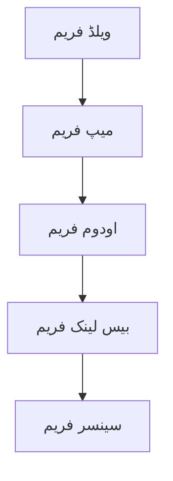

import MermaidDiagram from '@site/src/components/MermaidDiagram';
import Exercise from '@site/src/components/Exercise';
import Quiz from '@site/src/components/Quiz';
import PrerequisiteCheck from '@site/src/components/PrerequisiteCheck';

# باب 16: نیویگیشن کے تصورات

## تعارف

نیویگیشن خودکار روبوٹس کے لیے سب سے بنیادی صلاحیتوں میں سے ایک ہے، جو انہیں ایک جگہ سے دوسری جگہ جانے کے قابل بناتا ہے جبکہ رکاوٹوں سے بچتا ہے اور اپنے ماحول کے مطابق ایڈجسٹ کرتا ہے۔ یہ باب روبوٹ نیویگیشن کے بنیادی تصورات کو تلاش کرتا ہے، بشمول راستہ کی منصوبہ بندی، مقام کاری، میپنگ، اور ادراک اور کنٹرول سسٹمز کا انضمام۔ ان تصورات کو سمجھنا حقیقی دنیا کے ماحول میں خودکار طور پر کام کرنے والے روبوٹس ترقی دینے کے لیے ضروری ہے۔

## سیکھنے کے اہداف

اس باب کے اختتام تک، آپ کو اس بات کا اہل ہو جانا چاہیے:

- روبوٹ نیویگیشن سسٹمز کے بنیادی اجزاء کی وضاحت کرنا
- بنیادی راستہ کی منصوبہ بندی الگورتھم (A*, Dijkstra, RRT) نافذ کرنا
- مقام کاری، میپنگ، اور نیویگیشن کے درمیان رشتہ سمجھنا
- رکاوٹ کے پتہ لگانے اور بچاؤ کے لیے سینسر ڈیٹا کو انضمام کرنا
- مختلف روبوٹ پلیٹ فارم کے لیے نیویگیشن پیرامیٹر تشکیل دینا

## شرائطِ لازمہ

اس باب کا آغاز کرنے سے پہلے، یقین کر لیں کہ آپ کے پاس ہے:

- ماڈیول 1 مکمل (ROS 2 کی بنیاد، TF2، URDF)
- ماڈیول 2 (سینسر سیمولیشن کے تصورات)
- کوآرڈینیٹ سسٹمز اور ٹرانسفارمیشن کی بنیادی سمجھ
- ROS 2 میسج پاسنگ اور پیرامیٹر تشکیل کا تجربہ

## حقیقی دنیا کی مثلاً: انسانی نیویگیشن سسٹم

روبوٹ نیویگیشن کو اس طرح سمجھیں جیسے انسان نامعلوم ماحول میں کیسے نیویگیٹ کرتے ہیں۔ جب آپ ایک نئی عمارت میں داخل ہوتے ہیں، تو آپ متعدد حواس اور ذہنی عملوں کا استعمال کرتے ہیں: آپ نشانیوں کو دیکھتے ہیں (میپنگ)، اپنی موجودہ جگہ کو یاد کرتے ہیں (مقام کاری)، اپنی منزل تک راستوں کی منصوبہ بندی کرتے ہیں (راستہ کی منصوبہ بندی)، اور رکاوٹوں اور نئی معلومات کی بنیاد پر اپنا راستہ جاری رکھتے ہیں (دوبارہ منصوبہ بندی)۔ روبوٹ نیویگیشن سسٹمز اسی طرح کام کرتے ہیں، انسانی حواس کے بجائے سینسرز اور انسانی سوچ کے بجائے الگورتھم استعمال کرتے ہوئے خودکار حرکت حاصل کرتے ہیں۔

## بنیادی تصورات

### 1. نیویگیشن اسٹیک کے اجزاء

روبوٹ نیویگیشن عام طور پر تین مربوط اجزاء پر مشتمل ہوتا ہے:

- **مقام کاری**: ماحول میں روبوٹ کی پوزیشن کا تعین کرنا
- **میپنگ**: ماحول کی نمائندگی تیار کرنا اور برقرار رکھنا
- **راستہ کی منصوبہ بندی**: موجودہ مقام سے منزل تک بہترین راستے تلاش کرنا

### 2. نیویگیشن میں کوآرڈینیٹ فریم

نیویگیشن سسٹمز کو کوآرڈینیٹ فریم اور ٹرانسفارمیشن پر زیادہ انحصار ہوتا ہے:



### 3. نیویگیشن کے بنیادی مراحل

1. **میپنگ**: ماحول کی نمائندگی تیار کرنا
2. **مقام کاری**: موجودہ پوزیشن کا تعین کرنا
3. **راستہ کی منصوبہ بندی**: منزل تک بہترین راستہ تلاش کرنا
4. **کنٹرول**: راستے پر چلنا اور رکاوٹوں سے بچنا

---

## راستہ کی منصوبہ بندی الگورتھم

### A* الگورتھم

A* الگورتھم ایک ہیورسٹک تلاش الگورتھم ہے جو کم از کم قیمت کے راستے کو تلاش کرتا ہے:

```python
# A* الگورتھم کی مثال
import heapq

def a_star(start, goal, grid):
    """A* الگورتھم کا استعمال کرتے ہوئے راستہ تلاش کریں"""

    # کھولے گئے نوڈس کے لیے پرائیورٹی کیو
    open_set = [(0, start)]
    came_from = {}
    g_score = {start: 0}
    f_score = {start: heuristic(start, goal)}

    while open_set:
        current = heapq.heappop(open_set)[1]

        if current == goal:
            return reconstruct_path(came_from, current)

        for neighbor in get_neighbors(current, grid):
            tentative_g_score = g_score[current] + distance(current, neighbor)

            if neighbor not in g_score or tentative_g_score < g_score[neighbor]:
                came_from[neighbor] = current
                g_score[neighbor] = tentative_g_score
                f_score[neighbor] = g_score[neighbor] + heuristic(neighbor, goal)
                heapq.heappush(open_set, (f_score[neighbor], neighbor))

    return []  # کوئی راستہ نہیں ملا

def heuristic(a, b):
    """ہیورسٹک فنکشن (مانہیٹن فاصلہ)"""
    return abs(a[0] - b[0]) + abs(a[1] - b[1])
```

### Dijkstra الگورتھم

Dijkstra الگورتھم تمام نوڈس تک کم از کم قیمت کے راستے تلاش کرتا ہے:

```python
def dijkstra(start, goal, grid):
    """Dijkstra الگورتھم کا استعمال کرتے ہوئے راستہ تلاش کریں"""

    distances = {node: float('inf') for node in grid}
    distances[start] = 0
    previous = {}
    unvisited = set(grid)

    while unvisited:
        current = min(unvisited, key=lambda x: distances[x])
        unvisited.remove(current)

        if current == goal:
            break

        for neighbor in get_neighbors(current, grid):
            if neighbor in unvisited:
                new_distance = distances[current] + distance(current, neighbor)
                if new_distance < distances[neighbor]:
                    distances[neighbor] = new_distance
                    previous[neighbor] = current

    return reconstruct_path(previous, goal)
```

### RRT (Rapidly-exploring Random Trees)

RRT ایک متبادل الگورتھم ہے جو مسلسل ماحول میں کام کرتا ہے:

```python
import random

class RRT:
    def __init__(self, start, goal, grid):
        self.start = start
        self.goal = goal
        self.grid = grid
        self.nodes = [start]
        self.edges = {}

    def plan(self, max_iterations=1000):
        """RRT کا استعمال کرتے ہوئے راستہ تلاش کریں"""

        for _ in range(max_iterations):
            # بے ترتیب نوڈ منتخب کریں
            random_node = self.random_sample()

            # قریب ترین نوڈ تلاش کریں
            nearest = self.nearest_node(random_node)

            # قریب ترین نوڈ سے بڑھائیں
            new_node = self.extend(nearest, random_node)

            if self.is_valid(new_node):
                self.nodes.append(new_node)
                self.edges[new_node] = nearest

                # منزل تک پہنچ گئے؟
                if self.distance(new_node, self.goal) < 1.0:
                    return self.reconstruct_path(new_node)

        return []  # کوئی راستہ نہیں ملا

    def random_sample(self):
        """بے ترتیب نوڈ منتخب کریں"""
        x = random.randint(0, len(self.grid[0]))
        y = random.randint(0, len(self.grid))
        return (x, y)
```

---

## مقام کاری کے تصورات

### 1. ایکسیلریشن بیسڈ مقام کاری

```python
class Localization:
    def __init__(self):
        self.position = [0, 0, 0]  # x, y, theta
        self.velocity = [0, 0, 0]

    def update_odometry(self, delta_x, delta_y, delta_theta):
        """اودومیٹری ڈیٹا کے ساتھ پوزیشن کو اپ ڈیٹ کریں"""
        self.position[0] += delta_x
        self.position[1] += delta_y
        self.position[2] += delta_theta
```

### 2. سینسر فیوژن

```python
def sensor_fusion(lidar_data, camera_data, imu_data):
    """متعدد سینسرز کو ضم کریں"""

    # لیڈار ڈیٹا سے مقام کاری
    lidar_pos = process_lidar_data(lidar_data)

    # کیمرہ ڈیٹا سے ادراک
    features = extract_features(camera_data)

    # IMU ڈیٹا سے جہت
    orientation = process_imu_data(imu_data)

    # تمام ڈیٹا کو ضم کریں
    fused_result = combine_data(lidar_pos, features, orientation)

    return fused_result
```

---

## مشق

**راستہ کی منصوبہ بندی کا موازنہ**: A*، Dijkstra، اور RRT الگورتھم کے درمیان موازنہ کریں:

| الگورتھم | وقت کی پیچیدگی | درستگی | استعمال کا موقع |
|----------|----------------|---------|------------------|
| A* | O(b^d) | بہترین | گریڈ ماحول، معلوم ہیورسٹک |
| Dijkstra | O(V^2) | بہترین | گریڈ ماحول، ہیورسٹک نامعلوم |
| RRT | O(n) | تقریبی | مسلسل ماحول، ہائی ڈائمنشن |

<Quiz
  title="نیویگیشن کے تصورات"
  questions={[
    {
      question: "A* الگورتھم کیا استعمال کرتا ہے؟",
      options: ["ہیورسٹک فنکشن", "رینڈم سیمپل", "گریڈیئنٹ ڈیسینٹ", "کوائف"],
      answer: 0,
      explanation: "A* الگورتھم ہیورسٹک فنکشن استعمال کرتا ہے بہترین راستہ تلاش کرنے کے لیے"
    },
    {
      question: "نیویگیشن کے بنیادی مراحل میں کون سا شامل نہیں ہے؟",
      options: ["میپنگ", "مقام کاری", "راستہ کی منصوبہ بندی", "ڈیٹا بیس"],
      answer: 3,
      explanation: "ڈیٹا بیس نیویگیشن کے بنیادی مراحل میں سے ایک نہیں ہے"
    }
  ]}
/>