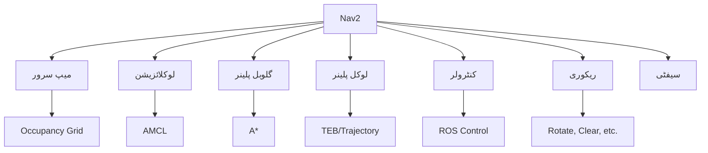

import MermaidDiagram from '@site/src/components/MermaidDiagram';
import Exercise from '@site/src/components/Exercise';
import Quiz from '@site/src/components/Quiz';
import PrerequisiteCheck from '@site/src/components/PrerequisiteCheck';


# باب 17: Nav2 اسٹیک جائزہ

## تعارف

نیویگیشن2 (Nav2) اسٹیک ROS 2 کے لیے معیاری نیویگیشن فریم ورک ہے، جو خودکار روبوٹ نیویگیشن کے لیے اوزاروں اور صلاحیتوں کا جامع سیٹ فراہم کرتا ہے۔ ROS 1 کے نیویگیشن اسٹیک کے جارج کے طور پر تیار کیا گیا، Nav2 بہتر آرکیٹیکچر، بہتر کارکردگی، اور مضبوط نیویگیشن سسٹمز ترقی دینے کے لیے اضافی خصوصیات پیش کرتا ہے۔ یہ باب Nav2 کی آرکیٹیکچر، اجزاء، اور عملی نفاذ کا جامع جائزہ فراہم کرتا ہے۔

## سیکھنے کے اہداف

اس باب کے اختتام تک، آپ کو اس بات کا اہل ہو جانا چاہیے:

- Nav2 آرکیٹیکچر اور اس کے کلیدی اجزاء کو سمجھنا
- مختلف روبوٹ پلیٹ فارم اور ماحول کے لیے Nav2 تشکیل دینا
- نیویگیشن کے رویے اور بحالی سسٹم نافذ کرنا
- بہترین کارکردگی کے لیے نیویگیشن پیرامیٹر ٹیون کرنا
- ڈیبگ اور نیویگیشن کے مسائل کو حل کرنا

## شرائطِ لازمہ

اس باب کا آغاز کرنے سے پہلے، یقین کر لیں کہ آپ کے پاس ہے:

- ماڈیول 1 مکمل (ROS 2 کی بنیاد، TF2)
- ماڈیول 3 باب 16 (نیویگیشن کے تصورات)
- ROS 2 ایکشنز اور سروسز کی بنیادی سمجھ
- ROS 2 میں پیرامیٹر تشکیل کا تجربہ

## حقیقی دنیا کی مثلاً: نیویگیشن آپریٹنگ سسٹم

Nav2 کو روبوٹ نیویگیشن کے لیے آپریٹنگ سسٹم کی طرح سمجھیں۔ جس طرح ایک کمپیوٹر آپریٹنگ سسٹم ہارڈ ویئر وسائل کا نظم کرتا ہے، ایپلی کیشنز کو خدمات فراہم کرتا ہے، اور سسٹم-لیول کے کاموں کو سنبھالتا ہے، اسی طرح Nav2 نیویگیشن وسائل کا نظم کرتا ہے، راستہ کی منصوبہ بندی اور مقام کاری کی خدمات فراہم کرتا ہے، اور سسٹم-لیول کے نیویگیشن کاموں کو سنبھالتا ہے۔ یہ نیویگیشن الگورتھم کی پیچیدگی کو چھپاتا ہے اور ہائی-لیول ایپلی کیشنز کے لیے ایک صاف انٹرفیس فراہم کرتا ہے تاکہ نیویگیشن کے مقاصد کی درخواست کی جا سکے اور حیثیت کی اپ ڈیٹس موصول کی جا سکیں۔

## بنیادی تصورات

### 1. Nav2 آرکیٹیکچر

Nav2 ایک بیہیویئر ٹری-بیسڈ آرکیٹیکچر پر عمل کرتا ہے جو لچکدار اور مضبوط نیویگیشن فراہم کرتا ہے:

- **بیہیویئر ٹریز**: نیویگیشن کے رویوں کے لیے سلسلہ وار کام کی انجام دہی
- **ایکشن سرورز**: نیویگیشن کی درخواستوں اور حیثیت کی اپ ڈیٹس کے لیے انٹرفیس
- **پلانرز**: عالمی اور مقامی راستہ کی منصوبہ بندی الگورتھم
- **کنٹرولرز**: روبوٹ موشن کنٹرول اور ٹریجکٹری فالوونگ
- **ریکوری سسٹم**: پھنسے یا ناکام نیویگیشن کے لیے رویہ بحالی

### 2. کلیدی اجزاء



### 3. Nav2 کے اہم ماڈیولز

| ماڈیول | کام | استعمال کا موقع |
|--------|-----|------------------|
| **میپ سرور** | میپ لوڈ کرنا اور شائع کرنا | 2D/3D ماحول کی نمائندگی |
| **AMCL** | ایڈاپٹو مونٹی کارلو مقام کاری | 2D مقام کاری |
| **گلوبل پلینر** | کم از کم قیمت والے راستے | منزل تک راستہ تلاش کرنا |
| **لوکل پلینر** | رکاوٹوں سے بچنا | حقیقی وقت میں راستہ |
| **کنٹرولر** | ٹریجکٹری کو فالو کرنا | روبوٹ موشن کنٹرول |

---

## Nav2 کی تشکیل

### YAML کنفیگریشن

Nav2 کو YAML فائلز کے ذریعے تشکیل دیا جاتا ہے:

```yaml
# Nav2 کی بنیادی تشکیل
bt_navigator:
  ros__parameters:
    use_sim_time: False
    global_frame: map
    robot_base_frame: base_link
    plugin_lib_names:
      - nav2_compute_path_to_pose_action_bt_node
      - nav2_follow_path_action_bt_node
      - nav2_back_up_action_bt_node
      - nav2_spin_action_bt_node
      - nav2_wait_action_bt_node

controller_server:
  ros__parameters:
    use_sim_time: False
    controller_frequency: 20.0
    min_x_velocity_threshold: 0.001
    min_y_velocity_threshold: 0.5
    min_theta_velocity_threshold: 0.001
    progress_checker_plugin: "progress_checker"
    goal_checker_plugin: "goal_checker"
    controller_plugins: ["FollowPath"]

    FollowPath:
      plugin: "nav2_mppi_controller::Controller"
      time_steps: 24
      control_frequency: 50.0
      velocity_scaling_factor: 1.0
```

### لانچ فائل

```xml
<!-- Nav2 لانچ فائل کی مثال -->
<launch>
  <!-- Nav2 نوڈس لانچ کریں -->
  <node pkg="nav2_map_server" exec="map_server" name="map_server">
    <param name="yaml_filename" value="$(var map_file)"/>
  </node>

  <node pkg="nav2_localization" exec="amcl" name="amcl"/>

  <node pkg="nav2_planner" exec="planner_server" name="planner_server"/>

  <node pkg="nav2_controller" exec="controller_server" name="controller_server"/>

  <node pkg="nav2_bt_navigator" exec="bt_navigator" name="bt_navigator"/>
</launch>
```

---

## Nav2 کے ساتھ کام کرنا

### نیویگیشن کی درخواست کرنا

```python
#!/usr/bin/env python3
# Nav2 کو نیویگیشن کی درخواست بھیجنے کے لیے
import rclpy
from rclpy.action import ActionClient
from rclpy.node import Node
from geometry_msgs.msg import PoseStamped
from nav2_msgs.action import NavigateToPose

class Nav2Client(Node):
    def __init__(self):
        super().__init__('nav2_client')
        self.action_client = ActionClient(
            self, NavigateToPose, 'navigate_to_pose'
        )

    def send_goal(self, x, y, theta):
        """نیویگیشن کا مقصد بھیجیں"""

        goal_msg = NavigateToPose.Goal()
        goal_msg.pose.header.frame_id = 'map'
        goal_msg.pose.header.stamp = self.get_clock().now().to_msg()
        goal_msg.pose.pose.position.x = x
        goal_msg.pose.pose.position.y = y
        goal_msg.pose.pose.orientation.z = theta

        self.action_client.wait_for_server()
        future = self.action_client.send_goal_async(goal_msg)
        future.add_done_callback(self.goal_response_callback)

    def goal_response_callback(self, future):
        """مقصد کا جواب حاصل کریں"""
        goal_handle = future.result()
        if not goal_handle.accepted:
            self.get_logger().info('مقصد قبول نہیں کیا گیا')
            return

        self.get_logger().info('مقصد قبول کر لیا گیا')
        result_future = goal_handle.get_result_async()
        result_future.add_done_callback(self.result_callback)

    def result_callback(self, future):
        """نتیجہ حاصل کریں"""
        result = future.result().result
        self.get_logger().info(f'نتیجہ: {result}')
```

### مقام کاری کو ٹیون کرنا

```python
# AMCL کو ٹیون کرنے کے لیے کوڈ
amcl_config = {
    "use_sim_time": False,
    "set_initial_pose": True,
    "initial_pose": {
        "x": 0.0,
        "y": 0.0,
        "z": 0.0,
        "yaw": 0.0
    },
    "tf_buffer_duration": 30.0,
    "alpha1": 0.2,      # اوڈوم ٹرانسلیشن سے متعلق
    "alpha2": 0.2,      # اوڈوم روٹیشن سے متعلق
    "alpha3": 0.2,      # اوڈوم ٹرانسلیشن سے متعلق
    "alpha4": 0.2,      # اوڈوم روٹیشن سے متعلق
    "alpha5": 0.2,      # اوڈوم سے متعلق
    "base_frame_id": "base_footprint",
    "beam_skip_distance": 0.5,
    "beam_skip_error_threshold": 0.9,
    "beam_skip_threshold": 0.3,
    "do_beamskip": False,
    "global_frame_id": "map",
    "lambda_short": 0.1,
    "laser_likelihood_max_dist": 2.0,
    "laser_max_range": 100.0,
    "laser_min_range": -1.0,
    "laser_model_type": "likelihood_field",
    "max_beams": 60,
    "max_particles": 2000,
    "min_particles": 500,
    "odom_frame_id": "odom",
    "pf_err": 0.05,
    "pf_z": 0.99,
    "recovery_alpha_fast": 0.0,
    "recovery_alpha_slow": 0.0,
    "resample_interval": 1,
    "robot_model_type": "nav2_amcl::DifferentialMotionModel",
    "save_pose_rate": 0.5,
    "sigma_hit": 0.2,
    "tf_service_timeout": 10.0,
    "transform_tolerance": 1.0,
    "update_min_a": 0.2,
    "update_min_d": 0.25,
    "z_hit": 0.5,
    "z_max": 0.05,
    "z_rand": 0.5,
    "z_short": 0.05
}
```

---

## نیویگیشن کی بحالی

Nav2 بحالی کے رویے فراہم کرتا ہے جب روبوٹ پھنس جاتا ہے یا نیویگیشن ناکام ہو جاتا ہے:

```yaml
# بحالی کی تشکیل
bt_navigator:
  ros__parameters:
    recovery_plugins: ["spin", "backup", "wait"]
    spin:
      plugin: "nav2_recoveries::Spin"
      sim_freq: 5
      angle: 1.57
    backup:
      plugin: "nav2_recoveries::BackUp"
      sim_freq: 5
      duration: 2.0
      vel: -0.1
    wait:
      plugin: "nav2_recoveries::Wait"
      sim_freq: 5
      duration: 5.0
```

---

## مشق

**Nav2 کی تشکیل**: ایک ڈفیرینشل ڈرائیو روبوٹ کے لیے Nav2 کی تشکیل کا تعین کریں:

1. **گلوبل پلینر**: A* الگورتھم
2. **لوکل پلینر**: TEB (Time Elastic Band)
3. **مقام کاری**: AMCL
4. **کنٹرولر**: MPPI کنٹرولر

<Quiz
  title="Nav2 اسٹیک جائزہ"
  questions={[
    {
      question: "Nav2 کون سا آرکیٹیکچر استعمال کرتا ہے؟",
      options: ["سٹیٹ مشین", "بیہیویئر ٹری", "فینیٹک الگورتھم", "نیورل نیٹ ورک"],
      answer: 1,
      explanation: "Nav2 بیہیویئر ٹری آرکیٹیکچر استعمال کرتا ہے"
    },
    {
      question: "AMCL کا مطلب کیا ہے؟",
      options: ["Adaptive Monte Carlo Localization", "Automatic Mapping and Control", "Advanced Motion Control Logic", "Adaptive Motion Control Localization"],
      answer: 0,
      explanation: "AMCL ایڈاپٹو مونٹی کارلو مقام کاری کا مختصر ہے"
    }
  ]}
/>
