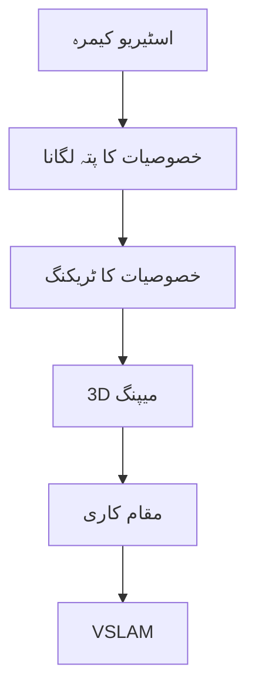

import MermaidDiagram from '@site/src/components/MermaidDiagram';
import CodeExample from '@site/src/components/CodeExample';
import Exercise from '@site/src/components/Exercise';
import Quiz from '@site/src/components/Quiz';
import TierBadge from '@site/src/components/TierBadge';

# ٹیئر سی ایکسٹینشن: یونیٹری ہیومنوائڈ روبوٹس پر VSLAM

<TierBadge tiers={["C"]} />

## یہ کیوں اہم ہے

بصری ہم آہنگ مقام کاری اور میپنگ (VSLAM) کو جسمانی ہیومنوائڈ روبوٹس پر ڈیپلائی کرنا سیمولیشن سے حقیقی دنیا کے آپریشن میں انتقال کی نمائندگی کرتا ہے۔ یونیٹری روبوٹس جیسے Go2 اور G1 VSLAM ریسرچ کے لیے بہترین پلیٹ فارم فراہم کرتے ہیں جن میں انٹیگریٹڈ اسٹیریو کیمرے، IMU، اور طاقتور آن بورڈ کمپیوٹ شامل ہیں۔ ان پلیٹ فارم پر VSLAM کو محفوظ طریقے سے ڈیپلائی کرنا ضروری ہے روبوٹکس ریسرچرز کے لیے جو غیر منظم ماحول میں خودکار نیویگیشن پر کام کر رہے ہیں۔

**ریل ورلڈ ایپلی کیشنز**:

- **تلاش اور بچاؤ**: بصری SLAM کا استعمال کرتے ہوئے آفت زدہ علاقوں کی خودکار تلاش
- **صنعتی معائنہ**: GPS-سے-مکمل طور پر محروم صنعتی اداروں میں نیویگیشن
- **صحت کی دیکھ بھال**: بزرگ دیکھ بھال اور ہسپتال کی ترسیل کے لیے اندر کا نیویگیشن
- **خلا کی تلاش**: غیر زمینی ماحول میں خودکار نیویگیشن

:::danger ہارڈ ویئر کی حفاظت
کسی بھی موتور کنٹرول کوڈ کو یونیٹری ہارڈ ویئر پر ڈیپلائی کرنے سے پہلے:
- یقین کریں کہ ہنگامی بندی کے طریقے کار آزمائش کیے گئے ہیں اور قابلِ رسائی ہیں
- 100ms ٹائم آؤٹ کے ساتھ ڈیڈ مین سوئچ پیٹرنز کی تصدیق کریں
- جسمانی ڈیپلائمنٹ سے پہلے سیمولیشن میں تمام حفاظت کی حدود کو ٹیسٹ کریں
- اگر ضرورت ہو تو دستی کنٹرول لینے کے لیے انسانی آپریٹر تیار رکھیں
- محفوظ آپریشنل باؤنڈریز اور ورک سپیس کنٹرولز برقرار رکھیں
:::

---

## VSLAM کے تصورات

### 1. VSLAM کے فوائد

- **کوائف کی ضرورت نہیں**: لیڈار کے مقابلے میں کوائف کی ضرورت نہیں
- **کم قیمت**: کیمرہ کے مقابلے میں لیڈار سستا
- **بصری تفصیل**: متن کی شناخت، رنگ، ٹیکسچر کے لیے
- **کم وقفہ**: ہلکا پھلکا ہارڈ ویئر

### 2. VSLAM کے چیلنجز

- **روشنی کی شرائط**: مختلف لائٹنگ کے تحت کم کارکردگی
- **خالی ماحول**: کوئی خصوصیات نہ ہوں
- **گھومتا ہوا ماحول**: خصوصیات کو ٹریک کرنا مشکل
- **کمپیوٹیشنل وسائل**: زیادہ پروسیسنگ کی ضرورت



---

## یونیٹری روبوٹ کی تیاری

### ہارڈ ویئر کنیکشن

```bash
# یونیٹری روبوٹ سے منسلک ہونے کے لیے
ssh unitree@10.10.10.10  # یونیٹری روبوٹ کا IP

# ROS 2 سیٹ اپ
source /opt/ros/humble/setup.bash
source ~/unitree_ros2/setup.bash
```

### VSLAM کی تشکیل

```yaml
# RTAB-Map کی تشکیل برائے یونیٹری روبوٹ
rtabmap:
  ros__parameters:
    use_sim_time: false
    # کیمرہ کی تشکیل
    rgb/image_transport: raw
    depth/image_transport: raw
    camera_info_topic: "/camera/camera_info"

    # VSLAM تشکیل
    rtabmap/subscribe_depth: true
    rtabmap/subscribe_scan: false
    rtabmap/subscribe_stereo: false

    # میپنگ کی تشکیل
    rtabmap/Vis/MinInliers: 5
    rtabmap/Vis/InlierDistance: 0.1
    rtabmap/RGBD/ProximityPathMaxNeighbors: 1
    rtabmap/RGBD/ProximityPathFilteringRadius: 0.1

    # کارکردگی کی تشکیل
    rtabmap/Mem/STMSize: 30
    rtabmap/Mem/LaserScanVoxelSize: 0.05
```

---

## VSLAM پائپ لائن

### ROS 2 نوڈ کے لیے کوڈ

```python
#!/usr/bin/env python3
# یونیٹری روبوٹ پر VSLAM نوڈ
import rclpy
from rclpy.node import Node
from sensor_msgs.msg import Image, CameraInfo
from cv_bridge import CvBridge
import cv2
import numpy as np

class VSLAMNode(Node):
    def __init__(self):
        super().__init__('vslam_node')

        # سبسکرائبرز
        self.image_sub = self.create_subscription(
            Image,
            '/camera/image_raw',
            self.image_callback,
            10
        )

        self.camera_info_sub = self.create_subscription(
            CameraInfo,
            '/camera/camera_info',
            self.camera_info_callback,
            10
        )

        # پبلیشرز
        self.vslam_pub = self.create_publisher(Image, '/vslam/visualization', 10)

        # کیمرہ کنٹرول
        self.bridge = CvBridge()
        self.camera_matrix = None
        self.dist_coeffs = None

        # VSLAM متغیرات
        self.prev_frame = None
        self.points_3d = []

        # ٹائمر (حفاظت کے لیے)
        self.timer = self.create_timer(0.1, self.safety_check)  # 100ms

    def image_callback(self, msg):
        """کیمرہ ڈیٹا کو سنبھالیں"""
        frame = self.bridge.imgmsg_to_cv2(msg, desired_encoding='bgr8')

        if self.prev_frame is not None:
            # فیچر ٹریکنگ
            features = self.track_features(self.prev_frame, frame)

            # 3D میپنگ
            if features is not None:
                self.update_3d_map(features)

        self.prev_frame = frame.copy()

        # VSLAM وژولائزیشن
        vslam_frame = self.visualize_vslam(frame)
        vslam_msg = self.bridge.cv2_to_imgmsg(vslam_frame, encoding='bgr8')
        self.vslam_pub.publish(vslam_msg)

    def track_features(self, prev_frame, curr_frame):
        """کیمرہ فریموں میں فیچرز کو ٹریک کریں"""
        # ORB فیچر ڈیٹکشن
        orb = cv2.ORB_create(nfeatures=1000)
        kp1, des1 = orb.detectAndCompute(prev_frame, None)
        kp2, des2 = orb.detectAndCompute(curr_frame, None)

        if des1 is not None and des2 is not None:
            # فیچر میچنگ
            bf = cv2.BFMatcher(cv2.NORM_HAMMING, crossCheck=True)
            matches = bf.match(des1, des2)
            matches = sorted(matches, key=lambda x: x.distance)

            if len(matches) >= 10:
                # ٹریک کیے گئے پوائنٹس
                src_points = np.float32([kp1[m.queryIdx].pt for m in matches]).reshape(-1, 1, 2)
                dst_points = np.float32([kp2[m.trainIdx].pt for m in matches]).reshape(-1, 1, 2)

                return {
                    'src': src_points,
                    'dst': dst_points,
                    'matches': matches
                }

        return None

    def update_3d_map(self, features):
        """3D میپ کو اپ ڈیٹ کریں"""
        # یہاں 3D میپنگ کا الگورتھم ہوگا
        # سادگی کے لیے، ہم صرف ٹریک کیے گئے فیچرز کو محفوظ کر رہے ہیں
        self.points_3d.append(features)

    def visualize_vslam(self, frame):
        """VSLAM وژولائزیشن تیار کریں"""
        # ٹریک کیے گئے فیچرز کو ظاہر کریں
        if self.prev_frame is not None:
            features = self.track_features(self.prev_frame, frame)
            if features is not None:
                for match in features['matches'][:20]:  # پہلے 20 میچز
                    pt = features['dst'][match.trainIdx].ravel()
                    cv2.circle(frame, (int(pt[0]), int(pt[1])), 3, (0, 255, 0), -1)

        return frame

    def safety_check(self):
        """حفاظت کی چیک کریں"""
        # ہنگامی بندی کے لیے چیک
        self.get_logger().info('VSLAM: حفاظت کی چیک کی گئی')

    def camera_info_callback(self, msg):
        """کیمرہ کی معلومات کو اپ ڈیٹ کریں"""
        self.camera_matrix = np.array(msg.k).reshape(3, 3)
        self.dist_coeffs = np.array(msg.d)

def main(args=None):
    rclpy.init(args=args)
    vslam_node = VSLAMNode()

    try:
        rclpy.spin(vslam_node)
    except KeyboardInterrupt:
        print("VSLAM نوڈ کو بند کیا جا رہا ہے")

    vslam_node.destroy_node()
    rclpy.shutdown()

if __name__ == '__main__':
    main()
```

---

## حفاظت-مرکزی کنٹرول

### ڈیڈ مین سوئچ کے لیے کوڈ

```python
#!/usr/bin/env python3
# یونیٹری روبوٹ کے لیے ڈیڈ مین سوئچ کنٹرول
import rclpy
from rclpy.node import Node
from std_msgs.msg import Bool
from geometry_msgs.msg import Twist
import time

class DeadManSwitch(Node):
    def __init__(self):
        super().__init__('dead_man_switch')

        # سبسکرائبرز
        self.cmd_vel_sub = self.create_subscription(
            Twist,
            '/cmd_vel',
            self.cmd_vel_callback,
            10
        )

        # پبلیشرز
        self.motor_enable_pub = self.create_publisher(Bool, '/motor/enable', 10)
        self.motor_cmd_pub = self.create_publisher(Twist, '/motor/cmd_vel', 10)

        # ڈیڈ مین سوئچ متغیرات
        self.last_cmd_time = time.time()
        self.motor_enabled = False
        self.timeout = 0.1  # 100ms

        # ٹائمر (حفاظت کے لیے)
        self.timer = self.create_timer(0.05, self.safety_timer)  # 50ms

    def cmd_vel_callback(self, msg):
        """کمانڈ ویل کو سنبھالیں"""
        current_time = time.time()
        self.last_cmd_time = current_time

        if not self.motor_enabled:
            self.enable_motors()

        # موتور کمانڈ بھیجیں
        self.motor_cmd_pub.publish(msg)

    def safety_timer(self):
        """حفاظت کا ٹائمر"""
        current_time = time.time()

        if current_time - self.last_cmd_time > self.timeout:
            if self.motor_enabled:
                self.disable_motors()
                self.get_logger().warn('ڈیڈ مین سوئچ: موتورز کو غیر فعال کیا گیا')
        else:
            if not self.motor_enabled:
                self.enable_motors()

    def enable_motors(self):
        """موتورز کو فعال کریں"""
        enable_msg = Bool()
        enable_msg.data = True
        self.motor_enable_pub.publish(enable_msg)
        self.motor_enabled = True
        self.get_logger().info('موتورز فعال کیے گئے')

    def disable_motors(self):
        """موتورز کو غیر فعال کریں"""
        enable_msg = Bool()
        enable_msg.data = False
        self.motor_enable_pub.publish(enable_msg)
        self.motor_enabled = False
        self.get_logger().info('موتورز غیر فعال کیے گئے')

def main(args=None):
    rclpy.init(args=args)
    dms_node = DeadManSwitch()

    try:
        rclpy.spin(dms_node)
    except KeyboardInterrupt:
        print("ڈیڈ مین سوئچ نوڈ کو بند کیا جا رہا ہے")

    dms_node.destroy_node()
    rclpy.shutdown()

if __name__ == '__main__':
    main()
```

---

## سیم-ٹو-ریئل ٹرانسفر

### ٹیسٹنگ کا عمل

```python
# سیم-ٹو-ریئل ٹرانسفر کے لیے ٹیسٹنگ
def test_sim_to_real_transfer():
    """سیمولیشن سے حقیقت تک ٹرانسفر کا جائزہ لیں"""

    test_scenarios = [
        {
            "name": "سادہ کمرہ",
            "description": "خالی کمرہ میں نیویگیشن",
            "success_criteria": "100% منزل تک پہنچنا"
        },
        {
            "name": "رکاوٹوں کے ساتھ",
            "description": "چند رکاوٹوں کے ساتھ نیویگیشن",
            "success_criteria": "90% رکاوٹوں سے بچنا"
        },
        {
            "name": "روشنی کی تبدیلی",
            "description": "مختلف لائٹنگ کے تحت نیویگیشن",
            "success_criteria": "80% کارکردگی"
        }
    ]

    results = []
    for scenario in test_scenarios:
        result = run_test_scenario(scenario)
        results.append({
            "scenario": scenario["name"],
            "result": result,
            "success": result >= 0.8  # 80% کامیابی کا معیار
        })

    return results
```

---

## مشق

**VSLAM کی منصوبہ بندی**: یونیٹری G1 روبوٹ کے لیے VSLAM کی منصوبہ بندی کریں:

1. **کیمرہ**: اسٹیریو کیمرہ (ZED یا RealSense)
2. **VSLAM الگورتھم**: ORB-SLAM یا RTAB-Map
3. **حفاظت کا کنٹرول**: 100ms ڈیڈ مین سوئچ
4. **کمپیوٹ**: Jetson Orin AGX

<Quiz
  title="VSLAM ہیومنوائڈ روبوٹس"
  questions={[
    {
      question: "VSLAM کا مطلب کیا ہے؟",
      options: ["ویژن سلیکٹڈ لوکلائزیشن اینڈ میپنگ", "بصری ہم آہنگ مقام کاری اور میپنگ", "ویژن سپورٹڈ لوکلائزیشن", "بصری سیف لوکلائزیشن اینڈ میپنگ"],
      answer: 1,
      explanation: "VSLAM بصری ہم آہنگ مقام کاری اور میپنگ کا مختصر ہے"
    },
    {
      question: "ڈیڈ مین سوئچ کا ٹائم آؤٹ کتنا ہونا چاہیے؟",
      options: ["50ms", "100ms", "200ms", "500ms"],
      answer: 1,
      explanation: "حفاظت کے لیے 100ms ڈیڈ مین سوئچ ٹائم آؤٹ استعمال کیا جاتا ہے"
    }
  ]}
/>