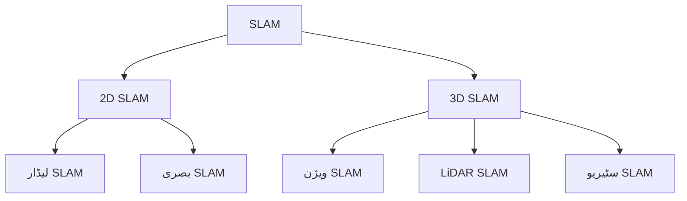

import MermaidDiagram from '@site/src/components/MermaidDiagram';
import Exercise from '@site/src/components/Exercise';
import Quiz from '@site/src/components/Quiz';
import PrerequisiteCheck from '@site/src/components/PrerequisiteCheck';


# باب 18: SLAM کی بنیاد

## تعارف

ہم آہنگ مقام کاری اور میپنگ (SLAM) روبوٹکس میں سب سے چیلنجنگ اور بنیادی مسائل میں سے ایک ہے۔ SLAM روبوٹس کو ایک نامعلوم ماحول کی میپ تیار کرنے کے قابل بناتا ہے جبکہ اسی وقت اس میپ کے اندر اپنی پوزیشن کا تعین کرتا ہے۔ یہ چکن اینڈ اینڈ مسئلہ دہائیوں سے روبوٹکس ریسرچ کا ایک ستون رہا ہے اور واقعی خودکار روبوٹس کے لیے ضروری ہے جو پہلے سے غیر میپ کیے گئے ماحول میں کام کرتے ہیں۔

## سیکھنے کے اہداف

اس باب کے اختتام تک، آپ کو اس بات کا اہل ہو جانا چاہیے:

- SLAM کے بنیادی تصورات اور چیلنجز کی وضاحت کرنا
- مختلف SLAM الگورتھم اور ان کے ٹریڈ آف کو سمجھنا
- مختلف سینسر ماڈلیٹیز کا استعمال کرتے ہوئے SLAM سسٹم کا بنیادی نفاذ
- مضبوط میپنگ اور مقام کاری کے لیے سینسر ڈیٹا کا انضمام
- SLAM سسٹم کارکردگی اور درستگی کا جائزہ لینا

## شرائطِ لازمہ

اس باب کا آغاز کرنے سے پہلے، یقین کر لیں کہ آپ کے پاس ہے:

- ماڈیول 1 مکمل (ROS 2 کی بنیاد، TF2، سینسرز)
- ماڈیول 2 (سینسر سیمولیشن کے تصورات)
- ماڈیول 3 باب 16 (نیویگیشن کے تصورات)
- امکان اور اعداد و شمار کی بنیادی سمجھ
- سینسر ڈیٹا پروسیسنگ کا تجربہ

## حقیقی دنیا کی مثلاً: تلاش کرنے والا مسافر

SLAM کو ایک نامعلوم زمین میں ایک مسافر کی طرح سمجھیں جس کے پاس ایک قطب نما، پیمائش کے اوزار، اور میپس بنانے کی صلاحیت ہے۔ مسافر کو اس وقت ایک ساتھ کرنا چاہیے: زمین کا نقشہ بنانا جو وہ دریافت کرتا ہے، میپ پر اپنی موجودہ جگہ کا تعین کرنا، اور وہ راستہ یاد رکھنا جس پر وہ چلا۔ چیلنج یہ ہے کہ مسافر کا پوزیشن ایسٹیمیٹ میپ کو متاثر کرتا ہے، اور میپ کی معیار پوزیشن کی درستگی کو متاثر کرتی ہے - انہیں دونوں مسائل کو ایک ساتھ حل کرنا چاہیے ناقص اوزار اور پیمائش کے ساتھ۔

## بنیادی تصورات

### 1. SLAM مسئلہ

SLAM مسئلہ ریاضیاتی طور پر اس طرح بیان کیا جا سکتا ہے کہ روبوٹ کے راستے اور نشانیوں کے نقشے کا تخمینہ لگانا:

- **اسٹیٹ ایسٹیمیشن**: روبوٹ کی پوزیشنز اور نشانیوں کی پوزیشنز کا تخمینہ
- **ڈیٹا ایسوسی ایشن**: سینسر کے مشاہدات کو جانا ہوا نشانیوں سے ملا دیں
- **لوپ کلوزر**: ڈرائیف کو درست کرنے کے لیے پہلے سے ملاقات کی ہوئی جگہوں کو پہچاننا

### 2. SLAM کی اقسام



| قسم | سینسر | استعمال کا موقع | فائدے | کمیاں |
|-----|-------|------------------|--------|--------|
| **لیڈار SLAM** | لیڈار | انڈور/آؤٹ ڈور | ہائی پریکشان، ہمیشہ کام کرتا ہے | مہنگا، وزنی |
| **بصری SLAM** | کیمرہ | انڈور | سستا، ہلکا | لائٹنگ پر انحصار |
| **IMU SLAM** | IMU | متحرک ماحول | فاسٹ، ہمیشہ کام کرتا ہے | ڈرائیف |

### 3. SLAM کے الگورتھم

1. **EKF SLAM**: ایکسٹینڈیڈ کیلمن فلٹر
2. **PF SLAM**: پارٹیکل فلٹر/مینٹی کارلو
3. **Graph SLAM**: گراف آپٹیمائزیشن
4. **FAST SLAM**: فیکٹرائزڈ SLAM

---

## SLAM کے الگورتھم

### EKF SLAM (ایکسٹینڈیڈ کیلمن فلٹر SLAM)

EKF SLAM ایک جامع ایپروچ ہے جو SLAM مسئلے کو حل کرنے کے لیے کیلمن فلٹر استعمال کرتا ہے:

```python
import numpy as np

class EKFSLAM:
    def __init__(self, robot_state_dim, landmark_dim, num_landmarks):
        self.state_dim = robot_state_dim + num_landmarks * landmark_dim
        self.robot_state_dim = robot_state_dim
        self.landmark_dim = landmark_dim
        self.num_landmarks = num_landmarks

        # حالت کو میٹرکس
        self.mu = np.zeros(self.state_dim)  # اوسط
        self.sigma = np.eye(self.state_dim)  # کواریئنس میٹرکس

    def prediction_step(self, control, dt):
        """پیش گوئی کا مرحلہ"""
        # روبوٹ کی حالت کی تبدیلی
        # اس کے مطابق میٹرکس کو اپ ڈیٹ کریں
        pass

    def update_step(self, observations):
        """اپ ڈیٹ کا مرحلہ"""
        for obs in observations:
            # مشاہدہ کے ساتھ کواریئنس اور اوسط کو اپ ڈیٹ کریں
            pass
```

### PF SLAM (پارٹیکل فلٹر SLAM)

PF SLAM ایک متبادل ایپروچ ہے جو مینٹی کارلو تکنیکس استعمال کرتا ہے:

```python
class ParticleFilterSLAM:
    def __init__(self, num_particles, robot_state_dim, num_landmarks):
        self.num_particles = num_particles
        self.robot_state_dim = robot_state_dim
        self.num_landmarks = num_landmarks

        # پارٹیکلز کو شروع کریں
        self.particles = []
        self.weights = np.ones(num_particles) / num_particles

        for _ in range(num_particles):
            # رینڈم حالت کے ساتھ پارٹیکل شامل کریں
            particle = {
                'robot_state': np.random.random(robot_state_dim),
                'landmarks': np.random.random((num_landmarks, 2))
            }
            self.particles.append(particle)

    def prediction_step(self, control, noise):
        """ہر پارٹیکل کے لیے پیش گوئی"""
        for i in range(self.num_particles):
            # کنٹرول اور نوائز کے ساتھ حالت کو اپ ڈیٹ کریں
            pass

    def update_step(self, observations):
        """ہر پارٹیکل کے لیے اپ ڈیٹ"""
        for i in range(self.num_particles):
            weight = 1.0
            for obs in observations:
                # مشاہدہ کے ساتھ وزن کا حساب لگائیں
                weight *= self.calculate_observation_likelihood(obs, i)
            self.weights[i] = weight

        # وزن کو نارملائز کریں
        self.weights = self.weights / np.sum(self.weights)
```

---

## گراف SLAM

گراف SLAM ایک جدید ایپروچ ہے جو SLAM کو ایک آپٹیمائزیشن مسئلہ کے طور پر حل کرتا ہے:

```python
import numpy as np
from scipy.optimize import minimize

class GraphSLAM:
    def __init__(self):
        self.nodes = []  # روبوٹ کی پوزیشنز
        self.edges = []  # روبوٹ کے درمیان اور نشانیوں کے ساتھ رابطے

    def add_constraint(self, from_node, to_node, measurement, information_matrix):
        """گراف میں رابطہ شامل کریں"""
        edge = {
            'from': from_node,
            'to': to_node,
            'measurement': measurement,
            'information': information_matrix
        }
        self.edges.append(edge)

    def optimize(self):
        """گراف کو آپٹیمائز کریں"""
        # SLAM کو ایک غیر لکیری آپٹیمائزیشن کے طور پر حل کریں
        def objective_function(x):
            total_error = 0.0
            for edge in self.edges:
                # رابطے کی غلطی کا حساب لگائیں
                error = self.calculate_edge_error(edge, x)
                total_error += error.T @ edge['information'] @ error
            return total_error

        # آپٹیمائز کریں
        result = minimize(objective_function, x0=self.get_initial_guess())
        return result.x
```

---

## سینسر فیوژن SLAM

### لیڈار SLAM

```python
class LidarSLAM:
    def __init__(self):
        self.map = np.zeros((100, 100))  # آکوپنسی گرڈ
        self.robot_pose = np.array([0, 0, 0])  # x, y, theta

    def process_scan(self, scan_data):
        """لیڈار اسکین کو عمل کریں"""
        # لیڈار اسکین سے میپ اپ ڈیٹ کریں
        for i, range_reading in enumerate(scan_data.ranges):
            if range_reading < scan_data.range_max:
                # پولر کو کارٹیشن میں تبدیل کریں
                angle = scan_data.angle_min + i * scan_data.angle_increment
                x = self.robot_pose[0] + range_reading * np.cos(self.robot_pose[2] + angle)
                y = self.robot_pose[1] + range_reading * np.sin(self.robot_pose[2] + angle)

                # میپ کو اپ ڈیٹ کریں
                self.update_map_occupancy(x, y, occupied=True)

    def update_map_occupancy(self, x, y, occupied):
        """میپ کو اپ ڈیٹ کریں"""
        # گرڈ کو اپ ڈیٹ کریں
        grid_x = int(x + self.map.shape[0] / 2)
        grid_y = int(y + self.map.shape[1] / 2)

        if 0 <= grid_x < self.map.shape[0] and 0 <= grid_y < self.map.shape[1]:
            if occupied:
                self.map[grid_x, grid_y] = 1.0  # مصروف
            else:
                self.map[grid_x, grid_y] = 0.0  # خالی
```

### بصری SLAM

```python
import cv2

class VisualSLAM:
    def __init__(self):
        self.orb = cv2.ORB_create()
        self.bf = cv2.BFMatcher(cv2.NORM_HAMMING, crossCheck=True)
        self.prev_frame = None
        self.prev_kp = None
        self.prev_des = None

    def process_frame(self, frame):
        """فریم کو عمل کریں"""
        # فیچر ڈیٹکشن
        kp, des = self.orb.detectAndCompute(frame, None)

        if self.prev_frame is not None and des is not None and self.prev_des is not None:
            # فیچر میچنگ
            matches = self.bf.match(self.prev_des, des)
            matches = sorted(matches, key=lambda x: x.distance)

            if len(matches) >= 10:
                # ٹریک کیے گئے فیچرز
                src_points = np.float32([self.prev_kp[m.queryIdx].pt for m in matches]).reshape(-1, 1, 2)
                dst_points = np.float32([kp[m.trainIdx].pt for m in matches]).reshape(-1, 1, 2)

                # ہوموگرافی کا حساب
                H, mask = cv2.findHomography(src_points, dst_points, cv2.RANSAC, 5.0)

                # روبوٹ کی پوزیشن کا تخمینہ
                if H is not None:
                    # ہوموگرافی سے پوزیشن کا تخمینہ
                    self.estimate_pose_from_homography(H)

        # موجودہ فریم کو پچھلے کے طور پر محفوظ کریں
        self.prev_frame = frame.copy()
        self.prev_kp = kp
        self.prev_des = des

    def estimate_pose_from_homography(self, H):
        """ہوموگرافی سے پوزیشن کا تخمینہ"""
        # ہوموگرافی سے 3D ٹرانسفارم حاصل کریں
        pass
```

---

## مشق

**SLAM کا موازنہ**: مختلف SLAM الگورتھم کے درمیان موازنہ کریں:

| الگورتھم | کمپیوٹیشنل کارکردگی | درستگی | استحکام | استعمال کا موقع |
|----------|----------------------|---------|---------|------------------|
| EKF SLAM | میڈیم | اچھا | محدود | چھوٹے ماحول |
| PF SLAM | اونچا | اچھا | اچھا | مہنگا کمپیوٹ |
| Graph SLAM | اونچا | بہترین | اچھا | بڑے ماحول |

<Quiz
  title="SLAM کی بنیاد"
  questions={[
    {
      question: "SLAM کا مطلب کیا ہے؟",
      options: ["سیم لائف ایکسٹینشن", "ہم آہنگ مقام کاری اور میپنگ", "سینسر لائف میپنگ", "سٹیٹ لائف ایپلی کیشن"],
      answer: 1,
      explanation: "SLAM ہم آہنگ مقام کاری اور میپنگ کا مختصر ہے"
    },
    {
      question: "EKF SLAM کیا استعمال کرتا ہے؟",
      options: ["کیلمن فلٹر", "پارٹیکل فلٹر", "گراف آپٹیمائزیشن", "نیورل نیٹ ورک"],
      answer: 0,
      explanation: "EKF SLAM ایکسٹینڈیڈ کیلمن فلٹر استعمال کرتا ہے"
    }
  ]}
/>
