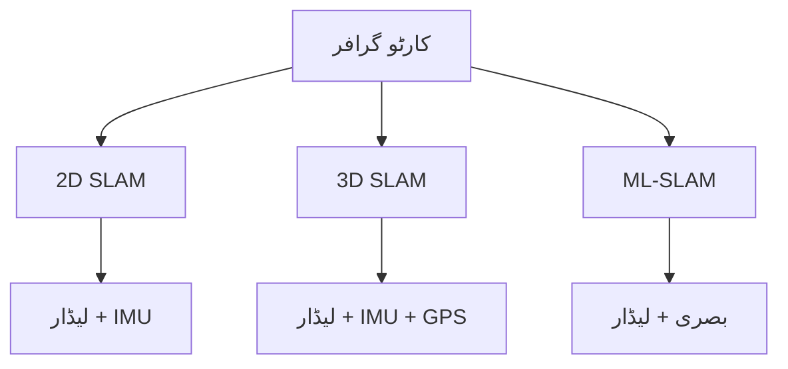

import MermaidDiagram from '@site/src/components/MermaidDiagram';
import Exercise from '@site/src/components/Exercise';
import Quiz from '@site/src/components/Quiz';
import PrerequisiteCheck from '@site/src/components/PrerequisiteCheck';  

# باب 19: جی میپنگ اور کارٹو گرافر

## تعارف

جی میپنگ اور کارٹو گرافر روبوٹکس میں سب سے زیادہ استعمال ہونے والے SLAM نفاذ کی نمائندگی کرتے ہیں۔ جی میپنگ، راؤ-بلاک ویلائزڈ پارٹیکل فلٹر پر مبنی، زمینی گاڑیوں کے لیے مضبوط 2D لیزر-بیسڈ میپنگ فراہم کرتا ہے۔ کارٹو گرافر، گوگل کے ذریعے تیار کیا گیا، 2D اور 3D میپنگ کی حمایت کے ساتھ ایڈوانسڈ ملٹی-سینسر SLAM صلاحیات پیش کرتا ہے۔ یہ باب دونوں سسٹم، ان کی تشکیل، ٹیوننگ، اور عملی ڈیپلائمنٹ پر غور کرتا ہے۔

## سیکھنے کے اہداف

اس باب کے اختتام تک، آپ کو اس بات کا اہل ہو جانا چاہیے:

- 2D لیزر SLAM کارکردگی کو بہتر بنانے کے لیے جی میپنگ تشکیل دینا اور ٹیون کرنا
- ملٹی-سینسر SLAM ایپلی کیشنز کے لیے کارٹو گرافر نافذ کرنا
- مختلف SLAM ایپروچز کا موازنہ کرنا اور ایپلی کیشنز کے لیے مناسب سسٹم منتخب کرنا
- مناسب سینسر انضمام کے ساتھ حقیقی روبوٹ پلیٹ فارم پر SLAM سسٹم ڈیپلائی کرنا

## شرائطِ لازمہ

اس باب کا آغاز کرنے سے پہلے، یقین کر لیں کہ آپ کے پاس ہے:

- ماڈیول 1 مکمل (ROS 2 کی بنیاد، TF2)
- ماڈیول 3 باب 18 (SLAM کی بنیاد)
- ROS 2 پیرامیٹر تشکیل کا تجربہ
- سینسر ڈیٹا کی اقسام (لیڈار، IMU، اودومیٹری) کی سمجھ

## حقیقی دنیا کی مثلاً: مختلف کاموں کے لیے مختلف میپنگ ٹولز

جی میپنگ اور کارٹو گرافر کو ایک سروے ایکسپرٹ کے ٹول کٹ میں مختلف ٹولز کی طرح سمجھیں۔ جی میپنگ ایک قابل اعتماد ٹوٹل اسٹیشن کی طرح ہے - جہاں آپ کے پاس اچھی اودومیٹری اور مسلسل لیزر واپسی ہو اس جیسے منظم ماحول میں 2D پیمائش اور میپنگ کے لیے عمدہ۔ کارٹو گرافر ایک جدید لیڈار سکینر کی طرح ہے جس میں IMU انضمام کے ساتھ - 3D میپس تیار کرنے کے قابل ہے بھلے ہی تیزی سے حرکت کر رہا ہو یا مشکل ماحول میں جہاں روایتی اودومیٹری ناکام ہو جائے۔ ہر ٹول کے اپنے مضبوطیاں ہیں اور مختلف منظرناموں کے لیے مناسب ہیں۔

## بنیادی تصورات

### 1. جی میپنگ: پارٹیکل فلٹر SLAM

جی میپنگ راؤ-بلاک ویلائزڈ پارٹیکل فلٹر SLAM نافذ کرتا ہے جو خاص طور پر 2D لیزر رینج فائنڈرز کے لیے ڈیزائن کیا گیا ہے:

- **پارٹیکل فلٹر**: روبوٹ کی پوزیشن کے تخمینے میں عدم یقینی کو سنبھالتا ہے
- **گرڈ میپنگ**: لیزر ڈیٹا سے آکوپنسی گرڈ میپس تیار کرتا ہے
- **سکین میچنگ**: پوزیشن کے تخمینے کو بہتر بنانے کے لیے لیزر اسکینس کو ایلائن کرتا ہے
- **لوپ کلوزر**: ڈرائیف کو درست کرنے کے لیے دوبارہ ملاقات کی ہوئی جگہوں کو پہچانتا ہے

### 2. کارٹو گرافر: ایڈوانسڈ ملٹی-سینسر SLAM

کارٹو گرافر متعدد سینسر SLAM کے ساتھ جدید صلاحیات فراہم کرتا ہے:



| خصوصیت | جی میپنگ | کارٹو گرافر |
|---------|----------|--------------|
| 2D میپنگ | ہاں | ہاں |
| 3D میپنگ | نہیں | ہاں |
| ملٹی-سینسر | لیڈار صرف | لیڈار، IMU، GPS |
| کارکردگی | اچھی | بہترین |
| کمپیوٹیشنل وسائل | کم | اونچے |
| ٹیوننگ | آسان | مشکل |

---

## جی میپنگ کی تشکیل

### YAML کنفیگریشن

```yaml
# جی میپنگ کی بنیادی تشکیل
slam_gmapping:
  ros__parameters:
    # عام پیرامیٹر
    use_sim_time: false
    base_frame: "base_link"
    map_frame: "map"
    odom_frame: "odom"
    scan_topic: "/scan"

    # جی میپنگ مخصوص پیرامیٹر
    map_update_interval: 2.0  # سیکنڈ
    maxUrange: 12.0           # زیادہ سے زیادہ رینج (میٹر)
    sigma: 0.05               # میچنگ کی درستگی
    kernelSize: 1             # کرنل سائز
    lstep: 0.05               # لینیئر اسٹیپ (میٹر)
    astep: 0.05               # زاویہ اسٹیپ (ریڈین)
    iterations: 5             # اسٹیپ کی تعداد
    lsigma: 0.075             # لیزر نوائز
    ogain: 3.0                # آڈومیٹر کا اثر
    lskip: 0                  # چھوڑے ہوئے اسکین کی تعداد
    minimumScore: 50.0        # کم از کم اسکور
    srr: 0.1                  # اوڈومیٹر کا ٹرانسلیشن نوائز
    srt: 0.2                  # اوڈومیٹر کا ٹرانسلیشن-روٹیشن نوائز
    str: 0.1                  # اوڈومیٹر کا روٹیشن-ٹرانسلیشن نوائز
    stt: 0.2                  # اوڈومیٹر کا روٹیشن نوائز

    # پارٹیکل فلٹر پیرامیٹر
    particles: 30             # پارٹیکلز کی تعداد
    angularUpdate: 0.5        # زاویہ اپ ڈیٹ (ریڈین)
    linearUpdate: 1.0         # لینیئر اپ ڈیٹ (میٹر)
    resampleThreshold: 0.5    # ریسمپل تھریشولڈ
    xmin: -100.0              # میپ کا کم از کم x
    ymin: -100.0              # میپ کا کم از کم y
    xmax: 100.0               # میپ کا زیادہ سے زیادہ x
    ymax: 100.0               # میپ کا زیادہ سے زیادہ y
    delta: 0.05               # ریزولوشن (میٹر/سیل)
    occ_thresh: 0.25          # مصروف تھریشولڈ
    llsamplerange: 0.01       # لانگ لیٹرل سیمپل رینج
    llsamplestep: 0.01        # لانگ لیٹرل سیمپل سٹیپ
    lasamplerange: 0.005      # لانگ اینگولر سیمپل رینج
    lasamplestep: 0.005       # لانگ اینگولر سیمپل سٹیپ
```

### ROS 2 لانچ فائل

```xml
<!-- جی میپنگ لانچ فائل -->
<launch>
  <!-- SLAM نوڈ لانچ کریں -->
  <node pkg="slam_gmapping" exec="slam_gmapping" name="slam_gmapping">
    <param from="$(find_prefix slam_gmapping)/config/gmapping.yaml"/>
  </node>

  <!-- میپ سرور لانچ کریں -->
  <node pkg="nav2_map_server" exec="map_server" name="map_server">
    <param name="yaml_filename" value="map.yaml"/>
  </node>
</launch>
```

---

## کارٹو گرافر کی تشکیل

### کارٹو گرافر کنفیگ فائل

```lua
-- کارٹو گرافر 2D SLAM کنفیگ
options = {
  tracking_frame = "base_link",
  published_frame = "odom",
  map_frame = "map",
  odom_frame = "odom",
  provide_odom_frame = true,
  use_odometry = true,
  use_nav_sat = false,
  use_landmarks = false,
  num_laser_scans = 1,
  num_multi_echo_laser_scans = 0,
  num_subdivisions_per_laser_scan = 1,
  num_point_clouds = 0,
  lookup_transform_timeout_sec = 0.2,
  submap_publish_period_sec = 0.3,
  pose_publish_period_sec = 5e-3,
  trajectory_publish_period_sec = 30e-3,
  rangefinder_sampling_ratio = 1.,
  odometry_sampling_ratio = 1.,
  fixed_frame_pose_sampling_ratio = 1.,
  imu_sampling_ratio = 1.,
  landmarks_sampling_ratio = 1.,
}

MAP_BUILDER = {
  use_trajectory_builder_2d = true,
  num_background_threads = 4,
  trajectory_builder_2d = {
    use_imu_data = true,
    use_online_correlative_scan_matching = true,
    real_time_correlative_scan_matcher = {
      linear_search_window = 0.1,
      angular_search_window = math.rad(20.),
      translation_delta_cost_weight = 1e-1,
      rotation_delta_cost_weight = 1e-1,
    },
    ceres_scan_matcher = {
      occupied_space_weight = 20.,
      translation_weight = 10.,
      rotation_weight = 1.,
      ceres_solver_options = {
        use_nonmonotonic_steps = true,
        max_num_iterations = 20,
        num_threads = 1,
      },
    },
    motion_filter = {
      max_distance_meters = 0.5,
      max_angle_radians = math.rad(50.),
    },
    imu_gravity_time_constant = 10.,
    pose_extrapolator_options = {
      use_imu_based = true,
      constant_velocity_model_position_data_types_variance = 0.0001,
      constant_velocity_model_orientation_data_types_variance = 0.001,
    },
  },
}

POSE_GRAPH = {
  optimize_every_n_nodes = 90,
  constraint_builder = {
    sampling_ratio = 0.3,
    max_constraint_distance = 15.,
    min_score = 0.55,
    global_localization_min_score = 0.6,
    loop_closure_translation_weight = 1.1e4,
    loop_closure_rotation_weight = 1.1e4,
    log_matches = true,
    fast_correlative_scan_matcher = {
      linear_search_window = 7.,
      angular_search_window = math.rad(30.),
      branch_and_bound_depth = 7,
    },
    ceres_scan_matcher = {
      occupied_space_weight = 20.,
      translation_weight = 10.,
      rotation_weight = 1.,
      ceres_solver_options = {
        use_nonmonotonic_steps = false,
        max_num_iterations = 10,
        num_threads = 1,
      },
    },
  },
  matcher_translation_weight = 5e2,
  matcher_rotation_weight = 1.6e3,
  optimization_problem = {
    huber_scale = 1e1,
    acceleration_weight = 1e3,
    rotation_weight = 3e2,
    local_slam_pose_translation_weight = 1e5,
    local_slam_pose_rotation_weight = 1e5,
    odometry_translation_weight = 1e5,
    odometry_rotation_weight = 1e5,
    fixed_frame_pose_translation_weight = 1e1,
    fixed_frame_pose_rotation_weight = 1e2,
    log_solver_summary = false,
    ceres_solver_options = {
      use_nonmonotonic_steps = false,
      max_num_iterations = 50,
      num_threads = 7,
    },
  },
  global_sampling_ratio = 0.003,
  log_residual_histograms = true,
  global_constraint_search_after_n_seconds = 10.,
}

return options
```

---

## جی میپنگ کا نفاذ

### ROS 2 نوڈ کے لیے کوڈ

```python
#!/usr/bin/env python3
# جی میپنگ کنٹرول نوڈ
import rclpy
from rclpy.node import Node
from sensor_msgs.msg import LaserScan
from nav_msgs.msg import OccupancyGrid, Odometry
from geometry_msgs.msg import PoseWithCovarianceStamped
import tf2_ros
import numpy as np

class GMappingNode(Node):
    def __init__(self):
        super().__init__('gmapping_node')

        # سبسکرائبرز
        self.scan_sub = self.create_subscription(
            LaserScan,
            '/scan',
            self.scan_callback,
            10
        )

        self.odom_sub = self.create_subscription(
            Odometry,
            '/odom',
            self.odom_callback,
            10
        )

        # پبلیشرز
        self.map_pub = self.create_publisher(OccupancyGrid, '/map', 10)
        self.map_metadata_pub = self.create_publisher(
            OccupancyGrid, '/map_metadata', 10
        )

        # TF لسینر
        self.tf_buffer = tf2_ros.Buffer()
        self.tf_listener = tf2_ros.TransformListener(self.tf_buffer, self)

        # جی میپنگ متغیرات
        self.map_resolution = 0.05  # میٹر/سیل
        self.map_width = 400        # سیلز
        self.map_height = 400       # سیلز
        self.map_origin_x = -10.0   # میٹر
        self.map_origin_y = -10.0   # میٹر

        # ابتدائی میپ
        self.occupancy_grid = np.zeros((self.map_width, self.map_height))

        # ٹائمر (میپ اپ ڈیٹ کے لیے)
        self.timer = self.create_timer(1.0, self.publish_map)

    def scan_callback(self, msg):
        """لیزر اسکین کو سنبھالیں"""
        # لیزر ڈیٹا کو پروسیس کریں اور میپ کو اپ ڈیٹ کریں
        for i, range_reading in enumerate(msg.ranges):
            if msg.range_min <= range_reading <= msg.range_max:
                # لیزر کے زاویے کا حساب
                angle = msg.angle_min + i * msg.angle_increment

                # لیزر پوائنٹ کو وورلڈ میں تبدیل کریں
                laser_x = range_reading * np.cos(angle)
                laser_y = range_reading * np.sin(angle)

                # روبوٹ کے ٹی ایف کو حاصل کریں
                try:
                    trans = self.tf_buffer.lookup_transform(
                        'map', 'base_link', rclpy.time.Time()
                    )

                    # وورلڈ کوآرڈینیٹس
                    world_x = laser_x + trans.transform.translation.x
                    world_y = laser_y + trans.transform.translation.y

                    # میپ کوآرڈینیٹس
                    map_x = int((world_x - self.map_origin_x) / self.map_resolution)
                    map_y = int((world_y - self.map_origin_y) / self.map_resolution)

                    # میپ کو اپ ڈیٹ کریں
                    if 0 <= map_x < self.map_width and 0 <= map_y < self.map_height:
                        self.occupancy_grid[map_x, map_y] = 100  # مصروف

                except tf2_ros.TransformException as ex:
                    self.get_logger().warn(f'TF lookup failed: {ex}')

    def odom_callback(self, msg):
        """اوڈومیٹری کو سنبھالیں"""
        # اوڈومیٹری ڈیٹا کو استعمال کریں
        pass

    def publish_map(self):
        """میپ شائع کریں"""
        msg = OccupancyGrid()
        msg.header.stamp = self.get_clock().now().to_msg()
        msg.header.frame_id = 'map'

        # میٹا ڈیٹا
        msg.info.resolution = self.map_resolution
        msg.info.width = self.map_width
        msg.info.height = self.map_height
        msg.info.origin.position.x = self.map_origin_x
        msg.info.origin.position.y = self.map_origin_y
        msg.info.origin.position.z = 0.0
        msg.info.origin.orientation.x = 0.0
        msg.info.origin.orientation.y = 0.0
        msg.info.origin.orientation.z = 0.0
        msg.info.origin.orientation.w = 1.0

        # ڈیٹا
        msg.data = self.occupancy_grid.flatten().tolist()

        self.map_pub.publish(msg)
        self.get_logger().info('میپ شائع کیا گیا')

def main(args=None):
    rclpy.init(args=args)
    gmapping_node = GMappingNode()

    try:
        rclpy.spin(gmapping_node)
    except KeyboardInterrupt:
        print("جی میپنگ نوڈ کو بند کیا جا رہا ہے")

    gmapping_node.destroy_node()
    rclpy.shutdown()

if __name__ == '__main__':
    main()
```

---

## کارٹو گرافر کا نفاذ

### کارٹو گرافر لانچ کرنا

```bash
# کارٹو گرافر 2D SLAM کو چلانا
ros2 launch cartographer_ros cartographer_occupancy_grid.launch.py

# کارٹو گرافر 3D SLAM کو چلانا
ros2 launch cartographer_ros cartographer_3d.launch.py
```

### کارٹو گرافر کے لیے لانچ فائل

```xml
<!-- کارٹو گرافر لانچ فائل -->
<launch>
  <!-- کارٹو گرافر نوڈ -->
  <node pkg="cartographer_ros" exec="cartographer_node" name="cartographer_node">
    <param name="configuration_directory" value="$(find_prefix my_robot_description)/config"/>
    <param name="configuration_basename" value="my_robot_2d.lua"/>
  </node>

  <!-- اسکین میکر -->
  <node pkg="cartographer_ros" exec="occupancy_grid_node" name="occupancy_grid_node">
    <param name="resolution" value="0.05"/>
  </node>
</launch>
```

---

## موازنہ اور ٹیوننگ

### ٹیوننگ کے اصول

| پیرامیٹر | جی میپنگ | کارٹو گرافر | اثر |
|----------|----------|--------------|------|
| پارٹیکلز | 30-100 | N/A | استحکام |
| اپ ڈیٹ کا وقت | 1-5s | 0.1-1s | کارکردگی |
| ریزولوشن | 0.05-0.2m | 0.02-0.1m | معیار |
| لوپ کلوزر | ہاں | ہاں | ڈرائیف کی اصلاح |

### ٹیوننگ کے ٹولز

```bash
# جی میپنگ کو ٹیون کرنے کے لیے
ros2 param set /slam_gmapping particles 50
ros2 param set /slam_gmapping map_update_interval 1.0

# کارٹو گرافر کو ٹیون کرنے کے لیے
# Lua کنفیگ فائلز میں تبدیلی کریں
```

---

## مشق

**SLAM سسٹم کا انتخاب**: مختلف ایپلی کیشنز کے لیے SLAM سسٹم کا انتخاب کریں:

1. **انڈور گاڑی**: جی میپنگ (سادہ، قابل اعتماد)
2. **3D ڈیٹا کی ضرورت**: کارٹو گرافر (3D صلاحیات)
3. **کم وسائل**: جی میپنگ (کم کمپیوٹیشنل وسائل)
4. **کار کے اندر**: کارٹو گرافر (ملٹی-سینسر)

<Quiz
  title="جی میپنگ اور کارٹو گرافر"
  questions={[
    {
      question: "کون سا SLAM سسٹم 3D میپنگ کی حمایت کرتا ہے؟",
      options: ["جی میپنگ", "کارٹو گرافر", " دونوں", "کوئی نہیں"],
      answer: 1,
      explanation: "کارٹو گرافر 3D میپنگ کی حمایت کرتا ہے"
    },
    {
      question: "جی میپنگ کون سے الگورتھم استعمال کرتا ہے؟",
      options: ["کیلمن فلٹر", "پارٹیکل فلٹر", "گراف آپٹیمائزیشن", "نیورل نیٹ ورک"],
      answer: 1,
      explanation: "جی میپنگ راؤ-بلاک ویلائزڈ پارٹیکل فلٹر استعمال کرتا ہے"
    }
  ]}
/>
