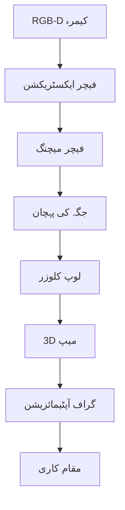

import MermaidDiagram from '@site/src/components/MermaidDiagram';
import Exercise from '@site/src/components/Exercise';
import Quiz from '@site/src/components/Quiz';
import PrerequisiteCheck from '@site/src/components/PrerequisiteCheck';  

# باب 20: RTAB-Map

## تعارف

RTAB-Map (ریل ٹائم ایپیرنس-بیسڈ میپنگ) ایک لچکدار RGB-D SLAM سسٹم ہے جو اندر کے ماحول کے تفصیلی 3D میپس تیار کرنے کے لیے بصری اور ڈیپتھ معلومات کا فائدہ اٹھاتا ہے۔ لیزر-بیسڈ SLAM سسٹم کے برعکس، RTAB-Map میپنگ کے لیے کیمرے اور ڈیپتھ سینسرز کا استعمال کرتا ہے اور بصری خصوصیات نکالتا ہے۔ یہ ایپروچ اندر کے ماحول میں خاص طور پر مؤثر ہے جہاں بصری نشانیاں فراوان اور ممتاز ہوتی ہیں، RTAB-Map کو معلوماتی بصری میپنگ اور مقام کاری کی ضرورت والی ایپلی کیشنز کے لیے ایک عمدہ انتخاب بناتا ہے۔

## سیکھنے کے اہداف

اس باب کے اختتام تک، آپ کو اس بات کا اہل ہو جانا چاہیے:

- RGB-D SLAM ایپلی کیشنز کے لیے RTAB-Map تشکیل دینا اور ڈیپلائی کرنا
- میپنگ کے لیے RGB-D سینسر ڈیٹا کو انضمام اور عمل کرنا
- IMU فیوژن کے ساتھ بصری-انرٹیل میپنگ سسٹم نافذ کرنا
- 3D میپنگ کی معیار کا جائزہ لینا اور کارکردگی کو بہتر بنانا
- مختلف ایپلی کیشنز کے لیے دیگر SLAM ایپروچز کے ساتھ RTAB-Map کا موازنہ کرنا

## شرائطِ لازمہ

اس باب کا آغاز کرنے سے پہلے، یقین کر لیں کہ آپ کے پاس ہے:

- ماڈیول 1 مکمل (ROS 2 کی بنیاد، TF2)
- ماڈیول 3 باب 18 (SLAM کی بنیاد)
- کمپیوٹر وژن کے تصورات کی بنیادی سمجھ
- RGB-D سینسرز (Kinect، Realsense، وغیرہ) کا تجربہ
- فیچر ڈیٹیکشن اور میچنگ کی سمجھ

## حقیقی دنیا کی مثلاً: بصری مسافر

RTAB-Map کو اس طرح سمجھیں جیسے ایک شخص لیزر سکینر کے بجائے ایک کیمرہ اور ڈیپتھ سینسر کے ساتھ ایک عمارت کو تلاش کر رہا ہو۔ جس طرح ایک شخص ماحول کو نیویگیٹ اور میپ کرنے کے لیے تصاویر، دروازے، اور فرنیچر جیسی بصری نشانیوں کو یاد کرتا ہے، RTAB-Map بصری خصوصیات اور ان کے مکانی رشتے کو یاد کرتا ہے تاکہ میپس تیار کی جا سکیں۔ سسٹم مختلف نقطہ نظر سے آشنا بصری نشانیوں کو پہچان سکتا ہے، یہاں تک کہ جب روبوٹ انہیں مختلف زاویوں سے پہنچے، جو لیزر-صرف سسٹم کو الجھن میں ڈال دے گا۔

## بنیادی تصورات

### 1. ایپیرنس-بیسڈ میپنگ

RTAB-Map میپس تیار کرنے اور جگہوں کو پہچاننے کے لیے بصری اظہار استعمال کرتا ہے:

- **بصری بیگ-آف-ورڈز**: بصری ورڈ ہسٹوگرام کا استعمال کرتے ہوئے جگہوں کی نمائندگی
- **لوپ کلوزر ڈیٹیکشن**: بصری مماثلت کے ذریعے پہلے سے ملاقات کی ہوئی جگہوں کو پہچانتا ہے
- **بصری فیچر ایکسٹریکشن**: SIFT، SURF، ORB، یا دیگر فیچرز نکالتا ہے
- **جگہ کی پہچان**: جانا ہوئی جگہوں کے ڈیٹا بیس کے ساتھ موجودہ نظارہ میچ کرتا ہے

### 2. گراف آپٹیمائزیشن



| خصوصیت | RTAB-Map | لیزر SLAM |
|---------|----------|------------|
| میپ کی معیار | تفصیلی، بصری | 2D، سادہ |
| لائٹنگ پر انحصار | ہاں | نہیں |
| کمپیوٹیشنل وسائل | اونچے | میڈیم |
| 3D میپنگ | ہاں | محدود |
| کیمرہ نوائز | ہاں | نہیں |

---

## RTAB-Map کی تشکیل

### YAML کنفیگریشن

```yaml
# RTAB-Map کی بنیادی تشکیل
rtabmap:
  ros__parameters:
    # عام پیرامیٹر
    use_sim_time: false
    subscribe_depth: true
    subscribe_rgb: true
    subscribe_scan: false
    frame_id: "base_link"
    map_frame_id: "map"
    odom_frame_id: "odom"
    publish_tf_map: true

    # میپنگ کے پیرامیٹر
    rtabmap/subscribe_depth: true
    rtabmap/subscribe_scan: false
    rtabmap/subscribe_user_data: false
    rtabmap/subscribe_stereo: false
    rtabmap/subscribe_rgb: true

    # بصری SLAM کے پیرامیٹر
    rtabmap/Vis/MinInliers: 15
    rtabmap/Vis/InlierDistance: 0.1
    rtabmap/Vis/MaxDepth: 4.0
    rtabmap/Vis/MinDepth: 0.0
    rtabmap/Vis/FeatureType: 6  # SURF
    rtabmap/Vis/EstimationType: 1  # Motion model
    rtabmap/Vis/MaxFeatures: 1000

    # میپنگ کے پیرامیٹر
    rtabmap/RGBD/ProximityPathMaxNeighbors: 10
    rtabmap/RGBD/ProximityPathFilteringRadius: 0.1
    rtabmap/RGBD/ProximityAngle: 0.0
    rtabmap/RGBD/CreateOccupancyGrid: true
    rtabmap/RGBD/OccupancyGridCellSize: 0.05
    rtabmap/RGBD/LocalRadius: 10.0

    # لوپ کلوزر کے پیرامیٹر
    rtabmap/RGBD/ProximityMaxGraphDepth: 0
    rtabmap/RGBD/ProximityPathMaxNeighbors: 10
    rtabmap/RGBD/LoopClosureReextractFeatures: false
    rtabmap/RGBD/LoopClosureDetection: true
    rtabmap/Kp/MaxFeatures: 400
    rtabmap/Kp/DetectorStrategy: 6  # SURF
    rtabmap/Kp/NNStrategy: 3  # FLANN
    rtabmap/Kp/MaxDepth: 4.0
    rtabmap/Kp/MinDepth: 0.0

    # کارکردگی کے پیرامیٹر
    rtabmap/Mem/STMSize: 30
    rtabmap/Mem/LaserScanVoxelSize: 0.05
    rtabmap/Mem/RehearsalSimilarity: 0.40
    rtabmap/Mem/NotLinkedNodesKept: false
```

### ROS 2 لانچ فائل

```xml
<!-- RTAB-Map لانچ فائل -->
<launch>
  <!-- RTAB-Map نوڈ لانچ کریں -->
  <node pkg="rtabmap_ros" exec="rtabmap" name="rtabmap">
    <param from="$(find_prefix my_robot_description)/config/rtabmap.yaml"/>
    <remap from="rgb/image" to="/camera/color/image_raw"/>
    <remap from="depth/image" to="/camera/depth/image_raw"/>
    <remap from="rgb/camera_info" to="/camera/color/camera_info"/>
  </node>

  <!-- میپ سرور لانچ کریں -->
  <node pkg="rtabmap_ros" exec="rtabmap_viz" name="rtabmap_viz" output="screen">
    <param from="$(find_prefix my_robot_description)/config/rtabmap.yaml"/>
  </node>
</launch>
```

---

## RTAB-Map کا نفاذ

### RGB-D SLAM نوڈ

```python
#!/usr/bin/env python3
# RTAB-Map RGB-D SLAM نوڈ
import rclpy
from rclpy.node import Node
from sensor_msgs.msg import Image, CameraInfo
from cv_bridge import CvBridge
import cv2
import numpy as np
from rclpy.qos import QoSProfile, ReliabilityPolicy

class RTABMapNode(Node):
    def __init__(self):
        super().__init__('rtabmap_node')

        # QoS پروفائل
        qos_profile = QoSProfile(depth=10)
        qos_profile.reliability = ReliabilityPolicy.BEST_EFFORT

        # سبسکرائبرز
        self.image_sub = self.create_subscription(
            Image,
            '/camera/color/image_raw',
            self.image_callback,
            qos_profile
        )

        self.depth_sub = self.create_subscription(
            Image,
            '/camera/depth/image_raw',
            self.depth_callback,
            qos_profile
        )

        self.camera_info_sub = self.create_subscription(
            CameraInfo,
            '/camera/color/camera_info',
            self.camera_info_callback,
            qos_profile
        )

        # پبلیشرز
        self.map_pub = self.create_publisher(Image, '/rtabmap/visualization', 10)

        # کیمرہ کنٹرول
        self.bridge = CvBridge()
        self.camera_matrix = None
        self.dist_coeffs = None
        self.rgb_image = None
        self.depth_image = None

        # RTAB-Map متغیرات
        self.feature_detector = cv2.SIFT_create(nfeatures=500)
        self.feature_matcher = cv2.BFMatcher()
        self.keyframe_database = []
        self.current_pose = np.eye(4)

        # ٹائمر
        self.timer = self.create_timer(0.1, self.process_slam)

    def image_callback(self, msg):
        """RGB تصویر کو سنبھالیں"""
        self.rgb_image = self.bridge.imgmsg_to_cv2(msg, desired_encoding='bgr8')

    def depth_callback(self, msg):
        """ڈیپتھ تصویر کو سنبھالیں"""
        self.depth_image = self.bridge.imgmsg_to_cv2(msg, desired_encoding='32FC1')

    def camera_info_callback(self, msg):
        """کیمرہ کی معلومات کو اپ ڈیٹ کریں"""
        self.camera_matrix = np.array(msg.k).reshape(3, 3)
        self.dist_coeffs = np.array(msg.d)

    def process_slam(self):
        """SLAM عمل کریں"""
        if self.rgb_image is not None and self.depth_image is not None:
            # فیچر ڈیٹکشن
            keypoints, descriptors = self.feature_detector.detectAndCompute(
                self.rgb_image, None
            )

            if descriptors is not None and len(keypoints) > 0:
                # کی فریم کو اسٹور کریں
                keyframe = {
                    'image': self.rgb_image.copy(),
                    'depth': self.depth_image.copy(),
                    'keypoints': keypoints,
                    'descriptors': descriptors,
                    'pose': self.current_pose.copy()
                }

                # جگہ کی پہچان
                loop_closure = self.detect_loop_closure(keyframe)

                if loop_closure:
                    # لوپ کلوزر کو حل کریں
                    self.solve_loop_closure(loop_closure)

                # میپ کو اپ ڈیٹ کریں
                self.update_map(keyframe)

                # کی فریم کو ڈیٹا بیس میں شامل کریں
                self.keyframe_database.append(keyframe)

                # RTAB-Map وژولائزیشن
                visualization = self.create_visualization()
                vis_msg = self.bridge.cv2_to_imgmsg(visualization, encoding='bgr8')
                self.map_pub.publish(vis_msg)

    def detect_loop_closure(self, current_keyframe):
        """لوپ کلوزر کا پتہ لگائیں"""
        if len(self.keyframe_database) < 5:
            return None

        # حالیہ کی فریم کے ساتھ میچ کریں
        current_desc = current_keyframe['descriptors']
        best_match = None
        best_score = float('inf')

        for i, keyframe in enumerate(self.keyframe_database[:-5]):  # حالیہ 5 کو چھوڑیں
            matches = self.feature_matcher.knnMatch(
                current_desc, keyframe['descriptors'], k=2
            )

            # Lowe's ratio test
            good_matches = []
            for match_pair in matches:
                if len(match_pair) == 2:
                    m, n = match_pair
                    if m.distance < 0.7 * n.distance:
                        good_matches.append(m)

            if len(good_matches) > 10:  # کم از کم 10 میچز
                score = len(good_matches)
                if score < best_score:
                    best_score = score
                    best_match = (i, keyframe)

        if best_match and best_score > 15:  # کافی اچھا میچ
            return best_match

        return None

    def solve_loop_closure(self, loop_closure):
        """لوپ کلوزر کو حل کریں"""
        keyframe_idx, keyframe = loop_closure
        self.get_logger().info(f'لوپ کلوزر پایا گیا: {keyframe_idx}')

        # یہاں گراف آپٹیمائزیشن کا کام ہوگا
        # سادگی کے لیے، ہم صرف لاگ ان کر رہے ہیں

    def update_map(self, keyframe):
        """میپ کو اپ ڈیٹ کریں"""
        # یہاں 3D میپنگ کا کام ہوگا
        # سادگی کے لیے، ہم صرف کی فریم کو محفوظ کر رہے ہیں

    def create_visualization(self):
        """RTAB-Map وژولائزیشن تیار کریں"""
        # ٹیسٹ وژولائزیشن
        vis = np.zeros((480, 640, 3), dtype=np.uint8)
        cv2.putText(
            vis, f'Keyframes: {len(self.keyframe_database)}',
            (10, 30), cv2.FONT_HERSHEY_SIMPLEX, 1, (0, 255, 0), 2
        )
        cv2.putText(
            vis, f'Pose: {self.current_pose[0, 3]:.2f}, {self.current_pose[1, 3]:.2f}',
            (10, 60), cv2.FONT_HERSHEY_SIMPLEX, 1, (0, 255, 0), 2
        )
        return vis

def main(args=None):
    rclpy.init(args=args)
    rtabmap_node = RTABMapNode()

    try:
        rclpy.spin(rtabmap_node)
    except KeyboardInterrupt:
        print("RTAB-Map نوڈ کو بند کیا جا رہا ہے")

    rtabmap_node.destroy_node()
    rclpy.shutdown()

if __name__ == '__main__':
    main()
```

---

## بصری-انرٹیل SLAM

### IMU انضمام

```python
#!/usr/bin/env python3
# RTAB-Map کے ساتھ IMU انضمام
import rclpy
from rclpy.node import Node
from sensor_msgs.msg import Imu
from geometry_msgs.msg import Vector3
import numpy as np

class VisualInertialNode(Node):
    def __init__(self):
        super().__init__('visual_inertial_node')

        # IMU سبسکرائبرز
        self.imu_sub = self.create_subscription(
            Imu,
            '/imu/data',
            self.imu_callback,
            10
        )

        # IMU متغیرات
        self.imu_orientation = np.array([0.0, 0.0, 0.0, 1.0])  # w, x, y, z
        self.imu_angular_velocity = np.array([0.0, 0.0, 0.0])
        self.imu_linear_acceleration = np.array([0.0, 0.0, 0.0])
        self.last_imu_time = None

    def imu_callback(self, msg):
        """IMU ڈیٹا کو سنبھالیں"""
        # اورینٹیشن
        self.imu_orientation = np.array([
            msg.orientation.w,
            msg.orientation.x,
            msg.orientation.y,
            msg.orientation.z
        ])

        # زاویہ ویلوسٹی
        self.imu_angular_velocity = np.array([
            msg.angular_velocity.x,
            msg.angular_velocity.y,
            msg.angular_velocity.z
        ])

        # لینیئر ایکسلریشن
        self.imu_linear_acceleration = np.array([
            msg.linear_acceleration.x,
            msg.linear_acceleration.y,
            msg.linear_acceleration.z
        ])

        # وقت
        current_time = msg.header.stamp.sec + msg.header.stamp.nanosec * 1e-9
        if self.last_imu_time is not None:
            dt = current_time - self.last_imu_time
            # انرٹیل انٹیگریشن
            self.integrate_imu(dt)

        self.last_imu_time = current_time

    def integrate_imu(self, dt):
        """IMU ڈیٹا کو انٹیگریٹ کریں"""
        # زاویہ تبدیلی
        angular_displacement = self.imu_angular_velocity * dt

        # روبوٹ کی پوزیشن کو اپ ڈیٹ کریں
        # (سادگی کے لیے، ہم صرف ٹیسٹ لاگنگ کر رہے ہیں)
        self.get_logger().debug(f'IMU انٹیگریشن: dt={dt:.3f}s')

    def get_imu_pose_estimate(self):
        """IMU سے پوزیشن کا تخمینہ حاصل کریں"""
        # اورینٹیشن کو اویلر اینگلز میں تبدیل کریں
        q = self.imu_orientation
        roll = np.arctan2(2*(q[0]*q[1] + q[2]*q[3]), 1 - 2*(q[1]*q[1] + q[2]*q[2]))
        pitch = np.arcsin(2*(q[0]*q[2] - q[3]*q[1]))
        yaw = np.arctan2(2*(q[0]*q[3] + q[1]*q[2]), 1 - 2*(q[2]*q[2] + q[3]*q[3]))

        return np.array([roll, pitch, yaw])
```

---

## 3D میپنگ اور وژولائزیشن

### میپ کو محفوظ کرنا

```bash
# RTAB-Map میپ کو محفوظ کرنا
ros2 service call /rtabmap/get_map rtabmap_msgs/srv/GetMap

# میپ کو پی ڈی ایف میں برآمد کرنا
rtabmap-export --exportPdf /path/to/database.db
```

### میپ کی معیار کا جائزہ

```python
def evaluate_map_quality(database_path):
    """میپ کی معیار کا جائزہ لیں"""

    evaluation_metrics = {
        "map_coverage": 0.0,      # میپ کا احاطہ (%)
        "loop_closure_rate": 0.0, # لوپ کلوزر کی شرح (%)
        "drift_error": 0.0,       # ڈرائیف غلطی (میٹر)
        "feature_density": 0.0    # فیچر کثافت (فی میٹر^2)
    }

    # ڈیٹا بیس سے میٹرکس کا حساب لگائیں
    # (سادگی کے لیے، ہم ٹیسٹ ویلیو لوٹا رہے ہیں)

    return evaluation_metrics
```

---

## مشق

**SLAM سسٹم کا انتخاب**: مختلف ماحول کے لیے SLAM سسٹم کا انتخاب کریں:

1. **انڈور کمرے**: RTAB-Map (بصری نشانیاں)
2. **بیرونی سڑک**: GMapping (لیزر مسلسل)
3. **تاریک ماحول**: کارٹو گرافر (IMU انضمام)
4. **3D تفصیل**: RTAB-Map (RGB-D)

<Quiz
  title="RTAB-Map"
  questions={[
    {
      question: "RTAB-Map کا مطلب کیا ہے؟",
      options: ["Real-Time Appearance-Based Mapping", "Robotic Tracking and Mapping", "RGB Tracking and Mapping", "Real-Time Algorithm Mapping"],
      answer: 0,
      explanation: "RTAB-Map ریل ٹائم ایپیرنس-بیسڈ میپنگ کا مختصر ہے"
    },
    {
      question: "RTAB-Map کون سے سینسرز استعمال کرتا ہے؟",
      options: ["صرف لیڈار", "RGB-D کیمرے", "صرف IMU", "لیڈار اور IMU"],
      answer: 1,
      explanation: "RTAB-Map RGB-D کیمرے استعمال کرتا ہے"
    }
  ]}
/>
