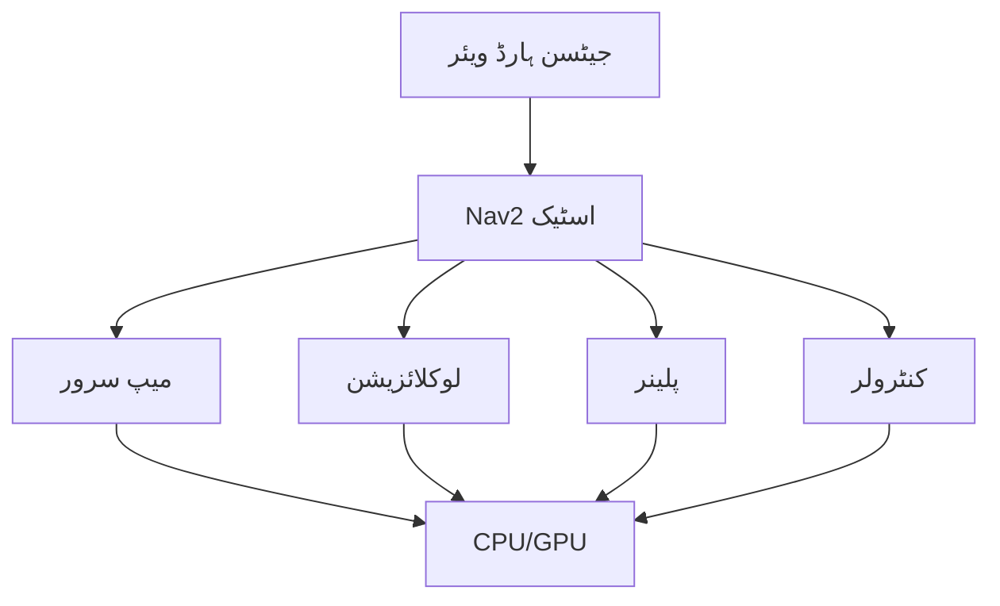

import MermaidDiagram from '@site/src/components/MermaidDiagram';
import CodeExample from '@site/src/components/CodeExample';
import Exercise from '@site/src/components/Exercise';
import Quiz from '@site/src/components/Quiz';
import TierBadge from '@site/src/components/TierBadge';

# ٹیئر بی ایکسٹینشن: ایج پلیٹ فارم پر لیڈار کے ساتھ Nav2

<TierBadge tiers={["B"]} />

## یہ کیوں اہم ہے

نیویگیشن2 (Nav2) ROS 2 کے لیے معیاری نیویگیشن اسٹیک ہے، جو مقام کاری، راستہ کی منصوبہ بندی، اور رکاوٹ سے بچاؤ سمیت مکمل خودکار نیویگیشن کی صلاحیات فراہم کرتا ہے۔ NVIDIA جیٹسن جیسے ایج پلیٹ فارم پر Nav2 ڈیپلائی کرنا خودکار روبوٹس کو محدود وسائل والے ماحول میں کام کرنے کے قابل بناتا ہے۔ ایج کمپیوٹنگ کے لیے Nav2 کو بہتر بنانا روبوٹکس انجینئرز کے لیے ضروری ہے جو ڈیپلائی کرنے والے سسٹم پر کام کر رہے ہیں۔

**ریل ورلڈ ایپلی کیشنز**:

- **گودام کے روبوٹس**: خودکار اسٹاک مینجمنٹ اور سامان کی منتقلی
- **سروس روبوٹس**: ڈیلیوری، صفائی، اور مدد کے لیے اندر کا نیویگیشن
- **زراعت کے روبوٹس**: فصل کی قطاروں کے درمیان خودکار نیویگیشن
- **تلاش اور بچاؤ**: آفت زدہ علاقوں میں GPS-سے-مکمل طور پر محروم نیویگیشن

:::danger ہارڈ ویئر کی حفاظت
جیٹسن ہارڈ ویئر پر نیویگیشن سسٹم ڈیپلائی کرنے سے پہلے:
- یقین کریں کہ ہنگامی بندی کے میکانزم جگہ پر ہیں اور قابلِ رسائی ہیں
- روبوٹ کی زیادہ سے زیادہ رفتار اور تیزی کے پیرامیٹر کی سلامتی کی تصدیق کریں
- ڈیپلائمنٹ سے پہلے کنٹرول کیے گئے ماحول میں نیویگیشن الگورتھم ٹیسٹ کریں
- موتور کنٹرول کے لیے 100ms ٹائم آؤٹ کے ساتھ ڈیڈ مین سوئچ پیٹرنز نافذ کریں
:::

---

## Nav2 کی ایج کمپیوٹنگ کے لیے بہتر بنانا

### 1. کمپیوٹیشنل وسائل کا انتظام



### 2. Nav2 کی تشکیل برائے ایج کمپیوٹنگ

```yaml
# Nav2 کی ایج کمپیوٹنگ کے لیے تشکیل
bt_navigator:
  ros__parameters:
    use_sim_time: false
    global_frame: map
    robot_base_frame: base_link
    plugin_lib_names:
      - nav2_compute_path_to_pose_action_bt_node
      - nav2_follow_path_action_bt_node
      - nav2_back_up_action_bt_node
      - nav2_spin_action_bt_node
      - nav2_wait_action_bt_node

controller_server:
  ros__parameters:
    use_sim_time: false
    controller_frequency: 10.0  # ایج کے لیے کم فریکوئنسی
    min_x_velocity_threshold: 0.001
    min_y_velocity_threshold: 0.5
    min_theta_velocity_threshold: 0.001
    progress_checker_plugin: "progress_checker"
    goal_checker_plugin: "goal_checker"
    controller_plugins: ["FollowPath"]

    FollowPath:
      plugin: "nav2_mppi_controller::Controller"
      time_steps: 10  # ایج کے لیے کم
      control_frequency: 20.0
      velocity_scaling_factor: 1.0

local_costmap:
  local_costmap:
    ros__parameters:
      update_frequency: 5.0  # ایج کے لیے کم
      publish_frequency: 2.0
      global_frame: odom
      robot_base_frame: base_link
      use_rollout_costs: true
      lethal_cost_threshold: 100
      width: 3  # چھوٹا علاقہ
      height: 3
      resolution: 0.05  # میڈیم ریزولوشن
      observation_sources: scan
      scan:
        topic: /scan
        max_obstacle_height: 2.0
        clearing: true
        marking: true
        data_type: LaserScan

global_costmap:
  global_costmap:
    ros__parameters:
      update_frequency: 1.0  # ایج کے لیے کم
      publish_frequency: 0.5
      global_frame: map
      robot_base_frame: base_link
      width: 20  # چھوٹا علاقہ
      height: 20
      resolution: 0.1  # کم ریزولوشن
      always_send_full_costmap: true
      observation_sources: scan
      scan:
        topic: /scan
        max_obstacle_height: 2.0
        clearing: true
        marking: true
        data_type: LaserScan
```

---

## لیڈار سینسرز کا انضمام

### لیڈار کی تشکیل

```yaml
# لیڈار سینسر کی تشکیل
lidar_driver:
  ros__parameters:
    port: "/dev/ttyUSB0"
    baud_rate: 115200
    frame_id: "laser"
    range_min: 0.12
    range_max: 12.0
    angle_min: -2.35619  # -135 degrees
    angle_max: 2.35619   # 135 degrees
    angle_increment: 0.0087266  # 0.5 degrees
    scan_time: 0.025
    number_of_ranges: 540
```

### لیڈار ڈیٹا کو عمل کرنا

```python
#!/usr/bin/env python3
# جیٹسن پر لیڈار ڈیٹا پروسیسنگ نوڈ
import rclpy
from rclpy.node import Node
from sensor_msgs.msg import LaserScan
from nav_msgs.msg import OccupancyGrid
import numpy as np
from scipy.ndimage import binary_dilation

class JetsonLidarProcessor(Node):
    def __init__(self):
        super().__init__('jetson_lidar_processor')

        # سبسکرائبرز
        self.scan_sub = self.create_subscription(
            LaserScan,
            '/scan',
            self.scan_callback,
            10
        )

        # پبلیشرز
        self.processed_scan_pub = self.create_publisher(
            LaserScan, '/scan_filtered', 10
        )

        # لیڈار پروسیسنگ متغیرات
        self.scan_filter_range = (0.2, 10.0)  # میٹر
        self.scan_filter_angle = (-np.pi, np.pi)  # ریڈین
        self.noise_filter_threshold = 0.1  # میٹر

        # ٹائمر (کارکردگی کے لیے)
        self.timer = self.create_timer(0.05, self.performance_check)  # 20Hz

    def scan_callback(self, msg):
        """لیڈار اسکین کو عمل کریں"""
        # فلٹر رینج
        filtered_ranges = []
        filtered_intensities = []

        for i, range_val in enumerate(msg.ranges):
            if np.isnan(range_val) or np.isinf(range_val):
                continue

            angle = msg.angle_min + i * msg.angle_increment
            if (self.scan_filter_range[0] <= range_val <= self.scan_filter_range[1] and
                self.scan_filter_angle[0] <= angle <= self.scan_filter_angle[1]):

                # نوائز فلٹر
                if i > 0 and i < len(msg.ranges) - 1:
                    prev_range = msg.ranges[i-1]
                    next_range = msg.ranges[i+1]

                    if (not np.isnan(prev_range) and not np.isnan(next_range) and
                        abs(range_val - prev_range) < self.noise_filter_threshold and
                        abs(range_val - next_range) < self.noise_filter_threshold):
                        filtered_ranges.append(range_val)
                        if msg.intensities:
                            filtered_intensities.append(msg.intensities[i])
                    else:
                        filtered_ranges.append(range_val)  # شامل کریں لیکن نوائز کے ساتھ
                        if msg.intensities:
                            filtered_intensities.append(msg.intensities[i])
                else:
                    filtered_ranges.append(range_val)
                    if msg.intensities:
                        filtered_intensities.append(msg.intensities[i])

        # فلٹرڈ اسکین تیار کریں
        filtered_msg = LaserScan()
        filtered_msg.header = msg.header
        filtered_msg.angle_min = msg.angle_min
        filtered_msg.angle_max = msg.angle_max
        filtered_msg.angle_increment = msg.angle_increment
        filtered_msg.time_increment = msg.time_increment
        filtered_msg.scan_time = msg.scan_time
        filtered_msg.range_min = msg.range_min
        filtered_msg.range_max = msg.range_max
        filtered_msg.ranges = filtered_ranges
        filtered_msg.intensities = filtered_intensities

        # فلٹرڈ اسکین شائع کریں
        self.processed_scan_pub.publish(filtered_msg)

    def performance_check(self):
        """کارکردگی کی چیک کریں"""
        # CPU اور میموری کا جائزہ
        import psutil
        cpu_percent = psutil.cpu_percent()
        memory_percent = psutil.virtual_memory().percent

        if cpu_percent > 80:
            self.get_logger().warn(f'CPU کا استعمال زیادہ ہے: {cpu_percent}%')
        if memory_percent > 80:
            self.get_logger().warn(f'میموری کا استعمال زیادہ ہے: {memory_percent}%')

def main(args=None):
    rclpy.init(args=args)
    lidar_processor = JetsonLidarProcessor()

    try:
        rclpy.spin(lidar_processor)
    except KeyboardInterrupt:
        print("لیڈار پروسیسر نوڈ کو بند کیا جا رہا ہے")

    lidar_processor.destroy_node()
    rclpy.shutdown()

if __name__ == '__main__':
    main()
```

---

## Nav2 کو جیٹسن پر ڈیپلائی کرنا

### لانچ فائل

```xml
<!-- جیٹسن کے لیے Nav2 لانچ فائل -->
<launch>
  <!-- Nav2 نوڈس لانچ کریں -->
  <node pkg="nav2_map_server" exec="map_server" name="map_server">
    <param name="yaml_filename" value="$(var map_file)"/>
    <param name="use_sim_time" value="False"/>
  </node>

  <node pkg="nav2_localization" exec="amcl" name="amcl">
    <param name="use_sim_time" value="False"/>
    <param name="set_initial_pose" value="True"/>
    <param name="initial_pose_x" value="0.0"/>
    <param name="initial_pose_y" value="0.0"/>
    <param name="initial_pose_z" value="0.0"/>
    <param name="initial_pose_yaw" value="0.0"/>
  </node>

  <node pkg="nav2_planner" exec="planner_server" name="planner_server">
    <param name="use_sim_time" value="False"/>
    <param name="planner_plugin" value="nav2_navfn_planner/NavfnPlanner"/>
  </node>

  <node pkg="nav2_controller" exec="controller_server" name="controller_server">
    <param name="use_sim_time" value="False"/>
  </node>

  <node pkg="nav2_bt_navigator" exec="bt_navigator" name="bt_navigator">
    <param name="use_sim_time" value="False"/>
  </node>

  <!-- حفاظتی نوڈ -->
  <node pkg="my_robot_safety" exec="dead_man_switch" name="dead_man_switch">
    <param name="timeout_ms" value="100"/>
  </node>
</launch>
```

---

## کارکردگی کو بہتر بنانا

### Jetson کے لیے کارکردگی کی تشکیل

```bash
# Jetson کارکردگی کو بہتر بنانے کے لیے
sudo nvpmodel -m 0  # اعلی کارکردگی ماڈل
sudo jetson_clocks  # تمام کلاکس کو زیادہ سے زیادہ پر سیٹ کریں

# ROS 2 QoS کو بہتر بنانے کے لیے
export RMW_IMPLEMENTATION=rmw_cyclonedds_cpp
export RCUTILS_LOGGING_BUFFERED_STREAM=1
```

### کارکردگی کے ٹولز

```python
# Nav2 کارکردگی کے ٹولز
class PerformanceMonitor:
    def __init__(self):
        self.metrics = {
            'planning_time': [],
            'execution_time': [],
            'cpu_usage': [],
            'memory_usage': []
        }

    def measure_planning_time(self, planner_func):
        """منصوبہ بندی کے وقت کو ناپیں"""
        import time
        start_time = time.time()
        result = planner_func()
        end_time = time.time()

        planning_time = end_time - start_time
        self.metrics['planning_time'].append(planning_time)

        return result

    def get_average_metrics(self):
        """اوسط میٹرکس حاصل کریں"""
        avg_metrics = {}
        for key, values in self.metrics.items():
            if values:
                avg_metrics[key] = sum(values) / len(values)
            else:
                avg_metrics[key] = 0.0
        return avg_metrics
```

---

## حفاظتی کنٹرولز

### ڈیڈ مین سوئچ نوڈ

```python
#!/usr/bin/env python3
# جیٹسن کے لیے ڈیڈ مین سوئچ
import rclpy
from rclpy.node import Node
from std_msgs.msg import Bool
from geometry_msgs.msg import Twist
import time

class JetsonDeadManSwitch(Node):
    def __init__(self):
        super().__init__('jetson_dead_man_switch')

        # سبسکرائبرز
        self.cmd_vel_sub = self.create_subscription(
            Twist,
            '/cmd_vel',
            self.cmd_vel_callback,
            10
        )

        # پبلیشرز
        self.motor_cmd_pub = self.create_publisher(Twist, '/cmd_vel_safe', 10)
        self.emergency_stop_pub = self.create_publisher(Bool, '/emergency_stop', 10)

        # ڈیڈ مین سوئچ متغیرات
        self.last_cmd_time = time.time()
        self.motors_enabled = True
        self.timeout = 0.1  # 100ms

        # ٹائمر
        self.timer = self.create_timer(0.02, self.safety_timer)  # 50Hz

    def cmd_vel_callback(self, msg):
        """کمانڈ ویل کو سنبھالیں"""
        current_time = time.time()
        self.last_cmd_time = current_time

        if self.motors_enabled:
            self.motor_cmd_pub.publish(msg)

    def safety_timer(self):
        """حفاظت کا ٹائمر"""
        current_time = time.time()

        if current_time - self.last_cmd_time > self.timeout:
            if self.motors_enabled:
                # ہنگامی بندی
                self.emergency_stop()
                self.get_logger().error('ڈیڈ مین سوئچ: ہنگامی بندی فعال')

    def emergency_stop(self):
        """ہنگامی بندی کریں"""
        stop_msg = Twist()
        stop_msg.linear.x = 0.0
        stop_msg.angular.z = 0.0
        self.motor_cmd_pub.publish(stop_msg)

        emergency_msg = Bool()
        emergency_msg.data = True
        self.emergency_stop_pub.publish(emergency_msg)

        self.motors_enabled = False
        self.get_logger().info('موٹرز ہنگامی طور پر بند کر دیے گئے')

def main(args=None):
    rclpy.init(args=args)
    dms_node = JetsonDeadManSwitch()

    try:
        rclpy.spin(dms_node)
    except KeyboardInterrupt:
        print("ڈیڈ مین سوئچ نوڈ کو بند کیا جا رہا ہے")

    dms_node.destroy_node()
    rclpy.shutdown()

if __name__ == '__main__':
    main()
```

---

## مشق

**Nav2 کی منصوبہ بندی**: Jetson AGX Xavier پر Nav2 کی منصوبہ بندی کریں:

1. **لیڈار**: RPLIDAR A1 یا Hokuyo URG-04LX
2. **Nav2 پلینر**: Navfn یا Global Planner
3. **کنٹرولر**: MPPI یا DWA
4. **کارکردگی**: 10Hz اپ ڈیٹ فریکوئنسی

<Quiz
  title="Nav2 ایج پلیٹ فارم"
  questions={[
    {
      question: "Nav2 کا کون سا ماڈیول لوکل کوسٹ میپ تیار کرتا ہے؟",
      options: ["میپ سرور", "لوکلائزیشن", "کنٹرولر", "BT نیویگیٹر"],
      answer: 2,
      explanation: "کنٹرولر لوکل کوسٹ میپ تیار کرتا ہے"
    },
    {
      question: "ڈیڈ مین سوئچ کا ٹائم آؤٹ کتنا ہونا چاہیے؟",
      options: ["50ms", "100ms", "200ms", "500ms"],
      answer: 1,
      explanation: "حفاظت کے لیے 100ms ڈیڈ مین سوئچ ٹائم آؤٹ استعمال کیا جاتا ہے"
    }
  ]}
/>