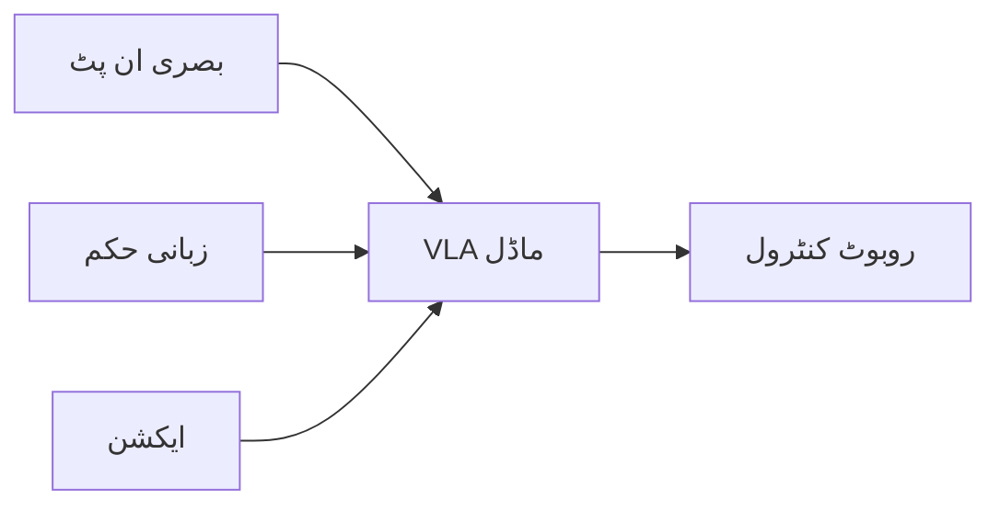

import MermaidDiagram from '@site/src/components/MermaidDiagram';
import Exercise from '@site/src/components/Exercise';
import Quiz from '@site/src/components/Quiz';
import PrerequisiteCheck from '@site/src/components/PrerequisiteCheck';  

# باب 24: وژن-زبان-عمل پیراڈائم

## تعارف

وژن-زبان-عمل (VLA) سسٹم روبوٹکس میں ایک پیراڈائم شفٹ کی نمائندگی کرتے ہیں، روایتی ماڈیولر ایپروچز سے دور ہٹ کر اینڈ-ٹو-اینڈ ٹرین ایبل ماڈلز کی طرف جو قدرتی زبان کے حکم کی تشریح کر سکتے ہیں اور براہ راست روبوٹ ایکشنز جنریٹ کر سکتے ہیں۔ کلاسیکل روبوٹکس اسٹیکس کے برعکس جو ادراک، منصوبہ بندی، اور کنٹرول کو الگ کرتے ہیں، VLA ماڈلز بصری ان پٹس اور زبانی ہدایات کو براہ راست روبوٹ ایکشنز میں میپ کرنا سیکھتے ہیں، بے مثال لچک اور جنرلائزیشن کی صلاحیات کو فعال کرتے ہیں۔

یہ باب VLA سسٹم کے بنیادی تصورات، روایتی ایپروچز پر ان کے فوائد، اور تربیت، ڈیپلائمنٹ، اور حفاظت کے لحاظ سے چیلنجز کا تعارف کرواتا ہے۔

## سیکھنے کے اہداف

اس باب کے اختتام تک، آپ کو اس بات کا اہل ہو جانا چاہیے:

- وژن-زبان-عمل آرکیٹیکچر اور اس کے اجزاء کی وضاحت کرنا
- ماڈیولر روبوٹکس ایپروچز پر اینڈ-ٹو-اینڈ VLA سسٹم کے فوائد کو سمجھنا
- سادہ روبوٹ کنٹرول کاموں کے لیے بنیادی VLA انفرینس نافذ کرنا
- VLA ڈیپلائمنٹ اور حفاظتی تصورات میں کلیدی چیلنجز کی شناخت کرنا
- مختلف VLA ایپروچز اور ان کے ٹریڈ آف کا موازنہ کرنا

## شرائطِ لازمہ

اس باب کا آغاز کرنے سے پہلے، یقین کر لیں کہ آپ کے پاس ہے:

- ماڈیول 1 مکمل (ROS 2 کی بنیاد، میسج پاسنگ)
- ماڈیول 2 (ڈیجیٹل ٹوئنز، سیمولیشن کے تصورات)
- ماڈیول 3 (نیویگیشن کے تصورات، Nav2 انضمام)
- نیورل نیٹ ورکس اور ٹرانسفارمرز کی بنیادی سمجھ
- ROS 2 ایکشن سرورز اور سروس کالز کا تجربہ

## حقیقی دنیا کی مثلاً: ملٹی ماڈل دماغ

VLA سسٹم کو انسانی دماغ کی اس صلاحیت کی طرح سمجھیں جو متعدد حسی ان پٹس (وژن، سننا) کو زبان کی سمجھ کے ساتھ جوڑ کر منسق ایکشنز پیدا کرتی ہے۔ جب آپ "بائیں طرف لال کپ کو اٹھائیں" سنتے ہیں، تو آپ کا دماغ ایک ہی وقت میں بصری منظر کو پروسیس کرتا ہے، زبانی حکم کی تشریح کرتا ہے، اور کارروائی انجام دینے کے لیے آپ کے ہاتھ کی حرکت کو منسق کرتا ہے۔ VLA سسٹم مصنوعی سسٹم میں اس لامحدود انضمام کو نقل کرنا چاہتے ہیں، انسانی مظاہرے کے بڑے ڈیٹا سیٹس سے وژن، زبان، اور ایکشن کے درمیان رشتے سیکھتے ہیں۔

## بنیادی تصورات

### 1. ملٹی ماڈل انضمام

VLA سسٹم تین کلیدی ماڈلیٹیز کو جوڑتے ہیں:

- **وژن**: کیمرہ امیج، ڈیپتھ ڈیٹا، یا دیگر بصری سینسرز
- **زبان**: قدرتی زبان کے حکم، سوالات، یا تفصیلات
- **ایکشن**: روبوٹ موٹر کمانڈز، جوائنٹ پوزیشنز، یا اینڈ ایفیکٹر پوزز



| ماڈلیٹی | کام | چیلنجز |
|---------|-----|---------|
| وژن | تصاویر کو سمجھنا | لائٹنگ، متن، نوائز |
| زبان | حکم کو تشریح کرنا | ابہام، ساخت |
| ایکشن | روبوٹ کو کنٹرول کرنا | حفاظت، درستگی |

### 2. اینڈ-ٹو-اینڈ لرننگ

VLA ماڈلز اینڈ-ٹو-اینڈ ٹرین ہوتے ہیں:

- **ان پٹس**: وژن + زبان
- **آؤٹ پٹس**: ایکشنز
- **ہدف**: ہیومن ڈیموں کی نقل و حمل

```python
# VLA ماڈل کی نمائندگی
class VLAModel:
    def __init__(self):
        self.vision_encoder = VisionEncoder()
        self.language_encoder = LanguageEncoder()
        self.action_decoder = ActionDecoder()
        self.fusion_layer = MultimodalFusion()

    def forward(self, image, text):
        # وژن انکوڈنگ
        vision_features = self.vision_encoder(image)

        # زبانی انکوڈنگ
        language_features = self.language_encoder(text)

        # ملٹی ماڈل فیوژن
        fused_features = self.fusion_layer(vision_features, language_features)

        # ایکشن ڈیکوڈنگ
        actions = self.action_decoder(fused_features)

        return actions
```

### 3. VLA کے فوائد

1. **جنرلائزیشن**: نئی اشیاء اور ماحول کے لیے
2. **لچک**: متغیر حکم کے لیے
3. **سیکھنا**: ڈیموں سے
4. **انضمام**: تمام ماڈلیٹیز کا

### 4. VLA کے چیلنجز

1. **ڈیٹا کی ضرورت**: وسیع ڈیٹا سیٹس کی
2. **کارکردگی**: حقیقی وقت میں انفرینس
3. **حفاظت**: غلط ایکشن سے
4. **سکیل کرنا**: بڑے ماڈلز کو

---

## VLA آرکیٹیکچر

### ٹرانسفارمر بیسڈ VLA

```python
import torch
import torch.nn as nn

class VisionLanguageActionTransformer(nn.Module):
    def __init__(self, vision_dim, text_dim, action_dim, hidden_dim=512):
        super().__init__()

        # انکوڈرز
        self.vision_encoder = nn.Linear(vision_dim, hidden_dim)
        self.text_encoder = nn.Linear(text_dim, hidden_dim)

        # ٹرانسفارمر لیئرز
        self.transformer = nn.TransformerEncoder(
            nn.TransformerEncoderLayer(d_model=hidden_dim, nhead=8),
            num_layers=6
        )

        # ایکشن ڈیکوڈر
        self.action_decoder = nn.Linear(hidden_dim, action_dim)

    def forward(self, vision_features, text_features):
        # انکوڈنگ
        vision_encoded = self.vision_encoder(vision_features)
        text_encoded = self.text_encoder(text_features)

        # فیوژن (کنکیٹینیٹ)
        combined_features = torch.cat([vision_encoded, text_encoded], dim=-1)

        # ٹرانسفارمر
        transformed = self.transformer(combined_features.unsqueeze(1))

        # ایکشنز
        actions = self.action_decoder(transformed.squeeze(1))

        return actions
```

### ROS 2 انضمام

```python
#!/usr/bin/env python3
# VLA ROS 2 نوڈ
import rclpy
from rclpy.node import Node
from sensor_msgs.msg import Image
from std_msgs.msg import String
from geometry_msgs.msg import Twist
from cv_bridge import CvBridge
import torch

class VLAROSNode(Node):
    def __init__(self):
        super().__init__('vla_ros_node')

        # سبسکرائبرز
        self.image_sub = self.create_subscription(
            Image,
            '/camera/image_raw',
            self.image_callback,
            10
        )

        self.command_sub = self.create_subscription(
            String,
            '/vla/command',
            self.command_callback,
            10
        )

        # پبلیشرز
        self.cmd_vel_pub = self.create_publisher(Twist, '/cmd_vel', 10)

        # کیمرہ کنٹرول
        self.bridge = CvBridge()

        # VLA ماڈل
        self.vla_model = VisionLanguageActionTransformer(
            vision_dim=512, text_dim=512, action_dim=6
        )
        self.vla_model.load_state_dict(torch.load('vla_model.pth'))
        self.vla_model.eval()

        # وضاحتی متغیرات
        self.current_image = None
        self.current_command = None

    def image_callback(self, msg):
        """بصری ڈیٹا کو سنبھالیں"""
        image = self.bridge.imgmsg_to_cv2(msg, desired_encoding='bgr8')
        # تصویر کو پروسیس کریں اور وژن فیچرز نکالیں
        self.current_image = self.preprocess_image(image)

    def command_callback(self, msg):
        """زبانی حکم کو سنبھالیں"""
        self.current_command = msg.data
        if self.current_image is not None:
            self.execute_vla_command()

    def preprocess_image(self, image):
        """تصویر کو پری پروسیس کریں"""
        # تصویر کو ویژن فیچرز میں تبدیل کریں
        # (سادگی کے لیے، ہم ایک ٹیسٹ فیچر استعمال کر رہے ہیں)
        return torch.randn(1, 512)  # ٹیسٹ کے لیے

    def execute_vla_command(self):
        """VLA کمانڈ انجام دیں"""
        if self.current_image is not None and self.current_command is not None:
            # ٹیکسٹ کو فیچرز میں تبدیل کریں
            text_features = self.text_to_features(self.current_command)

            # VLA ماڈل کو چلائیں
            with torch.no_grad():
                actions = self.vla_model(self.current_image, text_features)

            # ایکشنز کو ROS 2 میسج میں تبدیل کریں
            cmd_vel = self.actions_to_cmd_vel(actions)
            self.cmd_vel_pub.publish(cmd_vel)

            self.get_logger().info(f'VLA کمانڈ انجام دیا: {self.current_command}')

    def text_to_features(self, text):
        """ٹیکسٹ کو فیچرز میں تبدیل کریں"""
        # ٹیکسٹ کو فیچرز میں تبدیل کریں
        # (سادگی کے لیے، ہم ایک ٹیسٹ فیچر استعمال کر رہے ہیں)
        return torch.randn(1, 512)  # ٹیسٹ کے لیے

    def actions_to_cmd_vel(self, actions):
        """ایکشنز کو cmd_vel میں تبدیل کریں"""
        cmd_vel = Twist()
        cmd_vel.linear.x = actions[0, 0].item()  # x ویلوسٹی
        cmd_vel.linear.y = actions[0, 1].item()  # y ویلوسٹی
        cmd_vel.linear.z = actions[0, 2].item()  # z ویلوسٹی
        cmd_vel.angular.x = actions[0, 3].item()  # x گردش
        cmd_vel.angular.y = actions[0, 4].item()  # y گردش
        cmd_vel.angular.z = actions[0, 5].item()  # z گردش
        return cmd_vel

def main(args=None):
    rclpy.init(args=args)
    vla_node = VLAROSNode()

    try:
        rclpy.spin(vla_node)
    except KeyboardInterrupt:
        print("VLA نوڈ کو بند کیا جا رہا ہے")

    vla_node.destroy_node()
    rclpy.shutdown()

if __name__ == '__main__':
    main()
```

---

## VLA ڈیپلائمنٹ کے چیلنجز

### 1. حفاظتی مسائل

```python
class SafeVLAController:
    def __init__(self):
        self.max_velocity = 0.5  # میٹر/سیکنڈ
        self.safety_bounds = {
            'linear_x': (-1.0, 1.0),
            'angular_z': (-1.0, 1.0)
        }

    def safe_action(self, raw_action):
        """ایکشن کو محفوظ بنائیں"""
        # حدود کو چیک کریں
        linear_x = max(
            self.safety_bounds['linear_x'][0],
            min(raw_action.linear_x, self.safety_bounds['linear_x'][1])
        )
        angular_z = max(
            self.safety_bounds['angular_z'][0],
            min(raw_action.angular_z, self.safety_bounds['angular_z'][1])
        )

        # زیادہ سے زیادہ ویلوسٹی کو چیک کریں
        linear_x = min(linear_x, self.max_velocity)
        angular_z = min(angular_z, self.max_velocity)

        safe_action = Twist()
        safe_action.linear.x = linear_x
        safe_action.angular.z = angular_z

        return safe_action
```

### 2. کارکردگی کے مسائل

```python
class OptimizedVLA:
    def __init__(self):
        self.use_gpu = torch.cuda.is_available()
        self.model = self.load_optimized_model()

    def load_optimized_model(self):
        """آپٹیمائیزڈ VLA ماڈل لوڈ کریں"""
        # INT8 کوائف
        # ٹریسڈ ماڈل
        # GPU انضمام
        pass

    def optimized_inference(self, image, text):
        """آپٹیمائیزڈ انفرینس"""
        with torch.no_grad():
            if self.use_gpu:
                image = image.cuda()
                text = text.cuda()

            result = self.model(image, text)

            if self.use_gpu:
                result = result.cpu()

        return result
```

---

## مشق

**VLA کا انتخاب**: مختلف ایپلی کیشنز کے لیے VLA سسٹم کا انتخاب کریں:

1. **گھریلو روبوٹ**: OpenVLA (جنرلائزیشن)
2. **صنعتی کام**: RT-2 (درستگی)
3. **نیویگیشن**: VLN (وژن-زبان-نیویگیشن)
4. **مینیپولیشن**: BC-Z (بہتر کنٹرول)

<Quiz
  title="وژن-زبان-عمل پیراڈائم"
  questions={[
    {
      question: "VLA کا مطلب کیا ہے؟",
      options: ["Vision-Language-Action", "Visual-Language-Automation", "Vision-Learning-Adaptation", "Virtual-Language-Actuator"],
      answer: 0,
      explanation: "VLA وژن-زبان-عمل کا مختصر ہے"
    },
    {
      question: "VLA ماڈلز کیا کرتے ہیں؟",
      options: ["ان پٹس کو الگ الگ سنبھالتے ہیں", "وژن اور زبان کو ایکشن میں تبدیل کرتے ہیں", "صرف تصاویر کو دیکھتے ہیں", "صرف حکم کو سمجھتے ہیں"],
      answer: 1,
      explanation: "VLA ماڈلز وژن اور زبان کو ایکشن میں تبدیل کرتے ہیں"
    }
  ]}
/>
