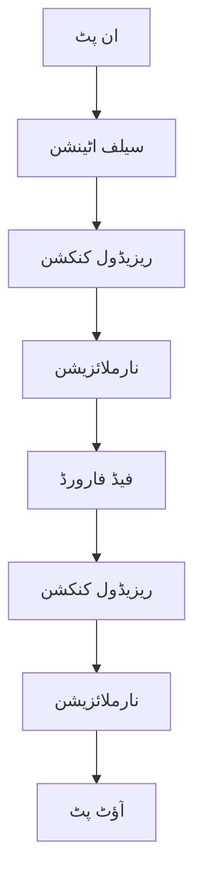

import MermaidDiagram from '@site/src/components/MermaidDiagram';
import Exercise from '@site/src/components/Exercise';
import Quiz from '@site/src/components/Quiz';
import PrerequisiteCheck from '@site/src/components/PrerequisiteCheck';  

# باب 25: روبوٹکس کے لیے ٹرانسفارمر آرکیٹیکچر

## تعارف

ٹرانسفارمر آرکیٹیکچر نے مصنوعی ذہانت کو انقلاب سے دوچار کیا ہے، خاص طور پر قدرتی زبان کی پروسیسنگ میں، اور اب اس نے روبوٹکس میں اپنا اثر ڈالا ہے۔ ٹرانسفارمرز کے دل میں موجود سیلف-اٹینشن مکینزم ماڈلز کو تسلسل ڈیٹا کو پروسیس کرنے کے قابل بناتا ہے جبکہ سیاق و سباق کے رشتے برقرار رکھتا ہے، جو روبوٹکس ایپلی کیشنز کے لیے مثالی ہے جہاں مکانی اور وقتی رشتے اہم ہوتے ہیں۔ یہ باب یہ جائزہ لیتا ہے کہ ٹرانسفارمر آرکیٹیکچر روبوٹکس ایپلی کیشنز کے لیے کیسے اڈاپٹ کیا جاتا ہے، خاص طور پر وژن-زبان-عمل (VLA) سسٹم میں۔

ہم ٹرانسفارمر-بیسڈ روبوٹکس سسٹم کے اجزاء کا جائزہ لیں گے: وژن انکوڈرز جو کیمرہ امیج کو پروسیس کرتے ہیں، زبانی ماڈلز جو قدرتی زبان کے حکم کی تشریح کرتے ہیں، اور اٹینشن مکینزمز جو وژن اور لسانی معلومات کو جوڑ کر روبوٹ ایکشنز جنریٹ کرتے ہیں۔ ان اجزاء کو سمجھنا مؤثر VLA سسٹم نافذ کرنے کے لیے اہم ہے۔

## سیکھنے کے اہداف

اس باب کے اختتام تک، آپ کو اس بات کا اہل ہو جانا چاہیے:

- ٹرانسفارمر آرکیٹیکچر اور اس کی روبوٹکس کے لیے اڈاپٹیشن کی وضاحت کرنا
- ٹرانسفارمر ماڈلز کا استعمال کرتے ہوئے روبوٹک ادراک کے لیے وژن انکوڈرز نافذ کرنا
- روبوٹک کنٹرول سسٹم کے ساتھ زبانی ماڈلز کا انضمام
- ایکشن جنریشن کے لیے وژن اور زبان کو جوڑنے کے لیے اٹینشن مکینزمز کا اطلاق
- کارکردگی اور حفاظت کے لحاظ سے ٹرانسفارمر-بیسڈ روبوٹکس سسٹم کا جائزہ لینا

## شرائطِ لازمہ

اس باب کا آغاز کرنے سے پہلے، یقین کر لیں کہ آپ کے پاس ہے:

- ماڈیول 1 مکمل (ROS 2 کی بنیاد، میسج پاسنگ)
- ماڈیول 2 (ڈیجیٹل ٹوئنز، سیمولیشن کے تصورات)
- ماڈیول 3 (نیویگیشن کے تصورات، Nav2 انضمام)
- باب 24 (VLA پیراڈائم اور تصورات)
- نیورل نیٹ ورکس اور اٹینشن مکینزمز کی بنیادی سمجھ
- ROS 2 ایکشن سرورز اور سروس کالز کا تجربہ

## حقیقی دنیا کی مثلاً: متوجہ شیف

روبوٹکس میں ٹرانسفارمر آرکیٹیکچر کو اس طرح سمجھیں جیسے ایک مہارت رکھنے والا شیف جو ایک ہی وقت میں متعدد معلومات کے سٹریمز کو پروسیس کرتا ہے۔ شیف اجزاء کو دیکھتا ہے (وژن)، آرڈر سنتا ہے (زبان)، اور اس معلومات کو جوڑ کر کھانا پکانے کے ایکشنز انجام دیتا ہے۔ اٹینشن مکینزم شیف کی اس صلاحیت کی طرح کام کرتا ہے جو متعلقہ معلومات پر توجہ مرکوز کرتا ہے جبکہ distractions کو فلٹر کر دیتا ہے - آرڈر سننے پر اس پر توجہ مرکوز کرنا، مخصوص اجزاء پر جب ضرورت ہو تو توجہ دینا، اور مطلوبہ نتیجہ پیدا کرنے کے لیے بصری اور لسانی اشاروں کو جوڑنا۔ ٹرانسفارمر روبوٹس کو متعلقہ معلومات پر توجہ کے ساتھ اسی طرح کا ملٹی ٹاسکنگ کرنے کے قابل بناتے ہیں۔

## بنیادی تصورات

### 1. سیلف-اٹینشن مکینزم

ٹرانسفارمر آرکیٹیکچر کا مرکز سیلف-اٹینشن مکینزم ہے جو ماڈل کو آؤٹ پٹ کے ہر حصے کو جنریٹ کرتے وقت ان پٹ کے مختلف حصوں کی اہمیت کو تولنے کی اجازت دیتا ہے:

- **کویری، کی، ویلیو**: Q = XW_Q، K = XW_K، V = XW_V
- **اٹینشن اسکورز**: Attention(Q, K, V) = softmax(QK^T / √d_k)V
- **مलٹی-ہیڈ اٹینشن**: متوازی طور پر کام کرنے والے متعدد اٹینشن ہیڈز

```python
import torch
import torch.nn as nn
import math

class SelfAttention(nn.Module):
    def __init__(self, embed_dim, num_heads):
        super().__init__()
        self.embed_dim = embed_dim
        self.num_heads = num_heads
        self.head_dim = embed_dim // num_heads

        # لینیئر لیئرز
        self.q_proj = nn.Linear(embed_dim, embed_dim)
        self.k_proj = nn.Linear(embed_dim, embed_dim)
        self.v_proj = nn.Linear(embed_dim, embed_dim)
        self.out_proj = nn.Linear(embed_dim, embed_dim)

    def forward(self, x):
        batch_size, seq_len, embed_dim = x.size()

        # Q, K, V کو حاصل کریں
        Q = self.q_proj(x).view(batch_size, seq_len, self.num_heads, self.head_dim).transpose(1, 2)
        K = self.k_proj(x).view(batch_size, seq_len, self.num_heads, self.head_dim).transpose(1, 2)
        V = self.v_proj(x).view(batch_size, seq_len, self.num_heads, self.head_dim).transpose(1, 2)

        # اٹینشن اسکورز
        scores = torch.matmul(Q, K.transpose(-2, -1)) / math.sqrt(self.head_dim)
        attention_weights = torch.softmax(scores, dim=-1)

        # اٹینشن ایپلائی کریں
        attended = torch.matmul(attention_weights, V)
        attended = attended.transpose(1, 2).contiguous().view(batch_size, seq_len, embed_dim)

        # آؤٹ پٹ لینیئر لیئر
        output = self.out_proj(attended)
        return output, attention_weights
```

| جزو | کام | استعمال |
|-----|-----|---------|
| Q (کویری) | تلاش کے لیے | کون سی معلومات پر توجہ دی جائے |
| K (کی) | مقابلہ کے لیے | معلومات کو دیکھنے کے لیے |
| V (ویلیو) | اعداد و شمار | اصل مواد |

### 2. ٹرانسفارمر بلاک



### 3. VLA کے لیے ٹرانسفارمرز

```python
class VisionLanguageTransformer(nn.Module):
    def __init__(self, vision_dim, text_dim, action_dim):
        super().__init__()

        # وژن انکوڈر
        self.vision_encoder = nn.Sequential(
            nn.Linear(vision_dim, 512),
            nn.ReLU(),
            nn.Linear(512, 512)
        )

        # ٹیکسٹ انکوڈر
        self.text_encoder = nn.Sequential(
            nn.Linear(text_dim, 512),
            nn.ReLU(),
            nn.Linear(512, 512)
        )

        # ٹرانسفارمر لیئرز
        self.transformer_layers = nn.ModuleList([
            TransformerBlock(512, 8) for _ in range(6)
        ])

        # ایکشن ڈیکوڈر
        self.action_decoder = nn.Linear(512, action_dim)

    def forward(self, vision_input, text_input):
        # انکوڈنگ
        vision_features = self.vision_encoder(vision_input)
        text_features = self.text_encoder(text_input)

        # کمبائن فیچرز
        combined_features = torch.cat([vision_features, text_features], dim=1)

        # ٹرانسفارمرز
        for layer in self.transformer_layers:
            combined_features = layer(combined_features)

        # ایکشنز
        actions = self.action_decoder(combined_features[:, -1, :])  # آخری پوزیشن
        return actions
```

---

## وژن انکوڈرز

### CNN-ٹرانسفارمر فیوژن

```python
class VisionEncoder(nn.Module):
    def __init__(self, image_size=224, patch_size=16, embed_dim=768):
        super().__init__()
        self.patch_size = patch_size
        self.num_patches = (image_size // patch_size) ** 2

        # پیچ ایمبیڈنگ
        self.patch_embed = nn.Conv2d(3, embed_dim, patch_size, patch_size)

        # پوزیشن ایمبیڈنگ
        self.pos_embed = nn.Parameter(torch.zeros(1, self.num_patches + 1, embed_dim))

        # کلاس ٹوکن
        self.cls_token = nn.Parameter(torch.zeros(1, 1, embed_dim))

        # ٹرانسفارمر لیئرز
        self.transformer = nn.TransformerEncoder(
            nn.TransformerEncoderLayer(d_model=embed_dim, nhead=12),
            num_layers=12
        )

    def forward(self, x):
        batch_size = x.size(0)

        # پیچز
        x = self.patch_embed(x)  # (B, C, H, W)
        x = x.flatten(2).transpose(1, 2)  # (B, N, C)

        # کلاس ٹوکن شامل کریں
        cls_tokens = self.cls_token.expand(batch_size, -1, -1)
        x = torch.cat([cls_tokens, x], dim=1)

        # پوزیشن ایمبیڈنگ شامل کریں
        x = x + self.pos_embed

        # ٹرانسفارمر
        x = self.transformer(x)

        return x[:, 0]  # کلاس ٹوکن کا آؤٹ پٹ
```

### ROS 2 میں وژن انکوڈر

```python
#!/usr/bin/env python3
# ROS 2 وژن انکوڈر نوڈ
import rclpy
from rclpy.node import Node
from sensor_msgs.msg import Image
from std_msgs.msg import String
from cv_bridge import CvBridge
import torch
import torchvision.transforms as transforms

class VisionEncoderNode(Node):
    def __init__(self):
        super().__init__('vision_encoder_node')

        # سبسکرائبرز
        self.image_sub = self.create_subscription(
            Image,
            '/camera/image_raw',
            self.image_callback,
            10
        )

        # پبلیشرز
        self.feature_pub = self.create_publisher(
            String, '/vision/features', 10
        )

        # کیمرہ کنٹرول
        self.bridge = CvBridge()

        # وژن انکوڈر
        self.vision_encoder = VisionEncoder()
        self.vision_encoder.load_state_dict(torch.load('vision_encoder.pth'))
        self.vision_encoder.eval()

        # ٹرانسفارم
        self.transform = transforms.Compose([
            transforms.Resize((224, 224)),
            transforms.Normalize(mean=[0.485, 0.456, 0.406],
                               std=[0.229, 0.224, 0.225])
        ])

    def image_callback(self, msg):
        """بصری ڈیٹا کو سنبھالیں"""
        try:
            # تصویر کو CV2 میں تبدیل کریں
            cv_image = self.bridge.imgmsg_to_cv2(msg, desired_encoding='bgr8')

            # ٹرانسفارم
            pil_image = transforms.ToPILImage()(cv_image)
            tensor_image = self.transform(pil_image).unsqueeze(0)

            # وژن فیچرز حاصل کریں
            with torch.no_grad():
                features = self.vision_encoder(tensor_image)

            # فیچرز کو JSON میں تبدیل کریں
            features_json = self.features_to_json(features)

            # فیچرز شائع کریں
            feature_msg = String()
            feature_msg.data = features_json
            self.feature_pub.publish(feature_msg)

            self.get_logger().info('وژن فیچرز شائع کیے گئے')

        except Exception as e:
            self.get_logger().error(f'وژن انکوڈر میں خرابی: {e}')

    def features_to_json(self, features):
        """فیچرز کو JSON میں تبدیل کریں"""
        import json
        features_list = features.cpu().numpy().flatten().tolist()
        return json.dumps(features_list)

def main(args=None):
    rclpy.init(args=args)
    vision_encoder_node = VisionEncoderNode()

    try:
        rclpy.spin(vision_encoder_node)
    except KeyboardInterrupt:
        print("وژن انکوڈر نوڈ کو بند کیا جا رہا ہے")

    vision_encoder_node.destroy_node()
    rclpy.shutdown()

if __name__ == '__main__':
    main()
```

---

## زبانی ماڈلز

### ٹرانسفارمر بیسڈ زبانی ماڈل

```python
class LanguageEncoder(nn.Module):
    def __init__(self, vocab_size=30522, embed_dim=512, max_length=512):
        super().__init__()
        self.embed_dim = embed_dim
        self.max_length = max_length

        # ورڈ ایمبیڈنگ
        self.token_embed = nn.Embedding(vocab_size, embed_dim)

        # پوزیشن ایمبیڈنگ
        self.pos_embed = nn.Embedding(max_length, embed_dim)

        # ٹرانسفارمر لیئرز
        self.transformer = nn.TransformerEncoder(
            nn.TransformerEncoderLayer(d_model=embed_dim, nhead=8),
            num_layers=6
        )

        # ٹوکنائزر (سادہ کے لیے)
        self.tokenizer = SimpleTokenizer(vocab_size)

    def forward(self, text_ids):
        batch_size, seq_len = text_ids.size()

        # ورڈ ایمبیڈنگ
        token_embeds = self.token_embed(text_ids)

        # پوزیشن ایمبیڈنگ
        positions = torch.arange(0, seq_len).expand(batch_size, seq_len).to(text_ids.device)
        pos_embeds = self.pos_embed(positions)

        # کمبائن ایمبیڈنگ
        x = token_embeds + pos_embeds

        # ٹرانسفارمر
        x = self.transformer(x.transpose(0, 1)).transpose(0, 1)

        # کلاس ٹوکن (اگر ہو)
        cls_output = x[:, 0, :] if x.size(1) > 0 else x.mean(dim=1)
        return cls_output

class SimpleTokenizer:
    def __init__(self, vocab_size):
        self.vocab_size = vocab_size
        self.word_to_id = {}
        self.id_to_word = {}

    def encode(self, text):
        """ٹیکسٹ کو ٹوکنائز کریں"""
        # سادہ ٹوکنائزیشن
        words = text.lower().split()
        ids = []
        for word in words:
            if word not in self.word_to_id:
                self.word_to_id[word] = len(self.word_to_id)
                self.id_to_word[len(self.id_to_word)] = word
            ids.append(self.word_to_id[word])
        return torch.tensor(ids).unsqueeze(0)  # (1, seq_len)
```

### زبانی انضمام

```python
class MultimodalFusion(nn.Module):
    def __init__(self, vision_dim=512, text_dim=512, fusion_dim=1024):
        super().__init__()

        # فیوژن لینیئر لیئر
        self.fusion = nn.Linear(vision_dim + text_dim, fusion_dim)

        # اٹینشن لیئر
        self.attention = SelfAttention(fusion_dim, 8)

        # نارملائزیشن
        self.norm = nn.LayerNorm(fusion_dim)

    def forward(self, vision_features, text_features):
        # فیچرز کو کنکیٹینیٹ کریں
        combined = torch.cat([vision_features, text_features], dim=-1)

        # فیوژن
        fused = self.fusion(combined)

        # اٹینشن
        attended, _ = self.attention(fused.unsqueeze(1))
        attended = attended.squeeze(1)

        # نارملائزیشن
        output = self.norm(attended)

        return output
```

---

## ایکشن جنریشن

### ٹرانسفارمر سے ایکشنز

```python
class ActionDecoder(nn.Module):
    def __init__(self, input_dim=1024, action_dim=6, max_action=1.0):
        super().__init__()

        # ہیڈز
        self.linear = nn.Sequential(
            nn.Linear(input_dim, 512),
            nn.ReLU(),
            nn.Linear(512, 256),
            nn.ReLU(),
            nn.Linear(256, action_dim)
        )

        # ایکشن کو سکیل کریں
        self.max_action = max_action

    def forward(self, features):
        actions = self.linear(features)
        actions = torch.tanh(actions) * self.max_action
        return actions

class VLAAgent(nn.Module):
    def __init__(self):
        super().__init__()

        self.vision_encoder = VisionEncoder()
        self.language_encoder = LanguageEncoder()
        self.multimodal_fusion = MultimodalFusion()
        self.action_decoder = ActionDecoder()

    def forward(self, image, text):
        # وژن فیچرز
        vision_features = self.vision_encoder(image)

        # ٹیکسٹ فیچرز
        text_features = self.language_encoder(text)

        # فیوژن
        fused_features = self.multimodal_fusion(vision_features, text_features)

        # ایکشنز
        actions = self.action_decoder(fused_features)

        return actions
```

---

## مشق

**ٹرانسفارمر کا انتخاب**: مختلف روبوٹکس کاموں کے لیے ٹرانسفارمر ماڈل کا انتخاب کریں:

1. **وژن**: Vision Transformer (ViT) - تصاویر کی تشریح
2. **زبان**: BERT - ٹیکسٹ کی سمجھ
3. **ایکشن**: Decision Transformer - کنٹرول
4. **ملٹی ماڈل**: CLIP - وژن-زبان

<Quiz
  title="روبوٹکس کے لیے ٹرانسفارمر آرکیٹیکچر"
  questions={[
    {
      question: "سیلف-اٹینشن مکینزم کیا کرتا ہے؟",
      options: ["ڈیٹا کو کم کرتا ہے", "مختلف ان پٹس کی اہمیت کو تولتا ہے", "صرف وژن کو دیکھتا ہے", "صرف زبان کو سمجھتا ہے"],
      answer: 1,
      explanation: "سیلف-اٹینشن مختلف ان پٹس کی اہمیت کو تولتا ہے"
    },
    {
      question: "VLA ماڈل میں کون سے ماڈلیٹیز ہوتی ہیں؟",
      options: ["وژن اور زبان", "زبان اور ایکشن", "وژن، زبان، اور ایکشن", "صرف ایکشن"],
      answer: 2,
      explanation: "VLA ماڈل میں وژن، زبان، اور ایکشن تینوں ہوتی ہیں"
    }
  ]}
/>
