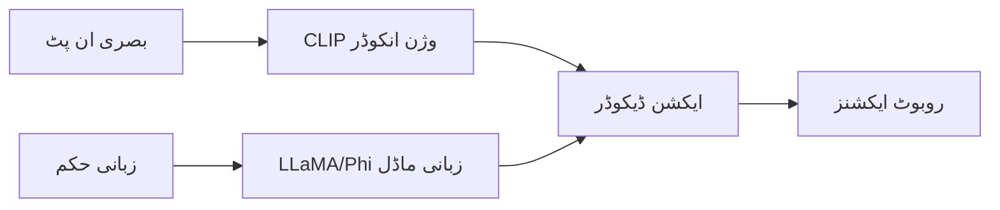

import MermaidDiagram from '@site/src/components/MermaidDiagram';
import Exercise from '@site/src/components/Exercise';
import Quiz from '@site/src/components/Quiz';
import PrerequisiteCheck from '@site/src/components/PrerequisiteCheck';  

# باب 26: اوپن وی ایل اے اور آر ٹی-2 ڈیپ ڈائیو

## تعارف

اوپن وی ایل اے اور آر ٹی-2 ویژن-زبان-عمل (VLA) سسٹم میں جدید ترین ترقیات کی نمائندگی کرتے ہیں، جو بڑے زبانی ماڈلز اور روبوٹک کنٹرول کے درمیان خلاء کو پا کرتے ہیں۔ یہ ماڈلز قدرتی زبان کو جسمانی سسٹم کو کنٹرول کرنے کے جامع انٹرفیس کے طور پر استعمال کے امکانات کو ظاہر کرتے ہیں، جس سے روبوٹس پیچیدہ حکم کی تشریح کر سکتے ہیں اور جامع مینیپولیشن اور نیویگیشن کام انجام دے سکتے ہیں۔

اوپن وی ایل اے (Open Vision-Language-Action Models) قابلِ رسائی VLA ریسرچ کی ضرورت کے جواب میں اوپن سورس کمیونٹی کا جواب ہے، جبکہ گوگل ڈیپ مائنڈ سے آر ٹی-2 (Robotics Transformer 2) ملٹی ماڈل روبوٹ لرننگ کے صنعتی سطح کے ایپروچز کو ظاہر کرتا ہے۔ دونوں ماڈلز کو بنیادی بصیرت شیئر کرتے ہیں کہ بصری ادراک، زبانی سمجھ، اور ایکشن جنریشن کو ایک نیورل نیٹ ورک آرکیٹیکچر میں متحد کیا جا سکتا ہے۔

یہ باب ان ماڈلز کا جامع جائزہ فراہم کرتا ہے، ان کے آرکیٹیکچرل ایجاد، تربیت کے طریقے، اور روبوٹکس ایپلی کیشنز کے لیے عملی ڈیپلائمنٹ کے امور کا جائزہ لیتے ہوئے۔

## سیکھنے کے اہداف

اس باب کے اختتام تک، آپ کو اس بات کا اہل ہو جانا چاہیے:

- اوپن وی ایل اے اور آر ٹی-2 ماڈل آرکیٹیکچر اور ان کی ایجاد کی وضاحت کرنا
- روبوٹک کنٹرول ایپلی کیشنز کے لیے VLA ماڈل انفرینس نافذ کرنا
- روبوٹ ایکشن جنریشن کے لیے پری ٹرینڈ ماڈلز ڈیپلائی کرنا
- VLA ماڈل کارکردگی اور حفاظتی تصورات کا جائزہ لینا
- کسٹم روبوٹکس کاموں اور ڈیٹا سیٹس پر VLA ماڈلز کو فائن ٹیون کرنا
- مختلف VLA ایپروچز اور ان کے ٹریڈ آف کا موازنہ کرنا

## شرائطِ لازمہ

اس باب کا آغاز کرنے سے پہلے، یقین کر لیں کہ آپ کے پاس ہے:

- ماڈیول 1 مکمل (ROS 2 کی بنیاد، میسج پاسنگ)
- ماڈیول 2 (ڈیجیٹل ٹوئنز، سیمولیشن کے تصورات)
- ماڈیول 3 (نیویگیشن کے تصورات، Nav2 انضمام)
- باب 24 (VLA پیراڈائم اور تصورات)
- باب 25 (روبوٹکس کے لیے ٹرانسفارمر آرکیٹیکچر)
- نیورل نیٹ ورکس اور اٹینشن مکینزمز کی بنیادی سمجھ
- ROS 2 ایکشن سرورز اور سروس کالز کا تجربہ

## حقیقی دنیا کی مثلاً: جامع مترجم روبوٹ

اوپن وی ایل اے اور آر ٹی-2 کو اس طرح سمجھیں جیسے روبوٹس کے لیے ایک جامع مترجم جو انسانی زبان اور بصری دنیا دونوں کو سمجھتا ہے۔ جس طرح اسٹار ٹرک کا جامع مترجم مختلف نسلوں کے درمیان مواصلت کو فعال کرنے کے لیے زبان اور سیاق و سباق کی تشریح کرتا ہے، VLA ماڈلز انسانی حکم ("لال کپ کو اٹھائیں اور اسے میز پر رکھیں") کو درست روبوٹ ایکشنز میں تبدیل کرتے ہیں جو زبانی مطلب اور بصری منظر دونوں کو سمجھتا ہے۔ ماڈل صرف اشیاء کو پہچانتا نہیں بلکہ زبان، وژن، اور جسمانی ایکشنز کے درمیان رشتے کو سمجھتا ہے جو کام کو مکمل کرنے کے لیے ضروری ہے۔

## بنیادی تصورات

### 1. اوپن وی ایل اے آرکیٹیکچر

اوپن وی ایل اے ایک وژن انکوڈر (CLIP) کو ایک زبانی ماڈل (LLaMA/Phi) اور ایک ڈفیوژن-بیسڈ ایکشن ڈیکوڈر کے ساتھ جوڑتا ہے:



| جزو | کام | ماڈل |
|-----|-----|------|
| وژن انکوڈر | تصاویر کو سمجھنا | CLIP |
| زبانی ماڈل | حکم کی تشریح | LLaMA/Phi |
| ایکشن ڈیکوڈر | ایکشنز جنریٹ کرنا | ڈفیوژن |

### 2. آر ٹی-2 آرکیٹیکچر

آر ٹی-2 ایک ٹرانسفارمر-بیسڈ ماڈل ہے جو وژن اور زبان کو ایکشنز میں تبدیل کرتا ہے:

```python
class OpenVLA:
    def __init__(self):
        # CLIP وژن انکوڈر
        self.vision_encoder = CLIPVisionModel.from_pretrained("openai/clip-vit-base-patch32")

        # LLaMA زبانی ماڈل
        self.language_model = LlamaForCausalLM.from_pretrained("meta-llama/Llama-2-7b-hf")

        # ایکشن ڈیکوڈر
        self.action_decoder = DiffusionActionDecoder()

    def forward(self, image, text):
        # وژن فیچرز
        vision_features = self.vision_encoder(image).last_hidden_state

        # زبانی فیچرز
        text_features = self.language_model.get_input_embeddings()(text)

        # فیوژن
        fused_features = self.fusion(vision_features, text_features)

        # ایکشنز
        actions = self.action_decoder(fused_features)

        return actions

class RT2:
    def __init__(self):
        # یونیفائیڈ ٹرانسفارمر
        self.transformer = UnifiedTransformer(
            vision_dim=768,
            text_dim=4096,
            action_dim=14  # 7 جوائنٹس * 2 (پوزیشن + ویلوسٹی)
        )

    def forward(self, image, text):
        # وژن اور ٹیکسٹ کو کمبائن کریں
        combined_input = torch.cat([image, text], dim=-1)

        # ٹرانسفارمر
        output = self.transformer(combined_input)

        # ایکشنز
        actions = self.action_head(output)

        return actions
```

---

## اوپن وی ایل اے نفاذ

### اوپن وی ایل اے ماڈل

```python
import torch
import torch.nn as nn
from transformers import CLIPVisionModel, LlamaForCausalLM

class OpenVLAModel(nn.Module):
    def __init__(self, vision_dim=768, text_dim=4096, action_dim=6):
        super().__init__()

        # CLIP وژن انکوڈر
        self.vision_encoder = CLIPVisionModel.from_pretrained("openai/clip-vit-base-patch32")

        # LLaMA زبانی ماڈل
        self.text_encoder = LlamaForCausalLM.from_pretrained("meta-llama/Llama-2-7b-hf")

        # فیوژن لینیئر
        self.fusion = nn.Linear(vision_dim + text_dim, 1024)

        # ایکشن ڈیکوڈر
        self.action_decoder = nn.Sequential(
            nn.Linear(1024, 512),
            nn.ReLU(),
            nn.Linear(512, 256),
            nn.ReLU(),
            nn.Linear(256, action_dim)
        )

    def forward(self, image, text_ids):
        # وژن فیچرز
        vision_outputs = self.vision_encoder(pixel_values=image)
        vision_features = vision_outputs.last_hidden_state.mean(dim=1)  # [B, vision_dim]

        # ٹیکسٹ فیچرز
        text_outputs = self.text_encoder.model.forward(input_ids=text_ids)
        text_features = text_outputs.last_hidden_state.mean(dim=1)  # [B, text_dim]

        # فیوژن
        combined_features = torch.cat([vision_features, text_features], dim=-1)
        fused_features = self.fusion(combined_features)

        # ایکشنز
        actions = self.action_decoder(fused_features)

        return actions
```

### ROS 2 میں اوپن وی ایل اے

```python
#!/usr/bin/env python3
# ROS 2 اوپن وی ایل اے نوڈ
import rclpy
from rclpy.node import Node
from sensor_msgs.msg import Image
from std_msgs.msg import String
from geometry_msgs.msg import Twist
from cv_bridge import CvBridge
import torch
from transformers import AutoTokenizer

class OpenVLAROSNode(Node):
    def __init__(self):
        super().__init__('openvla_ros_node')

        # سبسکرائبرز
        self.image_sub = self.create_subscription(
            Image,
            '/camera/image_raw',
            self.image_callback,
            10
        )

        self.command_sub = self.create_subscription(
            String,
            '/openvla/command',
            self.command_callback,
            10
        )

        # پبلیشرز
        self.cmd_vel_pub = self.create_publisher(Twist, '/cmd_vel', 10)

        # کیمرہ کنٹرول
        self.bridge = CvBridge()

        # اوپن وی ایل اے ماڈل
        self.model = OpenVLAModel()
        self.model.load_state_dict(torch.load('openvla_model.pth'))
        self.model.eval()

        # ٹوکنائزر
        self.tokenizer = AutoTokenizer.from_pretrained("meta-llama/Llama-2-7b-hf")

        # وضاحتی متغیرات
        self.current_image = None
        self.current_command = None

        # ڈیوائس
        self.device = torch.device('cuda' if torch.cuda.is_available() else 'cpu')
        self.model.to(self.device)

    def image_callback(self, msg):
        """بصری ڈیٹا کو سنبھالیں"""
        try:
            image = self.bridge.imgmsg_to_cv2(msg, desired_encoding='bgr8')
            # تصویر کو پروسیس کریں
            self.current_image = self.preprocess_image(image)
        except Exception as e:
            self.get_logger().error(f'تصویر کی پروسیسنگ میں خرابی: {e}')

    def command_callback(self, msg):
        """زبانی حکم کو سنبھالیں"""
        self.current_command = msg.data
        if self.current_image is not None:
            self.execute_openvla_command()

    def preprocess_image(self, image):
        """تصویر کو پری پروسیس کریں"""
        import torchvision.transforms as transforms

        transform = transforms.Compose([
            transforms.ToTensor(),
            transforms.Resize((224, 224)),
            transforms.Normalize(mean=[0.485, 0.456, 0.406],
                               std=[0.229, 0.224, 0.225])
        ])

        tensor_image = transform(image).unsqueeze(0)  # [1, 3, 224, 224]
        return tensor_image.to(self.device)

    def execute_openvla_command(self):
        """اوپن وی ایل اے کمانڈ انجام دیں"""
        if self.current_image is not None and self.current_command is not None:
            try:
                # ٹیکسٹ کو ٹوکنائز کریں
                text_tokens = self.tokenizer(
                    self.current_command,
                    return_tensors='pt',
                    padding=True,
                    truncation=True,
                    max_length=512
                ).input_ids.to(self.device)

                # ماڈل کو چلائیں
                with torch.no_grad():
                    actions = self.model(self.current_image, text_tokens)

                # ایکشنز کو ROS 2 میسج میں تبدیل کریں
                cmd_vel = self.actions_to_cmd_vel(actions)
                self.cmd_vel_pub.publish(cmd_vel)

                self.get_logger().info(f'اوپن وی ایل اے کمانڈ انجام دیا: {self.current_command}')
            except Exception as e:
                self.get_logger().error(f'اوپن وی ایل اے کمانڈ میں خرابی: {e}')

    def actions_to_cmd_vel(self, actions):
        """ایکشنز کو cmd_vel میں تبدیل کریں"""
        cmd_vel = Twist()

        # فرض کریں کہ ایکشنز [linear_x, linear_y, linear_z, angular_x, angular_y, angular_z] ہیں
        actions_np = actions.cpu().numpy().flatten()

        if len(actions_np) >= 6:
            cmd_vel.linear.x = float(actions_np[0])
            cmd_vel.linear.y = float(actions_np[1])
            cmd_vel.linear.z = float(actions_np[2])
            cmd_vel.angular.x = float(actions_np[3])
            cmd_vel.angular.y = float(actions_np[4])
            cmd_vel.angular.z = float(actions_np[5])

        return cmd_vel

def main(args=None):
    rclpy.init(args=args)
    openvla_node = OpenVLAROSNode()

    try:
        rclpy.spin(openvla_node)
    except KeyboardInterrupt:
        print("اوپن وی ایل اے نوڈ کو بند کیا جا رہا ہے")

    openvla_node.destroy_node()
    rclpy.shutdown()

if __name__ == '__main__':
    main()
```

---

## آر ٹی-2 نفاذ

### آر ٹی-2 ماڈل

```python
class RT2Model(nn.Module):
    def __init__(self, vision_dim=768, text_dim=512, action_dim=14):
        super().__init__()

        # وژن انکوڈر (ResNet بیسڈ)
        self.vision_encoder = torch.hub.load('pytorch/vision:v0.10.0', 'resnet50', pretrained=True)
        self.vision_encoder.fc = nn.Linear(2048, vision_dim)

        # ٹیکسٹ انکوڈر
        self.text_encoder = nn.Sequential(
            nn.Embedding(30522, text_dim),  #.vocab_size
            nn.TransformerEncoder(
                nn.TransformerEncoderLayer(d_model=text_dim, nhead=8),
                num_layers=6
            )
        )

        # یونیفائیڈ ٹرانسفارمر
        self.unified_transformer = nn.TransformerEncoder(
            nn.TransformerEncoderLayer(d_model=vision_dim + text_dim, nhead=16),
            num_layers=12
        )

        # ایکشن ڈیکوڈر
        self.action_decoder = nn.Sequential(
            nn.Linear(vision_dim + text_dim, 512),
            nn.ReLU(),
            nn.Linear(512, 256),
            nn.ReLU(),
            nn.Linear(256, action_dim)
        )

    def forward(self, image, text_ids):
        # وژن فیچرز
        vision_features = self.vision_encoder(image)  # [B, vision_dim]

        # ٹیکسٹ فیچرز
        text_features = self.text_encoder(text_ids)  # [B, seq_len, text_dim]
        text_features = text_features.mean(dim=1)  # [B, text_dim]

        # کمبائن فیچرز
        combined_features = torch.cat([vision_features, text_features], dim=-1)  # [B, vision_dim + text_dim]

        # یونیفائیڈ ٹرانسفارمر
        unified_features = self.unified_transformer(combined_features.unsqueeze(1)).squeeze(1)

        # ایکشنز
        actions = self.action_decoder(unified_features)

        return actions
```

---

## VLA ماڈلز کو فائن ٹیون کرنا

### ڈیٹا سیٹ کی تیاری

```python
class VLADataSet(torch.utils.data.Dataset):
    def __init__(self, data_path):
        self.data_path = data_path
        self.data = self.load_data()

    def load_data(self):
        """VLA ڈیٹا لوڈ کریں"""
        # ڈیٹا کو JSON/CSV/PT فائل سے لوڈ کریں
        # [{'image': ..., 'command': ..., 'action': ...}, ...]
        pass

    def __len__(self):
        return len(self.data)

    def __getitem__(self, idx):
        sample = self.data[idx]

        # تصویر
        image = self.preprocess_image(sample['image'])

        # حکم
        command = sample['command']
        text_tokens = self.tokenize_command(command)

        # ایکشن
        action = torch.tensor(sample['action'], dtype=torch.float32)

        return {
            'image': image,
            'command': text_tokens,
            'action': action
        }

def fine_tune_vla(model, dataset, epochs=10, lr=1e-5):
    """VLA ماڈل کو فائن ٹیون کریں"""

    dataloader = torch.utils.data.DataLoader(dataset, batch_size=8, shuffle=True)
    optimizer = torch.optim.AdamW(model.parameters(), lr=lr)
    criterion = nn.MSELoss()

    model.train()
    for epoch in range(epochs):
        total_loss = 0
        for batch in dataloader:
            optimizer.zero_grad()

            images = batch['image']
            commands = batch['command']
            actions = batch['action']

            predicted_actions = model(images, commands)
            loss = criterion(predicted_actions, actions)

            loss.backward()
            optimizer.step()

            total_loss += loss.item()

        avg_loss = total_loss / len(dataloader)
        print(f'ایپوک {epoch + 1}/{epochs}, نقصان: {avg_loss:.4f}')
```

---

## کارکردگی کا جائزہ

### VLA ماڈل کارکردگی کے میٹرکس

```python
def evaluate_vla_performance(model, test_dataset):
    """VLA ماڈل کارکردگی کا جائزہ لیں"""

    metrics = {
        'action_accuracy': [],
        'command_understanding': [],
        'vision_accuracy': [],
        'execution_success': [],
        'response_time': []
    }

    model.eval()
    with torch.no_grad():
        for sample in test_dataset:
            start_time = time.time()

            # ماڈل کو چلائیں
            predicted_action = model(sample['image'], sample['command'])

            # کارروائی کی درستگی
            action_acc = calculate_action_accuracy(predicted_action, sample['action'])
            metrics['action_accuracy'].append(action_acc)

            # کمانڈ کی سمجھ
            cmd_understanding = check_command_understanding(sample['command'], predicted_action)
            metrics['command_understanding'].append(cmd_understanding)

            # انجام کی کامیابی
            exec_success = simulate_action_execution(predicted_action, sample['environment'])
            metrics['execution_success'].append(exec_success)

            # جواب کا وقت
            response_time = time.time() - start_time
            metrics['response_time'].append(response_time)

    # اوسط میٹرکس
    avg_metrics = {}
    for key, values in metrics.items():
        if values:
            avg_metrics[key] = sum(values) / len(values)
        else:
            avg_metrics[key] = 0.0

    return avg_metrics
```

---

## حفاظتی تصورات

### VLA ماڈل کے لیے حفاظت

```python
class SafeVLAController:
    def __init__(self):
        self.max_velocity = 0.5  # میٹر/سیکنڈ
        self.safety_bounds = {
            'linear': (-1.0, 1.0),
            'angular': (-1.0, 1.0)
        }
        self.emergency_stop_threshold = 0.9  # خطرے کی حد

    def safe_action(self, raw_action, current_state):
        """ایکشن کو محفوظ بنائیں"""
        # حدود کو چیک کریں
        linear_x = max(
            self.safety_bounds['linear'][0],
            min(raw_action.linear.x, self.safety_bounds['linear'][1])
        )
        angular_z = max(
            self.safety_bounds['angular'][0],
            min(raw_action.angular.z, self.safety_bounds['angular'][1])
        )

        # زیادہ سے زیادہ ویلوسٹی کو چیک کریں
        linear_x = min(abs(linear_x), self.max_velocity) * (1 if linear_x >= 0 else -1)
        angular_z = min(abs(angular_z), self.max_velocity) * (1 if angular_z >= 0 else -1)

        # حفاظتی چیک
        if self.is_emergency_action(raw_action):
            return self.emergency_stop()

        safe_action = Twist()
        safe_action.linear.x = linear_x
        safe_action.angular.z = angular_z

        return safe_action

    def is_emergency_action(self, action):
        """ہنگامی ایکشن چیک کریں"""
        # ایکشن کی اہمیت کو چیک کریں
        magnitude = (action.linear.x**2 + action.angular.z**2)**0.5
        return magnitude > self.emergency_stop_threshold

    def emergency_stop(self):
        """ہنگامی بندی"""
        stop_action = Twist()
        stop_action.linear.x = 0.0
        stop_action.angular.z = 0.0
        return stop_action
```

---

## مشق

**VLA ماڈل کا انتخاب**: مختلف ایپلی کیشنز کے لیے VLA ماڈل کا انتخاب کریں:

1. **ریسرچ**: OpenVLA (اوپن سورس)
2. **صنعتی**: RT-2 (درستگی)
3. **فائن ٹیوننگ**: CLIP + LLaMA (لچک)
4. **ریل ٹائم**: MobileVLA (کم وسائل)

<Quiz
  title="اوپن وی ایل اے اور آر ٹی-2"
  questions={[
    {
      question: "OpenVLA کون سے ماڈلز کو جوڑتا ہے؟",
      options: ["CLIP اور LLaMA", "BERT اور GPT", "ResNet اور LSTM", "ViT اور T5"],
      answer: 0,
      explanation: "OpenVLA CLIP وژن انکوڈر اور LLaMA/Phi زبانی ماڈل کو جوڑتا ہے"
    },
    {
      question: "RT-2 کیا استعمال کرتا ہے؟",
      options: ["ریکرینٹ نیٹ ورک", "ٹرانسفارمر", "CNN", "GAN"],
      answer: 1,
      explanation: "RT-2 ٹرانسفارمر آرکیٹیکچر استعمال کرتا ہے"
    }
  ]}
/>
