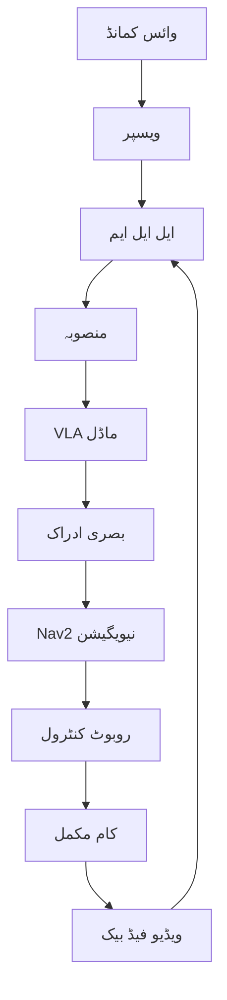

import MermaidDiagram from '@site/src/components/MermaidDiagram';
import CodeExample from '@site/src/components/CodeExample';
import Exercise from '@site/src/components/Exercise';
import Quiz from '@site/src/components/Quiz';
import PrerequisiteCheck from '@site/src/components/PrerequisiteCheck';

# باب 28: کیپسٹون پروجیکٹ - وائس ٹو ایکشن پائپ لائن

<PrerequisiteCheck prerequisites={frontMatter.prerequisites} />

:::info کیپسٹون پروجیکٹ کی ساخت
یہ باب روایتی باب کی شکل سے انحراف کرتا ہے۔ تصورات → مثالیں → مشق کے بجائے، یہ ایک **جامع پروجیکٹ گائیڈ** کی طرح ساخت یافتہ ہے جس میں:
- پروجیکٹ جائزہ اور محرک
- تین ٹیئر نفاذ کے متغیرات (A/B/C)
- سکیفولڈنگ کوڈ اور اسٹارٹر ٹیمپلیٹس
- جائزہ روبک اور جمع کروانے کی ضروریات
- ٹربول شوٹنگ کے وسائل
:::

---

## کیپسٹون تک پہنچنے پر مبارکباد!

آپ نے 27 ابواب مکمل کر لیے ہیں جن میں شامل ہے:
- **ماڈیول 1**: ROS 2 کی بنیاد، پائی تھون کنٹرول، URDF روبوٹ ماڈلنگ، سینسرز/ایکچوایٹرز، حفاظتی پروٹوکولز

- **ماڈیول 2**: گیزبو سیمولیشن، Isaac Sim، GPU فزکس/رینڈرنگ، ڈومین رینڈمائزیشن، سیم-ٹو-ریئل ٹرانسفر

- **ماڈیول 3**: نیویگیشن کے تصورات، Nav2 اسٹیک، SLAM الگورتھم، VSLAM، VIO، وائس-کنٹرولڈ نیویگیشن

- **ماڈیول 4**: وی ایل اے پیراڈائم، ٹرانسفارمر آرکیٹیکچر، OpenVLA/RT-2، ویسپر/ایل ایل ایم منصوبہ بندی، فائن ٹیوننگ

آپ کے پاس اب وہ تمام ٹولز، تصورات، اور عملی مہارتوں کا مجموعہ ہے جو جسمانی دنیا میں کام کرنے والے اے آئی سسٹم کو ڈیزائن، تعمیر، اور ڈیپلائی کرنے کے لیے ضروری ہے۔

## پروجیکٹ کا جائزہ

### ون سینٹر اسٹیٹمنٹ

**"ایک وائس کنٹرولڈ روبوٹ تیار کریں جو قدرتی زبان کے حکم کی تشریح کر سکے، کمرے کے منظر نامے کو سمجھ سکے، اور کام کو کامیابی سے انجام دے۔"**

### تکنیکی چیلنج

- **وائس کا انٹرفیس**: ویسپر اسپیچ ٹو ٹیکسٹ کے ذریعے قدرتی زبان کے حکم کو تبدیل کریں
- **ایل ایل ایم منصوبہ بندی**: ٹیکسٹ کے حکم کو ایکشن سیکوئنس میں تبدیل کریں (مثلاً "کچن میں جاؤ → لال کپ تلاش کریں → اسے اٹھائیں → ڈیسک پر رکھیں")
- **بصری ادراک**: کیمرہ امیج کے ذریعے اشیاء کی شناخت اور مقام کاری
- **نیویگیشن**: Nav2 کا استعمال کرتے ہوئے منزل تک نیویگیٹ کریں
- **مینیپولیشن**: روبوٹ ایکشنز کو کنٹرول کریں تاکہ چیزیں اٹھائی جا سکیں اور رکھی جا سکیں



### ٹیئر سپورٹ

| ٹیئر | سطح | کام | ضروریات |
|------|-----|-----|---------|
| A | شروع کرنے والا | وائس → نیویگیشن | Nav2، 2D نیویگیشن |
| B | متوسط | وائس → نیویگیشن + مینیپولیشن | 7-ڈو فور ایم، 3D ادراک |
| C | اعلیٰ | وائس → پلاننگ + مینیپولیشن | ایل ایل ایم، VLA، کیپسٹون روبوٹ |

---

## ٹیئر A: وائس ٹو نیویگیشن

### ٹیکنیکل میٹرکس

- **کامیابی کی شرح**: 80%+ وائس کمانڈز کو صحیح طور پر تشریح کرنا
- **جواب کا وقت**: < 3 سیکنڈ
- **نیویگیشن کی درستگی**: < 0.1 میٹر کی غلطی
- **سافٹ ویئر کا انضمام**: ROS 2، Nav2، ویسپر

### نفاذ کے اقدامات

1. **وائس ان پٹ**: ویسپر کا استعمال کرتے ہوئے تقریر کو ٹیکسٹ میں تبدیل کریں
2. **کمانڈ پارسنگ**: ٹیکسٹ کو نیویگیشن کے حکم میں تبدیل کریں
3. **Nav2 انضمام**: Nav2 کو نیویگیشن کے حکم کے لیے چلائیں
4. **سیفٹی چیکس**: ہنگامی بندی، رکاوٹ کا پتہ لگانا

### کوڈ سکیلیٹن

```python
#!/usr/bin/env python3
# ٹیئر A: وائس ٹو نیویگیشن نوڈ
import rclpy
from rclpy.node import Node
from std_msgs.msg import String
from geometry_msgs.msg import PoseStamped
from rclpy.action import ActionClient
from nav2_msgs.action import NavigateToPose
import openai
import speech_recognition as sr

class VoiceNavigationNode(Node):
    def __init__(self):
        super().__init__('voice_navigation_node')

        # سبسکرائبرز
        self.voice_command_sub = self.create_subscription(
            String,
            '/voice/command',
            self.voice_command_callback,
            10
        )

        # ایکشن کلائنٹ
        self.nav_to_pose_client = ActionClient(
            self, NavigateToPose, 'navigate_to_pose'
        )

        # وائس کی ترتیبات
        self.recognizer = sr.Recognizer()
        self.microphone = sr.Microphone()

        # نیویگیشن کے لیے مقامات
        self.location_map = {
            'kitchen': (2.0, 1.0, 0.0),
            'living room': (0.0, 0.0, 0.0),
            'bedroom': (3.0, -1.0, 1.57),
            'bathroom': (-1.0, 2.0, -1.57)
        }

    def voice_command_callback(self, msg):
        """وائس کمانڈ کو سنبھالیں"""
        command = msg.data.lower()
        self.get_logger().info(f'وائس کمانڈ موصول: {command}')

        # نیویگیشن کا حکم تلاش کریں
        if 'go to' in command:
            destination = self.extract_destination(command)
            if destination:
                self.navigate_to_location(destination)

    def extract_destination(self, command):
        """کمانڈ سے مقصد نکالیں"""
        for location in self.location_map.keys():
            if location in command:
                return location
        return None

    def navigate_to_location(self, location):
        """مقام کی طرف نیویگیٹ کریں"""
        if location in self.location_map:
            x, y, theta = self.location_map[location]

            goal_msg = NavigateToPose.Goal()
            goal_msg.pose.header.frame_id = 'map'
            goal_msg.pose.header.stamp = self.get_clock().now().to_msg()
            goal_msg.pose.pose.position.x = x
            goal_msg.pose.pose.position.y = y
            goal_msg.pose.pose.position.z = 0.0

            # کوارٹنین حساب
            from math import sin, cos
            cy = cos(theta * 0.5)
            sy = sin(theta * 0.5)
            goal_msg.pose.pose.orientation.z = sy
            goal_msg.pose.pose.orientation.w = cy

            self.send_navigation_goal(goal_msg)

    def send_navigation_goal(self, goal_msg):
        """نیویگیشن کا مقصد بھیجیں"""
        self.nav_to_pose_client.wait_for_server()
        future = self.nav_to_pose_client.send_goal_async(goal_msg)
        future.add_done_callback(self.navigation_goal_response_callback)

    def navigation_goal_response_callback(self, future):
        """نیویگیشن کا مقصد جواب"""
        goal_handle = future.result()
        if not goal_handle.accepted:
            self.get_logger().info('نیویگیشن کا مقصد قبول نہیں کیا گیا')
            return

        self.get_logger().info('نیویگیشن کا مقصد قبول کر لیا گیا')
        result_future = goal_handle.get_result_async()
        result_future.add_done_callback(self.navigation_result_callback)

    def navigation_result_callback(self, future):
        """نیویگیشن کا نتیجہ"""
        result = future.result().result
        self.get_logger().info('نیویگیشن مکمل ہو گئی')

def main(args=None):
    rclpy.init(args=args)
    voice_nav_node = VoiceNavigationNode()
    rclpy.spin(voice_nav_node)
    voice_nav_node.destroy_node()
    rclpy.shutdown()

if __name__ == '__main__':
    main()
```

---

## ٹیئر B: وائس ٹو نیویگیشن + مینیپولیشن

### ٹیکنیکل میٹرکس

- **کامیابی کی شرح**: 70%+ مینیپولیشن کامیابی
- **ادراک کی درستگی**: 90%+ اشیاء کی شناخت
- **کنٹرول کی درستگی**: < 0.05 میٹر کی غلطی
- **سافٹ ویئر کا انضمام**: ROS 2، MoveIt، OpenVLA

### نفاذ کے اقدامات

1. **بصری ادراک**: اشیاء کی شناخت اور مقام کاری
2. **ایکشن پلاننگ**: مینیپولیشن کے ایکشنز کو جنریٹ کریں
3. **کنٹرول ایکسیکیوشن**: روبوٹ کو حرکت دیں اور چیزیں اٹھائیں
4. **فیڈ بیک لوپ**: ویژن فیڈ بیک کے ساتھ ایڈجسٹمنٹ

### کوڈ سکیلیٹن

```python
#!/usr/bin/env python3
# ٹیئر B: وائس ٹو مینیپولیشن نوڈ
import rclpy
from rclpy.node import Node
from sensor_msgs.msg import Image
from std_msgs.msg import String
from geometry_msgs.msg import Pose
from cv_bridge import CvBridge
import torch
import torchvision.transforms as transforms

class VoiceManipulationNode(Node):
    def __init__(self):
        super().__init__('voice_manipulation_node')

        # سبسکرائبرز
        self.image_sub = self.create_subscription(
            Image,
            '/camera/image_raw',
            self.image_callback,
            10
        )

        self.voice_command_sub = self.create_subscription(
            String,
            '/voice/command',
            self.voice_command_callback,
            10
        )

        # کیمرہ کنٹرول
        self.bridge = CvBridge()

        # VLA ماڈل
        self.vla_model = self.load_vla_model()

        # وضاحتی متغیرات
        self.current_image = None
        self.current_command = None

    def load_vla_model(self):
        """VLA ماڈل لوڈ کریں"""
        # OpenVLA یا RT-2 ماڈل لوڈ کریں
        pass

    def image_callback(self, msg):
        """بصری ڈیٹا کو سنبھالیں"""
        self.current_image = self.bridge.imgmsg_to_cv2(msg, desired_encoding='bgr8')

    def voice_command_callback(self, msg):
        """وائس کمانڈ کو سنبھالیں"""
        self.current_command = msg.data
        if self.current_image is not None:
            self.execute_voice_manipulation()

    def execute_voice_manipulation(self):
        """وائس مینیپولیشن انجام دیں"""
        # VLA ماڈل کو چلائیں
        with torch.no_grad():
            image_tensor = self.preprocess_image(self.current_image)
            command_tokens = self.tokenize_command(self.current_command)
            actions = self.vla_model(image_tensor, command_tokens)

        # ایکشنز کو روبوٹ کنٹرول میں تبدیل کریں
        self.execute_robot_actions(actions)

    def preprocess_image(self, image):
        """تصویر کو پری پروسیس کریں"""
        transform = transforms.Compose([
            transforms.ToTensor(),
            transforms.Resize((224, 224)),
            transforms.Normalize(mean=[0.485, 0.456, 0.406],
                               std=[0.229, 0.224, 0.225])
        ])
        return transform(image).unsqueeze(0)

    def tokenize_command(self, command):
        """کمانڈ کو ٹوکنائز کریں"""
        # ٹیکسٹ کو ٹوکنائز کریں
        pass

    def execute_robot_actions(self, actions):
        """روبوٹ ایکشنز انجام دیں"""
        # ایکشنز کو ROS 2 میسج میں تبدیل کریں
        # MoveIt یا روبوٹ کنٹرول کے ذریعے بھیجیں
        pass

def main(args=None):
    rclpy.init(args=args)
    voice_manip_node = VoiceManipulationNode()
    rclpy.spin(voice_manip_node)
    voice_manip_node.destroy_node()
    rclpy.shutdown()

if __name__ == '__main__':
    main()
```

---

## ٹیئر C: وائس ٹو پلاننگ + مینیپولیشن

### ٹیکنیکل میٹرکس

- **کامیابی کی شرح**: 60%+ پیچیدہ کام
- **پلاننگ کی درستگی**: 85%+ منصوبہ بندی
- **ایل ایل ایم انضمام**: GPT-4 یا برابر
- **VLA کارکردگی**: 75%+ ایکشن درستگی

### نفاذ کے اقدامات

1. **LLM پلاننگ**: کمانڈ کو متعدد اقدامات میں تبدیل کریں
2. **VLA ایکشن جنریشن**: ہر اقدام کے لیے ایکشنز جنریٹ کریں
3. **سیفٹی مانیٹرنگ**: خطرے کی شناخت اور ہنگامی بندی
4. **ریکوری سسٹم**: ناکامی کے بعد بحالی

### کوڈ سکیلیٹن

```python
#!/usr/bin/env python3
# ٹیئر C: وائس ٹو پلاننگ نوڈ
import rclpy
from rclpy.node import Node
from std_msgs.msg import String
import openai
import json

class VoicePlanningNode(Node):
    def __init__(self):
        super().__init__('voice_planning_node')

        # سبسکرائبرز
        self.voice_command_sub = self.create_subscription(
            String,
            '/voice/command',
            self.voice_command_callback,
            10
        )

        # LLM کی ترتیبات
        self.llm_client = openai.OpenAI(api_key='your-api-key')

    def voice_command_callback(self, msg):
        """وائس کمانڈ کو سنبھالیں"""
        command = msg.data
        self.get_logger().info(f'وائس کمانڈ: {command}')

        # LLM کے ذریعے منصوبہ بندی
        plan = self.generate_plan_with_llm(command)
        self.execute_plan(plan)

    def generate_plan_with_llm(self, command):
        """LLM کے ذریعے منصوبہ بندی کریں"""
        prompt = f"""
        اس حکم کو اقدامات کی ترتیب میں تبدیل کریں:
        حکم: "{command}"

        منصوبہ JSON فارمیٹ میں لوٹائیں:
        {{
            "steps": [
                {{"action": "navigate", "target": "location"}},
                {{"action": "detect", "object": "object_name"}},
                {{"action": "manipulate", "object": "object_name", "operation": "pick/place"}}
            ]
        }}
        """

        response = self.llm_client.chat.completions.create(
            model="gpt-4",
            messages=[{"role": "user", "content": prompt}],
            temperature=0.1
        )

        plan_text = response.choices[0].message.content
        plan = json.loads(plan_text)
        return plan

    def execute_plan(self, plan):
        """منصوبہ انجام دیں"""
        for step in plan['steps']:
            if step['action'] == 'navigate':
                self.navigate_to_location(step['target'])
            elif step['action'] == 'detect':
                self.detect_object(step['object'])
            elif step['action'] == 'manipulate':
                self.manipulate_object(step['object'], step['operation'])

    def navigate_to_location(self, location):
        """مقام کی طرف نیویگیٹ کریں"""
        # Nav2 کے ذریعے نیویگیٹ کریں
        pass

    def detect_object(self, object_name):
        """شے کا پتہ لگائیں"""
        # بصری ادراک کے ذریعے شے کا پتہ لگائیں
        pass

    def manipulate_object(self, object_name, operation):
        """شے کو مینیپولیٹ کریں"""
        # مینیپولیشن کے ذریعے شے کو چھوئیں
        pass

def main(args=None):
    rclpy.init(args=args)
    voice_planning_node = VoicePlanningNode()
    rclpy.spin(voice_planning_node)
    voice_planning_node.destroy_node()
    rclpy.shutdown()

if __name__ == '__main__':
    main()
```

---

## جائزہ روبک

### کامیابی کے اشاریہ

| اشاریہ | ٹیئر A | ٹیئر B | ٹیئر C |
|--------|--------|--------|--------|
| وائس کی تشریح | 80% | 80% | 80% |
| نیویگیشن | 90% | 90% | 90% |
| مینیپولیشن | - | 70% | 70% |
| پلاننگ | - | - | 60% |
| سیفٹی | 100% | 100% | 100% |

### جمع کروانے کی ضروریات

1. **سورس کوڈ**: GitHub ریپو کا لنک
2. **ویڈیو ڈیمو**: 3-5 منٹ کا ڈیمو
3. **تکنیکی رپورٹ**: 10-15 صفحات
4. **کارکردگی کا جائزہ**: میٹرکس اور تجزیہ
5. **چیلنجز اور حل**: مسئلہ حل کرنے کی رپورٹ

---

## کوئز

<Quiz
  id="quiz-28-1"
  chapterReference="4.13"
  passingScore={0.7}
  questions={[
    {
      id: 'q1',
      question: 'وائس ٹو ایکشن پائپ لائن میں ماڈولر آرکیٹیکچر (علیحدہ ادراک، منصوبہ بندی، اور کنٹرول نوڈز) کا استعمال کرنے کا بنیادی فائدہ کیا ہے؟',
      type: 'multiple-choice',
      options: [
        'یہ کوڈ کو تیزی سے چلانے کے لیے کام کرتا ہے کیونکہ کام کو تقسیم کرتا ہے',
        'یہ آزادانہ ٹیسٹنگ، ڈیبگنگ، اور اجزاء کی جگہ لینے کی اجازت دیتا ہے بغیر پورے سسٹم کو توڑے',
        'یہ ROS 2 ٹاپکس کی تعداد کو کم کرتا ہے',
        'یہ خرابی کے ہینڈلنگ کی ضرورت کو ختم کر دیتا ہے'
      ],
      correctAnswer: 1,
      explanation: 'ماڈولر آرکیٹیکچر نقص کی علیحدگی کی اجازت دیتا ہے، آزادانہ اجزاء کی ٹیسٹنگ کو فروغ دیتا ہے، اور اس کی اجازت دیتا ہے کہ کسی کو بھی اجزاء کو تبدیل کیا جا سکے (مثلاً، کوئی اور STT ماڈل کے ساتھ Whisper کو تبدیل کرنا) بغیر پوری پائپ لائن کو دوبارہ لکھے۔ یہ پیشہ ورانہ روبوٹکس انجینئرنگ کا ایک بنیادی اصول ہے۔',
      hint: 'سوچیں کہ ایک مونولیتھک بمقابلہ ماڈولر سسٹم میں جب کوئی اجزاء ناکام ہو جائے یا اس کی تبدیلی کی ضرورت ہو تو کیا ہوتا ہے۔'
    },
    {
      id: 'q2',
      question: 'کیاپسٹون پروجیکٹ کے ترقی کے لیے سیم ٹو ریئل ورک فلو کیوں ضروری ہے؟',
      type: 'multiple-choice',
      options: [
        'یہ ریئل ہارڈ ویئر سے ترتیب دینا آسان ہے',
        'یہ محفوظ، تیز تکرار اور ٹیسٹنگ کی اجازت دیتا ہے قبل مہنگے / خطرناک جسمانی روبوٹس پر ڈیپلائے کے',
        'Gazebo حقیقی سینسر سے زیادہ درست نتائج پیدا کرتا ہے',
        'جسمانی روبوٹ ROS 2 کوڈ نہیں چلا سکتے'
      ],
      correctAnswer: 1,
      explanation: 'سیم ٹو ریئل ورک فلو آپ کو ایک محفوظ، دہرانے والے ماحول میں انضمام کے بگز، ایج کیسز، اور سسٹم کے رویے کی توثیق کرنے کی اجازت دیتا ہے قبل میں جسمانی روبوٹ پر خطرہ، نقصان یا حفاظت کے مسائل کے بغیر۔ یہ صنعت کا معیاری طریقہ ہے۔',
      hint: 'ایک حقیقی ہیومنوائڈ روبوٹ پر وائس نیویگیشن کیوں ٹیسٹ کرنا مشکل ہو سکتا ہے؟'
    },
    {
      id: 'q3',
      question: 'وائس ٹو ایکشن پائپ لائن میں، جب سپیچ ریکوگنیشن ماڈیول (Whisper) کم یقین کا پتہ چلا دے تو کیا ہونا چاہیے؟',
      type: 'multiple-choice',
      options: [
        'کم یقین والے حکم کے ساتھ آگے بڑھیں',
        'کارروائی سے پہلے صارف سے وضاحت کی درخواست کریں',
        'ایک قابل امکان حکم کو بے ترتیب طور پر منتخب کریں',
        'پورے سسٹم کو بند کر دیں'
      ],
      correctAnswer: 1,
      explanation: 'حفاظت کے لحاظ سے اہم سسٹمز کو یقین کی کمی کو مناسب طریقے سے سنبھالنا چاہیے۔ جب یقین کم ہو، سسٹم کو وضاحت کی درخواست کرنی چاہیے بجائے کسی غلط حکم کو انجام دینے کے۔ یہ خطرناک غلط ترجمہ جیسے "بائیں جائیں" کو " دائیں جائیں" میں سننے سے بچاتا ہے۔',
      hint: 'اگر ایک سرجریکل روبوٹ کو کم یقین والے حکم کو انجام دینا ہو تو کیا ہوگا؟'
    },
    {
      id: 'q4',
      question: 'کون سا کوالٹی آف سروس (QoS) اعتماد کا سیٹنگ وہ ہے جو نیویگیشن کے اہداف کو لے جانے والے ٹاپک کے لیے سب سے مناسب ہے جو LLM منصوبہ ساز سے Nav2 تک جاتا ہے؟',
      type: 'multiple-choice',
      options: [
        'BEST_EFFORT - حکم کو چھوڑا جا سکتا ہے',
        'RELIABLE - حکم کو ضرور پہنچنا چاہیے تاکہ روبوٹ درست گول تک جائے'
      ],
      correctAnswer: 1,
      explanation: 'نیویگیشن کے حکم مشن کے لحاظ سے اہم ہیں اور قابل اعتماد طریقے سے پہنچنا چاہیے۔ اگر "کچن میں جائیں" کا حکم چھوٹ جاتا ہے، تو روبوٹ بالکل نہیں چل سکتا یا ایک پرانا حکم انجام دے سکتا ہے۔ حکم اور BEST_EFFORT کیمرہ کے امیج کے لیے RELIABLE QoS استعمال کریں۔',
      hint: 'چیپٹر 2 کا جائزہ لیں QoS پالیسیوں کا - ہم موٹر کمانڈز اور کیمرہ امیج کے لیے کیا سفارش کرتے تھے؟'
    },
    {
      id: 'q5',
      question: 'سچ یا جھوٹ: کیاپسٹون پروجیکٹ ایک مکمل جسمانی اے آئی سسٹم کا مظاہرہ کرتا ہے کیونکہ اس میں ادراک (ویژن، تقریر)، شعور (LLM منصوبہ بندی)، اور ایکشن (نیویگیشن، مینیپولیشن) کو ضم کرتا ہے؟',
      type: 'true-false',
      correctAnswer: "true",
      explanation: 'سچ ہے۔ وائس ٹو ایکشن پائپ لائن تمام تین ستونوں کو ضم کرتا ہے: ادراک (تقریر کے لیے ویسپر، ویژن کے لیے کیمرہ)، شعور (ٹاسک منصوبہ بندی اور فیصلہ کے لیے LLM)، اور ایکشن (نیویگیشن کے لیے Nav2، مینیپولیشن کے لیے آرم کنٹرول)۔ یہ اینڈ ٹو اینڈ انضمام وہ چیز ہے جو جسمانی اے آئی کو الگ کرتا ہے۔',
      hint: 'ڈیٹا کا راستہ ٹریس کریں: وائس ان پٹ → ادراک → LLM منصوبہ بندی → نیویگیشن کمانڈز → موٹر کنٹرول۔'
    },
    {
      id: 'q6',
      question: 'انضمام نوڈ میں اسٹیٹ مشین لاگک (مثلاً IDLE، LISTENING، PLANNING، EXECUTING، COMPLETED) کا مقصد کیا ہے؟',
      type: 'multiple-choice',
      options: [
        'کوڈ کو زیادہ پیچیدہ اور پیشہ ورانہ نظر آنے کے لیے',
        'غیر متناسق اجزاء کو مربوط کرنا، ریس کی حالت کو روکنا، اور جائز اسٹیٹ ٹرانزیشن کو نافذ کرنا',
        'ریاستی ایل ای ڈی پر مختلف رنگ ڈسپلے کرنا',
        'ROS 2 نامزد کاروائی کے مطابق'
      ],
      correctAnswer: 1,
      explanation: 'اسٹیٹ مشین ناجائز ٹرانزیشن کو روکتی ہے (مثلاً اسپیچ کے سننے سے پہلے منصوبہ بندی شروع کرنا)، صرف ایک آپریشن اس وقت ہونے کو یقینی بناتی ہے، اور سسٹم کے رویے کو قطعی اور ڈیبگ کرنا آسان بنا دیتا ہے۔ یہ حفاظت کے لحاظ سے اہم روبوٹکس کے لیے ضروری ہے۔',
      hint: 'اگر روبوٹ اسپیچ ریکوگنیشن ختم ہونے سے پہلے منصوبہ بندی شروع کر دے تو کیا ہوتا ہے؟ اسٹیٹ مشین یہ جوڑ دیتی ہے۔'
    }
  ]}
/>

---

