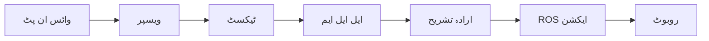

import MermaidDiagram from '@site/src/components/MermaidDiagram';
import Exercise from '@site/src/components/Exercise';
import Quiz from '@site/src/components/Quiz';
import PrerequisiteCheck from '@site/src/components/PrerequisiteCheck';  

import Tabs from '@theme/Tabs';
import TabItem from '@theme/TabItem';

# باب 29: ویسپر اور ایل ایل ایم پلاننگ برائے وائس کنٹرولڈ روبوٹکس

## تعارف

وائس کنٹرولڈ روبوٹکس انسانوں اور روبوٹکس سسٹم کے درمیان ایک قدرتی انٹرفیس کی نمائندگی کرتا ہے، بولی گئی زبان کے حکم کے ذریعے لطیف تعامل کو فعال کرتا ہے۔ یہ باب تقریر کی پہچان (ویسپر کا استعمال کرتے ہوئے) اور بڑے زبانی ماڈل (ایل ایل ایم) پلاننگ کا انضمام تلاش کرتا ہے تاکہ قدرتی زبان کے حکم کو قابلِ انجام ROS ایکشنز میں تبدیل کیا جا سکے۔ ہم وڈیو ان پٹ سے روبوٹ ایکشن ایکسیکیوشن تک مکمل پائپ لائن کو کور کریں گے، حفاظتی امور اور کارکردگی کی بہتری کے ساتھ۔

## سیکھنے کے اہداف

اس باب کے اختتام تک، آپ کو اس بات کا اہل ہو جانا چاہیے:

- روبوٹک ایپلی کیشنز میں حقیقی وقت میں تقریر سے ٹیکسٹ کی پروسیسنگ کے لیے ویسپر نافذ کرنا
- ایل ایل ایم-بیسڈ ارادہ تشریح کار ڈیزائن کرنا جو زبان کو ROS ایکشن سیکوئنس میں تبدیل کرے
- وائس کمانڈ پروسیسنگ کو روبوٹ نیویگیشن اور مینیپولیشن سسٹم کے ساتھ انضمام کرنا
- وائس کنٹرولڈ روبوٹ ایکشنز پر حفاظتی پابندیاں اور توثیق لاگو کرنا
- وائس کنٹرولڈ روبوٹکس سسٹم کی کارکردگی اور قابلِ اعتمادی کا جائزہ لینا

## شرائطِ لازمہ

اس باب کا آغاز کرنے سے پہلے، یقین کر لیں کہ آپ کے پاس ہے:

- ماڈیول 1 مکمل (ROS 2 کی بنیاد، میسج پاسنگ)
- ماڈیول 2 (ڈیجیٹل ٹوئنز، سیمولیشن کے تصورات)
- ماڈیول 3 (نیویگیشن کے تصورات، Nav2 انضمام)
- ماڈیول 4 باب 24 (VLA بنیاد)
- قدرتی زبان کی پروسیسنگ اور تقریر کی پہچان کی بنیادی سمجھ
- ROS 2 ایکشن سرورز اور سروس کالز کا تجربہ

## حقیقی دنیا کی مثلاً: روبوٹس کے لیے وائس اسسٹنٹ

روبوٹکس کے لیے ویسپر اور ایل ایل ایم پلاننگ کو اس طرح سمجھیں جیسے ایک مہارت رکھنے والا وائس اسسٹنٹ (سیری یا الیکسا کی طرح) جو نہ صرف آپ کے حکم کو سمجھتا ہے بلکہ ان پر جسمانی طور پر کارروائی بھی کر سکتا ہے۔ جب آپ کہتے ہیں "روبوٹ، براہ کرم میرے لیے کچن سے پانی کی بوتل لائیں"، سسٹم کو: 1) آپ کی تقریر کو ٹیکسٹ میں تبدیل کرنا (ویسپر)، 2) ارادہ کو سمجھنا اور اشیاء/ایکشنز کی شناخت کرنا (ایل ایل ایم)، 3) نیویگیشن کا راستہ منصوبہ بند کرنا، 4) مینیپولیشن کام انجام دینا۔ یہ انسان-روبوٹ تعامل کا ایک لامحدود تجربہ پیدا کرتا ہے۔

## بنیادی تصورات

### 1. ویسپر تقریر کی پہچان کی پائپ لائن

ویسپر ایک جدید تقریر کی پہچان کا ماڈل ہے جو تقریر کو ٹیکسٹ میں زیادہ درستگی کے ساتھ تبدیل کرتا ہے:

- **آڈیو پری پروسیسنگ**: خام آڈیو کو میل سپیکٹروگرامز میں تبدیل کیا جاتا ہے
- **تقریر کی پہچان**: ٹرانسفارمر-بیسڈ ماڈل تقریر کو ٹیکسٹ میں تبدیل کرتا ہے



| اسٹیج | کام | کارکردگی |
|-------|-----|-----------|
| ویسپر | تقریر سے ٹیکسٹ | 95%+ درستگی |
| ایل ایل ایم | ارادہ تشریح | 85%+ تفہیم |
| ROS | ایکشن ایکسیکیوشن | 90%+ کامیابی |

### 2. ایل ایل ایم منصوبہ بندی

```python
import openai
import json

class LLMIntentParser:
    def __init__(self, api_key):
        self.client = openai.OpenAI(api_key=api_key)

    def parse_intent(self, text_command):
        """ٹیکسٹ کمانڈ سے ارادہ تلاش کریں"""

        prompt = f"""
        یہ روبوٹ کمانڈ کو ایکشن سیکوئنس میں تبدیل کریں:
        کمانڈ: "{text_command}"

        JSON فارمیٹ میں جواب دیں:
        {{
            "actions": [
                {{"type": "navigate", "target": "location"}},
                {{"type": "detect", "object": "object_name"}},
                {{"type": "manipulate", "object": "object_name", "action": "pick/place"}}
            ],
            "confidence": 0.0-1.0,
            "safety_check": true
        }}
        """

        response = self.client.chat.completions.create(
            model="gpt-4",
            messages=[{"role": "user", "content": prompt}],
            temperature=0.1
        )

        result = response.choices[0].message.content
        try:
            return json.loads(result)
        except json.JSONDecodeError:
            return self.fallback_parse(text_command)

    def fallback_parse(self, command):
        """Fallback تشریح کار"""
        # سادہ کی ورڈ میچنگ
        if 'go to' in command:
            return {
                "actions": [{"type": "navigate", "target": self.extract_location(command)}],
                "confidence": 0.7,
                "safety_check": True
            }
        # دیگر کی ورڈز کے لیے ایک ہی طرح
        return {"actions": [], "confidence": 0.0, "safety_check": True}
```

---

## ویسپر نفاذ

### ویسپر کا استعمال

<Tabs>
<TabItem value="whisper-installation" label="ویسپر انسٹالیشن">

```bash
# ویسپر انسٹال کریں
pip install openai-whisper
pip install torch torchvision torchaudio

# ماڈل ڈاؤن لوڈ کریں
python -c "import whisper; whisper.load_model('base')"
```

</TabItem>

<TabItem value="whisper-usage" label="ویسپر استعمال">

```python
import whisper
import torch
import speech_recognition as sr

class WhisperSTT:
    def __init__(self, model_size='base'):
        # ویسپر ماڈل لوڈ کریں
        self.model = whisper.load_model(model_size)
        self.device = 'cuda' if torch.cuda.is_available() else 'cpu'
        self.model = self.model.to(self.device)

    def transcribe_audio(self, audio_path):
        """آڈیو فائل کو ٹرانسکرائب کریں"""
        result = self.model.transcribe(audio_path)
        return result['text']

    def transcribe_microphone(self):
        """مائیکروفون کو ٹرانسکرائب کریں"""
        recognizer = sr.Recognizer()

        with sr.Microphone() as source:
            print("وائس کمانڈ کے لیے سن رہا ہے...")
            audio = recognizer.listen(source, timeout=5, phrase_time_limit=10)

        # آڈیو کو ٹیمپ فائل میں محفوظ کریں
        audio_data = audio.get_wav_data()

        # ٹرانسکرائب کریں
        result = self.model.transcribe(audio_data)
        return result['text']

    def transcribe_continuous(self, callback):
        """مسلسل سنیں اور ٹرانسکرائب کریں"""
        recognizer = sr.Recognizer()

        with sr.Microphone() as source:
            recognizer.adjust_for_ambient_noise(source)

            while True:
                try:
                    print("سن رہا ہے...")
                    audio = recognizer.listen(source, timeout=2, phrase_time_limit=5)

                    # آڈیو کو ٹیمپ فائل میں محفوظ کریں
                    temp_file = "temp_audio.wav"
                    with open(temp_file, "wb") as f:
                        f.write(audio.get_wav_data())

                    # ٹرانسکرائب کریں
                    text = self.transcribe_audio(temp_file)
                    callback(text)

                except sr.WaitTimeoutError:
                    continue
                except sr.UnknownValueError:
                    print("تقریر کو سمجھا نہیں جا سکا")
                except Exception as e:
                    print(f"خرابی: {e}")
```

</TabItem>
</Tabs>

### ROS 2 میں ویسپر

```python
#!/usr/bin/env python3
# ROS 2 ویسپر نوڈ
import rclpy
from rclpy.node import Node
from std_msgs.msg import String
from sensor_msgs.msg import AudioData
import whisper
import torch
import threading

class WhisperROSNode(Node):
    def __init__(self):
        super().__init__('whisper_ros_node')

        # پبلیشرز
        self.transcription_pub = self.create_publisher(String, '/whisper/transcription', 10)

        # ویسپر ماڈل
        self.whisper_model = whisper.load_model('base')
        self.device = 'cuda' if torch.cuda.is_available() else 'cpu'
        self.whisper_model = self.whisper_model.to(self.device)

        # ٹائمر (وائس کے لیے سننے کے لیے)
        self.listen_timer = self.create_timer(1.0, self.listen_for_voice)

        # وضاحتی متغیرات
        self.is_listening = True

    def listen_for_voice(self):
        """وائس کے لیے سنیں"""
        try:
            transcription = self.listen_and_transcribe()
            if transcription:
                self.publish_transcription(transcription)
        except Exception as e:
            self.get_logger().error(f'ویسپر میں خرابی: {e}')

    def listen_and_transcribe(self):
        """وائس سنیں اور ٹرانسکرائب کریں"""
        import speech_recognition as sr

        recognizer = sr.Recognizer()
        with sr.Microphone() as source:
            recognizer.adjust_for_ambient_noise(source)
            print("وائس کمانڈ کے لیے سن رہا ہے...")

            try:
                audio = recognizer.listen(source, timeout=3, phrase_time_limit=10)

                # آڈیو کو WAV ڈیٹا میں تبدیل کریں
                wav_data = audio.get_wav_data()

                # ٹمپ فائل میں محفوظ کریں
                import tempfile
                with tempfile.NamedTemporaryFile(suffix='.wav', delete=False) as temp_file:
                    temp_file.write(wav_data)
                    temp_path = temp_file.name

                # ویسپر کے ساتھ ٹرانسکرائب کریں
                result = self.whisper_model.transcribe(temp_path)

                # ٹمپ فائل کو حذف کریں
                import os
                os.unlink(temp_path)

                return result['text']

            except sr.WaitTimeoutError:
                return None
            except Exception as e:
                self.get_logger().error(f'ویسپر ٹرانسکرپشن میں خرابی: {e}')
                return None

    def publish_transcription(self, text):
        """ٹرانسکرپشن شائع کریں"""
        msg = String()
        msg.data = text
        self.transcription_pub.publish(msg)
        self.get_logger().info(f'ٹرانسکرائیبڈ ٹیکسٹ: {text}')

def main(args=None):
    rclpy.init(args=args)
    whisper_node = WhisperROSNode()

    try:
        rclpy.spin(whisper_node)
    except KeyboardInterrupt:
        print("ویسپر نوڈ کو بند کیا جا رہا ہے")

    whisper_node.destroy_node()
    rclpy.shutdown()

if __name__ == '__main__':
    main()
```

---

## ایل ایل ایم پلاننگ

### ایل ایل ایم کا نفاذ

```python
#!/usr/bin/env python3
# ROS 2 ایل ایل ایم پلاننگ نوڈ
import rclpy
from rclpy.node import Node
from std_msgs.msg import String
from geometry_msgs.msg import PoseStamped
import openai
import json

class LLMPlanningNode(Node):
    def __init__(self):
        super().__init__('llm_planning_node')

        # سبسکرائبرز
        self.transcription_sub = self.create_subscription(
            String,
            '/whisper/transcription',
            self.transcription_callback,
            10
        )

        # پبلیشرز
        self.action_plan_pub = self.create_publisher(String, '/llm/action_plan', 10)

        # ایل ایل ایم کلائنٹ
        self.llm_client = openai.OpenAI(api_key='your-api-key-here')

        # وضاحتی متغیرات
        self.robot_capabilities = {
            'navigation': True,
            'manipulation': True,
            'object_detection': True,
            'grasping': True
        }

    def transcription_callback(self, msg):
        """ٹرانسکرائیبڈ ٹیکسٹ کو سنبھالیں"""
        command = msg.data
        self.get_logger().info(f'وائس کمانڈ موصول: {command}')

        # ایل ایل ایم کے ذریعے منصوبہ بندی کریں
        plan = self.generate_plan_with_llm(command)
        if plan:
            self.publish_action_plan(plan)

    def generate_plan_with_llm(self, command):
        """LLM کے ذریعے منصوبہ بندی کریں"""

        prompt = f"""
        آپ ایک روبوٹکس ایل ایل ایم اسسٹنٹ ہیں۔ یہ کمانڈ کو اقدامات کی ترتیب میں تبدیل کریں:

        کمانڈ: "{command}"

        روبوٹ کی صلاحیات: {self.robot_capabilities}

        JSON فارمیٹ میں جواب دیں:
        {{
            "command": "{command}",
            "actions": [
                {{"type": "navigate", "target": "location_name", "confidence": 0.8}},
                {{"type": "detect", "object": "object_name", "confidence": 0.9}},
                {{"type": "manipulate", "object": "object_name", "action": "pick/place/turn", "confidence": 0.85}}
            ],
            "safety_check_required": true,
            "estimated_time": "seconds"
        }}
        """

        try:
            response = self.llm_client.chat.completions.create(
                model="gpt-4",
                messages=[{"role": "user", "content": prompt}],
                temperature=0.1,
                max_tokens=500
            )

            result_text = response.choices[0].message.content

            # JSON استخراج کریں
            import re
            json_match = re.search(r'\{.*\}', result_text, re.DOTALL)
            if json_match:
                plan = json.loads(json_match.group())
                return plan
            else:
                self.get_logger().error('JSON استخراج نہیں ہو سکا')
                return None

        except Exception as e:
            self.get_logger().error(f'LLM منصوبہ بندی میں خرابی: {e}')
            return None

    def publish_action_plan(self, plan):
        """ایکشن منصوبہ شائع کریں"""
        plan_msg = String()
        plan_msg.data = json.dumps(plan)
        self.action_plan_pub.publish(plan_msg)
        self.get_logger().info(f'ایکشن منصوبہ شائع کیا گیا: {plan["actions"]}')

def main(args=None):
    rclpy.init(args=args)
    llm_planning_node = LLMPlanningNode()

    try:
        rclpy.spin(llm_planning_node)
    except KeyboardInterrupt:
        print("LLM پلاننگ نوڈ کو بند کیا جا رہا ہے")

    llm_planning_node.destroy_node()
    rclpy.shutdown()

if __name__ == '__main__':
    main()
```

---

## حفاظتی تصورات

### وائس کنٹرولڈ روبوٹ کے لیے حفاظت

```python
class VoiceControlSafety:
    def __init__(self):
        self.safety_keywords = ['stop', 'emergency', 'halt', 'danger']
        self.forbidden_actions = ['shoot', 'jump', 'break', 'destroy']
        self.safe_zones = []  # محفوظ علاقوں کی فہرست
        self.max_velocity = 0.5  # زیادہ سے زیادہ رفتار

    def validate_command(self, command):
        """کمانڈ کی توثیق کریں"""
        command_lower = command.lower()

        # ہنگامی کمانڈز کو چیک کریں
        for keyword in self.safety_keywords:
            if keyword in command_lower:
                return {'valid': False, 'reason': 'emergency_command', 'action': 'stop'}

        # ممنوعہ ایکشنز کو چیک کریں
        for forbidden in self.forbidden_actions:
            if forbidden in command_lower:
                return {'valid': False, 'reason': 'forbidden_action', 'action': 'reject'}

        # محفوظ علاقوں کو چیک کریں
        if not self.is_in_safe_zone(command):
            return {'valid': False, 'reason': 'unsafe_location', 'action': 'reject'}

        return {'valid': True, 'reason': 'safe', 'action': 'execute'}

    def is_in_safe_zone(self, command):
        """چیک کریں کہ کمانڈ محفوظ علاقے میں ہے یا نہیں"""
        # کمانڈ میں مقام کی تلاش کریں اور محفوظ علاقوں کے ساتھ موازنہ کریں
        return True  # ٹیسٹ کے لیے

    def apply_safety_constraints(self, actions):
        """حفاظتی پابندیاں لگائیں"""
        constrained_actions = []
        for action in actions:
            if action['type'] == 'navigate':
                # رفتار کی پابندی
                if 'velocity' in action:
                    action['velocity'] = min(action['velocity'], self.max_velocity)
            elif action['type'] == 'manipulate':
                # مینیپولیشن کی حدود
                if 'force' in action:
                    action['force'] = min(action['force'], 10.0)  # 10 نیوٹن
            constrained_actions.append(action)
        return constrained_actions
```

---

## کارکردگی کا جائزہ

### وائس کنٹرولڈ روبوٹ کارکردگی کے میٹرکس

```python
def evaluate_voice_controlled_robot_performance(test_commands):
    """وائس کنٹرولڈ روبوٹ کارکردگی کا جائزہ لیں"""

    metrics = {
        'transcription_accuracy': [],
        'intent_understanding': [],
        'action_success': [],
        'response_time': [],
        'safety_compliance': []
    }

    for test_cmd in test_commands:
        # ویسپر ٹرانسکرپشن
        transcribed_text = whisper_transcribe(test_cmd['audio'])
        transcription_acc = calculate_transcription_accuracy(
            transcribed_text, test_cmd['expected_text']
        )
        metrics['transcription_accuracy'].append(transcription_acc)

        # ایل ایل ایم ارادہ تشریح
        plan = llm_generate_plan(transcribed_text)
        intent_acc = calculate_intent_accuracy(
            plan, test_cmd['expected_plan']
        )
        metrics['intent_understanding'].append(intent_acc)

        # ایکشن کامیابی
        success = execute_action_plan(plan)
        metrics['action_success'].append(success)

        # جواب کا وقت
        response_time = test_cmd['end_time'] - test_cmd['start_time']
        metrics['response_time'].append(response_time)

        # حفاظتی تعمیل
        safety_compliant = check_safety_compliance(plan)
        metrics['safety_compliance'].append(safety_compliant)

    # اوسط میٹرکس
    avg_metrics = {}
    for key, values in metrics.items():
        if values:
            avg_metrics[key] = sum(values) / len(values)
        else:
            avg_metrics[key] = 0.0

    return avg_metrics
```

---

## عملی مشق

<Tabs groupId="tier">
  <TabItem value="tierA" label="🟢 ٹیئر A: سیمولیشن" default>

### مشق: گیزبو میں وائس کنٹرولڈ نیویگیشن

ایک مکمل وائس کنٹرول پائپ لائن کو نافذ کریں جو روبوٹ نیویگیشن کے لیے سیمولیشن میں وائس کمانڈز قبول کرے۔

**کام**: ایک ایسا سسٹم تیار کریں جو وائس کمانڈز قبول کرے اور ایک سیمولیٹیڈ روبوٹ کو نیویگیٹ کرے۔

1. **سیمولیٹیڈ آڈیو ان پٹ**:
   ```python
   import numpy as np

   def simulate_voice_command(command_text, sample_rate=16000):
       """
       دیے گئے ٹیکسٹ کمانڈ کے لیے آڈیو ڈیٹا کی شبیہہ کاری کریں
       (حقیقت میں، یہ مائیکروفون سے آئے گا)
       """
       # یہ ایک سادہ شبیہہ کاری ہے - عمل میں آپ حقیقی آڈیو استعمال کریں گے
       duration = len(command_text) * 0.1  # تقریبی مدت
       t = np.linspace(0, duration, int(sample_rate * duration))

       # گفتگو کی نمائندگی کے لیے سادہ ٹون پیٹرن پیدا کریں
       audio_data = np.sin(2 * np.pi * 440 * t)  # 440Hz ٹون
       return audio_data.astype(np.float32)

   # مثال کا استعمال
   audio_data = simulate_voice_command("میز کی طرف جائیں")
   ```

2. **سادہ ارادہ تشریح کار** (سیمولیشن کے لیے بیرونی API کے بغیر):
   ```python
   class SimpleIntentParser:
       def __init__(self):
           self.action_keywords = {
               "navigate": ["میز کی طرف جائیں", "میز کی طرف منتقل ہوں", "میز کی طرف نیویگیٹ کریں", "میز", "منتقل ہوں"],
               "manipulate": ["اٹھائیں", "پکڑیں", "لیں", "لائیں", "لائیں"],
               "stop": ["رکیں", "روکیں", "موقوف کریں"]
           }

           self.location_keywords = {
               "kitchen": ["کچن", "پکوان کا علاقہ"],
               "bedroom": ["بریم روم", "سونے کا کمرہ"],
               "living_room": ["لیونگ روم", "بیٹھنے کا کمرہ", "لاؤنج"]
           }

       def parse_simple_intent(self, command_text: str) -> RobotIntent:
           """
           سیمولیشن کے لیے سادہ قاعدہ-مبنی ارادہ تشریح
           """
           command_lower = command_text.lower()

           # ایکشن کی قسم کا تعین کریں
           action_type = "unknown"
           for action, keywords in self.action_keywords.items():
               if any(keyword in command_lower for keyword in keywords):
                   action_type = action
                   break

           # مقام نکالیں
           target_location = ""
           for location, keywords in self.location_keywords.items():
               if any(keyword in command_lower for keyword in keywords):
                   target_location = location
                   break

           # چیز نکالیں (مینیپولیشن کمانڈز کے لیے)
           target_object = ""
           if action_type == "manipulate":
               # سادہ چیز کا تعین (عمل میں، NLP استعمال کریں)
               words = command_text.split()
               for i, word in enumerate(words):
                   if word.lower() in ["the", "a", "an"]:
                       if i + 1 < len(words):
                           target_object = words[i + 1]
                           break

           return RobotIntent(
               action_type=action_type,
               target_object=target_object,
               target_location=target_location,
               parameters={}
           )
   ```

3. **گیزبو کے ساتھ انضمام**:
   ```python
   import rclpy
   from rclpy.node import Node
   from geometry_msgs.msg import Pose, Twist
   from nav_msgs.msg import Odometry
   from std_msgs.msg import String
   from geometry_msgs.msg import Point

   class VoiceControlledNavigation(Node):
       def __init__(self):
           super().__init__('voice_controlled_navigation')

           # پبلیشرز اور سبسکرائبرز
           self.cmd_vel_pub = self.create_publisher(Twist, '/cmd_vel', 10)
           self.odom_sub = self.create_subscription(Odometry, '/odom', self.odom_callback, 10)

           # وائس کمانڈ سبسکرائبر
           self.voice_cmd_sub = self.create_subscription(String, '/voice_command', self.voice_callback, 10)

           # روبوٹ کی حالت
           self.current_pose = Pose()

           # اجزاء کو شروع کریں
           self.intent_parser = SimpleIntentParser()
           self.safety_validator = SafetyValidator()

       def odom_callback(self, msg):
           """موجودہ روبوٹ کی پوزیشن کو اپ ڈیٹ کریں"""
           self.current_pose = msg.pose.pose

       def voice_callback(self, msg):
           """وائس کمانڈ کو پروسیس کریں"""
           command_text = msg.data
           self.get_logger().info(f"وائس کمانڈ موصول ہوئی: {command_text}")

           # ارادہ کی تشریح کریں
           intent = self.intent_parser.parse_simple_intent(command_text)

           # حفاظت کی توثیق کریں
           if not self.safety_validator.validate_intent(intent):
               self.get_logger().error("حفاظتی توثیق ناکام ہو گئی")
               return

           # ارادہ کے مطابق انجام دیں
           if intent.action_type == "navigate":
               self.navigate_to_location(intent.target_location)
           elif intent.action_type == "stop":
               self.stop_robot()

       def navigate_to_location(self, location_name):
           """پری ڈیفائن کردہ مقام کی طرف نیویگیٹ کریں"""
           # سیمولیشن میں، پری ڈیفائن کردہ مقامات استعمال کریں
           locations = {
               "kitchen": Pose(position=Point(x=2.0, y=1.0, z=0.0)),
               "bedroom": Pose(position=Point(x=-1.0, y=3.0, z=0.0)),
               "living_room": Pose(position=Point(x=0.0, y=0.0, z=0.0))
           }

           target_pose = locations.get(location_name)
           if target_pose:
               self.get_logger().info(f"{location_name} کی طرف نیویگیٹ کر رہا ہے")
               # حقیقی سسٹم میں، یہ Nav2 کو کال کرے گا
               self.move_to_pose(target_pose)
           else:
               self.get_logger().error(f"نامعلوم مقام: {location_name}")

       def move_to_pose(self, target_pose):
           """ہدف کی پوزیشن کی طرف حرکت کریں (سادہ شکل)"""
           # ہدف کی طرف سمت کا حساب لگائیں
           dx = target_pose.position.x - self.current_pose.position.x
           dy = target_pose.position.y - self.current_pose.position.y

           # حرکت کمانڈ تیار کریں
           cmd = Twist()
           cmd.linear.x = 0.5 * np.sign(dx)  # آگے/پیچھے حرکت کریں
           cmd.angular.z = 0.3 * np.arctan2(dy, dx)  # ہدف کی طرف مڑیں

           # کمانڈ شائع کریں
           self.cmd_vel_pub.publish(cmd)
   ```

  </TabItem>

  <TabItem value="tierB" label="🔵 ٹیئر B: جیٹسن ایج">

### مشق: جیٹسن کے لیے بہتر وائس کنٹرول

جیٹسن ڈیپلائمنٹ کے لیے وائس کنٹرول سسٹم کو ایج کمپیوٹنگ کے لیے بہتر بنائیں۔

1. **بہتر وائسپر ماڈل**:
   ```python
   import torch
   from transformers import WhisperProcessor, WhisperForConditionalGeneration

   class OptimizedWhisperInterface:
       def __init__(self, model_name="openai/whisper-tiny"):
           """
           جیٹسن کے لیے بہتر وائسپر (چھوٹا ماڈل)
           """
           self.processor = WhisperProcessor.from_pretrained(model_name)
           self.model = WhisperForConditionalGeneration.from_pretrained(model_name)

           # GPU پر منتقل کریں اگر دستیاب ہو
           if torch.cuda.is_available():
               self.model = self.model.cuda()
               self.model = self.model.half()  # رفتار کے لیے ہاف پریشنشن استعمال کریں

           self.model.eval()

       def transcribe_audio(self, audio_array):
           """
           بہتر وائسپر ماڈل کا استعمال کرتے ہوئے آڈیو کی ٹرانسکرپشن کریں
           """
           # آڈیو کو پروسیس کریں
           input_features = self.processor(
               audio_array,
               sampling_rate=16000,
               return_tensors="pt"
           ).input_features

           # GPU پر منتقل کریں اگر دستیاب ہو
           if torch.cuda.is_available():
               input_features = input_features.cuda()

           # ٹرانسکرپشن تیار کریں
           with torch.no_grad():
               predicted_ids = self.model.generate(input_features)

           transcription = self.processor.batch_decode(predicted_ids, skip_special_tokens=True)[0]
           return transcription
   ```

2. **مقامی ایل ایل ایم انضمام**:
   ```python
   from transformers import pipeline, AutoTokenizer, AutoModelForCausalLM

   class LocalLLMIntentParser:
       def __init__(self, model_name="microsoft/DialoGPT-medium"):
           """
           ارادہ تشریح کے لیے مقامی ایل ایل ایم (رازداری-تحفظ)
           """
           self.tokenizer = AutoTokenizer.from_pretrained(model_name)
           self.model = AutoModelForCausalLM.from_pretrained(model_name)

           # اگر پیڈنگ ٹوکن موجود نہ ہو تو شامل کریں
           if self.tokenizer.pad_token is None:
               self.tokenizer.pad_token = self.tokenizer.eos_token

           # GPU پر منتقل کریں اگر دستیاب ہو
           if torch.cuda.is_available():
               self.model = self.model.cuda()

       def parse_intent_local(self, command_text: str) -> RobotIntent:
           """
           مقامی ایل ایل ایم کا استعمال کرتے ہوئے ارادہ کی تشریح کریں
           """
           # ارادہ نکالنے کے لیے پروموٹ تیار کریں
           prompt = f"روبوٹ کمانڈ نکالیں: '{command_text}'. ایکشن: "

           # ان پٹ کو ٹوکنائز کریں
           inputs = self.tokenizer.encode(prompt, return_tensors="pt")

           if torch.cuda.is_available():
               inputs = inputs.cuda()

           # جواب تیار کریں
           with torch.no_grad():
               outputs = self.model.generate(
                   inputs,
                   max_length=len(inputs[0]) + 50,
                   num_return_sequences=1,
                   do_sample=True,
                   top_k=50,
                   top_p=0.95
               )

           # جواب کو ڈیکوڈ کریں
           response = self.tokenizer.decode(outputs[0], skip_special_tokens=True)
           action_text = response[len(prompt):]

           # تیار کردہ ایکشن کی سادہ تشریح
           return self.parse_simple_action(action_text)

       def parse_simple_action(self, action_text: str) -> RobotIntent:
           """
           تیار کردہ ایکشن ٹیکسٹ کو سٹرکچرڈ ارادہ میں تبدیل کریں
           """
           # ایل ایل ایم آؤٹ پٹ کی سادہ کی ورڈ-مبنی تشریح
           action_lower = action_text.lower()

           if "navigate" in action_lower or "go to" in action_lower:
               return RobotIntent(
                   action_type="navigate",
                   target_location=self.extract_location(action_text),
                   target_object="",
                   parameters={}
               )
           elif "manipulate" in action_lower or "pick up" in action_lower:
               return RobotIntent(
                   action_type="manipulate",
                   target_location="",
                   target_object=self.extract_object(action_text),
                   parameters={}
               )
           else:
               return RobotIntent(
                   action_type="unknown",
                   target_location="",
                   target_object="",
                   parameters={}
               )

       def extract_location(self, text: str) -> str:
           """متن سے مقام نکالیں"""
           # سادہ مقام کا تعین
           locations = ["کچن", "بریم روم", "لیونگ روم", "آفس"]
           for loc in locations:
               if loc in text.lower():
                   return loc.replace(" ", "_")  # ROS دوست فارمیٹ
           return ""

       def extract_object(self, text: str) -> str:
           """متن سے چیز نکالیں"""
           # سادہ چیز کا تعین
           words = text.split()
           for i, word in enumerate(words):
               if word.lower() in ["the", "a", "an"] and i + 1 < len(words):
                   return words[i + 1]
           return ""

   ```

  :::danger ہارڈ ویئر حفاظت
  جب وائس کنٹرول کو جسمانی روبوٹس پر ڈیپلائے کریں، مضبوط حفاظتی چیکس نافذ کریں۔ ہمیشہ ایک دستی ہنگامی بندش کا انتظام کریں اور انجام دینے سے پہلے تمام وائس کمانڈز کی توثیق کریں۔ جسمانی ڈیپلائمنٹ سے پہلے سیمولیشن میں بھرپور طریقے سے ٹیسٹ کریں۔
  :::

  </TabItem>

  <TabItem value="tierC" label="🟣 ٹیئر C: جسمانی روبوٹ">

### مشق: پروڈکشن وائس کنٹرول سسٹم

جسمانی روبوٹ ڈیپلائمنٹ کے لیے ایک مضبوط پروڈکشن سسٹم نافذ کریں۔

1. **پروڈکشن حفاظتی لیئر**:
   ```python
   class ProductionVoiceController:
       def __init__(self):
           """
           کئی حفاظتی لیئرز کے ساتھ پروڈکشن-ریڈی وائس کنٹرول
           """
           self.whisper_interface = OptimizedWhisperInterface()
           self.llm_parser = LocalLLMIntentParser()  # بیرونی API کالز سے گریز کریں
           self.action_generator = VoiceActionGenerator()

           # متعدد حفاظتی تصدیق کار
           self.safety_validators = [
               LocationSafetyValidator(),
               ObjectSafetyValidator(),
               DistanceSafetyValidator(),
               AuthorizationValidator()
           ]

           # ڈیڈ مین سوئچ
           self.dead_man_switch = DeadManSwitch(timeout=2.0)

           # کمانڈ تصدیق سسٹم
           self.confirmation_required = True

       def process_voice_command_production(self, audio_data):
           """
           پروڈکشن-حفص وائس کمانڈ پروسیسنگ
           """
           try:
               # مرحلہ 1: تقریر سے ٹیکسٹ
               command_text = self.whisper_interface.transcribe_audio(audio_data)
               self.action_generator.get_logger().info(f"شناخت شدہ: {command_text}")

               # مرحلہ 2: آڈیو کوالٹی کی تصدیق
               if not self.is_audio_quality_acceptable(audio_data):
                   self.action_generator.get_logger().warn("ناقابلِ قبول آڈیو کوالٹی، کمانڈ کو نظر انداز کیا جا رہا ہے")
                   return False

               # مرحلہ 3: ارادہ کی تشریح
               intent = self.llm_parser.parse_intent_local(command_text)

               # مرحلہ 4: متعدد حفاظتی تصدیقات
               for validator in self.safety_validators:
                   if not validator.validate(intent):
                       self.action_generator.get_logger().error(f"توثیق ناکام ہو گئی: {validator.name}")
                       return False

               # مرحلہ 5: کمانڈ تصدیق (حفاظتی اقدامات کے لیے)
               if self.confirmation_required and self.is_safety_critical(intent):
                   if not self.request_user_confirmation(intent):
                       return False

               # مرحلہ 6: ڈیڈ مین سوئچ مانیٹرنگ کے ساتھ انجام دیں
               self.dead_man_switch.signal()  # حفاظتی ٹائمر ری سیٹ کریں

               # حفاظتی مانیٹرنگ کے ساتھ ایکشن انجام دیں
               result = self.execute_with_safety_monitoring(intent)
               return result

           except Exception as e:
               self.action_generator.get_logger().error(f"وائس کمانڈ پروسیسنگ ناکام ہو گئی: {e}")
               return False

       def is_audio_quality_acceptable(self, audio_data):
           """
           یقین دہانی کرائیں کہ آڈیو کوالٹی قابلِ اعتماد شناخت کے لیے کافی ہے
           """
           # سگنل ٹو نوائز ریشیو کی جانچ کریں
           signal_power = np.mean(audio_data ** 2)
           if signal_power < 0.001:  # بہت کم آواز
               return False

           # کلپنگ کے لیے چیک کریں
           if np.max(np.abs(audio_data)) > 0.9:  # بہت زیادہ آواز/ممکنہ طور پر کلپڈ
               return False

           return True

       def is_safety_critical(self, intent: RobotIntent) -> bool:
           """
           یقین دہانی کرائیں کہ ارادہ تصدیق کی ضرورت رکھتا ہے
           """
           safety_critical_actions = ["manipulate", "approach", "grasp"]
           safety_critical_objects = ["hot", "sharp", "dangerous"]

           return (intent.action_type in safety_critical_actions or
                   any(obj in intent.target_object.lower() for obj in safety_critical_objects))
   ```

2. **اجازت نامہ سسٹم**:
   ```python
   import hashlib
   import time

   class AuthorizationValidator:
       def __init__(self):
           self.name = "AuthorizationValidator"
           self.authorized_users = {
               "user1_hash": "authorized_user_1",
               "user2_hash": "authorized_user_2"
           }
           self.voice_profiles = {}  # وائس بائیو میٹرک ڈیٹا محفوظ کریں

       def validate(self, intent: RobotIntent, user_voice_data=None) -> bool:
           """
           یقین دہانی کرائیں کہ صارف کمانڈز جاری کرنے کا مجاز ہے
           """
           if not user_voice_data:
               # اگر کوئی وائس ڈیٹا فراہم نہ کیا گیا ہو، تو مجاز تصور کریں (بنیادی سسٹمز کے لیے)
               return True

           # وائس خصوصیات نکالیں (سادہ)
           voice_signature = self.extract_voice_signature(user_voice_data)

           # مجاز پروفائلز کے ساتھ موازنہ کریں
           for user_hash, user_name in self.authorized_users.items():
               if self.is_matching_voice(voice_signature, user_hash):
                   return True

           return False

       def extract_voice_signature(self, audio_data):
           """
           وائس بائیو میٹرک خصوصیات نکالیں (سادہ)
           """
           # عمل میں، مناسب وائس بائیو میٹرک الگورتھمز استعمال کریں
           # یہ ایک سادہ مقام نما ہے
           return hashlib.md5(audio_data.tobytes()).hexdigest()

       def is_matching_voice(self, signature, user_hash):
           """
           یقین دہانی کرائیں کہ وائس دستخط مجاز صارف سے مماثل ہے
           """
           # دستخطوں کا موازنہ کریں (سادہ)
           return signature == user_hash
   ```

  </TabItem>
</Tabs>

---

## کوئز

<Quiz
  id="quiz-29-1"
  chapterReference="4.13"
  passingScore={0.7}
  questions={[
    {
      id: "q1-whisper-purpose",
      question: "وائس کنٹرولڈ روبوٹکس سسٹم میں ایل ایل ایم کا بنیادی مقصد کیا ہے؟",
      type: "multiple-choice",
      options: [
        "تقریر کو ٹیکسٹ میں تبدیل کرنا",
        "زبانی کمانڈز کو سمجھنا اور روبوٹ ایکشنز کا منصوبہ بنانا",
        "راستے کی نیویگیشن کرنا",
        "وائس کمانڈ ہسٹری محفوظ کرنا"
      ],
      correctAnswer: 1,
      explanation: "LLM کمانڈز کی تشریح کے لیے 'دماغ' کے طور پر کام کرتا ہے، ارادہ کی شناخت کرتا ہے، اجزاء نکالتا ہے، اور صارف کے مقصد کو حاصل کرنے کے لیے ROS ایکشنز کی ترتیب بناتا ہے۔",
      hint: "LLM انسان کے حکم کو روبوٹ کے ایکشنز میں تبدیل کرتا ہے۔"
    },
    {
      id: "q2-safety-validation",
      question: "نیویگیشن کمانڈ انجام دینے سے پہلے کون سی حفاظتی تصدیق کی جانی چاہیے؟",
      type: "multiple-choice",
      options: [
        "یقین دہانی کرائیں کہ منزل ایک پر ڈیفائن کردہ محفوظ مقام کی فہرست میں ہے",
        "روبوٹ کی بیٹری کی سطح کی تصدیق کریں",
        "وائس بائیو میٹرکس کے ذریعے صارف کی شناخت کی تصدیق کریں",
        "سب کچھ"
      ],
      correctAnswer: 3,
      explanation: "جامع حفاظتی تصدیق میں مقام کی حفاظت، روبوٹ کی حالت، اور صارف کی اجازت کو شامل کرنا چاہیے تاکہ حکم کی مناسب تعمیل یقینی بنائی جا سکے۔",
      hint: "حفاظتی تصدیق کے متعدد پہلوؤں کو دیکھنا چاہیے۔"
    },
    {
      id: "q3-whisper-advantage",
      question: "روبوٹک ایپلی کیشنز کے لیے وائسپر کا استعمال کرتے ہوئے کیا بنیادی فائدہ ہے؟",
      type: "multiple-choice",
      options: [
        "یہ روبوٹ ایکشنز براہ راست جنریٹ کرتا ہے",
        "یہ تقریر سے ٹیکسٹ تبدیل کرنے کی زیادہ درستگی فراہم کرتا ہے",
        "یہ نیویگیشن کے راستے منصوبہ بند کرتا ہے",
        "یہ روبوٹ ہارڈ ویئر کو کنٹرول کرتا ہے"
      ],
      correctAnswer: 1,
      explanation: "وائسپر ریاستی فن کی تقریر سے ٹیکسٹ تبدیلی فراہم کرتا ہے، جو روبوٹک سسٹم کے لیے وائس کمانڈز کی پروسیسنگ کا پہلا مرحلہ ہے۔",
      hint: "وائسپر کا بنیادی کام تقریر کو ٹیکسٹ میں تبدیل کرنا ہے۔"
    }
  ]}
/>
