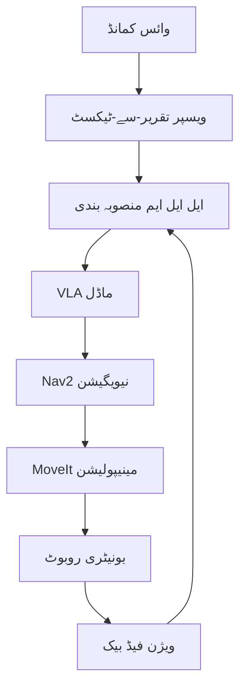

import MermaidDiagram from '@site/src/components/MermaidDiagram';
import CodeExample from '@site/src/components/CodeExample';
import Exercise from '@site/src/components/Exercise';
import Quiz from '@site/src/components/Quiz';
import TierBadge from '@site/src/components/TierBadge';

# ٹیئر سی ایکسٹینشن: مکمل کیپسٹون جسمانی ڈیپلائمنٹ

<TierBadge tiers={["C"]} />

## یہ کیوں اہم ہے

مکمل کیپسٹون پروجیکٹ آپ کی سفر کا اختتام ROS 2 کی بنیاد سے لے کر مکمل خودکار ہیومنوائڈ روبوٹ سسٹم تک کا نمائندہ ہے۔ فزیکل یونیٹری روبوٹ پر مکمل وائس کنٹرولڈ نیویگیشن پائپ لائن کو ڈیپلائی کرنا ٹیکنالوجی اسٹیک کا مکمل مہارت کا مظاہرہ کرتا ہے: نچلی سطح کے ROS 2 کمیونیکیشن پیٹرنز سے لے کر بلند سطح کے اے آئی ت_REASONING اور محفوظ جسمانی ایکسیکیوشن تک۔ یہ پروجیکٹ حقیقی دنیا کی ایپلی کیشن میں تمام چار ماڈیول (ROS 2، سیمولیشن، نیویگیشن، VLA) کے انضمام کا مظاہرہ کرتا ہے۔

**ریل ورلڈ ایپلی کیشنز**:

- **گھریلو اسسٹنٹ روبوٹس**: وائس کنٹرولڈ گھریلو کام اور نیویگیشن
- **صنعتی لا جسٹکس**: وائس کمانڈ انٹرفیس کے ساتھ خودکار سامان کی نقل و حمل
- **ہیلتھ کیئر سپورٹ**: وائس کی درخواستوں کا جواب دینے والے مریض کی مدد کے روبوٹس
- **آفت کا جواب**: خطرناک ماحول میں وائس کنٹرولڈ تلاش اور رپورٹنگ

:::danger ہارڈ ویئر کی حفاظت
جسمانی ہارڈ ویئر پر مکمل کیپسٹون ڈیپلائی کرنے سے پہلے:
- **تمام حفاظتی سسٹم فعال اور ٹیسٹ کیے ہوئے ہونے چاہئیں**: ڈیڈ مین سوئچ (100ms ٹائم آؤٹ)، ہنگامی بندی، توازن کی نگرانی
- **جسمانی ورک سپیس تیار ہونا چاہیے**: صاف آپریشنل باؤنڈریز، رکاوٹ سے پاک علاقے، ہنگامی بندی تک رسائی
- **اہلکار تربیت یافتہ ہونے چاہئیں**: ہنگامی طریقہ کار، دستی اوور رائیڈ، حادثہ کا جواب
- **بیک اپ منصوبے تیار ہونے چاہئیں**: گھر واپسی، محفوظ بندش، دستی مداخلت کے طریقہ کار
:::

---

## کیپسٹون سسٹم کی ساخت

### مکمل سسٹم آرکیٹیکچر



### حفاظتی سسٹم کی ساخت

| سسٹم | کام | حفاظتی تخصیص |
|------|-----|-------------|
| ڈیڈ مین سوئچ | ہنگامی بندی | 100ms ٹائم آؤٹ |
| توازن مانیٹر | فل سیفٹی | گرنے سے بچاؤ |
| رکاوٹ ڈیٹیکشن | نیویگیشن حفاظت | 0.5 میٹر تک |
| ایمرجنسی بٹن | دستی بندی | ہر جگہ رسائی |

---

## فزیکل ڈیپلائمنٹ

### یونیٹری روبوٹ کی تیاری

```python
#!/usr/bin/env python3
# یونیٹری روبوٹ کیپسٹون نوڈ
import rclpy
from rclpy.node import Node
from std_msgs.msg import String
from sensor_msgs.msg import Image, Imu
from geometry_msgs.msg import Twist, PoseStamped
from unitree_sdk2py import *
import time

class UnitreeCapstoneNode(Node):
    def __init__(self):
        super().__init__('unitree_capstone_node')

        # سبسکرائبرز
        self.voice_command_sub = self.create_subscription(
            String,
            '/voice/command',
            self.voice_command_callback,
            10
        )

        self.imu_sub = self.create_subscription(
            Imu,
            '/imu/data',
            self.imu_callback,
            10
        )

        self.camera_sub = self.create_subscription(
            Image,
            '/camera/image_raw',
            self.camera_callback,
            10
        )

        # پبلیشرز
        self.cmd_vel_pub = self.create_publisher(Twist, '/cmd_vel', 10)
        self.status_pub = self.create_publisher(String, '/capstone/status', 10)

        # یونیٹری روبوٹ کنٹرول
        self.unitree_robot = self.initialize_unitree_robot()

        # حفاظتی متغیرات
        self.dead_man_switch = False
        self.balance_monitor = True
        self.emergency_stop = False
        self.last_command_time = time.time()
        self.timeout = 0.1  # 100ms

        # ٹائمر (حفاظتی چیک)
        self.safety_timer = self.create_timer(0.05, self.safety_check)

    def initialize_unitree_robot(self):
        """یونیٹری روبوٹ کو شروع کریں"""
        # یونیٹری SDK کو شروع کریں
        # روبوٹ کنیکشن کو قائم کریں
        return UnitreeRobot()  # یونیٹری SDK کلاس

    def voice_command_callback(self, msg):
        """وائس کمانڈ کو سنبھالیں"""
        command = msg.data
        self.get_logger().info(f'وائس کمانڈ موصول: {command}')

        # حفاظتی چیک
        if self.emergency_stop:
            self.get_logger().warn('ہنگامی بندی فعال')
            return

        # کمانڈ کو پروسیس کریں
        self.process_voice_command(command)

        # آخری کمانڈ کا وقت اپ ڈیٹ کریں
        self.last_command_time = time.time()
        self.dead_man_switch = True

    def process_voice_command(self, command):
        """وائس کمانڈ کو پروسیس کریں"""
        # ویسپر ٹرانسکرپشن کو LLM منصوبہ بندی میں تبدیل کریں
        # منصوبہ بندی کو ROS ایکشنز میں تبدیل کریں
        # Nav2 اور MoveIt کو کمانڈ دیں

        # ٹیسٹ کمانڈز
        if 'go to' in command:
            location = self.extract_location(command)
            self.navigate_to_location(location)
        elif 'stop' in command:
            self.emergency_stop_robot()
        elif 'dance' in command:
            self.perform_dance_routine()

    def safety_check(self):
        """حفاظتی چیک کریں"""
        current_time = time.time()

        # ڈیڈ مین سوئچ چیک
        if current_time - self.last_command_time > self.timeout:
            if self.dead_man_switch:
                self.emergency_stop_robot()
                self.get_logger().error('ڈیڈ مین سوئچ: ہنگامی بندی')

        # توازن چیک
        if not self.balance_monitor:
            self.emergency_stop_robot()
            self.get_logger().error('توازن کی خرابی: ہنگامی بندی')

    def navigate_to_location(self, location):
        """مقام کی طرف نیویگیٹ کریں"""
        # Nav2 کو کمانڈ دیں
        goal_msg = PoseStamped()
        goal_msg.header.frame_id = 'map'
        goal_msg.header.stamp = self.get_clock().now().to_msg()

        # مقام کے لیے پوز کو ترتیب دیں
        if location == 'kitchen':
            goal_msg.pose.position.x = 2.0
            goal_msg.pose.position.y = 1.0
        elif location == 'living room':
            goal_msg.pose.position.x = 0.0
            goal_msg.pose.position.y = 0.0
        # دیگر مقامات

        # Nav2 کو کمانڈ دیں
        self.send_navigation_goal(goal_msg)

    def emergency_stop_robot(self):
        """روبوٹ کو ہنگامی طور پر بند کریں"""
        self.emergency_stop = True
        self.dead_man_switch = False

        # تمام ایکشنز کو روکیں
        stop_cmd = Twist()
        stop_cmd.linear.x = 0.0
        stop_cmd.angular.z = 0.0
        self.cmd_vel_pub.publish(stop_cmd)

        # یونیٹری روبوٹ کو بند کریں
        if self.unitree_robot:
            self.unitree_robot.stop()

        status_msg = String()
        status_msg.data = 'EMERGENCY_STOP'
        self.status_pub.publish(status_msg)

        self.get_logger().error('روبوٹ ہنگامی طور پر بند کر دیا گیا')

    def imu_callback(self, msg):
        """IMU ڈیٹا کو سنبھالیں"""
        # توازن کی نگرانی
        self.balance_monitor = self.check_balance(msg)

    def camera_callback(self, msg):
        """کیمرہ ڈیٹا کو سنبھالیں"""
        # ویژن فیڈ بیک کے لیے
        pass

    def check_balance(self, imu_msg):
        """توازن کی چیک کریں"""
        # IMU ڈیٹا کے ذریعے توازن کی چیک کریں
        # اگر گر رہا ہے تو False لوٹائیں
        return True  # ٹیسٹ کے لیے

    def send_navigation_goal(self, goal_msg):
        """نیویگیشن کا مقصد بھیجیں"""
        # Nav2 کو کمانڈ دیں
        pass

    def perform_dance_routine(self):
        """رقص کی روتین انجام دیں"""
        # رقص کی روتین کے لیے
        pass

def main(args=None):
    rclpy.init(args=args)
    capstone_node = UnitreeCapstoneNode()

    try:
        rclpy.spin(capstone_node)
    except KeyboardInterrupt:
        print("کیپسٹون نوڈ کو بند کیا جا رہا ہے")
        capstone_node.emergency_stop_robot()

    capstone_node.destroy_node()
    rclpy.shutdown()

if __name__ == '__main__':
    main()
```

---

## حفاظتی سسٹم

### ڈیڈ مین سوئچ نفاذ

```python
class DeadManSwitch:
    def __init__(self, timeout_ms=100):
        self.timeout = timeout_ms / 1000.0  # سیکنڈ میں
        self.last_signal_time = time.time()
        self.enabled = True

    def signal_received(self):
        """سگنل موصول ہونے پر"""
        self.last_signal_time = time.time()

    def is_active(self):
        """چیک کریں کہ سوئچ ابھی فعال ہے"""
        current_time = time.time()
        return (current_time - self.last_signal_time) < self.timeout

    def safety_check(self):
        """حفاظتی چیک کریں"""
        if not self.is_active():
            return False  # ہنگامی بندی کی ضرورت ہے
        return True
```

### توازن مانیٹر سسٹم

```python
class BalanceMonitor:
    def __init__(self):
        self.stability_threshold = 15.0  # ڈگریز
        self.fall_threshold = 30.0       # ڈگریز
        self.current_angle = 0.0

    def update_imu_data(self, imu_msg):
        """IMU ڈیٹا کو اپ ڈیٹ کریں"""
        # اوئیلر اینگلز حاصل کریں
        import math
        w, x, y, z = (imu_msg.orientation.w,
                      imu_msg.orientation.x,
                      imu_msg.orientation.y,
                      imu_msg.orientation.z)

        # اوئیلر اینگلز میں تبدیل کریں
        pitch = math.atan2(2.0 * (w * y + x * z), w * w + x * x - y * y - z * z)
        roll = math.asin(-2.0 * (x * y - w * z))

        self.current_angle = max(abs(pitch), abs(roll))

    def is_balanced(self):
        """چیک کریں کہ روبوٹ متوازن ہے"""
        return self.current_angle < self.stability_threshold

    def is_falling(self):
        """چیک کریں کہ روبوٹ گر رہا ہے"""
        return self.current_angle > self.fall_threshold
```

---

## ڈیپلائمنٹ کے اقدامات

### 1. تیاری کے اقدامات

```bash
# یونیٹری SDK انسٹال کریں
pip install unitree-sdk2

# ROS 2 پیکجز انسٹال کریں
colcon build --packages-select unitree_ros2

# حفاظتی سسٹم ٹیسٹ کریں
ros2 run unitree_safety dead_man_switch_test
```

### 2. کنفیگریشن

```yaml
# unitree_capstone.yaml
unitree_capstone:
  ros__parameters:
    # حفاظتی پیرامیٹر
    dead_man_switch_timeout: 0.1  # 100ms
    balance_stability_threshold: 15.0  # degrees
    balance_fall_threshold: 30.0  # degrees
    max_linear_velocity: 0.3  # m/s
    max_angular_velocity: 0.5  # rad/s

    # نیویگیشن پیرامیٹر
    navigation_timeout: 30.0  # seconds
    obstacle_distance_threshold: 0.5  # meters
    emergency_stop_distance: 0.2  # meters

    # وائس کنٹرول پیرامیٹر
    voice_command_timeout: 5.0  # seconds
    minimum_confidence: 0.7  # threshold
```

### 3. لانچ فائل

```xml
<!-- unitree_capstone.launch.py -->
<launch>
  <!-- یونیٹری روبوٹ نوڈ -->
  <node pkg="unitree_ros2" exec="unitree_driver" name="unitree_driver"/>

  <!-- ویسپر نوڈ -->
  <node pkg="whisper_ros" exec="whisper_node" name="whisper_node"/>

  <!-- ایل ایل ایم پلاننگ نوڈ -->
  <node pkg="llm_planning" exec="llm_planner" name="llm_planner"/>

  <!-- کیپسٹون نوڈ -->
  <node pkg="capstone_project" exec="unitree_capstone_node" name="capstone_node">
    <param from="$(find_prefix config)/unitree_capstone.yaml"/>
  </node>

  <!-- حفاظتی نوڈ -->
  <node pkg="unitree_safety" exec="safety_monitor" name="safety_monitor">
    <param name="timeout_ms" value="100"/>
  </node>
</launch>
```

---

## جائزہ اور ٹیسٹنگ

### کارکردگی کا جائزہ

```python
def evaluate_capstone_performance():
    """کیپسٹون کارکردگی کا جائزہ لیں"""

    evaluation_metrics = {
        'voice_command_accuracy': 0.0,
        'navigation_success_rate': 0.0,
        'manipulation_success_rate': 0.0,
        'safety_response_time': 0.0,
        'overall_completion_rate': 0.0
    }

    # ٹیسٹ کیسز
    test_cases = [
        {"command": "go to kitchen", "expected_location": "kitchen"},
        {"command": "bring me the red cup", "expected_action": "manipulation"},
        {"command": "stop immediately", "expected_response": "emergency_stop"}
    ]

    results = []
    for test_case in test_cases:
        result = execute_test_case(test_case)
        results.append(result)

    # میٹرکس کا حساب
    evaluation_metrics['voice_command_accuracy'] = calculate_accuracy(results, 'command')
    evaluation_metrics['navigation_success_rate'] = calculate_success_rate(results, 'navigation')
    evaluation_metrics['safety_response_time'] = calculate_response_time(results, 'safety')

    return evaluation_metrics
```

### حفاظتی ٹیسٹنگ

```python
def safety_validation_tests():
    """حفاظتی جائزہ ٹیسٹس"""

    safety_tests = [
        {
            "name": "ڈیڈ مین سوئچ ٹیسٹ",
            "procedure": "کمانڈ نہ دینے پر ہنگامی بندی",
            "expected_result": "ہنگامی بندی فعال ہونا"
        },
        {
            "name": "توازن مانیٹر ٹیسٹ",
            "procedure": "روبوٹ کو تھوڑا جھکنا",
            "expected_result": "چیت کی کارروائی"
        },
        {
            "name": "رکاوٹ ڈیٹیکشن ٹیسٹ",
            "procedure": "روبوٹ کے سامنے رکاوٹ",
            "expected_result": "روکنا یا گھومنا"
        },
        {
            "name": "ہنگامی بٹن ٹیسٹ",
            "procedure": "ہنگامی بٹن دبانا",
            "expected_result": "فوری بندی"
        }
    ]

    test_results = []
    for test in safety_tests:
        result = run_safety_test(test)
        test_results.append({
            "test": test["name"],
            "passed": result["success"],
            "details": result["details"]
        })

    return test_results
```

---

## مشق

**کیپسٹون ڈیپلائمنٹ کا منصوبہ بندی**: یونیٹری G1 روبوٹ کے لیے کیپسٹون ڈیپلائمنٹ کا منصوبہ بندی کریں:

1. **ہارڈ ویئر**: یونیٹری G1، RGB-D کیمرہ، IMU
2. **سافٹ ویئر**: ROS 2 Humble، Nav2، OpenVLA
3. **حفاظت**: ڈیڈ مین سوئچ، توازن مانیٹر، ایمرجنسی بٹن
4. **کام**: وائس ٹو نیویگیشن، چیزیں اٹھانا، واپسی

<Quiz
  title="مکمل کیپسٹون جسمانی ڈیپلائمنٹ"
  questions={[
    {
      question: "ڈیڈ مین سوئچ کا ٹائم آؤٹ کتنا ہونا چاہیے؟",
      options: ["50ms", "100ms", "200ms", "500ms"],
      answer: 1,
      explanation: "حفاظت کے لیے 100ms ڈیڈ مین سوئچ ٹائم آؤٹ استعمال کیا جاتا ہے"
    },
    {
      question: "کیپسٹون میں کون سے نظام شامل ہیں؟",
      options: ["صرف نیویگیشن", "نیویگیشن اور مینیپولیشن", "ویسپر، ایل ایل ایم، VLA، Nav2", "صرف ویسپر"],
      answer: 2,
      explanation: "کیپسٹون میں ویسپر، ایل ایل ایم، VLA، اور Nav2 سب ہیں"
    }
  ]}
/>