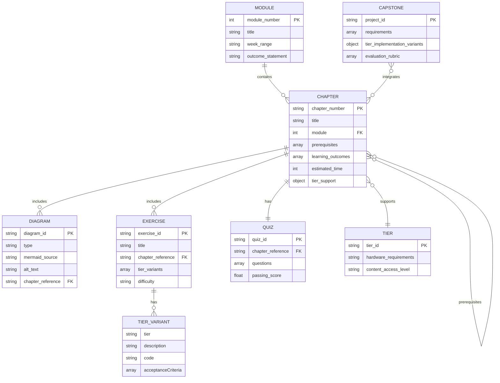

# Data Model: Physical AI & Humanoid Robotics Textbook

**Date**: 2025-12-04 | **Feature**: 001-robotics-textbook

## Overview

This document defines the entities, relationships, and validation rules for the textbook content structure. All entities are represented as MDX files with YAML frontmatter or React components.

---

## Entity Definitions

### Module

**Purpose**: Represents a major learning phase (Modules 1-4) containing multiple weeks of chapters.

**Attributes**:
- `module_number`: integer (1-4)
- `title`: string (e.g., "Foundations", "Simulation", "Navigation", "VLA")
- `week_range`: string (e.g., "1-5", "6-7")
- `outcome_statement`: string (overall module learning goal)
- `chapter_list`: array of chapter IDs

**Relationships**:
- Contains many `Chapter` entities

**Validation Rules**:
- Module must have 2-3 chapters per week (FR-001)
- Weeks must not overlap between modules
- All 13 weeks must be covered across 4 modules

**File Representation**:
```
frontend/docs/module-{number}/index.md
```

**Example**:
```yaml
---
module_number: 1
title: "Foundations of Physical AI"
week_range: "1-5"
outcome_statement: "Understand ROS 2 fundamentals, URDF modeling, and control theory basics"
---

# Module 1: Foundations of Physical AI

This module covers...

## Chapters
- Week 1: ROS 2 Basics
- Week 2: ROS 2 Advanced
- Week 3: URDF Modeling
- Week 4: Sensors & Actuators
- Week 5: Control Theory
```

---

### Chapter

**Purpose**: Represents a single topic/lesson with structured pedagogical content.

**Attributes**:
- `chapter_number`: string (e.g., "1.1", "2.3")
- `title`: string
- `module`: integer (1-4, reference to Module)
- `prerequisites`: array of strings (chapter IDs or concept names)
- `learning_outcomes`: array of strings (Bloom's Taxonomy statements)
- `estimated_time`: integer (minutes)
- `tier_support`: object `{A: boolean, B: boolean, C: boolean}`
- `tags`: array of strings (e.g., ["ros2", "fundamentals"])

**Relationships**:
- Belongs to one `Module`
- References prerequisite `Chapter` entities
- Contains multiple `Diagram` entities
- Contains multiple `Exercise` entities
- Contains one `Quiz` entity

**Validation Rules**:
- Must follow pedagogical structure: Analogy → Concept → Diagram → Example → Exercise → Summary → Quiz (FR-003)
- Must have `tier_support.A = true` (Tier A mandatory, FR-008)
- `learning_outcomes` must use Bloom's Taxonomy verbs (Explain, Describe, Implement, Create)
- `chapter_number` must match file naming convention

**File Representation**:
```
frontend/docs/module-{n}/week-{w}/ch{nn}-{slug}.mdx
```

**Example**:
```yaml
---
chapter_number: "1.1"
title: "Introduction to Physical AI"
module: 1
prerequisites: ["basic-python", "command-line"]
learning_outcomes:
  - "Explain the difference between narrow AI and embodied AI"
  - "Identify three current humanoid robot systems"
  - "Describe the sensor-action loop in Physical AI systems"
estimated_time: 45
tier_support:
  A: true
  B: false
  C: false
tags: ["physical-ai", "concepts", "fundamentals"]
---

# Introduction to Physical AI

## Analogy
Physical AI is like a chef in a kitchen...

## Core Concept
...

## Diagram
<MermaidDiagram ... />

## Example
...

## Exercise
<Exercise ... />

## Summary
...

## Quiz
<Quiz ... />
```

---

### Learning Tier

**Purpose**: Represents hardware/capability levels (A: Laptop, B: Edge AI, C: Physical Robot).

**Attributes**:
- `tier_id`: enum ("A" | "B" | "C")
- `hardware_requirements`: string description
- `content_access_level`: enum ("mandatory" | "optional")

**Tier Definitions**:
- **Tier A (Simulation)**: CPU-only laptop, Gazebo/Isaac Sim conceptual, mandatory for all learners
- **Tier B (Edge AI)**: Jetson Nano/Orin, real sensor integration, optional extension
- **Tier C (Physical Robot)**: Unitree Go2/G1 or equivalent humanoid, sim-to-real, optional extension

**Relationships**:
- Referenced by `Chapter.tier_support`
- Determines `Exercise` variant availability

**Validation Rules**:
- Tier A must always be true in `chapter.tier_support` (FR-008, FR-009)
- Tier C content must include `:::danger` safety admonitions (Constitution IV)

**File Representation**:
- Not a standalone file
- Embedded in Chapter frontmatter and Exercise component props
- Documented in `frontend/docs/resources/hardware-tiers.md`

---

### Exercise/Lab

**Purpose**: Hands-on practice activity with tier-specific implementations.

**Attributes**:
- `exercise_id`: string (unique identifier)
- `title`: string
- `chapter_reference`: string (chapter ID)
- `tier_variants`: array of `TierVariant` objects
- `difficulty`: enum ("beginner" | "intermediate" | "advanced")

**TierVariant Object**:
```typescript
{
  tier: "A" | "B" | "C",
  description: string,
  setup?: string,
  code?: string,
  acceptanceCriteria: string[],
  solution?: string
}
```

**Relationships**:
- Belongs to one `Chapter`
- Has 1-3 tier variants (Tier A mandatory)

**Validation Rules**:
- Must have at least one Tier A variant (FR-008)
- Tier A variant must be CPU-only, no GPU/hardware required
- Tier C variant must include Dead Man Switch pattern if motor control involved (Constitution IV)

**File Representation**:
- Inline in Chapter MDX using `<Exercise>` component

**Example**:
```mdx
<Exercise
  id="ex-1-1-sensor-action"
  title="Map Sensor-Action Pairs"
  difficulty="beginner"
  variants={[
    {
      tier: "A",
      description: "Identify sensor-action pairs in simulated robot (Gazebo)",
      code: "# Launch Gazebo simulation\ngazebo --verbose worlds/simple_robot.world",
      acceptanceCriteria: [
        "Identify at least 3 sensor types (camera, LiDAR, IMU)",
        "Map each sensor to corresponding actuator action"
      ],
      solution: "See solution guide in resources/solutions/ch01.md"
    },
    {
      tier: "B",
      description: "Deploy sensor pipeline on Jetson with real camera",
      setup: "Connect USB camera to Jetson Nano",
      code: "# ROS 2 camera node\nros2 run usb_cam usb_cam_node_exe",
      acceptanceCriteria: [
        "Camera publishes to /image_raw topic",
        "Verify image data with rqt_image_view"
      ]
    }
  ]}
/>
```

---

### Diagram

**Purpose**: Visual learning aid rendered with Mermaid.js.

**Attributes**:
- `diagram_id`: string (unique identifier)
- `type`: enum ("architecture" | "flow" | "graph" | "sequence" | "state" | "class")
- `mermaid_source`: string (Mermaid syntax)
- `alt_text`: string (accessibility description, required)
- `caption`: string (optional)
- `chapter_reference`: string (chapter ID)

**Relationships**:
- Belongs to one `Chapter`

**Validation Rules**:
- Must have `alt_text` prop (FR-007, Constitution accessibility)
- `alt_text` must describe diagram structure and key takeaway
- Mermaid syntax must be valid (build-time validation)

**File Representation**:
- Inline in Chapter MDX using `<MermaidDiagram>` component

**Example**:
```mdx
<MermaidDiagram
  id="diagram-1-1-sensor-loop"
  type="flow"
  source={`
    flowchart LR
      A[Sensors] --> B[Perception]
      B --> C[Planning]
      C --> D[Action]
      D --> E[Actuators]
      E -.feedback.-> A
  `}
  altText="Physical AI sensor-action loop: Sensors collect data, Perception processes it,
           Planning decides actions, Action executes via Actuators, which create feedback
           to Sensors. This continuous loop enables embodied intelligence."
  caption="Figure 1.1: The Physical AI sensor-perception-action loop"
/>
```

---

### Quiz

**Purpose**: Knowledge validation assessment at end of chapter.

**Attributes**:
- `quiz_id`: string (unique identifier)
- `chapter_reference`: string (chapter ID)
- `questions`: array of `QuizQuestion` objects
- `passing_score`: float (default 0.7 for 70%, FR-019)

**QuizQuestion Object**:
```typescript
{
  id: string,
  question: string,
  type: "multiple-choice" | "true-false" | "short-answer",
  options?: string[],
  correctAnswer: string | number,
  hint: string,  // Link to concept section
  explanation: string
}
```

**Relationships**:
- Belongs to one `Chapter`
- Links questions to chapter sections via `hint` field

**Validation Rules**:
- Must have at least 3 questions covering all learning outcomes
- `hint` must reference specific section in chapter (FR-019)
- `passing_score` must be 0.7 (70%) per spec requirement

**File Representation**:
- Inline in Chapter MDX using `<Quiz>` component

**Example**:
```mdx
<Quiz
  id="quiz-1-1"
  chapterReference="1.1"
  passingScore={0.7}
  questions={[
    {
      id: "q1",
      question: "What is the primary difference between narrow AI and embodied AI?",
      type: "multiple-choice",
      options: [
        "Narrow AI processes text, embodied AI processes sensor data",
        "Narrow AI runs on servers, embodied AI runs on robots",
        "Narrow AI lacks physical interaction, embodied AI interacts with world",
        "Narrow AI is faster, embodied AI is slower"
      ],
      correctAnswer: 2,
      hint: "Review the 'Core Concept' section on embodied intelligence",
      explanation: "Embodied AI is characterized by physical world interaction through sensors and actuators, unlike narrow AI systems that operate purely in digital domains."
    },
    // ... more questions
  ]}
/>
```

---

### Capstone Project

**Purpose**: Module 4 culminating project integrating all learning (Whisper → LLM → Nav2 → Action).

**Attributes**:
- `project_id`: string ("capstone-voice-nav")
- `requirements`: array of strings (feature requirements)
- `tier_implementation_variants`: object `{A: conceptual, B: simulation, C: hardware}`
- `evaluation_rubric`: array of criteria with point values
- `submission_guidelines`: string

**Relationships**:
- Integrates concepts from all `Chapter` entities across all `Module` entities

**Validation Rules**:
- Must be implementable at Tier A level (conceptual design, FR-015)
- Must integrate concepts from all 4 modules
- Evaluation rubric must align with module learning outcomes

**File Representation**:
```
frontend/docs/capstone/voice-controlled-navigation.mdx
```

**Example**:
```yaml
---
project_id: "capstone-voice-nav"
estimated_time: 180
tier_support:
  A: true   # Conceptual design document
  B: true   # Full simulation in Gazebo
  C: true   # Physical Unitree deployment
---

# Capstone Project: Voice-Controlled Robot Navigation

## Requirements
- Voice input via Whisper speech-to-text
- LLM intent parsing ("go to kitchen" → Nav2 goal)
- Nav2 path planning and obstacle avoidance
- Action execution and completion feedback

## Tier A: Conceptual Design
Design a system architecture document showing...

## Tier B: Simulation Implementation
Deploy full pipeline in Gazebo with simulated microphone...

## Tier C: Physical Robot Deployment
:::danger Hardware Safety
Before deploying to physical robot, ensure...
:::

Deploy on Unitree Go2/G1 with real hardware...

## Evaluation Rubric
- Architecture clarity (20 points)
- Whisper integration (20 points)
- LLM intent parsing accuracy (20 points)
- Nav2 path planning (20 points)
- System integration (20 points)
```

---

## Entity State Transitions

### Chapter Lifecycle
```
Draft → Under Review → Revision Needed → Under Review → Published
```

- **Draft**: Chapter spec created by Curriculum Architect
- **Under Review**: Submitted for human review
- **Revision Needed**: Feedback provided, back to Technical Content Writer
- **Published**: Merged into main branch, deployed

### Exercise Lifecycle
```
Defined → Tier A Implemented → Tier B/C Extended → Validated
```

- **Defined**: Exercise outlined in chapter spec
- **Tier A Implemented**: Simulation variant complete (mandatory)
- **Tier B/C Extended**: Hardware variants added (optional)
- **Validated**: Acceptance criteria tested and passing

### Quiz Lifecycle
```
Created → Validated → Deployed
```

- **Created**: Questions written with hints
- **Validated**: Hints link to correct sections, 70% threshold confirmed
- **Deployed**: Integrated into chapter MDX

---

## Validation Rules Summary

| Entity | Rule | Enforcement |
|--------|------|-------------|
| Module | 2-3 chapters per week | Manual review |
| Chapter | Tier A support mandatory | `validate_tiers.py` |
| Chapter | Pedagogical structure complete | `validate_frontmatter.py` |
| Chapter | Learning outcomes use Bloom's verbs | Human review |
| Exercise | Tier A variant present | `validate_tiers.py` |
| Exercise | Tier C has Dead Man Switch if motor control | Human code review |
| Diagram | altText prop required | `validate_diagrams.py` |
| Diagram | Valid Mermaid syntax | Build-time validation |
| Quiz | Hints link to sections | Human review |
| Quiz | 70% passing score | Component default value |
| Capstone | Tier A implementable | Human review |

---

## File Structure Mapping

```
frontend/docs/
├── index.md                                    # Landing page
├── module-1/
│   ├── index.md                               # Module entity
│   ├── week-1/
│   │   ├── ch01-physical-ai-intro.mdx         # Chapter entity
│   │   │   # Contains: Diagram, Exercise, Quiz entities
│   │   ├── ch02-ros2-nodes-topics.mdx
│   │   └── ch03-ros2-services-actions.mdx
│   ├── week-2/
│   │   └── ...
│   └── week-3/
│       └── ...
├── module-2/
│   └── ...
├── module-3/
│   └── ...
├── module-4/
│   ├── week-11/
│   ├── week-12/
│   └── week-13/
│       └── ch28-capstone-project.mdx          # Capstone entity
├── resources/
│   ├── glossary.md
│   ├── hardware-tiers.md                      # Tier documentation
│   └── ros2-cheatsheet.md
└── capstone/
    └── voice-controlled-navigation.mdx         # Capstone entity (alternative location)
```

---

## Relationships Diagram



---

## Next Steps

1. Use this data model to generate contracts (frontmatter schema, TypeScript interfaces)
2. Create validation scripts that enforce these rules
3. Update agent prompts to generate content matching these entities
4. Document entity relationships in quickstart.md for content authors
