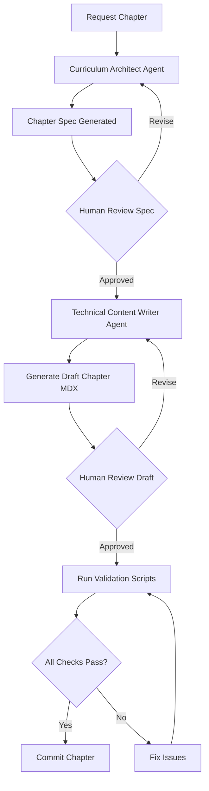

# Quickstart Guide: Physical AI & Humanoid Robotics Textbook

**Date**: 2025-12-04 | **Feature**: 001-robotics-textbook

## Overview

This guide helps developers and content authors contribute to the Physical AI & Humanoid Robotics textbook. Follow these steps to set up your environment, understand the content authoring workflow, and create high-quality chapters.

---

## 1. Developer Onboarding

### Prerequisites
- Node.js 18+ and npm 9+
- Git
- Python 3.12+ (for validation scripts)
- Code editor (VS Code recommended)

### Initial Setup

```bash
# 1. Clone repository
git clone https://github.com/your-org/physical-ai-humanoid-robotics.git
cd physical-ai-humanoid-robotics

# 2. Install frontend dependencies
cd frontend
npm install

# 3. Install Python dependencies (for validation)
cd ..
pip install -r requirements.txt

# 4. Run local development server
cd frontend
npm run start
```

**Expected Result**: Browser opens at `http://localhost:3000` showing textbook landing page.

### Repository Structure

```
physical-ai-humanoid-robotics/
├── frontend/                      # Docusaurus application
│   ├── docs/                     # MDX content (chapters)
│   │   ├── module-1/
│   │   ├── module-2/
│   │   ├── module-3/
│   │   ├── module-4/
│   │   └── resources/
│   ├── src/
│   │   ├── components/           # React components (Quiz, Exercise, etc.)
│   │   └── css/
│   ├── docusaurus.config.ts      # Docusaurus configuration
│   └── sidebars.ts               # Navigation sidebar
├── .claude/
│   ├── agents/                   # Curriculum Architect, Technical Content Writer
│   └── skills/                   # analogy-concept-explainer, etc.
├── tests/
│   ├── e2e/                      # Playwright tests
│   ├── content/                  # Validation scripts
│   └── code-examples/            # ROS 2 code tests
├── specs/001-robotics-textbook/  # Design documents
│   ├── spec.md
│   ├── plan.md
│   ├── research.md
│   ├── data-model.md
│   ├── quickstart.md (this file)
│   └── contracts/
└── requirements.txt              # Python dependencies
```

---

## 2. Content Authoring Workflow

### Overview



### Step 1: Request Chapter from Curriculum Architect

**Purpose**: Generate structured chapter specification with learning outcomes, content outline, and tier requirements.

**How to Request** (via agent prompt or command):
```bash
# Example agent request
"Generate chapter spec for Module 1, Week 1, Chapter 1: Introduction to Physical AI"
```

**Agent Output**: `specs/001-robotics-textbook/contracts/chapter-spec-1-1.md`

**Review Checklist**:
- [ ] Learning outcomes use Bloom's Taxonomy verbs
- [ ] Tier A variant fully specified (no hardware dependencies)
- [ ] Diagram specifications include alt-text guidance
- [ ] Quiz questions cover all learning outcomes
- [ ] Safety considerations identified
- [ ] Prerequisites clearly listed

### Step 2: Pass Spec to Technical Content Writer

**Purpose**: Generate full chapter MDX with pedagogical content, diagrams, exercises, and quiz.

**How to Request**:
```bash
# Example agent request
"Implement chapter 1.1 using spec at specs/001-robotics-textbook/contracts/chapter-spec-1-1.md"
```

**Agent Uses Three Skills**:
1. `analogy-concept-explainer` → Generates Analogy section
2. `mermaid-diagram-generator` → Generates Diagram section
3. `ros2-code-example-writer` → Generates code for Example and Exercise sections

**Agent Output**: `frontend/docs/module-1/week-1/ch01-physical-ai-intro.mdx`

### Step 3: Review Generated Chapter

**Content Review Checklist**:
- [ ] Frontmatter follows schema (`contracts/chapter-frontmatter.yaml`)
- [ ] Pedagogical structure complete: Analogy → Concept → Diagram → Example → Exercise → Summary → Quiz
- [ ] All diagrams have `altText` prop
- [ ] Tier A content has no GPU/hardware requirements
- [ ] Quiz hints link to specific sections
- [ ] Code examples are executable
- [ ] Safety admonitions present before hardware instructions (if Tier B/C)
- [ ] References cited for technical claims

### Step 4: Run Validation Scripts

```bash
# Validate frontmatter
python tests/content/validate_frontmatter.py frontend/docs/module-1/week-1/ch01-physical-ai-intro.mdx

# Validate diagrams have alt-text
python tests/content/validate_diagrams.py frontend/docs/module-1/week-1/ch01-physical-ai-intro.mdx

# Validate Tier A coverage
python tests/content/validate_tiers.py frontend/docs/module-1/week-1/ch01-physical-ai-intro.mdx

# Run all validators
pytest tests/content/
```

**Expected Result**: All checks pass with no errors.

### Step 5: Test Code Examples (if applicable)

```bash
# Extract and test ROS 2 code examples
pytest tests/code-examples/test_ch01.py
```

**Expected Result**: Code executes successfully in ROS 2 Docker container.

### Step 6: Commit Chapter

```bash
git add frontend/docs/module-1/week-1/ch01-physical-ai-intro.mdx
git commit -m "Add Chapter 1.1: Introduction to Physical AI"
git push origin feature/module-1-week-1
```

---

## 3. Chapter Creation Checklist

Use this checklist when creating or reviewing chapters:

### Frontmatter
- [ ] `chapter_number` matches file naming convention (e.g., "1.1" for `ch01-...`)
- [ ] `title` is concise and descriptive
- [ ] `module` is 1-4
- [ ] `prerequisites` array lists all required prior knowledge
- [ ] `learning_outcomes` use Bloom's Taxonomy verbs (Explain, Describe, Implement, Create)
- [ ] `estimated_time` is reasonable (30-90 minutes typical)
- [ ] `tier_support.A` is `true` (mandatory)
- [ ] `tags` array includes relevant topics

### Pedagogical Structure
- [ ] **Analogy Section**: Real-world analogy introduces concept
- [ ] **Concept Section**: Formal definition and technical explanation
- [ ] **Diagram Section**: At least one Mermaid diagram with altText
- [ ] **Example Section**: Worked example with annotated code (if applicable)
- [ ] **Exercise Section**: Hands-on activity with Tier A variant
- [ ] **Summary Section**: 3-5 key takeaways
- [ ] **Quiz Section**: 3-5 questions with hints and 70% pass threshold

### Tier A Coverage
- [ ] All core content accessible without GPU/hardware
- [ ] Simulations use CPU-only Gazebo or conceptual exercises
- [ ] Code examples run on standard laptop
- [ ] No dependencies on Jetson, physical robots, or expensive software

### Diagram Alt-Text
- [ ] Every `<MermaidDiagram>` has `altText` prop
- [ ] Alt-text describes diagram structure and key takeaway
- [ ] Alt-text is 50-200 characters (optimal screen reader length)

### Quiz Hint Linking
- [ ] Every quiz question has `hint` field
- [ ] Hints reference specific chapter sections (e.g., "Review Concept section on embodied intelligence")
- [ ] Passing score is 0.7 (70%)

### Safety Admonitions
- [ ] `:::danger` blocks precede all hardware instructions (Tier B/C)
- [ ] Dead Man Switch pattern documented if motor control involved
- [ ] Emergency stop procedures explained
- [ ] Workspace boundaries mentioned

### References
- [ ] Authoritative sources cited for formulas
- [ ] Hardware safety claims reference manufacturer specs
- [ ] ROS 2 documentation linked where applicable

---

## 4. Component Usage

### TierBadge Component

```mdx
<TierBadge tiers={["A", "B"]} />
```
Displays: 🟢 A | 🔵 B

### MermaidDiagram Component

```mdx
<MermaidDiagram
  id="diagram-1-1-sensor-loop"
  type="flow"
  source={`
    flowchart LR
      A[Sensors] --> B[Perception]
      B --> C[Planning]
      C --> D[Action]
  `}
  altText="Sensor-perception-action loop showing continuous feedback cycle"
  caption="Figure 1.1: Physical AI Loop"
/>
```

### Exercise Component

```mdx
<Exercise
  id="ex-1-1-sensor-action"
  title="Map Sensor-Action Pairs"
  difficulty="beginner"
  variants={[
    {
      tier: "A",
      description: "Identify sensors in Gazebo simulation",
      code: "ros2 launch turtlebot3_gazebo empty_world.launch.py",
      acceptanceCriteria: ["Identify 3+ sensor types", "Map sensors to actions"]
    }
  ]}
/>
```

### Quiz Component

```mdx
<Quiz
  id="quiz-1-1"
  chapterReference="1.1"
  questions={[
    {
      id: "q1",
      question: "What is embodied AI?",
      type: "multiple-choice",
      options: ["AI in robots", "AI with sensors", "AI with physical interaction"],
      correctAnswer: 2,
      hint: "Review Core Concept section",
      explanation: "Embodied AI interacts with the physical world via sensors and actuators."
    }
  ]}
/>
```

---

## 5. Testing

### Run E2E Tests

```bash
cd frontend
npm run test:e2e
```

**Tests**:
- `navigation.spec.ts`: Sidebar navigation through all modules
- `quiz-interaction.spec.ts`: Quiz functionality (answer, hints, scoring)
- `accessibility.spec.ts`: Keyboard navigation, alt-text, color contrast

### Validate Frontmatter

```bash
python tests/content/validate_frontmatter.py frontend/docs/module-1/week-1/*.mdx
```

**Checks**:
- All required frontmatter fields present
- `chapter_number` format correct
- Learning outcomes use Bloom's verbs
- Tier A support present

### Check Diagram Alt-Text

```bash
python tests/content/validate_diagrams.py frontend/docs/module-1/**/*.mdx
```

**Checks**:
- All `<MermaidDiagram>` components have `altText` prop
- Alt-text is non-empty

### Test ROS 2 Code Examples

```bash
pytest tests/code-examples/test_examples.py
```

**Checks**:
- Code extracts from MDX files
- Executes in ROS 2 Humble Docker container
- Exits with code 0 (success)

---

## 6. Deployment

### Build Production Site

```bash
cd frontend
npm run build
```

**Expected Output**: `frontend/build/` directory with static HTML/CSS/JS

### Test Production Build Locally

```bash
npm run serve
```

**Expected Result**: Site accessible at `http://localhost:3000` with production optimizations

### Deploy to Hosting Platform

**Vercel**:
```bash
vercel --prod
```

**Netlify**:
```bash
netlify deploy --prod --dir=frontend/build
```

**GitHub Pages**:
```bash
npm run deploy
```

### Post-Deployment Checks
- [ ] All pages load successfully
- [ ] Search functionality works
- [ ] Diagrams render correctly
- [ ] Page load time < 3 seconds (Lighthouse test)
- [ ] Mobile responsiveness verified

---

## 7. Common Issues & Troubleshooting

### Issue: Mermaid Diagram Not Rendering

**Symptom**: Blank space where diagram should be

**Solution**:
1. Check Mermaid syntax validity at https://mermaid.live/
2. Ensure `@docusaurus/theme-mermaid` plugin installed
3. Verify `mermaid: true` in `docusaurus.config.ts`

### Issue: Frontmatter Validation Fails

**Symptom**: `validate_frontmatter.py` reports schema errors

**Solution**:
1. Check `contracts/chapter-frontmatter.yaml` for required fields
2. Ensure `tier_support.A` is `true` (not missing)
3. Verify learning outcomes use Bloom's verbs (Explain, Describe, etc.)

### Issue: Code Example Fails in Docker

**Symptom**: `test_examples.py` exits with error

**Solution**:
1. Verify ROS 2 Humble dependencies in `requirements.txt`
2. Check code is self-contained (no missing imports)
3. Ensure code doesn't require GUI (use headless mode for Gazebo)

### Issue: Accessibility Test Fails

**Symptom**: `accessibility.spec.ts` reports violations

**Solution**:
1. Check all images have alt-text
2. Verify color contrast >= 4.5:1 (use browser DevTools)
3. Test keyboard navigation (Tab, Enter, Escape)

---

## 8. Resources

- **Design Documents**: `specs/001-robotics-textbook/`
  - `spec.md` - User stories and requirements
  - `plan.md` - Implementation plan
  - `research.md` - Technology decisions
  - `data-model.md` - Entity definitions
  - `contracts/` - Component interfaces

- **External Documentation**:
  - [Docusaurus Documentation](https://docusaurus.io/docs)
  - [Mermaid.js Documentation](https://mermaid.js.org/)
  - [ROS 2 Humble Documentation](https://docs.ros.org/en/humble/)
  - [WCAG 2.1 Guidelines](https://www.w3.org/WAI/WCAG21/quickref/)

- **Community**:
  - GitHub Issues: Report bugs and request features
  - Discussions: Ask questions and share ideas

---

## 9. Contribution Workflow

1. **Create Feature Branch**: `git checkout -b feature/module-X-week-Y`
2. **Generate Chapter Spec**: Use Curriculum Architect agent
3. **Implement Chapter**: Use Technical Content Writer agent
4. **Run Validators**: `pytest tests/content/`
5. **Test Locally**: `npm run start` and manual review
6. **Commit Changes**: `git commit -m "Add Chapter X.Y: Title"`
7. **Push Branch**: `git push origin feature/module-X-week-Y`
8. **Create Pull Request**: Include validation results in PR description
9. **Human Review**: Wait for content review and approval
10. **Merge**: Merge to main branch after approval

---

## Quick Reference Commands

```bash
# Start dev server
cd frontend && npm run start

# Run all validators
pytest tests/content/

# Run E2E tests
cd frontend && npm run test:e2e

# Build production
cd frontend && npm run build

# Validate single chapter
python tests/content/validate_frontmatter.py frontend/docs/module-1/week-1/ch01-*.mdx

# Test ROS 2 code
pytest tests/code-examples/
```

---

**Status**: Ready for Use
**Last Updated**: 2025-12-04
