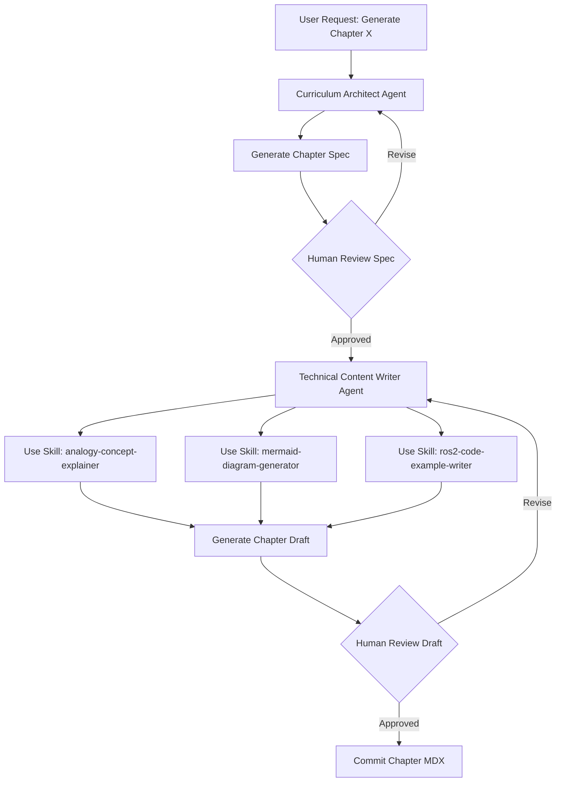

# Research: Physical AI & Humanoid Robotics Textbook

**Date**: 2025-12-04 | **Feature**: 001-robotics-textbook

## Overview

This document consolidates research findings for implementing the Physical AI & Humanoid Robotics textbook platform using Docusaurus, addressing pedagogical patterns, technical capabilities, and content workflows.

---

## R1: Docusaurus Pedagogical Patterns

### Decision
Use Docusaurus 3.x with TypeScript, MDX for interactive content, custom React components for pedagogical elements (Quiz, Exercise, TierBadge), and structured frontmatter for metadata.

### Rationale
- **MDX Support**: Allows embedding React components directly in Markdown for interactive quizzes, exercises, and tier-specific content
- **Mermaid Plugin**: `@docusaurus/theme-mermaid` provides native diagram rendering without external dependencies
- **Frontmatter Flexibility**: YAML frontmatter supports structured metadata (learning outcomes, prerequisites, tier support)
- **Static Generation**: Fast load times (<3s) suitable for 26-39 chapters with search indexing
- **Educational Examples**: Hasura Learn, Deno Manual, Supabase Docs successfully use Docusaurus for technical education

### Alternatives Considered
- **GitBook**: Less flexible component customization, requires paid tier for advanced features
- **VuePress**: Smaller ecosystem, fewer educational examples, less TypeScript support
- **Custom Next.js**: Higher development overhead, no built-in doc navigation/search

### Implementation Notes

**Frontmatter Schema** (enforced in all chapters):
```yaml
---
chapter_number: "1.1"
title: "Introduction to Physical AI"
module: 1
prerequisites: ["basic-python", "command-line"]
learning_outcomes:
  - "Explain the difference between narrow AI and embodied AI"
  - "Identify three current humanoid robot systems"
estimated_time: 45
tier_support:
  A: true  # Mandatory
  B: true  # Optional Jetson extension
  C: false # No physical robot content
tags: ["foundations", "concepts"]
---
```

**Component Architecture**:
- `TierBadge.tsx`: Visual indicator (🟢 A | 🔵 B | 🟣 C) in chapter headers
- `Quiz.tsx`: Self-assessment with immediate feedback, hint links, 70% pass threshold
- `Exercise.tsx`: Hands-on activities with tier-specific variants (A: simulation, B: Jetson, C: robot)
- `PrerequisiteCheck.tsx`: Expandable prerequisite list with links to foundational chapters

**Plugin Configuration** (`docusaurus.config.ts`):
```typescript
module.exports = {
  plugins: [
    '@docusaurus/theme-mermaid',
    '@docusaurus/plugin-content-docs',
  ],
  markdown: {
    mermaid: true,
  },
  themeConfig: {
    mermaid: {
      theme: {light: 'neutral', dark: 'dark'},
    },
  },
};
```

**Sidebar Structure** (`sidebars.ts`):
```typescript
module.exports = {
  tutorialSidebar: [
    'index',
    {
      type: 'category',
      label: 'Module 1: Foundations',
      items: [
        'module-1/index',
        {type: 'category', label: 'Week 1', items: ['module-1/week-1/ch01-physical-ai-intro', ...]},
        {type: 'category', label: 'Week 2', items: [...]},
        // ... weeks 3-5
      ],
    },
    // ... modules 2-4
  ],
};
```

---

## R2: Mermaid.js Diagram Capabilities for Robotics

### Decision
Use Mermaid.js flowcharts for ROS 2 graphs, sequence diagrams for VLA pipelines, class diagrams for URDF hierarchies. For complex 3D visualizations (Isaac Sim viewports), use screenshot + detailed alt-text fallback.

### Rationale
- **ROS 2 Computation Graphs**: Mermaid flowcharts effectively represent nodes, topics, and data flow
- **Nav2 Architecture**: Sequence diagrams show temporal relationships (sensor → costmap → planner → controller)
- **URDF Hierarchies**: Tree/class diagrams represent parent-child joint relationships
- **Accessibility Built-in**: SVG output supports screen readers; custom alt-text adds context
- **Version Control Friendly**: Mermaid source is plain text, easy to diff and review
- **No External Tools**: No dependency on draw.io, Lucidchart, or image editors

### Diagram Type Mapping

| Robotics Concept | Mermaid Type | Example |
|------------------|--------------|---------|
| ROS 2 computation graph | `flowchart LR` | Node relationships, topic pub/sub |
| Nav2 planning pipeline | `sequenceDiagram` | Sensor → planner → controller flow |
| URDF robot hierarchy | `graph TD` | Joint parent-child tree |
| VLA action flow | `flowchart TD` | Whisper → LLM → Nav2 → Action |
| State machines | `stateDiagram-v2` | Robot behavior states (idle/navigate/manipulate) |
| Software architecture | `C4Context` or `classDiagram` | System component relationships |

### Limitations and Fallbacks

**Cannot Represent**:
- 3D robot meshes (URDF visual elements) → Fallback: 2D tree diagram + link to external viewer
- Isaac Sim viewport screenshots → Fallback: Static image with detailed alt-text describing scene
- Complex mathematical formulas → Fallback: LaTeX rendering with KaTeX plugin

**Example Fallback Pattern**:
```mdx
<!-- For 3D visualization -->
<MermaidDiagram
  type="graph"
  source="graph TD; base-->shoulder; shoulder-->elbow; elbow-->wrist"
  altText="URDF hierarchy showing humanoid arm: base link connects to shoulder joint,
           which connects to elbow joint, which connects to wrist joint. Each joint
           allows 1 degree of freedom rotation."
/>

:::tip 3D Visualization
For interactive 3D view, see [Unitree G1 URDF viewer](https://example.com/viewer)
:::
```

### Alt-Text Template

```typescript
// For each diagram type, enforce structured alt-text
interface AltTextTemplate {
  overview: string;      // "This diagram shows..."
  components: string[];  // ["Component A does X", "Component B does Y"]
  relationships: string; // "A connects to B via topic /cmd_vel"
  keyTakeaway: string;   // "This illustrates how ROS nodes communicate"
}
```

---

## R3: ROS 2 Code Example Testing Strategy

### Decision
Extract code snippets from MDX, execute in ROS 2 Humble Docker container via pytest, validate output against expected behavior. Pin ROS 2 Humble, Python 3.10, and rclpy 3.3.x.

### Rationale
- **Reproducibility**: Docker ensures consistent ROS 2 environment across development machines
- **Automated Validation**: CI/CD pipeline catches breaking changes before deployment
- **Version Pinning**: Prevents rclpy API changes from breaking examples
- **Minimal Overhead**: Pytest integrates with existing Python testing workflow

### Testing Workflow

```bash
# Extract code from MDX → Execute in container → Validate output

1. Parse MDX files, extract code blocks with `language="python"` and `test="true"` attribute
2. Mount code into ROS 2 Humble Docker container
3. Run `pytest tests/code-examples/test_examples.py`
4. Validate: script exits with code 0, expected ROS topics published, no error logs
```

### Dependency Management

**requirements.txt** (pinned versions):
```
rclpy==3.3.11
sensor_msgs==4.2.3
nav2_msgs==1.1.5
geometry_msgs==4.2.3
std_msgs==4.2.3
```

**package.xml** (for ROS 2 packages):
```xml
<package format="3">
  <depend>rclpy</depend>
  <depend>sensor_msgs</depend>
  <depend>nav2_msgs</depend>
  <test_depend>pytest</test_depend>
</package>
```

### CI Configuration (GitHub Actions)

```yaml
# .github/workflows/test-code-examples.yml
name: Test ROS 2 Code Examples
on: [push, pull_request]
jobs:
  test:
    runs-on: ubuntu-latest
    container: ros:humble-ros-base
    steps:
      - uses: actions/checkout@v3
      - run: pip install pytest
      - run: pytest tests/code-examples/
```

### Example Test

```python
# tests/code-examples/test_examples.py
import subprocess
import pytest

def test_chapter_01_hello_ros():
    """Test basic ROS 2 publisher from Chapter 1"""
    result = subprocess.run(
        ["python3", "extracted_code/ch01_publisher.py"],
        capture_output=True,
        timeout=5
    )
    assert result.returncode == 0
    assert b"Publishing" in result.stdout
```

---

## R4: Three-Tier Content Architecture

### Decision
Use Docusaurus Tabs component for inline Tier B/C extensions, with Tier A always visible as default tab. Mark tier availability with badges in chapter headers.

### Rationale
- **Tier A Always Visible**: Ensures all learners see simulation-first content (no hardware required)
- **Progressive Disclosure**: Learners can expand Tier B/C content when ready for hardware
- **Single Page Experience**: No navigation away from main chapter for extensions
- **Clear Visual Hierarchy**: Badges (🟢 A | 🔵 B | 🟣 C) show available tiers at a glance

### Tier Content Organization

```mdx
---
tier_support: {A: true, B: true, C: false}
---

# Chapter 2.1: ROS 2 Nodes and Topics

<TierBadge tiers={["A", "B"]} />

## Core Concept (Tier A - Always Visible)

ROS 2 nodes communicate via topics using a publish-subscribe pattern...

<MermaidDiagram type="flowchart" source="..." altText="..." />

## Hands-On Exercise

<Tabs groupId="tier">
  <TabItem value="tierA" label="🟢 Tier A: Simulation" default>
    ```python
    # CPU-only Gazebo simulation
    import rclpy
    # ... simulation code
    ```
  </TabItem>

  <TabItem value="tierB" label="🔵 Tier B: Jetson Edge">
    ```python
    # Deploy to Jetson with real camera
    import rclpy
    from sensor_msgs.msg import Image
    # ... edge deployment code
    ```

    :::danger Hardware Safety
    Ensure emergency stop button is accessible before running motor commands.
    :::
  </TabItem>
</Tabs>
```

### Tier Progression Messaging

**End of Tier A Section**:
```mdx
:::tip Ready for Hardware?
You've mastered the simulation concepts! If you have access to:
- **Jetson Nano/Orin** → See Tier B extension above for edge deployment
- **Unitree Robot** → See Tier C extension in Week 7 for physical robot integration
:::
```

### Visual Tier Indicators

**CSS** (`custom.css`):
```css
.tier-badge-A { background: #10b981; color: white; }  /* Green */
.tier-badge-B { background: #3b82f6; color: white; }  /* Blue */
.tier-badge-C { background: #8b5cf6; color: white; }  /* Purple */
```

---

## R5: Pedagogical Content Workflow with Agents

### Decision
Two-agent workflow: **Curriculum Architect** generates chapter specification with learning outcomes and structure, then **Technical Content Writer** generates full chapter content using three skills (analogy-concept-explainer, mermaid-diagram-generator, ros2-code-example-writer).

### Rationale
- **Separation of Concerns**: Architect focuses on pedagogy/sequencing, Writer focuses on content quality
- **Consistent Structure**: All chapters follow same template generated by Architect
- **Reusable Skills**: Three skills ensure consistent style (analogies), technical accuracy (diagrams), and executable code (ROS 2 examples)
- **Human Review Gates**: Spec review before content generation, content review before merge

### Agent Workflow



### Chapter Spec Template (Architect Output)

**File**: `specs/001-robotics-textbook/contracts/chapter-spec.md`

```markdown
# Chapter Spec: 1.1 - Introduction to Physical AI

## Metadata
- Chapter Number: 1.1
- Module: 1 (Foundations)
- Prerequisites: ["basic-python", "command-line"]
- Estimated Time: 45 minutes
- Tier Support: A (mandatory), B (optional), C (N/A)

## Learning Outcomes (Bloom's Taxonomy)
1. **Explain** the difference between narrow AI and embodied AI (Understand)
2. **Identify** three current humanoid robot systems and their capabilities (Remember)
3. **Describe** the sensor-perception-action loop in physical AI (Understand)

## Content Outline
1. **Analogy**: "Physical AI is like a chef in a kitchen..." (use analogy-concept-explainer skill)
2. **Concept**: Define embodied intelligence, contrast with LLMs
3. **Diagram**: Mermaid flowchart showing sensor → perception → planning → action loop (use mermaid-diagram-generator skill)
4. **Examples**: Tesla Optimus, Figure 02, Boston Dynamics Spot
5. **Exercise**: Identify sensor-action pairs in real-world robots (Tier A: conceptual mapping)
6. **Summary**: Key takeaways (3-5 bullets)
7. **Quiz**: 5 questions covering learning outcomes

## Safety Considerations
- N/A (conceptual chapter, no motor control)

## References
- [Russell & Norvig AIMA 4th ed, Ch 25: Robotics]
- [Tesla AI Day 2022: Optimus Humanoid]
```

### Content Review Checklist

**Before Merging Chapter** (automated + human):
- ✅ Frontmatter validates against schema (`validate_frontmatter.py`)
- ✅ All `<MermaidDiagram>` components have altText prop (`validate_diagrams.py`)
- ✅ Tier A content present (`validate_tiers.py`)
- ✅ Learning outcomes use Bloom's Taxonomy verbs (human review)
- ✅ Code examples tested in ROS 2 container (CI pipeline)
- ✅ Safety admonitions present before hardware instructions (human review)
- ✅ References cited for formulas and safety claims (human review)

---

## R6: Accessibility Compliance

### Decision
Target WCAG 2.1 Level AA compliance with automated testing via Playwright + axe-core. Enforce alt-text for all diagrams, keyboard navigation for all interactive elements, and 4.5:1 color contrast.

### Rationale
- **Legal Requirement**: Many educational institutions require WCAG 2.1 AA for course materials
- **Broader Reach**: Screen reader support enables visually impaired learners
- **Better UX**: Keyboard navigation benefits power users and motor-impaired users
- **Automated Enforcement**: axe-core catches 57% of accessibility issues automatically

### Accessibility Checklist

**Perceivable**:
- ✅ All images have alt-text (enforced by `MermaidDiagram` component requiring `altText` prop)
- ✅ Color contrast 4.5:1 for text, 3:1 for UI components (custom.css uses WCAG-compliant palette)
- ✅ No information conveyed by color alone (tier badges use emoji + text labels)

**Operable**:
- ✅ All functionality available via keyboard (Tab, Enter, Escape)
- ✅ Focus indicators visible (custom.css adds 2px outline)
- ✅ No keyboard traps (Docusaurus theme handles modal focus management)

**Understandable**:
- ✅ Consistent navigation (Docusaurus sidebar)
- ✅ Clear error messages (Quiz component shows "Incorrect, see Concept section 2.3")
- ✅ Prerequisites listed before complex content

**Robust**:
- ✅ Valid HTML5 (Docusaurus build validates)
- ✅ ARIA labels for custom components (Quiz, Exercise)

### Testing Approach

**Automated Tests** (`tests/e2e/accessibility.spec.ts`):
```typescript
import { test, expect } from '@playwright/test';
import AxeBuilder from '@axe-core/playwright';

test('Chapter 1.1 accessibility', async ({ page }) => {
  await page.goto('/module-1/week-1/ch01-physical-ai-intro');

  const accessibilityScanResults = await new AxeBuilder({ page }).analyze();

  expect(accessibilityScanResults.violations).toEqual([]);
});

test('Keyboard navigation', async ({ page }) => {
  await page.goto('/');
  await page.keyboard.press('Tab');  // Focus on first link
  await page.keyboard.press('Enter'); // Navigate
  expect(page.url()).toContain('/module-1');
});
```

**Manual Testing** (human review):
- Screen reader testing (NVDA on Windows, VoiceOver on macOS)
- Keyboard-only navigation through full chapter
- Color blindness simulation (browser DevTools)

### Remediation Plan

If accessibility issues found:
1. **Critical** (blocks screen readers): Fix immediately, block deployment
2. **Serious** (keyboard navigation broken): Fix before next release
3. **Moderate** (color contrast 3.8:1 instead of 4.5:1): Fix in polish phase

---

## Technology Decisions Summary

| Decision Area | Technology Choice | Rationale |
|---------------|-------------------|-----------|
| **Platform** | Docusaurus 3.x TypeScript | MDX support, Mermaid plugin, educational examples, static generation |
| **Diagrams** | Mermaid.js | Version control friendly, accessibility, no external tools |
| **Code Testing** | Docker + pytest + ROS 2 Humble | Reproducible environment, automated validation, CI/CD integration |
| **Tier Architecture** | Docusaurus Tabs with badges | Progressive disclosure, single-page experience, clear hierarchy |
| **Content Workflow** | 2-agent + 3-skill pipeline | Separation of concerns, consistent quality, human review gates |
| **Accessibility** | WCAG 2.1 AA + Playwright + axe-core | Legal compliance, automated enforcement, broader reach |

---

## Next Steps

1. ✅ Research complete → Proceed to Phase 1 (Design)
2. Generate `data-model.md` using entity definitions from spec
3. Generate `contracts/` with frontmatter schema, component interfaces
4. Generate `quickstart.md` with developer onboarding workflow
5. Update agent context with tech stack (Docusaurus, Mermaid, ROS 2 Humble)
